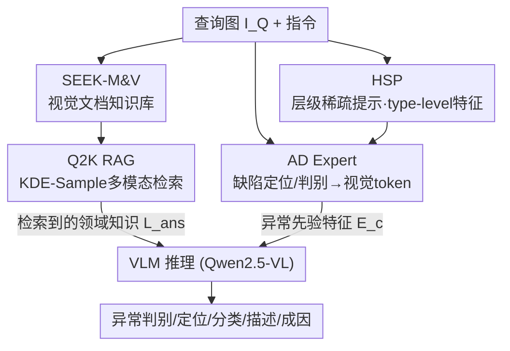

# ADSeeker: A Knowledge-Grounded Reasoning Framework for Industry Anomaly Detection and Reasoning

**会议**: CVPR 2026  
**论文**: [CVF Open Access](https://openaccess.thecvf.com/content/CVPR2026/html/Zhang_ADSeeker_A_Knowledge-Grounded_Reasoning_Framework_for_Industry_Anomaly_Detection_and_CVPR_2026_paper.html)  
**代码**: 待确认  
**领域**: 多模态VLM / 工业异常检测  
**关键词**: 工业异常检测, 多模态RAG, 零样本异常检测, 异常推理, 视觉文档知识库

## 一句话总结
ADSeeker 是一个免大规模预训练、即插即用的工业异常检测（IAD）助手：用首个视觉文档知识库 SEEK-M&V + 多模态检索框架 Q2K RAG 给通用 MLLM 注入异常领域知识，再配合 AD Expert 把缺陷定位/判别信息融进视觉 token、用层级稀疏提示（HSP）提取 type-level 缺陷特征，在 12 个工业/医学数据集的零样本异常检测和 MMAD 异常推理上都拿到 SOTA。

## 研究背景与动机
**领域现状**：把多模态大模型（MLLM）用到工业异常检测上是近两年的热门方向。已有工作如 AnomalyGPT、Anomaly-OV、Myriad 走的都是「在 IAD 数据上直接微调 / 接专家感知模块」的路线，想把领域知识灌进基座模型，用来做缺陷检测、描述、分析。

**现有痛点**：作者把瓶颈拆成两条具体短板：① **预训练阶段没有充分整合异常检测知识**，导致模型定位不准、做不了精细的缺陷分析；② **缺乏技术精确、上下文感知的语言生成能力**，异常推理（不只是判断有没有，还要说清类型/位置/成因/后果）质量远低于人类质检专家。而走微调路线又会引入新问题——标准 fine-tune 容易**灾难性遗忘**基座的对齐能力，加上 IAD 数据集太小，模型会过拟合到狭窄的答案模板上，泛化很差。

**核心矛盾**：想让模型「专」（懂异常领域）就得训练注入知识，但训练又会牺牲「通」（基座的泛化和语言能力），两者存在 trade-off；而且现有 ZSAD 方法普遍用 **object-level 提示**（如 "wood"、"leather" 这种物体类别），根本描述不了「划痕 / 孔洞 / 裂纹」这种跨物体通用的缺陷模式。

**本文目标**：在**不做大规模预训练**、保住基座泛化能力的前提下，给通用 MLLM 外挂一套异常领域知识，让它的检测和推理都达到专家级。

**切入角度**：作者的关键观察是「一图胜千言」——异常检测里图像特征至关重要，而现有 RAG 知识库几乎全是纯文本。于是用**视觉文档知识库 + 多模态检索**来外部注入知识（而非内部微调），并把提示从 object-level 升级到 **type-level（缺陷类型级）**。

**核心 idea**：用「外挂多模态知识检索（Q2K RAG over SEEK-M&V）+ 视觉缺陷先验融合（AD Expert）+ 类型级稀疏提示（HSP）」三件套，取代「在小数据上微调注入知识」，实现免训练、即插即用的知识接地异常推理。

## 方法详解

### 整体框架
ADSeeker 以公开 MLLM（Qwen2.5-VL）为主干、CLIP（ViT-L/14@336px）为 AD Expert 的编码器，整个框架冻结基座、只训练少量外挂模块。给定一张查询图 $I_Q$ 和一句指令，框架走**两条知识注入通路并行**：

1. **知识检索通路**：把查询图编码成 **Key 特征** $K_Q$、把 SEEK-M&V 知识库的视觉文档编码成 **Lock 特征** $L=\{L_0,...,L_{n-1}\}$，在两者的联合特征空间里做多模态混合检索（Q2K RAG），用 KDE-Sample 策略挑出最相关的领域知识文档 $L_{ans}$。
2. **缺陷先验通路**：AD Expert 用 CLIP 把视觉嵌入 $E_p$ 和正/负文本嵌入 $E_t$ 对齐，算出缺陷定位/判别信息，融合成异常先验特征 $E_c=\{Loc, Vis\}$；同时 HSP 机制在 CLIP 各层逐层稀疏化无关信息、保留缺陷区域的关键视觉特征，并把 MulA 数据集聚类得到的 **type-level 文本提示** $T_p, T_n$（如 "A image with [cls] defect type"）注入进来。

最后把 $L_{ans}$（外部知识）和 $E_c$（缺陷先验）一起喂给 VLM，由它做指令处理和复杂推理，输出异常判别 / 定位 / 分类 / 描述 / 成因分析。其中 type-level 提示由「$K_Q$ 匹配到 MulA 预定义聚类质心 → 自动生成对应缺陷类型提示」得到，比 ZSAD 常用的 "Img of a [obj]" 更细粒度。

### 关键设计

**1. SEEK-M&V：首个工业异常的视觉文档知识库**

痛点直接对应「预训练没整合 AD 知识」+「现有 RAG 知识库只有纯文本」。作者构建了 IAD 领域**第一个保留图像信息的多模态知识库** SEEK-M&V（基于 MVTec & VisA）：每篇知识文档都有特定的参考页面，记录缺陷类型、缺陷分析、缺陷描述；并额外补上产品的生产场景、应用场景作为背景信息。更关键的是，作者用 **DeepSeek-R1 生成语义丰富的描述和应用场景介绍**来扩充文档内容，把「一图胜千言」落到实处——每种异常类型都配图文，给异常推理提供可检索的专家参照。和已有 training-based 方法相比，这种外挂知识库的方式在效率和效果上都更优，因为它不动基座、避免了灾难性遗忘。

**2. Q2K RAG：用 KDE-Sample 解决工业知识库的重复检索问题**

痛点是「怎么从视觉知识库里准确捞到对的那篇文档」。Q2K RAG（Query Image→Knowledge）借鉴 VisRAG，把查询图的 Key 特征 $K_Q$ 和知识文档的 Lock 特征 $L$ 投影到对齐空间，算余弦相似度并排序：$S(K_Q,L)=\{S_i\,|\,\cos(K_Q,L_i),\,L_i\in L\}$，理想情况下取 top-K 即可，作者测得 seek 准确率达 **83%**。但工业知识库按类别组织，**同类物体的不同缺陷高度相似**，简单 top-k 经常重复检索到同一类、捞不到产品场景信息。作者的洞察是：同类信息（缺陷、车间等）的相似度分数基本服从高斯分布，于是用 **Bayesian Gaussian Mixture Modeling** 自动推断最优簇数 $K$ 并对相似度分数做 GMM 聚类，再用核密度估计（KDE）算每个簇的概率密度权重并压缩原分布：

$$W_n = \frac{1}{K}\sum_{m\in i_n}\exp\big(W^*(m)-\max_n W^*(n)\big)$$

检索时按 $W_n$ 的比例**从每个簇里动态采样**（簇内按分数降序），采够阈值就停。这样既覆盖了不均匀分布的领域知识、又避免了纯 top-k 的冗余——文本检索和视觉检索对不同特征强弱不一，不做自适应采样混合检索就会重复，KDE-Sample 按数据分布优化了信息价值。

**3. AD Expert：把缺陷定位/判别信息混合进视觉 token**

痛点是原始 MLLM 处理的只是普通视觉 token，缺少定位、判别这类异常先验。AD Expert 通过算 patch 嵌入 $E_p$ 与正文本嵌入 $E_t^p$、负文本嵌入 $E_t^n$ 的余弦相似度，导出异常定位信息：

$$Loc = \text{Unsample}\Big(\frac{\cos(E_p, E_t^n)}{\cos(E_p, E_t^p)+\cos(E_p, E_t^n)}\Big)$$

再用一个神经网络把查询图 $I_Q$ 转成视觉嵌入 $Vis$，与定位信息拼成异常先验嵌入 $E_c=\{Loc, Vis\}$ 送进 VLM。这样语义丰富的视觉嵌入能帮模型生成细粒度的异常描述，并直接提升 image-level 的异常检测性能——相当于把「专家眼里该看哪、是不是异常」这种先验，显式编码成 VLM 能消化的视觉 token。

**4. HSP（层级稀疏提示）：模仿人类质检的注意力，逐层稀疏化提取缺陷特征**

痛点是 object-level 提示提不出通用缺陷模式，且无关区域噪声多、算力浪费。HSP 受「人做工业质检时注意力集中在缺陷区域、不是均匀分布」启发，设计了带压缩感知和稀疏优化的可学习提示模块。把查询图缺陷特征经线性层得到查询嵌入 $E_q\in\mathbb{R}^{B\times d}$，引入可学习提示嵌入 $E_l\in\mathbb{R}^{K\times d}$ 和自适应参数 $P_i$，经 $N$ 轮迭代更新提取关键特征：第 $n$ 轮残差 $R_n=E_q-P_n E_l^{n-1}$，梯度 $G_n=-\mu\cdot E_q^T P_n E_l$；并结合迭代软阈值算法（ISTA）和稀疏化理论计算转换因子 $P_n^*$。整个稀疏优化对应目标：

$$\mathcal{L}=\min_{P}\frac{1}{2}\|E_q-P_n^* E_l\|_2^2 + \lambda\|P_n^*\|_1$$

其中稀疏系数 $\lambda$ 表示丢弃基础特征的比例。⚠️ 原文 $P_n^*$ 的完整 ISTA 闭式（公式 8）符号较密，以原文为准。最终嵌入 $E_f$ 在 vision/text encoder 前向时融合到一定深度，并与 type-level 文本提示拼接，增强对异常模式的细粒度理解。配合用 MulA 聚类得到的 type-level 特征（区分 "scratch" vs "hole"），HSP 显著减少了由「疑似异常区域」引发的幻觉。

### 损失函数 / 训练策略
框架冻结基座 MLLM 和 CLIP，只训练 AD Expert / HSP 等外挂模块。HSP 的可学习嵌入按上式 $\mathcal{L}$（重建项 + L1 稀疏项）经反向传播自动更新；CLIP 在 MVTec AD 上微调以评测其他数据集的零样本性能（评测 MVTec AD 时训练集换成 VisA，且测试时停用 Q2K RAG 防止测试集泄漏）。作者额外构建了一个 43K 的小规模指令微调数据集（取自 AD 数据集和 SEEK-M&V 内容），但消融显示外挂检索优于 LoRA 微调（见下）。

## 实验关键数据

### 主实验
**零样本异常检测（Image-Level AUROC，12 个工业+医学数据集，部分见下表）**：ADSeeker 在多数 benchmark 上取得 SOTA，平均排名第一。

| 数据集 | CLIP | WinCLIP | AnomalyCLIP | AdaCLIP | Anomaly-OV | **ADSeeker** |
|--------|------|---------|-------------|---------|------------|--------------|
| MVTec AD | 74.1 | 91.8 | 91.5 | 89.2 | 94.0 | **94.3** |
| VisA | 66.4 | 78.8 | 82.1 | 85.8 | 91.1 | **91.5** |
| BTAD | 34.5 | 68.2 | 88.3 | 88.6 | 89.0 | **94.0** |
| MPDD | 54.3 | 63.6 | 77.0 | 76.0 | 81.7 | **85.9** |
| BrainMRI | 73.9 | 92.6 | 90.3 | 94.8 | 93.9 | **97.5** |
| Br35H | 78.4 | 80.5 | 94.6 | 97.7 | 95.5 | **97.9** |
| **Average** | 62.6 | 80.8 | 88.2 | 89.1 | 91.8 | **94.0** |

**异常推理（MMAD benchmark，1-shot，Seek-Setting 即插即用）**：把 Q2K RAG + AD Expert 当插件挂到各开源 MLLM 上，平均准确率普遍提升。ADSeeker（Qwen2.5-VL-7B under Seek-Setting）达 69.90%，主要在缺陷分类、定位、异常判别上提升明显。

| 基座模型 | 设置 | 平均准确率 |
|----------|------|-----------|
| LLaVA-OV-7B | Baseline → Seek | 63.19 → 66.61 (+3.42) |
| LLaVA-NeXT-7B | Baseline → Seek | 59.32 → 65.96 (+6.64) |
| InternVL2-8B | Baseline → Seek | 63.14 → 68.05 (+4.91) |
| Qwen2.5-VL-3B | Baseline → Seek | 62.94 → 68.53 (+5.59) |
| Qwen2.5-VL-7B (ADSeeker) | Baseline → Seek | 66.62 → **69.90** (+3.28) |

### 消融实验
| 配置 | (子任务1, 子任务2) 准确率 | 说明 |
|------|---------------------------|------|
| Baseline (Qwen2.5-VL) | (76.6, 67.1) | 仅基座 |
| + Q2K RAG | (78.6, 68.2) | 外部知识检索单独有效 |
| + AD Expert | (77.9, 67.7) | 缺陷先验单独有效 |
| **+ 两者全开** | **(82.8, 71.4)** | 完整 ADSeeker，最优 |
| LoRA 5 epoch | (80.0, 71.0) | 短训练尚可 |
| LoRA 10 epoch | (72.8, 59.7) | 过拟合开始掉点 |
| LoRA 20 epoch | (40.9, 33.2) | 灾难性遗忘，崩溃 |

**效率（Tab. 5）**：相比同规模基座，ADSeeker 仅增加 ≤27% 显存（22.63→28.36 GiB）、≤2s 平均推理延迟（4.47→6.14 s），具备实时工业部署潜力。

### 关键发现
- **Q2K RAG 与 AD Expert 高度互补**：单独各加约 +1～2 点，全开则跳到 (82.8, 71.4)，说明「外部知识」管分类/判别、「缺陷先验」管定位，两条通路打的是不同子任务。
- **外挂检索完胜微调**：LoRA 在 5 epoch 尚可，但 10/20 epoch 急剧崩溃（20 epoch 跌到 40.9/33.2），印证了「小数据微调→过拟合 + 灾难性遗忘」的动机；Q2K RAG 在泛化性和精度上都超过 LoRA。
- **type-level 特征是零样本关键**：正常样本与 [obj]-only 提示对齐更强，异常样本则与 [cls]&[obj] 提示峰值相似；缺陷样本上 [cls] 提示的特征值显著高于 [obj]，证明把提示从物体级升到缺陷类型级是 ZSAD 提升的来源。
- **即插即用普适**：Seek-Setting 挂到 5 个不同基座（LLaVA-OV/NeXT、InternVL2、Qwen2.5-VL 3B/7B）几乎都涨点，说明框架与具体基座解耦。

## 亮点与洞察
- **「外挂知识检索」替代「微调注入知识」**：这是全文最核心的范式选择——用多模态 RAG 在推理时动态注入领域知识，绕开预训练/微调，既省算力又保住基座泛化，消融里 LoRA 20 epoch 的崩溃正面反衬了这条路的价值。
- **KDE-Sample 解决了 RAG 在「同类高相似」库上的重复检索**：把相似度服从高斯分布这一观察，转成 GMM 聚类 + KDE 加权的分簇动态采样，是个可迁移到任何「类内高相似」检索库的通用 trick（不只工业异常）。
- **type-level 提示 + 视觉知识库双管齐下**：用 DeepSeek-R1 扩写视觉文档、用 MulA 聚类自动生成缺陷类型提示，把「缺陷模式」从隐式变成可检索/可提示的显式知识，思路可迁移到医学影像、遥感等同样缺标注的细粒度检测任务。
- **MulA 数据集**：11,226 张图、26 类、72 种多尺度缺陷类型，覆盖灰度/RGB/X-ray，是当前规模最大的 AD 数据集，且专门补了 type-level 标注和合成正常样本，缓解了 IAD 数据稀缺。

## 局限与展望
- **依赖知识库覆盖面**：作者承认 SEEK-M&V 内容有限，对比训练方法时只能用 MMAD 的一部分来评测；遇到知识库未覆盖的新产品/新缺陷，检索质量会下降。⚠️ seek 准确率 83% 也意味着约 1/6 的查询拿不到最相关文档。
- **检索准确率天花板**：Q2K RAG 的整体表现受限于「能不能检索对」，KDE-Sample 缓解了重复检索但没根治高排名才命中的问题。
- **未用 RL 微调**：作者指出 Anomaly-R1 用 GRPO 在小训练集上效果突出，建议未来工作引入 RL 策略——暗示纯检索 + 先验注入仍有上限。
- **个人观察**：异常推理评测主要是 MMAD 的多选子任务（准确率指标），对开放式缺陷成因/后果描述的质量缺乏更严格的人评或细粒度评分；公式 8 的稀疏优化推导较密，复现门槛偏高。

## 相关工作与启发
- **vs AnomalyGPT / Anomaly-OV / Myriad（微调注入）**：它们在 IAD 数据上直接 fine-tune 或接专家模块把知识灌进基座，受训练知识范围限制、泛化差且易遗忘；ADSeeker 改为外挂多模态知识库 + RAG，免训练、保泛化，消融里直接证明外挂检索优于 LoRA。
- **vs WinCLIP / AnomalyCLIP / AdaCLIP（ZSAD 提示学习）**：它们靠 CLIP 的 patch-文本相似度做零样本检测，但用的是 object-level 提示，提不出跨物体的通用缺陷模式；ADSeeker 用 HSP + type-level 特征（"scratch"/"hole" 级）提取细粒度缺陷，并在 MVTec/VisA/BTAD/MPDD 上全面超过它们。
- **vs Anomaly-R1（RL 训练）**：Anomaly-R1 用 GRPO 微调拿到强结果，但需要训练；ADSeeker 无需额外训练即可在异常推理上超过它，作者同时认可 RL 路线、建议未来融合。

## 评分
- 新颖性: ⭐⭐⭐⭐⭐ 首个工业异常视觉文档知识库 + Q2K RAG（KDE-Sample）+ HSP type-level 提示，把「外挂多模态检索免训练注入领域知识」做成完整方案。
- 实验充分度: ⭐⭐⭐⭐ 覆盖 12 个工业/医学数据集、5 个基座的即插即用、模块消融和效率分析都到位；开放式推理质量评测略弱、部分对比受限于知识库覆盖。
- 写作质量: ⭐⭐⭐⭐ 动机与方法叙述清晰，图示充分；个别公式（HSP 稀疏优化）符号偏密、可读性一般。
- 价值: ⭐⭐⭐⭐⭐ 免训练、即插即用、低开销（≤27% 显存、≤2s 延迟），对工业实时质检和缺标注细粒度检测都有很强落地与迁移价值。

<!-- RELATED:START -->

## 相关论文

- [\[CVPR 2026\] Reasoning-Driven Anomaly Detection and Localization with Image-Level Supervision](reasoning-driven_anomaly_detection_and_localization_with_image-level_supervision.md)
- [\[ICLR 2026\] Traceable Evidence Enhanced Visual Grounded Reasoning: Evaluation and Method](../../ICLR2026/object_detection/traceable_evidence_enhanced_visual_grounded_reasoning_evaluation_and_methodology.md)
- [\[CVPR 2025\] Towards Zero-Shot Anomaly Detection and Reasoning with Multimodal Large Language Models](../../CVPR2025/object_detection/towards_zero-shot_anomaly_detection_and_reasoning_with_multimodal_large_language.md)
- [\[CVPR 2026\] Heuristic-inspired Reasoning Priors Facilitate Data-Efficient Referring Object Detection](heuristic-inspired_reasoning_priors_facilitate_data-efficient_referring_object_d.md)
- [\[CVPR 2026\] HeROD: Heuristic-inspired Reasoning Priors Facilitate Data-Efficient Referring Object Detection](herod_heuristic_inspired_reasoning_data_efficient_rod.md)

<!-- RELATED:END -->
