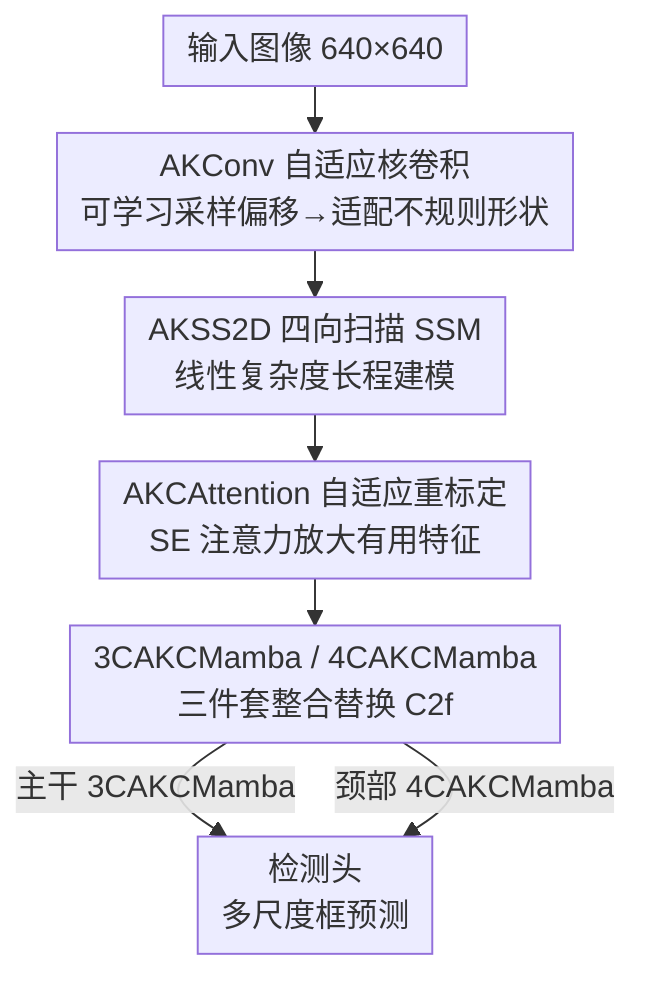

# AKCMamba-YOLO: Selective State Space Models For Real-Time Object Detection

**会议**: CVPR 2026  
**论文**: [CVF Open Access](https://openaccess.thecvf.com/content/CVPR2026/html/Chen_AKCMamba-YOLO_Selective_State_Space_Models_For_Real-Time_Object_Detection_CVPR_2026_paper.html)  
**代码**: https://github.com/xlllchen/AKCMamba_YOLO （有）  
**领域**: 实时目标检测  
**关键词**: YOLO, 状态空间模型, Mamba, 自适应核卷积, 多尺度特征融合

## 一句话总结
本文把选择性状态空间模型（Mamba/SSM）和自适应核卷积塞进 YOLOv8，用 3CAKCMamba / 4CAKCMamba 两个模块替换主干和颈部的 C2f 块，在保持 YOLO 线性复杂度、实时速度的同时补上卷积"看不远"的短板，COCO2017 上以 14.9G FLOPs 拿到 46.3% mAP（比 YOLOv8-S 高 1.4%、FLOPs 省 47.9%）。

## 研究背景与动机

**领域现状**：YOLO 系列从 v4 一路演进到 v11，靠纯卷积设计把实时检测的精度-速度平衡做到了极致，是工业部署的事实标准。但卷积有个绕不过去的物理特性——感受野是局部的。

**现有痛点**：局部感受野让 YOLO 在需要全局推理的复杂场景里吃亏：多尺度目标、严重遮挡、长程依赖（比如要把空间上分离但语义相关的物体联系起来）。这些场景下纯卷积只能靠堆深度间接扩大感受野，效率低且容易丢小目标。

**核心矛盾**：想要全局建模能力，最直接的办法是上 Transformer 自注意力，但自注意力对输入尺寸是**二次复杂度**，计算开销和延迟在实时检测里直接劝退。于是矛盾就卡在这里：**既要卷积网络的高速低复杂度，又要 Transformer 的全局表征能力**，两者似乎不可兼得。

**切入角度**：Mamba 这类选择性状态空间模型（SSM）提供了第三条路——它用输入相关的选择机制 + 线性时间的递归形式实现长序列建模，复杂度是**线性**的，已经在语言和图像分类上证明了全局建模能力。作者的关键问题是：能不能把选择性 SSM 嵌进 YOLO，在不牺牲实时性的前提下补上全局上下文这块短板？

**核心 idea**：设计两个"内容感知"模块 3CAKCMamba（主干用）和 4CAKCMamba（颈部用），整体替换 YOLOv8 的 C2f 块。每个模块把**自适应核卷积**（局部、动态采样）、**AKSS2D**（四向扫描 + 选择性 SSM 的长程建模）、**AKCAttention**（自适应特征重标定）三件套串成一体，实现从"静态局部卷积"到"动态序列建模"的范式切换。

## 方法详解

### 整体框架
AKCMamba-YOLO 建立在 YOLOv8 框架之上，输入 640×640 图像，输出多尺度检测框。它的改造很"外科手术"：不动 YOLOv8 的整体拓扑（主干—颈部—检测头），只把主干里的 C2f 块换成 **3CAKCMamba** 模块、把颈部的 C2f 块换成 **4CAKCMamba** 模块。这两个模块内部都由同一套底层组件搭成——AKCBlock 作基本单元、3CAKC/4CAKC 做多尺度局部特征提取、AKSS2D 做长程依赖建模、AKCAttention 做特征重标定。直觉上：3CAKC/4CAKC 负责"看清细节并适配不规则形状"，AKSS2D 负责"看得远、把全局上下文捞回来"，AKCAttention 负责"把有用的特征放大、冗余的压下去"，三者顺序叠加就构成一个既会看局部又会看全局的检测块。

### 关键设计

**1. AKConv 自适应核卷积：让卷积核形状跟着目标长**

标准卷积的采样位置是固定网格，对形状千变万化的目标（细长的风筝线、不规则的鸟巢）天然不友好，而且想扩大核就得付出参数二次增长的代价。AKConv（AKCBlock 的核心算子）改成**可学习采样形状**：在初始坐标 $P_n$ 上加一组学到的偏移 $\Delta P_n$，得到自适应采样点 $\hat P_n = P_n + \Delta P_n$，位置 $p_0$ 处的卷积变成 $\text{AKConv}(p_0)=\sum_{n=1}^{N} w_n \cdot X(p_0+\hat P_n)$。这样采样点能主动贴合不规则结构，且参数随核大小**线性增长**而非二次。AKCBlock 在此基础上加了动态短路机制——根据条件在残差连接 $\omega(\omega(\text{AKConv}(z_{l-1})))\oplus z_{l-1}$ 和直连输出之间自适应切换（$\omega$ 是 1×1 卷积做通道对齐），兼顾网络灵活性和训练稳定性。3CAKC / 4CAKC 则把 AKCBlock 堆成三层 / 四层的多尺度提取流水线（4CAKC 比 3CAKC 多一层卷积变换，做更深的特征加工），都用残差连接缓解梯度消失。

**2. AKSS2D 四向扫描状态空间模块：用线性复杂度补全局视野**

这是补"看不远"短板的核心。SSM 把一维序列 $x(t)$ 经隐状态 $h(t)$ 映射到输出 $y(t)$，连续形式为 $h'(t)=Ah(t)+Bx(t),\ y(t)=Ch(t)$；离散化（零阶保持）后写成 $h_k=\bar A h_{k-1}+\bar B x_k,\ y_k=Ch_k$，其中 $\bar A=\exp(\Delta A)$、$\bar B=(\Delta A)^{-1}(\exp(\Delta A)-I)\cdot\Delta B$，$\Delta$ 是时间尺度参数。Mamba 的关键是**选择机制**——让 $B,C,\Delta$ 变成输入相关，从而做上下文感知的内容过滤；输出也可写成全局卷积 $y=x*K$，$K=(C\bar B, C\bar A\bar B,\dots,C\bar A^{N-1}\bar B)$ 是结构化卷积核。但 SSM 本是为一维序列设计的，图像是二维，怎么扫是关键。AKSS2D 用 **S6 块（选择性 SSM）** 配合**四向扫描**：把特征图沿四个对角方向（左上→右下、左下→右上、右下→左上、右上→左下）展开成序列，分别过 S6 块做选择性建模，再把四个方向的输出求和、reshape 回原始空间尺寸。四向扫描保证空间覆盖完整，避免单向扫描的方向偏置；扫描前先用 AKConv 做特征适配 $z_l=\text{LN}(\text{AKConv}(z_{l-1}))$。整个过程线性复杂度，这正是它相比自注意力能"看得远又不拖慢实时性"的根本原因。

**3. AKCAttention 自适应特征重标定：把扫回来的全局特征做一次精选**

长程建模捞回了全局上下文，但里面混着冗余。AKCAttention 在 AKConv 提取的特征上接一个 squeeze-and-excitation 风格的空间-通道注意力 $\text{SeA}$：$z_l=\text{SeA}(\omega(\omega(\text{AKConv}(z_{l-1})))\oplus z_{l-1})$（同样带可切换的残差），根据通道间依赖重新标定每个通道的重要性，放大关键特征、抑制冗余信息。消融里它在 Railway 数据集上比 SE、CBAM、MHA 都好，且 FPS（29.2）反而高于多头注意力（26.9）——因为它把重标定和自适应卷积融在一起，用很小的开销实现了更精准的特征选择。

**4. 3CAKCMamba / 4CAKCMamba 整合模块：把三件套拼成一个可直接替换 C2f 的检测块**

前三个设计是零件，这一步把它们装成整机。3CAKCMamba 的处理流写成 $z_l=\psi(\text{LN}(\phi(\text{LN}(\text{3CAKC}(\omega(z_{l-1}))))\oplus\omega(z_{l-1})))$，其中 $\phi$ 是 AKSS2D、$\psi$ 是 AKCAttention——即"局部提取（3CAKC）→ 长程建模（AKSS2D）→ 自适应选择（AKCAttention）"顺序串联，外面套残差。4CAKCMamba 结构同理，只是把 3CAKC 换成更深的 4CAKC，用在颈部做更强的多尺度融合与特征重组。主干用 3CAKCMamba 做深层特征挖掘 + 跨层语义融合，颈部用 4CAKCMamba 增强通道交互、聚合多尺度上下文，二者都即插即换地顶替原 C2f，既保留 YOLOv8 的工程优势又注入了全局建模能力。

### 损失函数 / 训练策略
完全沿用 YOLOv8 的检测损失：box loss 权重 7.5、cls loss 0.5、DFL loss 1.5。基于 YOLOv8 训练 500 epoch，batch size 32，SGD 优化器；3 epoch warm-up 后用恒定学习率 0.01（bias lr 0.1，momentum 0.8，weight decay 0.0005）。数据增强用 Mosaic（p=1.0）和 HSV 变换，输入固定 640×640。

## 实验关键数据

### 主实验
COCO2017 val 上和 YOLO 系列对比（精度 + 效率两条线都赢）：

| 模型 | mAP | AP50 | AP75 | Params | FLOPs |
|------|-----|------|------|--------|-------|
| YOLOv8-N | 37.3 | 52.6 | 40.6 | 3.2M | 8.7G |
| YOLOv8-S | 44.9 | 61.8 | 48.6 | 11.2M | 28.6G |
| DAMO YOLO-S | 46.0 | 61.9 | 49.5 | 12.3M | 37.8G |
| Mamba YOLO-T | 45.4 | 62.3 | 49.1 | 6.1M | 14.3G |
| **OURS** | **46.3** | **63.1** | **51.4** | 9.1M | 14.9G |

关键对比：比 YOLOv8-S 高 +1.4% mAP，同时 FLOPs 省 47.9%；比同样用 SSM 的 Mamba YOLO-T 高 +0.9% mAP / +0.8% AP50 / +2.3% AP75，说明"主干+颈部都换 + 自适应核卷积 + 跨尺度融合"的更深整合确实有效。

工业/安全场景两个专用数据集（精度 % / FLOPs）：

| 数据集 | 指标 | YOLOv8-S | YOLOv11 | Mamba YOLO-T | OURS |
|--------|------|----------|---------|--------------|------|
| Power Tower 异物 | Precision / AP50 / AP50:95 | 90.3 / 83.9 / 70.1 | 92.3 / 86.1 / 71.8 | 92.1 / 86.3 / 71.3 | **92.8 / 86.9 / 72.5** |
| Railway 行人 | Precision / AP50 / AP50:95 | 94.6 / 97.2 / 74.2 | 94.8 / 97.1 / 75.1 | 94.8 / 97.1 / 75.1 | **95.1 / 97.4 / 75.5** |

在 Power Tower 上比 YOLOv8-S 提升 +2.5% precision / +3.0% AP50 / +2.4% AP50:95，且 FLOPs（14.9G）远低于 YOLOv11（40G）、YOLOv8-S（28.6G）。Railway 上绝对增益较小，但作者强调安全关键场景里每个检测都重要。

### 消融实验
主干组件逐步叠加（Power Tower 数据集）：

| 3CAKC | AKSS2D | AKCAttention | Precision | AP50 | AP50:95 | FLOPs |
|:---:|:---:|:---:|------|------|---------|-------|
| × | × | × | 89.7 | 83.3 | 67.4 | 8.7G |
| ✓ | × | × | 87.2 | 88.1 | 70.5 | 9.5G |
| ✓ | ✓ | × | 91.4 | 87.5 | 73.0 | 11.1G |
| ✓ | ✓ | ✓ | 92.1 | 87.6 | 75.0 | 11.8G |

注意力机制对比（Railway，YOLOv8 基线上替换）：

| 注意力 | mAP | AP50 | AP75 | FPS |
|--------|-----|------|------|-----|
| Baseline | 93.2 | 95.1 | 73.7 | 28.6 |
| + SE | 93.9 | 95.8 | 74.2 | 27.5 |
| + MHA | 94.1 | 95.7 | 74.1 | 26.9 |
| **+ AKCAttention** | **94.3** | **95.9** | **74.3** | **29.2** |

### 关键发现
- **AKSS2D 是涨点主力**：主干消融里加上 AKSS2D 后 AP50:95 从 70.5 → 73.0（+2.5%），验证选择性 SSM 对长程依赖的价值；计算效率表里它单独贡献 +1.3% mAP（C2f→AKSS2D），是三件套里增益最大的。
- **3CAKC 单独加时 precision 反而略降（89.7→87.2）但 AP50 大涨（83.3→88.1）**：⚠️ 论文未细究这个 precision 回落，疑似自适应卷积单独使用时召回上升、精确率短暂波动，需补 AKSS2D / AKCAttention 才把 precision 拉回 92.1。
- **AKCAttention 性价比最高**：FPS 不降反升（29.2 > 基线 28.6，也高于 MHA 26.9），因为它把重标定和自适应卷积融合，避免了多头注意力的密集计算开销。
- **整体开销可控**：完整三件套相比 C2f 基线只增加 2.4M 参数、0.8ms 延迟，换来 1.6% mAP 提升。
- Grad-CAM 可视化显示，遮挡场景下能推断被遮区域的轮廓形成完整响应、小目标聚焦信息密集区、长程场景下激活空间分离的物体——印证 SSM 的全局建模在定性上确实生效。

## 亮点与洞察
- **"外科手术式"集成**：不重新设计架构，只把 C2f 精准替换成内容感知模块，最大化保留 YOLOv8 的工程成熟度和部署优势——这种"在成熟框架上做局部器官移植"的思路很容易迁移到别的检测器。
- **三件套的分工很清晰**：局部（AKConv 适配形状）→ 全局（AKSS2D 线性长程）→ 精选（AKCAttention 重标定），每一步对应一个明确的能力缺口，不是为了堆模块而堆。
- **四向对角扫描**把一维 SSM 适配到二维图像，是 SSM 视觉化的通用解法，可复用到分割、密集预测等任务。
- 顺手贡献了一个 2,975 张标注的铁路行人检测数据集，填补安全关键场景的评测资源。

## 局限与展望
- **绝对增益偏小**：在 Railway / Power Tower 上相比 Mamba YOLO-T、YOLOv11 的领先多在 0.3~0.5% 量级，方法的边际收益是否值得额外复杂度，作者用"安全关键场景每个检测都重要"来辩护，但说服力有限。
- ⚠️ **消融中 3CAKC 单独使用 precision 下降未解释**：从 89.7 掉到 87.2 这个反常现象论文一笔带过，缺乏机理分析。
- **FPS 数据不全**：主表（Table 1-3）只报了 Params/FLOPs，没给端到端 FPS，只有注意力消融表里有 FPS，实时性的直接证据不够强（FLOPs 低不等于实际延迟低，尤其 SSM 的扫描算子在不同硬件上效率差异大）。
- **参数没省**：相比 Mamba YOLO-T（6.1M），本文 9.1M 参数更大，只是 FLOPs 接近，移植到更受限的边缘设备时优势会缩水。

## 相关工作与启发
- **vs Mamba YOLO**：Mamba YOLO 只把 SSM 集成进 YOLO 主干；本文更深——主干和颈部都换成专用 3CAKCMamba/4CAKCMamba，并引入 AKConv 做自适应特征提取、实现更全面的跨尺度融合，因此在 COCO 上比 Mamba YOLO-T 高 0.9% mAP。
- **vs DETR 系（含 RT-DETR）**：端到端 Transformer 检测器靠自注意力做全局建模但收敛慢、小目标差、轻量化下训练动态复杂；本文走 YOLO + 线性 SSM 路线，保留轻量部署优势的同时补全局视野，定性上 Grad-CAM 显示遮挡/小目标/长程场景都优于 DETR。
- **vs 注意力增强 YOLO（如 Gold-YOLO）**：它们用密集注意力补上下文但带来计算开销；本文用线性复杂度的 SSM 替代注意力，在 FLOPs 远低（14.9G vs Gold-YOLO 12.1G 但精度高一截）的同时拿到全局建模。

## 评分
- 新颖性: ⭐⭐⭐☆☆ 把 SSM + 自适应核卷积深度集成进 YOLO，思路扎实但属于"已知零件的更彻底组合"，与 Mamba YOLO 同源。
- 实验充分度: ⭐⭐⭐⭐☆ 三个数据集 + 主干/颈部/注意力/效率多维消融较完整，但主表缺端到端 FPS、个别反常现象未解释。
- 写作质量: ⭐⭐⭐⭐☆ 结构清晰、公式给全、图示丰富，可读性好。
- 价值: ⭐⭐⭐⭐☆ 工程实用，即插即换 C2f + 开源 + 新数据集，对实时检测落地有参考价值。

<!-- RELATED:START -->

## 相关论文

- [\[CVPR 2026\] YOLO-ULM: Ultra-Lightweight Models for Real-Time Object Detection](yolo-ulm_ultra-lightweight_models_for_real-time_object_detection.md)
- [\[CVPR 2026\] YOLO-Master: MOE-Accelerated with Specialized Transformers for Enhanced Real-time Detection](yolo-master_moe-accelerated_with_specialized_transformers_for_enhanced_real-time.md)
- [\[AAAI 2026\] YOLO-IOD: Towards Real Time Incremental Object Detection](../../AAAI2026/object_detection/yolo-iod_towards_real_time_incremental_object_detection.md)
- [\[CVPR 2026\] DA-Mamba: Learning Domain-Aware State Space Model for Global-Local Alignment in Domain Adaptive Object Detection](da-mamba_learning_domain-aware_state_space_model_for_global-local_alignment_in_d.md)
- [\[CVPR 2026\] Does YOLO Really Need to See Every Training Image in Every Epoch?](does_yolo_really_need_to_see_every_training_image_in_every_epoch.md)

<!-- RELATED:END -->
