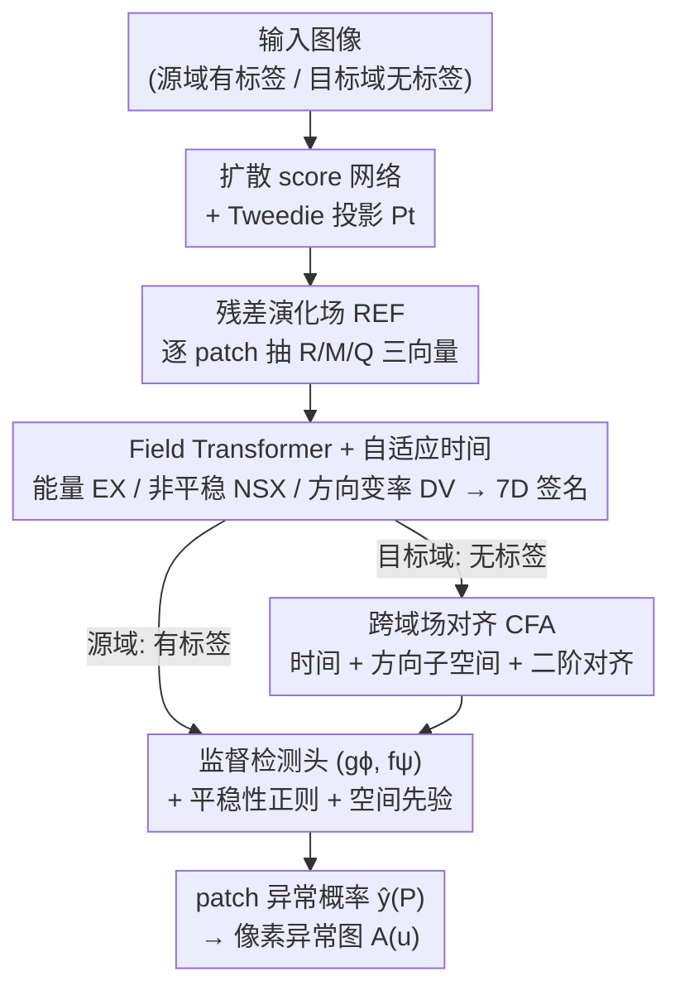

# Anomaly-Related Residual Fields for Cross-domain Anomaly Detection

**会议**: CVPR 2026  
**论文**: [CVF Open Access](https://openaccess.thecvf.com/content/CVPR2026/html/Gao_Anomaly-Related_Residual_Fields_for_Cross-domain_Anomaly_Detection_CVPR_2026_paper.html)  
**代码**: 未公开  
**领域**: 异常检测 / 跨域迁移  
**关键词**: 跨域异常检测, 扩散模型残差, 残差演化场, 域对齐, 无标签迁移

## 一句话总结
针对扩散模型残差里"噪声大、单看幅值无法区分异常"的难题，本文提出残差演化场（REF）：从扩散反向过程的残差时空轨迹中分离出"持续不被吸收的非平稳异常信号"，再用跨域场对齐（CFA）把有标签源域学到的检测器迁移到无标签目标域，在 9 个跨域迁移任务上平均 AUROC 95.22%，比最强基线高 13 个百分点。

## 研究背景与动机

**领域现状**：无标签图像异常检测的主流是用扩散模型学一个"正常流形"。因为扩散模型能很好地建模正常样本的内在变化（intra-normal variability），很多方法据此从"预测残差"（输入与去噪重建之间的差）里找异常——常见假设是：偏离流形的异常更难被生成，于是会产生更大的预测误差。

**现有痛点**：问题在于**残差大不等于异常**。扩散反向过程本身带随机性，加上正常图像里复杂但合法的局部结构，都会制造大残差。于是"残差幅值"作为异常判据是 non-diagnostic（无诊断力）的——异常区域的残差和正常区域的残差强烈重叠，都很随机。直接在残差上训练检测器，等于把大量噪声注进表示里，跨域泛化能力随之崩掉。

**核心矛盾**：异常信号是**微弱且容易被 intra-normal 变化淹没**的；而现有迁移方法只在小域偏移下可靠，一旦正常流形本身在源域/目标域之间差异很大，对齐操作反而会把本就微弱的异常方向一起抹平。既要去掉残差里的随机噪声、又不能在跨域对齐时损失异常敏感方向，二者构成矛盾。

**切入角度**：作者不看残差的**瞬时幅值**，而看残差在**反向扩散时间轴上的演化行为**。理论分析（Supp.）给出一个关键观察：在学到的正常动力学下，符合 intra-normal 统计的残差会随反向步骤被逐渐"吸收"、收敛到平稳（stationary）；而异常区域的残差携带一个**额外的非平稳分量，它持续存在、不被吸收**。也就是说，异常不在"残差有多大"，而在"残差随时间稳不稳定、能不能持久"。

**核心 idea**：把残差组织成一个时空向量场，用"能量（energy）+ 非平稳性（non-stationarity）"这两类统计量去检测那个隐藏的、与异常对齐的持续信号，再把这个场空间跨域对齐，从而实现无标签的跨域复用。

## 方法详解

### 整体框架

整个方法在两个域上对称运行：**源域有标签、监督训练检测器；目标域无标签、靠对齐复用检测器**。给定一张图像，先在它上面跑一个扩散 score 网络，沿反向扩散时间 $t=1,\dots,T$ 为每个 patch 抽出三种残差向量 $(R_t, M_t, Q_t)$，把它们随时间堆成序列喂给一个轻量 Field Transformer，得到时间注意力 $\alpha_t$ 和一个 7 维的 REF 签名（能量 + 非平稳指数 + 方向变率），再用一个检测头映射成 patch 异常概率。源域用标签监督整套（gϕ, fψ）并估计正常 patch 的特征均值/协方差作为校准锚点；目标域抽出同样的 REF 特征后，用 CFA 在时间、方向、二阶统计三个维度把目标场空间对齐到源场空间，从而无需目标标签直接复用源域检测器。

### 关键设计

**1. 残差演化场 REF：用三种残差向量 + 平稳性统计把"持续的异常信号"从噪声里抠出来**

痛点是单看残差幅值无法区分异常。REF 的做法是为每个像素 $u$、每个扩散时刻 $t$ 抽三种互补的残差量。设 score 网络为 $S_\theta(y,t)$、同时刻 Tweedie 投影为 $P_t(y)=y+\sigma_t^2 S_\theta(y,t)$（把噪声状态拉回流形的估计）、$v_t(u)=S_\theta(P_t(y_t),t)(u)$ 为参考方向：

$$R_t(u) = S_\theta(y_t,t)(u) - S_\theta(P_t(y_t),t)(u),\quad M_t(u) = S_\theta(y_t,t)(u) - \Pi_{v_t}[S_\theta(y_t,t)(u)],\quad Q_t(u) = \Phi_{t\to T}(y_t)(u) - \Phi_{t\to T}(P_t(y_t))(u)$$

其中 $\Pi_v[w]=\frac{\langle w,v\rangle}{\|v\|^2}v$ 是到 $v$ 的正交投影，$\Phi_{t\to T}$ 是 probability-flow ODE 从 $t$ 积分到 $T$ 的解。直观上：$R$ 是**幅值残差**（偏离流形多远），$M$ 是**方向偏移**（残差里垂直于正常方向的那部分，承载异常的"朝向"），$Q$ 是**路径累积漂移**（沿反向轨迹积出来的累积差，刻画"持续性"）。

关键不是这三个向量本身，而是它们在 patch $P$ 上的**时间加权能量**与**非平稳指数**：

$$E_X(P) = \sum_{t=1}^{T}\|\bar X_t(P)\|_2^2\, w_t,\qquad NS_X(P) = \frac{\sum_{t=1}^{T-1}\|\bar X_{t+1}(P)-\bar X_t(P)\|_2^2\, w_t}{\sum_{t=1}^{T}\|\bar X_t(P)\|_2^2\, w_t + \epsilon_{\text{rid}}}$$

$X\in\{R,M,Q\}$，$\epsilon_{\text{rid}}$ 是分母防爆的小岭常数。理论侧（Supp. S.2–S.6）证明：在正常动力学下残差是**收缩、不累积**的（存在收缩因子 $\kappa_t\in(0,1)$ 使 $E\|\bar R_{t+1}\|^2\le \kappa_t' E\|\bar R_t\|^2 + B_t'$），所以正常区域 $E_X$ 小、$NS_X$ 小（趋于平稳）；而异常区域因为 $\gamma_A\Delta s$（异常责任度 × 正常/异常 score 之差）随时间变化，会**强制打破平稳性**、让 $M$ 和 $Q$ 持续不衰减。⚠️ 完整推导在补充材料，正文只给操作性结论，以原文为准。这样异常判据从"幅值大小"换成了"在时间轴上稳不稳、持不持久"——这正是把异常信号从随机噪声里分离出来的关键。

**2. Field Transformer + 自适应时间注意力：把固定时间权重换成可学的、聚成 7 维签名**

固定的时间权重 $w_t$ 对所有 patch 一视同仁，但不同 patch 的"信息量大的时刻"不一样。本文把残差序列 $\{\text{vec}(\bar R_t,\bar M_t,\bar Q_t)\}_{t=1}^T$ 加时间位置编码后喂给轻量 Field Transformer $g_\phi$，输出两样东西：归一化的时间注意力 $\alpha_t(P)=\text{softmax}(\text{logits}_t)$（$\sum_t\alpha_t=1$）和 patch 嵌入 $h(P)$。用 $\alpha_t$ 替换掉上面公式里的 $w_t$，得到自适应能量 $E_X^{\text{att}}$ 和自适应非平稳 $NS_X^{\text{att}}$；再加上方向变率 $DV(P)=\sum_t \frac{\|\bar M_{t+1}-\bar M_t\|^2}{\|\bar M_t\|^2+\epsilon_{\text{rid}}}\alpha_t$。最终把 $[h(P);\,E_R^{\text{att}},E_M^{\text{att}},E_Q^{\text{att}},NS_R^{\text{att}},NS_M^{\text{att}},NS_Q^{\text{att}},DV]$（即那 7 维 REF 签名）拼起来送进检测头 $f_\psi\to \hat y(P)\in[0,1]$。多视角统计 $Z=[E_R,E_M,E_Q,NS_R,NS_M,NS_Q,DV]$ 联合起来比任何单一分量信噪比更高（Supp. S.6）。当只有图像级标签时，用 MIL 聚合 $\hat y_{\text{img}}=1-\prod_P(1-\hat y(P))$ 训练。

**3. 跨域场对齐 CFA：在场空间做时间 / 方向 / 二阶三重对齐，把异常方向保住再迁移**

痛点是大域偏移下直接对齐会抹掉异常敏感方向。CFA 不在原始图像/特征空间对齐，而在低维 REF **场空间**对齐——理论上 REF 算子对域差有收缩性（per-time 的 1-Wasserstein 满足 $W_1(F_t\#P_S, F_t\#P_T)\le L_{F,t}W_1(P_S,P_T)$ 且 $\sum_t w_t L_{F,t}<1$），所以在场空间对齐能在压缩域差的同时保留异常响应模式。CFA 含三项无监督损失：**时间对齐**学一个单调重参数化 $\psi$ 使目标域各时刻残差均值匹配源域 $L_{\text{time}}=\sum_t\|E_{P\sim D_T}\bar R_t - E_{P\sim D_S}\bar R_{\psi(t)}\|^2$；**二阶对齐**用 whiten-recolor 把目标特征 $Z_T'=\Sigma_S^{1/2}\Sigma_T^{-1/2}(Z_T-m_T)$ 重新着色，再用 CORAL 损失 $L_{\text{cor}}=\|\Sigma_{Z_T'}-\Sigma_{Z_S}\|_F^2+\eta\|EZ_T'-EZ_S\|^2$ 匹配二阶矩；**方向对齐**对堆叠的 $\{\bar M_t\}$ 取 top-r 左奇异向量 $U_T,U_S$，用正交 Procrustes 旋转 $R$（$R^\top R=I$）使 $L_{\text{sub}}=\|U_T R - U_S\|_F^2$ 最小，专门把异常的"朝向子空间"对齐过去。三者合成 $L_T=L_{\text{time}}+\lambda_{\text{cor}}L_{\text{cor}}+\lambda_{\text{sub}}L_{\text{sub}}$，优化完把 $\psi$、whiten-recolor、Procrustes 旋转作用到目标特征上，直接跑源域检测器即可，无需任何目标标签。理论上这给出一个目标风险界 $\varepsilon_T\le\varepsilon_S+d_{H\Delta H}+\lambda^\star$，其散度项被 REF 收缩和 CFA 进一步压小。

### 损失函数 / 训练策略

源域目标 $L_S=L_{\text{sup}}+\lambda_{\text{stat}}L_{\text{stat}}+\lambda_{\text{sp}}L_{\text{sp}}$：$L_{\text{sup}}$ 是 patch/图像级 BCE；$L_{\text{stat}}$ 是对正常 patch 的平稳性/能量正则 $E_{P\in\text{normal}}\sum_X(E_X^{\text{att}}+\lambda_{\text{ns}}NS_X^{\text{att}})$，强制正常区域收缩、不累积；$L_{\text{sp}}$ 是基于图像/场梯度边权的弱空间先验（TV 项），让像素异常图 $A(u)$ 块状连贯。整体分四阶段：S1 在源域训扩散 score 网络 $S_{\theta_S}$；S2 建 REF、监督训 $(g_\phi,f_\psi)$ 并估计正常源 patch 的 $(\mu_0,\Sigma_0)$ 和 $\Sigma_{Z_S}$；T1 在目标域训另一个 score 网络 $S_{\theta_T}$；T2 建目标 REF、无监督优化 CFA。推理时对目标特征施加 CFA 后跑 $(g_\phi,f_\psi)$，取每图 top-p% 像素的均值作为图像级分数。

## 实验关键数据

### 主实验

数据集：MVTec（bottle→cable/capsule/hazelnut）、VisA（candle→macaroni1/macaroni2/pcb2）、DAGM（Class2→Class1/3/6），源域全标注、目标域训练集完全无标签且被异常污染。主指标 AUROC（%）。

| 跨域迁移任务 | 最强基线 | 基线 AUROC | REF+CFA | 提升 |
|--------------|----------|-----------|---------|------|
| MVTec Bottle→Cable | DKGPL | 72.63 | **81.72** | +5.02 |
| MVTec Bottle→Capsule | General-AD | 82.50 | **85.13** | +2.63 |
| MVTec Bottle→Hazelnut | JWO | 89.65 | **91.66** | +2.01 |
| VisA candle→Macaroni1 | GLASS | 94.94 | **100.00** | +5.06 |
| VisA candle→Macaroni2 | DDAD | 89.10 | **99.50** | +10.40 |
| VisA candle→Pcb2 | MLWE | 85.93 | **98.95** | +13.02 |
| DAGM Class2→Class1 | DDAD | 86.00 | **100.00** | +14.00 |
| DAGM Class2→Class3 | DDAD | 87.81 | **100.00** | +12.19 |
| DAGM Class2→Class6 | DDAD | 95.30 | **100.00** | +4.70 |
| **平均** | DDAD | 82.21 | **95.22** | **+13.01** |

REF+CFA 在全部 9 个目标域上都拿到最高 AUROC，平均比最强基线 DDAD 高 13 个百分点；在 VisA / DAGM 上多个任务接近或达到 100%，在相对饱和的 MVTec 上也稳定 +2~5 点。

### 消融实验

在 VisA 三个迁移任务上做消融（下表为三任务平均 AUROC %）：

| 配置 | 平均 AUROC | 说明 |
|------|-----------|------|
| **REF+CFA（完整）** | **99.48** | 完整模型 |
| w/o R | 89.90 | 去幅值残差分量 |
| w/o M | 86.66 | **去方向偏移，掉得最多**（如 macaroni1 −13.28） |
| w/o Q | 87.06 | 去路径累积漂移 |
| w/o REF（用原始残差） | 84.11 | 直接在原始扩散残差上训，崩塌 |
| w/o TA（时间对齐） | 94.34 | CFA 去时间对齐，温和下降 |
| w/o DSA（方向子空间对齐） | 88.40 | **CFA 里最敏感，去掉掉最多** |
| w/o SFA（二阶特征对齐） | 92.40 | 去二阶对齐，pcb2 上影响明显 |
| w/o CFA（整块去掉） | 81.43 | 跨域迁移直接崩塌 |

### 关键发现
- **方向信息（M / DSA）是命门**：无论在 REF 内部（去 M 平均掉到 86.66、macaroni1 单项掉 13.28）还是在 CFA 里（去方向子空间对齐 DSA 掉到 88.40），方向分量都是最敏感的。这印证了核心假设——异常的可分性主要藏在残差的"朝向"而非幅值里。
- **REF 和 CFA 缺一不可**：去掉 REF 直接用原始残差，AUROC 从 99.48 跌到 84.11；整块去掉 CFA，跨域迁移塌到 81.43。前者说明"必须先把异常信号从噪声里抠出来"，后者说明"抠出来还得跨域对齐才能复用"。
- **R/M/Q 三视角互补**：去任一个都掉点，三者联合的信噪比高于单一分量，和理论里"多视角统计 Z 提升 SNR"一致。

## 亮点与洞察
- **把"异常"重新定义为动力学性质**：不看残差有多大，而看它在反向扩散时间轴上稳不稳、持不持久——正常残差被吸收趋于平稳，异常残差非平稳持续。这个视角把"幅值非诊断"这个老大难直接绕开了，是最"啊哈"的地方。
- **方向子空间用 Procrustes 对齐**：把异常的"朝向"抽成 $\{\bar M_t\}$ 的 top-r 奇异子空间，再用正交旋转对齐，既压域差又不破坏异常方向——这套"在低维场空间而非原始特征空间对齐"的思路，可迁移到任何"对齐会损失任务敏感方向"的跨域任务。
- **理论给的不只是 motivation 还有 risk bound**：从残差收缩界、平稳性破缺，到 REF 算子的 Wasserstein 收缩、CFA 的 $H\Delta H$ 迁移界，形成闭环，比纯经验方法更有说服力。

## 局限与展望
- **计算成本是主要短板**（作者承认）：REF 建在扩散反向动力学上，源域和目标域都要各训一个 score 网络，训练时间长，难以扩展到需要支持很多域对的场景。作者提的方向是把扩散骨干蒸馏成轻量场预测器、探索单步残差演化、或设计摊销式跨域对齐。
- **目标域达到 100% AUROC 需谨慎看待** ⚠️：VisA/DAGM 多个任务刷到满分，可能与这些工业数据集类别相对单一、源-目标 pairing 固定有关；在类别更杂、异常更细微的场景能否保持还需验证。
- **每域单独训 score 网络**：意味着新增一个目标域就得重训，没法"一个源模型走天下"，amortized 对齐是关键缺口。
- **自定义统计量较多**（$R/M/Q$、$E_X$、$NS_X$、$DV$ 及一系列界），核心推导都放在补充材料，正文只给操作性结论，复现门槛偏高。

## 相关工作与启发
- **vs 扩散重建类异常检测（AnoDDPM / DDAD / DiffAD）**：它们聚合多尺度轨迹误差或重建残差的**幅值**当异常分数，本文指出幅值 non-diagnostic，改用残差的**时间演化平稳性**，并显式分离方向分量；在跨域设定下 DDAD 是最强基线但仍被甩开 13 点。
- **vs 域适应 / 域泛化（FFTAT / SHOT / TENT / AdaBN 等）**：通用迁移方法在大域偏移、正常流形差异大时会把异常敏感方向一起抹平；本文在低维 REF 场空间做对齐并专门用 Procrustes 保住方向子空间，避免了这个塌陷。
- **vs 特征匹配类（PatchCore / PaDiM / RD4AD）**：它们在预训练特征空间用 kNN / Mahalanobis 打分，缺乏跨域对齐机制；REF 的优势在于把"正常 vs 异常"的分离建成动力学测试，并自带跨域复用的理论保证。

## 评分
- 新颖性: ⭐⭐⭐⭐⭐ 把异常重定义为残差演化的非平稳/持续性，并在场空间做方向保持的跨域对齐，视角新且自洽
- 实验充分度: ⭐⭐⭐⭐ 9 个跨域任务 + 三类基线 + 细致消融，但只在工业数据集、多任务刷满分，泛化广度待验证
- 写作质量: ⭐⭐⭐⭐ 理论-架构-复杂度分层清晰，但核心推导全在补充材料、正文符号密集，阅读门槛高
- 价值: ⭐⭐⭐⭐ 无标签跨域异常检测的强结果 + 理论框架，工业质检场景实用，但训练成本限制落地规模

<!-- RELATED:START -->

## 相关论文

- [\[CVPR 2026\] Hunting Normality from Query Sample via Residual Learning for Generalist Anomaly Detection](hunting_normality_from_query_sample_via_residual_learning_for_generalist_anomaly.md)
- [\[CVPR 2026\] Remedying Target-Domain Astigmatism for Cross-Domain Few-Shot Object Detection](remedying_target-domain_astigmatism_for_cross-domain_few-shot_object_detection.md)
- [\[ICLR 2026\] OwlEye: Zero-Shot Learner for Cross-Domain Graph Data Anomaly Detection](../../ICLR2026/object_detection/owleye_zero-shot_learner_for_cross-domain_graph_data_anomaly_detection.md)
- [\[CVPR 2026\] A Closer Look at Cross-Domain Few-Shot Object Detection: Fine-Tuning Matters and Parallel Decoder Helps](a_closer_look_at_cross-domain_few-shot_object_detection_fine-tuning_matters_and_.md)
- [\[CVPR 2026\] Learning Multi-Modal Prototypes for Cross-Domain Few-Shot Object Detection](learning_multi-modal_prototypes_for_cross-domain_few-shot_object_detection.md)

<!-- RELATED:END -->
