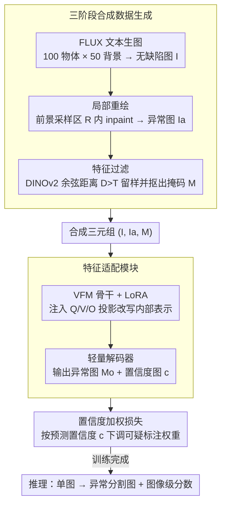

# AnomalyVFM -- Transforming Vision Foundation Models into Zero-Shot Anomaly Detectors

**会议**: CVPR 2026  
**arXiv**: [2601.20524](https://arxiv.org/abs/2601.20524)  
**代码**: [Project Page](https://AnomalyVFM.github.io/)  
**领域**:目标检测
**关键词**: 零样本异常检测, 视觉基础模型, 合成数据, 参数高效微调, LoRA

## 一句话总结
AnomalyVFM 提出了一个通用框架，通过三阶段合成数据生成方案和参数高效的 LoRA 适配机制，将任意视觉基础模型（VFM）转化为强零样本异常检测器，以 RADIO 为骨干在 9 个工业数据集上达到 94.1% 图像级 AUROC，超越 SOTA 3.3 个百分点。

## 研究背景与动机
**领域现状**：零样本异常检测要求在未见过的物体类别上无需任何域内图像即可检测异常。当前 SOTA 方法（AnomalyCLIP、AdaCLIP 等）依赖 CLIP 等视觉-语言模型的高层概念知识。

**现有痛点**：
   - 纯视觉基础模型（VFM，如 DINOv2）拥有更强的视觉表示但在零样本异常检测中落后于 VLM 方法——这不合理，因为异常检测本质上是视觉任务；
   - **原因一**：现有辅助异常数据集多样性不足，VLM 可靠高层概念知识弥补数据不足，但 VFM 无法依赖；
   - **原因二**：现有 VFM 适配策略过于浅层（仅训练输出头），未改变内部视觉表示。

**核心矛盾**：VFM 有更强的视觉表征能力，但缺乏多样化训练数据和有效的深层适配方法来释放其潜力。

**本文切入角度**：同时解决数据和方法两个瓶颈——合成大规模多样化数据 + LoRA 深层适配。

**核心 idea**：生成式数据 + 参数高效骨干适配 + 置信度加权损失 = 释放 VFM 的零样本异常检测潜力。

## 方法详解

### 整体框架
AnomalyVFM 想回答一个反直觉的现象：异常检测明明是纯视觉任务，为什么靠纯视觉表征的 VFM（DINOv2 等）反而打不过靠语言概念的 CLIP？作者的判断是 VFM 不缺能力，缺的是**多样化的训练数据**和**能改到骨干内部的适配方式**，于是整条流水线就围绕补这两块短板展开。先用生成模型造出海量带异常标注的合成图，再把 LoRA 注入 VFM 的每个 Transformer 块去深层适配，接一个轻量解码器输出像素级异常图，最后用一个带置信度权重的损失把合成标注里的噪声"软化"掉。训练完成后，推理时一张图进去直接吐出异常分割图和图像级分数，全程不需要任何真实异常样本，也不需要目标类别的域内数据。

### 关键设计

**1. 三阶段合成数据生成：不用一张真实样本，凭空造出多样化的异常训练集**

VFM 落后的第一个原因是现有辅助数据集（MVTec、VisA）物体类别和异常类型都太窄——CLIP 可以靠高层概念知识弥补这种数据稀缺，VFM 没有这根拐杖，只能靠数据本身。作者干脆把数据整个合成出来，分三步走。第一步生成无缺陷图：用 FLUX 按文本 prompt 生成干净物体图 $I = G(p)$，prompt 由 LLM 批量铺开成 100 种物体 × 50 种背景，保证覆盖面。第二步往上"画"异常：先提取前景掩码、在前景里随机采样一块异常区域 $R$，再用异常 prompt 做局部重绘（inpainting），而 cracked、damaged 这类异常描述同样由 LLM 针对每种物体定制，让缺陷类型贴合物体语义。第三步是质检：用 DINOv2 分别抽正常图和异常图的特征算余弦距离 $D$，距离太小（$D < T$）说明这次重绘其实没画出明显异常，直接丢弃；同时对这个差异图做阈值化，顺便白捡到一张异常掩码 $M$ 当监督标签。这样整条管线零真实样本依赖，物体和缺陷类型都能无限扩展，过滤步骤又把生成失败的脏样本挡在门外。

**2. 特征适配模块（Feature Adaptation Module）：用 LoRA 改写 VFM 内部表示，而不只是在外面套个输出头**

VFM 落后的第二个原因是过去的适配太"浅"——只训练一个输出头，骨干内部那套通用视觉表示原封不动，自然学不会把正常和异常区分开。作者的做法是直接深入骨干：在每个 Transformer 块的注意力 Query、Value、Output 三个投影层注入 LoRA（rank=64），让内部表示也能随异常检测任务被微调，而代价只是不到 1% 的可训练参数，比全量微调省得多又比只调输出头改得深。骨干之上接一个轻量解码器，由两个上采样块（Conv + GroupNorm + ReLU + 双线性上采样）加一层最终卷积组成，输出像素级异常分割图 $M_o$ 和一张同分辨率的置信度图 $c$；图像级的异常分数则单独从 [CLS] token 过一个线性层得到。关键在于 LoRA 让"改内部表示"这件事变得既轻量又适用于任意 Transformer 骨干，这也是后面能在 DINOv2、DINOv3、RADIO 上通用的前提。

**3. 置信度加权损失：让模型自己判断哪些合成标注不可信，并下调它们的权重**

合成数据虽然量大，但第三步阈值化抠出来的异常掩码不可能干净——边界模糊、抠错区域在所难免，硬按它监督会把噪声学进去。作者让解码器在预测异常图的同时额外预测一张置信度图 $c$，并把它编进分割损失里：

$$\mathcal{L}_{seg} = \mathcal{L}_{base}(M_o, M_{GT}) \cdot C - \alpha \log(C), \quad C = 1 + \exp(c)$$

其中基础损失 $\mathcal{L}_{base} = \ell_1 + 5 \cdot \ell_{focal}$。这个式子的巧妙之处在于两项的拉扯：第一项 $\mathcal{L}_{base} \cdot C$ 鼓励模型在它认为标注靠谱（$C$ 大）的地方老老实实拟合，第二项 $-\alpha \log(C)$ 则是个正则惩罚，不让模型对所有区域都偷懒地报低置信度逃避监督。于是模型会主动在那些标注可疑的区域调低 $C$、削减这块的损失权重，避免被噪声标签带偏，又不至于把置信度全压到零。

### 损失函数 / 训练策略
- 总损失 $\mathcal{L} = \mathcal{L}_{seg} + \mathcal{L}_{img}$，图像级分支 $\mathcal{L}_{img}$ 用 Focal Loss。
- 方法对骨干无关：上述 LoRA 适配 + 解码器 + 损失可套到任意 Transformer 骨干的 VFM 上。

## 实验关键数据

### 主实验（9 个工业数据集零样本，图像级 AUROC）

| 方法 | MVTec AD | VisA | BTAD | RealIAD | DTD | 平均 |
|------|---------|------|------|---------|-----|------|
| WinCLIP | 91.8 | 78.1 | 68.2 | 74.7 | 95.1 | 83.2 |
| AnomalyCLIP | 91.6 | 82.0 | 88.2 | 78.7 | 93.9 | 87.6 |
| Bayes-PFL | 92.3 | 87.0 | 93.2 | 85.2 | 95.1 | 90.8 |
| **AnomalyVFM** | **94.9** | **93.6** | **96.0** | **88.0** | **99.4** | **94.1** |

### 消融实验（VFM 通用性验证）

| 骨干 | 合成数据 | LoRA 适配 | 图像 AUROC | 像素 AUROC | 提升 |
|------|---------|----------|-----------|-----------|------|
| DINOv2 | ✗ | ✗ | 83.0 | 80.4 | 基线 |
| DINOv2 | ✓ | ✓ | 90.2 (+7.2) | 93.4 (+13.0) | 显著提升 |
| RADIO | ✗ | ✗ | 89.1 | 84.9 | 基线 |
| RADIO | ✓ | ✓ | **94.1 (+5.0)** | **96.9 (+12.0)** | 全面最优 |

### 关键发现
- 合成数据和 LoRA 适配各自都带来显著提升，两者组合效果最优
- 在三个 VFM（DINOv2、DINOv3、RADIO）上均有效，证明框架通用性
- 像素级 AUROC 提升尤为显著：RADIO 从 84.9 到 96.9（+12.0）
- 在医学异常检测数据集上也表现出色（无需额外微调）

## 亮点与洞察
- **核心发现具有启发性**：VFM 在零样本异常检测上的落后不是能力问题，而是数据和适配方法的问题
- 合成数据管线高度可扩展，不依赖任何真实异常样本
- 置信度加权损失优雅地处理了合成标注的噪声问题
- 框架通用性强：换不同 VFM 骨干均有效

## 局限与展望
- 数据生成依赖 FLUX 模型的生成质量和 prompt 覆盖度
- LoRA rank=64 相对较高，更小 rank 是否可行未充分探索
- 某些特定领域（如 KSDD 钢铁表面）的像素级性能仍有不足

## 相关工作与启发
- 与 DRÆM 的合成异常思路类似但不需要真实正常样本
- 置信度加权损失类似 NeRF 中的不确定性建模方法

## 评分
- 新颖性: ⭐⭐⭐⭐ 解决了"为什么VFM不如VLM"的关键问题
- 实验充分度: ⭐⭐⭐⭐⭐ 9个工业+医学数据集，三种VFM骨干
- 写作质量: ⭐⭐⭐⭐ 问题分析到位，方法动机清晰
- 价值: ⭐⭐⭐⭐⭐ 为VFM在异常检测中的应用开辟了新路径

<!-- RELATED:START -->

## 相关论文

- [\[CVPR 2026\] VisualAD: Language-Free Zero-Shot Anomaly Detection via Vision Transformer](visualad_language-free_zero-shot_anomaly_detection_via_vision_transformer.md)
- [\[CVPR 2026\] MoECLIP: Patch-Specialized Experts for Zero-shot Anomaly Detection](moeclip_patch-specialized_experts_for_zero-shot_anomaly_detection.md)
- [\[ICLR 2026\] FSOD-VFM: Few-Shot Object Detection with Vision Foundation Models and Graph Diffusion](../../ICLR2026/object_detection/fsod-vfm_few-shot_object_detection_with_vision_foundation_models_and_graph_diffu.md)
- [\[CVPR 2026\] Back to Point: Exploring Point-Language Models for Zero-Shot 3D Anomaly Detection](back_to_point_exploring_point-language_models_for_zero-shot_3d_anomaly_detection.md)
- [\[ECCV 2024\] Can OOD Object Detectors Learn from Foundation Models?](../../ECCV2024/object_detection/can_ood_object_detectors_learn_from_foundation_models.md)

<!-- RELATED:END -->
