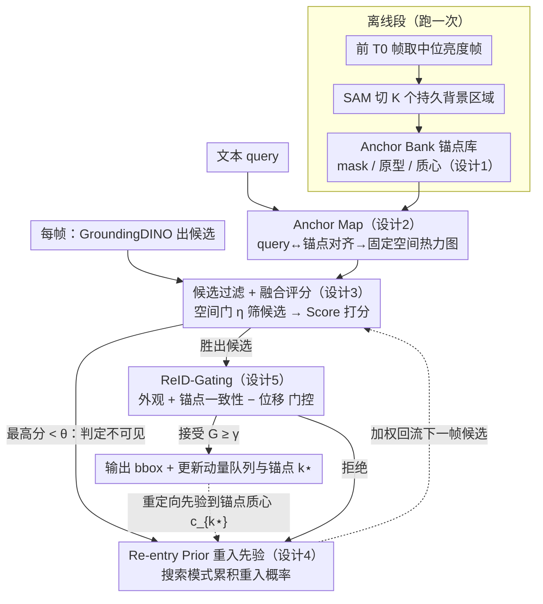

# AR²-4FV: Anchored Referring and Re-identification for Long-Term Grounding in Fixed-View Videos

**会议**: CVPR 2026  
**arXiv**: [2603.07758](https://arxiv.org/abs/2603.07758)  
**代码**: 待确认  
**领域**: 目标检测 / 视频理解 / 语言引导目标定位  
**关键词**: 长时间referring, 固定视角视频, 背景锚点, 重入检测, 身份重识别

## 一句话总结

利用固定视角视频中背景结构的时不变性，构建离线 Anchor Bank + 在线 Anchor Map 作为语言-场景持久记忆，配合锚点引导的重入先验和 ReID-Gating 身份验证机制，实现目标遮挡/离场后的鲁棒重捕获，RCR 提升 10.3%、RCL 降低 24.2%。

## 研究背景与动机

**领域现状**：语言引导的视频目标定位（referring）已成为监控、行为分析等场景的核心技术。现有方法（MTTR、ReferFormer、OnlineRefer 等）主要面向短时序场景，假设目标在大部分帧中可见，通过帧间外观传播维持身份一致性。

**现有痛点**：在长时间固定视角视频中（如监控摄像头，平均 >120s），目标会被遮挡、离开视野再重新进入。现有方法面临三大问题：
   - **语义记忆丢失**：目标不可见时，framewise pipeline 的语义记忆中断，无法在目标重入时恢复关联
   - **外观漂移**：长时间跨度下光照变化、姿态变换导致外观特征不可靠，基于 ReID 的纯外观匹配容易漂移
   - **近语义干扰**：相似外观的干扰目标（如穿相似衣服的行人）在目标缺失期间被误识别

**核心矛盾**：现有方法的语义对齐完全依赖目标本身的外观特征，一旦目标不可见，"文本-目标"的语义链条断裂。但固定视角视频的背景结构是稳定的——这个信息完全被忽略了。

**本文切入角度**：固定摄像头 → 背景布局不变 → 可以从背景中蒸馏出一组空间锚点 → 将文本 query 与锚点对齐 → 即使目标消失，"文本-场景"的空间记忆仍然持续有效 → 目标重入时利用空间先验快速重捕获。

**核心 idea**：**用背景结构的时不变性弥补目标外观的时变性**——将 referring 从"找目标"升级为"在场景坐标系中定位 query 对应的空间区域"。

## 方法详解

### 整体框架

这篇论文要解决的是固定视角视频里的长时间 referring：目标可能被遮挡、走出画面再回来，而文本 query 一直有效。输入是帧序列 $\{I_t\}_{t=1}^{T}$ 和一句自然语言 query $q$，输出每帧的 bounding box $\{y_t\}$。整套系统的关键转折是**不把记忆挂在目标外观上，而是挂在不动的背景上**，因此分成离线、在线两段。离线段只跑一次，从视频开头的若干帧里把稳定的背景区域蒸馏成一组锚点（Anchor Bank）；在线段则让 query 与这组锚点对齐，得到一张固定的空间热力图（Anchor Map），再用它去过滤、打分检测候选，目标消失时切到搜索模式并维护一个"目标会从哪儿回来"的重入先验（Re-entry Prior），目标重现时用 ReID-Gating 验证身份并把先验重定向回确认锚点，形成"消失→搜索→重捕获"的闭环。值得注意的是系统并不假设目标在首帧就可见——它从头开始在场景坐标系里"找"query 指的那个目标。

### 关键设计

**1. Anchor Bank：把不动的背景蒸馏成一套"场景坐标系"**

framewise 方法一旦目标消失就丢了记忆，根源在于它们的记忆全锚在目标身上。这里反其道而行：固定摄像头下背景布局终身不变，那就从前 $T_0$ 帧（默认 $T_0\in[30,120]$）里把它提取出来当锚。具体做法是挑一帧中位亮度帧 $t^\star$ 避开过曝/过暗，用 SAM 切出 $K$ 个持久区域的 mask $M_k$（默认 $K=64$），再在视觉编码器特征图 $F_{t^\star}$ 上对每个 mask 做 mask-aware 均值池化，得到归一化的区域原型向量

$$p_k = \text{Norm}\left(\frac{1}{|M_k|}\sum_x M_k(x) F_{t^\star}(x)\right),\qquad c_k = \frac{1}{|M_k|}\sum_x M_k(x)\cdot x$$

每个锚点 $(M_k, p_k, c_k)$ 同时带着语义原型和空间质心。这一步只跑一次、终身复用，关键不在省算力，而在于它给后面所有操作钉了一个**固定的场景坐标系**——身份、位置、重入都改在这个坐标系里度量，天然对目标的来去免疫。

**2. Anchor Map：把 query 翻译成一张不会随目标消失而失效的空间记忆**

有了锚点，接下来要让文字 query 落到场景的具体区域上。轻量对齐头 $\phi_l,\phi_v$ 把文本嵌入 $e_q$ 和锚点原型 $p_k$ 投到同一子空间算余弦相似度，再用 softmax（温度 $\tau=10$）转成各锚点的权重，最后按权重把锚点 mask 叠成一张热力图：

$$s_k = \cos(\phi_l(e_q), \phi_v(p_k)),\quad \omega_k = \frac{\exp(\tau s_k)}{\sum_j \exp(\tau s_j)},\quad A(x) = \sum_{k=1}^{K}\omega_k M_k(x)\in[0,1]$$

这张 Anchor Map 是全文最核心的一招：对给定 query，$\{M_k\}$ 和 $\{\omega_k\}$ 在整段推理里都不变，所以它是**固定的**。哪怕目标连续消失几百帧，系统依然"记得" query 描述的目标最可能出现在画面的哪一片——等于把短命的"目标外观记忆"换成了持久的"场景空间记忆"。

**3. 锚点引导的候选过滤与融合评分：用空间证据给检测器把关**

开放词汇检测器 GroundingDINO 每帧会吐出一堆候选 $\mathcal{R}_t$，但其中很多落在 query 根本不该出现的区域。Anchor Map 这时充当空间门：只留下落点响应超过阈值 $\eta$ 的候选 $\tilde{\mathcal{R}}_t = \{r\mid \bar{A}_{bb}(r)\geq\eta\}$。剩下的候选再做 mask-aware 池化 $g_v(r)$，把文本-视觉相似度和锚点证据按 $\lambda=0.6$ 加权成最终分：

$$\text{Score}(r) = \lambda\cos(g_v(r), g_l(q)) + (1-\lambda)\bar{A}_m(r)$$

这个分还兼任开关：当帧内最高分都低于阈值 $\theta=0.4$，系统判定目标当前不可见、切入搜索模式；否则把胜出候选交给 ReID-Gating 做最终身份核验。

**4. Anchor-based Re-entry Prior：在目标缺席时维护"它会从哪儿回来"**

目标重入并不随机——固定视角下行人往往从门口、通道这类固定入口回到画面。重入先验 $P_t^{re}$ 就是把这条空间习惯显式建模出来的分布，它以 Anchor Map $A$ 为初值，每帧用 EMA 叠高斯平滑、再 $\ell_1$ 归一化往前推：

$$\tilde{P}_t^{re} = \beta\,(G_\sigma * \tilde{P}_{t-1}^{re}) + (1-\beta)\,A$$

候选框据此拿到一个乘性权重 $W(r)\propto A(x)\cdot P_t^{re}(x)$，让评分往高概率重入区偏。一旦目标被确认落在某锚点 $k^\star$，先验立刻被拉回该锚点质心重新聚焦：

$$\tilde{P}_{t+1}^{re} = \rho\,G_\sigma(\cdot - c_{k^\star}) + (1-\rho)\,A$$

它和 Anchor Map 的分工是：后者是 query 级别的静态先验，前者是随追踪状态滚动更新的动态先验，专门压缩"目标从消失到被重新找到"的延迟。

**5. ReID-Gating：在场景坐标系里做身份核验，而不是只看脸**

长时间跨度下纯外观 ReID 很容易被光照、姿态拖偏，于是这里把身份判定改成三路信号的门控：外观相似度、锚点一致性、以及在锚点坐标系里相对上次确认位置的位移：

$$G(r) = \sigma\big(\alpha_1\,\text{sim}_{\text{ReID}}(r) + \alpha_2\,\bar{A}_m(r) - \alpha_3\,\hat{\Delta}(r) + b\big),\qquad G(r)\geq\gamma \Rightarrow \text{接受}$$

其中 $\text{sim}_{\text{ReID}}(r)$ 用一个动量队列 $\mathcal{Q}$ 稳定外观嵌入，避免单帧抖动；$\hat{\Delta}(r)$ 是候选相对上次确认锚点的归一化位移，负号意味着跳得越远越被惩罚。加了空间和位移两路约束后，相当于在场景坐标系里核验身份——远处一个穿相似衣服的人即使外观分很高，也会被位移项压下去，从源头堵住身份漂移。

### 一个完整示例

设想一段校门口监控：query 是"the person in red near the gate"，背景被蒸馏出 64 个锚点，其中锚点 #12 对应"门口"区域。

- **对齐**：Anchor Map 把权重集中到 #12 及邻近几个锚点，门口一片亮、操场角落暗。
- **首次定位**：第 30 帧 GroundingDINO 给出 18 个候选，空间门 $\eta$ 砍掉落在操场、停车场的 11 个，剩 7 个；融合评分选出门口那个红衣人，分 0.71 > $\theta$，ReID-Gating 通过，写入动量队列。
- **目标离场**：第 120 帧目标走出画面，最高分跌到 0.22 < $\theta=0.4$，系统切搜索模式；重入先验 $P^{re}$ 持续在 #12 门口区域累积概率。
- **重入**：第 260 帧目标从门口回来，候选获得 $A(x)\cdot P^{re}(x)$ 的双重加权，门口候选分被抬高；ReID-Gating 比对动量队列里的外观、确认位移很小（就在 #12 附近），$G(r)=0.63>\gamma$，目标被重新锁定。

同一时刻若操场角落出现另一个红衣人，它外观分或许不低，但 Anchor Map 在那里几乎为 0、位移项又很大，会被双重压制——这正是空间记忆相对纯外观匹配的价值。

### 实现细节

系统完全 zero-shot、全程冻结编码器：候选提案用 GroundingDINO，跨模态消歧用 RexSeek 风格的 refiner，mask 用 SAM，身份嵌入用 CLIP 族编码器，query 预处理用 spaCy。关键超参：$K=64$、$\tau=10$、$\lambda=0.6$、$\theta=0.4$、$\beta=0.8$、$\gamma=0.5$。

## 实验关键数据

### AR²-4FV-Bench（新基准）

首个面向固定视角长时间 referring + ReID 的专用基准：

| 维度 | 规模 |
|------|------|
| 视频数量 | 1,684 |
| 平均时长 | >120 秒 |
| 场景类型 | 校门/大堂/社区路口/室内走廊等 |
| 标注内容 | 逐帧可见性 + bbox + 重入时间戳 |
| 难度分层 | 消失时长(短/中/长) × 重入次数(单/多) |
| query 类型 | 锚点参照型 + 属性消歧型 + 同义改写 |

### 主实验（重入性能）

| 方法 | 会议 | IDF1↑ | RCR↑ | RCL↓ |
|------|------|-------|------|------|
| MTTR | CVPR'22 | 56.3 | 0.60 | 33.8 |
| ReferFormer | CVPR'22 | 57.9 | 0.63 | 31.2 |
| OnlineRefer | ICCV'23 | 58.6 | 0.64 | 29.9 |
| SOC | NeurIPS'23 | 58.7 | 0.64 | 30.3 |
| DsHmp | CVPR'24 | 60.4 | 0.66 | 28.6 |
| SSA | CVPR'25 | 61.5 | 0.68 | 26.5 |
| DUTrack | CVPR'25 | 62.3 | 0.69 | 25.8 |
| **AR²-4FV** | **-** | **64.8** | **0.75** | **20.1** |

AR²-4FV vs 最优 baseline（DUTrack）：RCR +8.7%（0.69→0.75），RCL -22.1%（25.8→20.1 帧）。

### 定位性能

| 方法 | mAP↑ | mIoU↑ |
|------|------|-------|
| OnlineRefer | 46.1 | 64.2 |
| DUTrack | 46.5 | 63.7 |
| SSA | 45.2 | 64.0 |
| **AR²-4FV** | **49.2** | **66.9** |

mAP +6.7%，mIoU +4.2%，在高 IoU 阈值（P@0.8, P@0.9）下优势更明显。

### 消融实验

| Anchor Bank | Anchor Map | Re-entry Prior | ReID-Gating | mIoU | mAP | IDF1 | RCR | RCL |
|:-:|:-:|:-:|:-:|------|------|------|-----|-----|
| ✓ | — | — | — | 63.2 | 45.2 | 61.2 | 0.67 | 27.1 |
| ✓ | ✓ | ✓ | — | 64.7 | 46.3 | 62.2 | 0.70 | 26.9 |
| ✓ | ✓ | — | ✓ | 63.8 | 45.5 | 61.3 | 0.68 | 21.3 |
| ✓ | ✓ | ✓ | ✓ | **66.9** | **49.2** | **64.8** | **0.75** | **20.1** |

### 关键发现

- **Anchor Map 是基础**：提供空间记忆，是后续模块的前提
- **Re-entry Prior 主攻 RCR**：加入后 RCR 从 0.67 提升到 0.70，帮助更快找到重入目标
- **ReID-Gating 主攻 RCL**：加入后 RCL 从 27.1 大幅降到 21.3，减少误判带来的延迟
- **三模块组合互补性强**：全配置 mIoU 66.9 >> 单 Anchor Bank 63.2，各模块解决不同维度的问题

## 亮点与洞察

- **背景作为"空间身份证"**的思路非常巧妙：固定视角下，"门口的人"比"穿红衣服的人"更可靠——前者时不变，后者随光照/姿态变化。这将 referring 从外观空间转移到场景空间
- **Zero-shot 运行**：所有编码器冻结，Anchor Bank 只需一次性提取，推理无需训练。这使得部署到真实监控场景的门槛极低
- **重入先验 $P^{re}$ 的动态更新机制**可迁移到其他需要预测"再次出现位置"的任务（如机器人导航中的障碍物重现预测）
- **ReID-Gating 的三路信号融合**（外观 + 空间 + 位移）比纯外观 ReID 更鲁棒，思路可用于行人重识别

## 局限与展望

1. **强依赖固定视角假设**：摄像头有轻微抖动或 PTZ 时，Anchor Bank 失效。可考虑引入背景配准模块适应准固定视角
2. **锚点数量 $K=64$ 固定**：不同场景复杂度差异大，自适应锚点数量选择可能更优
3. **线性时间复杂度但常数较大**：每帧需要 GroundingDINO + SAM + CLIP 多次前向，实时性存疑
4. **不处理跨场景外观变化**：作者明确排除了换衣等跨场景 ReID 场景，适用范围有限
5. **重入先验假设空间规律性**：对于行为高度随机的场景（如动物行为分析），基于背景结构的重入假设可能不成立

## 相关工作与启发

- **vs ReferFormer/MTTR**：这些方法假设目标持续可见，通过帧间 Transformer 传播语义；AR²-4FV 不做此假设，用场景结构代替帧间传播
- **vs OVTrack**：OVTrack 用文本检索做开放词汇跟踪，但仍依赖外观连续性；AR²-4FV 在外观不可靠时用空间先验接管
- **vs ByteTrack/BoT-SORT**：这些 MOT 方法面向短时场景，没有语言引导和长时间重入处理
- **vs 背景建模方法（MOG/ViBe）**：AR²-4FV 借鉴了传统背景建模的"前景-背景分离"思想，但将其升级为语义级的"锚点-query 对齐"

## 评分

- 新颖性: ⭐⭐⭐⭐ 用背景结构做语言引导 referring 的思路新颖，但各子模块是已有技术的组合
- 实验充分度: ⭐⭐⭐⭐ 新 benchmark + 完整消融，但缺少跨数据集泛化和推理速度分析
- 写作质量: ⭐⭐⭐⭐ 结构清晰，算法伪代码和公式完整，但部分表格排版混乱
- 价值: ⭐⭐⭐⭐ 固定视角监控场景有实际应用价值，zero-shot 设计降低部署门槛

<!-- RELATED:START -->

## 相关论文

- [\[CVPR 2026\] Object-Generalized Re-Identification: A Step Towards Universal Instance Perception](object-generalized_re-identification_a_step_towards_universal_instance_perceptio.md)
- [\[CVPR 2026\] FSLoRA: Harmonizing Detection and Re-Identification via Freq-Spatial Low-Rank Adapter for One-Stage Person Search](fslora_harmonizing_detection_and_re-identification_via_freq-spatial_low-rank_ada.md)
- [\[CVPR 2026\] Multi-view Crowd Tracking Transformer with View-Ground Interactions Under Large Real-World Scenes](multi-view_crowd_tracking_transformer_with_view-ground_interactions_under_large_.md)
- [\[CVPR 2026\] Show, Don't Tell: Detecting Novel Objects by Watching Human Videos](show_dont_tell_detecting_novel_objects_by_watching.md)
- [\[CVPR 2026\] Heuristic-inspired Reasoning Priors Facilitate Data-Efficient Referring Object Detection](heuristic-inspired_reasoning_priors_facilitate_data-efficient_referring_object_d.md)

<!-- RELATED:END -->
