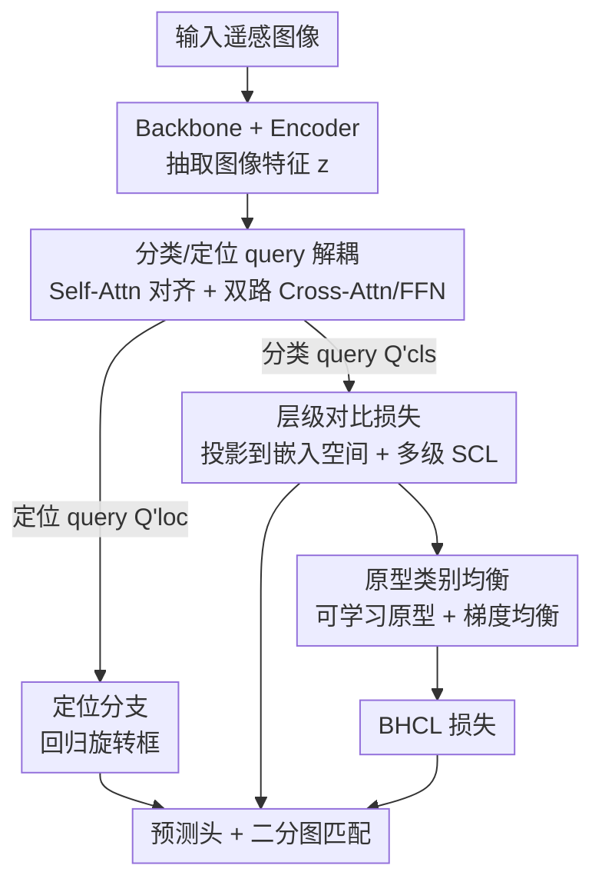

# Balanced Hierarchical Contrastive Learning with Decoupled Queries for Fine-grained Object Detection in Remote Sensing Images

**会议**: CVPR 2026  
**论文**: [CVF Open Access](https://openaccess.thecvf.com/content/CVPR2026/html/Chen_Balanced_Hierarchical_Contrastive_Learning_with_Decoupled_Queries_for_Fine-grained_Object_CVPR_2026_paper.html)  
**代码**: https://github.com/chncdx/BHCL  
**领域**: 目标检测 / 细粒度检测  
**关键词**: 细粒度目标检测, 层级对比学习, DETR, 遥感, 类别不平衡

## 一句话总结
本文把遥感细粒度检测中的层级标签树嵌入 DETR 的表征空间，提出一个用可学习类原型做梯度均衡的「平衡层级对比损失」(BHCL)，再配一个把分类/定位 query 解耦的策略，让对比学习只作用于分类分支而不干扰定位，在三个层级标注的遥感数据集上刷到新 SOTA。

## 研究背景与动机
**领域现状**：遥感细粒度检测数据集（如 ShipRSImageNet、FAIR1M）普遍用「粗→细」的层级标签树来组织成百上千个子类——根节点是大类（如 Warship / Merchant），叶子节点是细粒度类（具体舰型）。每个目标沿根到叶的路径被打上多级标签。近年的主流思路是用**监督对比学习 (SCL)** 把层级语义注入表征空间：同父类的目标在嵌入空间里聚拢、兄弟子类彼此推开。

**现有痛点**：作者指出这条路线忽略了两个关键问题。其一是**层级标签树天生不平衡**——高层节点累积的样本远多于其后代，而且兄弟分支的分叉是非对称的，导致同级兄弟类之间样本量也严重倾斜。直接做层级对比学习时，高频类会主导整个表征学习过程，稀有类（尾类）学不到判别性特征。其二是**层级语义建模会干扰类别无关的定位**——标准检测器把共享表征同时喂给分类头和定位头，而层级语义要求「同父类目标在嵌入空间聚拢」，这种聚拢一旦作用到共享 query 上，会让本该各自分散的边界框也跟着挤在一起，损害定位精度。

**核心矛盾**：同父类目标应当**语义相似**（利于分类），但**空间位置必须保持各自独立**（利于定位）——这两个目标在共享表征上直接冲突。

**核心 idea**：用「平衡」和「解耦」两板斧。平衡——给标签树里每个类挂一个可学习原型当作额外实例，并改写 SCL 的分母让每个类在每个 mini-batch 里对损失的梯度贡献相等；解耦——把 DETR 的 object query 拆成分类 query 和定位 query，对比损失只压在分类 query 上，定位 query 不受层级语义干扰。

## 方法详解

### 整体框架
方法搭在 DETR 类检测器上（作者用 OrientedFormer 和 RHINO 两个旋转框 DETR 当 baseline）。整体是「backbone → encoder → 解耦 decoder → 预测头」四段：backbone 抽特征、encoder 用 self-attention 精炼出图像 token $z\in\mathbb{R}^{M\times d}$；这些特征初始化一组 object query，并被拆成分类 query $Q_{cls}$ 和定位 query $Q_{loc}$；在每个 decoder 层里，两类 query 先经一个共享 self-attention 对齐同一目标的分类/定位信息，再各走一条专属的 cross-attention + FFN 抽取任务特定特征；最后预测头的分类分支从精炼后的分类 query 出类别、定位分支从定位 query 回归旋转框。训练时用二分图匹配把 GT 分配给 query，总损失里除了常规的 Focal/IoU/L1，额外加一项 BHCL——它把类别层级树嵌进分类 query 的表征空间，并用可学习原型保证每个类在每个 mini-batch 中对损失贡献均衡。

### 关键设计

**1. 分类/定位 query 解耦：让层级语义只压分类、不碰定位**

这是为了化解「同父类聚拢 vs 边界框各自独立」的冲突。标准 DETR 用一组共享 object query 同时生成分类和定位预测，一旦对它们施加层级分组，定位也会被牵连。作者把 query 拆成 $Q_{cls}\in\mathbb{R}^{N\times d}$ 和 $Q_{loc}\in\mathbb{R}^{N\times d}$。在每个 decoder 层里，两者先沿隐藏维拼接后过共享 self-attention，对齐同一物体的分类与定位信息，再拆回来：$Q_{cls}, Q_{loc} = \text{Split}(\text{Self-Attn}(\text{Concat}(Q_{cls}, Q_{loc})))$。随后各自走专属的 cross-attention 与 FFN 抽任务特征：$Q'_{cls} = \text{FFN}_1(\text{Cross-Attn}_1(Q_{cls}, z))$，$Q'_{loc} = \text{FFN}_2(\text{Cross-Attn}_2(Q_{loc}, z))$。关键是 **BHCL 只施加在 $Q'_{cls}$ 上**——分类 query 去吸收层级语义，定位 query 保持类别无关，互不干扰。共享 self-attention 保证两路不至于各说各话、仍指向同一目标。这一步本身（不加对比损失）就带来 +1.21 / +0.43 AP50:95 的提升。

**2. 层级对比损失 (HCL)：把标签树每一层都做一遍对比**

普通 SCL 只在单一类别层做正负配对。本文按标签树每一层重新组织正负对，并对各层损失加权求和。单层 SCL 写作 $L_{SCL} = \frac{1}{|I|}\sum_{i\in I}\frac{1}{|P(i)|}\sum_{p\in P(i)}L_{pair}(i,p)$，其中配对损失 $L_{pair}(i,p) = -\log\frac{\exp(f_i\cdot f_p/\tau)}{\sum_{a\in I\setminus\{i\}}\exp(f_i\cdot f_a/\tau)}$，$f$ 是 $\ell_2$ 归一化后的投影分类 query。层级版把它扩成跨 $L$ 层的加权和：

$$L_{HCL} = \frac{1}{|I|}\sum_{i\in I}\sum_{l=1}^{L}\frac{\lambda_l}{|P_l(i)|}\sum_{p\in P_l(i)}L_{pair}(i,p)$$

其中 $P_l(i)$ 是在第 $l$ 层与 $i$ 共享祖先类的 query 集合，层权重 $\lambda_l = \exp(\frac{1}{L+1-l})/\sum_{l'}\exp(\frac{1}{L+1-l'})$ 给越靠近叶子的层越高权重，逼模型多花力气区分细粒度类；只含单根节点的最顶层被排除在计算外。这样模型在粗层聚同父类、在细层分兄弟类，把整棵树的语义都揉进表征。

**3. 原型类别均衡：用可学习原型 + 梯度均衡治好长尾**

HCL 直接用会被高频类带跑偏（实验里 HCL 在长尾更重的 FAIR1M-v1.0 上甚至掉到比 baseline 还差）。作者的核心诉求是**让每个类在每个 mini-batch 里对损失的贡献相等**，但现实是一个 batch 里不一定出现所有类、各类样本数也不均。两个对策：① 建一个可学习类原型库 $M\in\mathbb{R}^{C\times d'}$（$C$ 为标签树去根后的类别数），把每个类的原型当作额外实例塞进损失，**保证稀有类即使本 batch 没采到也照样参与计算**；② 把原 SCL 分母里各负类的实例**先按类内平均再求和**，从而均衡不同负类的梯度贡献。改写后的平衡配对损失为：

$$L^b_{pair}(l,i,p) = -\log\frac{\exp(f_i\cdot f_p/\tau)}{\sum_{c\in C_l}\frac{1}{|I'_c|}\sum_{a\in I'_c\setminus\{i\}}\exp(f_i\cdot f_a/\tau)}$$

其中 $C_l$ 是第 $l$ 层全部类别，$I'_c = I_c\cup\{M(c)\}$ 把类 $c$ 的原型并进该类实例集（即便 $I_c$ 为空也有原型撑着）。最终 BHCL 把正样本集也并上原型 $P'_l(i)=P_l(i)\cup\{M(l,i)\}$，得 $L_{BHCL} = \frac{1}{|I|}\sum_{i\in I}\sum_{l=1}^{L}\frac{\lambda_l}{|P'_l(i)|}\sum_{p\in P'_l(i)}L^b_{pair}(l,i,p)$，并在**每个 decoder 层**都施加。原型用 EMA 更新：$M_c \leftarrow (1-\epsilon^{L-l})M_c + \epsilon^{L-l}\bar{f}_c$，$\bar{f}_c$ 是匹配到类 $c$ 的投影分类 query 的均值；中间层（粗类）原型由自身及其全部后代类的 query 一起平均更新。

**4. "Other" 类的层级重分配：把含糊目标退回父类而非当独立类**

遥感数据集会把分不清的目标塞进特殊的「Other」类（如「Other Aircraft Carrier」）。以往方法把 Other 当互斥的细粒度类处理，丢掉了它和父类的语义关系。本文借层级结构把这些含糊实例**重新分配到对应父类**（Other Aircraft Carrier → Aircraft Carrier），让层级对比损失不仅用叶子节点的实例、也用中间节点的实例——既缓解细粒度不确定性，又在粗层保住语义信息。

### 损失函数 / 训练策略
总损失 $L_{total} = \lambda_{BHCL}L_{BHCL} + \lambda_{cls}L_{cls} + \lambda_{iou}L_{iou} + \lambda_{L1}L_1$，其中 $L_{cls}$ 为 Focal loss、$L_{iou}$ 为 Rotate IoU loss、$L_1$ 为回归损失。二分图匹配代价 $C_{match} = \lambda'_{cls}C_{cls} + \lambda'_{iou}C_{iou} + \lambda'_{L1}C_{L1}$。$\lambda_{BHCL}=0.6$（消融选定），温度 $\tau$ 与动量控制系数 $\epsilon$ 均设 0.1。优化器 AdamW，学习率 $5\times10^{-5}$，batch size 8，对每张图随机翻转+随机平移生成两个增强视图，在 4 张 RTX 4090 上训练。

## 实验关键数据

### 主实验
三个层级标注的遥感数据集（ShipRSImageNet 四级层级、FAIR1M-v1.0/v2.0 两级层级），ResNet-50 backbone、输入 1024×1024，报告旋转框 COCO 风格 AP。

| 数据集 | 指标 | 本文 | 次优 | 提升 |
|--------|------|------|------|------|
| ShipRSImageNet | AP50:95 | 64.3 | 63.2 (OrientedFormer) | +1.1 |
| FAIR1M-v1.0 | AP50 | 41.66 | 41.31 (OrientedFormer) | +0.35 |
| FAIR1M-v2.0 | AP50 | 47.53 | 47.04 (DRNet) | +0.49 |

横向对比里覆盖 ReDet/ORCNN/LSKNet/PETDet 等 CNN 检测器和 OrientedFormer/RHINO 两个 DETR baseline，本文在三个数据集上均刷新 SOTA。

### 消融实验
在两个 baseline、ShipRSImageNet 上逐组件拆解（AP50:95）：

| 配置 | RHINO | OrientedFormer | 说明 |
|------|-------|----------------|------|
| baseline | 59.78 | 63.17 | 原始 DETR 检测器 |
| + Decoupling | 60.99 | 63.60 | 解耦分类/定位 query（+1.21 / +0.43） |
| + Decoupling + HCL | 61.24 | 64.12 | 加层级对比（+0.25 / +0.52） |
| + Decoupling + BHCL | 61.41 | 64.32 | 再加原型均衡（+0.17 / +0.20，完整模型） |

原型实现对比（OrientedFormer，AP50:95）：

| 设置 | AP50 | AP75 | AP50:95 | 说明 |
|------|------|------|---------|------|
| None | 79.30 | 73.80 | 63.34 | 无原型，比 EMA 掉 0.98 |
| EMA | 80.40 | 74.90 | 64.32 | EMA 更新原型（采用） |
| Cls-Weight | 80.10 | 75.30 | 64.26 | 用分类器权重当原型 |

### 关键发现
- **平衡机制在长尾更重的数据集上是救命稻草**：FAIR1M-v1.0 上 HCL 不加均衡反而掉到比 baseline 还差（被头类主导），加上原型均衡后才稳定 +0.28 AP50，印证了均衡的必要性。
- **解耦是涨点主力**：仅解耦就贡献 +1.21（RHINO）/ +0.43（OF）AP50:95，是三个组件里单步收益最大的。
- **原型选型**：去掉原型 (None) 掉 0.92~0.98 AP50:95，说明让尾类原型每个 batch 都在场对维持其贡献至关重要；EMA 略优于用分类器权重，且与「全 epoch 平均」相当（64.32 vs 64.37），优于梯度更新（63.88）；零初始化优于随机/正交初始化。
- **超参不敏感**：$\lambda_{BHCL}=0.6$、$\epsilon=0.1$、$\alpha=1$ 附近均接近最优。
- **t-SNE 可视化**：BHCL 在 level 2 锐化了 Warship/Merchant 的边界，level 3 上各兄弟子类分得更开，直观印证细粒度判别力提升。

## 亮点与洞察
- **把"原型当额外实例塞进对比损失分母 + 类内先平均再求和"两步同时治不平衡**：前者解决稀有类「这个 batch 根本没出现」的硬缺席，后者解决「出现了但被高频类淹没」的软偏置，比单纯重加权更彻底。
- **解耦 query 的巧思在于"共享 self-attention 对齐 + 双路 cross-attention 分流"**：既让分类/定位指向同一目标，又让层级语义只染分类分支，是个干净的「任务隔离」实现，可迁移到任何 DETR 类多任务头。
- **"Other" 类退回父类**这个细节体现了对遥感数据特性的理解——把含糊样本当中间节点实例利用，而不是粗暴地当独立类或丢弃。
- 方法是即插即用的 loss + 结构改动，作者在 OrientedFormer 和 RHINO 两个架构上都验证了一致增益，泛用性较好。

## 局限与展望
- 绝对增益偏小：BHCL 相对 HCL 在 ShipRSImageNet 上只 +0.17~0.20 AP50:95，主要价值体现在长尾严重的数据集，常规数据集上提升有限。
- ⚠️ 实验局限在三个遥感舰船/飞机层级数据集，是否能推广到自然图像的层级检测（如 iNaturalist 风格）未验证。
- 引入了类原型库、EMA 更新、双路 query 等额外组件，带来一定显存/计算开销，论文未给出推理/训练效率的量化对比。
- 层权重 $\lambda_l$ 沿用已有的固定 penalty 公式，未探索按数据集长尾程度自适应调层权的可能。

## 相关工作与启发
- **vs 普通层级 SCL（如 HCL/Zhang et al.）**: 他们直接跨层做监督对比，忽略层级树的样本不平衡，头类主导；本文用可学习原型 + 梯度均衡把每类贡献拉平，长尾场景更稳。
- **vs 两阶段层级检测（Shin/Zhang et al. 先检测再层级分类）**: 他们把定位和层级分类拆成独立两阶段；本文用 query 解耦在单个端到端 DETR 内同时完成，避免阶段间误差传播。
- **vs PCLDet（原型对比检测）**: 同样用类原型，但本文把原型嵌入「层级 + 平衡」的对比框架并只作用于解耦后的分类 query，针对的是层级不平衡这一具体痛点。

## 评分
- 新颖性: ⭐⭐⭐⭐ 平衡层级对比 + query 解耦的组合针对遥感层级不平衡，切入点具体且新
- 实验充分度: ⭐⭐⭐⭐ 三数据集 + 两 baseline + 细致消融/敏感性/可视化，但增益偏小、仅限遥感
- 写作质量: ⭐⭐⭐⭐ 动机与公式清晰，损失推导完整
- 价值: ⭐⭐⭐⭐ 即插即用、跨架构验证，对层级标注的细粒度检测有直接参考价值

<!-- RELATED:START -->

## 相关论文

- [\[CVPR 2026\] Fourier Angle Alignment for Oriented Object Detection in Remote Sensing](fourier_angle_alignment_for_oriented_object_detection_in_remote_sensing.md)
- [\[CVPR 2026\] PaQ-DETR: Learning Pattern and Quality-Aware Dynamic Queries for Object Detection](paq-detr_learning_pattern_and_quality-aware_dynamic_queries_for_object_detection.md)
- [\[ICCV 2025\] OpenRSD: Towards Open-prompts for Object Detection in Remote Sensing Images](../../ICCV2025/object_detection/openrsd_towards_open-prompts_for_object_detection_in_remote_sensing_images.md)
- [\[ECCV 2024\] MutDet: Mutually Optimizing Pre-training for Remote Sensing Object Detection](../../ECCV2024/object_detection/mutdet_mutually_optimizing_pre-training_for_remote_sensing_object_detection.md)
- [\[CVPR 2026\] FB-CLIP: Fine-Grained Zero-Shot Anomaly Detection with Foreground-Background Disentanglement](fb-clip_fine-grained_zero-shot_anomaly_detection_with_foreground-background_dise.md)

<!-- RELATED:END -->
