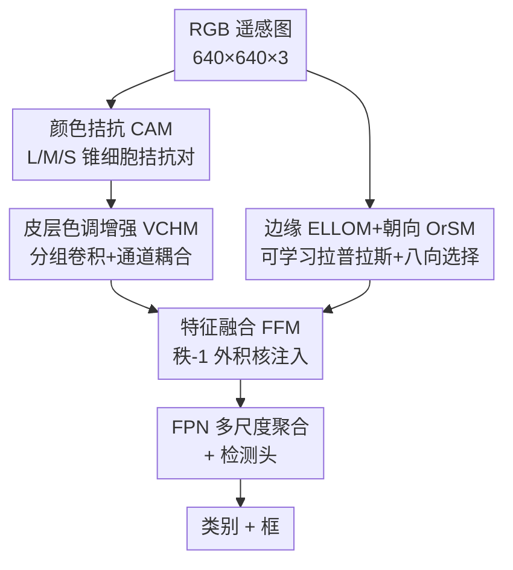

# BDNet: Bio-Inspired Dual-Backbone Small Object Detection Network

**会议**: CVPR 2026  
**论文**: [CVF Open Access](https://openaccess.thecvf.com/content/CVPR2026/html/Guan_BDNetBio-Inspired_Dual-Backbone_Small_Object_Detection_Network_CVPR_2026_paper.html)  
**代码**: 未公开  
**领域**: 目标检测 / 小目标检测 / 遥感图像  
**关键词**: 小目标检测, 遥感, 双骨干网络, 仿生视觉, 颜色拮抗

## 一句话总结
BDNet 模仿人类视觉系统的 LGN/V1–V2–V4 颜色通路和 V1–V4 边缘通路，搭了一个「颜色增强 + 边缘强化 + 分层融合」的双骨干检测网络，专门补救遥感小目标"颜色对比度低、边缘模糊"导致的特征提取不足，在 VisDrone2019、NWPU VHR-10、AI-TODv2 三个数据集上用仅 2.59M 参数刷到了 SOTA。

## 研究背景与动机
**领域现状**：遥感小目标检测（RSOD）的核心难点在于目标像素占比极小，深层网络反复下采样会让本就微弱的视觉线索进一步衰减、丢失。近年的工作普遍从「适配通用检测框架」转向「针对小目标特性设计架构」，但大多是整体性地优化特征，没有显式地把对小目标最关键的低级线索单独拎出来增强。

**现有痛点**：现有的特征增强方法基本都"只盯一种线索"——COSE 通过色偏校正改善低对比度区域的颜色一致性，DCFL 靠超分 + 细节补偿强化边缘纹理，SET 用频谱增强提升高频细节。多骨干网络（如 TransFuse 融合 CNN/Transformer、DSOD++ 融合不同感受野）虽然引入了多分支，但它们都在同一个特征空间里互补，**几乎没有人显式地针对"颜色 + 边缘"这种多维低级线索分别建分支**。

**核心矛盾**：小目标的可辨识度同时被两件事拖累——颜色对比度低（目标和背景色调接近，如网球场/篮球场）和边缘模糊（轮廓断裂、运动拖影）。这两个问题成因不同、需要的处理也不同，用单一通路统一处理必然顾此失彼。

**切入角度**：作者转向生物视觉找答案。生理学研究表明，视觉系统天然就是**分流处理**的：LGN（外侧膝状体）/V1/V2 负责处理颜色与亮度（颜色拮抗 + 分层色调增强），而 V1 里的朝向选择性神经元负责抽取边缘；两条流最终在视觉皮层 V4 区汇聚整合。这恰好与"颜色 + 边缘"的双线索难题一一对应。

**核心 idea**：用一个仿生**双骨干**架构 BDNet，把颜色通路（CIP，模拟 LGN/V1→V2→V4）和边缘通路（EIP，模拟 V1→V4）做成两条独立分支分别增强，最后用一个模拟 V4 整合机制的融合模块（FFM）把两类特征分层融合，从源头上缓解小目标的特征退化。

## 方法详解

### 整体框架
BDNet 接收一张 RGB 遥感图后，让它同时走两条并行骨干：**颜色信息通路 CIP**（CAM → VCHM）放大颜色差异、增强色调表征；**边缘信息通路 EIP**（ELLOM → OrSM）先提取边缘图、再做朝向选择强化轮廓。两条通路在多个尺度（P2/P3/P4）上产出互补的颜色特征和边缘特征，再交给**特征融合模块 FFM**（模拟 V4 的跨域整合）做分层注入式融合；融合后的多尺度特征送入 FPN 聚合，最后由检测头预测类别和框。整个 backbone 建在优化过的 YOLO12 之上，且**不加载任何预训练权重**，以验证结构本身的泛化能力。

值得注意的实现细节：全网只用了**两个 FFM**——第一个 FFM 融合两条通路的 P2，第二个 FFM 融合 P3 与上采样后 P4 的拼接结果，而非在每一层都融合。

### 关键设计

**1. CAM 颜色拮抗模块：用"兴奋-抑制"拮抗对放大低对比度颜色差异**

针对"颜色对比度低"这个痛点，CAM 直接照搬 LGN/V1 里 L（长波）、M（中波）、S（短波）三类锥细胞的拮抗机制。它把输入 RGB 的三个通道映射为模拟 L/M/S 锥细胞的通道，按照拮抗色理论（互补色对，如红-绿、蓝-黄）构造出六种「兴奋通道-抑制通道」拮抗对。关键创新是一个**自适应选择增强（ASE）**机制：引入一个**可学习权重向量**给 RGB 通道加权、调制它们在各个拮抗组合中的贡献，再基于这些拮抗对生成六类「兴奋-抑制」特征对，最后把同类兴奋通道聚合、用卷积融合。这样做的好处是，颜色差异不是简单做减法，而是由网络学到"哪种拮抗组合对当前场景最有判别力"——对于和背景同色调的目标（网球场 TC、篮球场 BC），拮抗放大后对比度被显著拉开。

**2. VCHM 皮层色调增强模块：用 Jordan 矩阵做通道耦合，把色调拉向人眼感知空间**

CAM 虽然增强了颜色差异，但增强后的色调仍偏离人类感知。生理学发现：皮层色调图与感知色彩空间的匹配度会随皮层层级上升而显著提升。VCHM 据此模拟 V2 的分层色调处理，用「分组卷积 → 通道耦合 → 特征嵌入」三步优化：先对输入 $X=(x_0,\dots,x_{c-1})$ 做 $C$ 组分组卷积得到中间特征 $X'$；再通过一个**标准 Jordan 型矩阵**对相邻通道两两耦合，生成新的色调特征

$$Y = \mathrm{Conv}\big(J \cdot X'\big),\quad J=\begin{bmatrix}1&1&0&\cdots&0\\0&1&1&\cdots&0\\ \vdots& & &\ddots&\vdots\\0&0&0&\cdots&1\end{bmatrix}$$

其中 $J$ 与 $1\times1$ 卷积原始权重 $W$ 相乘构成新卷积核（相邻通道相加 = 相邻色相耦合）；最后按生成顺序把新色调特征嵌回原通道序列：$E(X,Y)=(x_0,\,w_0 x'_0+w_1 x'_1,\,x_1,\dots)$，即把原通道和耦合通道交错放到奇偶位置上。这一步本质上是"在通道维度模拟色相的连续渐变"，让增强后的色调分布更贴近人眼，从而提升判别力。⚠️ 公式细节较抽象，以原文 Eq.(1)(2) 为准。

**3. EIP 边缘通路（ELLOM + OrSM）：先学拉普拉斯边缘，再用八向 ESCK 自适应选最显著朝向**

针对"边缘模糊"，EIP 分两步。第一步 **ELLOM（增强型可学习拉普拉斯算子）**：传统拉普拉斯算子是固定的二阶差分核，ELLOM 把核里的权重换成可学习的 $(w_1,\dots,w_9)$、中心为 $-\Sigma$（周围权重之和），让边缘提取自适应数据，从 RGB 图生成边缘图。第二步 **OrSM（朝向选择模块）**：模拟 V1/V2 神经元"只对特定朝向刺激强响应、抑制其他朝向"的特性，用**增强-抑制卷积核 ESCK**（把差分卷积从"像素差"改为"权重差"）生成八个方向的显著特征 $X_1,\dots,X_8$。它的精妙之处是一个**自适应方向核选择**：一个子网络把输入编码成取值 0–7 的方向索引图，再转成八张二值掩码 $\{M_k\}_{k=0}^7$（仅在索引 $k$ 处为 1），用掩码把非显著方向的特征滤掉、只与对应方向的显著特征相乘融合。这样从根本上避免了"八个方向核直接叠加相互干扰"的老问题——每个空间位置只保留它最显著的那个方向核，轮廓更连贯、判别性更强。

**4. FFM 特征融合模块：用秩-1 外积核把颜色注入边缘，正则化对抗小目标噪声**

颜色和边缘天然互补（颜色辨表面属性、边缘定空间边界），V4 区同时含颜色敏感和形状敏感神经元、做跨域交互。FFM 模拟这种"信息注入"式整合：对颜色特征 $Z_1$、边缘特征 $Z_2\in\mathbb{R}^{C\times H\times W}$，先各自经全局平均池化 + $1\times1$ 卷积学到通道重要性分数 $\{p_i\}$、$\{q_j\}$，再做**外积**得到矩阵 $R[1,C,C]$，其中 $R_{ij}=p_i q_j$ 量化了 $Z_1$ 第 $i$ 通道与 $Z_2$ 第 $j$ 通道的语义关联强度。接着把 $R$ 当作 $1\times1$ 卷积核 $K[C,C,1,1]$ 去卷积 $Z_2$，第 $k$ 个输出通道为

$$\mathrm{Output}_k = \sum_{i=1}^{c} p_k q_i \cdot Q_i$$

即重建后的每个通道都注入了 $Z_1$ 全部通道的信息。关键洞察是：$R$ 由两个一维向量外积得到，数学上是**秩-1 矩阵**，天然带强正则化效应——这对噪声高的小目标特别有益。为了不被秩-1 结构限制特征表达，最后用残差 + 拼接保留通道多样性：$\mathrm{Output}=Z_1 \,\|\, (\mathrm{Output}_1\|\cdots\|\mathrm{Output}_c + Z_2)$，兼顾正则化与鲁棒性。

### 损失函数 / 训练策略
基线为优化版 YOLO12，沿用 YOLO 系列的检测损失（分类 + 框回归，框回归用 `4*reg_max` 分布形式）。全程不加载预训练权重，消融主要在 VisDrone2019 上做。

## 实验关键数据

### 主实验
三个遥感小目标数据集上均刷到 SOTA，且参数量极小（仅 2.59M）。VisDrone2019 验证集上与代表性检测器对比：

| 方法 | mAP50 | mAP50-95 | Params(M) | GFLOPs |
|------|-------|----------|-----------|--------|
| UAV-DETR | 50.0 | 30.9 | 21.26 | 72.5 |
| LUFE-Net | 50.2 | 30.9 | 9.7 | 33.1 |
| YOLO12-I | 47.3 | 29.3 | 29.2 | 89.4 |
| **BDNet (Ours)** | **50.5** | **31.2** | **2.59** | 52.44 |

AI-TODv2 测试集（COCO 标准，重点看超小目标 APvt/APs）上**全指标最优**：

| 方法 | AP | AP50 | AP75 | APvt | APs | APm |
|------|----|----|----|----|----|----|
| DCENet | 23.5 | 53.9 | 16.8 | 8.5 | 28.1 | 37.1 |
| LTDNet* | 23.0 | 54.6 | 15.5 | 8.9 | 27.2 | 33.1 |
| **Ours** | **24.7** | **54.9** | **18.2** | **10.2** | **31.7** | **41.8** |

NWPU VHR-10 上 mAP50 达 **94.1%**（高于 MaskFormer 93.8%、YOLO-RDNet 93.6%）：虽然单类最优只占 4 类（BD/TC/BC/HA），但各类表现最均衡、方差最小——印证颜色骨干擅长低对比度类（TC/BC），边缘骨干擅长结构化目标（BD/HA）。

### 消融实验
在 VisDrone2019 验证集上逐模块累加（baseline = 47.8% mAP50）：

| 配置 | mAP50 | Params(M) | GFLOPs | 说明 |
|------|-------|-----------|--------|------|
| Baseline | 47.8 | 1.98 | 45.98 | 纯 YOLO12 |
| + CIP | 48.8 | 2.04 | 47.56 | 颜色通路 |
| + EIP | 48.8 | 2.04 | 47.52 | 边缘通路 |
| + FFM 单独 | 49.4 | 2.48 | 49.20 | 仅融合模块 |
| CIP+EIP | 49.8 | 2.52 | 52.31 | 双通路无融合 |
| EIP+FFM | 50.3 | 2.53 | 50.78 | — |
| **CIP+EIP+FFM** | **50.5** | 2.59 | 52.44 | 完整模型 |

CIP 内部：CAM 单独 47.8→48.0，VCHM 单独 →48.3，二者合用 →48.8（互补）。EIP 内部：ELLOM 单独 →48.1，OrSM 单独 →48.3，合用 →48.8（协同）。

### 关键发现
- **FFM 是涨点主力**：单加 FFM 就能从 47.8 涨到 49.4，比单加 CIP 或 EIP（都只到 48.8）更猛；说明"分层注入式融合"比单纯堆双分支更关键，秩-1 正则对小目标确实有效。
- **双通路 + 融合三者缺一不可**：CIP+EIP 无融合只有 49.8，补上 FFM 才到 50.5，验证了"颜色解决低对比、边缘解决模糊、V4 式融合做跨维整合"的累积效应。
- **极致轻量**：完整模型仅 2.59M 参数，比 UAV-DETR（21M）、YOLO12-I（29M）小一个量级却精度更高，仿生结构本身带来了高效率。
- 特征热图可视化显示：baseline 对低对比度（People/Bicycle）和模糊轮廓（Pedestrian）激活弱；加 CIP 后响应增强但边缘仍糊，加 EIP 抑制背景噪声、锐化边缘，最后 FFM 融合得到强而准的响应。

## 亮点与洞察
- **把生物视觉的"分流-汇聚"结构直接落成网络拓扑**：颜色通路对应 LGN/V1–V2–V4、边缘通路对应 V1–V4、FFM 对应 V4 汇聚，不是泛泛的"受生物启发"，而是每个模块都能在生理通路里找到对应，结构动机非常具体。
- **秩-1 外积核做特征融合是个可迁移的巧思**：用两路通道权重向量外积当 $1\times1$ 卷积核，既显式建模了跨分支通道关联，又因秩-1 自带正则、对高噪声小目标友好，再用残差恢复多样性——这套"低秩注入 + 残差补偿"思路可迁移到任意双分支/多模态融合。
- **OrSM 的"索引图选核"避免多核叠加干扰**：用方向索引 + 二值掩码做硬选择，而非把八向核加权求和，从根上消除了卷积核互扰，是处理多方向边缘的实用 trick。
- **2.59M 参数刷 SOTA**：证明遥感小目标的瓶颈往往不是模型容量，而是有没有针对低级线索做对结构。

## 局限与展望
- **仅在遥感/航拍场景验证**：三个数据集都是遥感无人机图像，颜色拮抗 + 边缘分流的优势在自然图像、医学图像等场景能否复现未知。
- **关键模块（ESCK 构造、VCHM 通道耦合）细节下放到补充材料**，正文公式较抽象，复现门槛偏高；⚠️ Jordan 矩阵耦合和 ESCK 的具体权重设计需查补充材料 Sec. A。
- **代码未公开**，且 baseline 用的"优化版 YOLO12"具体改动未在正文交代，与其他方法的公平比较存一定 caveat（部分对比结果直接引自文献）。
- **可改进方向**：双骨干带来一定计算冗余（GFLOPs 从 45.98 升到 52.44），可探索通路间共享浅层特征；FFM 目前只在 P2、P3/P4 两处用，是否在更多尺度融合有增益值得做。

## 相关工作与启发
- **vs COSE / DCFL / SET（单线索增强）**：它们各自只增强颜色一致性、边缘纹理或高频细节，BDNet 用双骨干**同时**解耦增强颜色和边缘两类低级线索，再分层融合，覆盖更全面。
- **vs TransFuse / DSOD++ / DCAL（多骨干互补）**：这些多分支网络在同一特征空间里互补不同感受野/全局-局部信息，但没有显式针对"多维低级线索"；BDNet 的两条分支分别对应颜色和边缘两种**物理意义不同**的线索，分工更明确。
- **vs Brstd / Magno-VTOD / VSTDet（仿生小目标模型）**：前者多聚焦单一感知机制（拮抗感受野、磁细胞通路、腹侧通路），BDNet 系统模拟 LGN/V1–V2–V4 完整通路、让颜色和边缘**协同**处理，更直接地针对小目标的特征退化。

## 评分
- 新颖性: ⭐⭐⭐⭐ 把完整生物视觉通路（颜色拮抗 + 朝向选择 + V4 融合）系统落成双骨干检测网络，仿生映射具体且自洽
- 实验充分度: ⭐⭐⭐⭐ 三数据集 + 多尺度指标 + 逐模块消融 + 热图可视化，较完整；但缺自然图像跨域验证、部分对比引自文献
- 写作质量: ⭐⭐⭐⭐ 生理动机与模块设计对应清晰；但 ESCK/VCHM 关键公式细节下放补充材料，正文略抽象
- 价值: ⭐⭐⭐⭐ 2.59M 参数刷遥感小目标 SOTA，轻量高效，仿生融合思路可迁移到其他双分支任务

<!-- RELATED:START -->

## 相关论文

- [\[CVPR 2026\] D2FANet: Enhancing Video Object Detection with Dual-Domain Feature Aggregation Network](d2fanet_enhancing_video_object_detection_with_dual-domain_feature_aggregation_ne.md)
- [\[CVPR 2026\] Towards Persistence: Learning Topological Constraints for Event-based Small Object Detection](towards_persistence_learning_topological_constraints_for_event-based_small_objec.md)
- [\[CVPR 2026\] Heuristic-inspired Reasoning Priors Facilitate Data-Efficient Referring Object Detection](heuristic-inspired_reasoning_priors_facilitate_data-efficient_referring_object_d.md)
- [\[CVPR 2026\] HeROD: Heuristic-inspired Reasoning Priors Facilitate Data-Efficient Referring Object Detection](herod_heuristic_inspired_reasoning_data_efficient_rod.md)
- [\[CVPR 2026\] Beyond Prompt Degradation: Prototype-Guided Dual-Pool Prompting for Incremental Object Detection](beyond_prompt_degradation_prototype-guided_dual-pool_prompting_for_incremental_o.md)

<!-- RELATED:END -->
