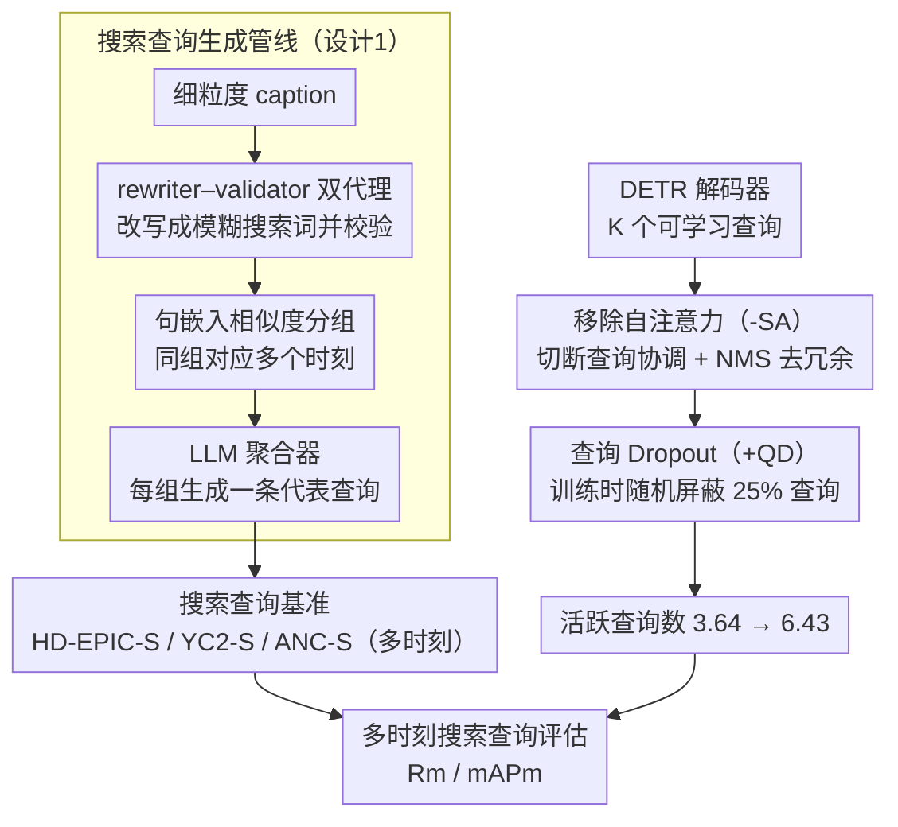

# Beyond Caption-Based Queries for Video Moment Retrieval

**会议**: CVPR 2026  
**arXiv**: [2603.02363](https://arxiv.org/abs/2603.02363)  
**代码**: 有（项目主页提供代码、模型和数据）  
**领域**: 目标检测  
**关键词**: 视频时刻检索, 搜索查询泛化, DETR解码器查询坍塌, 多时刻检索, 查询欠规范化

## 一句话总结

揭示了VMR中caption-based查询与真实用户搜索查询之间的巨大鸿沟，提出了三个搜索查询基准，并通过移除自注意力+查询Dropout两项架构修改来缓解DETR中的解码器查询坍塌问题，在多时刻搜索查询上提升高达21.83% mAPm。

## 研究背景与动机

### 1. 领域现状
视频时刻检索（Video Moment Retrieval, VMR）旨在根据文本查询定位视频中的时间片段。当前主流方法基于DETR架构，使用K个可学习的解码器查询，每个映射到一个候选时刻及对应置信度。现有基准（HD-EPIC、YouCook2、ActivityNet-Captions等）均采用标注员**观看视频后**写出的描述性文本作为查询。

### 2. 痛点
现有数据集的文本查询是**caption-based**的——标注员在看完视频后撰写细粒度描述。这导致了"视觉偏差"：查询过于详细、与视觉内容高度对齐。例如标注者会写"a man in a yellow jersey intercepts a loose pass..."，但真实用户可能只搜索"when are goals being scored?"。这两种查询在语言细粒度和语义覆盖上存在根本差异。

### 3. 核心矛盾
- **训练时**：每个caption-based查询仅对应**单个GT时刻**，且语言高度具体
- **推理时**：真实搜索查询往往更抽象和欠规范化，可能对应视频中的**多个时刻**
- 这种不匹配导致模型在真实搜索场景下性能大幅下降（最高达77.4% Rm@0.3退化）

### 4. 要解决什么
（1）量化caption-based查询与search查询之间的性能差距；（2）定位退化的两个根因：**语言差距（language gap）**和**多时刻差距（multi-moment gap）**；（3）缓解多时刻差距导致的解码器查询坍塌。

### 5. 切入角度
纯从**模型架构**角度出发，不改变训练数据或训练范式，仅通过结构性修改使模型能在单时刻训练数据上泛化到多时刻搜索场景。

### 6. 核心idea
DETR模型中存在**活跃解码器查询坍塌（active decoder-query collapse）**——仅少数查询参与预测，其余保持沉默。这由两个结构性原因导致：（i）自注意力引起的**协调坍塌**，查询间"商量好"只让少数查询激活；（ii）**索引坍塌**，固定的少量查询索引垄断了激活。通过移除自注意力（-SA）和引入查询Dropout（+QD），可同时解决这两个问题。

## 方法详解

### 整体框架

这篇论文要回答的问题是：为什么在 caption 上训练得很好的 VMR 模型，一换成真实搜索查询就大幅退化，又该如何在不重新标注数据的前提下把它拉回来。为此论文兵分两路。第一路是**造基准**——既然真实搜索查询难以采集（你没法让标注员"不看视频"就写出搜索词），那就反过来把现有密集标注数据集里的细粒度 caption 用 LLM "模糊化"成搜索式查询，并自动把指向同一类内容的查询归成一组，从而凭空造出"一个查询对多个时刻"的多时刻测试场景。第二路是**改模型**——论文把退化的祸根定位到 DETR 解码器的"活跃查询坍塌"，然后用移除自注意力（-SA）和查询 Dropout（+QD）两处极小的结构改动，逼模型把火力分散到更多查询上。两路里，造基准服务于"量化和暴露问题"，改模型才是真正的解法；两路最终在"多时刻搜索查询评估"上汇合，用 $R_m$ / $mAP_m$ 衡量退化是否被缓解。

### 关键设计

**1. 搜索查询生成管线：把细粒度 caption 模糊成搜索词并自动建多时刻对应**

真实搜索查询拿不到，是因为"写文本"和"看视频"这两件事在标注流程里没法解耦——只要让人看了视频再写，写出来的就是 caption 而不是搜索词。论文绕开这一点：复用已有的密集标注数据，用可控的"欠规范化"去人工合成分布偏移。管线分两阶段。第一阶段做 per-query 欠规范化，用 Gemma-12B 搭一个 rewriter-validator 双代理：rewriter 负责把详细 caption 改写成模糊版本（比如把 "a man tying his running shoes before starting a marathon" 改成 "a person getting ready to exercise"），validator 负责检出改写后语义跑偏的样本、交人工修正。第二阶段做 query-grouping，把所有欠规范化查询两两计算句子嵌入相似度，相似度高的并成一组——一组就天然对应视频里的多个时刻——再让一个 LLM 聚合器为这一组生成一条有代表性的搜索查询。这样一条查询就同时关联到多个 GT 时刻，多时刻评估场景就被造出来了。

**2. 移除自注意力（-SA）：拆掉让查询"互相商量、集体闭嘴"的协调通道**

标准 DETR 解码器层是 $\hat{Q}^{l+1} = \text{FFN}(\text{CA}(\text{SA}(\hat{Q}^l), M))$，其中 SA 让 K 个解码器查询彼此沟通、互相推开以减少冗余预测。这套协调机制在多目标检测里是好事，但在 VMR 的单时刻训练里却变成捷径：既然每条 caption 只对应一个 GT 时刻，查询们就"商量好"只让少数几个去接管这个 GT、其余主动闭嘴——论文称之为**协调坍塌（coordination collapse）**。-SA 的做法很直接，把 SA 整层删掉，解码器层退化为 $Q^{l+1} = \text{FFN}(\text{CA}(Q^l, M))$，让每个查询独立运作、不再能"串供"。代价是原本靠 SA 抑制的冗余预测会冒出来，于是在后处理里补一个 NMS 来去重。

**3. 查询 Dropout（+QD）：随机屏蔽查询，打散对固定索引的垄断**

光删 SA 还不够，模型会暴露出第二种坍塌：**索引坍塌（index collapse）**——总是那固定的少数几个查询索引（比如索引 1–4）反复拿到高置信度，剩下的查询永久沉默。这是位置/索引层面的过拟合，跟"商量"无关。QD 在训练时对可学习查询施加一个 Bernoulli 掩码 $\hat{Q} = Q \odot M,\ M \sim \mathbb{B}(1-k)$，每步随机把 k 比例的查询置零，强迫监督信号没法总落在同一批索引上、必须分散到更多查询。论文里 $k=0.25$ 最优；QD 只在训练时开，推理时所有查询照常激活。-SA 治"协调"、QD 治"索引"，两者正交，合起来才能把活跃查询数从 3.64 翻到 6.43。

### 损失函数 / 训练策略

- 损失函数保持与基线（CG-DETR、LD-DETR）完全一致，使用标准**一对一匈牙利匹配**
- 关键发现：保持1-to-1匹配至关重要——它在查询间引入竞争，确保被-SA+QD额外激活的查询保持多样性而非生成冗余预测
- 查询Dropout仅在训练时使用，推理时全部查询激活
- 后处理增加NMS步骤以替代被移除的SA去冗余功能

## 实验关键数据

### 主实验

**表1：HD-EPIC-S{1,2,3}基准结果（CG-DETR & LD-DETR）**

| 模型 | 输入 | 方法 | Rm@0.1 | Rm@0.3 | Rm@0.5 | mAPm@0.1 | mAPm@0.3 | mAPm@0.5 |
|------|------|------|--------|--------|--------|----------|----------|----------|
| CG-DETR | S1 | base | 28.61 | 17.95 | 8.99 | 36.21 | 22.84 | 11.59 |
| CG-DETR | S1 | -SA+QD | 29.87 | 19.69 | 10.86 | 39.74 | 26.49 | 14.87 |
| CG-DETR | S2 | base | 24.71 | 15.52 | 7.89 | 32.15 | 20.10 | 10.29 |
| CG-DETR | S2 | -SA+QD | 26.17 | 17.00 | 9.40 | 35.38 | 23.39 | 13.04 |
| CG-DETR | S3 | base | 9.50 | 4.61 | 2.08 | 16.20 | 8.01 | 3.58 |
| CG-DETR | S3 | -SA+QD | 10.57 | 6.52 | 3.45 | 17.27 | 10.65 | 5.54 |
| LD-DETR | S2 | base | 25.23 | 16.38 | 8.46 | 32.42 | 21.11 | 10.93 |
| LD-DETR | S2 | -SA+QD | 26.36 | 16.98 | 8.87 | 36.37 | 23.75 | 12.54 |

**表2：YC2-S和ANC-S基准结果**

| 模型 | 数据集 | 方法 | Rm@0.3 | mAPm@0.1 | mAPm@0.3 | mAPm@0.5 |
|------|--------|------|--------|----------|----------|----------|
| CG-DETR | YC2-S | base | 19.87 | 38.83 | 26.96 | 15.21 |
| CG-DETR | YC2-S | -SA+QD | 20.32 | 41.00 | 29.40 | 17.21 |
| LD-DETR | YC2-S | base | 23.48 | 41.69 | 30.04 | 15.58 |
| LD-DETR | YC2-S | -SA+QD | 24.76 | 45.66 | 33.09 | 18.74 |
| CG-DETR | ANC-S | base | 40.89 | 72.12 | 54.92 | 36.42 |
| CG-DETR | ANC-S | -SA+QD | 43.12 | 74.00 | 56.42 | 38.20 |

### 消融实验

**组件消融（HD-EPIC-S2, CG-DETR）**

| -SA | +QD | Rm (avg) | mAPm (avg) | #active queries |
|-----|-----|----------|------------|-----------------|
| ✗ | ✗ | 16.04 | 20.84 | 3.64±1.18 |
| ✓ | ✗ | 15.31 | 21.02 | 3.72±1.16 |
| ✗ | ✓ | 16.50 | 21.43 | 3.77±1.28 |
| ✓ | ✓ | **17.52** | **23.93** | **6.43±2.16** |

**替代查询激活方法对比**

| 方法 | Rm | mAPm | #active | %match GT |
|------|-----|------|---------|-----------|
| base | 16.04 | 20.84 | 3.64 | 0.36 |
| +1-to-5 matching | 14.66 | 16.30 | 9.56 | 0.21 |
| +1-to-k matching | 10.78 | 11.01 | 20.00 | 0.07 |
| +group matching | 15.34 | 17.97 | 8.69 | 0.27 |
| -SA+QD (ours) | **17.52** | **23.93** | 6.43 | **0.42** |

### 关键发现

1. **两项修改缺一不可**：单独使用-SA或+QD仅带来边际提升（mAPm从20.84到~21），两者结合才能将活跃查询数从3.64翻倍至6.43，mAPm提升3.09
2. **单纯增加活跃查询无效**：1-to-k matching把活跃查询增至20但mAPm反而暴跌到11.01——激活的查询生成了冗余预测（%match GT从0.36降至0.07）
3. **1-to-1匹配的关键保障作用**：保持匈牙利1-to-1匹配确保新激活的查询彼此竞争而非冗余
4. **QD率敏感**：k=0.25最优，k=0.50导致性能崩溃（mAPm从23.93降到3.84）
5. **多时刻查询受益最大**：-SA+QD在多时刻实例上提升高达34.3% mAPm@0.3，单时刻也有温和提升
6. **方法恢复了约70%的oracle差距**（oracle指直接用搜索查询训练的模型）

## 亮点与洞察

- **问题定义极具洞察力**：指出VMR领域长期忽视的根本问题——训练用的caption与真实用户搜索查询的分布偏移，这是一个被整个社区忽视但对实际部署至关重要的议题
- **提出新的多时刻评估指标**：Rm和mAPm解决了传统R1/mAP在多时刻评估中的不公平问题
- **解码器查询坍塌的诊断**非常精准：通过协调坍塌和索引坍塌两个正交维度分析问题，方案简洁有效
- **不改数据只改结构**的思路具有很高的实用性——避免了昂贵的重新标注

## 局限与展望

1. **语言差距未解决**：本文仅解决了multi-moment gap，language gap被留作future work，作者建议用更强的视觉-语言模型来应对不同粒度的语义推理
2. **搜索查询由LLM生成而非真实用户**：虽然经过了验证，但与真正的用户搜索行为可能仍有差异
3. **QD率敏感性过高**：k从0.25到0.50导致性能从23.93崩溃到3.84，鲁棒性有待提升
4. **基准仅涵盖烹饪/运动等场景**：开放域、长视频场景的泛化性未探索
5. **NMS后处理依赖**：移除SA后需NMS去冗余，这引入了额外超参数和计算开销

## 相关工作与启发

- **与DETR查询坍塌文献的关联**：目标检测（[53,28,21]）、时序动作检测（[17]）和3D检测（[44,52]）中均报告了查询坍塌，但原因不同——它们由稀疏one-to-one匹配导致，而VMR中由单时刻先验导致
- **对搜索/检索领域的启发**：Liang et al.[24]研究模糊查询对ranked retrieval的影响，本文则处理单视频内的多时刻检索，两者互补
- **方法可推广**：-SA+QD的设计思路可应用于任何存在decoder-query collapse的DETR变体任务

## 评分

⭐⭐⭐⭐ 问题定义新颖、分析深入、方案简洁有效，是推动VMR走向真实应用场景的重要工作，但语言差距未解决且QD敏感性较高是明显短板。

<!-- RELATED:START -->

## 相关论文

- [\[CVPR 2026\] Beyond Semantic Search: Towards Referential Anchoring in Composed Image Retrieval](beyond_semantic_search_towards_referential_anchoring_in_composed_image_retrieval.md)
- [\[ICCV 2025\] Large-scale Pre-training for Grounded Video Caption Generation](../../ICCV2025/object_detection/large-scale_pre-training_for_grounded_video_caption_generation.md)
- [\[NeurIPS 2025\] Video-RAG: Visually-aligned Retrieval-Augmented Long Video Comprehension](../../NeurIPS2025/object_detection/video-rag_visually-aligned_retrieval-augmented_long_video_comprehension.md)
- [\[ICCV 2025\] Augmenting Moment Retrieval: Zero-Dependency Two-Stage Learning](../../ICCV2025/object_detection/augmenting_moment_retrieval_zero-dependency_two-stage_learning.md)
- [\[ICCV 2025\] The Devil is in the Spurious Correlations: Boosting Moment Retrieval with Dynamic Learning](../../ICCV2025/object_detection/the_devil_is_in_the_spurious_correlations_boosting_moment_retrieval_with_dynamic.md)

<!-- RELATED:END -->
