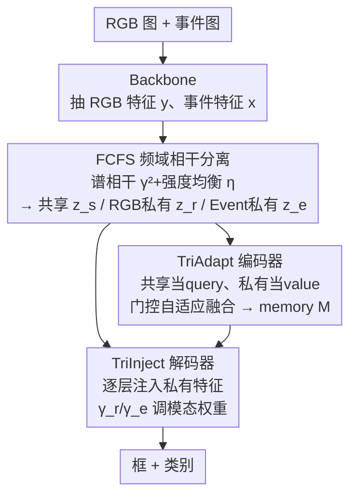

# Beyond Duality: A Hybrid Framework of Leveraging Shared and Private Features for RGB-Event Object Detection

**会议**: CVPR 2026  
**论文**: [CVF Open Access](https://openaccess.thecvf.com/content/CVPR2026/html/Wang_Beyond_Duality_A_Hybrid_Framework_of_Leveraging_Shared_and_Private_CVPR_2026_paper.html)  
**代码**: https://github.com/git-KeYw/SPFD  
**领域**: 目标检测 / 多模态融合  
**关键词**: RGB-Event 检测, 共享-私有特征解耦, 频域相干, DETR, 多模态融合

## 一句话总结
SPFD 把 RGB 和事件相机两路特征在**频域**按"谱相干"显式拆成"共享特征 + 各自私有特征"三股，再分别注入 DETR 的编码器（自适应门控融合两股私有特征）和解码器（逐层非对称注入私有特征），在 DSEC-Det 上把 mAP 从 SOTA 的 30.4 提到 34.6。

## 研究背景与动机
**领域现状**：RGB-Event 目标检测把普通帧相机（纹理细节、静态目标）和事件相机（高速、低光、运动敏感）两种模态结合起来，适合自动驾驶等高动态、恶劣光照场景，近年是热点。主流做法是"特征级融合"：早期直接拼接/交互/后处理，后来用 Transformer（如 SODFormer、CAFR）建模两路时空动态做直接交互，融合越做越强。

**现有痛点**：所有现有方法的目标都是"充分利用两个模态**融合后**的信息"，却没人显式地把"两模态共有的特征"和"某一模态独有的特征"分开来处理。结果是对两模态的低信息区域做无差别的统一处理，既造成冗余计算，又过度强调共享特征、削弱了模态特有线索的发挥。

**核心矛盾**：在很多关键场景里，能救命的恰恰是某一模态的**私有**信息——低光下 RGB 拍不到目标，只有事件相机还有运动响应（Event-private）；目标相对相机静止时（如和自车同速行驶的车辆），事件流几乎没响应，只有 RGB 能看见（RGB-private）。无差别融合会把这些"只有一方有"的关键信息淹没在平均化的融合里。

**本文目标**：显式建模并保留模态私有特征，同时不丢掉共享特征的稳定语义，让网络在不同场景、不同语义深度上动态决定该信谁。

**切入角度**：作者注意到 RGB 与事件在**频谱响应**上天然不同——RGB 能量集中在低频，事件对高频更敏感。于是用频域的"谱相干（spectral coherence）"来度量两路信号在每个频率上是否同步变化：同步→共享语义，不同步→私有细节。这给了"共享 vs 私有"一个有物理依据的判据，而不是靠黑盒网络硬学。

**核心 idea**：用频域谱相干把双模态特征解耦成 共享 / RGB-私有 / Event-私有 三股，再把这三股恰当地用进 DETR 的编码器和解码器，取代无差别融合。

## 方法详解

### 整体框架
给定一张 RGB 图像 $I \in \mathbb{R}^{W\times H\times 3}$ 和对应的事件图像 $E \in \mathbb{R}^{W\times H\times 3}$（事件流按帧间隔累积成正极性/负极性/总和三通道），SPFD 走 DETR 风格架构，输出 $K$ 个目标的框 $B_i(x_i,y_i,w_i,h_i)$ 和类别 $C_i$。整个网络由三块串起来：

1. **FCFS 模块**（频域相干特征分离）：用同一个 ResNet-50 backbone 抽出事件特征 $x$ 和 RGB 特征 $y$，FFT 到频域后，靠谱相干把它们拆成共享特征 $z_s$、RGB-私有 $z_r$、Event-私有 $z_e$；
2. **TriAdapt 编码器**：以共享特征为 query、两股私有特征为 value 做可变形注意力，再用一个可学门控按区域纹理/运动特性自适应融合两股私有特征，产出多层 memory；
3. **TriInject 解码器**：每个解码层除了拿 memory，还重新注入两股私有特征，用逐层可学的缩放系数 $\gamma_r,\gamma_e$ 控制"这一层更信 RGB 还是更信 Event"，实现从空间纹理到时间轮廓的分层过渡。

### 关键设计

**1. FCFS 频域相干特征分离：用谱相干给"共享 vs 私有"一个物理判据**

针对"现有方法分不清共享与私有"这个根因，FCFS 不在空间域用卷积/注意力硬学，而是搬到频域用谱统计来判。先对两路特征做二维 FFT：$X=\mathcal{F}(x),\ Y=\mathcal{F}(y)$，再算功率谱与互谱 $S_{xx}=|X|^2+\varepsilon,\ S_{yy}=|Y|^2+\varepsilon,\ S_{xy}=X\cdot\overline{Y}$。核心判据是**谱相干** $\gamma^2$，衡量两路信号在某频率上是否线性相关、同步变化：

$$\gamma^2 = \frac{|S_{xy}|^2}{S_{xx}S_{yy}}$$

$\gamma^2\to 1$ 表示两模态在该频率高度同步（相似的结构纹理/轮廓）→ 判为共享语义；$\gamma^2\to 0$ 表示响应基本无关（事件流的动态边缘、RGB 的光照纹理）→ 判为私有。但 RGB 偏低频、事件偏高频，能量分布悬殊，直接用 $\gamma^2$ 会被强模态带偏，于是再引入**强度均衡项** $\eta=\dfrac{\sqrt{S_{xx}S_{yy}}}{S_{xx}+S_{yy}+\varepsilon}$，当某模态某频段能量过强时分母放大、抑制其主导，稳住相干估计。

由此得到共享掩码 $M_s=\sigma\!\left(\dfrac{\gamma^2\cdot\eta-\tau}{T}\right)$（$\tau$ 是相干阈值，$T$ 是控制平滑的温度），高相干且能量均衡处给高 $M_s$。两股私有掩码则在 $(1-M_s)$ 的基础上、按两模态功率差 $|S_{xx}-S_{yy}|$ 和各自占比分配：

$$M_r=(1-M_s)\cdot\frac{|S_{xx}-S_{yy}|}{S_{xx}+S_{yy}+\varepsilon}\cdot\frac{S_{xx}}{S_{xx}+S_{yy}},\quad M_e=(1-M_s)\cdot\frac{|S_{xx}-S_{yy}|}{S_{xx}+S_{yy}+\varepsilon}\cdot\frac{S_{yy}}{S_{xx}+S_{yy}}$$

最后用三个掩码在频域取出特征再 IFFT 回空间域：$Z_s=M_s\odot\tfrac12(X+Y),\ Z_r=M_r\odot X,\ Z_e=M_e\odot Y$，得到 $z_s,z_r,z_e$。这样共享分支保留两模态都强的中低频一致语义、滤掉私有噪声，私有分支各自保留 RGB 的语义纹理和事件的高频瞬时边缘。⚠️ 论文里 $M_r$ 用 $S_{xx}$ 占比、$M_e$ 用 $S_{yy}$ 占比，而功率谱 $S_{xx}$ 是事件特征 $x$ 的、$S_{yy}$ 是 RGB 特征 $y$ 的，命名与下标对应关系以原文为准。

**2. TriAdapt 编码器：让门控按区域决定信 RGB 还是信 Event**

FCFS 只是把三股特征拆开，编码器要解决"两股私有特征怎么按区域自适应取舍"。TriAdapt 在每层用两路多尺度可变形注意力（MSDA）：把展平的共享特征 $z_s$ 当 query，分别拿 RGB-私有 $z_r$ 和 Event-私有 $z_e$ 当 value，得到两股交互结果 $U_r^{(l)}=\mathcal{D}(Q^{(l)},z_r),\ U_e^{(l)}=\mathcal{D}(Q^{(l)},z_e)$（$\mathcal{D}$ 为可变形注意力）。

关键是**自适应门控**：取两股注意力输出的均值 $\bar U^{(l)}=\tfrac12(U_r^{(l)}+U_e^{(l)})$，过线性层加 sigmoid 生成门控图 $G^{(l)}=\sigma(W_g\bar U^{(l)})$，它在空间和通道两个维度上控制两股私有特征的融合比例：

$$\tilde O^{(l)}=G^{(l)}\odot W_r U_r^{(l)}+(1-G^{(l)})\odot W_e U_e^{(l)}$$

直觉上，纹理丰富的静态区域门控偏向 RGB，高动态区域偏向能捕捉运动的事件特征。融合结果经 Norm+FFN 精炼，迭代 $L$ 层后输出多层 memory $\{M^{(l)}\}_{l=1}^L$。这一步把"该信谁"从全局固定权重变成了逐位置、逐通道的动态决策。

**3. TriInject 解码器：逐层非对称注入私有特征，专做框的精修**

编码器给的 memory 已是融合好的，但作者发现解码器不同层对模态信息的敏感度不同——浅层更需空间纹理（边、纹理、颜色）、深层更需时间轮廓。TriInject 让**每个解码层重新注入私有特征**做精修。在第 $l$ 层，先把私有特征投影对齐通道 $V_r^{(l)}=P_r^{(l)}z_r,\ V_e^{(l)}=P_e^{(l)}z_e$，再用两个**可学习缩放系数** $\gamma_r^{(l)},\gamma_e^{(l)}$ 调两模态在该层的贡献：

$$V_f^{(l)}=M^{(l)}+\gamma_r^{(l)}V_r^{(l)}+\gamma_e^{(l)}V_e^{(l)}$$

$\gamma_r^{(l)}>0$ 说明该层更靠 RGB 静态纹理，$\gamma_e^{(l)}>0$ 说明更靠事件动态响应。融合后的 $V_f^{(l)}$ 作为 value 与 query 做 cross-attention $Q^{(l+1)}=\mathcal{D}(Q^{(l)},V_f^{(l)})$。这种"逐层不同 $\gamma$"的线性调制让不同深度的解码层各有侧重，实现从空间显著到时间敏感的分层过渡，主要收益落在框的定位精度（mAP75）上。

### 损失函数 / 训练策略
沿用 DETR 系的预测+二分匹配检测损失（论文未单列损失公式）。骨干 ResNet-50，两张 RTX 4090（每卡 batch 4），训练 100k 次迭代，初始学习率 $1\times10^{-4}$、80k 步衰减 10 倍；超参 $\varepsilon=10^{-6},\ \tau=0.25,\ T=0.2$；数据增强为多尺度训练 + 随机水平翻转。

## 实验关键数据

### 主实验
在 DSEC-Det（8 类交通目标）和 PKU-DAVIS-SOD（car/pedestrian/cyclist 三类，含正常/运动模糊/低光）两个数据集上，与纯事件、纯 RGB、RGB-Event 多模态三类检测器对比（COCO 协议，主指标 mAP / mAP50）：

| 数据集 | 指标 | SPFD(本文) | 之前SOTA | 提升 |
|--------|------|------|----------|------|
| DSEC-Det | mAP | 34.6 | 30.4 (SFNet) | +4.2 |
| DSEC-Det | mAP50 | 56.7 | 51.4 (SFNet) | +5.3 |
| PKU-DAVIS-SOD | mAP | 32.0 | 31.9 (SFNet) | +0.1 |
| PKU-DAVIS-SOD | mAP50 | 62.4 | 59.6 (SFNet) | +2.8 |

参数量 78.6M，和同样基于 ResNet-50 的重融合方法（CAFR 82.4M、SODFormer 82.0M）相当；DSEC-Det 上相对 SFNet 的提升幅度明显，PKU 上则更接近、主要赢在 mAP50。

### 消融实验
在 DSEC-Det 测试集上（baseline 为把单模态 MI-DETR 用线性投影拼接 RGB+事件扩成多模态）：

| ID | FCFS | TriAdapt | TriInject | mAP | mAP50 | mAP75 |
|----|------|------|------|------|-------|-------|
| #1 | – | – | – | 47.3 | 71.0 | 54.1 |
| #2 | ✓ | – | – | 47.9 | 71.8 | 55.0 |
| #3 | ✓ | ✓ | – | 49.0 | 74.3 | 56.0 |
| #4 | ✓ | ✓ | ✓ | 49.2 | 74.1 | 56.8 |

（⚠️ 消融表的绝对数值 47~49 mAP 用的是 DSEC-Det 原始标注，和主表里用 SFNet 标注版的 34.6 不在同一标注下，不能直接比大小。）

### 关键发现
- **TriAdapt 编码器贡献最大**：只加 FCFS 取共享特征仅 +0.6 mAP（#1→#2），把私有特征经 TriAdapt 注入后再 +1.1 mAP（#2→#3，mAP50 大涨到 74.3），说明"显式用私有特征 + 门控自适应"才是涨点主力，单纯分离还不够。
- **TriInject 解码器专补定位精度**：#3→#4 总 mAP 仅 +0.2，但 mAP75 +0.75、mAP50 反而 −0.14——它牺牲一点宽松 IoU 的指标去换高 IoU 下更准的框，正是"逐层注入私有特征做精修"的预期效果。
- **门控可视化印证设计动机**：正常场景近场前景多为红色（选 RGB），远处小目标/运动目标偏蓝（选 Event）；低光场景门控转向 Event，相对静止场景转向 RGB，与"私有特征救场"的假设一致。
- **频域可视化**：FCFS 后共享分支保留两模态都强的中低频方向一致分量，RGB-私有偏低频语义纹理、Event-私有呈高频各向同性的环状瞬时边缘谱，验证了解耦的有效性。

## 亮点与洞察
- **把"共享/私有"从黑盒学习变成频域的物理判据**：用谱相干 $\gamma^2$ + 强度均衡 $\eta$ 来判两模态是否同步，比让网络隐式学一个融合权重更可解释，也避免被强模态带偏——这套"谱相干当解耦判据"的思路可迁移到 RGB-红外、RGB-深度等任何谱响应差异明显的多模态任务。
- **私有特征在编/解码两处分工用**：编码器用门控**横向**在两股私有间取舍，解码器用 $\gamma$ **纵向**在不同层间分配，把"该信谁"拆成空间维和深度维两件事分别解决，是比"融一次就完"更细的设计。
- **"私有信息救场"的场景刻画很到位**：低光只剩事件、同速车只剩 RGB——把无差别融合的失效场景讲清楚，让整个动机站得住。

## 局限与展望
- **PKU-DAVIS-SOD 上提升很小**（mAP +0.1），说明在标注/场景分布不同的数据集上私有特征解耦的收益不稳定，方法的优势可能依赖数据集的模态互补程度。
- **TriInject 收益边际**（总 mAP 仅 +0.2 且 mAP50 还掉了），逐层注入私有特征的代价/收益比偏低，是否每层都值得注入、$\gamma_r/\gamma_e$ 学到了什么，论文未深入分析。
- **参数量偏大**（78.6M），相比同样 ResNet-50 的 SFNet（57.5M）多了三股特征的处理开销；FFT/IFFT 的频域操作对实时性影响也未报告。
- ⚠️ FCFS 里功率谱下标与模态的对应（$S_{xx}$ 是事件还是 RGB）在不同公式间需对照原文确认，私有掩码 $M_r/M_e$ 的占比项指派以原文为准。

## 相关工作与启发
- **vs 无差别融合方法（FPN-Fusion / SODFormer / CAFR）**：它们都在"融合后的特征"上做文章，对低信息区域统一处理；本文显式保留模态私有特征，区别在于把"两方共有"和"只有一方有"分开喂进网络，优势是低光/静止等私有信息主导的场景更鲁棒。
- **vs DeCUR（频域解耦自监督）**：DeCUR 也用对比学习解耦共享/私有，但解耦出的特征不显式用于下游任务；本文把解耦特征实打实地用进检测的编码器和解码器，落到 RGB-Event 检测的具体收益。
- **vs MI-DETR（单模态 DETR 改进）**：本文以 MI-DETR 的多模态扩展为 baseline，增量正是 FCFS+TriAdapt+TriInject 三件套，把单模态的并行多 query/U 形交互补上了显式跨模态的共享-私有建模。

## 评分
- 新颖性: ⭐⭐⭐⭐ 用频域谱相干显式解耦共享/私有特征并分注入编解码器，在 RGB-Event 检测里是新角度
- 实验充分度: ⭐⭐⭐⭐ 两数据集对比 + 逐模块消融 + 门控/频域可视化齐全，但 PKU 提升小、缺效率分析
- 写作质量: ⭐⭐⭐⭐ 动机场景刻画清晰、公式完整，个别频域下标对应略易混
- 价值: ⭐⭐⭐⭐ DSEC-Det 上明显 SOTA，谱相干解耦思路可迁移到其他多模态融合任务

<!-- RELATED:START -->

## 相关论文

- [\[AAAI 2026\] Beyond Boundaries: Leveraging Vision Foundation Models for Source-Free Object Detection](../../AAAI2026/object_detection/beyond_boundaries_leveraging_vision_foundation_models_for_so.md)
- [\[CVPR 2026\] Spike-driven Discrete Aggregation for Event-based Object Detection](spike-driven_discrete_aggregation_for_event-based_object_detection.md)
- [\[CVPR 2026\] Towards Persistence: Learning Topological Constraints for Event-based Small Object Detection](towards_persistence_learning_topological_constraints_for_event-based_small_objec.md)
- [\[CVPR 2026\] When Transformers Meet Mamba: A Hybrid Transformer-Mamba Network for Video Object Detection](when_transformers_meet_mamba_a_hybrid_transformer-mamba_network_for_video_object.md)
- [\[CVPR 2025\] Efficient Event-Based Object Detection: A Hybrid Neural Network with Spatial and Temporal Attention](../../CVPR2025/object_detection/efficient_event-based_object_detection_a_hybrid_neural_network_with_spatial_and_.md)

<!-- RELATED:END -->
