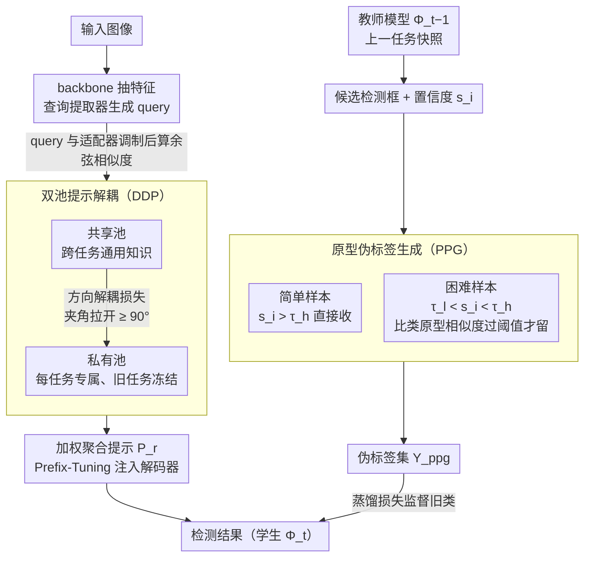

# Beyond Prompt Degradation: Prototype-Guided Dual-Pool Prompting for Incremental Object Detection

**会议**: CVPR 2026  
**arXiv**: [2603.02286](https://arxiv.org/abs/2603.02286)  
**代码**: [有](https://github.com/zyt95579/PDP_IOD/tree/main)  
**领域**: 目标检测  
**关键词**: 增量目标检测, 提示学习, 双池范式, 原型伪标签, 灾难性遗忘

## 一句话总结

提出 PDP 框架，通过双池提示解耦（共享池 + 私有池）和原型引导伪标签生成（PPG），解决增量目标检测中提示耦合与提示漂移导致的提示退化问题，在 COCO 和 VOC 上取得 SOTA。

## 研究背景与动机

增量目标检测（IOD）要求模型在不访问旧数据的前提下持续学习新类别，同时保持对旧类别的检测性能。基于提示（prompt）的方法因其无需数据回放、参数高效而受到关注，但存在两个核心问题：

**提示耦合（Prompt Coupling）**：现有方法采用单提示池范式，将任务通用提示和任务特定提示混存在同一池中，导致有限参数空间内的竞争和干扰

**提示漂移（Prompt Drift）**：在 IOD 设置中，旧类前景对象在后续任务中被标注为"背景"，这种监督不一致迫使已优化的提示朝错误语义方向漂移

现有伪标签方法依赖固定置信度阈值，无法适应类别间的分布差异，进一步加剧漂移。

## 方法详解

### 整体框架

PDP 想解决的是增量目标检测里的「提示退化」：学新类时，旧类提示既被新任务挤占（耦合），又被错误的背景监督带偏（漂移）。它构建在 Deformable-DETR 之上，用一套教师-学生蒸馏架构来落地——学生模型学当前任务，教师模型（上一任务的快照）对图里的旧类对象打伪标签，把旧知识喂回来防遗忘。整条链路是：图像进 backbone 抽特征 → 查询提取器生成 query → query 去两个提示池里检索并聚合出一组提示 $P_r$，经 Prefix-Tuning 注入解码器 → 解码器输出检测结果。两个核心模块各管一个病灶：双池提示解耦（DDP）把通用知识和任务专属知识拆到两个池里互不打架，治「耦合」；原型伪标签生成（PPG）在嵌入空间里用类原型挑回旧类对象的伪标签，治「漂移」。

### 关键设计

**1. 双池提示解耦（DDP）：把「共享」和「专属」拆开，让通用知识和新类知识不再抢同一块参数**

旧方法把任务通用提示和任务特定提示混在一个池里，参数空间有限就互相竞争——这正是提示耦合的根源。DDP 直接把池子拆成两个。共享池持有一组可学习提示 $P_s \in \mathbb{R}^{N_s \times L_p \times D}$、对应的键向量 $K_s$ 和查询适配器 $A_s$，它跨所有任务共享、一直更新，专门沉淀「什么是物体、怎么定位」这类通用视觉知识，从而稳定地把旧任务学到的东西前向迁移给新任务。私有池则给每个任务单独开一份参数 $(P_p^t, K_p^t, A_p^t)$，训练时只动当前任务那份、把旧任务的冻住，于是新类的专属知识不会反过来覆盖旧类提示；私有池大小 $N_p$ 还会按新类数量动态调整，类多就多给几个槽。

检索时，query 先和查询适配器做 Hadamard 积调制，再分别和两个池的键向量算余弦相似度，按相似度加权聚合出提示 $P_r$，最后通过 Prefix-Tuning 注入到 Transformer 解码器里。为了不让两个池学成同一套东西、白拆一场，PDP 还加了一条方向解耦损失，强行把两池提示向量的夹角拉开：

$$\mathcal{L}_{DDL} = \lambda_{ddl} \cdot \frac{2}{|N_s||N_p|} \sum_{i,j} \max(0, \theta_{ddl} - \theta_{i,j})$$

其中 $\theta_{ddl} = 90°$——只要两个池里某对向量的夹角小于 90°就受罚，逼着共享池和私有池学到互补的正交表示，而不是冗余重叠。

**2. 原型伪标签生成（PPG）：用类原型在嵌入空间里把旧类对象「认」回来，替掉一刀切的置信度阈值**

提示漂移的直接诱因是监督不一致：旧类前景在新任务的标注里被当成「背景」，模型一旦照这个错误信号学，已经优化好的提示就被带歪。常规做法是让教师模型对旧类打伪标签，但伪标签依赖一个固定置信度阈值——而不同类别的置信度分布天差地别，固定阈值要么漏掉低置信的真目标，要么放进一堆噪声。PPG 改成在特征空间里比对。它先给每个旧类建一个原型：从解码器最后一层取出那些被正确分类的实例查询嵌入 $f_i$，按类存进记忆库 $F_c$，再求均值得到类原型

$$p_c = \frac{1}{|F_c|}\sum_{f_i \in F_c} f_i$$

而且原型只在每个任务的最后一个 epoch 更新，确保是用充分收敛、稳定的特征算出来的，而非训练早期的抖动表示。

有了原型，伪标签走两级验证：置信度 $s_i > \tau_h$（0.5）的检测属于「简单样本」，直接当可靠伪标签收下；置信度落在 $\tau_l < s_i < \tau_h$（即 0.2 到 0.5）的是「困难样本」——单看置信度不敢要，于是计算它的特征和对应类原型的相似度，相似度过阈值才保留。两类合并成最终伪标签集 $Y_{ppg}$，喂给蒸馏损失。这样一来，那些置信度不高但语义上确实贴近旧类的对象被捞了回来，漂移自然就被压住。

### 一个完整示例

设当前在 COCO 上学 Task4，图里有一只属于旧类的「斑马」。这张图进网络后，query 去共享池（沉淀的「四足动物轮廓+纹理」通用线索）和 Task1 的私有池（当年学斑马时的专属提示）各检索一组提示聚合注入解码器，教师模型给出一个检测框，置信度 $s_i = 0.35$。按旧方法的固定阈值 0.5，这个框会被直接丢掉，斑马沦为「背景」、提示被带偏。换成 PPG：0.35 落在 $(0.2, 0.5)$ 区间，算「困难样本」，于是取它的查询嵌入和「斑马」类原型 $p_c$ 比相似度——结果 0.6 > 0.5，判定为真目标，保留进 $Y_{ppg}$。这个伪标签随后进蒸馏损失，让学生在学新类的同时仍把斑马按旧类正确监督，旧类提示不再漂走。

### 损失函数 / 训练策略

总损失由 DETR 检测损失、查询正则化、方向解耦损失和蒸馏损失组成：

$$\mathcal{L} = \mathcal{L}_{DETR} + \mathcal{L}_Q + \mathcal{L}_{DDL} + \mathcal{L}_{DKD}(Y_{ppg})$$

- $\lambda_{ddl} = 0.15$，$\lambda_Q = 0.1$
- 共享池 100 个提示，私有池数量等于数据集类别总数
- 置信度阈值 $\tau_h = 0.5$，$\tau_l = 0.2$，原型相似度阈值 $\theta_s = 0.5$

## 实验关键数据

### 主实验

**表1：MS-COCO 多步增量设置（4个任务）**

| 方法 | Task4 mAP@P | Task4 mAP@C | Task4 mAP@A |
|------|------------|------------|------------|
| MD-DETR | 51.5 | 52.7 | 50.2 |
| OWOBJ | 49.4 | 38.8 | 43.9 |
| **PDP (Ours)** | **61.3 (+9.8)** | **55.8 (+3.1)** | **59.4 (+9.2)** |

**表3：PASCAL VOC 三种增量设置**

| 方法 | 10+10 mAP@A | 15+5 mAP@A | 19+1 mAP@A |
|------|-------------|-------------|-------------|
| MD-DETR | 73.2 | 76.7 | 76.1 |
| RGR | 75.8 | 73.4 | 75.4 |
| **PDP (Ours)** | **78.7 (+2.9)** | **78.0 (+1.3)** | **79.4 (+3.3)** |

### 消融实验

**模块贡献（Table 4，COCO Task4 mAP@A）**：

| 配置 | mAP@P | mAP@A |
|------|-------|-------|
| 仅私有池 PP | 46.0 | 46.0 |
| PP + SP + DDL | 56.9 | 55.1 |
| PP + PPG | 59.9 | 58.3 |
| PP + SP + PPG + DDL（完整） | **61.3** | **59.4** |

PPG 使旧知识保持率 mAP@P 提升 +13.9%，同时新类适应 mAP@C 提升 +2.7%。

### 关键发现

1. PPG 对三种不同相似度阈值（0.5/0.6/0.7）表现稳定，说明困难样本与原型的相似度天然较高
2. 共享池 $N_s=100$、私有池 $N_p=80$ 为最优配置；共享池过大（160）反而引入冗余导致性能下降
3. PDP 在 PASCAL VOC 19+1 设置下 mAP@P 达到 70.1%，直观可视化表明能准确检测旧类对象

## 亮点与洞察

1. **问题建模精准**：首次将提示退化分解为"耦合"和"漂移"两个独立可处理的子问题
2. **原型空间替代置信度阈值**：在嵌入空间中用类原型做相似度匹配，避免了固定阈值在类别间分布不一致时的失效
3. **端到端框架**：相比 PseDet 需要额外推理+聚类步骤，PDP 是完全端到端的

## 局限与展望

1. 在 70+10 两步设置下略逊于 PseDet（42.9 vs 44.7 AP），大步增量场景仍有提升空间
2. 原型仅在每个任务最后一个 epoch 更新，早期训练阶段原型可能不够准确
3. 私有池随任务数线性增长，长序列任务下参数量管理需要关注
4. 仅在 DETR 系列架构上验证，对 YOLO 等单阶段检测器的适用性未知

## 相关工作与启发

- **MD-DETR**：PDP 的基线架构，使用单记忆库 + 任务 ID 隔离提示
- **DualPrompt**：虽区分 General/Expert Prompt 但仍用单池管理
- **PseDet**：使用 k-means 自适应阈值做伪标签，非端到端
- 双池设计思想可推广到增量分割、增量实例分割等持续学习任务

## 评分

- **新颖性**: ★★★★☆ — 双池解耦+原型伪标签的组合设计新颖
- **技术深度**: ★★★★☆ — 方法设计完整，各模块动机清晰
- **实验充分性**: ★★★★★ — 多数据集、多设置、详细消融
- **写作清晰度**: ★★★★☆ — 图示清晰，问题-方案对应关系明确

<!-- RELATED:START -->

## 相关论文

- [\[CVPR 2026\] Parameterized Prompt for Incremental Object Detection](parameterized_prompt_for_incremental_object_detection.md)
- [\[CVPR 2026\] Dual-Prototype-Guided Multi-task Learning for Unsupervised Anomaly Detection and Classification](dual-prototype-guided_multi-task_learning_for_unsupervised_anomaly_detection_and.md)
- [\[CVPR 2026\] Incremental Object Detection via Future-Aware Decoupled Cross-Head Distillation](incremental_object_detection_via_future-aware_decoupled_cross-head_distillation.md)
- [\[AAAI 2026\] YOLO-IOD: Towards Real Time Incremental Object Detection](../../AAAI2026/object_detection/yolo-iod_towards_real_time_incremental_object_detection.md)
- [\[CVPR 2026\] BDNet: Bio-Inspired Dual-Backbone Small Object Detection Network](bdnetbio-inspired_dual-backbone_small_object_detection_network.md)

<!-- RELATED:END -->
