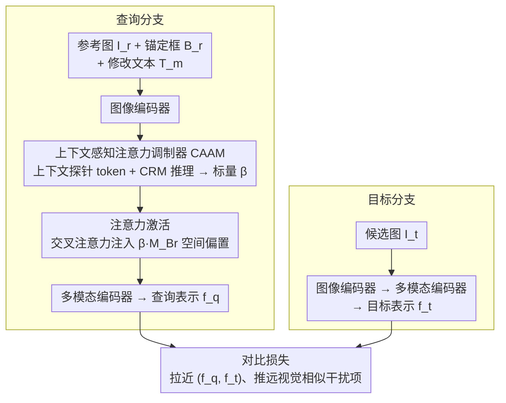

# Beyond Semantic Search: Towards Referential Anchoring in Composed Image Retrieval

**会议**: CVPR 2026  
**arXiv**: [2604.05393](https://arxiv.org/abs/2604.05393)  
**代码**: [项目页](https://hahajun1101.github.io/OACIR/)  
**领域**: 目标检测/图像检索  
**关键词**: 组合图像检索, 实例级一致性, 注意力调制, 细粒度检索, 视觉锚定

## 一句话总结
提出Object-Anchored Composed Image Retrieval（OACIR）新任务和OACIRR大规模基准（160K+四元组），以及AdaFocal框架通过上下文感知注意力调制器自适应地增强对锚定实例区域的关注，在实例级检索保真度上大幅超越现有方法。

## 研究背景与动机
**领域现状**：组合图像检索（CIR）通过参考图像+修改文本的多模态查询实现灵活检索，在电商和交互搜索中广泛应用。

**核心痛点**：CIR本质上优先语义匹配，参考图像仅作为粗粒度视觉锚点——在存在视觉相似干扰项时，**无法可靠地检索用户指定的特定实例**。

**实际需求**：数字记忆检索、长期身份追踪等场景中，保证**具体实例的保真度**比宽泛语义对齐更为关键。

**核心矛盾**：需要同时完成（1）三源信息的组合推理（锚定实例+全局场景+文本修改）和（2）从充满视觉相似干扰项的gallery中精确区分目标实例。

**核心idea**：通过显式的bounding box视觉锚定 + 自适应注意力增强机制，将CIR从语义级提升到实例级。

## 方法详解

### 整体框架
AdaFocal 要解决的是：让组合图像检索不仅匹配"看起来像"的语义，还能锁定用户用 bounding box 框出的那个**具体实例**。它走的是一个双分支对比检索架构。查询分支吃进三源信息——参考图像 $I_r$、框出锚定实例的 box $B_r$、以及修改文本 $T_m$；图像先过编码器，再由 CAAM 模块根据当前查询上下文预测出一个调制标量 $\beta$，这个 $\beta$ 在随后的交叉注意力里被当成偏置注入，按需放大或收敛对实例区域的关注，最后经多模态编码器得到查询表示 $f_q$。目标分支则简单得多：候选图 $I_t$ 直接过图像编码器和多模态编码器得到 $f_t$。训练时用对比损失把对应的 $(f_q, f_t)$ 拉近、把干扰项推远。整套设计的关键就在于"实例关注的力度不是固定的，而是由 $\beta$ 动态决定"。（训练数据来自下面设计 3 的 OACIRR 基准；下图刻画 AdaFocal 模型本身的前向流程。）

### 关键设计

**1. 上下文感知注意力调制器 CAAM：让实例关注的强度随查询上下文自适应**

朴素做法是对框出的实例区域固定加权，但这会和组合推理打架——如果修改文本要求大幅改变场景（"把这件衣服放到海滩背景"），死盯实例反而限制了语义灵活性；反过来如果只改背景而实例不变，就该把注意力牢牢压在实例上。CAAM 的做法是把这个"该多关注实例"的判断交给模型自己学：它在多模态编码器里和参考图像、修改文本一起注入 $K$ 个可学习的**上下文探针 token**，这些探针在与多模态输入的交互中吸收上下文线索，再由一个 Transformer 结构的上下文推理模块 CRM 聚合，最后线性映射成一个标量 $\beta$。$\beta$ 就是这次查询"实例 vs 场景"权衡的结果——它不是超参，而是逐查询动态生成的。

**2. 注意力激活机制：把 $\beta$ 作为空间偏置注入交叉注意力**

有了 $\beta$ 还需要一个干净的方式把它作用到检索表示上。AdaFocal 选择在查询分支的交叉注意力里，对与 bounding box 空间对齐的二值 mask $M_{B_r}$ 加一个由 $\beta$ 缩放的偏置项：

$$\{\hat{q}_m\} = \text{Softmax}\!\left(\frac{QK^T + \beta \cdot M_{B_r}}{\sqrt{d_k}}\right)V$$

当 $\beta>0$ 时，落在框内的 token 在 softmax 前被整体抬高 logit，注意力自然向实例区域聚拢；$\beta$ 越大聚焦越强，$\beta\to 0$ 则退化为普通的语义注意力。这种"加性偏置 + 二值 mask"的写法不引入额外的可学习注意力头，只是借 $\beta$ 这一个标量就实现了空间上的自适应聚焦，思路上和生成模型里 Prompt-to-Prompt 的注意力编辑一脉相承。

**3. OACIRR 基准的四阶段构建流水线：造出真正考验实例区分的数据**

实例级检索没法用现成的 CIR 数据训，因为后者只标语义不标实例。作者为此设计了一条四阶段流水线来批量生产带锚定实例的四元组 $(I_r, B_r, T_m, I_t)$。第一阶段**图像对收集**，从 DeepFashion2、Stanford Cars、Products-10K、Google Landmarks v2 四个域里挑出"同一实例、不同语境"的图像对，覆盖时尚、车、商品、地标四类。第二阶段**图像对过滤**，把过于相似的对剔掉以防模型走捷径，同时滤掉类别中心化的图像。第三阶段**四元组标注**，用 MLLM 生成描述两图差异的修改文本，再用 grounding 模型在参考图上标出实例的 bounding box。第四阶段**gallery 构建**是最吃力的一步——它定向挖掘 hard-negative，即"类别相关但实例不同"的干扰项，正是这些干扰项把任务从"找到对的类别"逼成了"找到对的那一个"。最终得到 160K+ 四元组的大规模基准。

### 损失函数 / 训练策略
- Contrastive Alignment Loss：batch内对比学习，最大化正确查询-目标对的余弦相似度
- 差异化学习率：CAAM用1e-4，多模态编码器用1e-5
- 温度参数 $\tau = 0.07$

## 实验关键数据

### 主实验（OACIRR基准，ViT-G骨干）

| 方法 | Fashion $R_{ID}@1$ | Car $R_{ID}@1$ | Product $R_{ID}@1$ | Landmark $R_{ID}@1$ | Avg |
|------|-----------|----------|------------|-------------|-----|
| GME (7B) | 44.98 | 63.11 | 83.44 | 77.11 | 62.53 |
| SPRC (CIRR训练) | 28.62 | 25.13 | 54.39 | 40.41 | 37.30 |
| SPRC (OACIRR训练) | 65.25 | 72.87 | 86.05 | 76.32 | 74.05 |
| **AdaFocal** | **77.15** | **78.42** | **91.86** | **82.92** | **79.00** |

### 消融实验

| 配置 | $R_{ID}@1$ | R@1 | Avg | 说明 |
|------|-----------|-----|-----|------|
| 无CAAM（$\beta=0$） | 77.74 | 58.39 | 74.91 | 基线 |
| 平均池化+冻结探针 | 79.70 | 59.84 | 76.39 | 简单聚合不足 |
| Transformer CRM+可学习探针 | **82.59** | **62.88** | **79.00** | 推理能力+任务适应 |

### 关键发现
- OACIRR数据集训练使SPRC从37.30%跃升至74.05%：**实例一致性数据**是关键
- AdaFocal在此基础上再提升+4.95%：**自适应注意力调制**有效
- $R@1$与$R_{ID}@1$差距揭示现有方法的主要失败模式是**实例误识别**

## 亮点与洞察
- 将CIR从语义级推进到实例级，是检索领域的重要范式转变
- OACIRR是首个跨四个领域的大规模实例级组合检索基准，具有很高的社区价值
- CAAM的上下文感知调制机制优雅地平衡了实例保真度与组合推理

## 局限与展望
- Bounding box标注增加了用户交互成本，未来可探索自动实例锚定
- 当前仅支持单实例锚定，多实例场景待扩展
- 未探索视频级实例追踪检索

## 相关工作与启发
- 与ReID（行人重识别）的实例一致性目标一致但更通用
- 注意力偏置注入思路来自生成模型（如Prompt-to-Prompt），成功迁移到检索任务
- 对商品搜索、数字资产管理等应用有直接价值

## 评分
- 新颖性: ⭐⭐⭐⭐⭐ 新任务定义+新基准+新方法，三位一体
- 实验充分度: ⭐⭐⭐⭐⭐ 跨多范式对比、详尽消融、定性分析完整
- 写作质量: ⭐⭐⭐⭐ 结构清晰，数据集构建流程详细
- 价值: ⭐⭐⭐⭐⭐ 问题定义和基准贡献将推动检索领域发展

<!-- RELATED:START -->

## 相关论文

- [\[CVPR 2026\] Beyond Caption-Based Queries for Video Moment Retrieval](beyond_caption-based_queries_for_video_moment_retrieval.md)
- [\[CVPR 2026\] Can a Second-View Image Be a Language? Geometric and Semantic Cross-Modal Reasoning for X-ray Prohibited Item Detection](can_a_second-view_image_be_a_language_geometric_and_semantic_cross-modal_reasoni.md)
- [\[CVPR 2025\] Search and Detect: Training-Free Long Tail Object Detection via Web-Image Retrieval](../../CVPR2025/object_detection/search_and_detect_training-free_long_tail_object_detection_via_web-image_retriev.md)
- [\[CVPR 2026\] MRD: Multi-resolution Retrieval-Detection Fusion for High-Resolution Image Understanding](mrd_multi-resolution_retrieval-detection_fusion_for_high-resolution_image_unders.md)
- [\[CVPR 2026\] Parameter-Efficient Semantic Augmentation for Enhancing Open-Vocabulary Object Detection](parameter-efficient_semantic_augmentation_for_enhancing_open-vocabulary_object_d.md)

<!-- RELATED:END -->
