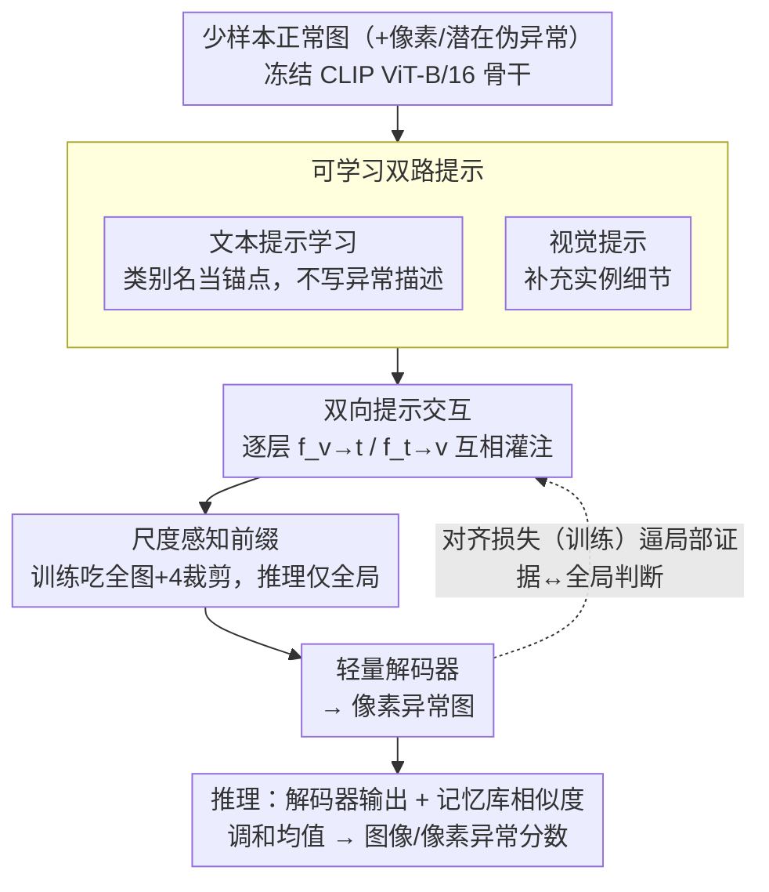

# Bidirectional Multimodal Prompt Learning with Scale-Aware Training for Few-Shot Multi-Class Anomaly Detection

**会议**: CVPR 2026  
**arXiv**: [2408.13516](https://arxiv.org/abs/2408.13516)  
**代码**: 无  
**领域**:目标检测
**关键词**: 少样本异常检测, 多类别统一模型, 双向提示学习, 尺度感知, CLIP

## 一句话总结
提出AnoPLe——一个轻量级多模态双向提示学习框架，无需手工异常描述或外部辅助模块，通过文本-视觉提示双向交互和尺度感知前缀实现少样本多类别异常检测，在MVTec-AD/VisA/Real-IAD上取得强竞争力的同时保持高效推理（~28 FPS）。

## 研究背景与动机
**领域现状**：工业异常检测正从"单类别单模型"向更实际的**少样本+多类别**统一模型方向发展。Few-shot MCAD要求：(a)每类仅几张正常样本；(b)单一模型覆盖多种产品类别。

**现有方法痛点**：
   - WinCLIP靠手工提示模板，不够灵活
   - PromptAD依赖类别特定异常描述（如"断裂的布料""缺失的电线"），多类别下描述池语义冲突，t-SNE显示异常特征塌缩混叠
   - IIPAD用大型Q-Former生成实例提示，计算开销大

**核心观察**：(a)**正常性跨类别共享**（完整、无污染、几何规则），(b)异常性高度**类别依赖**，(c)类别名称本身就是强语义先验（CCL论文验证）

**核心idea**：只用类别名称作为文本锚点（不描述异常类型），通过文本-视觉提示**双向交互**自动学习类别感知且异常类型无关的表示

## 方法详解

### 整体框架
AnoPLe 要解决的是少样本多类别异常检测：每个产品类别只给几张正常图，却要用一个统一模型覆盖所有类别。它的整体思路是在冻结的 CLIP 骨干上同时挂两路可学习提示——文本提示和视觉提示，让它们在每一层双向交互；文本侧只用类别名当语义锚点、不写任何异常描述，视觉侧则补充实例细节。提示交互之外再叠一层尺度感知前缀，训练时同时吃全图和裁剪子图、推理时只走全局分支，这样既拿到了多尺度信息又不增加部署成本。最后由一个轻量解码器把交互后的特征解成像素级异常图，训练时再用对齐损失把局部证据和全局判断绑一致；推理时把解码器输出和记忆库相似度融合成最终的图像/像素异常分数。

### 关键设计

**1. 文本提示学习：只用类别名当锚点，不写异常描述**

PromptAD 这类方法依赖类别特定的异常描述（"断裂的布料""缺失的电线"），在多类别场景下这些描述池语义互相冲突，t-SNE 上异常特征会塌缩混叠。AnoPLe 干脆只用类别名构造两端 prompt：正常端 $\mathbf{e}_0^+ = [\texttt{class}]$，异常端 $\mathbf{e}_0^- = [\texttt{abnormal}][\texttt{class}]$，两端共享一组可学习上下文向量 $\mathbf{P}_0^t$ 并逐层注入成深层提示。这样正常端保留了完整的类别原型，异常端则借 CLIP 预训练里隐式编码的"非正常"先验来初始化，再交给后续视觉交互去细化——全程不需要"断裂""污染""缺失"这些手工异常词，天然回避了描述池冲突。

**2. 双向提示交互：让类别结构和实例细节互相灌注**

只学文本提示缺实例细节、只学视觉提示缺类别结构，单独哪一路都不够。AnoPLe 在每一层 $j$ 用两个可学习线性投影 $f_{v\rightarrow t}$、$f_{t\rightarrow v}$ 把两个模态的提示拼接互融：

$$\tilde{\mathbf{P}}_j^t = [\mathbf{P}_j^t, f_{v\rightarrow t}(\mathbf{P}_j^v)], \quad \tilde{\mathbf{P}}_j^v = [\mathbf{P}_j^v, f_{t\rightarrow v}(\mathbf{P}_j^t)]$$

文本侧把类别先验喂给视觉、视觉侧把实例线索喂回文本，形成闭环互补。消融把这一点说得很直白：T→I 单向只有 84.2% VisA I-AUC、I→T 单向 82.0%，而 T↔I 双向达到 86.0%——双向比任一单向都明显更好。

**3. 尺度感知前缀：训练吃多尺度，推理零额外成本**

工业缺陷既有大面积污染也有细小划痕，单尺度看不全，但多尺度推理又会成倍拖慢速度。AnoPLe 把多尺度的负担全压到训练侧：训练时除了全分辨率图 $I_0$（240×240），还额外裁出 4 个非重叠子图 $I_1,\dots,I_4$（480×480 裁剪），并给每种尺度配一个可学习前缀 $c \in \mathbb{R}^{(N+1)\times d_v}$，不同尺度的输入走对应的 $c_i$。推理时只保留全局前缀，于是多尺度的好处被"内化"进了网络权重，部署时不需要真的跑多次前向。消融逐级验证了它的必要性：单尺度无前缀 89.9% → 多尺度无前缀 91.8% → 多尺度加前缀 94.5%。

**4. 对齐损失：逼局部异常证据和全局判断一致**

像素级解码器和全局 [CLS] 表示可能给出互相矛盾的判断——局部说这块有异常、全局却判正常。对齐损失把两者绑在一起：先用预测的异常图 $\hat{\mathbf{M}}$ 对像素级距离做加权聚合得到证据向量 $\mathbf{s}$，再要求它和全局表示 $\mathbf{z}_0$ 对齐：

$$\mathbf{s} = \sum_{(i,j)} \hat{\mathbf{M}}_{ij} \circ D_{ij}(\mathbf{z}), \quad \mathcal{L}_{align} = 1 - \langle \mathbf{z}_0, \mathbf{s} \rangle$$

它在类别数量大的数据上尤其关键：Real-IAD（30 个类别）上一旦去掉这项，VisA 设置的 I-AUC 会从 86.0% 直接崩到 73.3%，说明类别越多、局部-全局越容易打架，越需要这道一致性约束。

### 损失函数 / 训练策略
- $\mathcal{L} = \mathcal{L}_{pixel} + \mathcal{L}_{img} + \mathcal{L}_{align}$
- 像素级：Dice loss + Focal loss
- 图像级：对比交叉熵（含像素空间+潜在空间扰动的伪异常）
- 推理时融合记忆库相似度和解码器输出（调和均值）

## 实验关键数据

### 主实验（1-shot多类别AD）

| 方法 | MVTec I-AUC | MVTec P-PRO | VisA I-AUC | VisA P-PRO | Real-IAD I-AUC |
|------|------------|------------|-----------|-----------|---------------|
| PatchCore | 66.5 | 66.9 | 69.8 | 70.0 | 59.3 |
| WinCLIP | 77.5 | 70.8 | 70.0 | 61.2 | 69.4 |
| PromptAD | 91.2 | 86.1 | 82.4 | 77.8 | 52.2 |
| INP-Former | 94.7 | 90.7 | 84.0 | 84.0 | **84.4** |
| **AnoPLe** | 94.5 | **90.8** | **86.0** | **87.5** | 81.2 |

### 消融实验

| 设置 | MVTec I-AUC | VisA I-AUC | 说明 |
|------|-----------|-----------|------|
| 仅文本提示 | 93.0 | 81.7 | 缺乏实例细节 |
| 仅视觉提示 | 90.3 | 82.0 | 缺乏类别结构 |
| T→I单向 | 93.5 | 84.2 | 文本指导视觉 |
| **T↔I双向** | **94.5** | **86.0** | 双向互补最优 |
| 无对齐损失 | 93.7 | 86.0→73.3(Real-IAD) | 对Real-IAD影响巨大 |
| 无多尺度/前缀 | 89.9 | 82.3 | 不可或缺 |

### 关键发现
- AnoPLe在VisA（最具挑战性的跨类别基准）上以86.0% I-AUC领先，P-PRO 87.5%显著超越PromptAD的77.8%
- 未见类别泛化（leave-one-class-out）：AnoPLe在MVTec上held-out类仅降6.3%，INP-Former降26.2%
- 未见异常类型泛化：PromptAD去除描述后大幅下降（-10.0 on screw），AnoPLe天然不受影响
- 推理速度~28 FPS，远快于IIPAD（需Q-Former额外前向传播）

## 亮点与洞察
- **大道至简**：不需要异常描述、不需要外部大模块，仅靠类别名称+双向交互就达到SOTA水平
- 尺度感知前缀的"训练时多尺度+推理时仅全局"设计巧妙地解决了效率-精度矛盾
- 强调了"正常性共享+异常性类别依赖"这一被忽视的不对称性
- 对齐损失在大规模多类别数据（Real-IAD 30个类别）上贡献最为显著

## 局限与展望
- Real-IAD上落后于INP-Former约3%，纯视觉方法在某些场景可能更匹配
- CLIP ViT-B/16+骨干限制了下限，更大骨干可能进一步提升
- 伪异常生成策略（像素扰动+潜在空间扰动）可能不够贴近真实缺陷
- 未探索zero-shot设置（完全无正常样本）

## 相关工作与启发
- 与CCL（类别感知对比学习）观点一致：类别语义是组织多类别表示的强先验
- 双向提示交互思想可推广到其他VLM适配任务（如医学图像分析）
- 尺度感知训练策略对任何需要多尺度推理但追求效率的任务有借鉴价值
- 成功在医学领域（如眼底图像、X光）泛化，验证了框架的通用性

## 评分
- 新颖性: ⭐⭐⭐⭐ 双向提示交互和尺度感知前缀设计新颖，但整体遵循VLM prompt tuning范式
- 实验充分度: ⭐⭐⭐⭐⭐ 三大基准、多shot设置、泛化实验、t-SNE可视化、注意力分析完整
- 写作质量: ⭐⭐⭐⭐ 动机阐述清晰，与现有方法对比充分
- 价值: ⭐⭐⭐⭐⭐ 实用性极强——轻量、高效、不依赖专家知识，适合实际工业部署

<!-- RELATED:START -->

## 相关论文

- [\[CVPR 2026\] SubspaceAD: Training-Free Few-Shot Anomaly Detection via Subspace Modeling](subspacead_training-free_few-shot_anomaly_detection_via_subspace_modeling.md)
- [\[CVPR 2026\] GS-CLIP: Zero-shot 3D Anomaly Detection by Geometry-Aware Prompt and Synergistic View Representation Learning](gs-clip_zero-shot_3d_anomaly_detection_by_geometry-aware_prompt_and_synergistic_.md)
- [\[CVPR 2026\] Defect Cue-Preserved Structural Feature Refinement for Few-Shot Anomaly Detection](defect_cue-preserved_structural_feature_refinement_for_few-shot_anomaly_detectio.md)
- [\[CVPR 2026\] Learning Multi-Modal Prototypes for Cross-Domain Few-Shot Object Detection](learning_multi-modal_prototypes_for_cross-domain_few-shot_object_detection.md)
- [\[CVPR 2026\] MMR-AD: A Large-Scale Multimodal Dataset for Benchmarking General Anomaly Detection with MLLMs](mmrad_multimodal_anomaly_detection.md)

<!-- RELATED:END -->
