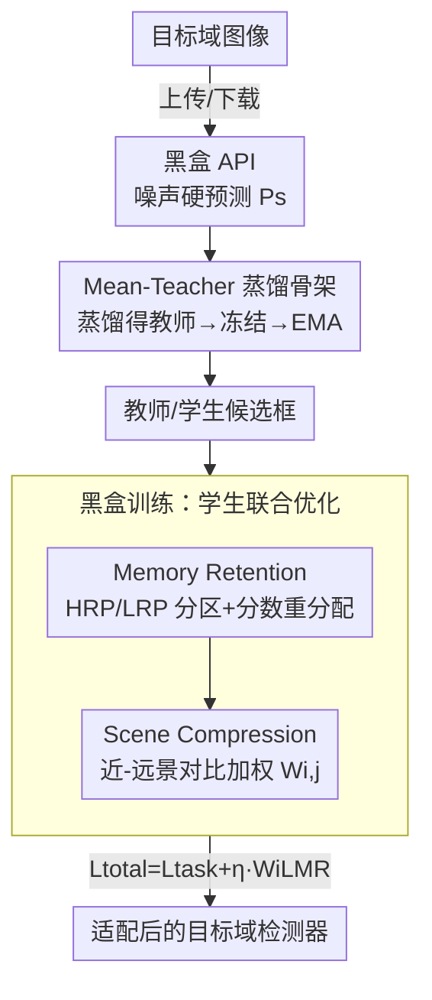

# Black-Box Domain Adaptation for Object Detection with Retention-Driven Knowledge Compression

**会议**: CVPR 2026  
**论文**: [CVF Open Access](https://openaccess.thecvf.com/content/CVPR2026/html/Lu_Black-Box_Domain_Adaptation_for_Object_Detection_with_Retention-Driven_Knowledge_Compression_CVPR_2026_paper.html)  
**代码**: 无（论文未提供）  
**领域**: 目标检测 / 域适应  
**关键词**: 黑盒域适应, 目标检测, 终身学习, Mean-Teacher, 对比学习  

## 一句话总结
在只能调用云端黑盒 API、拿不到源数据也拿不到源模型的最严格隐私约束下做跨域目标检测，本文用终身学习中的"主动遗忘 + 选择性稳固"机制设计了 RDKC：Memory Retention 按可靠度把候选框分区并重分配预测分数以抗噪、Scene Compression 用近-远景对比加权引导细粒度定位，在 4 个跨域 benchmark 上全面超过此前 BBDA SOTA（如 Cityscapes→Foggy mAP 比 DINE 提升 +4.2）。

## 研究背景与动机
**领域现状**：跨域目标检测主流是无监督域适应（UDA），训练时同时访问有标注源域和无标注目标域。为了保护隐私，又演化出无源域适应（SFDA），只需源模型 + 目标数据。最近更进一步的是黑盒域适应（BBDA）——连源模型权重都不给，用户只能把目标图像上传到云端 API，下载回一批**噪声硬预测**（只有 box+类别，没有概率分布、没有梯度），隐私性最强、部署最灵活。

**现有痛点**：BBDA 的已有工作几乎全部针对图像分类。分类是"全图→类别"的全局映射，而检测要同时学局部定位（bounding box）和局部分类，已有 BBDA 策略完全没有为定位做优化。更要命的是，这些分类方法依赖 adaptive label smoothing 之类手段去存"整张图的全局特征"做累积预测，这和检测里**逐区域、动态**的预测机制根本对不上。检测领域唯一的 BBDA 工作 BiMem 也是从分类方法 DINE 改的，没给出完整检测方案。

**核心矛盾**：黑盒下载回来的噪声标签在整个适配过程里是**静态不变**的。如果直接拿 SFDA 那套自训练去学，模型只能反复拟合这批固定噪声，性能提升极其有限（论文 Figure 2 指出这是 SFDA 在黑盒下退化的根因）。所以真正的矛盾是：既要从噪声预测里**挖出可靠信息**，又要**抑制噪声**，还不能在反复训练中**灾难性遗忘**已学到的知识——三者要同时平衡。

**本文目标**：① 为检测任务（而非分类）量身定制一套 BBDA 机制；② 在静态噪声标签下既抗噪又保留知识；③ 提升 box 的细粒度定位/感知能力。

**切入角度**：作者借鉴生物行为科学里的"终身学习"——把人脑记忆看成一个动态自适应系统，靠三个过程持续学习：主动遗忘（剔除低价值信息腾出资源）、选择性稳固（强化高价值信息的神经通路）、跨模块协同整合（高鲁棒与低鲁棒子系统的输出协同）。这个角度有希望，是因为它天然把"遗忘噪声 vs 保留知识"建模成了一个需要动态平衡的过程，正好对上 BBDA 的核心矛盾。

**核心 idea**：用"主动遗忘"机制（MR）按区域可靠度有选择地重分配预测分数来抗噪保知识，用"选择性稳固"机制（SC）做近-远景对比来强化定位，再用 Mean-Teacher 的师生协同充当"跨模块整合"防遗忘——三者合成 Retention-Driven Knowledge Compression（RDKC）。

## 方法详解

### 整体框架
RDKC 要解决的是：手里只有一个黑盒 API 和它吐出的静态噪声硬预测，怎么把一个检测器适配到目标域。整体流程分三步串行：**(a) 黑盒初始化**——把目标图像上传 API、下载噪声硬预测 $P_s$；**(b) 知识蒸馏**——用这批噪声预测当监督，把目标域知识蒸馏进一个教师检测器；**(c) 黑盒训练**——冻结/EMA 更新教师，用它生成的伪标签监督学生，学生的优化由两个核心组件 Memory Retention（MR）和 Scene Compression（SC）联合驱动。

整套训练基于 Mean-Teacher 自训练框架：教师对弱增广图像出伪标签，学生在强增广图像上学，学生靠梯度更新（式 $\Theta_{stu}=\Theta_{stu}+\alpha\frac{\partial L_{task}}{\partial \Theta_{stu}}$），教师靠学生的指数滑动平均更新（$\Theta_{tea}=\beta\Theta_{tea}+(1-\beta)\Theta_{stu}$）。MR 和 SC 都作用在这个回环里：MR 改造教师给出的预测分数、SC 给 MR 的损失项乘上场景压缩权重。

### 关键设计

**1. Mean-Teacher 蒸馏骨架：把黑盒 API 的噪声硬预测变成可训练的教师**

BBDA 的难点是黑盒只给硬预测、没有梯度也没有源模型，直接拿来当标签噪声太大。RDKC 先做一步简单知识蒸馏：用下载回来的噪声硬预测 $P_s$ 当监督，对教师参数做标准检测损失对齐 $\Theta_{tea}=\Theta_{tea}+\alpha\frac{\partial L_{task}}{\partial \Theta_{tea}}$，让教师先吃进目标域知识；这里的任务损失就是 Faster R-CNN 的四项之和——RPN 与 ROI 头各自的分类、回归损失 $L_{task}=L^{rpn}_{cls}+L^{rpn}_{reg}+L^{roi}_{cls}+L^{roi}_{reg}$。蒸馏完成后冻结教师、用它的权重初始化学生，进入黑盒训练阶段，教师改由 EMA 缓慢跟随学生。

这一步对应终身学习里的"跨模块协同整合"：高鲁棒的教师与正在学习的学生作为两个子系统协同，教师当稳定锚点防止学生在静态噪声上学崩。它本身沿用了 Mean-Teacher，但关键在于把它适配到了 BBDA-OD——先蒸馏再冻结的两阶段设计，使后续 MR/SC 有一个稳定的教师预测可供分区和对比，这是分类 BBDA 方法（DINE/BiMem 那套全局累积预测）做不到的。

**2. Memory Retention（MR）：按可靠度把候选框分区并重分配预测分数**

针对"静态噪声标签既要挖可靠信息又要抗噪防遗忘"的核心矛盾，MR 模拟"主动遗忘"，先做粗粒度分区再做分数重分配。分区规则（式 5）把每个候选框分成高可靠 HRP 与低可靠 LRP 两类：当教师对该框的 Top-1 softmax 分数 $\text{Top1}(Sco^{tea}_{i,j})<\lambda$、**且**师生该框的 IoU 低于该图所有框的平均 IoU 时判为 HRP，否则为 LRP（$\lambda$ 是分区阈值超参）。直觉是：教师不那么自信、且师生分歧大的框，恰恰是最值得重点处理的"可靠信号被噪声掩盖"区域。分区结果会存进一个 memory bank 供后续检索复用。

分数重分配（式 6/7）对两类框区别对待。HRP 框只保留最大类的分数、把其余各类按 $\frac{\sum_{l=1}^{K}(1-Sco^{tea}_{i,j,l})\cdot Sco^{tea}_{i,j,k}}{K-1}$ 比例压低，用可靠类去压制噪声 logits；LRP 框则**原样保留**全部分数以防灾难性遗忘。两类都再和上一轮分数 $Sco^{tea*}_{i,j}$ 做静态系数 $\alpha{=}0.6$ 的加权融合（$Sco^{tea}_{i,j}=\alpha\widetilde{Sco}^{tea}_{i,j}+(1-\alpha)Sco^{tea*}_{i,j}$）来稳定更新。最后用 KL 散度把学生分数拉向重分配后的教师分数：

$$L_{MR}=\frac{1}{n_{HRP}}\sum_{j=1}^{n_{HRP}}D_{KL}(Sco^{stu}_{i,j}\|\widetilde{Sco}^{tea}_{i,j})+\frac{1}{n_{LRP}}\sum_{j=1}^{n_{LRP}}D_{KL}(Sco^{stu}_{i,j}\|Sco^{tea}_{i,j})$$

和分类里"对所有类做统一 label smoothing"不同，MR 是逐区域、逐数据类型地把非最大类的噪声 logits 重新分配，既抑制冗余又靠 LRP 的原样保留兜住遗忘——这是它专门为检测的局部预测机制设计、而非照搬分类方案的关键。

**3. Scene Compression（SC）：用近-远景对比生成压缩权重，引导细粒度定位**

MR 解决了"学哪些类别分数"，但没解决"box 定位的细粒度感知"，尤其远景小目标置信度天然偏低、容易漏检。SC 模拟"选择性稳固"：前人观察到师生预测的特征距离与该区域和真值框的 IoU 正相关（高置信伪标签往往 IoU 更高），SC 就用师生预测的余弦相似度生成场景压缩权重 $W_{i,j}$（式 9），对 HRP 取 $\exp(-\log[\cos(Sco^{stu}_{i,j},\widetilde{Sco}^{tea}_{i,j})])$、对 LRP 取 $\exp(-\log[1-\cos(Sco^{stu}_{i,j},Sco^{tea}_{i,j})])$。它的作用是：在师生分歧大的高可靠框上，把教师当"锚点"逼学生对齐并压缩特征；在低可靠框上抑制高分歧预测、削弱噪声干扰。

由于类主导框在近景里更可靠、远景里置信度明显下降，SC 借这个权重让损失优先学高置信的类主导框、压低背景区域，从而**用近景的可靠线索去引导远景表征的学习**，提升定位能力。SC 不单独成一项损失，而是把权重乘到 MR 损失的每一项上构成加权损失 $W_iL_{MR}$（式 10）。

### 损失函数 / 训练策略
学生的总优化目标是任务损失加上场景压缩加权的 MR 损失：$L_{total}=L_{task}+\eta\cdot W_iL_{MR}$（式 11），$\eta$ 控制 RDKC 的整体强度。训练流程为：知识蒸馏阶段训 5 epoch，黑盒训练阶段训 10 epoch；检测器用 Faster R-CNN + ResNet-50（ImageNet 预训练）；SGD，学习率 $\alpha{=}0.001$、动量 0.9、权重衰减 0.0001；教师 EMA 衰减率 $\beta{=}0.8$；分区融合系数 $\alpha{=}0.6$。

## 实验关键数据

### 主实验
评测覆盖 4 类域偏移、6 个 benchmark：天气（Cityscapes→Foggy-Cityscapes）、合成到真实（Sim10K→Cityscapes）、跨相机（KITTI→Cityscapes）、真实到艺术（Pascal-VOC→Watercolor）。U/SF/BB 分别表示 UDA/SFDA/BBDA 设置，RDKC 在最严格的 BB 设置下全面领先此前 BBDA SOTA。

| 场景 | 指标 | Source-only | DINE (BB) | BiMem (BB) | SEAL (BB) | RDKC (BB) | vs DINE |
|------|------|------|------|------|------|------|------|
| Cityscapes→Foggy | mAP | 25.2 | 36.5 | 38.4 | 34.3 | **40.7** | +4.2 |
| Pascal-VOC→Watercolor | mAP | 44.6 | 45.6 | 45.2 | 46.1 | **53.7** | +8.1 |
| Sim10K→Cityscapes | AP(Car) | 32.0 | 37.9 | 37.2 | 38.1 | **49.1** | +11.2 |
| KITTI→Cityscapes | AP(Car) | 33.9 | 39.8 | 40.1 | 40.0 | **50.4** | +10.6 |

在 Sim10K/KITTI→Cityscapes 上，RDKC 的 Car AP 甚至接近或超过部分 UDA 方法（如 MeGA-CDA 44.8/43.0），而 RDKC 用的信息远少于 UDA，说明它在极弱监督下也能逼近强监督设置。

### 消融实验
"w/o SC"通过把 $W_{i,j}$ 固定为 1 实现（只留 MR）；MR 还被单独嫁接到 SFDA 方法 IRG/LPLD 上验证其通用性。

| 配置 | Foggy mAP | Sim10K AP(Car) | Watercolor mAP | 说明 |
|------|------|------|------|------|
| RDKC (Full) | **40.7** | **49.1** | **53.7** | MR + SC 完整 |
| w/o SC（仅 MR） | 37.6 | 43.9 | 50.1 | 去掉 SC，Foggy 掉 3.1 |
| IRG† (BB) | 33.1 | 38.6 | 48.8 | SFDA 方法直接搬到 BB |
| IRG† + MR | 38.3 | 44.7 | 51.0 | 加 MR 后 Foggy +5.2 |
| LPLD† (BB) | 32.6 | 38.9 | 50.7 | SFDA 方法直接搬到 BB |
| LPLD† + MR | 39.9 | 46.8 | 53.1 | 加 MR 后 Foggy +7.3 |

### 关键发现
- **MR 是 BBDA 的核心贡献，且可即插即用**：把 MR 单独加到 IRG/LPLD 上，三个场景全面提升（Foggy 上 IRG +5.2、LPLD +7.3），印证了"SFDA 方法在黑盒下因静态噪声标签退化、MR 正好补这个短板"的论断。
- **SC 主要补定性的定位质量**：去掉 SC 后 mAP 掉 1.6~5.2；定性图（Figure 4）显示无 SC 时近景类主导目标出现重叠标注、远景目标常漏检，加上 SC 后远景细粒度目标也能被准确感知。
- **超参敏感性（Figure 5）**：$\lambda{=}0$ 时所有框归为 LRP、MR 失活且 SC 一律压制师生连接，联合损失彻底失效；$\lambda{=}1$ 时全归 HRP、MR 无差别优化所有分数、SC 强逼学生对齐教师，学生学不到差异。最优在 $\lambda{=}0.6,\eta{=}1.5$ 附近（Foggy 达 40.7），说明"分区阈值要把可靠/不可靠框真正分开"是 MR 生效的前提。

## 亮点与洞察
- **把"终身学习三过程"逐一映射到 BBDA 组件**：主动遗忘→MR、选择性稳固→SC、跨模块整合→Mean-Teacher。这种"生物机制对应工程模块"的拆法不只是讲故事，它直接解释了为什么要"LRP 原样保留分数防遗忘"——很有迁移价值。
- **HRP/LRP 双判据分区很巧**：同时看教师 Top-1 置信度和师生 IoU 偏差，避免了只用置信度阈值（噪声标签的置信度本身不可信）的陷阱，是把"可靠性"从单一分数升级为"分数 + 一致性"双信号。
- **MR 作为可插拔损失的通用性**：嫁接到现成 SFDA 方法即涨点，意味着它本质上是一个"对抗静态噪声标签"的通用正则，可迁移到其他黑盒/弱监督检测场景。
- **近景引导远景的对比思路**：把"近景可靠、远景不可靠"这一检测里普遍存在的尺度-置信度规律，转成显式的对比加权，对小目标/远景检测是可复用的 trick。

## 局限与展望
- **依赖一个能给出合理硬预测的黑盒源**：若源模型与目标域差异极大、API 预测几乎全错，HRP/LRP 分区会失真，MR/SC 都建立在"教师预测部分可靠"的假设上。
- **检测器与框架较固定**：实验都基于 Faster R-CNN + ResNet-50，对 DETR 类一阶段/无 proposal 检测器是否适用（SC 的 box 级对比、MR 的 proposal 分区都假设有 RPN proposals）需进一步验证。⚠️ 论文提到补充材料有架构通用性实验，但正文未给具体数据。
- **超参敏感**：$\lambda,\eta$ 对结果影响明显（Figure 5 中从 25 到 40+ 的大幅波动），换数据集可能需要重新调参，缺少自适应设定阈值的机制。
- **静态系数 $\alpha{=}0.6$ 沿用前人**：分区融合里防遗忘的力度是固定的，没有随训练动态调整，可能不是各场景最优。

## 相关工作与启发
- **vs DINE / BiMem（分类派 BBDA）**：DINE/BiMem 做的是"全局→类别"的累积预测优化，BiMem 虽延伸到检测但由分类方法 DINE 改来、没有完整检测方案；RDKC 直接为检测的逐区域预测机制设计 MR（proposal 分区）和 SC（box 级对比），在 Foggy 上 +4.2、Watercolor 上 +8.1。
- **vs SFDA 方法（IRG / LPLD）在黑盒下**：SFDA 假设能拿到源模型，搬到黑盒只能反复拟合静态噪声标签而退化；RDKC 的 MR 作为可插拔损失嫁接上去就能把它们救回来（IRG +5.2、LPLD +7.3 mAP），证明问题出在"没处理静态噪声"而非方法本身。
- **vs UDA 方法（MeGA-CDA / PT）**：UDA 用最强监督（源+目标数据），RDKC 用最弱监督（仅黑盒 API），却在 Sim10K/KITTI→Cityscapes 的 Car AP 上逼近甚至超过部分 UDA，体现了"用对机制比用更多数据更关键"。

## 评分
- 新颖性: ⭐⭐⭐⭐⭐ 首个为目标检测量身设计的 BBDA 方法，且把终身学习三机制系统映射到 MR/SC/Mean-Teacher。
- 实验充分度: ⭐⭐⭐⭐ 覆盖 4 类域偏移 6 个 benchmark + 跨方法嫁接 + 超参分析，扎实；但缺一阶段检测器的正文验证。
- 写作质量: ⭐⭐⭐⭐ 动机和 Figure 2 对比清晰，公式完整；部分符号（式 6/7 重分配）需对照原文细读。
- 价值: ⭐⭐⭐⭐⭐ MR 作为可插拔抗噪损失通用性强，隐私敏感场景的黑盒检测落地价值高。

<!-- RELATED:START -->

## 相关论文

- [\[CVPR 2026\] Bridge: Basis-Driven Causal Inference Marries VFMs for Domain Generalization](bridge_basis-driven_causal_inference_marries_vfms_for_domain_generalization.md)
- [\[CVPR 2026\] Spike-driven Discrete Aggregation for Event-based Object Detection](spike-driven_discrete_aggregation_for_event-based_object_detection.md)
- [\[CVPR 2026\] Remedying Target-Domain Astigmatism for Cross-Domain Few-Shot Object Detection](remedying_target-domain_astigmatism_for_cross-domain_few-shot_object_detection.md)
- [\[CVPR 2026\] ADSeeker: A Knowledge-Grounded Reasoning Framework for Industry Anomaly Detection and Reasoning](adseeker_a_knowledge-grounded_reasoning_framework_for_industry_anomaly_detection.md)
- [\[CVPR 2026\] CD-Buffer: Complementary Dual-Buffer Framework for Test-Time Adaptation in Adverse Weather Object Detection](cd-buffer_complementary_dual-buffer_framework_for_test-time_adaptation_in_advers.md)

<!-- RELATED:END -->
