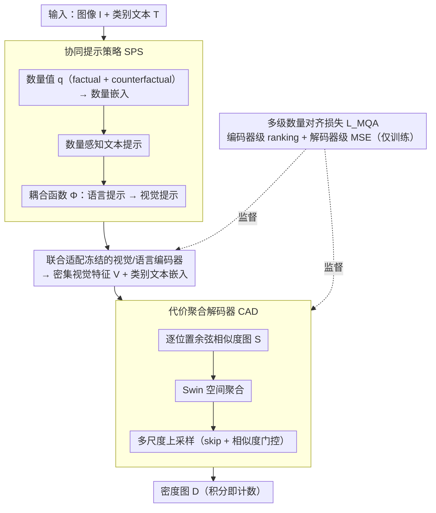

# Boosting Quantitive and Spatial Awareness for Zero-Shot Object Counting

**会议**: CVPR 2026  
**arXiv**: [2603.16129](https://arxiv.org/abs/2603.16129)  
**代码**: 即将开源  
**领域**: 目标检测  
**关键词**: zero-shot counting, vision-language model, prompt tuning, cost aggregation, quantity awareness

## 一句话总结
提出QICA框架解决零样本目标计数中的数量感知缺失和空间不敏感问题，通过数量条件化的协同提示策略（SPS）联合适配视觉-语言编码器，结合在相似度图上直接操作的代价聚合解码器（CAD）保持零样本迁移能力，在FSC-147上达到零样本SOTA（MAE 12.41）并展现强跨域泛化。

## 研究背景与动机

**领域现状**：零样本目标计数（ZSOC）旨在仅通过文本描述枚举任意类别物体。主流方法利用CLIP等VLM计算视觉-文本相似度图，再用CNN/Transformer解码器预测密度图。

**现有痛点**：(1) **缺乏数量感知**——文本提示仅指定类别不包含数量信息，模型擅长识别"是什么"但不理解"有多少"，特别是密集场景下精度受限；(2) **空间不敏感+特征空间畸变**——直接fine-tune VLM编码器导致严重过拟合训练类别，破坏预训练特征空间，损害零样本泛化。

**核心矛盾**：要精确计数就需适配编码器学习数量敏感特征，但fine-tuning又会破坏零样本泛化能力——这形成了适配vs泛化的两难困境。

**本文目标**：(1) 让模型具备细粒度数量区分能力；(2) 在不破坏预训练特征空间的前提下实现有效适配。

**切入角度**：引入数量条件化提示让编码器隐式学习数量信息，同时在相似度图（而非特征空间）上操作来避免特征畸变。

**核心 idea**：训练时用factual/counterfactual数量提示教模型区分不同数量，推理时仅用类别提示实现零样本计数。

## 方法详解

### 整体框架
QICA 要解决的是「适配 vs 泛化」的两难：要数零样本的物体就得让 CLIP 编码器学会数量敏感的特征，但直接 fine-tune 又会撑坏预训练的特征流形、毁掉零样本迁移。它的破局思路是把「数量信息」塞进训练阶段的提示里、让编码器隐式吸收，再把真正的密度回归挪到相似度图这个标量场上做，从而绕开对特征空间的破坏。

整体流程是：图像 $I$ 和文本 $T$ 进来，**协同提示策略（SPS）**用带数量条件的可学习提示同时适配冻结的视觉和语言编码器，编码出密集视觉特征与文本嵌入；二者算逐位置余弦相似度得到相似度图，交给**代价聚合解码器（CAD）**做空间聚合与多尺度上采样、输出密度图 $D$；训练时再由**多级数量对齐损失 $\mathcal{L}_{MQA}$** 在编码器和解码器两级钉住数量一致性。关键在于：携带数量信息的那条路径只在训练时存在，推理时关掉、只留类别语义路径，于是「会数数」的能力被沉淀进编码器、却不再需要数量提示。

### 关键设计

**1. 协同提示策略（SPS）：让两个编码器一起学会感知数量**

单纯给文本提示加个数量标签，只动了语言侧，视觉编码器并不知道该往「数量敏感」的方向调，跨模态的协调无从谈起。SPS 的做法是先把数量值 $q$ 映射成连续嵌入 $\epsilon_q$，叠加到每层可学习提示 $\Pi^j$ 上得到数量感知文本提示 $\hat{\Pi}^j_k = \Pi^j + \epsilon_{q_k}\mathbf{1}^T$；再用一个耦合函数 $\Phi^j$ 把语言提示投影成视觉提示 $\Psi^j_k = \Phi^j(\hat{\Pi}^j_k)$。这条投影建立了语言→视觉的直接梯度通路，反传时两个编码器被同一个数量信号牵引、联合向数量感知方向适配，而不是各调各的。训练时每张图都会生成 factual（真实数量）和 counterfactual（偏离真值的数量）两类提示，让模型在「对的数」和「错的数」之间学出区分度，比单纯加一个数量标签更有判别力。

**2. 代价聚合解码器（CAD）：在相似度图而非特征空间上回归密度**

fine-tune VLM 的老大难在于解码器若直接吃编码器特征，回传的梯度会把预训练流形拽变形、导致过拟合训练类别。CAD 把回归对象换成一个标量场：先算密集视觉特征 $\mathbf{V}$ 与类别文本嵌入 $\mathbf{T}^{\text{cat}}_k$ 的逐位置余弦相似度，得到相似度图 $\mathbf{S}_k$，再经嵌入层 → Swin Transformer 空间聚合 → 带 skip connection 和相似度门控的多尺度上采样 → 预测头，输出密度图。因为聚合发生在相似度图（一个标量场）而非高维嵌入上，预训练特征空间几乎零破坏——这就同时拿到了「能 fine-tune 编码器」和「不损害泛化」两头，正是前面两难的解法。

**3. 多级数量对齐损失 $\mathcal{L}_{MQA}$：把数量约束钉到编码器和解码器两级**

只在解码器端监督密度图，编码器其实并没被逼着把数量编进特征，推理时去掉数量提示就容易失准。$\mathcal{L}_{MQA}$ 在两级同时施压：编码器级用 ranking loss 要求真实数量假设的全局相似度最高（$\alpha_0 > \alpha_i$），且假设数量越接近真值相似度越高；解码器级用辅助 MSE 约束每个数量假设的密度图积分要匹配它对应的数量值。总损失为

$$\mathcal{L}_{MQA} = \|D^0 - D^{GT}\|_2^2 + \lambda_1 \mathcal{L}^{qty}_{enc} + \lambda_2 \mathcal{L}^{qty}_{dec}$$

其中第一项是真值密度图的 MSE。编码器级的 ranking 约束是关键：它让特征空间在训练阶段就把数量信息隐式编码进去，所以推理时即便只喂类别提示、没有任何数量线索，编码器也已经「知道该数多少」。

### 一个完整示例
以一张含 50 个苹果的图为例走一遍训练：SPS 为它造出若干数量假设，比如 factual 的 $q_0=50$ 和 counterfactual 的 $q_1=30$、$q_2=70$，每个 $q_k$ 经 $\epsilon_{q_k}$ 注入提示、再由耦合函数同步成视觉提示，共享编码器对每个假设各前向一遍，得到各自的相似度图与密度图。$\mathcal{L}_{MQA}$ 此时一并发力：编码器级要求 $q_0=50$ 这条的全局相似度高于 $q_1=30$、$q_2=70$，且 $q_1=30$（差 20）应比 $q_0$ 略低、$q_2=70$（差 20）也是；解码器级要求 $q_0$ 那张密度图积分接近 50、$q_1$ 接近 30、$q_2$ 接近 70。多轮之后，「相似度随数量逼近真值而升高」这条规律被压进编码器特征里。到了推理，这张图只喂「apple」类别提示、不带任何数量，编码器凭已学到的数量敏感特征直接给出密度图、积分即得计数——训练时的数量路径已经全部关闭。

### 损失函数 / 训练策略
- 总目标即上文 $\mathcal{L}_{MQA}$：密度图 MSE + encoder ranking loss（$\lambda_1=0.1$）+ decoder counting loss（$\lambda_2=0.05$）。
- 训练时每张图生成 $K$ 个数量假设（factual + counterfactual），共享编码器参数各自独立前向。
- 推理完全不需要数量信息，仅输入类别文本。

## 实验关键数据

### 主实验

**FSC-147 零样本计数**

| 方法 | Backbone | Val MAE↓ | Val RMSE↓ | Test MAE↓ | Test RMSE↓ |
|------|----------|----------|-----------|-----------|------------|
| CounTX | ViT-B/16 | 17.76 | 65.21 | 16.70 | 105.21 |
| VLCounter | ViT-B/16 | 18.06 | 65.13 | 17.05 | 106.16 |
| T2ICount | SD-v1.5 | 13.78 | 58.78 | 11.76 | 97.86 |
| CountGD | GDINO-Swin-B | 12.14 | 47.51 | 14.76 | 120.42 |
| **QICA** | ViT-B/16 | **13.82** | **60.24** | **13.05** | 104.17 |
| **QICA†** | ViT-L/14 | **12.98** | **56.35** | **12.41** | - |

### 消融实验

| 配置 | Val MAE | Test MAE | 说明 |
|------|---------|----------|------|
| Baseline (CLIP + Conv decoder) | ~18 | ~17 | 无数量感知 |
| + SPS (仅文本提示) | ~16 | ~15 | 单模态提示有限改进 |
| + SPS (协同提示) | ~15 | ~14 | 双模态耦合显著提升 |
| + CAD | ~14 | ~13.5 | 空间聚合进一步优化 |
| + $\mathcal{L}_{MQA}$ (完整模型) | 13.82 | 13.05 | 多级约束最终效果 |

### 关键发现
- QICA在相同backbone（ViT-B/16）下显著超越所有零样本方法（CounTX MAE 16.70 → QICA 13.05）
- 跨域泛化测试（CARPK、ShanghaiTech-A）上超越所有基线，证明没有过拟合
- SPS中耦合函数比独立prompting提升约1.5 MAE，说明双模态协同很关键
- CAD比直接在特征空间解码的方案MAE低约1-2点，同时保持了零样本能力
- 数量ranking loss的贡献在密集场景（物体数多）中更加显著

## 亮点与洞察
- **训练-推理一致性的精巧设计**：训练时用数量感知的完整嵌入 $T^{full}$ 通过投影得到类别嵌入 $T^{cat}$，推理时自然产生语义等价的类别嵌入——数量知识被"蒸馏"进了视觉编码器的隐式表示中
- **在相似度图而非特征空间操作**：这个设计选择非常关键——CAD作用于一个标量场（相似度图），对预训练特征空间零破坏，解决了fine-tuning VLM的老大难问题
- **Factual/Counterfactual数量提示**：用"正确数量"和"错误数量"的对比学习方式教模型数量感知，比简单加数量标签更有区分度

## 局限与展望
- 仍依赖预训练VLM的类别识别能力，对VLM未见过的极其罕见物体可能失效
- K个数量假设的多次前向传播增加了训练开销
- 密度图MSE损失在极端稀疏/极端密集场景下可能不平衡
- 可以探索将数量感知机制扩展到开集检测/分割任务

## 相关工作与启发
- **vs CLIP-Count/CounTX**: 它们冻结编码器避免过拟合但也放弃了适配能力，QICA通过CAD在相似度图操作解决了这个两难
- **vs CountGD**: CountGD使用更大的GDINO backbone + visual exemplar，QICA仅用文本+ViT-B就接近其性能
- **vs T2ICount**: 基于Stable Diffusion的方法有更强的生成先验，但推理开销大且backbone不同难以公平比较

## 评分
- 新颖性: ⭐⭐⭐⭐ 数量感知提示和代价聚合解码器的结合很有创意，训练-推理一致性设计精巧
- 实验充分度: ⭐⭐⭐⭐ FSC-147 + 跨域验证 + 丰富消融
- 写作质量: ⭐⭐⭐⭐ 动机清晰，方法描述详细
- 价值: ⭐⭐⭐⭐ 零样本计数方向的实用贡献

<!-- RELATED:START -->

## 相关论文

- [\[CVPR 2026\] MoECLIP: Patch-Specialized Experts for Zero-shot Anomaly Detection](moeclip_patch-specialized_experts_for_zero-shot_anomaly_detection.md)
- [\[CVPR 2025\] T2ICount: Enhancing Cross-modal Understanding for Zero-Shot Counting](../../CVPR2025/object_detection/t2icount_enhancing_cross-modal_understanding_for_zero-shot_counting.md)
- [\[CVPR 2026\] AnomalyVFM -- Transforming Vision Foundation Models into Zero-Shot Anomaly Detectors](anomalyvfm_--_transforming_vision_foundation_models_into_zero-shot_anomaly_detec.md)
- [\[CVPR 2026\] VisualAD: Language-Free Zero-Shot Anomaly Detection via Vision Transformer](visualad_language-free_zero-shot_anomaly_detection_via_vision_transformer.md)
- [\[CVPR 2026\] From Attraction to Equilibrium: Physics-Inspired Semantic Gravitons for Zero-Shot Anomaly Detection](from_attraction_to_equilibrium_physics-inspired_semantic_gravitons_for_zero-shot.md)

<!-- RELATED:END -->
