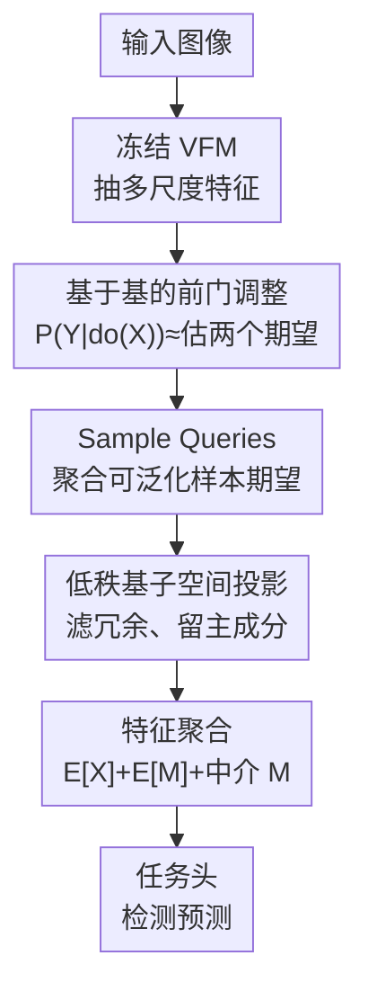

# Bridge: Basis-Driven Causal Inference Marries VFMs for Domain Generalization

**会议**: CVPR 2026  
**arXiv**: [2604.26820](https://arxiv.org/abs/2604.26820)  
**代码**: https://mingbohong.github.io/Bridge/ (项目主页)  
**领域**: 目标检测 / 域泛化 / 因果推断  
**关键词**: 域泛化目标检测、前门调整、因果推断、基学习、视觉基础模型

## 一句话总结
针对单源域、数据稀缺下检测器容易学到"光照/共现/风格"等混杂因子导致虚假相关的问题，本文提出即插即用的 Causal Basis Block（CBB），用**可学习低秩基**把因果前门调整落地成"估计两个期望"，挂在冻结的 VFM（DINOv2/3、SAM、Stable Diffusion）上做端到端校准，在五个域泛化检测基准上一致刷新 SOTA（最高 +5.4 mAP）。

## 研究背景与动机
**领域现状**：域泛化目标检测（DGOD）希望在一个或少数源域上训练，泛化到未见过的目标域。主流做法分三类——学习域不变表征、用数据增广扩展源分布、借助视觉基础模型（VFM）的强先验。近期尤其流行把冻结的 DINOv2/SAM/Stable Diffusion 当 backbone，直接接检测头。

**现有痛点**：这些方法大多**忽略了单源、小数据训练带来的混杂效应**。混杂因子 $\mathcal{Z}$（光照、物体共现模式、风格差异）会同时影响输入特征 $\mathcal{X}$ 和标签 $\mathcal{Y}$，制造虚假相关。论文给的例子很直观：一个用冻结 DINOv2（在 142M 图上预训练）但只在 3,000 张 Cityscapes 上微调的检测器，会把行人旁边的自行车以 57% 误判为 rider、20% 误判为 person——它学到的是"自行车常和人共现"这条捷径，而非自行车本身的因果特征。强 backbone 的表征能力被这种捷径白白浪费。

**核心矛盾**：要消除混杂，经典做法是**后门调整**，但后门调整需要显式建模并枚举混杂因子 $\mathcal{Z}$（$\mathcal{P}(\mathcal{Y}\mid\mathrm{do}(\mathcal{X}))=\sum_{\mathcal{Z}}\mathcal{P}(\mathcal{Y}\mid\mathcal{X},\mathcal{Z})\mathcal{P}(\mathcal{Z})$）。可现实中很多混杂因子不可观测、难度量，后门调整不可行。已有因果检测工作（如基于后门的恶劣天气检测）只能靠外部混杂字典 + 聚类/动量更新等繁琐后处理，灵活性和可扩展性都差。

**本文目标**：在**不显式指定混杂因子、不引外部字典**的前提下阻断虚假相关，并且做成能无缝挂到任意冻结 VFM 上的即插即用模块。

**切入角度**：用**前门调整**绕开"枚举混杂因子"——只要找到一个落在 $\mathcal{X}\to\mathcal{Y}$ 因果路径上的中介变量 $\mathcal{M}$，就能识别 $\mathcal{X}$ 对 $\mathcal{Y}$ 的因果效应。再借鉴字典学习，把前门调整里两个难算的期望用**可学习低秩基**近似出来。

**核心 idea**：把前门调整重写成"估计两个期望 $\mathbb{E}[\mathcal{X}']$ 和 $\mathbb{E}[\mathcal{M}]$"，并用一组低秩可学习基 + Sample Queries 端到端地把这两个期望算出来，从而在阻断混杂的同时顺手滤掉冗余、任务无关的特征。

## 方法详解

### 整体框架
Bridge 是一个挂在冻结 VFM 上的 DGOD 框架。输入一张图，先由 VFM 抽出多尺度特征图；这些特征送进核心模块 **Causal Basis Block（CBB）** 做因果校准；校准后的特征再交给任务头（Faster R-CNN 检测头）做预测。整个 VFM backbone 冻结，只训练 CBB 和检测头，避免全网络微调的高成本。

CBB 内部干两件事：① **期望估计**——用 Sample Queries 聚合训练集的全局/可泛化信息得到空间加权图，再把加权后的特征投影到一组**低秩可学习基**张成的子空间，得到期望 $\mathbb{E}[\mathcal{X}]$、$\mathbb{E}[\mathcal{M}]$；② **特征聚合**——把两个期望和中介特征 $\mathcal{M}$ 相加成最终输出 $\mathcal{F}_{\text{out}}=\hat{\mathbb{E}}[\mathcal{X}]+\hat{\mathbb{E}}[\mathcal{M}]+\mathcal{M}$，前两项实现前门调整阻断混杂，$\mathcal{M}$ 保留任务特定信息。CBB 全程可微，无需额外监督，跟着下游检测 loss 一起训。

### 关键设计

**1. 基于基学习的前门调整：把"消混杂"转成"估两个期望"**

后门调整要枚举不可观测的混杂因子 $\mathcal{Z}$，行不通。本文改用前门调整：找中介变量 $\mathcal{M}$，则 $\mathcal{P}(\mathcal{Y}\mid\mathrm{do}(\mathcal{X}))=\mathbb{E}_{\mathcal{M}\sim\mathcal{P}(\mathcal{M}\mid\mathcal{X})}\big[\mathbb{E}_{\mathcal{X}'\sim\mathcal{P}(\mathcal{X})}[\mathcal{P}(\mathcal{Y}\mid\mathcal{X}',\mathcal{M})]\big]$。直接算这个嵌套期望太贵，于是用 NWGM（归一化加权几何平均）近似，把期望挪进概率里，并沿用前人把前门调整从最终预测层推广到中间特征层、表述成线性映射的做法，最终化简为 $\mathcal{P}(\mathcal{Y}\mid do(\mathcal{X}))\approx\mathcal{P}\big(\mathcal{Y}\mid\mathbb{E}_{\mathcal{X}'}[\mathcal{X}']+\mathbb{E}_{\mathcal{M}\mid\mathcal{X}}[\mathcal{M}]\big)$。

这一步的价值在于：实现前门调整**被归约成只需估计两个期望** $\mathbb{E}_{\mathcal{M}\mid\mathcal{X}}[\mathcal{M}]$ 和 $\mathbb{E}_{\mathcal{X}'}[\mathcal{X}']$。而期望在复杂表征空间没有闭式解，作者借鉴字典学习，把期望写成可学习基向量的线性组合 $\mathbb{E}[\mathcal{V}]\approx\frac{1}{S}\sum_{i=1}^{S}\sum_{k=1}^{K}c_{ik}b_k$（$b_k$ 是基、$c_{ik}$ 是系数）。和靠外部混杂字典 + 聚类/动量后处理的旧因果方法相比，这条路**不需要任何外部混杂定义**，且基天然诱导低秩结构、表征更紧凑，因而即插即用、可扩展

**2. Sample Queries：跨样本聚合可泛化信息，估出 $\mathbb{E}[\mathcal{X}]$**

期望 $\mathbb{E}_{\mathcal{X}'\sim\mathcal{P}(\mathcal{X})}[\mathcal{X}']$ 是对输入边缘分布求期望，单张图算不出来。CBB 引入一组可学习的 **Sample Queries** $\mathcal{Q}_s\in\mathbb{R}^{S\times C}$，作用类似 DETR/Mask2Former 里的 object queries——训练过程中它们**隐式地把整个训练集的全局表征聚合进自己**，从而指导期望估计。给定输入特征 $\mathcal{X}_{in}\in\mathbb{R}^{B\times N\times C}$，先算 query 响应 $\mathcal{X}'_q=\mathcal{X}_{in}\mathcal{Q}_s^{\top}$，沿样本维 $S$ 做 Softmax 得 $p$，再加权求和得到空间加权图 $\mathcal{A}=\sum_{i=1}^{S}p_i\mathcal{X}'_{q,i}\in\mathbb{R}^{B\times N\times 1}$；用 $\mathcal{A}$ 重加权输入得到 query 引导特征 $\mathcal{X}_q=\mathcal{A}\odot\mathcal{X}_{in}$。

直白说，$\mathcal{A}$ 像一张"哪些空间位置承载可泛化信息"的注意力图，把 $\mathcal{X}_{in}$ 中被各源域共享、不依赖某个混杂因子的部分突出出来。这一步先做"挑可泛化信息"，为后面投影到低秩子空间做准备，是估期望 $\mathbb{E}[\mathcal{X}]$ 的第一道工序

**3. 低秩基子空间投影：滤冗余、保主成分，给出期望闭式近似**

只挑可泛化位置还不够，特征里仍有冗余和任务无关成分。CBB 引入一组可学习基 $\mathcal{B}=[b_1,\dots,b_K]\in\mathbb{R}^{K\times C}$ 且 $K<C$，构成一个**低秩子空间**。把 query 引导特征 $\mathcal{X}_q$ 投到这个子空间，系数为 $\mathcal{C}=\mathcal{X}_q\mathcal{B}^{\top}(\mathcal{B}\mathcal{B}^{\top})^{-1}\in\mathbb{R}^{B\times N\times K}$（其中 $(\mathcal{B}\mathcal{B}^{\top})^{-1}$ 是归一化项，因为训练中基不一定保持正交），再重建回原空间得期望估计 $\mathbb{E}[\mathcal{X}_{in}]\approx\mathcal{C}\mathcal{B}\in\mathbb{R}^{B\times N\times C}$。

整条路径是 $\mathbb{R}^{N\times C}\to\mathbb{R}^{N\times K}\to\mathbb{R}^{N\times C}$：先压到 $K$ 维丢掉冗余，再升回 $C$ 维。因为 $K<C$，重建只能用最有代表性的少数主成分，相当于把特征对齐到样本分布的核心方向，从而近似样本期望、拒绝噪声。$K$ 越小滤得越狠、保留的越是通用表征——实验里强 backbone（DINOv3）用 12.5% 的维度就最好，弱一点的（SAM/SD）要 50%–70%。还有个部署红利：推理时 $\mathcal{B}^{\top}(\mathcal{B}\mathcal{B}^{\top})^{-1}\mathcal{B}$ 可**预计算成固定的 $C\times C$ 矩阵**，省算力、好落地

**4. 特征聚合：中介特征兜底任务信息**

前两个期望都是"去混杂、求通用"的方向，光靠它们会丢掉对当前检测任务有用的细节。CBB 先用一个简单卷积块从输入造出中介特征 $\mathcal{M}=\mathrm{Conv}(\mathcal{X}_{in})$，再用上面的方法估出 $\hat{\mathbb{E}}[\mathcal{X}]$ 和 $\hat{\mathbb{E}}[\mathcal{M}]$，最终输出为 $\mathcal{F}_{\text{out}}=\hat{\mathbb{E}}[\mathcal{X}]+\hat{\mathbb{E}}[\mathcal{M}]+\mathcal{M}$。

这个加和有清晰分工：前两项 $\hat{\mathbb{E}}[\mathcal{X}]+\hat{\mathbb{E}}[\mathcal{M}]$ 对应前门调整公式里的两个期望，负责阻断虚假相关；最后单独加回 $\mathcal{M}$，是为了把被低秩压缩可能滤掉的**任务特定信息**保留下来，避免因果校准过度后检测细节缺失。CBB 整体跟下游 loss 端到端训练，不需要额外监督信号

## 实验关键数据

### 主实验
五个 DGOD 基准、AP50 为指标。Bridge 既能挂判别式 VFM（DINOv2-L / DINOv3-L / SAM-Huge），也能挂生成式 VFM（Stable Diffusion v2.1，配 CrossKD 蒸馏到 R101 学生）。下表摘最具代表性的几组对比（mAP / %）。

| 基准（训练→测试） | 配置 | baseline | Bridge | 提升 |
|------|------|------|------|------|
| Cross-Camera（Cityscapes→BDD100K） | Diff. Detector(SD) vs Boost | 49.3 | **53.1** | +3.8 |
| Cross-Camera | DINOv2 backbone | 51.8 | **56.9** | +5.1 |
| Adverse Weather（City→FoggyCity） | DINOv2 backbone | 52.8 | **58.2** | +5.4 |
| Adverse Weather | DINOv3 backbone | 57.7 | **61.6** | +3.9 |
| Real-to-Artistic（VOC→3 风格，avg） | DINOv2 backbone | 65.4 | **69.4** | +4.0 |
| Diverse Weather Datasets（avg） | DINOv2 backbone | 40.8 | **44.8** | +4.0 |
| DroneVehicle Extreme-Dark | DINOv3 backbone | 33.7 | **34.0** | +0.3 |

相对各基准前一名（runner-up），Bridge 分别 +3.8 / +2.9 / +2.4 / +0.4 / +1.5 mAP。最戏剧性的是 Diverse Weather DroneVehicle 的 Extreme-Dark 场景：纯 Faster R-CNN 只有 **8.1** mAP，挂上 Bridge 的 Diff. Detector / DINOv2 / DINOv3 分别冲到 **24.2 / 29.8 / 34.0**——极低光、低信噪比下，低秩基能聚焦因果表征、保住关键特征。

### 消融实验
组件消融（Table 6，City→FoggyCity，mAP）：

| 配置 | DINOv3 | SAM | SD | 说明 |
|------|------|------|------|------|
| baseline | 57.7 | 45.8 | 51.8 | 冻结 VFM 直接接头 |
| + 低秩基 LRB | 60.9 | 49.2 | 53.1 | DINOv3/SAM/SD 各 +3.2/+3.4/+1.3 |
| + LRB + Sample Queries | **61.6** | **49.9** | **53.6** | 再 +0.7/+0.7/+0.5 |

因果建模方式对比（Table 7，DINOv3，五基准 mAP）：把 GOAT 的前门调整用 cross-attention 重实现成 FACL 插在多尺度层之间，几乎没涨甚至掉点（BDD 57.8→58.5、DWD 48.6→48.2、R2A 72.7→71.6）；换成 CBB 则全面提升（58.9 / 61.6 / 50.8 / 48.4 / 73.3）。

### 关键发现
- **低秩基是主力**：组件消融里 LRB 单独就带来绝大部分增益（DINOv3 +3.2、SAM +3.4），Sample Queries 再补 +0.5~0.7，二者互补。
- **基比例随 backbone 强弱反向变化**：强 backbone DINOv3 在 12.5% 比例下最好（61.6），说明强表征只需极紧凑的基空间；SAM/SD 表征能力弱，需 50%–70% 比例保住特征多样性。
- **越难的场景增益越大**：在共现严重的 rider/bike/person/motor 类、以及极暗/雨夜场景提升最明显，印证 CBB 确实在阻断"共现/光照"这类混杂。
- **跨检测器通用**（Table 9）：除 Faster R-CNN 外，挂到 Sparse R-CNN、TOOD 上同样一致提升（如 TOOD 在 DWD 47.3→50.1、Drone 46.8→50.3）。

## 亮点与洞察
- **把抽象因果公式落成两个可算的期望，再用低秩基一锅端**：前门调整最难的是估期望，本文用"Sample Queries 挑可泛化信息 + 低秩基投影滤冗余"两步逼近，既消混杂又顺手做了特征净化，一举两得，很优雅。
- **真正即插即用、backbone 无关**：判别式（DINOv2/3、SAM）和生成式（Stable Diffusion）VFM 通吃，且 VFM 全程冻结、只训 CBB+检测头，部署成本低；推理时投影矩阵还能预计算成固定 $C\times C$ 矩阵。
- **"低秩比例 ∝ backbone 弱"这个观察很有迁移价值**：它把"需要多大子空间"和"backbone 表征质量"挂钩，给其他用低秩/瓶颈结构净化特征的任务一个直接可借的调参直觉——backbone 越强，瓶颈可以压得越狠。
- **顺手补了一个 benchmark**：给 DroneVehicle 标注天气条件（Clear/Dark/Foggy/Extreme-Dark），填补了 UAV 遥感场景下域泛化检测缺多样天气评测的空白。

## 局限与展望
- **作者承认**：CBB 只是用低秩基 + Sample Queries**近似**前门调整里的期望，没有解析闭式解——表征空间太复杂导致闭式解不可得，近似质量本身没有理论界。
- **中介变量 $\mathcal{M}$ 的"因果合法性"靠假设**：$\mathcal{M}=\mathrm{Conv}(\mathcal{X}_{in})$ 是否真落在 $\mathcal{X}\to\mathcal{Y}$ 因果路径上、是否满足前门准则，文中并未验证，更多是工程上的可学中介，⚠️ 这点需读者留意。
- **部分基准提升边际**：Real-to-Artistic 的 SD backbone 仅 +0.4、DroneVehicle Extreme-Dark 的 DINOv3 仅 +0.3，强 baseline 下增益变小，说明方法在表征已很强时收益递减。
- **可改进方向**：把中介变量的选择/正则做得更有因果保证（如加独立性约束），或把基学习从线性子空间推广到非线性流形，可能进一步提升弱光、强风格迁移等极端场景。

## 相关工作与启发
- **vs 基于后门调整的因果检测（如 Zhang et al. 恶劣天气检测）**：他们显式建模混杂因子、需外部混杂字典；本文用前门调整 + 基学习，**完全不显式指定混杂**，灵活性和可扩展性更好。
- **vs GOAT 的前门调整（FACL 变体）**：GOAT 把前门调整做成 cross-attention 线性映射；本文消融显示直接搬过来（FACL）几乎不涨甚至掉点，而 CBB 的低秩基投影显著更优，说明"怎么估期望"比"用不用前门调整"更关键。
- **vs 直接用冻结 VFM 做 DGOD（GDD、Boost）**：他们靠 VFM 强先验但忽略下游虚假相关；Bridge 在同样冻结 VFM 上加一层因果校准，把被混杂浪费的表征能力捞回来，对 Boost 等 runner-up 普遍 +2~5 mAP。
- **启发**：把"用低秩瓶颈净化特征"与"因果期望估计"绑定的思路，可迁移到分割、VQA 等同样受共现/风格混杂困扰的任务；Sample Queries 这种"用可学 query 隐式聚合训练集统计量"的机制，也可用于需要估计数据集级期望/原型的场景。

## 评分
- 新颖性: ⭐⭐⭐⭐ 把前门调整重写成"估两个期望"并用低秩基落地，因果理论与即插即用工程结合得巧，但前门调整+基学习的各组件均有前身。
- 实验充分度: ⭐⭐⭐⭐⭐ 五个基准 + 四种 VFM + 三种检测器 + 组件/基比例/跨检测器多维消融，还自建 DroneVehicle 天气 benchmark。
- 写作质量: ⭐⭐⭐⭐ 因果推导到模块实现的链路清晰、图文对应好；中介变量因果合法性等假设可再交代清楚。
- 价值: ⭐⭐⭐⭐ 即插即用、backbone 无关、部署友好，对 VFM-based DGOD 是实用的一层因果校准，且补了遥感天气评测空白。

<!-- RELATED:START -->

## 相关论文

- [\[CVPR 2026\] Black-Box Domain Adaptation for Object Detection with Retention-Driven Knowledge Compression](black-box_domain_adaptation_for_object_detection_with_retention-driven_knowledge.md)
- [\[CVPR 2025\] Large Self-Supervised Models Bridge the Gap in Domain Adaptive Object Detection](../../CVPR2025/object_detection/large_self-supervised_models_bridge_the_gap_in_domain_adaptive_object_detection.md)
- [\[CVPR 2026\] CHAL: Causal-guided Hierarchical Anomaly-aware Learning for Moving Infrared Small Target Detection](chal_causal-guided_hierarchical_anomaly-aware_learning_for_moving_infrared_small.md)
- [\[CVPR 2026\] Expert-Teacher-Student Collaborative Learning for Domain Adaptive Object Detection](expert-teacher-student_collaborative_learning_for_domain_adaptive_object_detecti.md)
- [\[CVPR 2026\] Remedying Target-Domain Astigmatism for Cross-Domain Few-Shot Object Detection](remedying_target-domain_astigmatism_for_cross-domain_few-shot_object_detection.md)

<!-- RELATED:END -->
