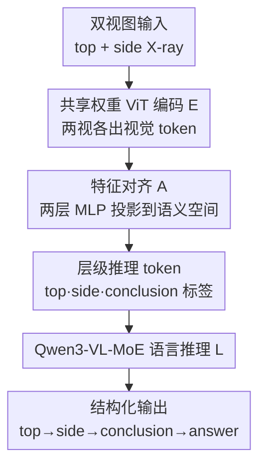

# Can a Second-View Image Be a Language? Geometric and Semantic Cross-Modal Reasoning for X-ray Prohibited Item Detection

**会议**: CVPR 2026  
**论文**: [CVF Open Access](https://openaccess.thecvf.com/content/CVPR2026/html/Peng_Can_a_Second-View_Image_Be_a_Language_Geometric_and_Semantic_CVPR_2026_paper.html)  
**代码**: https://github.com/pengc-bjtu/GSR  
**领域**: 多模态VLM / 跨模态推理 / X光安检  
**关键词**: 双视图X光、跨视图推理、类语言模态、思维链监督、违禁品检测  

## 一句话总结
这篇论文提出"把第二张视图（侧视图）当成一种语言模态来用"的范式，配套构建了首个双视图+多模态的安检基准 DualXrayBench 和带 `<top>/<side>/<conclusion>` 思维链监督的 GSXray 数据集，训练出的 GSR 模型在八个跨视图推理任务上整体准确率从 53.5 提到 65.4、mIoU 几乎翻倍。

## 研究背景与动机
**领域现状**：X光安检违禁品检测以前主要是纯视觉做法——靠探测器提取边缘/轮廓等低层特征做闭集检测。近两年受 VLM 启发，开始往里塞语言模态，用图像-caption 对、文本描述给单视图做语义约束（如 OVXD、STCray、PIXray-Caption），缓解了闭集、提升了开放词表能力。

**现有痛点**：但这些"图像+语言"的工作全是**单视图**的。而真实安检场景里，人工安检员从来都是**同时看顶视和侧视两张图**，靠两个视角在脑子里重建 3D 结构、解决遮挡和姿态歧义（比如平板和笔记本在单视图下几乎一样，换个视角就分开了）。已有的双视图数据集（DvXray、LDXray 等）虽然有配对扫描，却是**纯视觉**的，只做特征融合、把第二视图当"额外像素"，既没有语言对齐、也没显式建模跨视角的可见性和几何一致性。

**核心矛盾**：语义约束（语言）和几何互补（第二视图）这两条线一直是分开走的——没有任何一份资源能同时把视觉、几何、语言三种模态对齐起来，于是 VLM 既用不上双视图的几何一致性，也没法在安检场景泛化。

**本文目标**：(1) 造一份同时覆盖语义/几何/视觉对应的数据资源；(2) 让模型真正学会用第二视图做跨视角推理，而不是把它当噪声。

**切入角度**：作者从一句很有意思的洞察出发——"图像也是一种语言"。既然第二视图对人类安检员而言提供的是和语言类似的**额外约束**（告诉你"这个东西在侧视里是竖着的/扁的"），那能不能干脆**把侧视图当成一种"类语言模态"**，让它的几何对应关系和语言语义一起被联合学习？

**核心 idea**：用"第二视图即语言"替代"第二视图即额外像素"，把跨视图几何对应和跨模态语义在一个统一的思维链结构里联合监督，从而把被浪费的辅助视图变成一种结构化约束。

## 方法详解

### 整体框架
整套工作分**离线数据引擎**和**在线 GSR 模型**两块。数据侧：先在双视图 LDXray（146,997 对顶/侧视图）之上，用五阶段半自动管线产出 45,613 对带层级 caption 的语料（DualXrayBench corpus），再把 caption 转写成 `<top>、<side>、<conclusion>` 结构的思维链，得到 44,019 条 QA 的 GSXray 训练集；同时另切一套 1,594 条专家校验的 VQA 作为评测基准（八个诊断子任务）。模型侧：GSR 以 Qwen3-VL-MoE-8B 为底座，把顶/侧两张图各自编码、对齐进语言空间，再用层级推理 token 把"哪个视角的证据"和"何时该汇总"显式标出来，最后由 MoE 语言模型生成 `<top>…<side>…<conclusion><answer>` 的结构化推理。

下图是 GSR 的推理主干（数据引擎为离线步骤，不在图内）：

### 关键设计

**1. 第二视图即"类语言模态"：把跨视图几何对应和跨模态语义联合学习**

这是全文的范式级创新，针对的痛点是"已有方法要么只用语言约束单视图、要么只把双视图当额外像素融合，两条线从不交汇"。作者的做法是：不再把侧视图当作要和顶视图做特征融合的第二张图，而是把它当作一种**给顶视图提供约束的"语言"**——侧视图能告诉你"这个在顶视里是大矩形的东西，在侧视里是扁平躺着的"，这种描述性约束的功能和文本 caption 是同构的。于是模型要同时学两类对应：跨视图的**几何对应**（同一物体在两视里的位置/姿态/遮挡关系）和跨模态的**语义对应**（视觉证据 ↔ 语言结论）。这样有效，是因为它把人类安检员的工作机制直接搬了进来——人就是靠两个视角互补来消解单视图下无法判断的遮挡和 3D 姿态。消融里也印证了：纯把双视图喂进去（没有文本引导）几乎没收益、甚至会拉低 mIoU（Table 5 中 `top+side` 无文本只有 57.3、mIoU 24.6），只有把第二视图当成被结构化语言组织起来的约束才真正起作用。

**2. 层级推理 token `<top>/<side>/<conclusion>`：把"证据来自哪个视角"和"何时该汇总"显式编码**

针对的痛点是：以前的多模态架构把所有视觉 embedding 当成**无类型的 token** 一股脑塞给 LLM，模型分不清哪段证据来自顶视、哪段来自侧视，更不知道什么时候该把两边的几何线索汇成一个结论。GSR 引入三类特殊 token：`<top>` 和 `<side>` 分别标注来自两个正交视角的视觉证据，强迫模型在推理时保持空间感知、把遮挡结构区分开；`<conclusion>` 则是一个聚合信号，提示 LLM 把几何与语义线索整合成统一输出。语言模型的生成可以写成

$$y = L\big(\,[\,\langle\text{top}\rangle\, f'_{\text{top}},\ \langle\text{side}\rangle\, f'_{\text{side}},\ \langle\text{conclusion}\rangle\, t\,]\,\big)$$

其中 $t$ 是文本 query，$f'_{\text{top}}/f'_{\text{side}}$ 是两视的投影特征。这套 token 让模型能**按 query 动态切换推理粒度**——从细粒度的违禁品定位到场景级的组合推理。消融最有说服力的一点是：单加 `<top>`（带 `<box>` grounding）就把 mIoU 从 25.4 直接拉到 41.1（Table 5），说明显式的视角标注+定位监督对空间对齐贡献巨大。

**3. GSXray 思维链监督 + 五阶段语义自动化构建管线：给"几何→语义"的推理流提供细粒度监督**

针对的痛点是 X光域里根本没有同时含语义/几何/视觉对应的训练资源。作者用一条半自动五阶段管线造数据：①**预处理**——过滤低多样性样本、把 bbox 归一化到 [0,1000] 的分辨率无关坐标；②**结构化 prompt**——把每对图和元数据塞进层级 prompt，要求模型在严格 JSON 约束下分别描述顶/侧视场景、做对象级分析、再做全局语义总结（用约束压住幻觉）；③**LLM 生成**——用 Qwen3-VL-235B-A22B-Thinking 生成含全局布局、逐物体推理、整体总结的层级 caption，显式编码"顶视扁平、侧视竖直"这类互补线索；④**自动筛查**——三道关卡（事实覆盖率 <80%、实体-bbox 对齐 <50%、跨视一致性矛盾 >50% 的样本丢弃，一致性由 GPT-4o 判）；⑤**人工核验**——专家多轮复审修正歧义样本。最后用 GPT-4o 把 caption 转写成 `<top>、<side>、<conclusion>` 的思维链——这一步是关键：它不像普通 SFT 的 CoT 那样平铺，而是**把推理显式拆成"视角专属观察 → 融合成统一语义结论"**，正好对应人类整合双视消解遮挡的过程，给"几何感知到高层语义的跃迁"提供了细粒度监督信号。

**4. GSR 架构与端到端 SFT：编码 E → 对齐 A → 推理 L 三件套**

GSR 建在 Qwen3-VL-MoE-8B 上，三个组件协同。视觉编码器 $E$ 用 ViT-L/14、带 3D 卷积 patch embedding 和旋转位置编码，**共享权重**地分别处理顶视 $x_{\text{top}}$ 和侧视 $x_{\text{side}}$，输出 $f_i = E(x_i) \in \mathbb{R}^{m\times n}$ 的稠密视觉 token，保留几何结构和空间上下文；轻量对齐模块 $A$ 是带 GeLU 的两层 MLP，把视觉 embedding 投影进 LLM 的语义空间 $f'_i = A(f_i)$，搭起几何表示空间和语言空间的桥；语言推理模块 $L$ 由 Qwen3-VL-MoE 文本解码器实例化，靠多头注意力 + MoE 路由联合处理投影视觉 token 和文本 query。训练上视觉编码器和对齐模块**全部解冻**做端到端优化，用 LLaMA-Factory 在 8×H200 上 bf16 训练，AdamW、基础 lr 1e-6、cosine 衰减、warmup 0.1、全局 batch 256、训 2 个 epoch。

### 损失函数 / 训练策略
训练目标就是标准的监督微调（SFT）——在 GSXray 的 44,019 条 `<think><top>…<box>…</box><label></label></top><side>…</side><conclusion>…` 思维链 QA 上做自回归监督，让模型学会按视角组织证据并汇总结论。没有额外的对比/几何正则项，跨视几何对应完全靠 CoT 结构和层级 token 隐式监督出来。

## 实验关键数据

### 主实验
评测在 DualXrayBench 的八个子任务（CT 计数 / OR 识别 / SR 空间关系 / SD 空间距离 / OA 遮挡区域 / CO 接触遮挡 / PA 摆放属性 / SA 空间属性）上用 Acc / F1 / mIoU 三个指标，Overall 为八列均值。

| 模型 | Overall Acc | F1 | mIoU | 备注 |
|------|------|------|------|------|
| GPT-4o | 47.0 | 49.2 | 16.5 | 闭源通用 VLM |
| Gemini-2.5-Pro | 58.6 | 60.5 | 28.7 | 最强闭源基线 |
| Qwen3-VL-235B | 58.8 | 65.5 | 26.0 | 最强开源基线 |
| Qwen3-VL-8B（底座） | 53.5 | 56.6 | 25.4 | GSR 的起点 |
| STING-BEE（单视图X光VLM） | 23.8 | 29.8 | 13.2 | 专用却最差 |
| **GSR-8B（本文）** | **65.4** ↑11.9 | **70.6** ↑14 | **52.3** ↑26.9 | 仅 8B，全面 SOTA |

最反直觉的一点：专门为 X光做的单视图 VLM STING-BEE 只有 23.8，**比通用 VLM 还差**，因为它根本无力处理双视图推理；而 GSR-8B 以 8B 体量反超 235B 和 Gemini-2.5-Pro 6 分以上，mIoU 几乎翻倍。作者还把 GSXray 拿去微调 Qwen2.5-VL-7B / InternVL3.5-8B / LLaVA-OneVision-7B 等多个开源模型，全部一致涨点（如 LLaVA-OneVision-7B 从 32.3→39.3），说明数据集的域知识可迁移。

### 消融实验
Table 5 在 Qwen3-VL-8B 上逐项叠加双视图与结构化推理组件（四列开关：顶视图 / `<top>` 文本 / 侧视图 / `<side>` 文本）：

| 配置 | Acc | F1 | mIoU | 说明 |
|------|------|------|------|------|
| 基线（全关） | 53.5 | 56.6 | 25.4 | 纯单视图感知 |
| 顶视 + `<top>` grounding | 59.2 | 63.7 | **41.1** | mIoU 暴涨，视角标注+定位最关键 |
| 顶视 + 侧视（无文本） | 57.3 | 60.5 | 24.6 | 裸双视图收益有限、mIoU 反降 |
| 顶视 + `<top>` + 侧视 | 62.1 | 65.8 | 45.2 | 加结构化侧视证据 |
| 全开（`<top><side><conclusion><answer>`） | **65.4** | **70.6** | **52.3** | 即 GSR-8B |

Table 6 进一步测"第二视图在微调前后的作用翻转"：

| 模型 | 第二视图 | Acc | 变化 |
|------|---------|------|------|
| Qwen2.5-VL-7B（未训） | 加入 | 50.3 / mIoU 20.3 | mIoU ↓2.3%，加视图反而伤 |
| GSR-8B（GSXray 训后） | 去掉 | 62.1 | — |
| GSR-8B（GSXray 训后） | 加入 | **65.4** | ↑3.3，去掉就掉点 |

### 关键发现
- **`<top>` + grounding 是 mIoU 的主引擎**：单加这一项就把 mIoU 从 25.4 拉到 41.1，说明"标清证据来自哪个视角 + 框定位"对空间对齐的贡献远大于单纯多喂一张图。
- **裸双视图会变噪声**：未经对齐训练时，第二视图常常拉低 mIoU（Table 5/6 都有体现）；只有经过 GSXray 微调，模型才学会把侧视特征当"互补证据"而非噪声——这正面回答了标题问题"第二视图能否当语言"：能，但前提是有结构化监督教它怎么读。
- **泛化稳健**：在 STING-BEE VQA 七类基准上 GSR-8B 55.3 > STING-BEE 52.8（IL/IC/CR 涨幅最大）；按 OVXD 协议在 PID 上做跨类别/跨域开放词表检测，AP50 26.3 > OVXD 21.0，说明几何-语义对齐能迁移到没见过的类别和扫描仪。

## 亮点与洞察
- **"第二视图即语言"是个漂亮的类比迁移**：把多视图几何问题重新表述成跨模态对齐问题，从而能直接复用 VLM 的语言推理能力，而不用专门设计几何融合模块——这个 reframe 本身就是最大的"啊哈"。
- **层级 token 把无类型视觉 token 变成有结构的证据流**：`<top>/<side>/<conclusion>` 这套轻量标签可迁移到任何"多源证据需要分别观察再汇总"的任务（多相机、多模态传感、多文档推理）。
- **CoT 把"几何→语义"的跃迁显式化**：不是让模型黑箱地融合，而是强制它先分视角观察、再汇总，这种"分而后合"的监督结构对可解释性也友好。

## 局限与展望
- **强依赖 LLM 合成数据**：corpus 和 GSXray 都靠 Qwen3-VL-235B / GPT-4o 生成 + 自动筛查，虽然有三道关卡和人工核验，描述质量和潜在幻觉仍受底层大模型上限制约。
- **只验证了顶/侧两视图**：范式天然可推广到更多视角，但论文没测三视及以上，"第二视图即语言"在 N 视图下是否还成立、token 怎么扩展，留白。
- **数据集类别不均**：12 类里 Mobile Phone 实例 59,003 个、Columnar Green Liquid 仅 296 个（Table 2），长尾类别上的真实表现需更细评估。
- **收益高度依赖配套监督**：消融已表明裸双视图甚至有害，意味着这套方法离不开昂贵的 CoT 标注管线，迁移到新场景时数据构建成本不低。

## 相关工作与启发
- **vs 纯视觉双视图融合（DvXray、LDXray 等）**：它们把第二视图当额外像素做特征融合，不显式建模跨视角可见性/几何一致性；本文把它当"语言约束"并用 CoT 显式监督，把"加视图反而是噪声"扭转成"加视图稳定涨点"。
- **vs 单视图语言-视觉 X光方法（OVXD、STCray、PIXray-Caption）**：它们只在单视图上做语言对齐，缺几何互补；本文同时拿下几何（双视）与语义（语言）两条线，并在 OVXD 协议下的开放词表检测上反超（AP50 26.3 vs 21.0）。
- **vs 通用大 VLM（GPT-4o / Gemini-2.5-Pro / Qwen3-VL-235B）**：它们零样本在双视图安检上整体卡在 50 上下，本文用 8B 经域内 CoT 微调反超 6 分以上，说明在这种强几何+强领域任务上，结构化数据与显式推理 token 比单纯堆参数更有效。

## 评分
- 新颖性: ⭐⭐⭐⭐⭐ "第二视图即语言"的 reframe 简洁有力，把多视图几何问题转成跨模态对齐，配套数据集与 token 设计自洽。
- 实验充分度: ⭐⭐⭐⭐ 主实验覆盖 20+ VLM、消融拆解清晰、含两个跨域泛化基准；略欠：多于两视图与长尾类别未深入。
- 写作质量: ⭐⭐⭐⭐ 动机推导和八任务定义讲得清楚，图表完整；部分小节（数据集统计）略显堆砌。
- 价值: ⭐⭐⭐⭐⭐ 首个双视图+多模态安检基准与数据引擎，对真实安检落地和"多源证据推理"范式都有可复用价值。

<!-- RELATED:START -->

## 相关论文

- [\[CVPR 2026\] CrossVL: Complexity-Aware Feature Routing and Paired Curriculum for Cross-View Vision-Language Detection](crossvl_complexity-aware_feature_routing_and_paired_curriculum_for_cross-view_vi.md)
- [\[CVPR 2026\] Thermal-Det: Language-Guided Cross-Modal Distillation for Open-Vocabulary Thermal Object Detection](thermal-det_language-guided_cross-modal_distillation_for_open-vocabulary_thermal.md)
- [\[CVPR 2026\] Beyond Semantic Search: Towards Referential Anchoring in Composed Image Retrieval](beyond_semantic_search_towards_referential_anchoring_in_composed_image_retrieval.md)
- [\[CVPR 2026\] Reasoning-Driven Anomaly Detection and Localization with Image-Level Supervision](reasoning-driven_anomaly_detection_and_localization_with_image-level_supervision.md)
- [\[CVPR 2026\] DyFCLT: Dynamic Frequency-Decoupled Cross-Modal Learning Transformer for Multimodal Tiny Object Detection](dyfclt_dynamic_frequency-decoupled_cross-modal_learning_transformer_for_multimod.md)

<!-- RELATED:END -->
