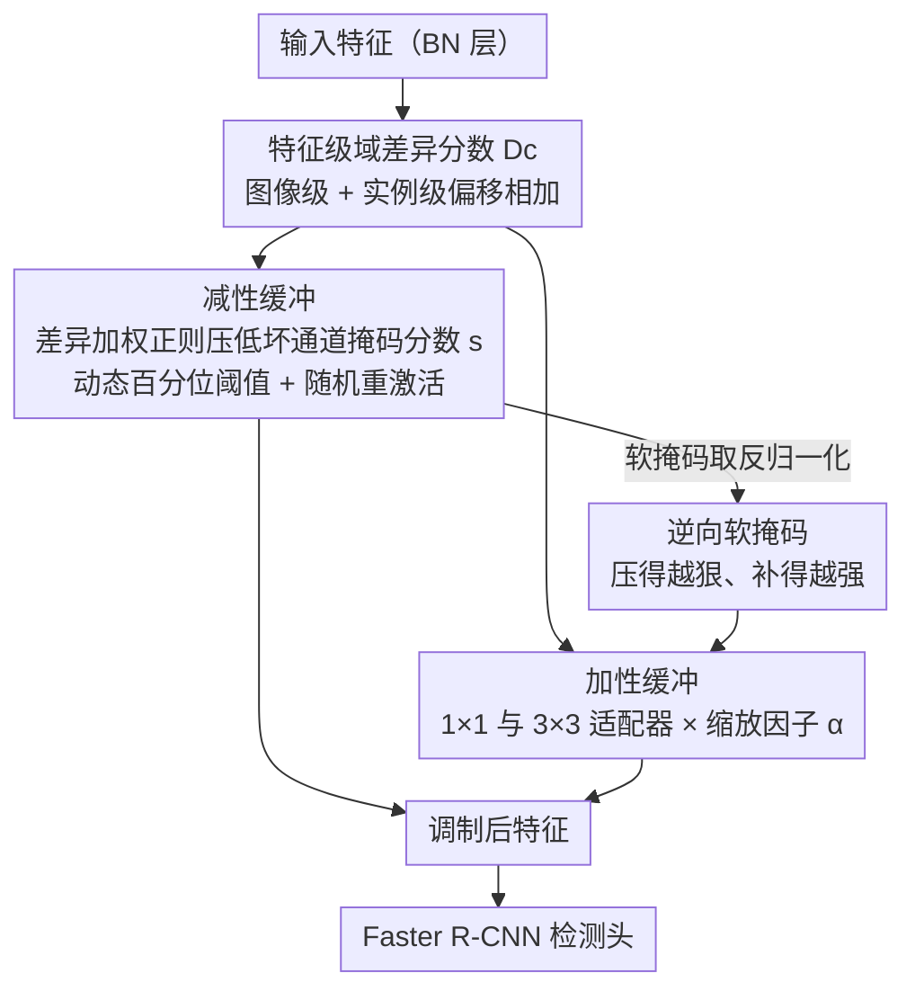

# CD-Buffer: Complementary Dual-Buffer Framework for Test-Time Adaptation in Adverse Weather Object Detection

**会议**: CVPR 2026  
**arXiv**: [2603.26092](https://arxiv.org/abs/2603.26092)  
**代码**: [网站](https://wkfsksdl99.github.io/cd_buffer/)  
**领域**: Object Detection  
**关键词**: 测试时适应, 恶劣天气, 目标检测, 通道自适应, 加性-减性互补

## 一句话总结

提出 CD-Buffer 框架，通过统一的域差异度量驱动减性缓冲（通道抑制）和加性缓冲（轻量适配器补偿）的互补协作，实现跨不同严重程度恶劣天气条件下的鲁棒测试时目标检测适应。

## 研究背景与动机

**领域现状**：测试时适应（TTA）通过在线更新源域预训练模型来应对域迁移，无需离线重训或目标标签。现有 TTA 方法分为加性方法（引入轻量模块学习目标特定调整）和减性方法（移除对域敏感的通道）。

**现有痛点**：加性方法（如 BufferTTA）在中等域迁移下效果好，但严重退化时难以修复；减性方法（如 PruningTTA）在严重域迁移下表现好，但在中等迁移时会过度删除可修复的有用信息。两种范式各自只在有限范围内有效。

**核心矛盾**：真实场景中同一图像的不同特征通道可能面临不同程度的域迁移——某些通道严重退化需要抑制，其他通道只需微调。现有方法对所有通道统一处理，无法适应这种异质性。

**本文目标**：设计自适应机制，根据每个通道的域迁移程度自动平衡"移除"和"补偿"策略。

**切入角度**：测量通道级域差异，用统一度量同时驱动两种互补操作。

**核心 idea**：差异驱动的双缓冲耦合——严重迁移的通道被抑制并获得强补偿，中等迁移的通道被精细调整，稳定通道基本不干预。

## 方法详解

### 整体框架

CD-Buffer 要解决的是一个很现实的矛盾：恶劣天气下同一张图里，不同特征通道的退化程度天差地别——有的通道被雾彻底污染、只能删掉，有的只是轻微偏移、修一修还能用。它把"删"和"补"两套机制装进同一个检测器（Faster R-CNN + ResNet-50），并用一个通道级的域差异度量 $D_c$ 把两者拴在一起：差异大的通道既被减性缓冲压制、又被加性缓冲重点补偿；差异小的通道几乎不动。具体落点上，每个 BN 层挂一个**减性缓冲**（一组可学习掩码分数，负责抑制坏通道），残差路径上挂一个**加性缓冲**（轻量 1×1 + 3×3 卷积适配器，负责补偿信息损失），测试时在线更新，无需目标域标签。整条数据流如下：差异分数算出后同时驱动两路缓冲，而减性缓冲产生的软掩码再经逆向归一化喂给加性缓冲、决定补偿强度，最后两路调制汇合成新特征送入检测头。

### 关键设计

**1. 特征级域差异分数：先量出每个通道偏了多少，才能决定怎么处理**

整个框架的"决策依据"就是这个分数——它要回答"这个通道到底退化到什么程度"。检测任务既要看全局场景又要看局部实例，所以差异分两层算：图像级 $D^I$ 衡量整张特征图相对源域均值的偏移，实例级 $D^O$ 衡量 RoI Align 抠出的实例特征的偏移。

$$D^I = \frac{\sum_{n=1}^{N}\|X_t^c - \bar{X}_s^c\|_1}{NHW}, \quad D^O = \frac{\sum_{m=1}^{M}\|x_t^c - \bar{x}_s^c\|_1}{Mhw}, \quad D = D^I + D^O$$

其中 $\bar{X}_s^c$、$\bar{x}_s^c$ 分别是源域预计算的图像级、实例级均值特征。$D$ 高说明这个通道严重偏移、需要重度干预，$D$ 低说明只要微调。两层相加而非只取一层，是为了不漏掉"全局看着正常但实例区域已经垮掉"这类情况。

**2. 减性缓冲：让差异大的通道自己把自己关掉**

知道哪个通道坏了之后，第一步是把它压下去。减性缓冲给每个通道一个可学习掩码分数 $s \in \mathbb{R}^C$，从 BN 权重初始化（$s_c = |\gamma_c|$），再用一条**差异加权**的正则项去驱动抑制：

$$\mathcal{L}_{mask} = \frac{1}{C}\sum_c \|D_c \cdot s_c\|_1$$

妙处在于把 $D_c$ 当权重——差异大的通道梯度更强，$s_c$ 被压得更低，于是更容易被阈值挡在外面；稳定通道几乎不受影响。阈值不是写死的，而是动态百分位 $\tau = \text{Percentile}(\{|s_c^{(l)}|\}, \rho_{target})$，把整体抑制率控制在 5% 左右；掩码二值化用 straight-through estimator 让梯度照常回传，另加随机重激活，避免某个一时被压低的通道被永久误删。

**3. 加性缓冲与逆向软掩码：删掉多少，就在同一通道补回多少**

光删不补会丢信息，所以加性缓冲负责"补偿"，难点是补偿强度该给谁。它先用一个轻量适配器抽取补偿特征，再用可学习通道缩放因子 $\boldsymbol{\alpha}$（初始化 $10^{-2}$，从弱补偿起步）控制幅度：

$$F_{add} = \frac{\text{Conv}_{1\times1}(F) + \text{Conv}_{3\times3}(F)}{2} \odot \boldsymbol{\alpha}$$

真正把两套缓冲耦合起来的是**逆向软掩码**：直接拿减性缓冲的软掩码取反归一化，

$$\hat{m}_{soft}^{-1} = k \cdot \text{Norm}(\mathbf{1} - \hat{m}_{soft})$$

被减性缓冲压到接近 0 的通道（$\hat{m}_{soft}\to 0$），其逆向掩码 $\hat{m}_{soft}^{-1}$ 最大，就拿到最强补偿。这样"移除多少就补偿多少"是自动发生的——不需要再额外训一个网络去判断补偿强度，一个 $D_c$ 同时把"压制"和"补偿"两个相反操作驱动起来，差异大的通道一边被关、一边被重点修复，差异小的通道两头都基本不动。

### 一个例子：三种通道的不同命运

设某 BN 层有三个通道，按差异分数排序后命运截然不同：

- **通道 A（$D_c$ 很高，被雾重度污染）**：$\mathcal{L}_{mask}$ 把它的 $s_A$ 压到阈值 $\tau$ 以下 → 减性缓冲掩码 $\hat{m}_{soft}\approx 0$ 几乎关闭它；但逆向软掩码 $\hat{m}_{soft}^{-1}$ 取到最大值 → 加性缓冲给它最强补偿。净效果是"换血"：扔掉被污染的原始响应，用适配器重建一份干净的。
- **通道 B（$D_c$ 中等，轻微偏移）**：$s_B$ 略降但仍在阈值之上 → 通道保留；逆向掩码给中等补偿 → 适配器做精细微调。
- **通道 C（$D_c$ 很低，稳定）**：梯度几乎不动它 → 掩码保留、补偿接近 0 → 基本原样透传。

这正是为什么 CD-Buffer 在"中等迁移"和"严重迁移"下都不掉队：纯减性方法会把通道 B 这类可修复信息一刀切掉，纯加性方法又救不回通道 A 这类重度污染，而这里同一个 $D_c$ 让每个通道各得其所。

### 损失函数 / 训练策略

$$\mathcal{L} = \mathcal{L}_{align} + \lambda_{reg} \cdot \mathcal{L}_{mask}$$

$\mathcal{L}_{align}$ 是源域与目标域特征均值/方差的 L1 对齐项，$\mathcal{L}_{mask}$ 即上面的差异加权掩码正则。训练时还做层级梯度缩放——按各层差异 $D^l$ 放大加性缓冲的梯度，让退化更重的层修得更猛；联合优化的对象是加性缓冲参数、BN 仿射参数和掩码分数三者。

## 实验关键数据

### 主实验

| 方法 | KITTI Fog 50m | Fog 75m | Fog 150m | Rain 200mm | Rain 100mm |
|------|-------------|---------|----------|-----------|------------|
| Direct Test | 21.27 | 30.84 | 50.45 | 47.11 | 65.32 |
| BufferTTA (加性) | 23.21 | 33.12 | 52.50 | 50.96 | 69.28 |
| PruningTTA (减性) | 33.97 | 42.83 | 58.58 | 50.94 | 65.42 |
| ActMAD | 39.65 | 49.95 | 60.18 | 56.37 | 62.94 |
| **CD-Buffer** | **44.80** | **56.06** | **68.42** | **63.22** | 71.40 |

| 方法 | ACDC Fog | ACDC Snow | ACDC Rain | ACDC Night |
|------|---------|-----------|-----------|------------|
| Direct Test | 16.50 | 11.04 | 7.82 | 4.83 |
| BufferTTA | 24.16 | 17.18 | 11.70 | 6.98 |
| **CD-Buffer** | **24.45** | 15.41 | **13.71** | **8.92** |

### 消融实验

| 配置 | KITTI Fog 50m | 说明 |
|------|-------------|------|
| 仅加性缓冲 | ~23.2 | 严重域迁移下效果有限 |
| 仅减性缓冲 | ~34.0 | 移除退化特征但信息丢失 |
| 双缓冲无耦合 | 显著弱于完整方法 | 独立操作缺乏协调 |
| 完整 CD-Buffer | 44.80 | 差异驱动耦合最优 |

### 关键发现

1. **互补模式验证**：BufferTTA 在中等迁移（Rain 75mm）表现好但严重迁移（Fog 50m）差；PruningTTA 呈现相反模式。CD-Buffer 在所有严重程度下一致优秀。
2. **连续 TTA 稳定性**：在 KITTI Fog 50m→75m→150m 连续适应实验中，CD-Buffer 适应最快且表现最稳定。ActMAD 初始提升快但收敛不稳定。
3. 逆向软掩码的耦合机制是性能提升的关键——将两种范式从独立策略统一为协调系统。

## 亮点与洞察

- 首次系统揭示加性和减性 TTA 范式的互补特性，并提供直觉性的解释框架。
- 差异驱动耦合设计优雅简洁：一个度量 $D_c$ 同时驱动两种相反操作，自动实现通道级差异化处理。
- 逆向软掩码是亮点设计：不需要额外网络来决定补偿强度，直接从减性缓冲的掩码分数推导。
- 批量大小不依赖：不像 BN 统计方法受小批量影响，CD-Buffer 通过结构修改实现适应。

## 局限与展望

- 仅在 Faster R-CNN + ResNet-50 上实验，未验证 DETR 类端到端检测器。
- 通道抑制率固定为 5%，可考虑自适应确定。
- 源域特征统计需预计算并存储，增加部署复杂度。
- 未探索与自监督目标（如对比学习）的结合。

## 相关工作与启发

- 与 ActMAD 的多层特征对齐不同，CD-Buffer 通过通道级差异化处理提供更精细的适应。
- 逆向掩码思路可推广到其他需要平衡保留和修改的场景（如模型压缩中的知识蒸馏）。
- 为 TTA 领域提供了"加性 vs 减性"的分类框架，有助于理解未来工作。

## 评分

- 新颖性: ⭐⭐⭐⭐⭐ 加性/减性互补的洞察新颖，差异驱动耦合机制设计优雅
- 实验充分度: ⭐⭐⭐⭐ 多数据集多严重度评估充分，连续 TTA 实验有意义
- 写作质量: ⭐⭐⭐⭐ 动机清晰，方法描述完整
- 价值: ⭐⭐⭐⭐ 为 TTA 提供了新的范式整合思路

<!-- RELATED:START -->

## 相关论文

- [\[CVPR 2026\] InsCal: Calibrated Multi-Source Fully Test-Time Prompt Tuning for Object Detection](inscal_calibrated_multi-source_fully_test-time_prompt_tuning_for_object_detectio.md)
- [\[NeurIPS 2025\] Test-Time Adaptive Object Detection with Foundation Model](../../NeurIPS2025/object_detection/test-time_adaptive_object_detection_with_foundation_model.md)
- [\[CVPR 2026\] Complementary Prototype Mapping for Efficient Multimodal Anomaly Detection](complementary_prototype_mapping_for_efficient_multimodal_anomaly_detection.md)
- [\[CVPR 2026\] Black-Box Domain Adaptation for Object Detection with Retention-Driven Knowledge Compression](black-box_domain_adaptation_for_object_detection_with_retention-driven_knowledge.md)
- [\[CVPR 2026\] BDNet: Bio-Inspired Dual-Backbone Small Object Detection Network](bdnetbio-inspired_dual-backbone_small_object_detection_network.md)

<!-- RELATED:END -->
