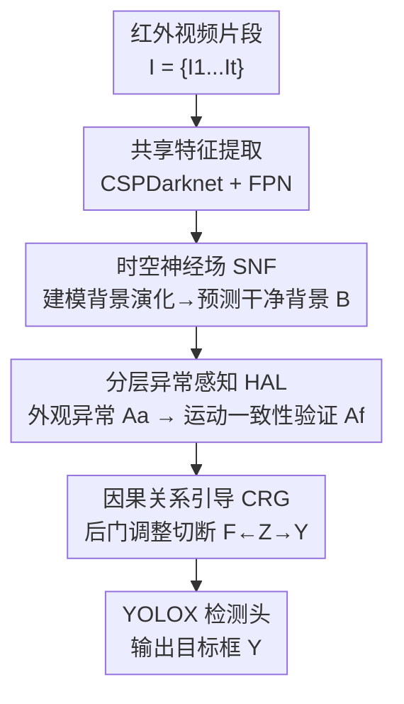

# CHAL: Causal-guided Hierarchical Anomaly-aware Learning for Moving Infrared Small Target Detection

**会议**: CVPR 2026  
**论文**: [CVF Open Access](https://openaccess.thecvf.com/content/CVPR2026/html/Duan_CHAL_Causal-guided_Hierarchical_Anomaly-aware_Learning_for_Moving_Infrared_Small_Target_CVPR_2026_paper.html)  
**代码**: https://github.com/UESTC-nnLab/CHAL  
**领域**: 红外小目标检测 / 视频目标检测  
**关键词**: 红外小目标, 异常检测, 因果学习, 背景建模, 时空神经场

## 一句话总结
把"运动红外小目标检测"从"直接学微弱目标特征"反转为"学背景正常模式、把目标当成背景里的异常"，用时空神经场建模背景演化、分层异常感知（外观异常→运动一致性验证）、再用因果后门调整切断背景混淆路径，在三个红外数据集上刷新 SOTA。

## 研究背景与动机

**领域现状**：红外小目标检测（ISTD）几乎所有数据驱动方法都是"以目标为中心"（target-centered），直接从背景里学目标特征——单帧方法（ISNet、MSHNet、PConv）只看一张图的外观，多帧方法（SSTNet、Tridos、DTUM）额外提取连续帧的运动模式，后者已成主流。

**现有痛点**：红外小目标天生 **Small（成像尺寸极小）+ Dim（与背景对比度低）**，缺乏清晰形状和纹理。以目标为中心的范式存在一个根本矛盾：它依赖丰富的目标特征，而这正是红外小目标最缺的。结果检测器极易被混淆——当一个微弱目标紧挨亮云边缘时，模型会去学更强的背景混淆物（confounder）而非昏暗目标，退化成一个"混淆物检测器"，产生大量虚警。

**核心矛盾**：问题出在因果结构上。作者画了个结构因果模型（SCM）：目标特征 $T \to F \to Y$ 是真因果链，但存在一条混淆路径 $F \leftarrow Z \to Y$——其中 $Z$ 是复杂背景杂波/亮云边缘/传感器噪声，它既污染特征学习（$F \leftarrow Z$）又直接制造虚警（$Z \to Y$）。直接在弱目标上做监督，无法切断这条混淆路径。

**本文目标**：把运动红外小目标检测（MISTD）重新表述为一个**异常发现（anomaly discovery）**任务——不直接分类像素是目标还是背景，而是找出偏离背景时空演化模式的区域。子问题随之分解为：(1) 怎么建模连续演化的红外背景"正常态"；(2) 怎么把真异常（目标）从虚假异常（背景混淆物）里分出来；(3) 怎么在特征空间切断混淆路径。

**切入角度**：反转范式——从"盯着弱目标"转向"以背景为中心"（background-centered）。背景虽复杂但相对稳定、信息量大，更易建模；目标就是背景里少数偏离正常模式的"异常点"。这个反转把"无米之炊"（目标特征太弱）变成了"有据可依"（背景模式可学）。

**核心 idea**：先用时空神经场学出背景正常态，再分层地"先挖外观异常、后用运动一致性验真"，最后用因果后门调整把背景混淆物的伪相关压掉、放大真目标因果——即"以背景为中心 + 分层异常感知 + 因果引导"三件套。

## 方法详解

### 整体框架

CHAL 的输入是一段红外视频片段 $I=\{I_1,\dots,I_t\}$（默认 $t=5$ 帧），目标是在关键帧 $I_t$ 上定位异常（即小目标）$Y$。整条流水线由三个核心组件串成：**SNF（时空神经场）→ HAL（分层异常感知学习）→ CRG（因果关系引导）**，最后接一个 YOLOX 检测头出框。

具体地：先用共享的 CSPDarknet + FPN 逐帧提多尺度特征 $F_C \in \mathbb{R}^{b\times t\times c\times h\times w}$；SNF 把这些特征投影到语义子空间得到场景编码 $Z$、构建 3D 时空网格得到位置编码 $Q$，再用一个背景神经场 $F_\theta$ 反事实地"预测出干净背景 $B$"；HAL 拿预测背景去和真实帧特征比对，先挖外观异常候选 $A_a$、再用运动一致性把真异常 $A_f$ 验出来；CRG 把 $A_f$ 当作混淆物 $Z$ 的代理，对特征做后门调整得到去混淆特征 $F_f$ 送进检测头。整个框架没有显式的背景/异常标签，全靠最终检测损失 $L_{total}$ **隐式监督**所有上游组件——梯度回传时会惩罚每个阶段的偏差。

### 关键设计

**1. 时空神经场 SNF：用生成视角隐式学出背景的连续时空演化**

痛点是红外背景复杂且不断演化，传统背景建模（PSTNN、FGLR-MCP）依赖刚性先验、抓不住连续时空特性。SNF 把背景当成一个可被神经场连续表示的信号来"生成"。它先把多帧特征做早期融合并堆叠成时空体 $V=f_{sta}(F_C)=f_{att}(f_{up}(\sum_{i=1}^t F_C^i))$，再用一个**双解耦分支**的场景编码器把"不变外观"和"运动演化"分开：场景分支 $Z_s=\psi_s(F_a)$ 抽静态外观特征，运动分支 $Z_d=\psi_d(V)$ 显式建模运动模式，拼接成带背景先验的场景编码 $Z$。

关键的"神经场"体现在位置编码上：为关键帧每个点 $(i,j)$ 构造 3D 时空坐标网格 $G(i,j,t)=(\frac{2j}{w-1}-1,\ \frac{2i}{h-1}-1,\ \alpha\cdot t)$（$\alpha$ 是可学的时间尺度），再做 Fourier 特征映射 $Q=\{P(\mu)\}=\{[\sin(2^l\pi\mu),\cos(2^l\pi\mu)]\}_{l=1}^L$ 把坐标升到高维以捕捉高频细节。最后背景场 $F_\theta$ 做**反事实预测**得到干净背景：

$$B = F_\theta(Z, Q) = R\big(f_\theta(f_{cat}(T(Z), Q))\big)$$

其中 $f_\theta$ 是带残差的两层 MLP（128 隐维）。这样有效是因为：神经场天然表达连续坐标→值的映射，能把背景的时空演化拟合成平滑的"正常态画布"，目标作为偏离这块画布的少数点就自然凸显出来，为后面的异常发现打地基。

**2. 分层异常感知学习 HAL：把"一步判异常"拆成"先发现外观异常、再用运动验真"**

痛点是单步异常判定会把"偏离背景的背景混淆物"也当成异常（虚假异常）。HAL 把异常发现分解为**发现→验证**两级。第一级"外观异常"：直接拿每帧特征 $F_k$ 和预测的反事实背景 $B_k$ 算逐点余弦相似度，相似度越低越异常，再经一个带残差的异常放大器 $\Delta_\theta$：

$$A_a^k = \Delta_\theta\big(1 - f_{cos}(F_k, B_k)\big),\quad f_{cos}(F_k,B_k)(i,j)=\frac{F_k(i,j)\cdot B_k(i,j)}{\|F_k(i,j)\|_2\,\|B_k(i,j)\|_2}$$

但 $A_a$ 里混着假异常。第二级"运动验证"：把外观异常序列投影到高维子空间，用 $N$ 层时空 Swin Transformer 在局部 3D 窗口里做移位自注意力，做联合时空建模、增强**运动一致性**——真目标在连续帧里运动连贯，假异常（云边、噪声）则缺乏一致运动。最后解码得 $A_r$，并用 **temporal-weight learning** 给每帧分配自适应权重 $\omega_k=\frac{\exp(\beta_k)}{\sum_k\exp(\beta_k)}$，加权融合出最终因果异常 $A_f=\sum_{k=1}^t\omega_k\cdot A_r^k$。"发现靠外观、验真靠运动"的分工，正好对应小目标"外观弱但运动有迹可循"的特点。

**3. 因果关系引导 CRG：用后门调整切断背景混淆路径、放大真目标因果**

这是全文因果思想的落点，专治 $F\leftarrow Z\to Y$ 这条混淆路径。理论上后门调整要对混淆物 $Z$ 分层后加权平均预测：$P(Y|do(F))=\sum_z P(Y|F,Z=z)P(Z=z)$。但 MISTD 里 $Z$（背景杂波）是连续且动态的，无法直接枚举分层。CRG 因此提出一个**可微的因果引导门控**作为替代：把 HAL 验出的因果异常 $A_f$ 归一化到 $(0,1)$ 当作 $Z$ 的学习代理，用一个非线性滤波按阈值 $\tau$ 把它分成两"层"并施加不同强度的干预：

$$H = \begin{cases} \eta_e\cdot f_{nor}(A_f), & f_{nor}(A_f) > \tau \\ \eta_s\cdot f_{nor}(A_f), & \text{otherwise}\end{cases}$$

其中 $\eta_e>1$、$\eta_s<1$ 是可学缩放因子（高异常区放大、低异常区抑制）。同时用外观注意力 $M$ 得到含残差混淆的观测特征 $\hat F_t=F_t\odot M=F_t\odot[\sigma_s(f_e(F_t))]$，再用异常分数 $H$ 对其做后门调整得到去混淆特征：

$$F_f = f_{ref}(\hat F_t\odot(1+H))$$

这一步等价于按"是不是真异常"重新加权特征流，把混淆路径 $F\leftarrow Z\to Y$ 隔离掉、强迫特征逼近真因果链 $T\to F\to Y$。和直接在弱目标上监督相比，CRG 显式地把"背景混淆物"识别出来并压制，从根上减少虚警。

### 损失函数 / 训练策略

总损失 $L_{total}=L_{obj}+\lambda_1 L_{reg}+\lambda_2 L_{cls}$：分类 $L_{cls}$ 和概率 $L_{obj}$ 用 sigmoid focal loss，定位 $L_{reg}$ 用 NWD loss（更适合小目标）。关键点在于全程**没有背景/异常的显式监督**——$L_{total}$ 只在最终特征 $F_f$ 上算，靠反向传播隐式驱动 SNF/HAL/CRG 三个上游组件协同优化。超参：$t=5$（帧数）、$L=6$（Fourier 频带数）、$N=2$（Swin 层数）、$\tau=0.3$、$\lambda_1=4.0$、$\lambda_2=1.2$；AdamW，初始 lr $8\times10^{-5}$，weight decay $5\times10^{-2}$，100 epoch，batch 4，输入 resize 到 $512\times512$。

## 实验关键数据

三个公开红外数据集：DAUB-H、NUDT-MIRSDT、IRDST-R；指标 Pr / Re / F1 / mAP50（IoU=0.5）；对比 17 个代表方法（单帧 + 多帧 + 异常检测）。

### 主实验

| 数据集 | 指标 | CHAL(本文) | 之前最好 | 说明 |
|--------|------|-----------|---------|------|
| NUDT-MIRSDT | mAP50 | **75.25** | 73.01 (Tridos) | 刷新 SOTA |
| NUDT-MIRSDT | F1 | **87.41** | 85.87 (Tridos) | 更均衡 |
| NUDT-MIRSDT | Pr | 86.35 | 92.50 (ADSUNet) | ADSUNet 牺牲 Re 换高 Pr |
| DAUB-H | mAP50 | **54.28** | 52.25 (SSTNet) | 刷新 SOTA |
| DAUB-H | F1 | **74.15** | 71.98 (SSTNet) | — |
| IRDST-R | mAP50 | **71.37** | 68.21 (SSTNet) | 刷新 SOTA |
| IRDST-R | F1 | **84.76** | 82.79 (SSTNet) | — |

通用异常检测方法在红外场景几乎失效：DiffusionAD 在 DAUB-H 只有 mAP50 19.50 / F1 42.13（远低于 CHAL 的 54.28 / 74.15），INPFormer 更是 mAP50 仅 1.31；在 IRDST-R 上这些 AD 方法甚至**训练不收敛**——因为它们都为可见光图像设计。CHAL 参数 15.69M（多帧但中等量级，低于 MTMLNet 16.79M、ADSUNet 26.06M），137.04 GFLOPs，12.96 FPS（RTX4090）。

### 消融实验（DAUB-H，逐组件累加）

| 配置 | mAP50 | F1 | 说明 |
|------|-------|-----|------|
| w/o All（baseline） | 23.48 | 46.36 | 无任何专用组件 |
| + SNF（S1+S2+S3） | 43.76 | 60.90 | 背景神经场，+20.3 mAP50 |
| + HAL（H1+H2） | 48.63 | 66.68 | 分层异常感知，再 +4.9 |
| + CRG（C1+C2+C3，Full） | **54.28** | **74.15** | 因果引导，再 +5.7 |

> SNF 拆为 S1(背景场 $F_\theta$)/S2(场景编码器)/S3(位置编码器)，HAL 拆为 H1(外观异常)/H2(运动一致性因果验证)，CRG 拆为 C1(异常增强)/C2(因果门控)/C3(因果特征精炼)，论文逐项累加均单调涨点。

### 关键发现
- **SNF 贡献最大**：从 baseline 加上完整 SNF，DAUB-H mAP50 直接从 23.48 → 43.76（+20.3），说明"以背景为中心"这个范式反转是涨点主力，而非靠后面的精修。
- **三组件有协同效应**：HAL 和 CRG 都建立在 SNF 给出的"干净背景"之上，逐级累加单调提升，去掉任一级都掉点，验证了"发现→验证→去混淆"链条的必要性。
- **可见光场景仍有适应性**：作者称即便在可见光场景 CHAL 也有明显适配性（⚠️ 具体可见光数值在正文未充分给出，以原文/附录为准）。
- **Pr/Re 更均衡**：ADSUNet 靠牺牲 Re 拿到高 Pr，CHAL 则在 F1 上更优，说明它在"少漏检"和"少虚警"间取得了更好平衡。

## 亮点与洞察
- **范式反转最"啊哈"**：当目标特征太弱学不动时，反过来学相对稳定、信息量大的背景，把目标变成"背景里的异常"——把一个 ill-posed 问题（无米之炊）转成了 well-posed 问题（有据可依）。这个 reframing 比任何模块都关键（消融里 SNF 一项就贡献了大半涨点）。
- **因果门控是连续混淆物的可微近似**：经典后门调整需要枚举离散分层 $\sum_z$，而背景杂波是连续动态的没法枚举；CHAL 用"归一化异常分数 + 阈值分两层 + 可学缩放 $\eta_e,\eta_s$"把它做成可微替代，这个把因果理论落到工程的技巧可迁移到其他"混淆物连续"的任务。
- **神经场用于背景而非目标**：神经场常用来表达稠密信号/场景，这里反向用来表达"背景正常态画布"，让目标作为偏离点凸显，是神经场的一个新颖用法。
- **全程无显式背景标签**：背景预测、异常发现都靠最终检测损失隐式监督，省掉了背景重建的标注成本。

## 局限与展望
- **三阶段串行、推理成本不低**：5 帧输入 + Swin Transformer + 神经场，137 GFLOPs、12.96 FPS，实时性对高帧率告警系统可能吃紧。
- **依赖背景"可建模"假设**：SNF 假设背景演化是连续可学的；当背景剧烈突变（快速平移相机、强机动）时，"正常态"画布可能失稳，目标和背景突变会混淆（⚠️ 论文未专门讨论此极端情形）。
- **代理混淆物的有效性存疑**：CRG 用 HAL 输出的 $A_f$ 当 $Z$ 的代理，如果 HAL 本身把假异常当真异常，误差会沿因果门控传导放大；两者耦合较紧，缺乏独立校验。
- **超参敏感性放在附录**：$\tau=0.3$、$\eta_e/\eta_s$、$L=6$ 等对结果的影响正文未展开，门控阈值的鲁棒性需看附录。

## 相关工作与启发
- **vs 以目标为中心的 ISTD（ISNet / MSHNet / Tridos / DTUM）**：它们直接学弱目标特征，易被背景混淆物带偏；CHAL 反过来学背景、把目标当异常，绕开了"目标特征太弱"的死结，在三数据集 mAP50/F1 全面领先。
- **vs 通用异常检测（DiffusionAD / INPFormer）**：这些方法为可见光工业/监控设计，迁到红外直接失效甚至不收敛；CHAL 针对红外的"时空背景演化 + 运动验证"专门设计，是首个把异常发现成功用到 MISTD 的框架。
- **vs 因果学习方法（UFR / CRCL）**：它们用干预解耦高层语义，而 MISTD 的混淆物是非语义的（纹理、边缘）且动态演化，现成因果设计不适用；CHAL 把后门调整改造成连续动态混淆物上的可微门控，是对因果方法在低层视觉任务上的适配创新。

## 评分
- 新颖性: ⭐⭐⭐⭐⭐ 首个把 ISTD 反转为"背景为中心的异常发现"并引入因果后门调整的框架，范式层面的创新
- 实验充分度: ⭐⭐⭐⭐ 三数据集 + 17 方法对比 + 细到 S1~C3 的逐组件消融，扎实；但可见光适配和超参敏感性放附录、正文略
- 写作质量: ⭐⭐⭐⭐ 因果图 + 三组件 pipeline 讲得清楚，公式完整；部分符号（如 $\hat F_t$、$F_g$）略密
- 价值: ⭐⭐⭐⭐ 给红外/弱信号目标检测提供了"学背景而非学目标"的新思路，且代码开源，复现与迁移价值高

<!-- RELATED:START -->

## 相关论文

- [\[CVPR 2026\] Target-Aware Invertible Encoder with Reconstruction Guidance for Infrared Small Target Detection](target-aware_invertible_encoder_with_reconstruction_guidance_for_infrared_small_.md)
- [\[CVPR 2026\] Seeing Through the Noise: Improving Infrared Small Target Detection and Segmentation from Noise Suppression Perspective](seeing_through_the_noise_improving_infrared_small_target_detection_and_segmentat.md)
- [\[NeurIPS 2025\] Rethinking Evaluation of Infrared Small Target Detection](../../NeurIPS2025/object_detection/rethinking_evaluation_of_infrared_small_target_detection.md)
- [\[CVPR 2026\] Dual-Prototype-Guided Multi-task Learning for Unsupervised Anomaly Detection and Classification](dual-prototype-guided_multi-task_learning_for_unsupervised_anomaly_detection_and.md)
- [\[CVPR 2026\] Towards Persistence: Learning Topological Constraints for Event-based Small Object Detection](towards_persistence_learning_topological_constraints_for_event-based_small_objec.md)

<!-- RELATED:END -->
