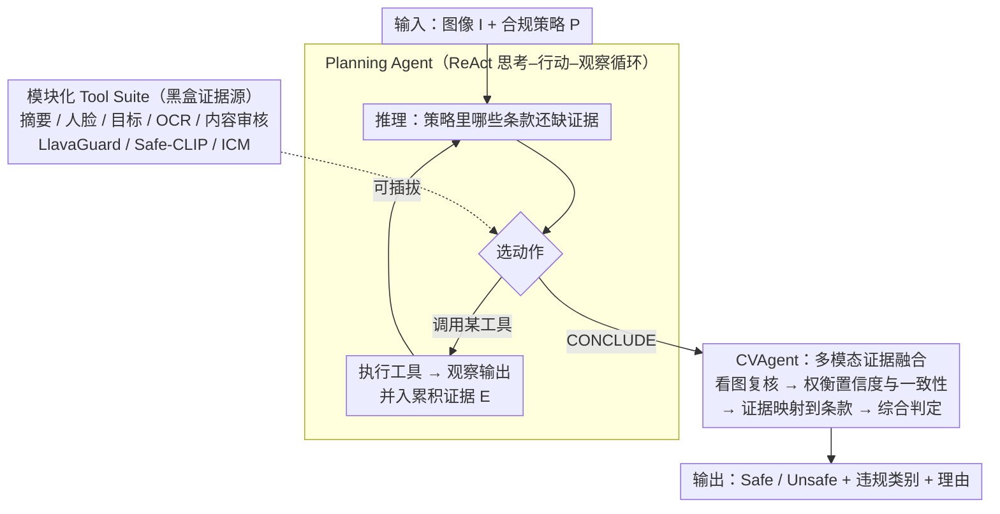

# CompAgent: An Agentic Framework for Visual Compliance Verification

**会议**: CVPR 2026  
**arXiv**: [2511.00171](https://arxiv.org/abs/2511.00171)  
**代码**: 无  
**领域**: 目标检测 / 内容安全  
**关键词**: 视觉合规验证, 智能体框架, 工具增强推理, 内容审核, MLLM

## 一句话总结

提出 CompAgent，首个用于视觉合规验证的智能体框架——Planning Agent 根据合规策略动态选择视觉工具（目标检测、人脸分析、NSFW 检测等），Compliance Verification Agent 整合图像、工具输出和策略上下文进行多模态推理，无需训练即在 UnsafeBench 上超越 SOTA 10% 达 76% F1。

## 研究背景与动机

视觉内容合规验证在视觉领域中意义重大但研究不足：

**实际需求迫切**：从 GDPR 到 Ofcom 等各种法规要求确保视觉内容合规，流媒体平台因违规面临最高 2300 万美元罚款。内容合规涉及检测有害物体、不当手势、露骨内容等多方面，且随地区、文化、行业持续演变。

**现有方案的根本局限**：
   - **专用分类器**：需要昂贵的标注数据，且策略变化后需重新训练，泛化能力差。LlavaGuard 在自家数据集上 F1=0.91，但在 UnsafeBench 上降至 0.66。
   - **MLLM 直接提示**：虽具备广泛知识，但在精细视觉细节推理和结构化合规规则应用上能力不足。最好的零样本 MLLM（Llama 4 Maverick）在 LlavaGuard 上仅 0.55 F1。

**智能体方法的缺口**：尽管 agentic 方法在其他领域蓬勃发展，但尚无专门针对视觉合规验证的智能体框架。

CompAgent 的思路：不训练专用模型，也不仅靠提示工程，而是通过**工具增强的智能体架构**将合规验证分解为模块化步骤——动态规划工具选择 + 多模态证据融合推理。

## 方法详解

### 整体框架

CompAgent 把"判断一张图是否违反合规策略"做成一个不训练、可解释的智能体流程：不训练专用分类器、也不只靠一句 prompt 让 MLLM 拍脑袋，而是让一个 Planning Agent 读懂策略后，从一套现成视觉工具里动态挑工具取证据；取够了再交给 Compliance Verification Agent（CVAgent），由它把图像、各路工具输出和策略条款汇到一起做最终判定。三个部件——Planning Agent（决定取什么证据）、Tool Suite（黑盒证据源）、CVAgent（解读证据下结论）——分工明确，整条链路无需任何标注或微调。

### 关键设计

**1. Planning Agent：用 ReAct 循环按策略缺口动态编排工具**

合规策略千变万化，固定路由表或学出来的策略一遇新条款就失灵。Planning Agent 改用 ReAct 的"思考-行动-观察"循环：每一步 $t$ 维护状态 $s_t = \{I, P, E_t\}$（图像、策略、累积证据），推理还有哪些条款没证据，选一个工具 $a_t \in T \cup \{\text{CONCLUDE}\}$，执行后把观察并回证据 $E_{t+1} = E_t \cup (\text{thought}_t, a_t, o_t)$。工具选择完全由 LLM 在上下文里基于三件事推理：策略 $P$ 里哪些条款还缺证据、每个工具能干什么、已经攒了哪些证据 $E_t$——所以年龄限制条款会触发人脸检测、文本违规条款优先触发 OCR，而不是无脑跑全套。实现上用 LangGraph + Claude Sonnet 3.5 v2，最大推理 10 步。

**2. 模块化 Tool Suite：把专用模型当可插拔的黑盒证据源**

策略需要的证据类型五花八门，CompAgent 用一组现成工具覆盖：摘要工具生成场景描述；内容检测工具给出人脸（年龄/表情/情绪）、目标框 + 置信度、OCR 文字、内容审核（不安全类别 + 严重程度）；专用合规工具如 LlavaGuard（安全评级 + 违规类别 + 理由）、Safe-CLIP（七类有毒内容零样本检测）、ICM Assistant（模板化安全评估）。每个工具都被当成黑盒，可增删替换且不需要重训——这正是 training-free 能适应新策略的底气，换了法规只改工具集和策略文本即可。

**3. CVAgent：多模态证据融合，把证据落到具体条款上**

收集证据的 Agent 可以是便宜的纯文本 LLM，但下最终判断必须真正看图，所以这一步交给 MLLM。CONCLUDE 后 CVAgent 拿到完整状态 $s_T = \{I, P, E_T\}$，依次直接检视图像、逐个审查工具输出（权衡置信度与跨工具一致性）、把组合证据映射到具体策略条款、再综合评估，最后输出 Safe/Unsafe 二元评级、违规类别，以及把证据链到条款的理由说明。Planning Agent 决定"收集什么证据"、CVAgent 决定"怎么解读证据"，两者解耦让取证便宜、判定可靠。

### 一个完整示例

以一条含"未成年人不得出现 + 画面不得含露骨文字"两个条款的策略为例：Planning Agent 先读策略，发现年龄条款缺证据 → 调人脸检测，观察到一张被估为未成年的人脸；接着发现文本条款缺证据 → 调 OCR，取回画面中的文字串；两条都有证据后输出 CONCLUDE。CVAgent 拿到图像 + 这两路证据，直接看图复核人脸、比对 OCR 文本是否触线，把"检测到未成年人脸"映射到年龄条款、判定 Unsafe，并给出"违反未成年人条款，证据为人脸年龄估计"的理由。整个过程没有跑用不上的 NSFW 或目标检测工具——决策轨迹分析也印证了这点：框架在 LlavaGuard / UnsafeBench 上分别产生了 95 / 147 种不同的工具使用模式，确实在按策略动态适配。

### 训练策略

CompAgent 完全 **training-free**，不需要标注数据或微调。相比 LlavaGuard 这类要靠特定策略标注数据训练、换数据集就掉点的方法，无训练让它能随策略变化即时适应，这是它的核心优势。

## 实验关键数据

### 主实验

| 方法 | 类型 | LlavaGuard F1 | UnsafeBench F1 | 说明 |
|------|------|--------------|----------------|------|
| Claude Sonnet 3.5 v2 | 零样本 | 0.61 | 0.54 | 最好的零样本单模型 |
| Llama 4 Maverick | 零样本 | 0.55 | 0.71 | 零样本 |
| LlavaGuard (专用策略) | 微调 | 0.91 | 0.66 | 自家数据强，跨数据集大幅下降 |
| Safe-CLIP | 微调 | 0.36 | 0.59 | 零样本有毒检测 |
| Category-based Routing | 路由 | 0.61 | 0.63 | 固定路由基线 |
| **CompAgent** | **智能体** | **0.93** | **0.76** | **两个数据集均最优** |

CompAgent 在 LlavaGuard 数据集上 F1=0.93（超越微调的 LlavaGuard 0.91），在 UnsafeBench 上 F1=0.76（超越 SOTA 10%），且**无需任何训练数据**。

### 消融实验

| 配置 | UnsafeBench F1 | 说明 |
|------|----------------|------|
| 无工具（直接 MLLM） | 0.54 | 缺乏精细视觉证据 |
| 固定工具路由 | 0.63 | 静态分配不灵活 |
| 无 Planning Agent | 较低 | 工具选择不够针对性 |
| 无 CVAgent（Planning 直接判定） | 较低 | 缺乏多模态证据融合 |
| **完整 CompAgent** | **0.76** | 动态编排 + 证据融合最优 |

决策轨迹分析显示：LlavaGuard 数据集上有 95 种不同的工具使用模式，UnsafeBench 上有 147 种——说明框架确实在动态适应不同的合规需求。

### 关键发现

- **零样本 MLLM 不够**：即使最强的 MLLM 直接使用也无法满足合规验证需求，说明结构化工具增强不可或缺
- **微调模型泛化差**：LlavaGuard 在自家数据 F1=0.91，跨数据集降至 0.66，暴露基于特定数据训练的脆弱性
- **智能体方法的优势核心**：动态工具选择 + 多源证据交叉验证 + 无需训练的灵活适应

## 亮点与洞察

- **首个视觉合规验证的 agentic 框架**，开辟了新的研究方向
- **零训练 + 超越微调模型**的结果令人惊喜：证明在合规验证这类策略多变的场景中，agentic 方法比微调更实用
- **Planning Agent 与 CVAgent 的分离设计**很巧妙：信息收集（可用便宜的 LLM）和信息判定（需要 MLLM 看图）解耦
- 工具套件的模块化设计使系统易于扩展和适应新合规需求

## 局限与展望

- 当前仅处理单张图像，视频合规验证（连续场景、上下文依赖）需要扩展
- 依赖 Claude Sonnet 3.5 v2 作为骨干，推理成本较高且依赖闭源模型
- 工具套件的选择和描述需要人工设计，新工具的集成仍需人工干预
- 在 UnsafeBench 上 F1=0.76 虽为 SOTA，但距离完美仍有较大差距
- 缺乏对延迟和成本的详细分析（多次工具调用 + LLM 推理）

## 相关工作与启发

- ReAct 框架在视觉合规领域的首次应用，证明 agentic 方法在需要灵活适应的任务中有独特价值
- 与 NudeNet、Safe-CLIP 等专用工具的关系：CompAgent 将它们作为工具源而非替代品
- 启发：其他需要策略驱动判定的视觉任务（如广告合规、医学影像审查）可借鉴此框架

## 评分

- **新颖性**: ⭐⭐⭐⭐ 首个合规验证 agentic 框架，但 ReAct + 工具调用本身不算新
- **实验充分度**: ⭐⭐⭐⭐ 两个数据集对比充分，消融和可解释性分析到位
- **写作质量**: ⭐⭐⭐⭐ 问题定义清晰，框架描述详细，但正文稍长
- **价值**: ⭐⭐⭐⭐⭐ 实际应用价值极高，无训练适应新策略的特性对工业界有直接意义

<!-- RELATED:START -->

## 相关论文

- [\[AAAI 2026\] Connecting the Dots: Training-Free Visual Grounding via Agentic Reasoning](../../AAAI2026/object_detection/connecting_the_dots_training-free_visual_grounding_via_agent.md)
- [\[CVPR 2026\] CD-Buffer: Complementary Dual-Buffer Framework for Test-Time Adaptation in Adverse Weather Object Detection](cd-buffer_complementary_dual-buffer_framework_for_test-time_adaptation_in_advers.md)
- [\[CVPR 2026\] Evaluating Few-Shot Pill Recognition Under Visual Domain Shift](evaluating_few-shot_pill_recognition_under_visual_domain_shift.md)
- [\[CVPR 2026\] UniSpector: Towards Universal Open-set Defect Recognition via Spectral-Contrastive Visual Prompting](unispector_towards_universal_open-set_defect_recognition_via_spectral-contrastiv.md)
- [\[CVPR 2026\] PET-DINO: Unifying Visual Cues into Grounding DINO with Prompt-Enriched Training](pet-dino_unifying_visual_cues_into_grounding_dino_with_prompt-enriched_training.md)

<!-- RELATED:END -->
