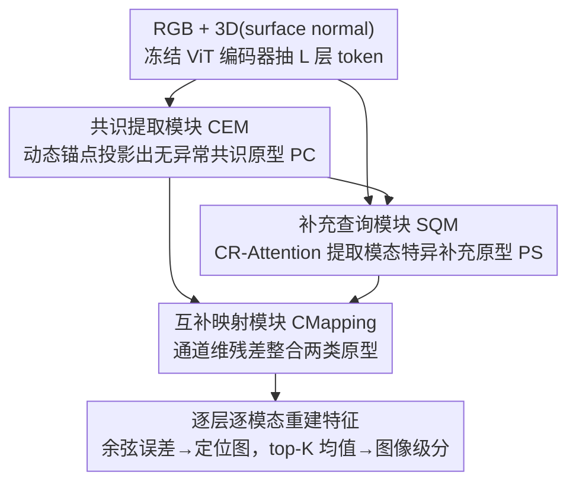

# Complementary Prototype Mapping for Efficient Multimodal Anomaly Detection

**会议**: CVPR 2026  
**论文**: [CVF Open Access](https://openaccess.thecvf.com/content/CVPR2026/html/Zhao_Complementary_Prototype_Mapping_for_Efficient_Multimodal_Anomaly_Detection_CVPR_2026_paper.html)  
**代码**: https://github.com/yuanzhao-CVLAB/CPMAD  
**领域**: 多模态异常检测 / 工业缺陷检测  
**关键词**: 多模态异常检测, 跨模态映射, 原型学习, 残差注意力, 高效推理

## 一句话总结
针对 RGB-3D 多模态异常检测中"无条件跨模态映射"会把正常的多样变化（如同一几何下不同颜色）误判为异常的问题，CPMAD 动态提取"共识原型"（跨模态一致、无异常的子空间）和"补充原型"（捕捉被共识忽略的模态特异线索），用两类互补原型引导跨模态重建，在 MVTec-3D 上达到 97.8% I-AUROC 的同时，轻量版推理快 5×、显存降 2.6×。

## 研究背景与动机

**领域现状**：无监督多模态异常检测（MAD）只用正常样本训练，靠 RGB 纹理与 3D 几何互补来同时发现外观和形状缺陷。为了摆脱 memory-bank 方法（如 M3DM）巨大的内存开销，近期主流转向"特征映射"路线——以 CFM 为代表，在正常样本上学习一个跨模态匹配关系（例如从 3D 特征映射出对应的 RGB 特征），推理时用映射差异定位缺陷。

**现有痛点**：跨模态关系本质是**多对多**的复杂映射，但 CFM 这类方法学的是**无条件映射**（unconditional mapping）——给定一个 3D 几何，它倾向输出一个确定的 RGB 表示。可现实中同一个 3D 形状在 RGB 模态下可能有多种正常变化（论文图 1 的例子：相同几何结构，颜色可能是粉色也可能是橙色）。无条件映射无法自适应区分"该映射到粉还是橙"，于是把这些**多样但正常**的变化当成异常报出来，造成映射歧义（mapping ambiguity）。此外这类方法要么依赖低效的 memory bank，要么解码过程耗时，难以部署到真实产线。

**核心矛盾**：跨模态映射要同时满足两个互相牵扯的目标——既要保持**跨模态一致性**（压住真正的异常），又要保留**分布多样的、模态特异的正常细节**（不把正常变化误杀）。无条件映射在两者间没有调和手段，只能二选一。

**本文目标**：在不引入重型解码器、保持线性复杂度的前提下，让跨模态映射"有条件、能自适应"——既能滤掉异常，又能恢复多样的正常细节。

**切入角度**：作者把映射所需的先验拆成两份互补的"原型"。共识原型刻画跨模态共有、无异常的语义（提供"该往哪个公共中心靠"的参照）；补充原型刻画共识没覆盖到的、模态特异的关键线索（提供"粉还是橙"这种消歧信息）。两者互补，就能把无条件映射变成有条件、自适应的映射。

**核心 idea**：用"共识原型 + 补充原型"两套动态先验取代单一的无条件映射，让重建在每个 token 上自适应地从两个子空间聚合互补线索，从根上消除映射歧义。

## 方法详解

### 整体框架

CPMAD 的输入是一对配准好的 3D（用 surface normal 表示）和 RGB 图像，输出是逐层、逐模态的重建特征，重建误差即异常定位图。整条流水线是：一对冻结的 ViT 编码器（DINO ViT-B/8）抽出 $L$ 层 patch-token 特征 $\{F^{3D}_l, F^{RGB}_l\}$（实现里 $L=2$，对应低层和高层表示）；这些特征先送进 **共识提取模块（CEM）** 得到全局共识原型 $P^{\mathcal{C}}$；每一层再由 **补充查询模块（SQM）** 提取该层、该模态的补充原型 $P^{\mathcal{S}}_l$；最后 **互补映射模块（CMapping）** 把两类原型整合，重建出该层映射后的 3D 与 RGB 特征 $\hat{F}^{3D}_l, \hat{F}^{RGB}_l$。训练时让重建特征逼近真实特征，推理时把各层各模态的重建误差（余弦距离）平均成像素级定位图，再取 top-K 均值作为图像级异常分。

整个设计的妙处在于：CEM 只算一次、产生全局参照；SQM/CMapping 都是轻量注意力且查询数远小于 token 数，因此整体复杂度随 token 数线性增长，不需要重型解码器——这正是它比 memory-bank 和重解码器方法又快又省的来源。

### 关键设计

**1. 共识提取模块 CEM：用动态锚点投影出"无异常的跨模态公共子空间"**

这一步针对"如何得到一个干净、跨模态一致的参照中心"。最朴素的做法是把各层 RGB 与 3D token 拼起来求均值得到共识 token $F$——平均能平滑掉模态间不一致、抑制只在单模态出现的异常信号。但跨模态**同时出现**的异常仍会在平均里污染共识 token。CEM 的解法是引入一个**动态锚点（dynamic anchor）**把 token 投影进无异常的原型空间：先初始化一组可学习 embedding $\mathcal{H} \in \mathbb{R}^{I\times D}$ 作初始锚点（$I=12$），分别计算锚点与 RGB、3D 特征的余弦相似度并取平均得到亲和度

$$\mathbf{W}_{i,n}=\frac{1}{2}\Big(\frac{(\mathbf{Z}^{3D}_n)^\top \mathcal{H}^{3D}_i}{\|\mathbf{Z}^{3D}_n\|\,\|\mathcal{H}^{3D}_i\|}+\frac{(\mathbf{Z}^{RGB}_n)^\top \mathcal{H}^{RGB}_i}{\|\mathbf{Z}^{RGB}_n\|\,\|\mathcal{H}^{RGB}_i\|}\Big)$$

再用亲和度把跨模态拼接特征 $\mathbf{F}^{cat}$ 聚合成动态锚点 $\mathcal{H}^{Dyn}_i=\sum_{n}\mathbf{W}_{i,n}\mathbf{F}^{cat}_n$，最后用 cross-attention 让共识 token 向动态锚点靠拢、再逐层平均，得到共识原型 $P^{\mathcal{C}}=\mathrm{LAvg}(\mathrm{CA}(\overline{F}, \mathcal{H}^{Dyn}))$。关键在于锚点是**从数据动态聚合**出来的而非静态可学习向量——消融显示换成静态锚点会掉点，因为静态锚点无法自适应捕捉每个样本的跨模态语义，反而可能把异常模式带进原型空间。CEM 只算一次且复杂度 $O(NLID)$，远小于特征图规模，几乎不增加开销。

**2. 补充查询模块 SQM：用残差注意力"减掉共识、留下模态特异线索"**

共识原型刻画了共有语义，但恰恰丢掉了"粉还是橙"这种消歧所需的模态特异变化。SQM 要专门把这部分捞回来。它初始化一小组可学习查询 $\mathcal{G}\in\mathbb{R}^{G\times D}$（$G=8$，远小于 token 数 $N=784$），让查询**同时**注意共识原型和模态特异 token，得到两路注意力分数：对共识的 $A^{\mathcal{S}2\mathcal{C}}=Q^{\mathcal{C}}(K^{\mathcal{C}})^\top$ 和对模态特征的 $A^{\mathcal{S}2F}=Q^{F}(K^{F})^\top$。核心是 **互补残差注意力（CR-Attention）** 把两路相减：

$$\mathbf{P}^{\mathcal{S}}_l=\mathrm{ReLU}\Big(\frac{\varphi(\alpha)A^{\mathcal{S}2F}-\varphi(\beta)A^{\mathcal{S}2\mathcal{C}}}{\sqrt{D}}\Big)V$$

其中 $\alpha,\beta$ 是可学习标量、$\varphi$ 是 Sigmoid 用来平衡两路权重，$V$ 是模态特征的投影。直觉很清楚：减去"对共识的响应"意味着把那些已经被共识原型解释好的区域分数压低，再借 ReLU 把负分数区域直接截断为零——于是只有**残差显著为正**（即共识解释不了的、模态独有的）区域被保留下来生成补充原型。作者还把查询数约束得很小（$G\ll N$）让补充原型保持低秩，因为补充线索本就成分少，查询太多会增加复杂度并把模态相关噪声重新引回来。消融里把 CR-Attention 换成普通 cross-attention（看不到共识原型）会明显掉点，正说明"减掉共识"这一步是补充原型聚焦模态特异线索的关键。

**3. 互补映射 CMapping：用通道维残差整合两类原型、避开"恒等捷径"**

有了共识原型（共有语义）和补充原型（模态特异线索），CMapping 负责把它们整合去重建逐模态特征。它在两类原型表示间做一次轻量 cross-attention，让每个 token 自适应地从两个子空间聚合最相关的原型成分，再接一个前馈精炼网络。这里的关键改动是用**通道维残差（channel-wise residual）**取代常规 cross-attention 的 token 维残差：传统 token 维残差容易触发"恒等捷径"（identical shortcut）——网络偷懒直接把输入 token 拷贝到输出，从而把异常区域也原样重建出来、失去检测能力。CMAD 改成基于 MLP 精炼 + 空间平均的通道维残差，只保留共识原型里的共有上下文信息，既维持跨模态一致性又压住潜在异常。消融显示换回 token 维残差会掉点，因为它从异常区域引入了更多噪声响应。

### 损失函数 / 训练策略

训练用映射损失对齐重建特征与真实逐模态特征：

$$\mathcal{L}_{map}=\frac{1}{LHW}\sum_{l=1}^{L}\sum_{h=1}^{H}\sum_{w=1}^{W}\mathcal{M}^{3D}_l(h,w)+\mathcal{M}^{RGB}_l(h,w)$$

其中 $\mathcal{M}^{3D}_l(h,w)=1-\cos(\hat{F}^{3D}_l(h,w), F^{3D}_l(h,w))$ 是第 $l$ 层 3D 模态在坐标 $(h,w)$ 处重建特征与真实特征的余弦距离，RGB 同理。推理时把所有层、所有模态的异常图平均得到像素级定位分 $S_{AL}$，图像级分 $S_{AD}$ 取定位分的 top-K 均值（$K$ 设为总像素的 0.1%）。训练 300 epoch、batch size 10，单卡 RTX 4090，输入 $224\times224$（28×28=784 tokens）。

## 实验关键数据

### 主实验

在工业基准 MVTec-3D 与 Eyecandies、医学基准 BraTS-AD 上全面领先（指标为 I-AUROC / AUPRO，越高越好）：

| 数据集 | 指标 | CPMAD | CPMAD-S | 之前最好 | 说明 |
|--------|------|-------|---------|----------|------|
| MVTec-3D | mean I-AUROC | **97.8** | 96.6 | 97.1 (G2SF) | AUPRO 97.9，同样最佳 |
| Eyecandies | mean AUPRO | **93.4** | 92.8 | 89.8 (3D-ADNAS) | 比最好方法 +4.0% |
| Eyecandies | mean I-AUROC | **95.0** | 93.3 | 94.6 (3D-ADNAS) | 颜色多样场景增益最明显 |
| BraTS-AD | I-AUROC | **96.4** | — | 91.8 (PatchCore+MMRD) | 4 模态 MRI，+4.2% |
| BraTS-AD | AUPRO | **86.3** | — | 82.6 (PatchCore+MMRD) | +5.6% |

在颜色多样而几何相似的类别（如 Licorice Sandwich、Gummy Bear）增益尤其显著，直接验证了互补原型对"映射歧义"的缓解作用。BraTS-AD 上无需像旧方法那样靠 parameter-free fusion 拼凑，CPMAD 直接加 SQM/CMapping 就能自然扩展到 4 模态。

### 少样本与效率

少样本（每类 5/10/50 张正常样本）下冷启动能力很强；轻量版 CPMAD-S 在精度几乎不掉的情况下大幅提速降显存：

| 设置 | MVTec-3D I-AUROC | Eyecandies I-AUROC | 对比 |
|------|------------------|--------------------|------|
| 5-shot | **89.9** | **88.0** | 比前 SOTA +8.8% / +10.6% |
| 10-shot | 91.3 | 90.5 | 持续领先 |
| 50-shot | 96.1 | 93.4 | 随样本增长平稳上升 |

| 方法 | I-AUROC (M3D/Eye) | FPS(2080Ti) | FLOPs(G) | 显存(MB) |
|------|-------------------|-------------|----------|----------|
| M3DM | 94.5/88.2 | 1.10 | — | 8402 |
| CFM | 95.4/88.1 | 5.71 | 431.1 | 3757 |
| EasyNet | 92.6/86.9 | 11.97 | 465.7 | 2746 |
| **CPMAD** | 97.8/95.0 | 25.73 | 145.0 | 1663 |
| **CPMAD-S** | 96.6/93.3 | **60.49** | **36.3** | **1058** |

CPMAD-S 相比最高效的旧方法实现 5.05× 提速、2.59× 显存下降、11.86× FLOPs 减少，2080Ti 上仍有 64.66 FPS 的实时性能。

### 消融实验

| 配置 | I-AUROC | P-AUROC | AUPRO | 说明 |
|------|---------|---------|-------|------|
| Baseline（ViT+3层MLP无条件映射） | 89.5 | 99.2 | 96.4 | 起点 |
| +Consensus | 95.9 | 99.4 | 96.9 | 加共识原型 +6.5% |
| +All（Consensus+Supplementary） | **97.8** | **99.6** | **97.9** | 完整模型，两者协同 |

| 模块替换 | I-AUROC | 掉点说明 |
|----------|---------|----------|
| W/o CR-Attention（SQM 用普通注意力） | 96.8 | 共识不可见→查询捕到冗余共享语义 |
| W/o Average（CEM 用可学习加权平均） | 97.3 | 可学习聚合可能走捷径重建异常 |
| W/o Dynamic Anchor（CEM 换静态锚点） | 97.2 | 静态锚点无法自适应跨模态语义 |
| W/o Channel-wise Residual（CMapping 用 token 残差） | 97.6 | token 残差从异常区引入噪声 |
| CPMAD（完整） | **97.8** | — |

### 关键发现

- **共识原型贡献最大**：单加共识原型就把 baseline 从 89.5% 拉到 95.9%（+6.5%），说明"无异常公共子空间"是消歧的主干；补充原型在此基础上再 +1.9%，两者协同。
- **CR-Attention 的"减法"是补充原型有效的核心**：去掉它（变成看不见共识的普通注意力）掉点最多，验证了"减掉共识、只留残差"才能让查询聚焦模态特异线索而非重复共享语义。
- **动态 > 静态**：CEM 的动态锚点和非学习平均都比"可学习"版本好，反直觉但合理——可学习聚合反而给了模型走捷径重建异常的机会。
- **超参鲁棒**：SQM 查询数 ≥8、CEM 锚点数在合理范围内性能稳定；查询数过大反而会泄漏异常信息。

## 亮点与洞察

- **把"无条件映射"的歧义诊断为问题根因，再用两套互补先验对症下药**：共识管"一致性"、补充管"多样性"，正好对应跨模态映射两个互相牵扯的目标——这个拆解干净且可解释，原型可视化也印证补充原型确实聚焦在颜色突变/几何模糊区域。
- **CR-Attention 的"双路相减+ReLU 截断"是个可复用 trick**：当你想让一组查询只关注"A 没解释到的部分"时，用 A、B 两路注意力相减再 ReLU，就能自动过滤掉已被 A 覆盖的响应、留下互补信息，思路可迁移到任何"主-辅"特征解耦场景。
- **通道维残差治"恒等捷径"**：重建式异常检测最怕网络偷懒原样拷贝输入（连异常一起重建出来），把残差从 token 维改到通道维是个轻量但有效的对策。
- **效率不是后加的，而是架构自带**：CEM 只算一次、SQM/CMapping 查询数远小于 token 数，整体线性复杂度——不靠剪枝/蒸馏就拿到 5× 提速，说明"轻量"是设计出来的。

## 局限与展望

- 方法依赖 RGB 与 3D 模态**已配准**（共享同一空间坐标），对未配准或配准噪声大的多模态场景适用性存疑 ⚠️（论文未讨论配准误差的影响）。
- 共识/补充的拆分隐含"正常样本里共有语义占主、模态特异是少数"的假设；若某些类别本身模态差异极大（共识难以提取干净），低秩补充原型（$G=8$）是否够用值得验证。
- 论文在 BraTS-AD 上和 DecoupleMAD（96.4）打平/略优，但该 baseline 来源与细节交代不多 ⚠️，医学场景的优势幅度不如工业场景显著。
- 改进方向：把动态锚点数 $I$、查询数 $G$ 做成按类别/按层自适应，或引入轻量配准模块以放宽对齐假设。

## 相关工作与启发

- **vs CFM / Cycle-CFM（特征映射路线）**：它们学**无条件**跨模态映射，给定一个模态就输出确定的另一模态表示，遇到"同几何多颜色"会把正常变化误判为异常；CPMAD 用共识+补充原型把映射变成**有条件、自适应**的，在颜色多样类别上增益最明显，同时更快更省。
- **vs M3DM / PatchCore（memory-bank 路线）**：它们存储正常特征原型做最近邻比对，内存开销巨大（M3DM 显存 8402MB）且对正常样本缺乏显式优化、注意力响应分散；CPMAD 不存 memory bank，用动态原型 + 线性注意力把显存压到 1058MB（CPMAD-S）。
- **vs 单模态原型方法（HVQ-Trans / DSR / INP-Former）**：它们学孤立的模态特异原型，无法刻画跨模态一致性、难以泛化到多模态；CPMAD 的共识原型专门建模跨模态一致性、补充原型再补回模态特异性，两者联合学习提升了 MAD 的鲁棒性。

## 评分
- 新颖性: ⭐⭐⭐⭐ 把无条件映射的歧义拆成"共识+补充"两套互补原型，CR-Attention 的相减机制简洁而有效
- 实验充分度: ⭐⭐⭐⭐⭐ 工业+医学三基准、全量+少样本、效率对比、逐模块消融与可视化都齐
- 写作质量: ⭐⭐⭐⭐ 动机-方法-实验逻辑闭环，图示清晰；个别符号（动态锚点投影）公式略密
- 价值: ⭐⭐⭐⭐⭐ 同时拿下精度与效率，CPMAD-S 实时可部署，对真实产线 MAD 落地有直接价值

<!-- RELATED:START -->

## 相关论文

- [\[CVPR 2026\] Dual-Prototype-Guided Multi-task Learning for Unsupervised Anomaly Detection and Classification](dual-prototype-guided_multi-task_learning_for_unsupervised_anomaly_detection_and.md)
- [\[CVPR 2026\] GPFlow: Gaussian Prototype Probability Flow for Unsupervised Multi-Modal Anomaly Detection](gpflow_gaussian_prototype_probability_flow_for_unsupervised_multi-modal_anomaly_.md)
- [\[CVPR 2026\] Towards an Incremental Unified Multimodal Anomaly Detection: Augmenting Multimodal Denoising From an Information Bottleneck Perspective](towards_an_incremental_unified_multimodal_anomaly_detection_augmenting_multimoda.md)
- [\[CVPR 2026\] Multi-Prototype Compactness and Boundary-Aware Synthesis for Unsupervised Anomaly Detection](multi-prototype_compactness_and_boundary-aware_synthesis_for_unsupervised_anomal.md)
- [\[CVPR 2026\] FastRef: Fast Prototype Refinement for Few-shot Industrial Anomaly Detection](fastref_fast_prototype_refinement_for_few-shot_industrial_anomaly_detection.md)

<!-- RELATED:END -->
