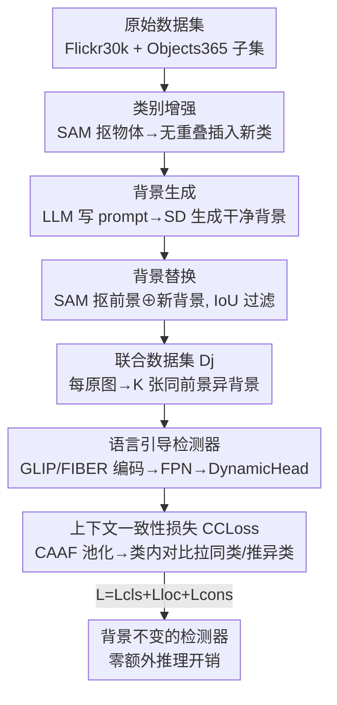

# Consistency Beyond Contrast: Enhancing Open-Vocabulary Object Detection Robustness via Contextual Consistency Learning

**会议**: CVPR 2026  
**论文**: [CVF Open Access](https://openaccess.thecvf.com/content/CVPR2026/html/Li_Consistency_Beyond_Contrast_Enhancing_Open-Vocabulary_Object_Detection_Robustness_via_Contextual_CVPR_2026_paper.html)  
**代码**: https://github.com/bozhao-li/CCL  
**领域**: 开放词表目标检测  
**关键词**: 开放词表检测, 上下文一致性, 数据生成, 背景鲁棒性, 跨模态对齐  

## 一句话总结
本文发现开放词表检测器对同一物体在不同背景下会输出大幅漂移的特征（背景过拟合），提出 CCL 框架——用扩散模型批量造出"同物体换背景"的成对样本（CBDG），再用一个类内对比形式的一致性损失（CCLoss）强制同类特征对背景不变，在 OmniLabel 上提升 +16.3 AP、D3 上提升 +14.9 AP，且零额外推理开销、模型无关。

## 研究背景与动机
**领域现状**：开放词表目标检测（OVOD）以及更进一步的描述式目标检测（DOD / referring expression）近年的进展主要押在两条路上——把训练数据规模做大，以及用对比学习把语言模态和视觉模态对齐（GLIP、FIBER 这类语言引导检测器是代表）。这套"跨模态对比 + 海量数据"的范式已经把 zero-shot 识别能力推得很高。

**现有痛点**：作者指出这些方法几乎都只关注**模态之间**的对齐，却忽略了**单模态内部**的一致性。具体表现是：同一个物体一旦换了背景或环境，模型抽出的特征会发生显著漂移。作者做了个很直接的诊断实验——把 D3 数据集的每张图背景替换掉，构造出 D3-BC 测试集，结果 GLIP、FIBER 这些 baseline 的 AP 大幅掉点，说明它们其实**过拟合到了训练背景**，并没有真正学到"物体本身"的表征。

**核心矛盾**：跨模态对比损失只约束"图像-文本"配对关系，对"同一物体在不同场景下应该长得一样"这件事毫无约束。于是模型可以靠背景这种 spurious cue 走捷径，背景一变就失效——这是一个被现有评测掩盖的鲁棒性缺口。

**本文目标**：让检测器学到**对环境变化不变**的物体特征。这要解决两个子问题：(1) 现有数据集根本没有"同一物体 × 多种背景"的成对样本，无法提供一致性监督信号；(2) 缺一个能把这种成对结构转化成训练目标的损失。

**核心 idea**：用"造数据 + 一致性约束"补上这个缺口——先用 SAM + Stable Diffusion 合成"前景不变、背景多样"的成对图像，再用一个类内一致性损失把同类特征往类中心拉、把异类推开，强制模型忽略背景、聚焦前景语义。

## 方法详解
### 整体框架
CCL 把"内模态一致性"拆成两个互补但分工明确的部件。**CBDG（Contextual Bootstrapped Data Generation）**负责造数据：它不是普通的数据增强，而是专门构造"同一前景物体出现在不同背景下"的成对样本，产出联合数据集 $D_j$；这些成对样本只是定义了监督信号的结构，本身并不强制不变性。**CCLoss（Contextual Consistency Loss）**才是把这些成对视图"拧"成背景不变表征的训练目标。一句话概括分工：CBDG 提供数据结构，CCLoss 把它转成一致性感知的学习。

整条管线接在一个现成的语言引导检测器（GLIP 或 FIBER）之上做后训练（post-training），只微调 1 个 epoch，推理阶段完全不增加任何模块或开销——CCLoss 只在训练时生效。

> 图中"类别增强 / 背景生成 / 背景替换"三个框共同构成 **CBDG**（关键设计 1 的三个子步），"CCLoss"框对应关键设计 2。

### 关键设计

**1. CBDG：用扩散模型批量造"同物体换背景"的成对样本**

痛点很直接——CCL 需要"同一物体在不同背景"的监督，但现有数据集没有这种配对，必须自己造。CBDG 是一个三阶段流水线，刻意避开了 inpainting（图像修补）方案，因为 inpainting 常有边界模糊、背景仍残留前景特征的问题，难以做出真正干净的场景切换。

- **类别增强（Categorical Augmentation）**：作者用 Flickr30k Entities 加 Objects365 的一个子集做底料，这个子集多是"少数类别、多个实例"的图。对单物体图，用 SAM 抠出物体 $O_i$ 及其位置 $(x_o, y_o)$，然后从同子集其它类别里随机选物体 $O_{i\notin C}$，在候选位置集 $P=\{(x_1,y_1),\dots,(x_N,y_N)\}$ 里挑一个不与已有物体重叠的位置插进去：$(x_{o_k}, y_{o_k}) \in P\backslash(x_o, y_o),\ o_k \in O_{i\notin C}$。若图里大物体多、没空位，就把新物体缩到原来的 $1/\alpha$ 再试，重复到找到空位或超过尝试次数 $N_R$；实在放不下就换图。这一步把单物体图 $I$ 变成多类别图 $I'$，提升类别多样性。
- **背景生成（Background Generation）**：用 LLM $\mathcal{G}$ 生成三类背景文本 prompt（Seasonal / Sky / Natural Landscape，刻意选"视觉干净、语义中性"的背景以隔离背景变化对物体一致性的影响），再喂给 Stable Diffusion $\mathcal{D}$ 生成背景图：$b = \mathcal{D}(t'),\ t' = \mathcal{G}(t)$，其中 $t \in \{\text{Seasonal, Sky, Natural Landscape}\}$，所有 $b$ 构成背景库 $D_{bg}$。最终共 13,185 条描述、生成 144,654 张背景图。
- **背景替换（Background Replacement）**：给定 ground-truth bbox，用 SAM $\mathcal{S}$ 抠出前景，再随机配一张背景图合成：$I^* = \mathcal{S}(I', bbox) \oplus b,\ b \in D_{bg}$，$\oplus$ 表示前背景合成。为保证合成质量，会过滤掉 SAM mask 与 GT box 的 IoU 低于阈值的样本。每张原图生成 $K$ 张同前景异背景的图（$K$ 即训练 batch size），这组图正是后面一致性约束的输入。

为什么有效：它从根上补齐了"前景恒定、背景受控变化"的成对数据，且只用了 0.25M 图（远小于 baseline 的 0.8M），却把一致性监督做成了可学的形式。

**2. CCLoss：把同类特征往类中心拉，强制背景不变**

光有成对数据不会自动产生不变性，得有损失去"拧"。CCLoss 的思路是：在每个 batch 内，把"同前景、异背景"的图组织在一起，对**同类特征做类内对比**——同类向类中心聚拢、异类相互排开，从而逼模型关注前景语义、丢掉背景这种 spurious cue。

模型侧用语言引导检测器抽特征：图像和文本各自编码，图像特征过 FPN 做多尺度融合，再进 DynamicHead 预测候选区域。对图像特征，先池化得到 **CAAF（Context-Aware Aggregated Feature）** $f$，然后在 CAAF 上施加一致性损失。给定 batch 含 $C$ 类、每类 $K$ 张图，视觉模态损失是一个类中心对比形式：

$$\mathcal{L}_{\mathrm{I}} = -\frac{1}{CK}\sum_{c=1}^{C}\sum_{k=1}^{K}\log\frac{\exp(\mathrm{sim}(\mathbf{f}_{ck}, \mathbf{f}_c)/\tau)}{\sum_{c'=1}^{C}\sum_{k'=1}^{K}\exp(\mathrm{sim}(\mathbf{f}_{ck}, \mathbf{f}_{c'k'})/\tau)}$$

其中 $\mathbf{f}_{ck}$ 是第 $c$ 类第 $k$ 张图的特征，$\mathbf{f}_c$ 是该类 $K$ 个特征的均值（类中心），$\mathrm{sim}(\cdot,\cdot)$ 是余弦相似度，$\tau$ 是温度。分子把样本拉向自己的类中心，分母把它与所有样本推开——背景变了但同类前景应当聚在同一个中心，这就强制了背景不变。

文本模态损失 $\mathcal{L}_{\mathrm{T}}$ 形式对称（把 $\mathbf{f}$ 换成文本特征 $\mathbf{t}$，类中心换成文本特征均值 $\mathbf{t}_c$），但**是否启用取决于 baseline 架构**：FIBER 有图文 cross-modal 交互，文本损失能用上；GLIP 把图文独立处理，就把 $\lambda_T$ 设为 0 关掉文本项。一致性损失合成为 $\mathcal{L}_{\mathrm{cons}} = \lambda_T \cdot \mathcal{L}_T + \lambda_I \cdot \mathcal{L}_I$，再并入总损失 $\mathcal{L} = \mathcal{L}_{\mathrm{cls}} + \mathcal{L}_{\mathrm{loc}} + \mathcal{L}_{\mathrm{cons}}$（前两项沿用 GLIP 的分类/定位损失）。

为什么有效：和跨模态对比（图-文配对）不同，CCLoss 是**模态内**的类内一致性约束，正好补上了"同物体不同场景应该一致"这条之前没人管的监督；又因为它只在训练时作用于已有特征，推理零开销，且对 baseline 架构无侵入（GLIP/FIBER 都能即插即用）。

### 损失函数 / 训练策略
总目标 $\mathcal{L} = \mathcal{L}_{\mathrm{cls}} + \mathcal{L}_{\mathrm{loc}} + \mathcal{L}_{\mathrm{cons}}$，其中一致性项 $\mathcal{L}_{\mathrm{cons}} = \lambda_T \mathcal{L}_T + \lambda_I \mathcal{L}_I$。训练时每个 batch 按"同前景物体"分组，组内含同物体在 $K$ 种背景下的图（$K$ = batch size）。用 GLIP-T / FIBER-B 的公开预训练权重作起点，在联合数据集 $D_j$（0.25M 图）上仅微调 **1 个 epoch**。⚠️ $\lambda_T, \lambda_I, \tau, \alpha, N_R$ 等超参的具体取值在原文补充材料，正文未给，以原文为准。

## 实验关键数据

### 主实验
在两个描述式开放词表检测基准 OmniLabel 和 D3 上，把 CCL 接到 GLIP-T 和 FIBER-B 两个 baseline 上做后训练。CCL 仅用 0.25M 图（baseline 用 0.8M），却拿到 SOTA：

| Baseline | OmniLabel AP | D3 FULL | OmniLabel 提升 | D3 提升 |
|----------|-------------|---------|---------------|---------|
| GLIP-T | 19.3 | 19.1 | — | — |
| GLIP-T + ours | 32.2 | 30.0 | **+12.9** | **+10.9** |
| FIBER-B | 25.7 | 22.7 | — | — |
| FIBER-B + ours | **42.0** | **37.6** | **+16.3** | **+14.9** |

细分指标上，FIBER-B + ours 在 OmniLabel 的 AP-c（纯类别）44.1、AP-d（自由描述）39.2，在长描述 AP-dL 从 12.4 提到 32.3，说明对复杂语言描述的物体定位提升尤其大。

### 鲁棒性评测（核心论点的直接证据）
作者用 CBDG 给 D3 每张图换 3 种背景，造出 D3-BC（42,312 张，与训练数据无重叠），并按 COCO-C 协议加 4 种扰动（高斯噪声/对比度/饱和度/光照）造出 D3-C：

| 方法 | D3-BC FULL | D3-C FULL | D3-C mFULL | rFULL(%) |
|------|-----------|-----------|-----------|----------|
| GLIP-T | 16.8 | 19.1 | 13.6 | 71.2 |
| GLIP-T + ours | 29.6 | 30.0 | 21.7 | 72.3 |
| FIBER-B | 20.1 | 22.7 | 16.7 | 73.6 |
| FIBER-B + ours | 33.1 | 37.6 | 27.5 | 73.1 |

baseline 在 D3-BC 上相对原始 D3 大幅掉点（暴露背景过拟合），加 CCL 后掉点显著变小；同时在 D3-C 上绝对性能大幅领先而相对鲁棒性 rFULL 与 baseline 相当（71→72、73→73），说明背景鲁棒性是真的提升了，而非靠牺牲对其它域偏移的稳定性换来的。

### 消融实验
拆开 CBDG 与 CCLoss 的贡献（"+data"= 只用 CBDG 造数据不加 CCLoss，"+ours"= 两者都上）：

| 配置 | OmniLabel AP | D3 FULL | 说明 |
|------|-------------|---------|------|
| GLIP-T | 19.3 | 19.1 | baseline |
| GLIP-T +data | 24.8 | 23.2 | 仅 CBDG，+5.5 AP |
| GLIP-T +ours | 32.2 | 30.0 | +CCLoss 再 +7.4 AP |
| FIBER-B | 25.7 | 22.7 | baseline |
| FIBER-B +data | 32.7 | 29.1 | 仅 CBDG，+7.0 AP |
| FIBER-B +ours | 42.0 | 37.6 | +CCLoss 再 +9.3 AP |

### 关键发现
- **两个部件都不可或缺，且 CCLoss 贡献更大**：仅靠 CBDG 造数据就能涨 5.5~7.0 AP，但加上 CCLoss 还能再涨 7.4~9.3 AP——说明"造对数据"只完成一半，真正把不变性学进去靠的是一致性损失。
- **背景鲁棒性是真实增益**：baseline 在 D3-BC 上掉得多、CCL 掉得少，直接验证了"背景过拟合"假设和 CCL 的针对性。
- **数据效率高**：用不到 baseline 1/3 的数据反超 SOTA，侧面印证收益来自"一致性"这个新监督维度而非堆数据。
- **模型无关**：在架构差异较大的 GLIP（图文独立）和 FIBER（图文交互）上都稳定涨点，且 GLIP 上即使关掉文本一致性项仍有大幅提升。

## 亮点与洞察
- **诊断驱动方法**：先用 D3-BC 这个"换背景"测试集把"背景过拟合"这个被忽视的问题量化暴露出来，再对症下药，整篇逻辑非常干净——problem 是自己测出来的，不是拍脑袋的。
- **CBDG 与 CCLoss 的分工讲得很清楚**：数据本身不产生不变性、损失才把成对结构转成不变表征。这个"数据提供结构、损失提供约束"的拆分值得借鉴到其它一致性/鲁棒性任务。
- **零推理开销 + 模型无关**：一致性损失只在训练生效，是个可以即插即用挂在任意语言引导检测器上的"后训练补丁"，工程上很友好。
- **可迁移思路**：用扩散模型造"前景恒定、某因素受控变化"的成对样本 + 类内一致性损失，这套路子可以迁到任何想消除某种 spurious correlation 的视觉任务（如消除纹理/光照/视角偏置）。

## 局限与展望
- **作者承认**：方法依赖 SAM 分割质量，mask 不准会在 CBDG 合成时引入 artifact；虽有后处理缓解，更"无瑕疵"的生成管线仍是 future work。
- **背景类型偏窄**：主实验只用了 Seasonal / Sky / Natural Landscape 三类"干净中性"背景，城市/室内/建筑等复杂场景放在补充材料，主结果对真实复杂背景的覆盖度有限。⚠️ 这是否会限制对真实世界杂乱场景的泛化，正文未充分讨论。
- **只微调 1 个 epoch**：增益是否随训练更久继续增长或饱和、CBDG 生成数据规模与性能的 scaling 关系，正文只在补充材料略提（Section B.7），主文没给曲线。
- **依赖现成 baseline**：方法是后训练补丁，性能上限仍受底座检测器约束，对从头训练的开放词表检测是否同样有效未验证。

## 相关工作与启发
- **vs 跨模态对比（GLIP / FIBER）**：它们做的是图-文模态间对齐，本文做的是视觉/文本模态内的类内一致性，二者正交——CCL 正是接在这些模型之上、补上它们缺的内模态约束，所以能稳定叠加涨点。
- **vs inpainting 式背景编辑（GLIDE / GLIGEN / IAM）**：这些方法在原图上修补背景，常有边界模糊、背景残留前景特征的问题；本文改用"抠前景 + 独立生成干净背景 + 合成"的方式，更彻底地把前背景分离，避免了这些 artifact。
- **vs 描述式检测 baseline（GN-GLIP / ROD-MLLM / Real-Model 等）**：这些方法靠架构改进或大模型能力提升描述理解，本文则从"数据 + 一致性损失"切入，用更少数据在 OmniLabel / D3 上反超它们，证明鲁棒性缺口是一个被低估的提升空间。

## 评分
- 新颖性: ⭐⭐⭐⭐ 把"内模态一致性"作为开放词表检测被忽视的鲁棒性维度单独拎出来，配套 CBDG+CCLoss，角度新且诊断扎实。
- 实验充分度: ⭐⭐⭐⭐ 两 baseline、两基准、专门构造的 D3-BC/D3-C 鲁棒性集 + 清晰消融，证据链完整；复杂背景与 scaling 主要放在补充材料略减分。
- 写作质量: ⭐⭐⭐⭐ 问题—方法—验证逻辑顺畅，CBDG/CCLoss 分工讲得清；公式排版在原始文本里偏乱但内容可还原。
- 价值: ⭐⭐⭐⭐ 零推理开销、模型无关的后训练补丁，工程落地性强，思路可迁移到其它去偏置任务。

<!-- RELATED:START -->

## 相关论文

- [\[CVPR 2026\] SRA-Det: Learning Omni-Grained Open-Vocabulary Detection Beyond Category Names](sra-det_learning_omni-grained_open-vocabulary_detection_beyond_category_names.md)
- [\[CVPR 2026\] Parameter-Efficient Semantic Augmentation for Enhancing Open-Vocabulary Object Detection](parameter-efficient_semantic_augmentation_for_enhancing_open-vocabulary_object_d.md)
- [\[CVPR 2026\] WeDetect: Fast Open-Vocabulary Object Detection as Retrieval](wedetect_fast_open-vocabulary_object_detection_as_retrieval.md)
- [\[CVPR 2026\] ViTPrompt: Training-Free Prompt Refinement with Visual Tokens for Open-Vocabulary Detection](vitprompt_training-free_prompt_refinement_with_visual_tokens_for_open-vocabulary.md)
- [\[CVPR 2026\] NoOVD: Novel Category Discovery and Embedding for Open-Vocabulary Object Detection](noovd_novel_category_discovery_and_embedding_for_open-vocabulary_object_detectio.md)

<!-- RELATED:END -->
