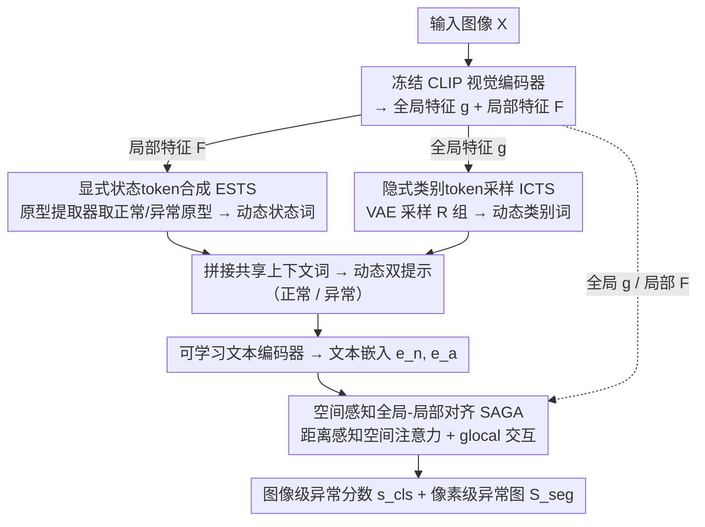

# CoPS: Conditional Prompt Synthesis for Zero-Shot Anomaly Detection

**会议**: CVPR 2026 Findings  
**arXiv**: [2508.03447](https://arxiv.org/abs/2508.03447)  
**代码**: [https://github.com/cqylunlun/CoPS](https://github.com/cqylunlun/CoPS)  
**领域**: 目标检测  
**关键词**: 零样本异常检测, 条件提示合成, CLIP, 视觉语言模型, 工业缺陷

## 一句话总结
本文提出 CoPS 框架，通过显式状态token合成（ESTS）和隐式类别token采样（ICTS）两种视觉条件化机制动态生成提示，配合空间感知对齐（SAGA），在13个工业和医学数据集上实现零样本异常检测SOTA。

## 研究背景与动机
1. **领域现状**：大规模预训练视觉-语言模型在零样本异常检测（ZSAD）中展现出良好的跨类别泛化能力。现有方法通过在单个辅助数据集上微调来实现跨类别异常检测。
2. **现有痛点**：（i）静态可学习token难以捕捉正常和异常状态的连续多样模式，限制了对未见类别的泛化；（ii）固定文本标签提供的类别信息过于稀疏，模型容易过拟合到特定语义子空间。
3. **核心矛盾**：提示学习消除了人工设计提示的需求，但其静态性和稀疏性成为泛化的瓶颈——正常/异常状态是连续多变的，而类别标签空间本身就是高度稀疏的。
4. **本文目标**：设计一种基于视觉特征条件化的动态提示合成框架，使提示能够自适应地建模输入图像的状态和类别信息。
5. **切入角度**：将提示分解为上下文词、状态词、类别词三部分，前者可共享，后两者需根据视觉特征动态生成。
6. **核心idea**：通过从局部特征提取正常/异常原型注入状态词（显式），通过VAE从全局特征采样注入类别词（隐式），实现视觉条件化的动态提示合成。

## 方法详解

### 整体框架
CoPS 的出发点是：现有提示学习把提示写死成「上下文词 + 静态状态词 + 固定类别标签」，状态词和类别词都不随输入图像变化，于是既抓不住连续多变的正常/异常模式，又被稀疏的类别标签束缚。CoPS 把这条提示拆成三段——上下文词全类共享，**状态词**和**类别词**则按当前图像的视觉特征现场合成。具体地，输入图像先过冻结的 CLIP 视觉编码器，得到全局特征 $\mathbf{g}$ 和局部特征 $\mathbf{F}$；ESTS 从局部特征 $\mathbf{F}$ 里抽正常/异常原型来填状态词（显式路径），ICTS 用 VAE 从全局特征 $\mathbf{g}$ 里采样来填类别词（隐式路径），两路合成的动态提示送进可学习文本编码器，再由 SAGA 把文本和图像在全局、像素两个层面对齐，最终输出图像级异常分数 $s_{\text{cls}}$ 和像素级异常图 $\mathcal{S}_{\text{seg}}$。

### 关键设计

**1. 显式状态token合成（ESTS）：让状态词跟着图像真实的正常/异常模式走**

像 "good"/"damaged" 这样写死的状态词只能表达离散的两极，没法刻画工业/医学图像里那种连续渐变的缺陷形态，换到未见类别上更是失效。ESTS 不再用静态可学习 token 去硬记状态，而是从当前图像的局部特征里现场提原型：先用一致性自注意力（V-V attention）从冻结视觉编码器里取出细粒度局部特征 $\mathbf{F}$（V-V 注意力让特征保持位置一致、不引入额外适配模块），再经原型提取器 $\mathcal{P}_\theta$ 在中心约束下生成 $M$ 个正常原型 $\mathbf{P}_n$ 和 $M$ 个异常原型 $\mathbf{P}_a$，把这些原型组装成动态状态 token 顶替掉原来的静态 token。由于原型直接来自这张图自己的局部响应，状态词就能自适应贴合当前图像的实际状态，泛化到训练时没见过的类别。

**2. 隐式类别token采样（ICTS）：用 VAE 采样把稀疏的类别标签撑成多样语义**

固定的文本类别标签信息太薄——一个词代表整个类，模型很容易过拟合到这个词所在的狭窄语义子空间。ICTS 改走隐式路径：用变分自编码器 $\mathcal{E}_\psi$ 对全局特征 $\mathbf{g}$ 的潜在分布做参数化，再从这个分布里解码采样出 $R$ 个样本 $\mathbf{S} \in \mathbb{R}^{R \times C}$ 当作密集的类别 token，于是每张输入图都生成 $R$ 组完整的正常/异常提示。采样的随机性天然扩增了类别表示的多样性，相当于在语义空间里围绕真实类别撒一圈点，逼着模型别死守单一子空间，跨域（工业→医学）时尤其受益。

**3. 空间感知全局-局部对齐（SAGA）：把「离最近原型多远」变成像素级对齐的依据**

标准的全局对齐只看整图相似度，丢掉了局部空间信息，而异常检测本质上要精确定位缺陷长在哪。SAGA 的关键观察是：一个查询特征离它最近的（正常）原型越远，就越可能是异常，因此用这个距离来近似异常状态，并据此构造距离感知的空间注意力去细化像素级的文本-图像对齐；同时再叠一层全局-局部（glocal）相似性交互来加强图像级对齐。两个层面分别产出像素级异常图 $\mathcal{S}_{\text{seg}}$ 和图像级异常分数 $s_{\text{cls}}$。

### 损失函数 / 训练策略
图像级分类用二元焦点损失，像素级分割用 Dice 损失加二元交叉熵损失联合监督。整套模型只在单个辅助训练集（如 MVTec AD）上微调，测试时直接迁到未见类别，不做任何目标域适配。

## 实验关键数据

### 主实验

| 数据集 | 指标 | CoPS | 之前SOTA | 提升 |
|--------|------|------|----------|------|
| 13个数据集平均 | Cls AUROC | SOTA | - | +1.4% |
| 13个数据集平均 | Seg AUROC | SOTA | - | +1.9% |
| MVTec AD | Cls AUROC | 最优 | AnomalyCLIP等 | 显著提升 |
| VisA | Seg AUROC | 最优 | - | 明显优势 |

### 消融实验

| 配置 | 关键指标 | 说明 |
|------|---------|------|
| Full CoPS | 最优 | 完整模型 |
| w/o ESTS | 下降 | 去掉显式状态合成影响最大 |
| w/o ICTS | 下降 | 去掉隐式类别采样也有明显影响 |
| w/o SAGA | 下降 | 空间感知对齐对分割尤为重要 |
| 静态提示 baseline | 显著低于CoPS | 验证动态提示的必要性 |

### 关键发现
- ESTS贡献最大，说明自适应的状态建模是零样本异常检测的核心挑战。
- ICTS的VAE采样能有效缓解类别标签稀疏问题，尤其在跨域场景（工业→医学）中作用显著。
- 距离感知空间注意力对像素级分割质量提升明显，但对图像级分类影响较小。

## 亮点与洞察
- **提示分解的设计哲学**巧妙：上下文词共享+状态词显式注入+类别词隐式采样，各司其职。
- **VAE隐式扩增**是一个优雅的trick：用采样替代固定标签，自然地增加了类别表示的多样性。
- 一致性自注意力（V-V）的使用避免了额外适配模块的引入，保持了CLIP特征的原始语义。

## 局限与展望
- 依赖CLIP的预训练特征空间，对CLIP未覆盖的视觉域（如特殊工业场景）可能效果有限。
- 原型数量M和采样数量R需要手动调参。
- 未来可探索自适应确定原型数量，或引入更强的视觉基础模型替换CLIP。

## 相关工作与启发
- **vs AnomalyCLIP**: AnomalyCLIP使用静态可学习token，缺乏视觉条件化，本文通过显式/隐式注入克服了这一限制。
- **vs AdaCLIP**: AdaCLIP依赖手工设计的模板集，本文通过端到端学习消除了人工设计的需求。
- **vs VCP-CLIP**: VCP-CLIP直接将图像特征嵌入类别词，本文通过VAE采样提供了更丰富的语义多样性。

## 评分
- 新颖性: ⭐⭐⭐⭐ 显式+隐式双路径动态提示合成是新颖的组合
- 实验充分度: ⭐⭐⭐⭐⭐ 13个数据集全面验证，消融完整
- 写作质量: ⭐⭐⭐⭐ 结构清晰，方法讲解到位
- 价值: ⭐⭐⭐⭐ 零样本异常检测领域的实用进展

<!-- RELATED:START -->

## 相关论文

- [\[AAAI 2026\] PromptMoE: Generalizable Zero-Shot Anomaly Detection via Visually-Guided Prompt Mixing of Experts](../../AAAI2026/object_detection/promptmoe_generalizable_zero-shot_anomaly_detection_via_visually-guided_prompt_m.md)
- [\[CVPR 2026\] MoECLIP: Patch-Specialized Experts for Zero-shot Anomaly Detection](moeclip_patch-specialized_experts_for_zero-shot_anomaly_detection.md)
- [\[CVPR 2026\] From Attraction to Equilibrium: Physics-Inspired Semantic Gravitons for Zero-Shot Anomaly Detection](from_attraction_to_equilibrium_physics-inspired_semantic_gravitons_for_zero-shot.md)
- [\[CVPR 2026\] GS-CLIP: Zero-shot 3D Anomaly Detection by Geometry-Aware Prompt and Synergistic View Representation Learning](gs-clip_zero-shot_3d_anomaly_detection_by_geometry-aware_prompt_and_synergistic_.md)
- [\[CVPR 2026\] FB-CLIP: Fine-Grained Zero-Shot Anomaly Detection with Foreground-Background Disentanglement](fb-clip_fine-grained_zero-shot_anomaly_detection_with_foreground-background_dise.md)

<!-- RELATED:END -->
