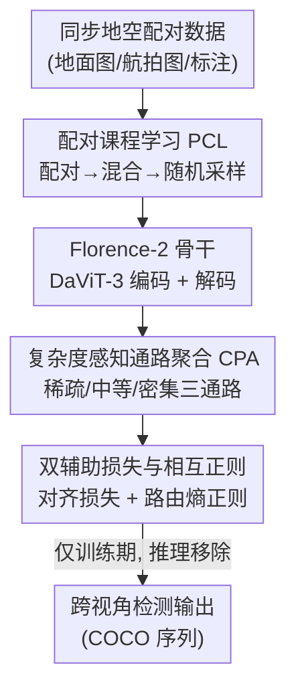

# CrossVL: Complexity-Aware Feature Routing and Paired Curriculum for Cross-View Vision-Language Detection

**会议**: CVPR 2026  
**arXiv**: [2605.09802](https://arxiv.org/abs/2605.09802)  
**代码**: https://github.com/1nyourlife/Crossvl_cvpr2026 (有)  
**领域**: 目标检测 / 多模态VLM / 跨视角检测  
**关键词**: 跨视角检测、视觉语言模型、复杂度感知路由、课程学习、地空配对

## 一句话总结
针对视觉语言模型（VLM）在地面视角强、航拍视角弱的"跨视角鸿沟"，CrossVL 用一个**只在训练期生效、零推理开销**的复杂度感知通路聚合模块（CPA）按场景稀疏/密集程度路由视觉特征，再配一套**从配对采样渐变到随机采样**的课程学习（PCL）稳住优化，把 Florence-2 在 MAVREC 航拍 mAP 从 58.66% 提到 61.03%、地空差距从 8.63pp 缩到 6.65pp，并把跨随机种子的方差降了 3.3×。

## 研究背景与动机
**领域现状**：VLM（GLIP / GroundingDINO / Florence-2 等）靠大规模图文预训练把开放词表检测做强，文本引导让"按指令找物体"成为可能。但这些模型默认成像几何是一致的。

**现有痛点**：一旦从地面视角换到航拍视角，同一套训练协议下 VLM 的航拍精度会**系统性地、持续地**掉档。论文用 MAVREC 的同步地空配对图揭示了根因：地面图里物体**少、大、密集且高度遮挡**，航拍图里物体**多、小、稀疏、全局铺开**——两个视角在尺度、布局、遮挡上同时变化，是**几何差异**而非外观差异（不像合成→真实、白天→黑夜那样保留几何）。

**核心矛盾**：这种几何差异造成了一个"复杂度失衡"——地面密集场景需要细粒度处理物体交互，航拍稀疏场景需要全局上下文推理。但传统 VLM 融合机制**对所有场景一视同仁地用同一套处理**，导致表示次优、训练不稳（不同随机种子方差大）。同时，MAVREC 这类数据集自带的**同步地空配对结构**被现有方法当成两个独立样本，白白浪费了一个可用的监督信号。

**本文目标**：(1) 让特征处理能随场景复杂度自适应；(2) 利用配对结构稳住优化、缩小地空差距；(3) 不增加任何推理成本。

**切入角度**：既然瓶颈来自几何/复杂度，那就**显式估计场景复杂度并据此路由特征**；既然配对图共享天气/光照/时间/场景语义（即便空间不重叠），那就**先用配对的强语义一致性给早期训练当锚点，再慢慢放手到随机采样**。

**核心 idea**：用"复杂度感知的多通路路由（架构侧）"+"配对到随机的课程调度（训练侧）"协同适配跨视角检测，且两者**互为正则**——CPA 防止课程崩溃、课程提升 CPA 表示丰富度。

## 方法详解

### 整体框架
CrossVL 以 Florence-2-base（DaViT-3 编码器 + Transformer 解码器，提示词为 `<OD>`）为骨干，在**训练期**叠加两个互补组件。CPA 接在编码/解码中间特征上：先从视觉+文本统计量估计一个三维复杂度向量，把视觉特征同时送进稀疏/中等/密集三条通路，再按复杂度条件融合，并提供一个辅助对齐目标。PCL 则在数据层面排课：早期只喂同步地空配对样本（语义一致、监督稳），中期线性混入随机样本，后期纯随机采样逼模型做跨视角泛化。推理时 CPA 整块移除，走标准 Florence-2 解码 + COCO 评测，**零额外延迟**。

### 关键设计

**1. 复杂度感知通路聚合 CPA：让特征处理随场景稀疏/密集自适应**

针对"地面密集要细粒度、航拍稀疏要全局，VLM 却一视同仁"这个痛点，CPA 先用一个两层 ReLU MLP $g_\phi$ 从多模态统计量算出一个软复杂度向量：$\mathbf{c}=\mathrm{Softmax}(g_\phi([\mu(\mathbf{V}),\sigma(\mathbf{V}),\max(\mathbf{V}),\mu(\mathbf{T}),\sigma(\mathbf{T})]))\in\mathbb{R}^3$，三维分别对应稀疏/中等/密集三种复杂度区间。直觉是：视觉特征方差 $\sigma(\mathbf{V})$ 高往往意味着密集遮挡的地面场景，低方差对应空间孤立的航拍布局，文本统计量 $\mu(\mathbf{T}),\sigma(\mathbf{T})$ 补充语义复杂度线索。视觉特征随后被并行送进三条各有归纳偏置的通路：**稀疏通路**用注意力 $A_s(\mathbf{V})=\mathrm{Softmax}(Q_sK_s^T/\sqrt{d})$ 做显著 token 筛选（适合空间孤立的航拍）；**中等通路**把特征图切成固定区域做自适应池化 + 跨区域 cross-attention，抓中程依赖（适合地面）；**密集通路**用全自注意力 + 全局平均池化抓整体上下文（适合稠密交互）。三条通路输出再按一个门控融合：$\mathbf{V}_\mathrm{fused}=\sum_{p\in\{s,m,d\}}w_p\mathbf{V}_p$，权重 $\mathbf{w}=\mathrm{Softmax}(h_\psi([\mathbf{V}_s;\mathbf{V}_m;\mathbf{V}_d;\mathbf{c}]))$ **同时**由通路特征和复杂度向量条件化。之所以有效：路由权重在训练中会自发分化——航拍图稀疏通路占主导、地面图密集通路激活、中等通路平滑过渡（实验里密集通路得分与物体数相关 $r{=}0.986$，稀疏通路 $r{=}-0.988$，强证据它真的学到了复杂度梯度）。整块只加 2.5% 参数、且**仅训练期生效**

**2. 配对课程学习 PCL：把数据集自带的地空配对当早期监督锚点**

针对"配对结构被当独立样本浪费、跨视角直接硬训会不稳"的痛点，PCL 不去做物体级几何对应（地空空间不重叠也做不了），而是利用**场景级语义一致性**——同步配对共享天气/光照/时段/场景上下文，这本身就是稳定的语义锚。它按训练进度调度配对采样概率：$p_\text{pair}(t)=1$（$t\in[0,T_1)$，全配对）→ 线性衰减（$t\in[T_1,T_2)$，混合）→ $0$（$t\in[T_2,T]$，纯随机）。$T_1,T_2$ 经验上取总训练时长的约 1/3 和 2/3，给"建立跨视角关联"和"泛化适配"各留足阶段（敏感性分析显示 test mAP 波动 <2pp，对调度参数不敏感）。早期配对采样让模型先在语义一致的稳定信号上建立跨视角联系，后期随机采样再逼它泛化，避免一上来就被剧烈视角变化打乱优化节奏

**3. 双辅助损失与相互正则化：让架构和训练两个组件互相兜底**

CPA 靠两个轻量目标和 VLM 解码器联合训练：辅助视觉-语言对齐损失 $\mathcal{L}_\text{align}=\|\mathbf{V}_\text{fused}-\mathbf{T}_\text{aligned}\|_2^2$ 把融合视觉特征和文本嵌入拉到一致，提供对视角噪声不敏感的稳定信号；路由熵正则 $\mathcal{L}_\text{reg}=-\sum_p w_p\log w_p$ 鼓励**自信、非均匀**的通路选择，防止塌缩到单一通路。更关键的是 CPA 与 PCL 之间的**相互正则**：早期配对训练给 CPA 喂稳定的复杂度分布，让通路聚合不被优化噪声干扰；反过来 CPA 学到的复杂度表示又防止课程的渐进调度引发优化崩溃。实验里这点被坐实——课程单用时种子 123 灾难性掉到 49.77% mAP，加上 CPA 后回升到 62.34%，正是这种互补让组合方法拿到超加性（super-additive）增益

### 损失函数 / 训练策略
总目标 = 检测主损失 + $\mathcal{L}_\text{align}$（对齐）+ $\mathcal{L}_\text{reg}$（路由熵）。骨干 Florence-2-base（230M），batch size 8 + 梯度累积 2（等效 16），AdamW，学习率 $1\times10^{-6}$，weight decay 0.01，500 步 warmup + cosine 调度，FP16，单张 RTX 5090，训练 10 epoch。每个种子（42/123/789）独立训练，**仅按验证集 mAP 选 checkpoint**（严格 val-only、不碰测试集），报 3 种子均值与方差。

## 实验关键数据

### 主实验
数据集 MAVREC：8,605 对训练、538 对验证、1,614 对测试同步地空配对，10 类，航拍高度 25–45m。下表为航拍验证/测试集 mAP（3 种子均值）：

| 方法 | 验证 mAP | 测试 mAP | 测试 mAPM(中等物体) | 说明 |
|------|---------|---------|---------|------|
| YOLOv7（视觉最强基线） | 31.3 | 31.9 | 63.1 | 纯视觉 |
| Florence-2 (random) | 63.73 | 58.66 | 79.81 | VLM 基线 |
| + CPA | 64.49 (+0.76) | 60.66 (+2.00) | 85.69 | ±1.09 std，稳 |
| + Curriculum | 64.37 (+0.64) | 56.53 (−2.13) | 81.20 | ±4.97 std，不稳 |
| + Both (CrossVL) | **65.35 (+1.62)** | **61.03 (+2.37)** | 83.24 | ±1.50 std |

VLM 基线就已经把视觉最强基线 YOLOv7 翻倍有余；LoRA(r=16) 微调只有 24.17% 测试 mAP，远低于全量微调，说明跨视角几何鸿沟需要充分参数更新才能学到。组合方法验证集增益 +1.62pp **超过两组件单独之和**（+0.76 + +0.64 = +1.40），呈超加性协同。

### 消融实验
通路架构消融（航拍集，3 种子均值）：

| 配置 | 验证 mAP | 测试 mAP | 测试 mAPM | 说明 |
|------|---------|---------|----------|------|
| Baseline | 63.73 | 58.66 | 79.81 | Florence-2 |
| 单通路变体 | 64.68 | 60.09 | 68.65 | 只 1 条线性通路 + aligner，无复杂度路由 |
| Full CPA(三通路) | 64.49 | 60.66 | **85.69** | 多通路 + 复杂度路由 |

跨视角鲁棒性（Gap = 地面 − 航拍，越小越好）：

| 方法 | 验证 Gap↓ | 测试 Gap↓ |
|------|----------|----------|
| Baseline | 5.71 | 8.63 |
| + CPA | 6.42 | 9.30 |
| + Curriculum | 6.09 | 12.59 |
| + Both | **3.73** | **6.65** |

### 关键发现
- **CPA 主要吃中等物体**：测试 mAPM 85.69%，比基线 +5.88pp、比单通路变体猛涨 +17.04pp（68.65→85.69），说明多粒度路由对"视角引致的尺度变化"至关重要；小物体 mAPS 在各变体间稳定（59.51–59.69），靠的是共享对齐机制而非通路多样性。
- **课程单用会灾难性崩溃**：种子 123 掉到 49.77%（比最好种子 61.59% 低 11.81pp），方差 ±4.97；CPA 单用很稳（±1.09，+2.00pp 均值增益）。组合后种子 123 回升到 62.34%，方差降到 ±1.50，相对课程单用降 3.3×。
- **路由确实响应复杂度**：在物体数 14–179 的场景上，密集通路得分与物体数正相关 $r{=}0.986$、稀疏通路负相关 $r{=}-0.988$（均 $p<0.001$），证明 CPA 抓住了从稀疏航拍到密集地面的复杂度梯度。
- ⚠️ 单组件对 Gap 不一定有利：CPA/课程单用反而把测试 Gap 拉大（9.30 / 12.59），只有两者协同才同时拉高航拍精度并缩小 Gap，体现的是"协同"而非简单叠加。

## 亮点与洞察
- **零推理开销的训练期增强**：CPA 只加 2.5% 参数、推理时整块拿掉，对实时/资源受限部署友好——这是"训练时变重、推理时还原"的典型 trick，可迁移到任何不想动推理图的微调场景。
- **把"数据集自带配对"变成免费监督**：不做物体级对应（跨视角根本对不上），只用场景级语义一致性当早期锚点，绕开了几何对齐的死结，对一切"有配对但无空间重叠"的数据都成立。
- **最"啊哈"的是相互正则**：两个单独都平平甚至有害（课程会崩）的组件，组合后产生超加性增益且方差降 3.3×——架构稳住训练、训练丰富架构，互为兜底。这提示"架构创新 + 训练创新"要协同设计，而非各自孤立。
- **可迁移**：复杂度向量条件化门控（用统计量 $\mu/\sigma/\max$ 估复杂度再路由）这套机制，可移植到任何存在"场景难度分布不均"的多通路/MoE 融合任务。

## 局限与展望
- 作者承认课程学习**单独使用时本质不稳**，对初始化敏感（某些种子直接灾难性失败），组合框架只是缓解而非根治，更鲁棒的课程调度值得研究。
- 复杂度估计只用了简单统计特征（均值/方差/最大值），在"特征方差由非几何因素驱动"的场景（极端光照、传感器噪声而非物体密度）可能失效。
- 自己看：整体绝对增益偏温和（航拍测试 +2.37pp），且只在 MAVREC 单一数据集、单骨干（Florence-2-base）上验证；跨视角泛化能力是否依赖该数据集特性尚不清楚。三个种子的统计也偏小样本。
- 改进思路：引入空间结构感知的复杂度指标；把方法推广到卫星-街景、室内-室外等其他跨视角设定；探索更稳的课程调度（如自适应 $T_1,T_2$ 或带回退机制）。

## 相关工作与启发
- **vs 多视角/跨视角感知（几何一致性、跨视角匹配）**：早期多视角学习假设标定相机有视野重叠、跨视角匹配做定位/检索；本文针对**有时间同步但无几何重叠**的地空检测，且显式建模地空复杂度失衡，是实例级检测而非识别/检索。
- **vs VLM 检测（GLIP / GroundingDINO / MDETR / Florence-2）**：这些模型假设成像几何一致、缺乏处理布局/密度结构变化的机制；CrossVL 加的是**训练期轻量模块**，不改 VLM 设计、不动推理成本。
- **vs 自适应融合/动态路由（MoE、动态卷积、token 选择）**：它们按内容自适应计算，但没针对跨视角几何差异；CPA 专门按场景复杂度在"稠密 vs 稀疏"两种几何区间路由。
- **vs 课程学习/配对监督（难例挖掘、loss 重加权、立体/视频视图合成一致性）**：先前跨视角检测没利用同步地空配对的语义一致性；PCL 把"无几何对应的时间配对"当成互补训练信号。

## 评分
- 新颖性: ⭐⭐⭐⭐ 复杂度感知路由 + 配对课程的"架构×训练"协同切入跨视角鸿沟，角度新但每个组件单看较常规
- 实验充分度: ⭐⭐⭐ 严格 val-only 多种子协议很扎实、消融+路由相关性分析到位，但只 MAVREC 单数据集、单骨干、3 种子
- 写作质量: ⭐⭐⭐⭐ 动机（几何 vs 外观差异）讲得清楚、相互正则的故事完整、图表自洽
- 价值: ⭐⭐⭐⭐ 零推理开销 + 缩小地空差距对航拍部署实用，相互正则的洞察有启发性

<!-- RELATED:START -->

## 相关论文

- [\[CVPR 2026\] LocateAnything3D: Vision-Language 3D Detection with Chain-of-Sight](locateanything3d_vision-language_3d_detection_with_chain-of-sight.md)
- [\[CVPR 2026\] Can a Second-View Image Be a Language? Geometric and Semantic Cross-Modal Reasoning for X-ray Prohibited Item Detection](can_a_second-view_image_be_a_language_geometric_and_semantic_cross-modal_reasoni.md)
- [\[CVPR 2026\] Mining Instance-Centric Vision-Language Contexts for Human-Object Interaction Detection](mining_instance-centric_vision-language_contexts_for_human-object_interaction_de.md)
- [\[CVPR 2026\] Incremental Object Detection via Future-Aware Decoupled Cross-Head Distillation](incremental_object_detection_via_future-aware_decoupled_cross-head_distillation.md)
- [\[CVPR 2026\] Saliency-R1: Enforcing Interpretable and Faithful Vision-language Reasoning via Saliency-map Alignment Reward](saliency-r1_enforcing_interpretable_and_faithful_vision-language_reasoning_via_s.md)

<!-- RELATED:END -->
