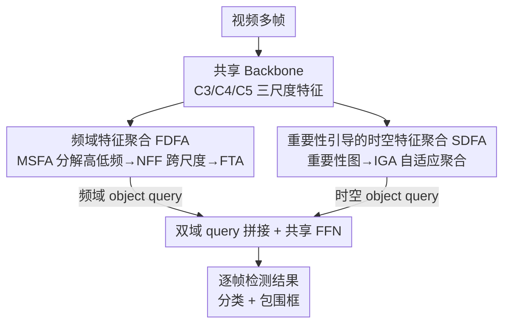

# D2FANet: Enhancing Video Object Detection with Dual-Domain Feature Aggregation Network

**会议**: CVPR 2026  
**论文**: [CVF Open Access](https://openaccess.thecvf.com/content/CVPR2026/html/Qi_D2FANet_Enhancing_Video_Object_Detection_with_Dual-Domain_Feature_Aggregation_Network_CVPR_2026_paper.html)  
**代码**: 无（论文未公开）  
**领域**: 视频理解 / 目标检测  
**关键词**: 视频目标检测, 频域特征聚合, 重要性引导, Deformable DETR, 时空建模  

## 一句话总结
D2FANet 第一次把**频域特征聚合**引入视频目标检测，用一条频域分支（八度卷积分解高低频 + 跨尺度邻域融合 + 频域时序注意力）和一条时空分支（重要性图引导的自适应 token 聚合）分别强化 object query，再拼接送进检测头，在 ImageNet VID 上以 Swin-Base 达到 91.8% mAP 且推理最快。

## 研究背景与动机

**领域现状**：视频目标检测的主流做法是「特征聚合」——把相邻帧的特征跨帧聚合到当前帧，以缓解运动模糊、遮挡、形变带来的单帧检测不稳定。近年的代表工作要么用 Faster R-CNN/SSD 配长程特征复用（如 DNFM、MSTF），要么用 Transformer 跨帧做全局注意力融合 object query（如 TransVOD、TGBFormer）。

**现有痛点**：作者指出这些方法有两个共性缺陷。其一，**聚合只发生在时空域**——只用空间位置 + 时间维度的特征，没法捕捉频域里那些刻画周期性运动、物体边界细节、全局轮廓的信息。其二，**对所有区域一视同仁地聚合**——不区分前景显著区和背景冗余区，既可能在重要区域丢失/混淆信息，又在背景区域聚合了大量冗余的简单语义，平白增加算力。

**核心矛盾**：时空域特征本身信息维度不全（缺频域视角），而无差别聚合又让「保细节」和「省算力」无法兼顾。频域分析告诉我们：高频特征对应前景/背景边界等快速变化的细节，低频特征对应缓慢变化的整体轮廓布局——两者互补，对检测都有用，却被以往方法整体忽略。

**本文目标**：(1) 把频域聚合补进视频目标检测，与时空聚合协同建模；(2) 让时空聚合按区域重要性自适应分配，重要区域多保细节、背景区域多压冗余。

**切入角度**：既然帧特征可以沿通道维分解成高/低频两个分布，而不同 token 又天然有重要性差异，那就分别设计两条互补分支——频域分支补全细节与全局运动线索，时空分支按重要性聚合——最后拼到一起喂检测头。

**核心 idea**：用「频域聚合 + 重要性引导的时空聚合」双域协同，替代「单一时空域 + 无差别聚合」，分别增强两套 object query 后拼接送检测头。

## 方法详解

### 整体框架

D2FANet 输入一段视频的多帧、输出所有帧的检测结果。每帧先经**共享 backbone**（ResNet-101 / ResNeXt-101 / Swin-Base）抽取 C3、C4、C5 三个尺度的帧特征 $f^i_m \in \mathbb{R}^{c_i\times h_i\times w_i}$，并基于 Deformable DETR 为每帧生成一组 vanilla object query $Q_m\in\mathbb{R}^{N\times D}$。

接着三尺度帧特征同时流入两条并行分支：**频域特征聚合（FDFA）**把帧特征分解成高/低频分布、跨尺度融合后用频域时序注意力刷新 query，产出**频域 object query**；**时空域特征聚合（SDFA）**先从帧特征生成重要性图，再做重要性引导的自适应聚合，产出**时空 object query**。两套 query 拼接（concat）后送进一个**共享 FFN 检测头**，输出每个目标的分类置信度和包围框。

### 关键设计

**1. 频域特征聚合 FDFA：把高/低频信息补进 object query**

这一支针对「只在时空域聚合、丢掉频域细节与全局运动」的痛点。它内部串了三个块。首先是**多尺度频率聚合块 MSFA**：用一个通道分配比例 $\alpha$ 把帧特征沿通道维拆成高频 $f^{i,H}_m\in\mathbb{R}^{(1-\alpha)c\times h\times w}$ 和低频 $f^{i,L}_m\in\mathbb{R}^{\alpha c\times \frac h2\times\frac w2}$（低频空间分辨率减半），再用**八度卷积（octave convolution）**让高低频双向交互：

$$S^{i,H}_m = \mathcal{F}(f^{i,H}_m; W_{H\to H}) + \mathrm{Up}\big(\mathcal{F}(f^{i,L}_m; W_{L\to H}),\,2\big)$$

$$S^{i,L}_m = \mathcal{F}(f^{i,L}_m; W_{L\to L}) + \mathcal{F}\big(\mathrm{Pool}(f^{i,H}_m, 2); W_{H\to L}\big)$$

其中 $H\to H$、$L\to L$ 保留本频带，$H\to L$、$L\to H$ 做跨频带转换（高频要降采样、低频要升采样以对齐分辨率）。由于高/低频输出在空间上部分重叠、容易冗余或误导，作者再做一次对齐相加 $S^i_m=\mathrm{Resize}(S^{i,H}_m\oplus S^{i,L}_m)$。

得到三尺度频域特征后，**邻域频率融合块 NFF** 跨 C3/C4/C5 捕捉尺度间相关性：通过逐元素相乘 $\otimes$ 与上采样逐级耦合相邻尺度（$A=S^1_m\otimes \mathrm{Up}(S^2_m)$、$B=S^2_m\otimes\mathrm{Up}(S^3_m)$ 等），最后 $S_m=\mathrm{Concat}(\mathrm{Up}(C),D)$ 汇成一帧的融合频域特征。$S_m$ tokenize 成 $S'_m$ 后充当 key/value，经**频域时序注意力 FTA** 跨所有帧刷新 vanilla query：

$$Q'_m = \mathrm{Norm}\big(Q_m + \mathrm{FTA}(Q_m, \{S'_m\}_{m=1}^{M})\big)$$

FTA 把全部 $M$ 帧的频域线索自适应整合进 query，提升跨帧时序一致性，$Q'_m$ 即频域 object query。和以往「单尺度独立处理频域」的做法不同，这里强调高低频**双向交互 + 跨尺度邻域融合**，特征更判别。

**2. 重要性引导的时空特征聚合 SDFA：按区域重要性自适应聚合**

这一支针对「对所有区域无差别聚合」的痛点，目标是重要区域多保细节、背景区域多压冗余。它先算一张**重要性图** $E\in\mathbb{R}^T$（$T=h\times w$），初始化为均匀分布，再从帧特征 $x=f^3_m\in\mathbb{R}^{T\times C}$ 生成：token 特征经 MLP 得局部特征 $G^{local}$，对其做平均池化得全局特征 $G^{global}=\mathrm{Avgpool}(G^{local}, E)$，二者拼接后用 MLP + Sigmoid 预测每个 token 的重要性概率：

$$G_o = \mathrm{Concat}[G^{local}_o, G^{global}_o],\quad P_o = \sigma(\mathrm{MLP}(G_o))$$

重要性图随之逐步更新 $E\leftarrow E\odot P$（$\odot$ 为 Hadamard 积）。消融表明这种「局部 + 全局」混合线索比只用局部或只用全局都好（87.7% vs 86.9%/87.2%）。

随后帧特征与重要性图一起送进**重要性引导的 Transformer 编码器 IGTE**，其核心是**重要性引导聚合块 IGA**：它自适应控制 token 聚合率——信息区少合并以保细节、背景区多合并以去冗余。具体地，对重要性图升序排序后分成 $N$ 个区间 $E_1,\dots,E_N$（$E_N$ 最重要、$E_1$ 最次要），token 据此分组为 $x_1,\dots,x_N$，每组配不同聚合率 $R_n$（越重要 $R_n$ 越小）：

$$X_n = \mathrm{Aggre}(x_n, R_n),\quad X=\mathrm{Concat}(X_1,\dots,X_N)$$

聚合函数 $\mathrm{Aggre}$ 用全连接实现（输入维 $R$、输出维 1，即每 $R$ 个 token 合成 1 个）。为保持注意力后特征图尺寸不变，query 长度固定，只对 key/value 做 IGA：$k=\mathrm{IGA}(x,E,R)W_k,\ v=\mathrm{IGA}(x,E,R)W_v$。聚合后的 $X$ 再过标准时空 Transformer 解码器做 query-feature 交互，产出时空 object query。这样算力被更多分到信息区，背景区被高效压缩。

**3. 双域 query 拼接 + 共享 FFN 检测头：让两域协同**

频域 object query 与时空 object query 通过 concat 合并，兼顾频域带来的细节/全局运动线索和时空域带来的重要性引导语义，再送一个共享 FFN 当检测头，逐帧输出分类置信度与包围框。消融显示两域单独加都有效（FDFA 把 baseline 从 78.5% 抬到 85.8%、SDFA 抬到 86.4%），合在一起达到 87.7%，二者互补协同。⚠️ 论文没有给出比简单 concat 更复杂的融合策略，作者在局限里也承认「融合机制有限」。

### 损失函数 / 训练策略
以 Deformable DETR 为 baseline，用 AdamW（weight decay $10^{-4}$）优化；学习率前 100K 步 $2\times10^{-4}$、后 40K 步降到 $2\times10^{-5}$。Transformer 用 Xavier 初始化，backbone 用 ImageNet 预训练。默认测试用 $M=20$ 帧、object query 数 100；训练帧统一做随机水平翻转、随机缩放，短边 ≥600、长边 ≤1000。4 张 24GB RTX-4090、batch size 4。

## 实验关键数据

### 主实验

ImageNet VID（mAP / 推理时延，与代表性方法对比，节选）：

| Backbone | 方法 | Base Detector | mAP (%) | Runtime (ms) |
|----------|------|---------------|---------|--------------|
| ResNet-101 | HyMATOD (2025) | Faster R-CNN | 86.7 | - |
| ResNet-101 | **D2FANet** | Deformable DETR | **87.7** | **24.6** |
| ResNeXt-101 | DGC-Net (2025) | Faster R-CNN | 87.3 | 191.5 |
| ResNeXt-101 | **D2FANet** | Deformable DETR | **88.7** | 38.5 |
| Swin-Base | STPN (2023) | SELSA | 90.6 | - |
| Swin-Base | TGBFormer (2025) | DETR | 90.3 | 49.7 |
| Swin-Base | **D2FANet** | Deformable DETR | **91.8** | 43.9 |

同一 backbone 下，D2FANet 在精度上全面领先，且 ResNet-101 配置时延最低（24.6 ms），Swin-Base 时延也优于多数对手。EPIC-KITCHENS（egocentric 厨房场景，多数对手需重跑）：

| 方法 | Backbone | mAP (%) | Runtime (ms) |
|------|----------|---------|--------------|
| CSMN | ResNet-101 | 42.7 | 917.4 |
| **D2FANet** | ResNet-101 | **44.5** | 28.5 |
| TransVOD | Swin-Base | 47.4 | 301.7 |
| **D2FANet** | Swin-Base | **50.0** | 48.9 |

### 消融实验

模块消融（ImageNet VID，ResNet-101 baseline 78.5%）：

| 配置 | FDFA | SDFA | mAP (%) | 说明 |
|------|------|------|---------|------|
| A | | | 78.5 | Deformable DETR baseline |
| B | ✓ | | 85.8 | 只加频域聚合，+7.3 |
| C | | ✓ | 86.4 | 只加时空聚合，+7.9 |
| D | ✓ | ✓ | **87.7** | 双域协同，最佳 |

通道比例 $\alpha$ 与重要性图配置：

| 维度 | 取值 / 配置 | mAP (%) | 备注 |
|------|-------------|---------|------|
| $\alpha$ | 0 / 0.25 / 1 | 86.4 / **87.7** / 86.2 | 0=无低频退化成普通卷积；过大稀释高频 |
| 重要性图 | Initial / Local / Global / Hybrid | 86.1 / 86.9 / 87.2 / **87.7** | 局部+全局混合最优 |
| Query 数 | 60 / 100 / 110 | 85.4 / **87.7** / 87.5 | 100 平衡精度与时延 |

### 关键发现
- **两个模块都很重，且贡献相当**：单加 FDFA +7.3、单加 SDFA +7.9，合起来 +9.2，说明频域和时空域确实互补而非冗余。
- **低频不能太多也不能没有**：$\alpha=0$（无低频）只有 86.4%，$\alpha=0.25$ 最优 87.7%，$\alpha=1$（全低频）掉到 86.2%——低频补全局轮廓、高频保边界细节，需要平衡。
- **重要性图要局部+全局并用**：纯局部缺全局上下文、纯全局漏局部细节，混合才能既强调信息区又压住背景噪声。
- **可视化**显示 D2FANet 在快速小目标（鸟、松鼠）和部分遮挡（斑马）下跨帧检测更稳定连贯，印证其增强了运动感知与时序一致性。

## 亮点与洞察
- **首次把频域聚合引入视频目标检测**：以往频域技术多用在分割/分类/伪装检测，作者把八度卷积式的高低频分解 + 跨尺度邻域融合搬到 VOD，并用频域时序注意力跨帧刷新 query，是一个清晰的「补维度」思路，可迁移到其他视频任务。
- **重要性引导的自适应 token 聚合**很实用：按区域重要性给不同聚合率，重要区少合并、背景区多合并——既保精度又省算力，这种「非均匀 token 压缩」思路可复用到任何 Transformer 视频/图像编码器里做加速。
- **精度-时延双赢**：在 ResNet-101 上既最高精度又最低时延，说明双域设计没有以牺牲速度为代价，工程上有吸引力。

## 局限与展望
- **作者承认的局限**：频域与时空域之间的融合机制有限（仅 concat），在某些挑战场景下两域优势没被充分挖掘；未来想做自适应融合实现更深的跨域交互。
- **自己发现的局限**：(1) 代码未公开，MSFA/NFF/IGA 多个超参（$\alpha$、区间数 $N$、各组聚合率 $R_n$）的设置细节和敏感性披露不全，复现门槛偏高；(2) 评测只在 ImageNet VID 和 EPIC-KITCHENS 两个数据集，且 EPIC 上多数对手是作者重跑的，横向公平性需谨慎看待；(3) NFF 的公式（式 4）在原文排版里部分括号/下标不完整，⚠️ 具体实现以原文与开源为准。
- **改进思路**：把简单 concat 换成可学习的门控/交叉注意力做双域融合；或让 $\alpha$、聚合率随帧内容自适应而非固定超参。

## 相关工作与启发
- **vs TransVOD / TGBFormer（时空 Transformer 类）**：他们在时空域用全局/局部注意力融合 query，本文额外开一条频域分支补细节与全局运动，并对时空聚合加重要性引导；同 Swin-Base 下 91.8% 高于 TGBFormer 90.3%、TransVOD Lite 90.1%。
- **vs 频域视觉方法（AFANet / DWAN / FMNet 等）**：它们把频域分解用于分割/分类/伪装检测的单帧任务，本文首次把高低频分解 + 邻域融合用于视频目标检测，并接入跨帧时序注意力。
- **vs 无差别聚合的特征聚合法（DNFM / MSTF / DGC-Net）**：本文的 SDFA 用重要性图驱动非均匀 token 聚合，重要区保细节、背景区压冗余，比一视同仁聚合更省算力也更判别。

## 评分
- 新颖性: ⭐⭐⭐⭐ 首次把频域特征聚合引入视频目标检测，双域协同 + 重要性引导是有辨识度的组合，但各组件（八度卷积、邻域融合、token 聚合）多为已有技术的迁移。
- 实验充分度: ⭐⭐⭐⭐ 三种 backbone、两数据集、四组消融较系统，但数据集偏少、EPIC 对手为重跑、代码未放。
- 写作质量: ⭐⭐⭐⭐ 动机清晰、公式较全，个别频域融合公式排版略乱。
- 价值: ⭐⭐⭐⭐ 精度-时延双赢且思路可迁移到其他视频任务，频域+非均匀 token 聚合两点都有复用价值。

<!-- RELATED:START -->

## 相关论文

- [\[CVPR 2026\] When Transformers Meet Mamba: A Hybrid Transformer-Mamba Network for Video Object Detection](when_transformers_meet_mamba_a_hybrid_transformer-mamba_network_for_video_object.md)
- [\[CVPR 2026\] BDNet: Bio-Inspired Dual-Backbone Small Object Detection Network](bdnetbio-inspired_dual-backbone_small_object_detection_network.md)
- [\[CVPR 2026\] Spike-driven Discrete Aggregation for Event-based Object Detection](spike-driven_discrete_aggregation_for_event-based_object_detection.md)
- [\[CVPR 2026\] Remedying Target-Domain Astigmatism for Cross-Domain Few-Shot Object Detection](remedying_target-domain_astigmatism_for_cross-domain_few-shot_object_detection.md)
- [\[CVPR 2026\] Parameter-Efficient Semantic Augmentation for Enhancing Open-Vocabulary Object Detection](parameter-efficient_semantic_augmentation_for_enhancing_open-vocabulary_object_d.md)

<!-- RELATED:END -->
