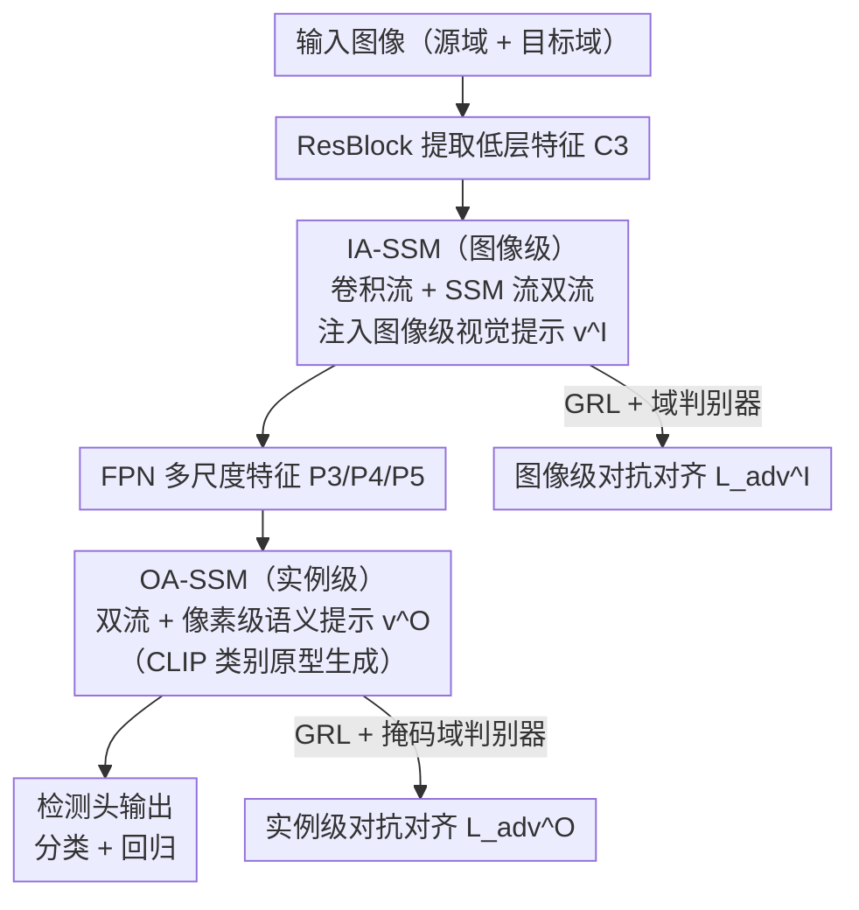

<!-- 由 src/gen_stubs.py 自动生成 -->
# DA-Mamba: Learning Domain-Aware State Space Model for Global-Local Alignment in Domain Adaptive Object Detection

**会议**: CVPR2026  
**arXiv**: [2603.18757](https://arxiv.org/abs/2603.18757)  
**代码**: 待确认  
**领域**: 目标检测  
**关键词**: 域自适应目标检测, 状态空间模型, Mamba, 全局-局部对齐, 特征对齐, CNN-SSM混合架构

## 一句话总结

提出 DA-Mamba，一种 CNN-SSM 混合架构，通过 Image-Aware SSM（IA-SSM）和 Object-Aware SSM（OA-SSM）两个模块，以线性复杂度实现图像级和实例级的全局-局部域不变特征对齐，在四个域自适应检测基准上达到 SOTA。

## 研究背景与动机

**域自适应目标检测（DAOD）** 旨在将标注源域的检测器迁移到无标注目标域，核心在于学习域不变特征表示。

**CNN 局部性瓶颈**：现有 CNN-based DAOD 方法的卷积局部连通性限制了对齐范围——backbone 仅在滑动窗口内提取局部特征，检测头也无法建模所有实例间的空间/语义依赖，导致 region-to-region 和 object-to-object 对齐都局限于局部区域。

**Transformer 复杂度过高**：已有工作引入 Vision Transformer 捕获全局依赖，但自注意力的二次复杂度带来大量计算和内存开销；一些卷积注意力变体要么依赖全局参数共享（忽略域偏置），要么仍隐含二次复杂度。

**实例间空间-语义关系被忽视**：物体存在稳定的共现模式（如 rider 与 bicycle），且语义上有层次关联（cat/dog 同为动物），忽略这些全局依赖会削弱域对齐效果。

**Mamba/SSM 机遇**：状态空间模型（SSM）具有线性时间复杂度的长程依赖建模能力，为 CNN 检测器注入全局域信息提供了高效方案。

**需要全局-局部联合对齐**：单纯的局部对齐或全局对齐都不够，需要同时在图像级和实例级进行多粒度的全局-局部特征对齐。

## 方法详解

### 整体框架

DA-Mamba 是一种 CNN-SSM 混合架构，基于 YOLO-World 检测器。输入图像经 ResBlock 提取低层特征 C3，进入 FPN 下采样流：每个分辨率特征上插入 IA-SSM 提取全局域信息；FPN 输出多尺度特征 P3/P4/P5 后，在检测头每层插入 OA-SSM 建模实例级依赖。两个模块的输出各自接一个带 GRL 的域判别器，分别在图像级和实例级做对抗对齐，使全局-局部特征域不可区分。

### 关键设计

**1. Image-Aware SSM（IA-SSM）：在图像级补上 CNN 缺的全局域感知**

CNN backbone 的卷积只在滑动窗口内看局部，图像级对齐被困在小范围里。IA-SSM 插在 backbone 的 FPN 中，用**双流管道**同时拿两种信息：卷积流提取局部域不变特征，SSM 流以线性复杂度捕获全局视觉属性。为了让两条流都"知道"当前是哪个域，引入可学习的**图像级视觉提示** $\mathbf{v}^I \in \mathbb{R}^C$，广播到所有空间位置后与输入特征拼接注入域信息；再用瓶颈结构（降维比 $r$）压掉冗余，最后把双流输出拼接、上采样恢复原始维度。这样既保住 CNN 的局部先验，又用 SSM 以远低于 Transformer 二次复杂度的代价补齐了全局对齐能力。

**2. Object-Aware SSM（OA-SSM）：把实例间的共现与语义层次关系建进检测头**

物体之间有稳定的共现（rider 配 bicycle）和语义层次（cat/dog 同属动物），忽略这些全局关系会削弱实例级对齐。OA-SSM 插在检测头里，同样走双流管道，但把提示做成**像素级实例级视觉提示** $\mathbf{v}^O \in \mathbb{R}^{B,C,H,W}$：先用卷积把输入特征映射成逐像素的类别相似度矩阵 $\mathbf{W} \in \mathbb{R}^{B,H,W,K}$，再与 CLIP 文本编码器生成的**类别原型** $\mathbf{E} \in \mathbb{R}^{K,C}$ 相乘，得到能把特征图切成语义一致实例区域的提示。借此 SSM 能对所有实例间的空间共现和语义层次做全局建模，把 VLM 的语义知识轻量地引进对齐过程。

### 损失函数

$$\mathcal{L} = \mathcal{L}_{cls}^S + \mathcal{L}_{cls}^T + \lambda^I \mathcal{L}_{adv}^I + \lambda^O \mathcal{L}_{adv}^O + \mathcal{L}_{reg}$$

- **图像级对抗损失** $\mathcal{L}_{adv}^I$：IA-SSM 输出接域判别器 + GRL，使图像级特征域不可区分。
- **实例级对抗损失** $\mathcal{L}_{adv}^O$：OA-SSM 输出接带实例掩码的域判别器（分类概率 > 0.5 的前景区域），聚焦前景实例间关系。
- 源域：分类交叉熵 + 回归损失；目标域：高置信度伪标签的分类损失。
- 超参数：$r=2.0, \lambda^I=1.0, \lambda^O=0.5$。

## 实验

### 主要结果

**Cross-Weather（Cityscapes → Foggy Cityscapes）**：

| 方法 | mAP | 对比 |
|------|-----|------|
| DA-Pro (NeurIPS'23) | 55.9 | 此前 SOTA |
| DT (CVPR'25) | 55.4 | — |
| DATR (TIP'24) | 53.4 | Transformer-based |
| Baseline (UDA) | 52.3 | — |
| **DA-Mamba** | **58.1** | **+2.2 vs SOTA, +5.8 vs baseline** |
| Oracle | 61.1 | 上界 |

**Cross-FoV（Cityscapes → BDD100K）**：DA-Mamba 48.7% mAP，超 SOTA DATR 5.4%。

**Cross-Style（Pascal VOC → Clipart）**：DA-Mamba 52.5% mAP，超 SOTA CAT 3.4%，仅低于 Oracle 1.3%。

**Cross-Style（Pascal VOC → Comic）**：DA-Mamba 43.8% mAP，超 SOTA D-adapt 3.3%。

### 消融实验

| 模块组合 | C→F | C→B | P→Clp | P→Cmc |
|----------|-----|-----|-------|-------|
| Baseline | 52.3 | 41.9 | 46.8 | 37.9 |
| +IA-SSM | 56.8(+4.5) | 45.9(+4.0) | 50.6(+3.8) | 40.5(+2.6) |
| +OA-SSM | 55.4(+3.1) | 45.0(+3.1) | 50.5(+3.7) | 40.6(+2.7) |
| +both | **58.1(+5.8)** | **48.7(+6.8)** | **52.5(+5.7)** | **43.8(+5.9)** |

### 关键发现

- **标准 Mamba vs DA-Mamba**：直接用 vanilla Mamba 替换仅提升 1.0~2.9%，而 DA-Mamba 提升 5.7~6.8%。原因在于标准 Mamba 采用域无关的状态更新策略，在域分布差异大时无法有效对齐。
- **计算效率极高**：DA-Mamba 仅 148G FLOPs（占 Transformer-based DATR 的 53.1%），14.1 FPS，推理内存仅 1307M（DATR 的 40.8%），同时 mAP 高出 4.7%。
- **双流管道和视觉提示缺一不可**：卷积流提供局部先验，SSM 流提供全局感知，视觉提示注入域/类别上下文，三者协同才达到最优。
- **IA-SSM 对高层特征更有效**（C5 +2.0% vs C3 +1.5%），因高层特征含更多语义信息。

## 亮点

- 首次将 Mamba/SSM 引入域自适应目标检测，以线性复杂度替代 Transformer 的二次复杂度实现全局建模
- 双模块设计（IA-SSM + OA-SSM）分别处理图像级和实例级对齐，正交互补，联合提升 5.7~6.8%
- OA-SSM 中利用 CLIP 类别原型生成像素级语义提示的设计巧妙，将 VLM 知识轻量融入检测头
- 计算开销极小（接近纯 CNN baseline），但性能超越 Transformer-based 和 VLM-based 方法
- 四个基准上全面 SOTA，Cross-FoV 和 Cross-Style 场景提升尤为显著

## 局限性

- 仅在单阶段检测器 YOLO-World 上验证，未验证在两阶段检测器（Faster R-CNN）或 DETR 系列上的通用性
- 类别原型依赖 CLIP 文本编码器，对 CLIP 未覆盖的细粒度类别可能效果受限
- 目标域仅使用伪标签进行半监督学习，伪标签质量对 OA-SSM 的实例掩码生成有直接影响
- 实验规模较小（batch size=2，单卡 V100），大规模数据集和多卡设置下的扩展性未知
- 插入位置的消融仅覆盖 FPN 各层，对不同 backbone（如 ResNet50/101）的兼容性未探讨
- 扫描方向选择（Mamba 的序列化策略）对二维图像特征的影响未深入分析
- 未与最新的 Mamba-2 等改进型 SSM 进行对比

## 相关工作

- **特征对齐系列**：DA-Faster → SWDA → SIGMA++ → CAT → REACT，从图像级到类别级再到实例级对齐，逐步细化对齐粒度
- **半监督学习系列**：AT、TDD 等通过伪标签或风格迁移减少域偏置，与特征对齐方法互补
- **Transformer-based DAOD**：DATR、MTM 通过自注意力获取全局依赖，但二次复杂度导致计算代价高（DATR 279G FLOPs）
- **VLM-based DAOD**：DA-Pro、DA-Ada 利用视觉语言模型的语义先验对齐域语义，但推理开销大
- **SSM/Mamba 在视觉中的应用**：VMamba（图像分类）、U-Mamba（医学分割），本文首次拓展到 DAOD

## 评分

- 新颖性: ⭐⭐⭐⭐ — 首个将 SSM 引入 DAOD 的工作，IA-SSM/OA-SSM 设计合理且有针对性
- 实验充分度: ⭐⭐⭐⭐ — 四个基准、详细消融（模块/管道/提示/插入位置/计算开销），缺少两阶段检测器验证
- 写作质量: ⭐⭐⭐⭐ — 动机清晰，方法描述完整，图表规范
- 价值: ⭐⭐⭐⭐ — 为 DAOD 提供了高效全局建模新范式，计算效率与精度的平衡优秀，实用价值高

<!-- RELATED:START -->

## 相关论文

- [\[CVPR 2026\] AKCMamba-YOLO: Selective State Space Models For Real-Time Object Detection](akcmamba-yolo_selective_state_space_models_for_real-time_object_detection.md)
- [\[CVPR 2026\] Expert-Teacher-Student Collaborative Learning for Domain Adaptive Object Detection](expert-teacher-student_collaborative_learning_for_domain_adaptive_object_detecti.md)
- [\[CVPR 2025\] Large Self-Supervised Models Bridge the Gap in Domain Adaptive Object Detection](../../CVPR2025/object_detection/large_self-supervised_models_bridge_the_gap_in_domain_adaptive_object_detection.md)
- [\[CVPR 2026\] Foundation Model Priors Enhance Object Focus in Feature Space for Source-Free Object Detection](foundation_model_priors_enhance_object_focus_in_feature_space_for_source-free_ob.md)
- [\[CVPR 2026\] Remedying Target-Domain Astigmatism for Cross-Domain Few-Shot Object Detection](remedying_target-domain_astigmatism_for_cross-domain_few-shot_object_detection.md)

<!-- RELATED:END -->
