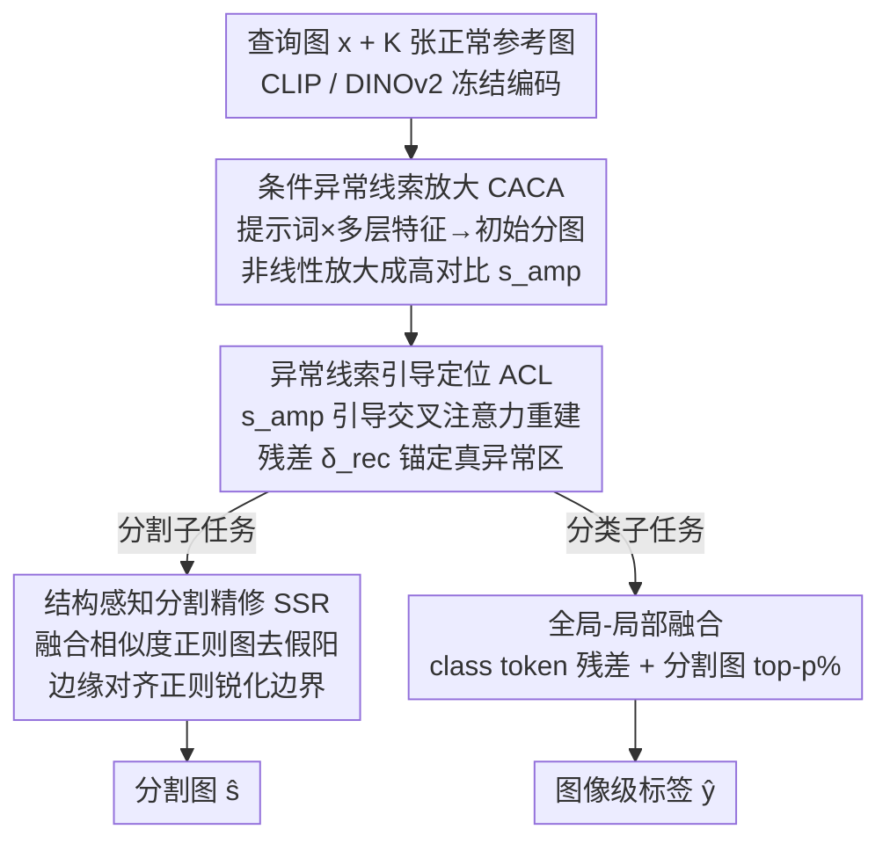

# Defect Cue-Preserved Structural Feature Refinement for Few-Shot Anomaly Detection

**会议**: CVPR 2026  
**论文**: [CVF Open Access](https://openaccess.thecvf.com/content/CVPR2026/html/Jiang_Defect_Cue-Preserved_Structural_Feature_Refinement_for_Few-Shot_Anomaly_Detection_CVPR_2026_paper.html)  
**代码**: 无  
**领域**: 异常检测 / 少样本工业质检  
**关键词**: 少样本异常检测, 缺陷线索衰减, 异常线索放大, 重建定位, 边缘对齐

## 一句话总结
本文指出少样本异常检测（FSAD）的核心难点在于细微缺陷线索在深层特征提取流水线里被逐层"稀释"掉，提出 DCP-SFR：先用可学习提示词把早期弱信号"放大"成高对比异常线索图，再用这张图引导重建式定位，最后做结构感知的边界精修，在 MVTec AD / VisA 上拿到图像级 97.3%、像素级 98.2% 的 AUROC。

## 研究背景与动机
**领域现状**：工业质检越来越依赖自动异常检测（AD）。传统 AD 需要大量标注的缺陷样本，而真实产线上缺陷稀少；少样本异常检测（FSAD）只用一小撮（1/2/4 张）正常参考图就能快速部署到新产品上，因此更实用。当前主流 FSAD 大致三类：① 重建式（如 FastRecon，学正常分布、靠重建残差判异常）；② 异常合成式（如 AnomalyDiffusion，用扩散模型造假缺陷扩充训练集）；③ 特征比对式（如 PatchCore、WinCLIP、AnomalyDINO，在 CLIP/DINOv2 的预训练嵌入空间里把查询特征和正常参考特征做相似度匹配算差异分）。

**现有痛点**：重建式受参考图太少限制，正常模式覆盖不全，复杂场景下误报多；合成式有合成缺陷与真实缺陷之间的域差，污染缺陷表示学习；特征比对式则把 FSAD 当成一次性、静态的"匹配问题"，用一套固定的特征表示算差异分。

**核心矛盾**：作者把异常检测难的根本原因归结为一个被以往工作忽视的现象——**缺陷线索衰减（defect cue fading）**：细微的、与缺陷相关的线索本来就微弱，在多阶段深层特征提取流水线里会被背景噪声逐步淹没、逐层丢失，表现为定位偏移和边界模糊。固定表示的匹配方法没有任何机制去对抗这种渐进式衰减。

**本文目标**：在整条流水线上"保住并强化"缺陷相关的结构信息，分解为三件事——早期把弱信号放大、定位阶段把注意力锚在真异常区不漂移、分割阶段把边界对齐做准。

**切入角度**：早期阶段的线索最关键（越往深越衰减），所以与其在末端硬算差异分，不如在前端就主动放大潜在异常信号，并让这个放大后的"异常线索图"作为动态引导贯穿后续每一步。

**核心 idea**：用一张"被放大的高对比异常线索图"动态引导整个检测过程——放大弱信号 → 用它引导重建定位 → 再做结构感知边界精修，对抗缺陷线索的渐进式衰减。

## 方法详解

### 整体框架
DCP-SFR 同时处理两个子任务：图像级分类（正常/异常）和像素级异常分割。输入是一张查询图 $x$ 和 $K$ 张正常参考图 $\{x'_k\}$，输出是图像级标签 $\hat{y}$ 和分割图 $\hat{s}$。骨干用两个冻结的预训练模型：CLIP（图像编码器 $E_I$ + 文本编码器 $E_T$）和 DINOv2（图像编码器 $E_D$），全程不微调骨干，只从头训练新增的少量模块。

整条流水线分三段串行：**CACA（条件异常线索放大）**先用多层 patch 特征 + 可学习提示词算出初始异常分图，再非线性放大成高对比线索图 $s_{amp}$；**ACL（异常线索引导定位）**拿 $s_{amp}$ 当空间引导，用堆叠交叉注意力把查询特征重建成"无异常版本"，靠原始与重建特征的残差 $\delta_{rec}$ 精确定位；**SSR（结构感知分割精修）**把 $\delta_{rec}$ 与一张相似度正则图融合去假阳，并施加边缘对齐正则把边界做锐。分割任务走 patch 特征（保留空间位置），分类任务走 class token（聚合全局上下文），两者共享 CACA+ACL 这个处理核心，分类侧再做全局-局部融合。

### 关键设计

**1. 条件异常线索放大 CACA：在早期就把快衰减的弱信号顶起来**

针对"线索越往深越被淹没"这个痛点，CACA 不在末端补救，而是从浅层就保留并放大缺陷信号。它从 CLIP 图像编码器的多个中间层（第 6/12/18/24 层，共 $m=4$ 层）抽 patch 特征 $f_{p,j}$，避免只用深层特征导致早期线索丢失。同时设计一对可学习提示词：$p_{normal}=[U_1]\dots[U_n]$ 和 $p_{anomaly}=[T_1]\dots[T_n][\text{damaged}]$——后者用单词 `[damaged]` 作语义锚，给模型一个"异常"的通用先验，而可学习向量 $[T_i]$ 负责适配具体任务里多样细微的缺陷模式。文本编码器把提示词映射成嵌入 $f_c=E_T(p_c)$，再与各层 patch 特征算相似度得到初始异常分图：

$$s_{init} = \frac{1}{m}\sum_{j=1}^{m}\frac{\exp(\langle f_{anomaly}, f_{p,j}\rangle/\tau)}{\sum_{c\in C}\exp(\langle f_c, f_{p,j}\rangle/\tau)}$$

其中 $\langle\cdot,\cdot\rangle$ 是余弦相似度、$\tau$ 是温度，多层结果取平均更鲁棒。关键在于随后的"放大"：用一个非线性变换 $A$ 把 $s_{init}$ 重塑成 $s_{amp}=\frac{1}{1+e^{-A(s_{init})}}$，$A$ 的作用是放大哪怕很微弱的异常响应、同时压低正常区的值，让异常与正常区的对比度被拉开。这张高对比图 $s_{amp}$ 就是后续模块的空间引导信号。

**2. 异常线索引导定位 ACL：用放大后的线索锚住真异常区、防止重建漂移**

放大只是"高亮"了潜在缺陷，还需要精确定位。ACL 的思路是用 $s_{amp}$ 引导一个重建过程：在正常参考特征的条件下，把查询特征重建成"无异常版本"，凡是重建不出来的地方就是缺陷。它用堆叠交叉注意力，以 DINOv2 的细粒度查询特征 $g_p$ 为 query、以 $K$ 张参考特征的均值 $\bar{g}'_p$ 为 key/value（提供稳定的正常模式参照）：

$$f^0_{rec} = \Upsilon(W^0_Q g_p,\, W^0_K \bar{g}'_p,\, W^0_V \bar{g}'_p)$$

随后送入 $N_r$ 层逐层精修，每层在进 query 前先用异常线索做空间调制 $\hat{f}^{(z-1)}_{rec}=f^{(z-1)}_{rec}\odot(1-s_{amp})$——$(1-s_{amp})$ 把异常线索标出的区域抑制掉，逼着当前层更依赖正常参考特征 $\bar{g}'_p$ 来重建。这正是"锚定"的关键：被标为异常的地方不让它照搬原特征，从而避免重建把异常也一并复刻、产生定位漂移。最终重建特征 $f^{N_r}_{rec}$ 与原特征算 L1 距离得到残差图 $\delta_{rec}=\|g_p-f^{N_r}_{rec}\|_1$，精确指出缺陷位置。PCA 可视化显示定位后正常特征会塌缩成原点附近的紧簇、异常特征仍散开，说明 ACL 学到了判别性特征空间。

**3. 结构感知分割精修 SSR：去假阳 + 把边界对齐做准**

残差图 $\delta_{rec}$ 还可能因正常纹理变化残留假阳、边界粗糙。SSR 做两件事。其一，用非参数相似度匹配过滤假阳：把所有参考图 patch 特征聚成记忆库 $M$，每个查询 token 取与库内最大余弦相似度 $\Psi(l)=\max_{t\in M}\langle g_p(l),t\rangle$，再取反得正则图 $s_{cos}=1-\Psi$（越像正常模式分越接近 0、被抑制）。分割图由两者加权融合：$\hat{s}=\delta_{rec}+\lambda s_{cos}$——$\delta_{rec}$ 灵敏（能召回所有潜在异常），$s_{cos}$ 精确（拒掉假阳），互补。其二，施加结构对齐正则提升轮廓保真度：用边缘提取器 $O(\cdot)$ 取预测和真值的边缘图 $\hat{s}_{edge}=O(\hat{s})$、$s_{edge}=O(s)$，用一个 Dice 形式的边缘一致性损失

$$L_C = \mathbb{E}_x\left[1-\frac{2\sum_i \hat{s}^{edge}_i s^{edge}_i + \zeta}{\sum_i(\hat{s}^{edge}_i)^2+\sum_i(s^{edge}_i)^2+\zeta}\right]$$

直接优化边缘对齐，$\zeta$ 防除零。消融里 SSR 还被发现能加快收敛、收敛到更优解。

### 损失函数 / 训练策略
分类侧做全局-局部融合：全局分由 class token 与提示词嵌入比对、再经一个重建 + 轻量适配器 $C$ 得到 $\hat{y}_{global}=C(\eta_{rec})$（$\eta_{rec}=\|g_{cls}-g''_{cls}\|_1$）；局部分由一个轻量网络 $\kappa(\cdot)$ 读分割图 $\hat{s}$ 预测采样比例 $p=\kappa(\hat{s})$，取 $\hat{s}$ 中 top-$p\%$ 像素的均值得 $\hat{y}_{local}$；最终 $\hat{y}=\hat{y}_{global}+\mu\hat{y}_{local}$。分类用交叉熵 $L_{CE}$。分割因异常区远小于正常区，用 focal $L_{Focal}$ + dice $L_{Dice}$ 组合。总目标：

$$\min_{\Theta}\; L_{CE} + L_{Focal} + L_{Dice} + \beta L_C$$

所有可训练组件从头训练，骨干冻结。提示词长度 12，训 25 epoch，batch 8，Adam，学习率 0.01；$\lambda=1.0,\ \mu=2.0,\ \alpha=0.9,\ \beta=2.0$。

## 实验关键数据

数据集：MVTec AD 与 VisA（共 27 类工业品，含像素级标注）。对比方法：WinCLIP+、APRIL-GAN、AnomalyGPT、PromptAD、InCTRL、AnomalyDINO。评测 1/2/4-shot 下的图像级（i-AUROC/i-AUPR/i-F1-max）与像素级（p-AUROC/p-PRO/p-F1-max/p-AP）指标。

### 主实验

下表摘取 1-shot 设置下的核心指标（粗体为本文最优，单位 %）：

| 数据集·任务 | 指标 | DCP-SFR | AnomalyDINO | PromptAD |
|------|------|------|------|------|
| MVTec AD 分类 | i-AUROC | **97.3** | 96.6 | 94.6 |
| MVTec AD 分割 | p-AUROC | **96.9** | 96.8 | 95.9 |
| MVTec AD 分割 | p-AP | **61.2** | 56.5 | 53.9 |
| VisA 分类 | i-AUROC | **92.0** | 87.4 | 86.9 |
| VisA 分割 | p-AUROC | **98.2** | 97.8 | 96.7 |

4-shot 设置下进一步提升：MVTec AD 达 i-AUROC 98.0 / p-AUROC 97.5；VisA 分割 p-F1-max 从 1-shot 的 44.9% 升到 4-shot 的 47.1%，说明模型能有效利用更多参考图。论文摘要给出的代表性结论是图像级 AUROC 97.3%、像素级 AUROC 98.2%（均为 1-shot 最优场景）。1-shot 下 MVTec AD 分割 AP 比 AnomalyDINO 高约 5 个点，体现极少参考下的鲁棒性。

### 消融实验

在 VisA 1-shot 下逐个去掉模块（单位 %）：

| 配置 | i-AUROC | p-AUROC | p-F1-max | p-AP | 说明 |
|------|------|------|------|------|------|
| DCP-SFR（完整） | 92.0 | 98.2 | 44.6 | 39.9 | 完整模型 |
| w/o CACA | 91.5 | 97.4 | 43.2 | 39.0 | 去线索放大，对小/低对比异常变弱 |
| w/o ACL | 89.7 | 96.7 | 41.3 | 37.7 | 掉点最多，定位与背景抑制能力大降 |
| w/o SSR | 91.1 | 97.1 | 41.0 | 35.0 | 边界/假阳变差，且收敛更慢 |

### 关键发现
- **ACL 贡献最大**：去掉它 p-AP 从 39.9% 掉到 37.7%、i-AUROC 从 92.0 掉到 89.7，是降幅最大的模块，印证"线索引导的重建定位"是精确定位与背景抑制的核心。PCA 图显示有无 ACL 时正常/异常特征是否可分差别明显。
- **CACA 主管"看清细微缺陷"**：去掉后 p-F1-max 从 44.6% 降到 43.2%，对小目标、低对比缺陷影响明显，特征可视化能看到它确实放大了细微异常、压住了背景噪声。
- **SSR 既提精度又提收敛**：去掉后 p-AUROC 从 98.2% 掉到 97.1%、p-AP 从 39.9% 掉到 35.0%（边界与假阳受损最直接），且完整模型收敛更快、收敛到更优解。
- **跨域泛化**：MVTec AD↔VisA 互训互测仍保持优势，说明缺陷线索保护策略不依赖特定数据分布。

## 亮点与洞察
- **把"缺陷线索衰减"显式建模成问题**：以往工作默认特征比对就够了，本文点出深层流水线会渐进丢失弱信号，并据此设计"前端放大 → 全程引导"的反衰减策略，问题定义本身就是贡献。
- **用 $(1-s_{amp})$ 做空间调制是个可复用 trick**：把放大的异常线索取反后乘到重建 query 上，逼模型在异常区只能依赖正常参考来重建，从机制上防止"异常也被重建出来"的定位漂移——这种"用掩码抑制让重建只学正常"的思路可迁移到其他重建式定位任务。
- **召回×精度互补融合**：$\hat{s}=\delta_{rec}+\lambda s_{cos}$ 把高灵敏的重建残差与高精度的相似度正则相加，一个负责不漏、一个负责不误，是简单但有效的工程化设计。
- **边缘 Dice 正则直接优化轮廓**：多数 AD 方法只在像素分类层面优化，本文额外在边缘图上加一致性损失，直击 FSAD"边界模糊"的痛点。

## 局限与展望
- 强依赖 CLIP + DINOv2 两个大骨干同时冻结使用，推理时双骨干前向，部署成本和显存占用未在文中讨论（⚠️ 文中未给推理速度/参数量对比）。
- 评测仅限 MVTec AD 与 VisA 两个工业数据集，未覆盖医学、遥感等其他异常检测场景，"跨域泛化"目前只在两个工业域之间验证。
- 像素级 F1-max / AP 在 VisA 1-shot 上相比 AnomalyDINO 优势较小（部分指标接近持平），说明放大-定位-精修的增益在极少样本、复杂背景下还有上限。
- 多个超参（$\lambda,\mu,\alpha,\beta$、提示词长度、放大网络 $A$ 的结构）需人工设定，虽然作者称"无需重度调参即可收敛"，但跨数据集的最优配置稳健性缺少系统分析。

## 相关工作与启发
- **vs AnomalyDINO（特征比对式 SOTA）**：它直接在 DINOv2 嵌入空间里做静态特征匹配算差异分；本文认为静态匹配无法对抗线索衰减，改成"动态异常线索引导的重建定位 + 边缘精修"，在多数指标上反超，尤其 MVTec AD 分割 AP 高约 5 点。
- **vs FastRecon（重建式）**：纯重建受参考少、正常覆盖不全导致误报多；DCP-SFR 用 $s_{amp}$ 引导重建只在正常区重建、并叠加相似度正则去假阳，缓解了重建式的高误报问题。
- **vs PromptAD / WinCLIP+（CLIP 提示学习）**：它们主要靠提示词在 CLIP 空间做比对；本文同样用可学习提示词（含 `[damaged]` 语义锚）但只把它当"早期放大"的一环，后面还接重建定位和结构精修，形成多阶段线索保护链路而非一次性匹配。

## 评分
- 新颖性: ⭐⭐⭐⭐ 把"缺陷线索衰减"显式建模并设计全程反衰减链路，问题视角新；但每个子模块（提示词、交叉注意力重建、记忆库匹配、边缘损失）本身是已有组件的组合。
- 实验充分度: ⭐⭐⭐⭐ 两数据集 × 三种 shot × 七项指标 + 逐模块消融 + 跨域 + 多种可视化，较完整；但缺推理成本/参数量与超参敏感性分析。
- 写作质量: ⭐⭐⭐ 方法逻辑清晰、公式完整，但原文多处语法/拼写瑕疵（如 "image segmentation and anomaly segmentation" 两个子任务表述前后不一），影响阅读。
- 价值: ⭐⭐⭐⭐ 在 MVTec AD/VisA 上刷新 FSAD SOTA，反衰减 + 边缘对齐思路对工业质检落地有实用价值。

<!-- RELATED:START -->

## 相关论文

- [\[CVPR 2026\] FastRef: Fast Prototype Refinement for Few-shot Industrial Anomaly Detection](fastref_fast_prototype_refinement_for_few-shot_industrial_anomaly_detection.md)
- [\[CVPR 2026\] SubspaceAD: Training-Free Few-Shot Anomaly Detection via Subspace Modeling](subspacead_training-free_few-shot_anomaly_detection_via_subspace_modeling.md)
- [\[CVPR 2026\] Bidirectional Multimodal Prompt Learning with Scale-Aware Training for Few-Shot Multi-Class Anomaly Detection](bidirectional_multimodal_prompt_learning_with_scale-aware_training_for_few-shot_.md)
- [\[ICLR 2026\] Dual Distillation for Few-Shot Anomaly Detection](../../ICLR2026/object_detection/dual_distillation_for_few-shot_anomaly_detection.md)
- [\[CVPR 2026\] SFR-Net: Steering-Fusion-Refining Network in Multi-label Zero-Shot Sewer Defect Detection](sfr-net_steering-fusion-refining_network_in_multi-label_zero-shot_sewer_defect_d.md)

<!-- RELATED:END -->
