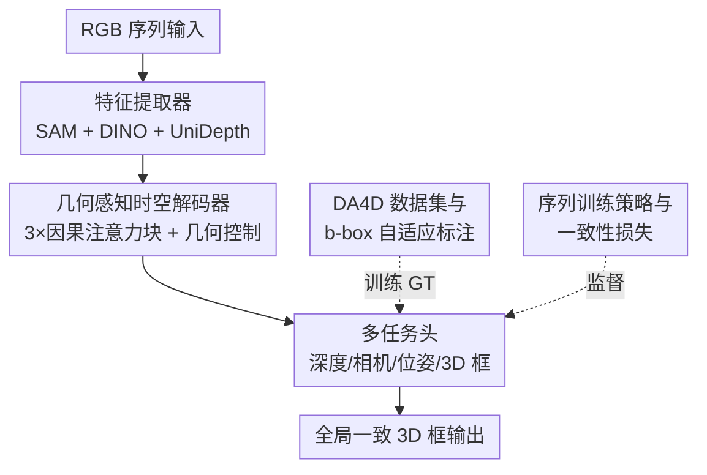

# DetAny4D: Detect Anything 4D Temporally in a Streaming RGB Video

**会议**: CVPR 2026  
**论文**: [CVF Open Access](https://openaccess.thecvf.com/content/CVPR2026/html/Hou_DetAny4D_Detect_Anything_4D_Temporally_in_a_Streaming_RGB_Video_CVPR_2026_paper.html)  
**代码**: 待发布（论文称接收后开源数据与代码）  
**领域**: 3D视觉 / 目标检测  
**关键词**: 4D检测, 流式视频, 开放集3D检测, 时空一致性, 因果注意力

## 一句话总结
DetAny4D 把"流式 RGB 视频里的连续 3D 框预测"定义成 4D 检测任务，用一个端到端开放集框架（SAM+DINO+UniDepth 特征 + 因果时空解码器 + 多任务头）直接吐出跨帧全局一致的 3D 框，并配套构建了 28 万序列的 DA4D 数据集，相比单帧检测器把跨帧抖动方差降低 10–30%。

## 研究背景与动机
**领域现状**：单目 3D 检测（Cube R-CNN、OVMono3D、DetAny3D）已经能从单张图或预扫描点云里预测 3D 框，开放集能力也越来越强。但真实世界是流式视频，需要的是"连续帧上稳定一致的 3D 框"。

**现有痛点**：把单帧检测器逐帧套到视频上，每帧独立预测、不建模时序，把各帧 3D 框转到全局坐标系后会互相打架，产生明显的抖动（jitter）和前后不一致。另一类做法是多阶段流水线——先单帧检测、再跟踪、再做 3D 关联融合——结构臃肿，且误差会沿着级联阶段层层传播放大。自动驾驶里的时空检测方法又只覆盖少数类别、不具备开放集能力。

**核心矛盾**：要在新到达的帧上准确检测，又要维持长期记忆与全局一致，这两个目标在"逐帧独立"和"多阶段后处理"两种范式里都没被同时解决；更底层的卡点是缺乏带连续可靠 3D 框标注的大规模数据集，时空标注成本极高。

**本文目标**：(1) 造一个大规模、带时空对齐 3D 框标注的 4D 数据集；(2) 设计能同时维持长期记忆又准确检测当前帧的时序建模机制；(3) 处理任意长序列、在视角动态变化下输出稳定一致的 3D 检测。

**切入角度**：与其堆多阶段后处理，不如让一个端到端模型直接从序列输入预测全局一致的 3D 框——把时序一致性做进网络结构和损失里，而不是事后修。

**核心 idea**：用"因果时空解码器 + 多任务头 + 一致性损失"端到端地从 RGB 序列直接回归跨帧全局一致的 3D 框，并用一套可自适应累积的 b-box 标注 pipeline 把这件事的训练数据补齐。

## 方法详解

### 整体框架
DetAny4D 接收一段 RGB 序列，逐帧用预训练基础模型抽特征，注入统一 3D 空间后用时空解码器跨帧聚合，再经多任务头输出每帧全局坐标系下、且时序一致的 3D 框。整条链路是端到端的：没有独立的跟踪器，也没有事后 3D 关联，时序一致性靠因果注意力的结构约束 + 一致性损失共同保证。

它由两条线支撑：一条是**离线数据线**——DA4D 数据生成 pipeline 负责把仿真器里录的带位姿 RGB 序列，过滤出物理合理、随观测自适应累积的全局 3D 框作为监督；另一条是**在线模型线**——特征提取器 → 几何感知时空解码器 → 多任务头。下图是模型线（推理 pipeline）与两个离线/训练侧贡献的关系：

### 关键设计

**1. DA4D 数据集与 b-box 自适应标注：解决"没有连续可靠 3D 框监督"的根问题**

4D 检测一直推不动的卡点是没有大规模、带时序对齐 3D 框的标注数据，人工标时空 3D 框成本高得离谱。作者在 Habitat 仿真器里驱动机器人随机游走，录制带深度和相机位姿的 RGB 序列，按"步长 < 片段长"切成有重叠的定长片段——重叠是刻意的，让同一物体在不同片段里有"从全可见逐渐移出 / 从画外逐渐进入"的多样初始可见性，逼模型学会处理可见性变化。

关键不是简单把全局 3D 框投影到每帧（那会把严重遮挡、出画、镜头后方、过远过小、无意义类别的框都留下，产生大量噪声），而是两步处理：先按语义/深度/遮挡规则过滤——比如把 3D 框八个顶点投到当前图像平面，与对应像素深度比较，**超过 5 个顶点落在像素后方就判为重度遮挡剔除**；再做 b-box 自适应。自适应是核心创新：对一开始只**部分可见**的物体（如 L 形沙发只露一半），不能直接用包含整体的全局框当 GT（早期帧预测整体框物理上不合理、会引发误差传播），而是把可见像素按深度反投影成局部点云，算一个朝向相同、更紧致的临时框，随序列推进增量累积点云并扩大框：

$$P_t(O) = P_{t-1}(O) \cup \pi^{-1}(M_t(O), D_O)$$

其中 $\pi^{-1}$ 是反投影函数，$M_t(O)$ 是该物体在第 $t$ 帧的掩码。一旦物体被完整观测到，就切回原始全局框并在后续帧保持。坐标系上，把序列第一帧位姿设为参考，后续帧都存成相对变换。这样每条序列成为一个自洽的数据实例：坐标相对首帧、框对当前视角物理合理、随观测和历史记忆增量更新——完全贴合 4D 检测的逻辑。DA4D 最终统一了 12 个数据集、超 28 万序列（17 万多帧序列 + 11 万单帧）。

**2. 几何感知时空解码器：用因果注意力在端到端结构里建模时序记忆**

逐帧检测之所以抖，是因为帧间没有信息流；多阶段又把信息流外包给了脆弱的后处理。作者把时序建模做进解码器：先用特征提取器（冻结的 ViT-H SAM + ViT-L DINOv2，经 DetAny3D 的交叉注意力聚合器融成 $E_{img}^t$）拿 2D 语义特征，用 UniDepth-V2 拿几何感知嵌入 $E_{geo}^t=\{E_{depth}^t, E_{cam}^t\}$，prompt（如 `{'sofa', ...}`）编码成 $T_{prompt}$ 并和 3D 框 token $T_{box}$ 拼成查询 $T^t$。

时空解码器由三个**因果注意力块（Causal Attention Block, CAB）**组成：一个 CAB 用 token $T^{1:t}$ 与图像嵌入 $E_{img}^{1:t}$ 交互，另一个用 token 与几何嵌入 $E_{geo}^{1:t}$ 交互生成几何控制嵌入 $G_{control}$（以 transformer control 方式注入 3D 空间信息），第三个 CAB 融合前两者输出最终隐状态喂给各头。CAB 内部是 self-attention + 双向 cross-attention 的堆叠，关键是套了**因果掩码**——一个按序列长度构造的下三角矩阵，保证当前帧只能看历史、看不到未来，杜绝信息泄露。self-attention 先在 $q$ 上加因果掩码感知历史状态，再用双向 cross-attention 在 token 和嵌入间做因果受限的信息交互。这样既保留了 attention 的建模灵活性，又严格守住时序因果流，适合流式任务。

**3. 多任务头：用几何辅助任务给 3D 框提供稠密监督与视角变换感知**

光监督 3D 框，模型很难学到跨数据集的几何一致性，也不懂相机怎么动。作者在两个阶段各挂头：特征提取阶段挂深度头和相机内参头（沿用 UniDepth）估计 metric 深度和内参；时空解码后挂相机位姿头和 3D 框头，前者推每帧相对相机位姿、后者推全局坐标系下的 3D 框。深度/相机头提供稠密几何监督、缓解多数据集训练的域差；位姿头让模型显式建模视角变换，从而把每帧框正确转到全局系。消融里这一块对中心和旋转的收敛影响最大——去掉多任务头后 $\mathrm{Var}_v$ 从 0.54 暴涨到 0.91。

**4. 序列训练策略与一致性损失：让变长序列可训、让跨帧预测真正一致**

序列训练有两个工程难点：序列长度可变、每帧物体数可变。训练策略上，在固定最大长度内**随机裁剪**序列以增加长度多样性，并把单帧 3D 检测样本（长度为 1 的序列）穿插进 batch 以保留单帧检测能力；对物体数，先把每帧 prompt 数**padding 对齐**到同一维度，损失里忽略 padding prompt 的预测——而推理时这些冗余 token 正好用来检测新出现的物体。

损失上，3D 框监督是组合损失 $L_{det}=L_{center}+L_d+L_{IoU}^{2D}+L_{IoU}^{3D}+L_{corner}+L_{dim}$，其中 $L_{corner}$ 是排列不变的 Chamfer 距离损失约束旋转一致性。尺寸损失特别处理：对几何对称物体，不同视角下长宽定义可能不全局一致，所以高度直接 L1，长宽用 softmin 做鲁棒匹配：

$$L_{dim}=L_h+\sum_{k=1,2}\frac{w_k\, l_{wl}^{(k)}}{w_l},\quad w_k=\frac{\exp(-l_{wl}^{(k)}/\tau)}{\sum_{m=1}^{2}\exp(-l_{wl}^{(m)}/\tau)},\ \tau=0.1$$

$l_{wl}$ 用置换矩阵 $\Pi_1,\Pi_2$ 交替算"预测长宽对 GT 长宽"和"交叉对"的 L1，再 softmin 取小者，从而对长宽歧义鲁棒。最关键的是一致性损失 $L_{cons}=L_{spatial}+L_{temp}$：把每帧预测框用预测位姿转到全局系 $B_w^i=T_{c2w}^i\cdot B_c^i$，$L_{spatial}=\sum_i \mathrm{chamfer}(B_w^i, B_w^{GT})$ 约束转换后框贴近 GT，$L_{temp}=\frac{1}{T}\sum_i \mathrm{chamfer}(B_w^i, \bar{B}_w)$ 约束每帧预测靠近其时间平均 $\bar{B}_w$，直接把"跨帧一致"写进损失。总损失 $L=L_{depth}+L_{cam}+L_{det}+L_{pose}+L_{cons}$。

### 损失函数 / 训练策略
冻结 SAM/DINO 编码器和 DetAny3D 的 2D 聚合器，只训解码器与各头；AdamW，初始学习率 1e-4，cosine 退火，200 epoch（约 2 周），输入 resize+pad 到 448，训练最大序列长 10。

## 实验关键数据

### 主实验
在 DA4D 上对比单目 3D 检测、视频 4D 检测与本文端到端方法。$\mathrm{AP}_{3D}$ 用 IoU3D 阈值 $\tau\in[0.05,0.10,\dots,0.50]$；$\mathrm{Var}_v / \mathrm{Var}_c$ 是同一实例跨帧框顶点/中心相对其全局平均的时序方差（越低越稳）。

| 方法 | 类型 | Full DA4D AP₃D↑ | Var_v↓ | Var_c↓ |
|------|------|------|------|------|
| ImVoxelNet | 单目3D | 11.98 | 1.50 | 1.43 |
| Cube R-CNN | 单目3D | 21.76 | 1.27 | 1.20 |
| OV Mono3D | 单目3D | 24.39 | 1.26 | 1.23 |
| DetAny3D | 单目3D | 27.16 | 0.99 | 0.90 |
| Kinematic3D* | 视频4D | 25.46 | 0.85 | 0.78 |
| **DetAny4D (ours)** | 端到端4D | **27.48** | **0.70** | **0.64** |

AP 与最强单帧检测器 DetAny3D 基本持平（27.48 vs 27.16），但时序方差显著更低（Var_v 0.70 vs 0.99，Var_c 0.64 vs 0.90），整体相对单帧检测器把跨帧方差降了 10–30%，抖动明显减少。

### 进一步对比（vs 点云/多阶段开放集方法）
对 SpatialLM（预扫描点云、只出轴对齐框）和 ConceptGraph*（RGB-D 序列、多阶段）用 F1@IoU 评估：

| 方法 | 输入 | 策略 | F1@0.25↑ | F1@0.5↑ |
|------|------|------|------|------|
| SpatialLM | 预扫描点云 | 端到端 | 27.1 | 12.8 |
| ConceptGraph* | RGB-D 序列 | 多阶段 | 45.6 | 41.9 |
| **DetAny4D (ours)** | RGB 序列 | 端到端 | **49.7** | **45.5** |

只用 RGB 序列、端到端，就超过了依赖点云或多阶段后处理的方法。

### 消融实验
在 10% 训练数据上逐步累加组件：

| 配置 | AP₃D↑ | Var_v↓ | Var_c↓ | 说明 |
|------|------|------|------|------|
| 基础（单帧检测） | 26.78 | 0.95 | 1.01 | 忽略时序 |
| + 因果注意力 | 26.84 | 0.93 | 0.98 | 开启序列建模 |
| + Soft 尺寸损失 | 26.88 | 0.91 | 0.96 | 适配全局框标注 |
| + 多任务头 | 27.15 | 0.60 | 0.51 | 方差骤降 |
| + 深度&相机头 | 27.28 | 0.59 | 0.50 | 几何稠密监督 |
| + 位姿&一致性（Ours） | 27.29 | 0.54 | 0.48 | 完整模型 |

### 关键发现
- **多任务头是降抖动主力**：加入多任务头那一步，Var_v 从 0.91 直接掉到 0.60、Var_c 从 0.96 到 0.51，是所有组件里对时序稳定贡献最大的——可视化显示去掉它后 3D 框中心和旋转收敛很差。
- **Soft 尺寸损失救尺寸**：去掉 soft loss 后框的长宽出现明显错误，说明全局标注框的长宽歧义确实需要置换不变的鲁棒损失来处理。
- **因果注意力主要解锁序列训练/推理能力**，单独看 AP/方差提升不大，真正的一致性收益来自它与多任务头、一致性损失的协同。
- AP 不靠时序"涨"，时序设计主要换来的是稳定性——这与任务定位（4D 检测重在跨帧一致而非单帧极致精度）一致。

## 亮点与洞察
- **把"时序一致"从后处理搬进结构与损失**：因果掩码保证只看历史、$L_{temp}$ 用"每帧对齐时间平均框"显式约束一致性，避免了多阶段流水线的误差传播——这套"结构约束 + 一致性损失"的组合可迁移到任何流式 3D 感知任务。
- **b-box 自适应累积标注很巧**：用增量点云 $P_t(O)=P_{t-1}\cup\pi^{-1}(\cdot)$ 把"部分可见→完整可见"的框动态变大，解决了"早期帧硬监督整体框不物理"的数据噪声问题，是数据侧而非模型侧的关键洞察。
- **置换不变的尺寸损失**直面"对称物体跨视角长宽定义不一致"这个细节，softmin 选更优匹配，思路可用于任何朝向歧义的回归。
- **padding token 双重用途**：训练时对齐变长物体数、推理时检测新出现物体，一个工程设计同时解了两个问题。

## 局限与展望
- **数据高度依赖仿真器**：DA4D 主体来自 Habitat 仿真，真实视频上的 sim-to-real 差距与泛化未充分验证。⚠️ 论文把详细局限放在补充材料，正文未展开。
- **AP 并未超过单帧 SOTA**：本质是用一致性换精度的折中，对单帧精度敏感的场景未必划算。
- **训练成本高**：200 epoch 约 2 周，最大序列长仅 10，长序列下的记忆/计算扩展性存疑（消融也只在 10% 数据上做）。
- **几何监督依赖外部模型**：深度/相机/位姿头建立在 UniDepth、StreamVGGT 等预训练能力上，这些上游误差会传导进 3D 框。

## 相关工作与启发
- **vs DetAny3D（单帧开放集 SOTA）**：本文直接复用其特征提取器和聚合器，区别在于把单帧检测扩成序列建模——AP 持平但跨帧方差降一截，证明一致性收益来自时序结构而非更强特征。
- **vs Kinematic3D（视频 4D，逐帧+卡尔曼滤波）**：它用 ego-motion 补偿 + 卡尔曼滤波做后融合、且闭集面向驾驶；本文端到端、开放集，方差更低（Var_v 0.70 vs 0.85）。
- **vs ConceptGraph*（多阶段，RGB-D）**：它把 2D 检测投到 3D 再做物体级融合，依赖深度输入和级联阶段；本文纯 RGB 序列端到端，F1@0.5 45.5 vs 41.9。
- **vs SpatialLM（点云+LLM 结构化场景）**：它需要预扫描点云、只出轴对齐框，结构化假设下贴合 GT 差；本文不需点云、出带朝向的框，F1 全面领先。

## 评分
- 新颖性: ⭐⭐⭐⭐ 首个开放集端到端 4D 检测 benchmark，数据 pipeline 与一致性损失设计实在，但模块多为已有组件的组合。
- 实验充分度: ⭐⭐⭐⭐ 主表/对比/消融齐全且含 AP 与方差双指标，但消融只在 10% 数据、真实视频泛化与长序列扩展性缺验证。
- 写作质量: ⭐⭐⭐⭐ 任务定义清晰、图示到位，公式较密但能讲清；部分实现细节推到补充。
- 价值: ⭐⭐⭐⭐ 28 万序列的 DA4D 数据集 + 端到端开放集 4D 检测范式对流式 3D 感知社区有实打实的推动价值。

<!-- RELATED:START -->

## 相关论文

- [\[CVPR 2026\] Detect Anything via Next Point Prediction](detect_anything_via_next_point_prediction.md)
- [\[CVPR 2026\] Beyond Caption-Based Queries for Video Moment Retrieval](beyond_caption-based_queries_for_video_moment_retrieval.md)
- [\[CVPR 2026\] Beyond Duality: A Hybrid Framework of Leveraging Shared and Private Features for RGB-Event Object Detection](beyond_duality_a_hybrid_framework_of_leveraging_shared_and_private_features_for_.md)
- [\[CVPR 2026\] UAV-CB: A Complex-Background RGB-T Dataset and Local Frequency Bridge Network for UAV Detection](uav-cb_a_complex-background_rgb-t_dataset_and_local_frequency_bridge_network_for.md)
- [\[CVPR 2026\] D2FANet: Enhancing Video Object Detection with Dual-Domain Feature Aggregation Network](d2fanet_enhancing_video_object_detection_with_dual-domain_feature_aggregation_ne.md)

<!-- RELATED:END -->
