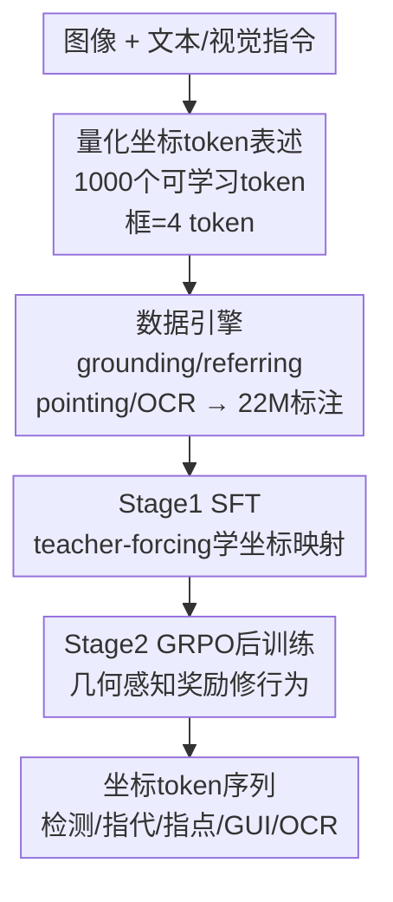

# Detect Anything via Next Point Prediction

**会议**: CVPR 2026  
**论文**: [CVF Open Access](https://openaccess.thecvf.com/content/CVPR2026/html/Jiang_Detect_Anything_via_Next_Point_Prediction_CVPR_2026_paper.html)  
**代码**: https://github.com/IDEA-Research/Rex-Omni  
**领域**: 目标检测 / 多模态VLM  
**关键词**: 开放词表检测, MLLM检测, 量化坐标token, GRPO强化学习, 统一视觉感知  

## 一句话总结
把目标检测重新表述成"用 MLLM 生成量化坐标 token 序列"，靠三件套——可学习坐标 token + 自建数据引擎造 2200 万标注 + SFT 后接 GRPO 强化训练修行为——做出一个 3B 模型 Rex-Omni，在 COCO 等基准上零样本超过 DINO / Grounding DINO 这类回归式检测器，同时还能做指代、指点、GUI 定位、OCR 等八类任务。

## 研究背景与动机
**领域现状**：目标检测长期被坐标回归模型统治，从 YOLO / Faster R-CNN 到 DETR / DINO，再到用文本编码器（BERT / CLIP）做开放词表的 Grounding DINO。另一条线是用 MLLM，把坐标当成离散 token、用 next-token prediction 直接预测，概念上很优雅地把检测统一进语言模型。

**现有痛点**：开放词表检测器的语言理解很浅——Grounding DINO 分不清"red apple"和所有 apple，碰到复杂语义就抓瞎。而 MLLM 虽然语言强，定位却普遍不准：连 Qwen2.5-VL 这种先进模型都做不好精确框定位，常出现重复预测、坐标漂移、漏检。两边各占一头，没有谁能既懂语言又定位准。

**核心矛盾**：作者把 MLLM 定位差归到两个根因。其一是**几何离散化**：MLLM 把坐标预测当分类、用交叉熵监督，但交叉熵对几何偏移不敏感——真值 token 是 `<33>`、预测 `<32>`，像素上几乎没差却被罚成"完全错"；反过来真值 `<...><100>` 预测成 `<...><1000>` 只错一个 token、CE 损失很小，可框已经严重错位。这和回归式模型用 L1 / GIoU 这类几何敏感损失截然不同。其二是**行为失调**：SFT 用 teacher-forcing 喂全量真值序列并行训练，框数被钉死在真值数量，模型从没见过自己"不完美的预测"，推理时既学不会该预测几个框，也调不好输出结构，于是重复框、漏框频发。

**核心 idea**：保留 next-token 生成范式，但在三处同时动刀——把坐标改成 1000 个**可学习量化 token**降低学习难度、用自建**数据引擎**喂足 token-to-pixel 映射所需的海量语义标注、再用 **GRPO 强化后训练**配几何感知奖励，专治 SFT 留下的行为病和坐标精度。

## 方法详解

### 整体框架
Rex-Omni 基于 Qwen2.5-VL-3B，几乎不改架构：把词表最后 1000 个 token 重新征用为专用坐标 token。所有视觉感知任务都被统一成"文本指令进、结构化坐标 token 序列出"——输入一张图加一句自然语言查询（"Please detect pigeon, person, truck in this image"），输出形如 `<|object ref start|>PHRASE<|object ref end|><|box start|>COORDS<|box end|>` 的序列，其中 COORDS 按任务是框（4 个坐标 token）、点（2 个）或多边形顶点。整条管线分三大块：任务表述决定坐标怎么编码、数据引擎决定拿什么数据喂、两阶段训练决定怎么把模型练出来。

### 关键设计

**1. 任务表述：用 1000 个可学习量化坐标 token 把检测压成轻量分类**

针对"几何离散化"这个根因，作者比较了三种 MLLM 坐标范式——直接预测离散 token、检索预定义候选的下标、外接解码器——选了最简单的端到端直接预测。在直接预测内部又有三种编码：带特殊 token 的相对坐标（如 Pix2Seq，每个量化坐标 0–999 是一个特殊 token）、不带特殊 token 的相对坐标（如 SEED1.5-VL，每个坐标用多个数字 token 拼）、绝对坐标（如 Qwen2.5-VL，直接把坐标 tokenize 成数字）。Rex-Omni 选第一种，理由很实在：相对坐标把任务收敛成一个固定的 1000 类分类问题，学习复杂度低；特殊 token 极省 token——一个框只要 4 个 token，而其他方案要 15+ 个。这就是题目里"next point/token prediction"的落点——不靠回归头，靠生成坐标 token。⚠️ 论文标题写 "Next Point Prediction"，但正文和图 2 一致写的是 "Next Token Prediction"（量化坐标 token 的逐 token 生成），二者指同一机制，以正文为准。

**2. 数据引擎：自动造 2200 万语义丰富标注，补足 token-to-pixel 映射和语言落地**

要让模型把 1000 个离散 token 准确对回连续像素空间，需要远超公开数据的海量高质量标注，而且公开数据普遍缺实例级语义（如指代表达）。作者为此搭了一套数据引擎：**Grounding 引擎**走"图像描述→名词短语抽取→赋框"的常规路线，但加了关键的**短语过滤**——把带描述性属性的短语（"green lemon"）剔掉只留基类名（"lemon"），因为现有 grounding 模型语言理解浅，喂"green lemon"会把所有 lemon 都框出来引入大量错标；最后用 DINO-X 赋框，从 COYO / SA-1B 产出约 300 万图。**Referring 引擎**用 Qwen2.5-VL-7B 生成类人指代表达、Molmo 预测对应点、SAM 出真值框的 mask，再做"点落在哪个 mask 里就把框关联给该表达"的点-框对齐，产出约 300 万图。另有轻量的 **Pointing 引擎**（用 SAM mask 的最小外接旋转矩形把框转成精确点标注，约 500 万样本）和 **OCR 引擎**（PaddleOCR 抽多边形+文本+框，约 200 万样本）。加上约 890 万公开数据，总计 2200 万标注图。

**3. 两阶段训练：SFT 打底 + GRPO 几何感知奖励修行为与精度**

SFT 在 2200 万数据上 teacher-forcing 训练，让模型先学会基本的坐标 token→像素映射（本质是 1000 类空间分类）。但 SFT 的两个病——交叉熵对几何不敏感、teacher-forcing 让模型不会自主决定框数——靠继续 SFT 治不好，于是第二阶段上 GRPO 强化后训练。给定图像和指令 $(I,x)$，模型从策略 $\pi_\theta$ 采样 $G$ 条完整回答 $\{o_1,\dots,o_G\}$，对每条算标量奖励 $r_i$ 并归一化成相对优势：

$$A_i = \frac{r_i - \mathrm{mean}(r_1,\dots,r_G)}{\mathrm{std}(r_1,\dots,r_G)}$$

奖励是**几何感知**的，分三种：**Box IoU 奖励**用于框任务，对每个真值框 $b^*_j$ 找 IoU 最高的预测框 $\hat b_i$，类别对上则 $r_j$ 取它们的 IoU、否则为 0，最终用召回 $\sum r_j/|B^*|$ 和精度 $\sum r_j/|\hat B|$ 算 F1 式分数 $r^{IoU} = \frac{2\cdot P\cdot R}{P+R}$；**Point-in-Mask 奖励**用于指点任务，预测点落进 SAM 生成的目标 mask 且类别对就给 1、否则 0，再聚合成 F1 式分；**Point-in-Box 奖励**用于 GUI 定位，点落进目标元素真值框就 1、否则 0。因为允许变长输出，GRPO 能用低奖励直接惩罚重复框、漏框。只采样 6.6 万 SFT 数据做 GRPO，就触发性能跃升——说明 GRPO 的作用不是继续学知识，而是**释放 SFT 已经学到的潜在能力**，靠序列级、奖励引导的反馈重塑行为。

### 损失函数 / 训练策略
Stage1 SFT：2200 万标注，teacher-forcing，交叉熵监督坐标 token 分类。Stage2 GRPO：从 SFT 数据采 6.6 万条，按上面的相对优势 $A_i$ 做 reward-guided 优化，三种几何感知奖励按任务切换。两阶段都建立在 Qwen2.5-VL-3B 之上，仅复用末尾 1000 个词表 token 当坐标 token。

## 实验关键数据

### 主实验
评测覆盖八类任务，检测主用 **F1@IoU**（0.5 / 0.95 / mIoU）而非 AP，因为多数 MLLM 缺可靠置信度、AP 比较不公平。COCO / LVIS 主结果（F1，零样本）：

| 基准 | 指标 | Rex-Omni | Rex-Omni-SFT | DINO-R50 | Grounding DINO-T | SEED1.5-VL |
|------|------|----------|--------------|----------|------------------|------------|
| COCO | F1@IoU0.5 | **72.0** | 68.2 | 68.8 | 69.8 | 71.3 |
| COCO | F1@mIoU | **52.9** | 50.4 | 55.6 | 56.6 | 51.4 |
| LVIS | F1@IoU0.5 | 64.3 | 60.3 | — | 38.8 | 65.6 |
| LVIS | F1@mIoU | **46.9** | 44.2 | — | 38.8 | 46.7 |

注：DINO-R50 的 55.6 是 F1@mIoU 列下的汇总值；在 IoU0.5 这个不要求像素级极致精度的设置下，Rex-Omni 零样本超过传统开/闭集检测器，验证了"不依赖精确框定位的场景里 MLLM 检测可以反超回归式模型"。密集/小目标（Dense200、VisDrone）和指代检测（HumanRef、RefCOCOg）上 Rex-Omni 同样领先大多数 MLLM，指代任务上仅次于商用 SEED1.5-VL。指点任务（F1@Point）更是全面领先：

| 基准 | Rex-Omni | Rex-Omni-SFT | SEED1.5-VL | Qwen2.5-VL-7B |
|------|----------|--------------|------------|---------------|
| COCO | **80.5** | 76.0 | 78.2 | 61.1 |
| Dense200 | **82.5** | 72.9 | 72.1 | 2.0 |
| VisDrone | **58.9** | 49.5 | 56.7 | 14.2 |

### 消融实验
核心消融是验证 GRPO 到底修了什么。作者对 SFT 和 GRPO 模型分别做"去重复框"和"去大框"再看涨幅——涨得越多说明原模型这种坏行为越严重：

| 操作 | 模型 | F1@0.5（前→后） | 被移除占比 | 说明 |
|------|------|-----------------|-----------|------|
| 去重复框 (VisDrone) | SFT | 55.6 → 62.3 | 15.3% | SFT 重复框严重 |
| 去重复框 (VisDrone) | GRPO | 61.6 → 62.1 | 0.1% | GRPO 几乎无重复 |
| 去大框 (Dense200) | SFT | 44.9 → 56.7 (mIoU) | 20.5% | SFT 一框盖多物 |
| 去大框 (Dense200) | GRPO | 58.3 → 60.0 (mIoU) | 3.5% | GRPO 大框大幅减少 |

### 关键发现
- **GRPO 的主要价值是"修行为"而非"学知识"**：只用 6.6 万数据就触发性能跃升，而 SFT 涨到后期已平台化；GRPO 把 SFT 模型已有的潜能解锁出来。
- **重复框和大框是 SFT 的两大病灶**：teacher-forcing 钉死框数让模型不会自主调输出结构，去重复框让 SFT 在 VisDrone 涨 15.3%、去大框让 SFT 在 Dense200 涨 20.5%，而 GRPO 模型这两项只剩 0.1% / 3.5%。
- **坐标精度提升是温和的**：在"两模型都完美匹配"的受控设置下，GRPO 比 SFT 的 F1@mIoU 在 COCO 上只 +0.5，说明 GRPO 的大头收益来自行为纠正而非纯精度细抠。

## 亮点与洞察
- **把"几何敏感损失"以奖励形式塞回生成式检测**：传统检测靠 L1/GIoU，MLLM 丢了这个；Rex-Omni 用 Box IoU / Point-in-Mask 奖励在 RL 阶段把几何感知补回来，绕开了交叉熵对几何不敏感的死结，这个思路可迁移到任何"坐标当 token 生成"的任务。
- **短语过滤这一步看似琐碎却关键**：剔掉带属性短语只留基类名，规避了 grounding 模型语言浅导致的批量错标，是数据质量的隐形杠杆。
- **变长输出 + 序列级奖励直接治重复框**：teacher-forcing 钉死框数是病根，GRPO 让模型自主决定框数并惩罚重复，从机制上而非后处理上解决，消融数据（重复占比从 15.3%→0.1%）很有说服力。

## 局限与展望
- **IoU0.95 这种高精度档仍弱**：表里 Rex-Omni 在 COCO F1@IoU0.95 只 15.9，量化坐标 token 的精度天花板摆在那，超精细定位场景仍不及回归式模型。
- **评测主用 F1 而非 AP**：作者承认是因为 MLLM 缺可靠置信度，但这也意味着和回归式检测器的 AP 数字不能直接对比，"超过 DINO"要带上"在 IoU0.5、F1 口径下"的限定。⚠️ 跨任务/跨基准的数字难度不同，不宜直接比大小。
- **闭集专家仍有差距**：布局定位上离 DocLayout-YOLO（F1@0.5 91.2 vs 89.5）、OCR 上离 PaddleOCRv5 仍有距离，Rex-Omni 的卖点是通用 + 开集泛化而非单任务极致。
- 改进方向：更细的坐标量化（>1000 档或层次化 token）、把几何奖励扩到多边形/关键点、GRPO 数据规模与采样数 $G$ 的敏感性还可深挖。

## 相关工作与启发
- **vs Grounding DINO（开放词表检测）**：它用文本编码器对齐文本和视觉区域，定位准但语言浅，分不清"red apple"；Rex-Omni 借 LLM 的语言理解处理复杂语义，代价是高 IoU 精度稍逊。
- **vs Qwen2.5-VL / SEED1.5-VL（MLLM 检测）**：同样把坐标当 token，但它们用绝对坐标或多数字 token、且只到 SFT，受几何离散化和行为失调困扰；Rex-Omni 用 4-token 量化相对坐标 + GRPO 几何奖励，把重复框/大框/坐标漂移系统性压下去。
- **vs T-Rex2（视觉提示专家）**：T-Rex2 把视觉提示当特征匹配问题；Rex-Omni 把视觉提示也转成量化坐标 token、纳入统一文本接口，视觉提示任务上做到与专家可比。

## 评分
- 新颖性: ⭐⭐⭐⭐⭐ 把几何感知奖励经 GRPO 注入生成式检测，系统性解决 MLLM 检测的离散化与行为失调两大病根。
- 实验充分度: ⭐⭐⭐⭐⭐ 八类任务、十余个基准，且用去重复/去大框消融精准定位 GRPO 的作用机制。
- 写作质量: ⭐⭐⭐⭐ 动机与机制讲得清楚，但标题"Next Point"与正文"Next Token"措辞不一致略有干扰。
- 价值: ⭐⭐⭐⭐⭐ 一个 3B 模型零样本逼近/超过传统检测器并统一八类感知任务，为语言感知统一视觉系统提供了可复现路径（开源）。

<!-- RELATED:START -->

## 相关论文

- [\[CVPR 2026\] DetAny4D: Detect Anything 4D Temporally in a Streaming RGB Video](detany4d_detect_anything_4d_temporally_in_a_streaming_rgb_video.md)
- [\[CVPR 2026\] Back to Point: Exploring Point-Language Models for Zero-Shot 3D Anomaly Detection](back_to_point_exploring_point-language_models_for_zero-shot_3d_anomaly_detection.md)
- [\[CVPR 2026\] Hierarchical Point-Patch Fusion with Adaptive Patch Codebook for 3D Shape Anomaly Detection](hierarchical_point-patch_fusion_with_adaptive_patch_codebook_for_3d_shape_anomal.md)
- [\[ICCV 2025\] YOLOE: Real-Time Seeing Anything](../../ICCV2025/object_detection/yoloe_realtime_seeing_anything.md)
- [\[CVPR 2026\] WeDetect: Fast Open-Vocabulary Object Detection as Retrieval](wedetect_fast_open-vocabulary_object_detection_as_retrieval.md)

<!-- RELATED:END -->
