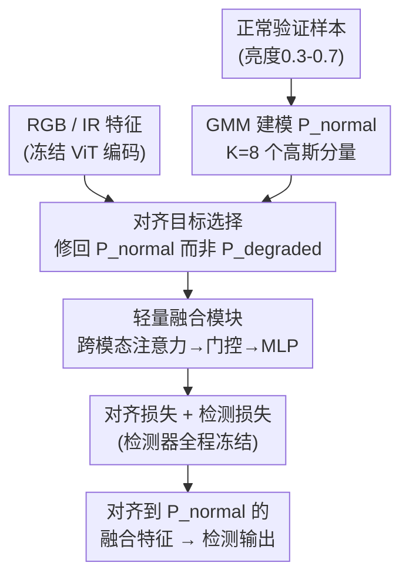

# Distribution-Aligned Multimodal Fusion for Robust Object Detection

**会议**: CVPR 2026  
**论文**: [CVF Open Access](https://openaccess.thecvf.com/content/CVPR2026/html/Hao_Distribution-Aligned_Multimodal_Fusion_for_Robust_Object_Detection_CVPR_2026_paper.html)  
**代码**: 未公开  
**领域**: 目标检测 / 多模态融合  
**关键词**: RGB-红外检测, 分布对齐, 跨退化泛化, 参数高效融合, 高斯混合模型  

## 一句话总结
针对 RGB-红外多模态检测在「未见过的退化场景」上泛化差的问题，本文冻结预训练检测器、只训练一个轻量融合模块，并用红外互补信息把融合特征显式拉回到「预训练检测器表现最好的正常特征分布 $P_\text{normal}$」上，而不是去适配训练时见过的退化分布，从而在三个基准上达到 SOTA 且训练快 4 倍。

## 研究背景与动机

**领域现状**：自动驾驶、监控等安全攸关场景需要全天候鲁棒检测。RGB 相机是主传感器但在过曝、欠曝、夜间等恶劣光照下严重掉点；红外相机对光照不敏感、提供互补信息，所以 RGB-IR 多模态检测是主流方案。近期融合方法普遍堆注意力机制和复杂的跨模态交互设计。

**现有痛点**：这些方法都靠端到端训练、只用检测任务损失隐式引导特征学习。预实验发现一个关键现象——标准端到端训练在「见过的退化类型」上很强，但在「没见过的退化类型」上明显垮掉。而实际部署中，把所有可能的退化类型都采集进训练集既昂贵又不现实，所以跨退化泛化（cross-degradation generalization）才是真正的瓶颈。

**核心矛盾**：作者指出问题的根本在于「多模态融合的优化目标选错了」。现有方法隐式地把融合特征往「训练数据分布」上拉，而训练分布里掺杂了退化特定的模式（degradation-specific patterns）；一旦遇到训练时没见过的退化，这些被过拟合的模式就失效了。换句话说，检测器的决策边界本来是为正常特征校准的，端到端去适配退化反而会破坏这个校准。

**本文目标**：在训练只覆盖有限退化类型的前提下，让融合后的特征对任意未见退化都能保持检测性能。

**切入角度**：作者从迁移学习原理出发——「来自多样化源数据的特征比任务特定适配泛化得更好」。预训练检测器在正常特征分布 $P_\text{normal}$ 上知识最适用、决策边界最准，那就该把 $P_\text{normal}$ 当成一个**稳定的对齐靶子**，用红外互补信息把退化特征「修回」这个分布，而不是反过来让检测器去迁就退化。

**核心 idea**：冻结预训练检测器，只训练轻量融合模块，并显式地把融合特征对齐到预训练正常分布 $P_\text{normal}$（而非训练退化分布 $P_\text{degraded}$），用对齐目标的选择换取跨退化泛化。

## 方法详解

### 整体框架

方法把「带退化的多模态特征修回预训练正常分布」拆成两个解耦的阶段：**离线阶段**先用冻结检测器在目标域的正常样本上拟合一个高斯混合模型（GMM），建模出对齐靶子 $P_\text{normal}$；**在线阶段**冻结整个检测器（ViT 编码器 + DETR 解码器，86M 参数），只训练一个 13M 参数的融合模块，让它一边融合 RGB-IR 互补信息、一边把融合特征显式对齐到 $P_\text{normal}$。检测器全程不动，所以训练成本低、又保住了预训练知识。

形式化地说：预训练检测器 $D^*$ 含编码器 $E$ 和检测头 $H$，在 COCO 这类正常场景为主的数据上训练，其特征分布定义为 $P_\text{normal} := P(F),\ F = E(I),\ I \sim \mathcal{D}_\text{pretrain}$。部署到过曝/欠曝/雾等退化场景时，特征分布漂移到 $P_\text{degraded}$，而检测器的决策边界仍是为 $P_\text{normal}$ 校准的，于是掉点。本文学一个融合函数 $M$，使融合特征分布 $P_\text{fused} := P(M(F_\text{rgb}, F_\text{ir}))$ 尽量贴近 $P_\text{normal}$。

### 关键设计

**1. 对齐目标选择：把特征修回 $P_\text{normal}$，而不是迁就 $P_\text{degraded}$**

这是全文的灵魂。给定冻结检测器和同一套融合架构，对齐目标有三种选项：(1) 端到端训练让检测器去适配训练退化；(2) 把特征对齐到训练退化分布 $P_\text{degraded}$；(3) 把特征对齐到正常分布 $P_\text{normal}$。本文选 (3)，依据是迁移学习原理：当训练只覆盖有限退化时，$P_\text{normal}$ 是预训练知识真正适用的地方、是个稳定靶子；而 $P_\text{degraded}$ 会过拟合到训练时那几种退化的特定模式，遇到新退化就废了。Table 3 直接验证了这个直觉——只在过曝样本上训练，对齐 $P_\text{normal}$ 在未见的夜间/模糊退化上分别拿到 76.8 / 40.6 mAP，而对齐 $P_\text{degraded}$ 只有 67.5 / 28.5，代价仅仅是在「见过的过曝」上从 48.2 略降到 47.3。一句话：用见过退化上的一点点小损失，换未见退化上的大幅提升。

**2. 用 GMM 建模 $P_\text{normal}$ 并加显式对齐损失**

光有「对齐 $P_\text{normal}$」的想法还不够，得给它一个可优化的形式。本文用 $K$ 分量高斯混合模型对正常特征的 [CLS] token（全局图像表示 $F_\text{cls} \in \mathbb{R}^d$）建模：

$$p_\text{normal}(F_\text{cls}) = \sum_{k=1}^{K} w_k\, \mathcal{N}(F_\text{cls} \mid \mu_k, \Sigma_k)$$

参数 $\{w_k, \mu_k, \Sigma_k\}$ 由 EM 算法估计，$K$ 用 BIC 选（默认 $K=8$）。选 GMM 有三个具体理由：$K$ 个分量能刻画不同场景类型对应的多峰结构；对数似然有闭式梯度便于优化；用对角协方差 $\Sigma_k$ 把参数量从 $O(Kd^2)$ 降到 $O(Kd)$。对齐时直接对 $-\log p_\text{normal}(\cdot)$ 求梯度作监督：

$$\nabla_{F_\text{cls}} \log p_\text{normal}(F_\text{cls}) = \sum_k \gamma_k(F_\text{cls})\, \Sigma_k^{-1}(\mu_k - F_\text{cls})$$

其中 $\gamma_k$ 是后验概率，这个梯度的几何含义就是把特征往最近的高斯分量中心拉。这与现有「只靠任务损失隐式引导特征」的做法形成对比——本文是对分布偏移做**直接监督**，引导更强。值得注意的是，作者强调这里的「正常」不等于预训练分布本身，而是目标域里没有严重退化的样本（按亮度 $\in[0.3,0.7]$、对比度 $>0.4$ 的分层采样选 5k 张），只为给冻结检测器搭一个稳定的参考区域。

**3. 轻量融合模块 + 冻结检测器：把可训练参数压到 13M**

为了在不动检测器的前提下融合 RGB-IR，融合模块 $M$ 用三个串行组件处理 patch token 序列（$F_\text{rgb}, F_\text{ir} \in \mathbb{R}^{N\times d}$，ViT-Base 下 $N=197$、$d=768$）。**跨模态注意力**用 8 头交叉注意力让两模态互查互补信息，$F_\text{rgb}^\text{enh} = F_\text{rgb} + \text{Softmax}(Q_\text{rgb}K_\text{ir}^T/\sqrt{d_k})V_\text{ir}$，红外侧对称同理，做双向增强；**自适应 token 门控**把增强后特征拼接成 $F_\text{concat}\in\mathbb{R}^{N\times 2d}$，再用 $G=\sigma(\text{MLP}(\text{Mean}(F_\text{concat})))$ 算通道级门控权重做 $F_\text{gated}=F_\text{concat}\odot G$，按可靠性动态加权两个模态；**融合 MLP** 最后把门控特征投回原维度 $F_\text{rect}=\text{MLP}(F_\text{gated})\in\mathbb{R}^{N\times d}$。三部分加起来 13M 参数（注意力 4.7M、门控 2.4M、MLP 7.1M），对面是 86M 冻结检测器。冻结本身就是一种强正则——迁移学习里当目标数据有限或偏向特定退化时，冻结预训练权重能防止过拟合到训练模式；端到端训练（99M 全可调）反而会丢掉泛化性。融合模块和对齐损失协同工作：架构负责让信息互通，对齐损失负责把这股信息引向「修回 $P_\text{normal}$」。

### 损失函数 / 训练策略

总损失同时优化对齐和任务两项：

$$\mathcal{L} = \mathbb{E}_{(I_\text{rgb}, I_\text{ir}, Y)\sim\mathcal{T}}\big[-\log p_\text{normal}(F_\text{rect}^\text{cls}) + \lambda\, \mathcal{L}_\text{det}(H(F_\text{rect}), Y)\big]$$

其中 $F_\text{rect}^\text{cls}$ 是融合特征的 [CLS] token，$\lambda=0.5$ 平衡对齐与检测。训练分两个解耦阶段：**阶段一（离线）**用冻结编码器在 5k 正常验证样本上提 [CLS] 特征，k-means++ 初始化、EM（最多 100 轮、tol $10^{-4}$）拟合 GMM，得到固定的 $\{w_k,\mu_k,\Sigma_k\}$ 作为靶子；**阶段二（在线）**冻结 $D^*$ 全部参数，每个 batch 提冻结特征 → 算融合特征 → 算对齐损失和检测损失 → 只反传更新 $\theta_M$。解耦把「分布建模」和「融合学习」分开，保住了预训练知识。

## 实验关键数据

### 主实验

三个 RGB-IR 基准：LLVIP（行人，15,488 对）、FLIR（车辆，10,228 对）、DroneVehicle（航拍，28,439 对）。统一用冻结 ViT-Base + DETR，报 mAP@0.5（3 次均值）。所有对比方法都在同一检测器上重新实现以公平比较。

| 数据集 | 本文 | 之前最好 SOTA (CFMW) | 提升 |
|--------|------|----------------------|------|
| LLVIP | 98.1±0.6 | 97.7±0.6 | +0.4 |
| FLIR | 79.5±0.7 | 78.9±0.7 | +0.6 |
| DroneVehicle | 57.8±0.8 | 57.2±0.8 | +0.6 |

| 方法类别 | 代表方法 | 训练时长 | 参数 |
|----------|----------|----------|------|
| 注意力类 | MMTM | 15h | 89M |
| 端到端 SOTA | M2FNet / CFMW | 17h / 14h | 94M / 89M |
| 先进融合 | RSDet | 4h | 88M |
| **本文** | Ours | **3.5h** | 99M |

不仅全面 SOTA，训练时间从端到端的 14-17h 压到 3.5h（约 4× 加速），因为只训 13M 融合模块。

### 困难场景分解（LLVIP，按场景拆 mAP）

| 方法 | 正常 | 过曝 | 欠曝 | 夜间 |
|------|------|------|------|------|
| MMTM | 96.3 | 36.8 | 41.2 | 74.2 |
| M2FNet | 97.6 | 44.1 | 48.5 | 81.6 |
| **Ours** | 97.8 | **47.3** | **51.8** | **83.5** |

关键观察：提升主要落在过曝/欠曝这类「特征严重偏离 $P_\text{normal}$」的极端退化上（+3.2 / +3.3），正常场景几乎打平（说明本文专治分布漂移）；夜间提升较小，因为红外热信号本身稳定、需要修回的量小。

### 跨退化泛化与对齐目标（消融）

只在过曝上训练，测见过(过曝)与未见(欠曝/夜间/模糊)退化（Table 4）：

| 方法 | 过曝(见过) | 欠曝 | 夜间 | 模糊 |
|------|-----------|------|------|------|
| 端到端 (不冻结) | 41.2 | 38.2 | 70.5 | 32.6 |
| 冻结 + 仅任务损失 | 43.5 | 41.8 | 73.2 | 35.8 |
| **Ours (冻结+对齐)** | **47.3** | **48.5** | **76.8** | **40.6** |

组件消融（Table 5，逐步加在 concat 基线上）：

| 配置 | mAP | 过曝 | $-\log p_\text{normal}$ ↓ |
|------|-----|------|---------------------------|
| Baseline (Concat) | 75.3 | 31.5 | 3.45 |
| + 跨模态注意力 | 78.6 | 37.8 | 2.68 |
| + 自适应门控 | 80.9 | 42.6 | 2.01 |
| + 对齐损失 | **82.5** | **47.3** | **1.52** |

### 关键发现
- **对齐损失贡献最关键且最「治本」**：加上它后过曝场景从 42.6 跳到 47.3，且 $-\log p_\text{normal}$ 持续下降到 1.52，证明每个组件都在实打实地减小分布漂移——架构负责信息互通，对齐损失负责把特征引回 $P_\text{normal}$。
- **对齐靶子的选择决定泛化**：对齐 $P_\text{degraded}$ 会在 epoch 15 左右过早 plateau（过拟合到有限退化模式），对齐 $P_\text{normal}$ 收敛更稳、到 epoch 30 达到最低对齐损失。
- **端到端反而更差**：不冻结的端到端在见过和未见退化上都比冻结方案差，印证了「适配训练退化 = 牺牲泛化」的过拟合风险。

## 亮点与洞察
- **把「对齐目标」当成一等设计变量**：大多数融合论文卷架构，本文反其道——架构甚至刻意做轻，真正的创新是「往哪个分布对齐」。这个视角转换（修回正常分布 vs 适配退化分布）非常「啊哈」，且有迁移学习理论支撑。
- **冻结检测器=免费的强正则 + 4× 加速**：86M 冻结、13M 可调，既防过拟合又省训练成本，是参数高效融合的漂亮范例。
- **GMM + $-\log p$ 对齐损失的可迁移性**：这套「拟合一个参考分布，用负对数似然梯度把特征拉回去」的机制不限于 RGB-IR，任何「预训练大模型 + 退化/域偏移输入」的场景（如医学影像跨设备、遥感跨季节）都可以借用——靶子选「模型表现最好的那块特征空间」而非「目标退化」。

## 局限与展望
- **依赖能拿到目标域正常样本**：离线建模 $P_\text{normal}$ 需要 5k 张亮度/对比度达标的正常验证图。若目标域本身就极少正常样本（如永久低光的深海/夜视场景），这个靶子可能难以稳定估计。⚠️ 论文未讨论正常样本稀缺时的退化情况。
- **只在 [CLS] token 上做分布对齐**：GMM 建模和对齐损失都只作用于全局 [CLS] 表示，patch 级特征靠架构隐式带过；对小目标密集的航拍场景（DroneVehicle 绝对 mAP 仅 57.8），全局对齐可能不够细。
- **GMM 是固定的离线靶子**：训练中 $P_\text{normal}$ 不更新，若融合特征的「正常」概念随训练演化，固定靶子可能不是最优；可探索在线自适应或可学习的参考分布。
- **退化类型仍限于光照+模糊**：实验主要覆盖过曝/欠曝/夜间/模糊，对雨雪、运动模糊、传感器噪声等更复杂复合退化的泛化未充分验证。

## 相关工作与启发
- **vs 注意力/端到端融合 (MMTM, ICAFusion, C2Former, M2FNet, CFMW)**：它们卷跨模态交互架构、靠任务损失端到端训练，隐式匹配训练分布；本文架构刻意做轻、显式对齐 $P_\text{normal}$，在困难/未见退化上优势明显且训练快 4×。
- **vs 先进轻量融合 (CrossFormer, RSDet)**：同样引入轻量模块，但它们仍只靠任务损失隐式引导特征；本文用 GMM 显式建模分布 + 对齐损失做直接监督，提供更强的跨退化泛化引导。
- **vs 域适应 (Domain Adaptation)**：传统域适应是把模型「适配到目标退化分布」；本文反向操作——不适配退化，而是用多模态互补性把退化特征「修回」预训练正常分布，保住检测器原有决策边界。

## 评分
- 新颖性: ⭐⭐⭐⭐⭐ 把「对齐目标的选择」提升为核心设计变量，正常分布 vs 退化分布的视角转换有理论支撑也有强实验佐证。
- 实验充分度: ⭐⭐⭐⭐ 三基准 + 困难场景分解 + 跨退化泛化 + 对齐目标对比 + 组件消融，论证链完整；但退化类型偏光照、缺更复杂复合退化与正常样本稀缺情形。
- 写作质量: ⭐⭐⭐⭐⭐ 动机—矛盾—方法—验证一条线串到底，公式与图表对核心 claim 支撑清晰。
- 价值: ⭐⭐⭐⭐ 对全天候鲁棒检测实用，且「对齐到模型最擅长的特征空间」这一思路可迁移到广义的预训练大模型+域偏移场景。

<!-- RELATED:START -->

## 相关论文

- [\[CVPR 2026\] Tri-Modal Fusion Transformers for UAV-based Object Detection](tri-modal_fusion_transformers_for_uav-based_object_detection.md)
- [\[CVPR 2026\] Geometry-Aligned and Anomaly-Aware Reconstruction for 3D Anomaly Detection](geometry-aligned_and_anomaly-aware_reconstruction_for_3d_anomaly_detection.md)
- [\[CVPR 2026\] Towards an Incremental Unified Multimodal Anomaly Detection: Augmenting Multimodal Denoising From an Information Bottleneck Perspective](towards_an_incremental_unified_multimodal_anomaly_detection_augmenting_multimoda.md)
- [\[CVPR 2026\] DyFCLT: Dynamic Frequency-Decoupled Cross-Modal Learning Transformer for Multimodal Tiny Object Detection](dyfclt_dynamic_frequency-decoupled_cross-modal_learning_transformer_for_multimod.md)
- [\[CVPR 2026\] Complementary Prototype Mapping for Efficient Multimodal Anomaly Detection](complementary_prototype_mapping_for_efficient_multimodal_anomaly_detection.md)

<!-- RELATED:END -->
