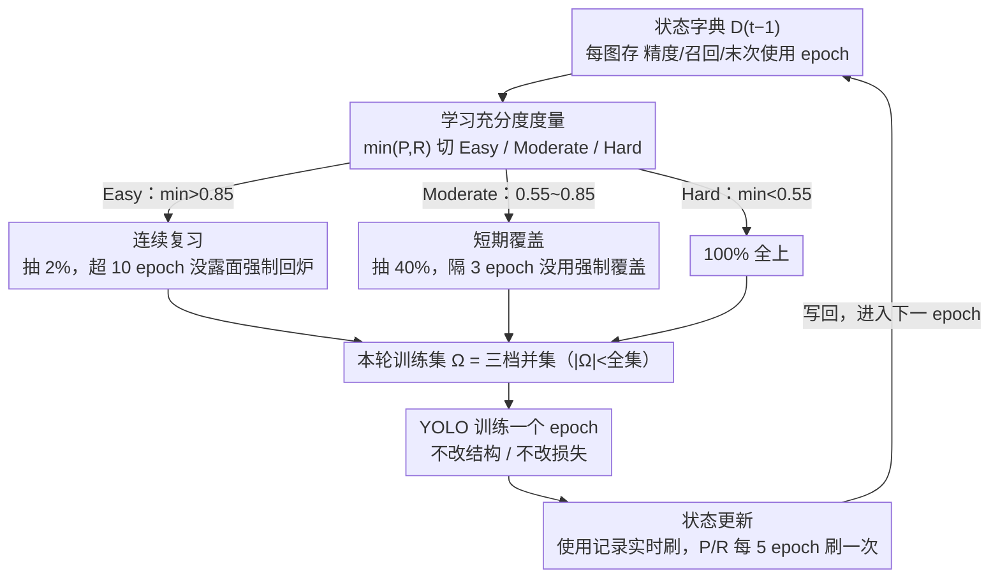

# Does YOLO Really Need to See Every Training Image in Every Epoch?

**会议**: CVPR 2026  
**arXiv**: [2603.17684](https://arxiv.org/abs/2603.17684)  
**代码**: 无  
**领域**: 目标检测  
**关键词**: YOLO, 训练加速, 自适应采样, 抗遗忘, 数据高效学习

## 一句话总结

提出 Anti-Forgetting Sampling Strategy (AFSS)，根据每张训练图像的学习充分度（min(Precision, Recall)）动态决定哪些图像参与训练、哪些可以跳过，实现 YOLO 系列检测器 1.43× 以上的训练加速同时保持甚至提升检测精度。

## 研究背景与动机

YOLO 系列以极快推理速度著称（YOLO11s 达 200 FPS），但训练却出奇耗时：
- YOLO11s 在 COCO 上训练需 43.9 小时（双 RTX 4090），而同硬件下 Faster R-CNN 仅需 6.5 小时
- 原因在于 YOLO 采用**全覆盖训练范式**：每个 epoch 遍历全部训练集，每张图像处理数百次
- 当模型已充分学习某些图像后，继续以相同频率处理它们产生递减收益

**核心问题**：YOLO 真的需要在每个 epoch 看到每张训练图像吗？如果不需要，能否通过动态选择"看什么"和"何时看"来加速训练？

现有替代方案的局限：
- **课程学习**：固定由易到难顺序，困难样本学习不充分
- **数据集剪枝**：不可逆删除导致遗忘和偏差
- **数据集蒸馏**：合成数据缺乏真实世界多样性

## 方法详解

### 整体框架

AFSS 想回答一个反直觉的问题：既然模型对某些图像已经学得很好，为什么还要在每个 epoch 都喂给它？它的做法是给训练集装上一个"分级闸门"。每个 epoch 开始前，AFSS 拿上一轮留下的状态字典逐张评估图像的学习充分度，把全集切成 Easy / Moderate / Hard 三档，再按档位决定这一轮"看哪些、看多少"：Easy 只抽 2% 做周期性复习，Moderate 抽 40% 保证短期都被扫到，Hard 则 100% 全上确保学透。训练完这一轮，再把每张图像的最新精度、召回率和使用记录写回状态字典，喂给下一个 epoch。整个过程不碰模型结构和损失，只在数据进入网络之前做一道筛选，因此对任何 YOLO 变体都即插即用。

### 关键设计

**1. 学习充分度度量：用精度和召回率的短板来判定一张图学透了没有**

要分级，先得有个能逐图打分的尺子。AFSS 把一张图像 $\mathbf{I}_i$ 的学习充分度定义为它当前检测精度和召回率里更差的那个：

$$\text{Learning Sufficiency}(\mathbf{I}_i) = \min(P_i, R_i)$$

之所以取 $\min$ 而不是平均或 F1，是因为分类和定位只要有一项不可靠，这张图就还没学好——取最小值等于盯着短板维度，避免"精度高但召回低"这类图被误判为简单。基于这把尺子，全集被切成三档：$\min(P_i,R_i) > 0.85$ 是 Easy（模型已能自信处理），$0.55 \le \min(P_i,R_i) \le 0.85$ 是 Moderate（部分稳定、还需打磨），$< 0.55$ 是 Hard（遮挡、小目标等仍有挑战）。论文中也对比了 loss、梯度、F1 等其他度量，$\min(P,R)$ 在精度和加速上都最好（见表5）。

**2. 连续复习：让被冷落的 Easy 图像隔一阵子回炉一次，防止被遗忘**

Easy 图像每个 epoch 只抽 2%，绝大多数时间被晾在一边，风险是模型久不见就把它们忘了。连续复习用两阶段采样化解这个隐患。第一部分是强制复习集 $\mathcal{A}_f'$：专门从"超过 10 个 epoch 没被用过"的 Easy 图像里挑 $E_1$ 张，相当于优先召回最久没露面的，堵住遗忘的口子；第二部分是随机多样性集 $\mathcal{A}_r$，从剩下的 Easy 图像里随机抽 $E_2$ 张提供轻量变化。两者受约束 $E_1 + E_2 = 0.02 \times |\mathcal{D}_{t-1}^1|$（总量锁在 2%），且 $E_1 \le 0.5(E_1+E_2)$（强制复习不超过一半，给随机性留余地）。消融显示复习间隔取 10 epoch 最优：太短（5）浪费算力，太长（20）则真的开始遗忘，AP 掉到 44.8。

**3. 短期覆盖：保证每张 Moderate 图像 3 个 epoch 内必被扫到一次**

Moderate 是"还差一口气"的图像，既不能像 Easy 那样大幅跳过，也不必像 Hard 那样每轮都看。AFSS 给它定的规矩是每 epoch 抽 40%，但要求任意一张图像不能连续缺席超过 3 个 epoch。落地同样分两部分：强制覆盖集 $\mathcal{B}_f$ 把那些"距上次使用已隔 3 轮及以上"的图像优先捞回来，

$$\mathcal{B}_f = \{(\mathbf{I}_i, P_i, R_i, ep_i) \in \mathcal{D}_{t-1}^2 \mid t - 1 - ep_i \geq 3\}$$

剩下的名额由随机补充集 $\mathcal{B}_r$ 从其余 Moderate 图像里随机凑齐到 40%。这样既压低了 Moderate 的处理频次，又靠强制覆盖兜住了"短期全覆盖"的下限——间隔放到 5 时 AP 就掉到 44.2。

**4. 状态更新：用尽量便宜的方式维护那本驱动一切的状态字典**

前三个设计都依赖一本状态字典 $\mathcal{D}_t$，里面存着每张图像的精度、召回率和最后一次被使用的 epoch。每轮训练后都要更新它，但如果每个 epoch 都重新跑一遍全集推理来刷新 $P_i, R_i$，评估开销会把省下来的训练时间又吃回去。AFSS 的取舍是：使用记录（最后 epoch）实时更新，因为它几乎零成本；而精度/召回率每 5 个 epoch 才刷新一次，用"略微过时但够用"的分级换来评估开销的大幅下降。这一步看着不起眼，却是加速的真正命门——消融里去掉状态更新后精度照样达标，但加速比从 1.54× 垮到 1.26×（表4）。最终每个 epoch 实际喂进网络的训练集是三档的并集 $\Omega = (\mathcal{A}_f' \cup \mathcal{A}_r) \cup (\mathcal{B}_f \cup \mathcal{B}_r) \cup \mathcal{D}_{t-1}^3$，其规模 $|\Omega| < K$（全集大小），省下的正是这部分差额。

### 一个完整示例

跟一张图像走一遍它在训练里的命运。假设第 30 个 epoch 时某张街景图 $\mathbf{I}_i$ 因为有个被遮挡的小目标，$P_i=0.6, R_i=0.4$，$\min=0.4 < 0.55$，被判为 **Hard**，于是这一轮乃至接下来每一轮它都 100% 参与训练。又练了十几轮，模型把那个小目标也学会了，第 5 的倍数 epoch 刷新状态时它升到 $P_i=0.8, R_i=0.7$，$\min=0.7$，落进 **Moderate**——此后它不再每轮都上，而是每 3 个 epoch 内至少被短期覆盖捞回来一次。再往后它彻底学透，$\min > 0.85$ 进入 **Easy**，从此基本被晾着，只有当它连续 10 个 epoch 没露面、被强制复习集 $\mathcal{A}_f'$ 点名时才回炉一次，防止模型把它忘掉。一张图像就这样从"每轮必看"一路降频到"偶尔复习"，而省下的处理次数累加到全集，就是 1.43×–1.68× 的训练加速来源；论文也观察到随训练推进 Hard 数量持续萎缩、Easy/Moderate 不断增多，正是这条降频轨迹的群体写照。

### 损失函数 / 训练策略

AFSS 是**架构无关**的纯采样策略，不动 YOLO 的损失函数和模型结构，直接挂在 Ultralytics YOLO 框架上：COCO 训 600 epochs，VOC/DOTA/DIOR-R 训 300 epochs，默认 batch size 64、分辨率 640×640（COCO/VOC）。

## 实验关键数据

### 主实验

**表1：MS COCO 2017 + PASCAL VOC 2007 训练加速**

| 模型 | COCO AP | 加速比 | VOC mAP | 加速比 |
|------|---------|--------|---------|--------|
| YOLO11s | 47.0 | — | 81.7 | — |
| YOLO11s + AFSS | **47.2** | **1.54×** | **81.8** | **1.64×** |
| YOLO12x | 55.2 | — | 86.2 | — |
| YOLO12x + AFSS | **55.4** | **1.68×** | **86.4** | **1.69×** |

**表2：遥感检测 DOTA-v1.0 + DIOR-R**

| 模型 | DOTA mAP | 加速比 | DIOR-R mAP | 加速比 |
|------|----------|--------|-----------|--------|
| YOLO11x-OBB | 81.3 | — | 83.6 | — |
| YOLO11x-OBB + AFSS | **81.4** | **1.69×** | **83.7** | **1.70×** |

跨 YOLOv8/v10/11/12 全部规模（n/s/m/l/x）一致有效。

### 消融实验

**表3：与其他训练策略对比（YOLO11s on COCO）**

| 方法 | AP | 加速比 |
|------|-----|--------|
| 课程学习 | 43.7 | 1.35× |
| 自步学习 | 44.5 | 1.30× |
| 数据剪枝 | 40.5 | 1.38× |
| 数据蒸馏 | 35.6 | 1.50× |
| **AFSS** | **47.2** | **1.54×** |

**表4：模块贡献消融**

| LSM | CR | STC | SU | AP | 加速比 |
|-----|----|----|-----|------|--------|
| ✓ | | | | 44.8 | 1.45× |
| ✓ | ✓ | | | 45.5 | 1.34× |
| ✓ | | ✓ | | 46.6 | 1.31× |
| ✓ | ✓ | ✓ | | 47.2 | 1.26× |
| ✓ | ✓ | ✓ | ✓ | **47.2** | **1.54×** |

State Update 是加速的关键——无 SU 时虽精度达标但加速仅 1.26×。

**表5：学习充分度度量对比**

| 度量 | AP | 加速比 |
|------|-----|--------|
| Loss-based | 46.0 | 1.52× |
| Gradient-based | 46.9 | 1.45× |
| F1 score | 46.6 | 1.51× |
| **min(Prec, Rec)** | **47.2** | **1.54×** |

### 关键发现

1. **模型越大加速越显著**：从 n（1.43×）到 x（1.68×），大模型学习能力更强，更多图像更快变"Easy"
2. **连续复习间隔 10 epoch 最优**：过短（5）浪费计算，过长（20）导致遗忘（AP 降至 44.8）
3. **短期覆盖间隔 3 epoch 最优**：间隔 5 时 AP 降至 44.2
4. **状态更新间隔 5 epoch 最优**：每 epoch 更新计算开销大（加速仅 1.26×），15 epoch 更新则信息过时
5. 训练过程中 Hard 图像数量持续减少，Easy/Moderate 增加，体现模型学习进度

## 亮点与洞察

1. **洞察深刻**：揭示了 YOLO "只看一次"推理哲学与"反复看"训练范式的矛盾
2. **设计简洁务实**：不修改模型架构和损失函数，仅改变数据采样策略，即插即用
3. **抗遗忘机制设计精巧**：三级分层 + 强制复习 + 短期覆盖，在加速与防遗忘间取得出色平衡
4. **实验规模空前**：覆盖 4 个 YOLO 版本（v8/v10/11/12）× 5 个规模（n/s/m/l/x）× 4 个数据集

## 局限与展望

1. 学习充分度评估需要额外推理计算（虽每 5 epoch 一次），对极大数据集可能是瓶颈
2. Easy/Moderate/Hard 的阈值（0.85/0.55）和采样比例（2%/40%/100%）为手动设定，未做自适应
3. 仅在 YOLO 系列上验证，对 DETR 等基于 Transformer 的检测器适用性未知
4. 未考虑图像间的相关性和互补性（如场景多样性），仅基于单图像的学习充分度

## 相关工作与启发

- **课程学习/自步学习**：固定易到难顺序，困难样本学习不足；AFSS 始终保留困难样本
- **数据集剪枝**（Deep Learning on a Data Diet）：静态不可逆删除导致遗忘；AFSS 动态可逆
- **数据集蒸馏**（Fetch and Forge）：合成数据多样性不足；AFSS 使用真实数据子集
- AFSS 的思想可推广到其他需要长时间训练的任务（如分割、实例分割、姿态估计）

## 评分

- **新颖性**: ★★★★☆ — 问题洞察新颖，方法设计简洁有效
- **技术深度**: ★★★☆☆ — 方法本身偏工程化，理论深度有限
- **实验充分性**: ★★★★★ — 覆盖面极广，消融详尽，对比全面
- **写作清晰度**: ★★★★★ — 标题引人入胜，叙事流畅，图表直观

<!-- RELATED:START -->

## 相关论文

- [\[CVPR 2026\] See What We Cannot See: A Geo-guided Reasoning Benchmark for Object Counting under Adverse Earth Observation Conditions](see_what_we_cannot_see_a_geo-guided_reasoning_benchmark_for_object_counting_unde.md)
- [\[CVPR 2026\] YOLO-Master: MOE-Accelerated with Specialized Transformers for Enhanced Real-time Detection](yolo-master_moe-accelerated_with_specialized_transformers_for_enhanced_real-time.md)
- [\[CVPR 2026\] AKCMamba-YOLO: Selective State Space Models For Real-Time Object Detection](akcmamba-yolo_selective_state_space_models_for_real-time_object_detection.md)
- [\[ICML 2025\] When Every Millisecond Counts: Real-Time Anomaly Detection via the Multimodal Asynchronous Hybrid Network](../../ICML2025/object_detection/when_every_millisecond_counts_real-time_anomaly_detection_via_the_multimodal_asy.md)
- [\[ICCV 2025\] YOLO-Count: Differentiable Object Counting for Text-to-Image Generation](../../ICCV2025/object_detection/yolo-count_differentiable_object_counting_for_text-to-image_generation.md)

<!-- RELATED:END -->
