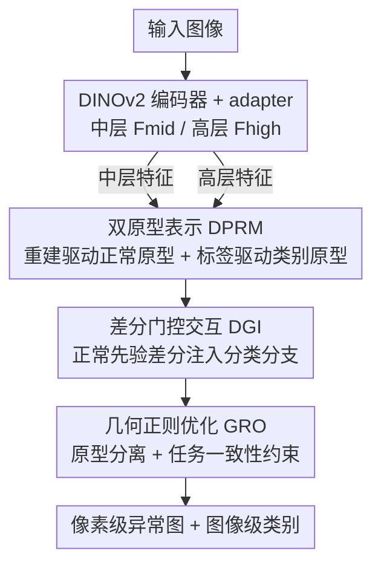

# Dual-Prototype-Guided Multi-task Learning for Unsupervised Anomaly Detection and Classification

**会议**: CVPR 2026  
**论文**: [CVF Open Access](https://openaccess.thecvf.com/content/CVPR2026/html/Luo_Dual-Prototype-Guided_Multi-task_Learning_for_Unsupervised_Anomaly_Detection_and_Classification_CVPR_2026_paper.html)  
**代码**: https://github.com/luoqianhao/PG-SFD  
**领域**: 异常检测 / 工业质检  
**关键词**: 无监督异常检测, 异常分类, 原型学习, 多任务学习, 特征解耦

## 一句话总结
PG-SFD 把"无监督异常检测（像素级定位）+ 弱监督异常分类（区域级分类）"建模成一个双原型协同优化问题，用正常原型与类别原型显式解耦正常/异常语义、用差分门控把正常先验注入分类分支、用几何正则缓解多任务梯度冲突，在 MVTec-AD 上拿到 I-AUROC 99.4% 且同时支持细粒度缺陷分类。

## 研究背景与动机

**领域现状**：工业/医学场景里常把缺陷感知拆成两步——先用无监督异常检测（UAD，只用正常样本建正常原型）在像素级定位出异常区域（ROI），再把抠出来的局部 patch 喂给一个异常分类器去判断缺陷类型。两个任务各自训练、串行执行，看起来分工明确。

**现有痛点**：作者点名了串行范式的两个硬伤。其一是**局部视觉歧义（Local Visual Ambiguity, LVA）**：不同类别的缺陷在局部区域往往长得几乎一样（论文举的例子是"钢材粘连 vs 导板印记"），UAD 只靠正常样本建模、异常边界模糊、阈值不清，容易漏掉细微异常；分类器又只能看 UAD 抠出来的局部视图，丢掉了全局上下文，自然分不清这些局部相似但语义不同的缺陷。其二是**知识无法传递**：UAD 阶段辛苦学到的大量"正常模式先验"，在抠图那一刀之后就和全局上下文断开了，没法传给分类器。

**核心矛盾**：自然的解法是端到端多任务学习（MTL），靠共享特征让两个任务互相受益。但 MTL 在这里直接用不了，因为两个任务存在**特征偏好不兼容**——UAD 需要保留细节的中层特征做精确定位，异常分类需要高度抽象的高层语义特征。两者在同一共享空间里优化，梯度方向会打架，结果是 ROI 不准、特征与监督信号错位。

**本文目标 / 切入角度**：作者主张从"隐式特征共享"转向"显式特征解耦"——既要吃到 MTL 的互补信息，又要把两个任务的特征冲突显式地管理起来。

**核心 idea**：把 UAD 和异常分类建模成**双原型协同优化**问题——同时学一组由无监督重建驱动的**正常原型**和一组由图像级弱标签驱动的**类别原型**，用它们显式地把正常/异常语义、以及不同缺陷类别之间的语义在特征空间里拉开，再配上跨任务的差分注入和几何正则，实现像素级检测与图像级分类的端到端联合推理。

## 方法详解

### 整体框架

PG-SFD（Prototype-Guided Semi-Supervised Feature Disentanglement）的骨架是一个自监督预训练的 ViT 编码器（实测选 DINOv2 ViT-Small 最优）。ViT 的层级结构天然产出多级特征：**中层特征 $F_{mid}(x)$** 兼顾空间细节与语义，喂给 UAD 分支做像素级定位；**高层特征 $F_{high}(x)$** 语义抽象最强，喂给分类分支。两路特征各经一个 adapter 适配下游任务。

三个核心模块依次接力：**DPRM** 同时构造类别原型 $p^c$ 和正常原型 $p^a$，显式解耦正常/异常语义；**DGI** 用门控机制把正常原型当作类别判别先验、差分注入到分类分支；**GRO** 在优化阶段用几何约束主动把解耦的特征结构"撑开"、缓解任务间梯度冲突。三者协同，端到端同时输出像素级异常图和图像级类别。

### 关键设计

**1. 双原型表示模块（DPRM）：用两套原型显式解耦正常与异常语义**

这是全文的地基，直接针对 LVA 带来的"正常-异常语义纠缠"。作者定义两组原型：类别原型 $p^c \in \mathbb{R}^{d \times N}$（$N$ 为类别数）和正常原型 $p^a \in \mathbb{R}^{d \times K}$（$K$ 是控制正常原型空间大小的超参）。两组原型用完全不同的信号驱动学习，从而把两类语义分开建模。

**正常原型**走无监督重建路线：用一个轻量重建头 $R(\cdot)$ 预测 $\hat{y} = R(F_{mid}(x))$，得到误差图 $E(x) = \|x - \hat{y}\|_2$，误差高的位置就是潜在异常区。然后从 $F_{mid}(x)$ 里挑出误差最高的 top-$T$ 像素对应的特征向量，用动量更新刷新 $p^a$：

$$p^a \leftarrow p^a + (1-m)\cdot \mathrm{Mean}\big(\{f_{patch} \mid E_{patch} > \theta\}\big)$$

其中 $m$ 是动量系数，$\theta$ 是误差阈值。这样正常原型实际是在"理解异常区相对正常模式的偏离方向"。**类别原型**则由图像级弱标签监督：对高层特征做全局平均池化得 $f_{global} = \mathrm{GAP}(F_{high}(x))$，再算它和各类别原型 $p^c_n$ 的余弦相似度 $s_c(x) = \cos(f_{global}, p^c_n)$，最后用带温度 $\tau$ 的标准交叉熵 $L_{cls} = -\log \frac{\exp(s_y(x)/\tau)}{\sum_c \exp(s_c(x)/\tau)}$ 把每类样本拉向各自原型中心。和过往只建一个"正常类原型"的方法（CFA、ProtoAD）相比，双原型才能同时承载异常的语义多样性、支撑多类判别。

**2. 差分门控交互（DGI）：把正常先验差分注入分类分支，放大异常间差异**

DPRM 学出的正常原型富含正常特征，但分类分支需要的是判别异常类别的能力。DGI 解决的是"如何把正常先验有用地喂给分类、而不是简单拼接"。它的输入是正常原型 $p^a$ 和适配后的高层特征 $F'_{high}(x)$：先把 $p^a$ 上采样对齐到 $F_{high}$ 得 $\hat{p}^a$，再逐位置算一个差分门控响应

$$\Delta F = \sigma\big(\mathrm{MLP}(\hat{p}^a - F'_{high}(x))\big)$$

$\sigma$ 是 sigmoid。最终融合特征为 $F_{fused} = \Delta F \odot F_{high} + (1-\Delta F)\odot \hat{p}^a$。这个差分设计的巧妙之处在自适应行为：面对**正常样本**时高层特征和正常原型差不多，$\Delta F \to 0.5$ 做平衡融合；面对**异常样本**时高层特征含有判别性上下文，$\Delta F \to 1$，融合结果更偏向保留判别信息。等于让模型"需要细粒度定位时保细节、需要类别判别时聚焦全局语义"，实现自适应的特征解耦与互补。

**3. 几何正则优化（GRO）：用几何约束主动撑开特征空间、缓解梯度冲突**

前两个模块解决了表示和注入，但 MTL 的梯度冲突还在。GRO 的思路是不被动等冲突发生，而是在优化时主动给特征空间加几何约束。它包含两个损失。**原型分离损失**约束两套原型之间的最小余弦距离，逼正常样本的局部特征向其加权类别原型中心聚拢、增强正常区域语义一致性：

$$L_{sep} = \frac{1}{C\cdot K}\sum_{c=1}^{C}\sum_{k=1}^{K} \exp\big(-\tau\cdot(1-\cos(p^c_n - p^a_k))\big)$$

（⚠️ 此式中下标 $n$ 与外层求和变量 $c$ 的对应关系以原文为准。）**任务一致性损失**防止检测与分类两任务的特征分布漂移：对 UAD 模块的重建特征 $f_{rec}$ 做一个投影变换 $\phi(\cdot)$，再和分类特征 $f_{cls}$ 对齐，$L_{cons} = \|f_{cls} - \phi(f_{rec})\|_1$。最终总目标把四项损失加权组合：

$$L = \lambda_{rec}L_{rec} + \lambda_{cls}L_{cls} + \lambda_{sep}L_{sep} + \lambda_{cons}L_{cons}$$

消融显示 GRO 是把 I-AUROC 从 93.8% 拉到 99.4% 的关键一跳，说明显式的几何约束确实把两任务的冲突压住了。

### 损失函数 / 训练策略

总损失即上式四项加权（重建 $L_{rec}$、分类 $L_{cls}$、原型分离 $L_{sep}$、任务一致 $L_{cons}$）。训练用 DINOv2 ViT-Small 编码器，输入缩放到 $448\times448$，StableAdamW 优化器、权重衰减 $1\times10^{-4}$，UAD/分类模块初始学习率分别为 $1\times10^{-3}$ 和 $5\times10^{-3}$，共训 200 epoch，不做数据增强。关键策略是**三阶段课程学习**：到第 60 epoch 才把所有损失项全部激活做联合优化，前期让各分支先各自稳住，避免一开始就被多任务冲突带偏。

## 实验关键数据

数据集覆盖工业与医学跨域：MVTec-AD、自采的热轧钢管数据集 IHSP（4 类缺陷、13321 训练 / 1100 测试）做细粒度分类；VisA（通用物体）和 Uni-Medical（医学）二分类标签验证泛化。为公平评估"用少量异常样本"的能力，公开数据集的异常样本按 2:8 重切成训练/测试。指标：检测用 AUROC / AP / F1 / P-AUPRO，分类用 Cls-Acc / Cls-F1。

### 主实验（MVTec-AD 统一异常感知）

| 方法 | 训练协议 | I-AUROC↑ | P-AUPRO↑ | Cls-ACC↑ | Cls-F1↑ |
|------|----------|----------|----------|----------|---------|
| Dinomaly | 仅正常 | 99.1 | 95.7 | N/A | N/A |
| INPformer | 仅正常 | 99.3 | **96.0** | N/A | N/A |
| DinoCLS | 图像标签 | N/A | N/A | 63.3 | 60.9 |
| Two-Stage* | 正常+图像标签 | — | — | 54.7 | 48.5 |
| AnomalyCLIP | 正常+prompt | 94.6 | 87.8 | N/A | N/A |
| **PG-SFD（ours）** | 正常+图像标签 | **99.4** | 95.6 | **64.7** | **61.6** |

\*Two-Stage 先用 INPformer 做 UAD、再在定出的异常区域上做分类。PG-SFD 是表里唯一同时给出检测+分类全套指标的统一框架：检测端 I-AUROC 刷到 SOTA，P-AUPRO 95.6% 与纯 UAD 最强的 INPformer（96.0%）几乎持平——说明特征解耦没有牺牲定位精度；分类端 Cls-F1 61.6%，比串行的 Two-Stage（48.5%）高出 13.1 个点。

### 跨域泛化（VisA / Uni-Medical / IHSP）

| 数据集 | 指标 | INPformer | PG-SFD |
|--------|------|-----------|--------|
| VisA | I-AUROC / P-AUPRO | 97.8 / 96.2 | 97.9 / **97.2** |
| Uni-Medical | I-AUROC / P-AUPRO | 85.7 / 89.1 | 84.3 / **89.5** |
| IHSP | I-AUROC / P-AUPRO | 99.0 / 88.1 | **99.9 / 89.9** |
| VisA / Uni-Med / IHSP | Cls-F1 | N/A | 79.1 / 77.6 / **71.1** |

三个异构域上检测都保持竞争力，分类 Cls-F1 全域领先（纯 UAD 方法根本给不出分类结果）。值得注意的细节：VisA 是二分类粗粒度标签，PG-SFD 的细粒度优势发挥不出来，Cls-F1 只能算"持平"；而在细粒度工业缺陷 IHSP 上优势最明显（I-AUROC 99.9%）。

### 局部歧义子集 + 消融

在 IHSP 最易混的"导板印记 vs 钢材粘连"子集上，PG-SFD 平均 Cls-F1 71.10%，远超 Two-Stage 48.49% 和缺少原型解耦的 DinoCLS 61.64%，直接验证 DPRM+DGI 对 LVA 的抑制作用。

| 配置 | DPRM | DGI | GRO | I-AUROC | P-AUPRO | Cls-F1 |
|------|:----:|:---:|:---:|---------|---------|--------|
| Baseline | ✗ | ✗ | ✗ | 92.7 | 20.5 | 40.5 |
| V1 | ✓ | ✗ | ✗ | 94.0 | 94.5 (↑74) | 53.0 |
| V2 | ✓ | ✓ | ✗ | 93.8 | 94.1 | 57.3 (↑4.3) |
| V3（Full） | ✓ | ✓ | ✓ | **99.4** | **95.6** | **61.6** |

### 关键发现
- **DPRM 救活了定位**：Baseline 的 P-AUPRO 只有 20.5%（多任务冲突让定位几乎失效），加上 DPRM 后暴涨到 94.5%，证明显式双原型解耦正是解决特征冲突的关键。
- **DGI 专攻分类**：在 V1 基础上加 DGI，Cls-F1 +4.3%，体现跨任务语义引导对分类的增益。
- **GRO 是最后的临门一脚**：加上几何正则后 I-AUROC 一举从 93.8% 跳到 99.4%，说明几何约束把残余的梯度冲突压住了。
- **正常原型维度 $K=6$ 最优**：太小表示力不足、太大特征不紧凑，$K=6$ 在特征紧凑度与表示多样性之间取得最佳平衡。
- t-SNE 显示正常样本紧紧围绕正常原型聚集、各异常类被推开形成独立簇，直观印证了"显式解耦"确实发生在特征空间里。

## 亮点与洞察
- **把"检测+分类"重述成双原型协同优化**，是个干净的建模视角：正常原型管"偏离正常多少"、类别原型管"是哪类异常"，两条监督信号（无监督重建 + 弱标签）天然对应两套原型，避免了隐式共享里的语义打架。
- **DGI 的差分门控很巧**：用 $\hat{p}^a - F'_{high}$ 的差分过 sigmoid 当门控，正常样本门控趋近 0.5、异常样本趋近 1，等于让网络按"是不是异常"自适应决定保细节还是聚语义——这个思路可迁移到任何"需要按输入难度切换特征粒度"的多任务场景。
- **课程学习 + 几何正则的组合**值得借鉴：前 60 epoch 不激活全部损失，让分支先各自收敛再联合，配合 GRO 主动撑开特征空间，是缓解 MTL 梯度冲突的一套可复用工程经验。

## 局限性 / 可改进方向
- **依赖图像级弱标签**：类别原型必须有图像级类别标注才能学，纯无监督/零样本场景目前用不了（作者把这列为未来工作）。
- **细粒度优势依赖细粒度标注**：在 VisA 这种二分类粗标签数据集上，分类优势发挥不出来，方法的甜点区是"有细粒度缺陷标注"的工业数据。
- ⚠️ 多处损失公式（尤其 $L_{sep}$ 里原型下标的对应、$\hat{p}^a$ 与 $F_{high}$ 的对齐细节）原文表述偏简略，复现时需对照官方代码确认。
- 自采的 IHSP 数据集未公开细节，"99.9% I-AUROC"这类近饱和指标在私有数据上的可比性有限。

## 相关工作与启发
- **vs 纯 UAD（PatchCore / Dinomaly / INPformer）**：它们只用正常样本建单一正常原型、只能定位不能分类；PG-SFD 用双原型同时支持多类判别，且定位精度（P-AUPRO 95.6%）几乎不输纯 UAD 的 SOTA。
- **vs 两阶段弱监督分类（CutPaste / WinCLIP / FAPM）**：串行抠图切断了局部与全局上下文，遇到局部相似缺陷就崩；PG-SFD 端到端联合推理，Cls-F1 比 Two-Stage 高 13.1 个点。
- **vs MTL 联合方法（DRAEM / AnomalyCLIP）**：DRAEM 依赖合成异常样本监督、AnomalyCLIP 靠文图对齐但检测精度受限，且都用隐式特征共享、不显式建模任务冲突；PG-SFD 的差异点正是"显式特征解耦 + 几何正则缓解梯度冲突"。

## 评分
- 新颖性: ⭐⭐⭐⭐ 双原型协同优化 + 差分门控注入是对"检测/分类特征冲突"的一个清晰且少见的显式建模视角。
- 实验充分度: ⭐⭐⭐⭐ 工业+医学跨三域、含局部歧义子集和逐模块消融，较扎实；私有 IHSP 与近饱和指标略减分。
- 写作质量: ⭐⭐⭐ 动机和框架讲得清楚，但部分损失公式符号偏简、易混。
- 价值: ⭐⭐⭐⭐ 工业质检里"定位+分类一体化"需求真实，统一框架有落地价值。

<!-- RELATED:START -->

## 相关论文

- [\[CVPR 2026\] Multi-Prototype Compactness and Boundary-Aware Synthesis for Unsupervised Anomaly Detection](multi-prototype_compactness_and_boundary-aware_synthesis_for_unsupervised_anomal.md)
- [\[CVPR 2026\] GPFlow: Gaussian Prototype Probability Flow for Unsupervised Multi-Modal Anomaly Detection](gpflow_gaussian_prototype_probability_flow_for_unsupervised_multi-modal_anomaly_.md)
- [\[CVPR 2026\] Beyond Prompt Degradation: Prototype-Guided Dual-Pool Prompting for Incremental Object Detection](beyond_prompt_degradation_prototype-guided_dual-pool_prompting_for_incremental_o.md)
- [\[CVPR 2026\] Complementary Prototype Mapping for Efficient Multimodal Anomaly Detection](complementary_prototype_mapping_for_efficient_multimodal_anomaly_detection.md)
- [\[ECCV 2024\] Adaptive Multi-task Learning for Few-Shot Object Detection](../../ECCV2024/object_detection/adaptive_multi-task_learning_for_few-shot_object_detection.md)

<!-- RELATED:END -->
