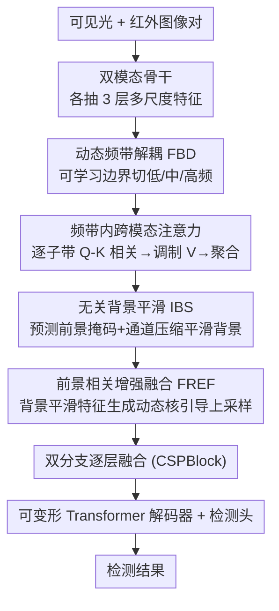

# DyFCLT: Dynamic Frequency-Decoupled Cross-Modal Learning Transformer for Multimodal Tiny Object Detection

**会议**: CVPR 2026  
**论文**: [CVF Open Access](https://openaccess.thecvf.com/content/CVPR2026/html/Li_DyFCLT_Dynamic_Frequency-Decoupled_Cross-Modal_Learning_Transformer_for_Multimodal_Tiny_Object_CVPR_2026_paper.html)  
**代码**: 未公开  
**领域**: 多模态目标检测  
**关键词**: RGBT微小目标检测、频域学习、跨模态注意力、动态频带解耦、噪声抑制  

## 一句话总结
针对可见光-红外（RGBT）微小目标检测，DyFCLT 先用可学习的动态频带把跨模态特征拆成低/中/高频子带、在每个子带内做跨模态注意力交互（DFCA），再用一个前景掩码引导的选择性平滑模块（SSE）抑制背景噪声、增强前景细节，在两个 RGBT 微小目标基准上把 AP 拉到 SOTA（RGBT-Tiny 48.2 AP，比上一名多模态方法 +9.5）。

## 研究背景与动机
**领域现状**：微小目标检测（TOD）在无人机遥感、安防、灾害救援里很关键，但单靠可见光在低光、遮挡下表征太弱，于是 RGBT（可见光+红外）多模态检测成为热点。同时，因为微小目标本身富含高频信号，频域增强（在频谱上放大目标响应）越来越流行。

**现有痛点**：现有频域方法基本只在可见光单模态里做，没有利用跨模态的互补频率线索。而少数把频域引入 RGBT 的工作，又默认了一个过于简单的假设——红外图主要是低频、RGB 图主要是高频，于是按这个固定先验去分配频段。但这个二分假设缺乏对"不同尺度目标在不同模态里的频率分布"的系统分析，可能根本不成立。

**核心矛盾**：作者在 RGBT-Tiny 上做了频率特性分析（用径向频率分解把归一化频谱切成低/中/高三段，统计各段能量占比），发现一个反直觉的事实——**随着目标尺寸变小，RGB 和红外两个模态里目标的中高频能量占比都在升高**；即便红外整体以低频为主，微小目标在红外里依然横跨多个频段含有丰富信息。这说明"红外=低频"的固定划分会丢掉微小目标的关键跨模态频率互补线索。但更细粒度地挖频率信息又有副作用：复杂环境（遮挡、背景杂波）下直接增强频率响应，会连背景噪声一起放大，反而伤害检测。

**本文目标**：在 RGBT 微小目标场景下，(1) 自适应地把跨模态特征按频段解耦、在每个频段内做细粒度互补融合；(2) 同时压住被频率增强带出来的背景噪声、突出前景。

**核心 idea**：用一个 Transformer（DyFCLT）把跨模态融合从"固定频段先验"换成"可学习的动态频带解耦 + 频带内跨模态注意力"，再配一个"选掩码—平滑背景—引导上采样增强前景"的细化模块，让频率增强和噪声抑制协同进行。

## 方法详解

### 整体框架
DyFCLT 是一个双分支（RGB 分支 + 红外分支）的 RGBT 检测器，整体接在 RT-DETR 风格的检测框架上：输入一对可见光图 $I_{vis}$ 和红外图 $I_{ir}$，先各自经模态专属骨干（ResNet50）抽出 $L=3$ 层多尺度特征 $\{F^l_{vis}\}$、$\{F^l_{ir}\}$；然后 DyFCLT 的两个协同组件登场——**DFCA**（动态频带解耦跨模态注意力）在每一层做跨模态频域交互，得到富含互补频率线索的特征 $\tilde F^l_{ir}$；**SSE**（选择性平滑增强）在多尺度融合时压噪、增强前景。两模态各层处理完后逐层融合、拼接展平，送进带可变形注意力的 Transformer 解码器和检测头出框。下面除非特别说明，都以红外分支为例（RGB 分支对称）。

整套流程是"跨模态特征**富集**（DFCA 挖频率互补线索）→ **细化**（SSE 压噪增前景）"两步走，两组件协同完成。

其中 FBD + 频带内注意力构成 **DFCA**，IBS + FREF 构成 **SSE**。

### 关键设计

**1. 动态频带解耦（FBD）：把"红外=低频"的固定先验换成可学习的频段边界**

针对"固定频率先验丢掉微小目标跨频段信息"这个痛点，FBD 不再人为指定哪个模态归哪个频段，而是自适应地把每个特征按径向频率切成多个子带。给第 $l$ 层特征做 FFT 后，用二值掩码 $M_b$ 在径向上隔离出第 $b$ 个子带：$F^l_{m,b} = M_b \odot \mathcal{F}(F^l_m)$，$m\in\{q,k,v\}$，其中掩码定义为

$$M_b(u,v) = \begin{cases} 1, & k_b \le \sqrt{u^2+v^2} < k_{b+1} \\ 0, & \text{otherwise} \end{cases}$$

$\sqrt{u^2+v^2}$ 是频率分量到 2D 傅里叶域原点的径向距离。关键在于**频段边界 $\{k_b\}$ 不是固定的而是可学习的**：内部边界被参数化为累积的正增量（保证频段单调有序、不交叉），并用基于 octave 的方案初始化（$B=3$ 时初始化为 $\{0,\tfrac18,\tfrac14,\tfrac12\}$），训练时边界可自适应漂移去匹配目标真实的跨模态频率分布。按 Nyquist 定理归一化频率范围 $[0,\tfrac12]$，$k_0$、$k_B$ 固定为 0 和 $\tfrac12$；根据前面的频率分析取 $B=3$ 切成低/中/高三带。消融显示可学习频带比静态频带（46.5 → 48.2 AP）和不分带（$B=1$，46.1 AP）都明显更好，且 $B$ 不是越多越好（$B=4$ 反而掉到 47.0）。

**2. 频带内跨模态注意力（Band-Wise Frequency Attention）：在每个干净子带内做跨模态相关与调制**

DFCA 让 query 来自可见光、key/value 来自红外（各先过 1×1 逐点卷积 + 3×3 深度卷积生成 $F^l_q,F^l_k,F^l_v$），FBD 把三者都拆成子带后，**在每个子带内独立做跨模态交互**。先在频域算每个子带的跨模态相关权重 $A^l_b = \mathcal{F}^{-1}(F^l_{q,b} \odot \overline{F^l_{k,b}})$（频域点乘 + 复共轭再逆 FFT，等价空间域相关）；再用一个 3×3 卷积 + sigmoid 对相关权重做空间位置上的响应调制，并乘到 value 上：$R^l_b = \sigma(\text{Conv}_{3\times3}(A^l_b)) \odot \mathcal{F}^{-1}(F^l_{v,b})$；最后把所有子带聚合、层归一化、线性投影得到融合特征 $\tilde F^l_{ir} = \text{Proj}(\text{LN}(\sum_b R^l_b))$。这样做的好处是"频带内交互"避免了不同频段相互串扰——消融里只解耦 query 反而掉点（频率泄漏让模型学不到稳定的频率对应），而 Q、K、V 全解耦时才达到最佳（48.2 AP），印证了"干净的带内交互"是关键。

**3. 无关背景平滑（IBS）：先把噪声响应压下去再增强，避免频率增强连噪声一起放大**

更细地挖频率信息会把背景噪声一起放大，IBS 就是来解决这个副作用的。它先对 DFCA 输出 $\tilde F^l_{ir}$ 过一个卷积层预测**二值前景掩码** $M$（训练时用 focal tversky loss 监督，比标准 focal loss 更适合前景-背景极度不均衡的微小目标分割），据此分出前景和背景特征 $F^l_{fg}=M\odot\tilde F^l_{ir}$、$F^l_{bg}=(1-M)\odot\tilde F^l_{ir}$。对背景部分用两个串联 3×3 卷积**先压缩再恢复通道维度**（压缩比 $r$ 控制强度）：$\hat F^l_{bg}=\text{Conv}^C_{3\times3}(\text{Conv}^{C/r}_{3\times3}(F^l_{bg}))$，这个通道瓶颈会在空间上平滑掉背景的高频杂波；最后把平滑后的背景加回前景得到去噪特征 $F^l_{bgs}=F^l_{fg}+\hat F^l_{bg}$。即"前景保留、背景平滑"，而不是粗暴丢弃背景。单独加 SSE 就让微小目标 $\text{AP}^s_t$ 涨了 3.1 个点。

**4. 前景相关增强融合（FREF）：用去噪特征生成动态核，引导高层语义特征的上采样**

FREF 解决"高层语义特征分辨率低、微小目标细节丢失"的问题。它利用 IBS 已去噪的 $F^l_{bgs}$ 来**引导**更高一层红外特征 $\tilde F^{l+1}_{ir}$ 的上采样：先用卷积从 $F^l_{bgs}$ 预测每个空间位置的局部滤波核 $V^l=\text{Conv}_{3\times3}(F^l_{bgs})$，对邻域做 softmax 归一化得到位置自适应动态核 $W^l$（这些核会强调前景相关的高频结构、抑制低频背景）；再经 pixel-unshuffle 重排对齐上采样分辨率、分成 4 组分别作为空间可变核去调制 $\tilde F^{l+1}_{ir}$ 的对应区域，pixel-shuffle 恢复分辨率得到引导上采样结果 $Y^{l+1}_{guided}$。最后与标准双线性上采样相加 $\hat Y^{l+1}=Y^{l+1}_{guided}+\text{Upsample}(\tilde F^{l+1}_{ir})$，再和 $F^l_{bgs}$ 拼接过一个 CSPBlock 融合得 $F^l_{out}$；两模态分支的 $F^l_{out}$ 再经一个 CSPBlock 跨模态融合。去掉 FREF（只留 IBS）会掉 0.8 AP / 1.2 $\text{AP}^s_t$，说明前景引导的上采样对恢复微小目标细节确有贡献。

> ⚠️ DFCA 与 SSE 是协同关系：DFCA 负责"富集"（挖出多频段跨模态互补线索），SSE 负责"细化"（压住富集过程带出的噪声、增强前景），二者缺一掉点。

### 损失函数 / 训练策略
骨干用 ImageNet 预训练 ResNet50（双分支），特征层数 $L=3$，DFCA 频带数 $B=3$。IBS 的掩码监督用 focal tversky loss（针对前景-背景极度不均衡）。数据增强只用基础的 random resize / crop / flip。RGBT-Tiny 和 RGBTDronePerson 训 20 epoch、FLIR 训 50 epoch，学习率 0.00025，A100 单卡。baseline 是给 RT-DETR 加一条模态分支（解码器层数、query 数等与 RT-DETR 一致）。

## 实验关键数据

### 主实验
三个基准：RGBT-Tiny（93k 帧、>81% 目标 <16×16）、RGBTDronePerson（98% 目标 <20 像素）、FLIR（含大量常规尺度目标，验证泛化）。指标遵循 COCO 协议（AP/AR 及各尺度变体）。

| 数据集 | 指标 | DyFCLT | 之前最佳 | 提升 |
|--------|------|--------|----------|------|
| RGBT-Tiny | AP | **48.2** | 43.6 (DQ-DETR, 单模态) | +4.6 |
| RGBT-Tiny | AP（vs 多模态） | **48.2** | 38.7 (M2D-LIF) | +9.5 |
| RGBT-Tiny | AP₅₀ | **69.1** | 54.9 (M2D-LIF) | +14.2 |
| RGBT-Tiny | AR | **63.2** | 60.8 (DQ-DETR) | +2.4 |
| RGBTDronePerson | AP₅₀ | **61.0** | 45.5 (COXNet) | +15.5 |
| RGBTDronePerson | AP₅₀ᵗ（tiny） | **62.4** | 47.1 (COXNet) | +15.3 |
| FLIR | AP₅₀ / AP | **84.1 / 45.0** | 82.9 / 44.8 | +1.2 / +0.2 |

在 RGBT-Tiny 上对 tiny、extremely small、large 目标都拿到最好，small/medium 也很有竞争力（61.5 $\text{AP}^s_s$、49.1 $\text{AP}^s_m$）；FLIR 上含大量常规尺度目标仍领先，说明不只擅长微小目标。参数量 85.5M，处于中等水平（远小于 RSDet 386M、DiffusionDet 151M）。

### 消融实验
均在 RGBT-Tiny 上，逐步叠加模块（baseline 45.4 AP）：

| 配置 | AP | AP₅₀ | APₜˢ | 说明 |
|------|-----|------|------|------|
| Baseline | 45.4 | 65.9 | 36.6 | RT-DETR + 模态分支 |
| + DFCA | 46.8 | 67.5 | 37.8 | 单加频带跨模态注意力 +1.4 AP |
| + SSE (IBS+FREF) | 46.9 | 67.4 | 39.7 | 单加平滑增强，tiny 涨 3.1 |
| DFCA + SSE(只 IBS) | 47.4 | 68.2 | 40.1 | 去掉 FREF |
| **Full (DFCA+SSE)** | **48.2** | **69.1** | **41.3** | 完整模型 |

频带解耦组件消融（解耦 Q/K/V 哪些）：

| 解耦对象 | AP | AP₅₀ | APₜˢ | 说明 |
|----------|-----|------|------|------|
| 都不解耦 | 46.1 | 66.5 | 37.5 | — |
| 只 Query | 45.2 | 66.0 | 37.3 | 反而掉点（频率泄漏） |
| Q & K | 47.1 | 67.8 | 39.3 | 开始受益 |
| Q & K & V | **48.2** | **69.1** | **41.3** | 全解耦最佳 |

频带数/类型消融：$B=3$（learnable）最佳 48.2 AP；$B=1$（不分）46.1、$B=2$ 46.4、$B=4$ 退回 47.0；$B=3$ 但 static 只有 46.5——证明"自适应频带"本身的价值。

### 关键发现
- **可学习频带是核心增益来源**：同样 $B=3$，learnable 比 static 高 1.7 AP；频带不是越细越好（$B=4$ 反降），说明边界要"匹配目标真实频率分布"而非堆数量。
- **只解耦 Query 会反伤性能**（45.2 < 46.1 不解耦）：孤立分解 Q 引入频率泄漏，模型学不到稳定的频率对应；必须 Q/K/V 一起解耦才有干净的带内交互。
- **DFCA 与 SSE 强协同**：SSE 单独贡献微小目标 $\text{AP}^s_t$ +3.1，且建立在 DFCA 之上时进一步涨——即"先挖丰富频率信息、再压噪"比单做任一项更好；热力图可视化显示背景噪声被压、密集微小目标响应更干净。

## 亮点与洞察
- **用数据推翻固定先验**：先做频率特性分析发现"红外微小目标也富含中高频"，从而否定"红外=低频/RGB=高频"的旧假设——这个观察直接催生了"可学习动态频带"的设计，是典型的"先看清现象再设计模块"。
- **频域相关用 FFT 点乘 + 复共轭实现**：$A^l_b=\mathcal{F}^{-1}(F_q\odot\overline{F_k})$ 把空间域相关搬到频域算，逐子带做避免跨频段串扰，这种"频带内注意力"思路可迁移到任何需要细粒度频率交互的多模态/超分任务。
- **"分掩码—平滑背景—引导上采样"是一条干净的去噪增强链**：不丢背景而是压缩通道平滑它、再用去噪特征生成动态核去引导高层特征上采样，把"压噪"和"增前景细节"两件事串成一条流水线，比单纯加注意力更可解释。

## 局限与展望
- **频域 FFT/IFFT + 逐子带注意力的计算开销**：论文未报告推理速度/FLOPs，$B$ 个子带各做一遍频域注意力 + IBS 的掩码预测，实时性如何存疑（⚠️ 原文未给延迟数据）。
- **依赖 RGBT 配准**：方法假设两模态已对齐（FLIR 用的是 aligned 版），对未配准/弱配准的真实场景鲁棒性未验证。
- **掩码监督需要前景标注**：IBS 的二值掩码靠 focal tversky loss 监督，间接依赖检测框生成的前景区域，掩码质量对极端遮挡场景的影响未深入分析。
- **频带数固定为 3**：虽自适应了边界，但子带数量 $B$ 仍是超参且与目标尺度分布耦合，换数据集是否需重调 $B$ 未讨论。

## 相关工作与启发
- **vs 固定频段 RGBT 方法（如 FD2Net、RSDet）**：它们沿用"红外低频/RGB 高频"先验做频域融合；本文用可学习动态频带 + 频率分析推翻该先验，FLIR 上 AP₅₀ 84.1 > FD2Net 82.9。
- **vs 单模态频域 TOD（如 HS-FPN）**：HS-FPN 只在可见光单模态做频率增强；本文把频域学习扩到跨模态、逐子带交互，RGBT-Tiny 上 48.2 AP 远超 HS-FPN 的 35.8。
- **vs 其他 RGBT 微小目标方法（QFDet/COXNet/IM-CMDet）**：它们走标签分配、多尺度对齐或差分融合路线；本文从频域视角切入并配套噪声抑制，RGBTDronePerson 上 AP₅₀ 61.0 比 COXNet 45.5 高 15.5 个点。

## 评分
- 新颖性: ⭐⭐⭐⭐⭐ 用频率分析推翻 RGBT 固定频段先验，提出可学习动态频带 + 频带内跨模态注意力，视角新颖
- 实验充分度: ⭐⭐⭐⭐ 三基准 + 充分消融（频带数/类型/解耦对象都拆了），但缺速度/FLOPs 与未配准鲁棒性分析
- 写作质量: ⭐⭐⭐⭐ 动机由分析驱动、公式完整，模块命名清晰
- 价值: ⭐⭐⭐⭐ RGBT 微小目标上大幅刷点，频带内跨模态交互思路可迁移到超分/多模态融合

<!-- RELATED:START -->

## 相关论文

- [\[CVPR 2026\] Incremental Object Detection via Future-Aware Decoupled Cross-Head Distillation](incremental_object_detection_via_future-aware_decoupled_cross-head_distillation.md)
- [\[CVPR 2026\] Learning Multi-Modal Prototypes for Cross-Domain Few-Shot Object Detection](learning_multi-modal_prototypes_for_cross-domain_few-shot_object_detection.md)
- [\[CVPR 2026\] PaQ-DETR: Learning Pattern and Quality-Aware Dynamic Queries for Object Detection](paq-detr_learning_pattern_and_quality-aware_dynamic_queries_for_object_detection.md)
- [\[CVPR 2026\] Thermal-Det: Language-Guided Cross-Modal Distillation for Open-Vocabulary Thermal Object Detection](thermal-det_language-guided_cross-modal_distillation_for_open-vocabulary_thermal.md)
- [\[CVPR 2026\] Balanced Hierarchical Contrastive Learning with Decoupled Queries for Fine-grained Object Detection in Remote Sensing Images](balanced_hierarchical_contrastive_learning_with_decoupled_queries_for_fine-grain.md)

<!-- RELATED:END -->
