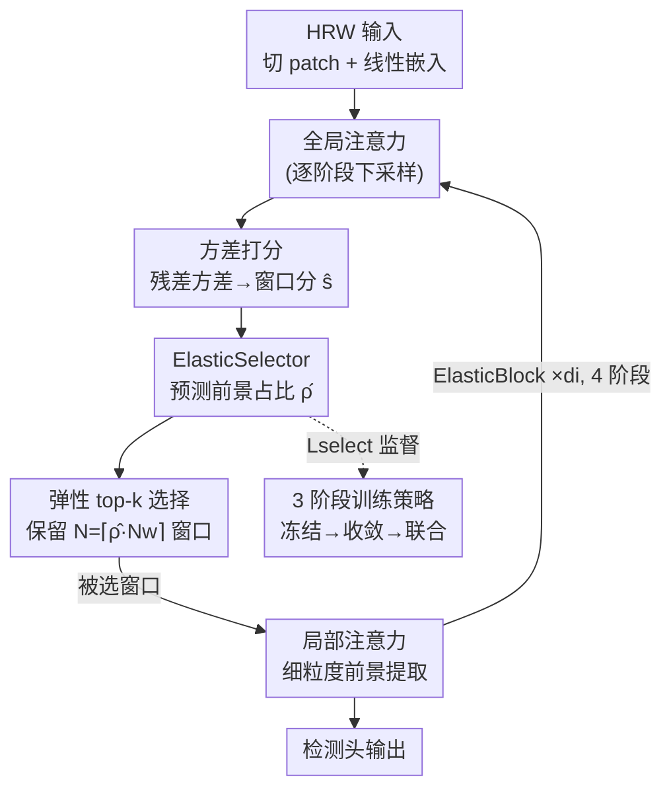

# ElasticFormer: Detecting Objects in HRW Shots via Elastic Computing Vision Transformer

**会议**: CVPR 2026  
**论文**: [CVF Open Access](https://openaccess.thecvf.com/content/CVPR2026/html/Li_ElasticFormer_Detecting_Objects_in_HRW_Shots_via_Elastic_Computing_Vision_CVPR_2026_paper.html)  
**代码**: 无  
**领域**: 目标检测  
**关键词**: 高分辨率宽视场检测, 稀疏ViT骨干, 自适应稀疏率, 前景比例预测, 弱监督检测  

## 一句话总结
ElasticFormer 给稀疏 ViT 骨干装上一个轻量模块 ElasticSelector，让它在前向时按图像「前景占比」动态决定每个阶段保留多少窗口做局部注意力，从而在 PANDA 十亿像素检测上把骨干 FLOPs 砍掉 80% 还反而把 AP50 提了上去。

## 研究背景与动机
**领域现状**：高分辨率宽视场（High-Resolution Wide，HRW）检测——无人机、卫星、全景相机拍出的吉像素（gigapixel）级图像中找目标——正成为热点。PANDA 这类数据集单图平均 25,000×16,000 像素，传统贴近拍摄（close-up）训练出来的检测器（Faster R-CNN、DINO、Deformable DETR 等）直接套上来既慢又不准。

**现有痛点**：HRW 图像有三个一起出现的麻烦。其一，前景极度稀疏——常规数据集前景覆盖 >50%，HRW 图像往往 <15%，剩下全是天空、植被这类背景，检测器大量算力被背景淹没；其二，分辨率从 COCO 的百万级飙到 PANDA 的十亿级，传统检测器计算量随输入尺寸多项式增长，推理慢上两个数量级，可 UAV 巡检、医学检测这些场景又要求实时；其三，目标数量在同一数据集里从几个到几十个剧烈波动，模型必须同时 hold 住稀疏和稠密两种极端。

**核心矛盾**：已有的稀疏骨干（SaccadeDet、SparseFormer）确实想到了「只算信息量大的区域」，但它们用的是**固定稀疏率**——比如 SparseFormer 预设保留 70% 的 token。固定比例在稀疏图上浪费算力（明明没几个目标却保留一大堆窗口），在稠密图上又分配不足（目标扎堆却被砍掉），根本对不上 HRW 场景里那种空间上忽稀忽密的目标分布。

**本文目标**：让骨干的算力分配「弹性化」——稀疏图少算、稠密图多算，且这个判断要细到骨干的每一个阶段、每一处局部区域，而不是对整图给一个固定比例。

**核心 idea**：用一个轻量模块按中间特征**预测整图前景占比 $\hat{\rho}$**，再以 $\hat{\rho}$ 当作稀疏率去做 top-k 窗口选择——把「保留多少窗口」从人手预设的常数，变成随输入内容自适应的变量。

## 方法详解

### 整体框架
ElasticFormer 是一个金字塔式的稀疏 ViT 骨干，整体沿用 Swin 那套「分 patch → 逐阶段下采样、通道翻倍」的结构，分 4 个阶段、深度为 [2, 2, 6, 2]。输入图像先切成 $\frac{H}{4}\times\frac{W}{4}\times48$ 的非重叠 patch，经线性嵌入投到 $C$ 通道；之后每阶段把特征图的宽高减半、通道翻倍。每个阶段内部由若干「ElasticBlock」堆叠，每个 ElasticBlock = **全局注意力 + 弹性选择 + 局部注意力** 成对出现。

关键的「弹性」发生在局部注意力之前：全局注意力出来的特征图被切成 $w\times w$ 的窗口（图示用 $w=3$，9 个窗口），先用一个**基于方差的打分模块**给每个窗口打分（前景多的窗口方差大、分高），再由 **ElasticSelector** 预测整图前景占比 $\hat{\rho}$，按 $\hat{\rho}$ 算出要保留的窗口数 $N$ 并做 top-k 选择——只有被选中的窗口送进局部注意力做细粒度前景特征提取，被丢弃的窗口直接跳过。同一张图，稀疏时可能 9 选 2，稠密时 9 选 8，算力随前景占比而非图像尺寸缩放。ElasticSelector 由一个专门的损失 $\mathcal{L}_{\text{select}}$ 监督，并配合 3 阶段训练策略在缺标注时也能工作。

### 关键设计

**1. 方差打分：用「背景比前景平坦」这个先验零成本找出目标窗口**

要做稀疏选择，先得有个便宜又靠谱的办法判断「哪个窗口可能有目标」。作者的观察是：天空、广场、马路这类背景像素分布更均匀（方差低），而目标区域纹理丰富（方差高）。于是不另起一个预测头，而是直接从特征里抽方差当分数。对特征图 $\mathbf{F}$（形状 $B\times H\times W\times C$）先做 $w\times w$ 平均池化再插值回原尺寸，得到的残差 $\mathbf{R}=\mathbf{F}-\text{Interpolate}(\text{AvgPool}_{w\times w}(\mathbf{F}))$ 恰好捕捉了局部方差；按窗口切成 $\mathbf{R}_k$ 后打分并 softmax 归一化：

$$s_k = f_{\text{score}}(\text{Flatten}(\mathbf{R}_k)), \qquad \hat{s}_k = \frac{\exp(s_k)}{\sum_{j=1}^{N_w}\exp(s_j)}$$

这样窗口分数与方差正相关，得到一个有序窗口序列供后续选择。消融里和「小型 objectness 预测头」「梯度密度」两种打分对比，方差打分把单阶段延迟从 1.213ms（objectness）压到 0.397ms，且 AP50 不降反略升（0.806 vs 0.803），因为它不引入额外网络组件、对噪声也不敏感。

**2. ElasticSelector：把「保留率」从预设常数改成逐阶段预测的前景占比**

这是全文的核心创新，专治固定稀疏率「稀疏图浪费、稠密图不够」的毛病。作者先给前景占比一个可解释的定义——所有目标框并集面积占整图的比例，再乘一个缩放因子 $\alpha\in(0,1)$（实验固定 0.8），因为骨干并不需要框内全部区域就能提特征，缩小一点能逼模型挑更关键的窗口：

$$\rho = \alpha\cdot\frac{\cup_i \text{BBox}_i}{H\cdot W}$$

ElasticSelector 则学着从特征里**预测**这个 $\rho$。由于 MLP 输入维度固定，先用自适应平均池化把特征图压到各阶段预设分辨率 $[32^2, 16^2, 8^2, 4^2]$ 再 Flatten，喂进两层轻量 MLP，最后 Sigmoid 保证输出落在 $[0,1]$：$\hat{\rho}^t = \sigma(f_{\text{pred}}(\mathbf{F}^t_{\text{flat}}))$。预测出的 $\hat{\rho}$ 直接当稀疏率，决定该阶段保留 $N=\lceil \hat{\rho}\cdot N_w\rceil$ 个最高分窗口（图中稀疏例 $N=\lceil 0.21\times 9\rceil=2$）。注意每个阶段独立预测、独立选择，所以算力是细粒度地随空间前景密度变化的。更妙的是这个模块**与骨干无关**——把 ElasticFormer 里的自注意力换成卷积就得到 ElasticNet，证明它能插到 CNN 骨干上。

**3. 无标注损失 + 3 阶段训练：让前景占比在没有框标注时也能学**

ElasticSelector 既是新模块就得有自己的损失。作者设计 $\mathcal{L}_{\text{select}}=(\rho-\hat{\rho})^2+\gamma\cdot\hat{\rho}$：前一项让预测逼近真实前景占比，后一项是对 $\hat{\rho}$ 本身的 L1 惩罚（$\gamma=0.1$），在预测够准之后**主动把保留率往小压**，进一步省算力。总损失 $\mathcal{L}_{\text{total}}=\mathcal{L}_{\text{bbox}}+\mathcal{L}_{\text{select}}$。这里的巧思是监督信号 $\rho$ 既可来自人工标注的 GT，也可来自模型自己产生的伪框（pseudo-GT），于是在弱监督检测（WSOD，没有框标注）里也能自监督训练。

但伪框带来一个鸡生蛋问题：训练初期模型吐的框乱七八糟，算出的密度无法指导 ElasticSelector，甚至会拖累；而骨干的 token 预算又由这个密度决定，密度被低估就会让骨干拿不到足够监督、难以收敛。为此引入 **3 阶段训练**：① 先冻结 ElasticSelector、强制骨干用**全部** token 训练（忽略 $\hat{\rho}$），保证骨干吃饱监督；② 骨干输出稳定后解冻 ElasticSelector 让它先收敛、拿到可靠密度估计，但此阶段 $\hat{\rho}$ 仍不参与选择；③ 真正启用 $\hat{\rho}$，让网络自主权衡算力与精度。三阶段共享 33 个 epoch，平衡 Phase 1 与 Phase 3 的长度是调优关键（实验里 Phase 1 取 24 epoch 时 AP50 最高）。

### 损失函数 / 训练策略
- ElasticSelector 损失：$\mathcal{L}_{\text{select}}=(\rho-\hat{\rho})^2+\gamma\hat{\rho}$，$\gamma=0.1$；逐阶段各算一份，让每阶段学各自特征图的特性。
- 总损失：$\mathcal{L}_{\text{total}}=\mathcal{L}_{\text{bbox}}+\mathcal{L}_{\text{select}}$。
- 3 阶段：冻结骨干全 token 训练 → 解冻 ElasticSelector 单独收敛（$\hat{\rho}$ 不生效）→ 启用 $\hat{\rho}$ 联合优化；总 33 epoch，Phase 2 约 3 epoch。
- 实现基于 MMDetection，统一 36-epoch 协议；测试时对裁出的 1280×800 窗口推理，弹性 FLOPs 取测试集平均。

## 实验关键数据

### 主实验（PANDA 吉像素基准）
GFLOPs 仅统计骨干+neck，F/B/O 分别指前景/背景/整体。ElasticFormer 的 FLOPs 因动态选择按测试集平均估计。

| 检测器组合 | 骨干 | GFLOPs-O | AP50 | AP_small |
|------|------|------|------|------|
| DINO | Swin-T | 132.84 | 0.606 | 0.367 |
| DINO + SparseFormer | SparseFormer | 75.71 | 0.780 | 0.508 |
| **DINO + ElasticFormer** | **ElasticFormer** | **13.13** | **0.806** | **0.515** |
| Dynamic-Head + SparseFormer | SparseFormer | 64.64 | 0.771 | 0.364 |
| **Dynamic-Head + ElasticFormer** | **ElasticFormer** | **13.49** | **0.782** | **0.409** |
| DINO + ElasticNet（CNN 版） | ElasticNet | 16.54 | 0.754 | 0.388 |

配 DINO 时，ElasticFormer 比 SparseFormer 高 3.3% AP50，整体 FLOPs 只有 13.13 GFLOPs——相对 SparseFormer 省 82.7%、相对 Swin-T 省 90.2%；背景区域只花 SparseFormer 浪费量的 8.9%。CNN 版 ElasticNet 相对 ResNet-50 省 87% 算力仍有竞争力。

### 消融实验

**训练策略（Table 3）**：各阶段窗口保留率 + AP50。

| 策略 | 监督 | Stage1 | Stage2 | Stage3 | Stage4 | AP50 |
|------|------|------|------|------|------|------|
| 1-phase | GT | 15.11 | 15.32 | 12.79 | 15.73 | 0.791 |
| 1-phase | Pseudo-GT | 14.02 | 14.24 | 9.80 | 12.97 | 0.784 |
| 3-phase | GT | 14.15 | 14.55 | 13.28 | 14.95 | 0.798 |
| **3-phase** | **Pseudo-GT** | 11.31 | 10.41 | 7.56 | 12.09 | **0.806** |

**$\alpha$ / $\gamma$ 联合消融（Table 4，F-ratio = FLOPs-F/FLOPs-O）**：

| $\alpha$ | $\gamma$ | AP50 | GFLOPs-O | F-ratio(%) |
|------|------|------|------|------|
| 1.0 | 0.1 | 0.802 | 14.98 | 45.7 |
| **0.8** | **0.1** | **0.806** | 13.13 | 53.5 |
| 0.8 | 0.3 | 0.795 | 10.28 | 53.3 |
| 0.6 | 0.1 | 0.799 | 11.52 | 55.2 |

### 关键发现
- **3-phase 全面优于 1-phase**，证明前期 $\hat{\rho}$ 噪声确实有害，需要先把骨干和选择器分别养稳；有趣的是 3-phase 下 **Pseudo-GT 反而比 GT 强**（0.806 vs 0.798），作者解释为伪标签噪声在联合阶段起到了正则、增强了泛化。
- **Stage 3 的保留率系统性最低**（7.56%）。作者推测这与网络深度的适配有关：深层 Elastic Selection 执行次数多（depth=6），每次选更少但更关键的窗口，靠多次选择累积出前景覆盖；坦承这是 tentative 的解释，⚠️ 以原文为准。
- **$\alpha=0.8$ 是 AP50 甜点**：$\alpha$ 越小监督信号 $\rho$ 越小、FLOPs 越低且 F-ratio 越高（更聚焦前景），但 AP50 并非单调，0.8 处最优；$\gamma$ 越大越省算力但掉 AP50，体现效率-精度权衡。
- **泛化到非 HRW 场景**：在 PASCAL VOC 2007 的 WSOD 任务上（图像仅 $10^5$ 像素量级），ElasticFormer 相对 Swin-T 省 70% 算力，mAP 50.9 / CorLoc 63.9 同时领先 SparseFormer，说明弹性计算不止吃 HRW 这一口饭。

## 亮点与洞察
- **把「稀疏率」从超参变成可学习的图像属性**：固定比例方法本质是对前景密度的一个先验常数，ElasticFormer 直接让模型预测前景占比当稀疏率，这是从「人设阈值」到「数据驱动」的干净一跃，且预测目标（前景框并集比例）有清晰几何含义、可解释。
- **方差打分是个零成本好 trick**：不加预测头、用 `F - Interpolate(AvgPool(F))` 的残差当方差代理就能区分前景/背景，延迟比 objectness 头低 3 倍还不掉点——这个「局部方差当显著性」的思路可迁移到任何需要轻量区域筛选的任务（如 token 剪枝、ROI 预筛）。
- **骨干无关性是被认真验证过的卖点**：同一个 ElasticSelector 插 Transformer 得 ElasticFormer、插 CNN 得 ElasticNet 都有效，说明「按前景占比分配算力」是个独立于骨干的通用机制，而非某个架构的耦合 trick。
- **3 阶段训练直面伪标签冷启动**：先全 token 喂饱骨干、再单独养选择器、最后联合，这套「分阶段解耦再耦合」的课程对任何「预测模块反过来控制主干算力预算」的自指结构都有借鉴意义。

## 局限与展望
- 作者承认 **Stage 3 保留率偏低**的机制只是推测性讨论，没深入解释，弹性分配在深层为何如此仍是黑盒。
- 前景占比定义依赖框并集面积，$\alpha=0.8$ 等关键系数靠网格搜索定，跨数据集是否稳健、对极端长宽比或密集小目标是否要重调，文中未充分探讨（⚠️ 我的观察）。
- 评测主要在 PANDA（人为中心 gigapixel）和 VOC 上，对卫星/医学等其它 HRW 模态、以及多类别长尾分布下的弹性行为缺少验证。
- top-k 选窗口本质是硬选择，被丢窗口若藏有极小目标会直接漏检；自适应稀疏在「极稀疏但目标关键」的安全敏感场景下风险如何，值得补充分析。

## 相关工作与启发
- **vs SparseFormer**：同样走稀疏 token，但 SparseFormer 用固定稀疏率（预设 0.7），稀疏图浪费、稠密图不足；ElasticFormer 逐阶段预测前景占比当稀疏率，做到稀疏少算稠密多算，因而在更低 FLOPs 下反超 3.3% AP50。
- **vs SaccadeDet**：SaccadeDet 用辅助网络预测候选区域，引入级联延迟且难应对 HRW 的极端尺度变化；ElasticFormer 的方差打分不依赖额外网络、延迟极低。
- **vs DynamicDet**：DynamicDet 按预测难度对整图二分路由、维护双分支，粒度太粗也笨重；ElasticFormer 在骨干内部逐窗口、逐阶段做细粒度算力调制，无需双分支。

## 评分
- 新颖性: ⭐⭐⭐⭐ 把固定稀疏率换成可学习的前景占比预测，配方差打分与无标注损失，思路干净且填补了「跨阶段按空间密度调制 token」的空白。
- 实验充分度: ⭐⭐⭐⭐ PANDA 主实验 + WSOD 泛化 + 骨干无关性 + $\alpha/\gamma$/打分机制/训练策略多组消融，较完整；非人体中心 HRW 模态未覆盖。
- 写作质量: ⭐⭐⭐ 方法与动机讲得清楚、图表配套，但英文表述有不少笔误，个别机制（Stage3 现象）只点到为止。
- 价值: ⭐⭐⭐⭐ 80%+ FLOPs 削减且精度反升，对吉像素实时检测落地很实用，弹性计算 + 方差打分两个 trick 可迁移性强。

<!-- RELATED:START -->

## 相关论文

- [\[CVPR 2026\] Show, Don't Tell: Detecting Novel Objects by Watching Human Videos](show_dont_tell_detecting_novel_objects_by_watching.md)
- [\[CVPR 2026\] Detecting Unknown Objects via Energy-Based Separation for Open World Object Detection](detecting_unknown_objects_via_energy-based_separation.md)
- [\[CVPR 2026\] VisualAD: Language-Free Zero-Shot Anomaly Detection via Vision Transformer](visualad_language-free_zero-shot_anomaly_detection_via_vision_transformer.md)
- [\[ECCV 2024\] GRA: Detecting Oriented Objects Through Group-Wise Rotating and Attention](../../ECCV2024/object_detection/gra_detecting_oriented_objects_through_group-wise_rotating_and_attention.md)
- [\[AAAI 2026\] Temporal Object-Aware Vision Transformer for Few-Shot Video Object Detection](../../AAAI2026/object_detection/temporal_object-aware_vision_transformer_for_few-shot_video_object_detection.md)

<!-- RELATED:END -->
