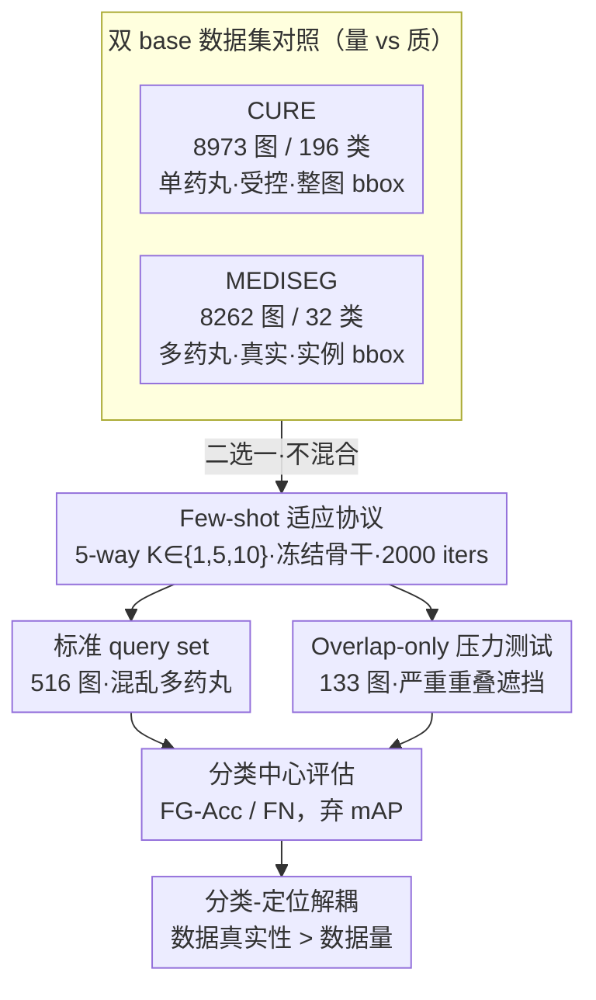

# Evaluating Few-Shot Pill Recognition Under Visual Domain Shift

**会议**: CVPR 2026  
**arXiv**: [2603.10833](https://arxiv.org/abs/2603.10833)  
**代码**: 无（基于 FsDet/Detectron2 开源框架）  
**领域**: 目标检测 / 医学图像  
**关键词**: few-shot object detection, pill recognition, domain shift, deployment readiness, cross-dataset evaluation

## 一句话总结
本文从部署视角系统评估药丸识别在跨域few-shot条件下的泛化能力，揭示语义分类1-shot即饱和但定位/recall在重叠遮挡下急剧下降的解耦现象，并证明训练数据的视觉真实性远比数据量或shot数更关键。

## 研究背景与动机

**领域现状**：药品不良事件（ADE）是可预防性医疗伤害的重要来源，自动药丸识别系统被寄予厚望。现有系统多在受控条件下（单药丸、干净背景、统一光照）训练和评估，表现优异。

**现有痛点**：实际部署场景与受控环境差异巨大——药丸存放在dosette box中，多药丸重叠、遮挡、反光、背景杂乱。现有few-shot药丸识别研究几乎都在同分布数据上评估（训练和测试来自相似视觉条件），报告的高精度可能严重高估了真实鲁棒性。

**核心矛盾**：few-shot学习能否在跨域场景下保持有效？现有评估协议回避了最关键的部署挑战——训练数据（受控单药丸）和部署环境（混乱多药丸场景）之间存在系统性domain shift。标准的mAP指标在标注异构条件下也无法公平比较。

**本文目标**
   - 跨数据集domain shift下few-shot适应的真实泛化能力如何？
   - base训练数据的视觉真实性vs数据量，哪个更影响few-shot表现？
   - 语义分类和定位性能在few-shot+遮挡条件下是否一致？
   - few-shot fine-tuning能否作为部署就绪性的诊断工具？

**切入角度**：不追求架构创新，而是设计严格的跨域评估协议（CURE受控单药丸 vs MEDISEG真实多药丸 → 新部署环境），用classification-centric metrics替代传统mAP来公平评估。

**核心 idea**：将few-shot fine-tuning重新定位为部署就绪性诊断工具，通过跨域+重叠压力测试暴露分类-定位解耦的系统性失败模式。

## 方法详解

### 整体框架
本文不提新模型，而是搭一套能**逼出真实部署失败**的评估装置。骨架是经典的两阶段few-shot检测：基于FsDet（Frustratingly Simple Few-Shot Object Detection）/ Faster R-CNN，先在一个 base 数据集上训练得到通用检测能力，再用部署数据集的少量样本（1/5/10-shot）微调到 novel 类别。

关键在于怎么"喂"和怎么"测"。喂的一端，作者刻意准备了两个视觉真实度天差地别的 base 数据集（受控单药丸 vs 真实多药丸），用它们去隔离"训练数据真实性"这个变量；测的一端，作者放弃了在异构标注下会失真的 mAP，改用分类中心的指标，并额外切出一个全是重叠遮挡的压力测试集。整条流水线是：在 CURE 或 MEDISEG 上做 base training → 用部署数据集的 K-shot 支持集微调 → 在 516 张多药丸混乱场景的 query set 上评估，再在 133 张严重重叠场景上做 overlap-only 压力测试。

### 关键设计

**1. 双 base 数据集对照：把"数据量"和"视觉真实性"拆开看**

标准 few-shot 检测往往只在一个分布里划分 base/novel，根本测不出"训练时见过的世界和部署时面对的世界不一样"会带来什么。本文用两个类别完全不重叠、都不与 novel 类混合的 base 域来制造对照：CURE 有 8973 张图、196 个类，但全是单药丸、受控光照、整图级 bbox 标注，属于"量大类多但简单"；MEDISEG 只有 8262 张图、32 个类，却是多药丸真实场景、实例级 bbox 标注，属于"量小类少但视觉复杂"。两者刚好构成一个天然的"量 vs 质"实验——后面实验里 MEDISEG 在最难条件下反超 CURE，正是靠这个对照才能把功劳归到"视觉真实性"而非数据规模上。

**2. Few-shot 适应协议：固定预算 + 冻结骨干，保证差异只来自 base 域**

要让"哪个 base 域更好"这个结论可信，就必须堵死所有混淆变量。作者在 novel 部署数据集上做 5-way $K$-shot 适应，$K \in \{1, 5, 10\}$，支持集从部署集采样，query set（516 图）和 overlap-only set（133 图）严格分离、不与支持集重叠。微调一律固定 2000 iterations，SGD + momentum 0.9、lr $=1\times10^{-3}$，backbone 冻结、只动 ROI heads 和受限学习率的部分 RPN。固定迭代数消除了训练时长的混淆，冻结骨干保住了 base 阶段学到的通用特征，严格的数据分离则排除了泄露——这样一来观察到的性能差异就只能归因于 base 域特性本身。

**3. 分类中心评估体系：用 FG-Acc 和 FN 绕开异构标注下失真的 mAP**

CURE 是整图 bbox、MEDISEG 是实例 bbox，两者的 IoU 匹配口径根本不一致，跨标注策略直接比 AP 是不公平的，而且 AP 会把"认错了"和"框歪了"两类错误揉在一起、掩盖真正的失败模式。作者因此把主指标换成前景分类准确率与假阴性率：

$$\text{FG-Acc} = \frac{\text{正确前景分类数}}{\text{总前景提议数}}, \qquad \text{FN} = \frac{\text{漏检 GT 目标数}}{\text{总 GT 目标数}}$$

再配上 RPN 分类 loss 和总 loss 作为辅助。FG-Acc 衡量"框对了之后认得对不对"（语义识别），FN 衡量"该检的有没有漏"（定位/recall），两者一拆开，分类成功但定位崩塌的现象才暴露得出来——这正是后面"分类-定位解耦"结论的度量基础。

**4. Overlap-only 压力测试：把最难的遮挡场景单独拎出来**

标准 query set 里简单图和困难图混在一起，平均下来会把"遮挡场景已经崩了"这件事冲淡。作者从部署数据集中人工筛出 133 张确有显著遮挡 / 边界模糊的药丸场景，逐张验证并提供实例级 bbox + 分割 mask 标注，构成一个与标准评估共享 label space、只改变场景结构的独立测试集。它把最具挑战的视觉条件隔离出来单测，直接把模型在重叠下的脆弱性顶到台面上——实验中 CURE 1-shot 的 FG-Acc 从标准集的 0.989 暴跌到这里的 0.131，全靠这个设计才看得见。

### 训练策略
Base training 用标准 Faster R-CNN，配置固定、不随实验变化。Few-shot fine-tuning 阶段采用 SGD（momentum 0.9、weight decay $1\times10^{-4}$、lr $1\times10^{-3}$）跑 2000 iterations；backbone（ResNet + FPN）冻结，RPN 以受限学习率部分可训练，ROI heads 全量微调，分类层为 novel 类重新初始化。除 Detectron2 标准变换外不加任何额外数据增强，以免增强本身成为又一个混淆因素。

## 实验关键数据

### 主实验：标准评估集上的Few-shot适应

| 配置 | FG分类准确率 | 假阴性率 | 分类Loss | 总Loss |
|------|-------------|---------|---------|--------|
| CURE 1-shot | 0.989 ± 0.001 | 0.011 | 0.008 | 0.015 |
| CURE 5-shot | 0.981 ± 0.002 | 0.009 | 0.023 | 0.036 |
| CURE 10-shot | 0.977 ± 0.003 | 0.009 | 0.034 | 0.055 |
| MEDISEG 1-shot | 0.994 ± 0.005 | 0.006 | 0.011 | 0.021 |
| MEDISEG 5-shot | 0.990 ± 0.002 | 0.005 | 0.010 | 0.019 |
| MEDISEG 10-shot | 0.983 ± 0.002 | 0.005 | 0.019 | 0.030 |

**关键发现**：语义分类在1-shot就已饱和（CURE 0.989, MEDISEG 0.994），增加shot甚至轻微下降。MEDISEG base training的假阴性率比CURE低45%（0.006 vs 0.011）。

### Overlap-only压力测试

| 配置 | FG分类准确率 | 假阴性率 | 分类Loss | RPN Loss | 总Loss |
|------|-------------|---------|---------|----------|--------|
| CURE 1-shot | 0.131 | 0.816 | 0.351 | 0.863 | 1.326 |
| CURE 5-shot | 0.372 | 0.465 | 0.421 | 0.224 | 0.844 |
| CURE 10-shot | 0.558 | 0.342 | 0.320 | 0.133 | 0.674 |
| MEDISEG 1-shot | 0.406 | 0.513 | 0.383 | 0.312 | 0.963 |
| MEDISEG 5-shot | 0.625 | 0.246 | 0.279 | 0.182 | 0.680 |
| MEDISEG 10-shot | 0.740 | 0.210 | 0.191 | 0.059 | 0.445 |

### 关键发现

- **分类vs定位解耦**：标准评估中FG-Acc接近1.0，但overlap场景中CURE 1-shot暴跌至0.131（-87%），MEDISEG也降至0.406——语义识别在定位成功时仍然可靠，但重叠导致定位和recall急剧下降
- **训练数据真实性 > 数据量**：在最困难的1-shot overlap条件下，MEDISEG（类别少、数据少但真实）的FG-Acc是CURE（类别多、数据多但简单）的3.1倍（0.406 vs 0.131）。这个优势在所有shot设置中一致存在
- **递减回报**：1→5-shot提升巨大（MEDISEG overlap FG-Acc从0.406→0.625，+54%），5→10-shot提升明显减缓（+18%），支持中等监督量即可的实用建议
- **标准差下降**：MEDISEG 1-shot FG-Acc标准差±0.005，5-shot降至±0.002（-60%），更多supervision主要提升稳定性而非精度

## 亮点与洞察

- **Few-shot fine-tuning作为诊断工具**：这是本文最具洞察的贡献。不把few-shot仅当数据高效适应策略，而是利用不同shot level暴露模型的稳定性-鲁棒性权衡和domain sensitivity，对部署决策有直接指导意义
- **分类-定位解耦的清晰揭示**：通过classification-centric metrics（而非仅mAP）和overlap压力测试，定量分离了语义识别和空间定位的不同失败模式。这一发现可迁移到所有密集/遮挡场景的目标检测评估中
- **评估协议设计**：面对标注异构的务实做法——放弃AP、聚焦分类指标——值得在跨数据集评估中推广

## 局限与展望

- **作者承认的局限**：CURE全图bbox限制了定位指标的使用；非标准few-shot benchmark导致无法与其他方法直接对比；novel类别数受限于标注成本
- **架构层面未探索**：仅用FsDet/Faster R-CNN，未尝试更强的few-shot检测器（如DeFRCN、FSCE等），也未比较不同backbone。不清楚观察到的分类-定位解耦是否与架构无关
- **缺乏解决方案**：发现了问题但未提出改进方法。可考虑：(1) 遮挡感知的region proposal增强；(2) 在few-shot阶段引入overlap-aware数据增强；(3) base+novel混合训练策略
- **定位改进方向**：可尝试将实例分割mask（论文中已标注）用于训练而非仅用于评估，看能否改善重叠场景的定位

## 相关工作与启发

- **vs 传统few-shot检测评估**：传统方法（TFA、FsDet、FSCE等）在PASCAL VOC/COCO的子集划分上评估，训练和测试来自同一分布。本文引入的跨数据集评估揭示了同分布评估掩盖的真实失败模式
- **vs EPillID / CURE原始工作**：这些工作在受控条件下展示了promising结果，但本文证明这些结果在部署环境下不可靠，特别是重叠场景
- **启发**：将"few-shot作为诊断"的思路迁移到自动驾驶、工业检测等安全关键领域——用不同shot level和域外数据probe模型弱点，比追求SOTA更有部署价值

## 评分
- 新颖性: ⭐⭐⭐ 非架构创新，但"few-shot作为诊断工具"的视角新颖，评估协议设计有创意
- 实验充分度: ⭐⭐⭐⭐ 两个base domain对比+标准/overlap双评估+多shot设置+定量+定性分析，实验设计严谨
- 写作质量: ⭐⭐⭐⭐ 论述清晰，实验动机和结论链条完整，分类-定位解耦的论证层层递进
- 价值: ⭐⭐⭐⭐ 对医疗AI部署有直接指导意义，揭示的"数据真实性>数据量"和"分类-定位解耦"具有普适参考价值

<!-- RELATED:START -->

## 相关论文

- [\[CVPR 2026\] Remedying Target-Domain Astigmatism for Cross-Domain Few-Shot Object Detection](remedying_target-domain_astigmatism_for_cross-domain_few-shot_object_detection.md)
- [\[CVPR 2026\] Learning Multi-Modal Prototypes for Cross-Domain Few-Shot Object Detection](learning_multi-modal_prototypes_for_cross-domain_few-shot_object_detection.md)
- [\[CVPR 2026\] UniSpector: Towards Universal Open-set Defect Recognition via Spectral-Contrastive Visual Prompting](unispector_towards_universal_open-set_defect_recognition_via_spectral-contrastiv.md)
- [\[CVPR 2026\] A Closer Look at Cross-Domain Few-Shot Object Detection: Fine-Tuning Matters and Parallel Decoder Helps](a_closer_look_at_cross-domain_few-shot_object_detection_fine-tuning_matters_and_.md)
- [\[CVPR 2026\] SubspaceAD: Training-Free Few-Shot Anomaly Detection via Subspace Modeling](subspacead_training-free_few-shot_anomaly_detection_via_subspace_modeling.md)

<!-- RELATED:END -->
