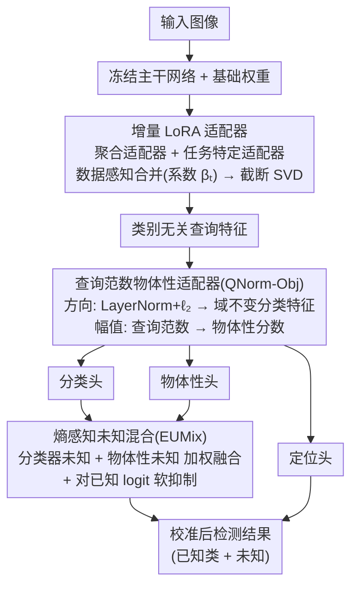

<!-- 由 src/gen_stubs.py 自动生成 -->
# EW-DETR: Evolving World Object Detection via Incremental Low-Rank DEtection TRansformer

**会议**: CVPR2026  
**arXiv**: [2602.20985](https://arxiv.org/abs/2602.20985)  
**代码**: 待确认  
**领域**: 目标检测  
**关键词**: 开放世界目标检测, 增量学习, 域适应, 未知目标检测, LoRA, DETR

## 一句话总结

提出 Evolving World Object Detection (EWOD) 范式及 EW-DETR 框架，通过增量 LoRA 适配器、查询范数物体性适配器和熵感知未知混合三个协同模块，在无样本回放条件下同时解决类别增量学习、域迁移适应和未知目标检测问题，FOGS 指标提升 57.24%。

## 研究背景与动机

**现实部署需求**：自动驾驶、仓储机器人等场景要求检测器持续识别新目标类别（如新型车辆）、适应多变环境（白天→夜晚→雾天），并将未见过的物体标记为"未知"以避免灾难性失败。

**现有范式的局限**：开放世界目标检测 (OWOD) 假设单一静态域且依赖样本回放；域增量检测 (DIOD) 和双增量检测 (DuIOD) 则采用闭集假设，无法处理未知目标。

**无回放约束**：隐私法规和存储限制使得保留过去训练数据不切实际，现有 OWOD 方法 (ORE, OW-DETR, CAT, PROB, OWOBJ) 均依赖样本回放缓冲区，在严格无回放条件下失效。

**域迁移与遗忘的耦合**：类别空间演变与视觉域迁移同时发生，导致特征空间剧烈变化，标准方法要么将未知物体误分类为已知类别，要么将其吸收到背景类中。

**严重的数据不平衡**：不同任务的域和类别分布差异巨大，导致各任务样本量极不均匀，简单的适配器合并策略无法有效平衡稳定性与可塑性。

**缺乏统一评估指标**：现有指标要么只衡量遗忘（如 $\mathcal{F}_{\text{map}}$），要么只关注未知检测（U-Recall），无法全面评估 EWOD 三个维度的耦合性能。

## 方法详解

### 整体框架

EW-DETR 基于 DETR 系列检测器（支持 Deformable DETR 和 RF-DETR），冻结主干网络和基础权重，在 Transformer 编码器-解码器的线性层上附加两组 LoRA 适配器。输入图像经冻结主干和带适配器的编码器-解码器处理后，生成类别无关的查询特征，再经查询范数物体性适配器（QNorm-Obj）重参数化，分别送入分类头、物体性头和定位头，最终由熵感知未知混合（EUMix）模块融合输出校准后的检测结果。

### 关键设计

**1. 增量 LoRA 适配器：无回放也能记住历史任务**

隐私和存储约束下不能保留旧数据，但类别和域又在不断演变，简单合并适配器无法平衡稳定与可塑。EW-DETR 用双适配器化解：一个**聚合适配器** $\Delta\mathbf{W}_{\text{agg}}^{t-1}$ 作为不可训练缓冲区，积累所有历史任务的压缩知识；一个**任务特定适配器** $\Delta\mathbf{W}_{\text{task}}^{t}$ 是可训练参数，专抓当前任务的类别/域变化、任务切换后重置。关键在**数据感知合并**——按当前任务样本量 $N_t$ 与历史累积量 $N_{1:t-1}$ 的比值自适应算出合并系数 $\beta_t$，让样本少的任务获得更大话语权、不被大任务淹没：

$$\Delta\mathbf{W}_{\text{merged}}^{t} = (1-\beta_t)\Delta\mathbf{W}_{\text{agg}}^{t-1} + \beta_t\Delta\mathbf{W}_{\text{task}}^{t}$$

合并后再用截断 SVD 投影回低秩空间，把参数效率维持住。这套机制让模型在零回放下抗遗忘（FSS 飙到 98.11），可训练参数只剩百万级。

**2. 查询范数物体性适配器：用 DETR 查询范数当域鲁棒的物体性信号**

域迁移会让标准方法要么把未知误判成已知、要么把它吞进背景。EW-DETR 利用 DETR 解码器查询本身类别无关的特性，把语义和幅值解耦：**方向**上对解码器特征先 LayerNorm 再 $\ell_2$ 归一化，得到域不变的分类特征 $\mathbf{h}_{\text{norm}}$，与原始特征用可学习系数 $\alpha_{\text{mix}}$ 凸组合；**幅值**上则利用"匹配到真实物体的查询范数更大"这一经验，把标量范数 $\|\mathbf{h}_i\|_2$ 送进物体性 MLP 并温度缩放，当作类别无关的物体性分数。整套设计不需要任何辅助损失或额外监督，仅靠标准检测损失隐式训练，就能产出对域迁移鲁棒的物体性估计。

**3. 熵感知未知混合（EUMix）：融合两路不确定性给出校准的未知分数**

单看分类器或单看物体性都不足以稳健地判未知。EUMix 把两路证据融起来：**物体性驱动的未知概率** $p_{\text{obj}}^{\text{unk}}$ 在"检测器认为有物体但所有已知类都不确定"时升高，**分类器驱动的未知概率** $p_{\text{cls}}^{\text{unk}}$ 来自学到的未知 logit，二者用可学习权重 $\alpha$ 混合：$p_{\text{final}}^{\text{unk}} = \alpha\, p_{\text{cls}}^{\text{unk}} + (1-\alpha)\, p_{\text{obj}}^{\text{unk}}$，同时对已知类 logit 施加与物体性未知分数成正比的软抑制。这样既不轻易把未知吞进已知，又能在域迁移下把真正的未知顶出来。

### 损失函数

使用标准 DETR 检测损失（匈牙利匹配 + 分类损失 + 边框回归损失），无需任何额外的未知监督损失或辅助损失。

## 实验

### 主要结果

**Pascal Series: VOC→Clipart（两阶段）**

| 方法 | 可训练参数(M) | FSS↑ | OSS↑ | GSS↑ | FOGS↑ |
|------|-------------|------|------|------|-------|
| ORE (CVPR'21) | — | 5.05 | 0 | 55.48 | 11.37 |
| OW-DETR (CVPR'22) | — | 5.54 | 11.42 | 40.47 | 7.96 |
| ORTH (CVPR'24) | 105.9 | 16.59 | 5.83 | 51.06 | 32.44 |
| DuET (ICCV'25) | 24.22 | 8.47 | 41.05 | 35.49 | 1.46 |
| **EW-DETR (D-DETR)** | **0.46** | 25.73 | 64.86 | 61.67 | 7.92 |
| **EW-DETR (RF-DETR)** | **1.8** | 45.08 | **96.19** | **78.62** | **8.42** |

EW-DETR (RF-DETR) 在 FOGS 综合指标上达到 **61.08**，比最佳基线 ORTH 的 29.78 提升 **105%**。

**Diverse Weather 多阶段结果**

EW-DETR (RF-DETR) 在所有域迁移场景中均获得最高 FOGS，平均 FOGS 达 52.33，跨 10 个基准测试一致领先。

### 消融实验

| 配置 | FSS↑ | OSS↑ | GSS↑ | FOGS↑ |
|------|------|------|------|-------|
| Baseline | 7.52 | 33.78 | 51.49 | 30.87 |
| + Incre. LoRA | **98.11** | 33.53 | 0.07 | 43.90 |
| + LoRA + QNorm-Obj | 97.78 | 42.04 | 5.07 | 48.30 |
| + LoRA + QNorm-Obj + EUMix | 96.19 | **78.62** | **8.42** | **61.08** |

### 关键发现

1. **增量 LoRA 适配器**是抗遗忘的核心（FSS 从 7.52 飙升至 98.11），同时将可训练参数减少 94.2%，但严重牺牲可塑性（当前任务 mAP 降至 0.07）。
2. **QNorm-Obj** 通过解耦物体性特征部分恢复开放集能力（U-Recall 提升），且保持高遗忘抵抗。
3. **EUMix** 与前两个模块协同作用最为显著，不仅大幅提升未知检测（OSS 从 42.04 到 78.62），还增强了当前任务泛化能力。
4. t-SNE 可视化显示 EW-DETR 是唯一在严重域迁移下（VOC→Clipart）仍能保持类别聚类清晰分离的方法。

## 亮点

- **首创 EWOD 范式**：统一了增量学习、域适应和未知检测三大挑战，比 OWOD/DuIOD 更贴近真实部署场景
- **极致参数效率**：仅需 1.8M 可训练参数（对比 ORTH 的 105.9M），通过双 LoRA + SVD 压缩实现零回放增量学习
- **无辅助损失的未知检测**：QNorm-Obj 巧妙利用查询范数作为物体性信号，无需额外监督即可检测未知物体
- **提出 FOGS 综合指标**：从遗忘、开放性、泛化三个维度统一评估，填补了 EWOD 评估体系的空白
- **通用性强**：框架可泛化到不同 DETR 变体，成功让 SOTA 的 RF-DETR 在开放世界设定下工作

## 局限性

- **泛化子分数偏低**：虽然 FOGS 整体领先，但 GSS（跨域泛化）在部分场景仅为个位数，说明新类别向旧域的迁移仍是瓶颈
- **仅验证在 DETR 系列**：未探索对 YOLO 等非 Transformer 检测器的适用性
- **数据集规模有限**：Pascal Series 和 Diverse Weather 类别数较少（最多 20 类），更大规模场景（如 COCO 级别）的表现未知
- **合并系数设计简单**：$\beta_t$ 仅基于样本量比例，未考虑域间相似度或类别难度等因素
- **未知类别无细粒度区分**：所有未知物体统一为一个"unknown"类，无法进一步发现或聚类未知子类

## 相关工作

- **OWOD 系列**：ORE → OW-DETR → CAT → PROB → ORTH → OWOBJ，均假设单一静态域+样本回放
- **增量检测**：CIOD 方法依赖知识蒸馏和回放；DIOD (LDB) 学习域偏置但闭集；DuET 通过任务算术做双增量但无未知建模
- **LoRA 在检测中的应用**：本文首次将 LoRA 的双适配器+数据感知合并用于增量目标检测
- **DETR 物体性建模**：利用解码器查询的类别无关特性进行物体性估计，与 OWOBJ 的概率建模路线不同

## 评分

- 新颖性: ⭐⭐⭐⭐⭐ — EWOD 范式定义和三模块协同设计均为首创
- 实验充分度: ⭐⭐⭐⭐ — 10个基准+完整消融+t-SNE可视化，但缺少大规模数据集验证
- 写作质量: ⭐⭐⭐⭐ — 问题定义清晰、图表精美，公式推导完整
- 价值: ⭐⭐⭐⭐ — 填补了实际部署场景的重要空白，FOGS 指标有推广潜力

<!-- RELATED:START -->

## 相关论文

- [\[CVPR 2026\] Detecting Unknown Objects via Energy-Based Separation for Open World Object Detection](detecting_unknown_objects_via_energy-based_separation.md)
- [\[CVPR 2026\] FSLoRA: Harmonizing Detection and Re-Identification via Freq-Spatial Low-Rank Adapter for One-Stage Person Search](fslora_harmonizing_detection_and_re-identification_via_freq-spatial_low-rank_ada.md)
- [\[CVPR 2026\] Parameterized Prompt for Incremental Object Detection](parameterized_prompt_for_incremental_object_detection.md)
- [\[CVPR 2026\] RARE: Learn to RAnk and REtrieve for Monocular 3D Object Detection](rare_learn_to_rank_and_retrieve_for_monocular_3d_object_detection.md)
- [\[CVPR 2026\] Multi-view Crowd Tracking Transformer with View-Ground Interactions Under Large Real-World Scenes](multi-view_crowd_tracking_transformer_with_view-ground_interactions_under_large_.md)

<!-- RELATED:END -->
