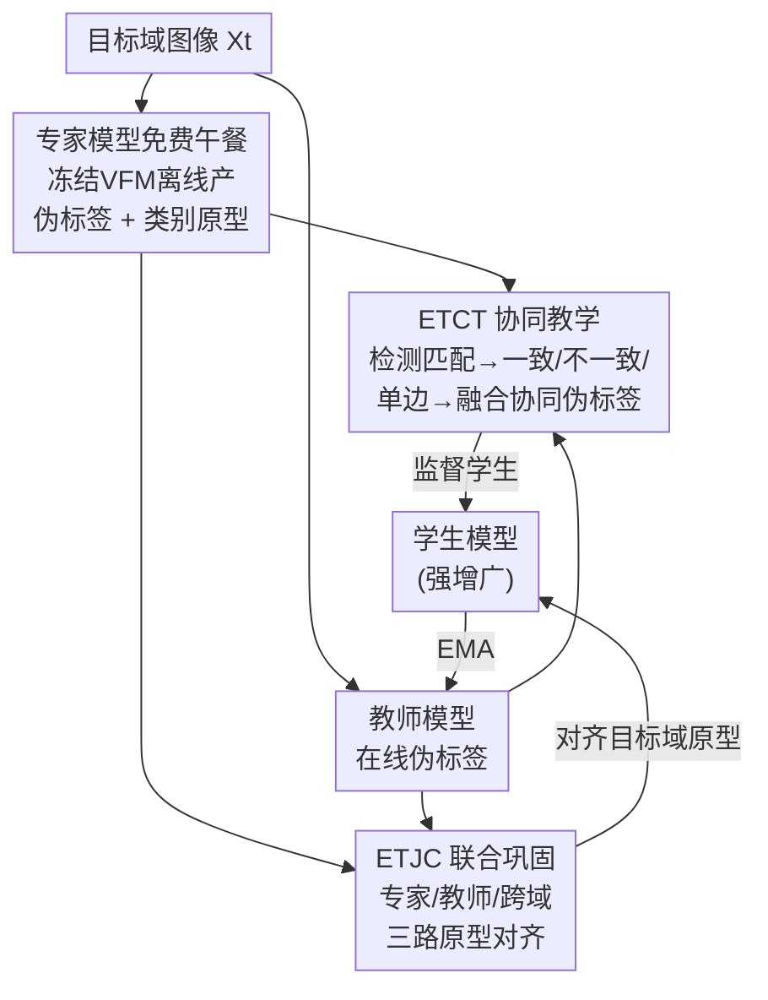

# Expert-Teacher-Student Collaborative Learning for Domain Adaptive Object Detection

**会议**: CVPR 2026  
**论文**: [CVF Open Access](https://openaccess.thecvf.com/content/CVPR2026/html/Cui_Expert-Teacher-Student_Collaborative_Learning_for_Domain_Adaptive_Object_Detection_CVPR_2026_paper.html)  
**代码**: 待确认  
**领域**: 目标检测 / 域适应目标检测  
**关键词**: 域适应目标检测, 教师-学生框架, 视觉基础模型, 伪标签, 原型对齐  

## 一句话总结
针对域适应目标检测中"视觉基础模型(VFM)知识太泛、教师模型知识太窄"的互补困境，本文提出 Expert-Teacher-Student(ETS)框架：把 VFM 当作"免费午餐"式的专家模型离线产出伪标签和原型，再通过 ETCT(标签级协同教学)和 ETJC(表征级联合巩固)双层机制让专家与教师协同监督学生，在三个 DAOD 基准上超越 SOTA(如 Cityscapes→BDD100k 达 49.8% mAP，比 DT 高 2.0%)。

## 研究背景与动机
**领域现状**：域适应目标检测(DAOD)的主流范式是**教师-学生自训练框架**——教师模型在目标域上产出伪标签来监督学生，教师再用学生权重的指数滑动平均(EMA)更新。核心难点一直是"如何产出高质量伪标签，防止自训练崩塌"。近年又出现一类新做法：直接引入在网络规模数据上预训练的**视觉基础模型(VFM，如 DINOv2/DINOv3/Grounding DINO)**来注入泛化知识，代表作 DT 干脆用冻结的 DINOv2 替换掉教师模型，把它当离线打标器并做特征对齐。

**现有痛点**：两条路线各有死穴。纯教师-学生框架受限于**小骨干网络 + 闭环内部知识**，面对域差异时伪标签噪声大、容易陷入性能瓶颈甚至训练崩塌。而纯 VFM 路线(DT)的问题在于——VFM 的泛化知识**并非为特定目标域定制**，它擅长抓域不变线索(如靠轮廓识别被遮挡的车)，却无法提供对目标域特性的精准指导(如雾天里识别远处被浓雾覆盖的车)。

**核心矛盾**：专家(VFM)的"泛化知识"和教师的"域特定知识"是**互补**的，但现有方法非此即彼——要么丢掉 VFM 的泛化力，要么丢掉教师逐步蒸馏出的域特定适配力。如何让二者**协同**而非二选一，才是关键。

**本文目标**：让学生模型同时继承专家的泛化表征和教师的域特定适配能力，且不引入显著额外训练开销。

**切入角度**：把 VFM 当作"专家模型"以**免费午餐(free lunch)**方式使用——所有伪标签与原型都**离线**一次性产出，训练时不再前向 VFM，因此几乎零额外计算。然后让专家、教师、学生三方在**标签级**和**表征级**两个层面协同。

**核心 idea**：用"先教后固(teach-then-consolidate)"的渐进策略——先让专家与教师在标签级**协同产标**监督学生(ETCT)，再在表征级**联合巩固**学生学到的类别原型(ETJC)，把两类互补知识同时注入轻量学生模型。

## 方法详解

### 整体框架
ETS 在标准教师-学生 DAOD 框架上插入了一个**专家分支**(冻结的 VFM)，并用两个模块把三方串起来。流程是：① 专家模型(冻结 DINOv3 ViT-H+ 作 Faster R-CNN 骨干，只在源域训练检测头)对目标域**离线**产出伪标签和类别原型，零训练开销；② 在线训练时，教师对弱增广目标图产出在线伪标签，**ETCT 模块**把专家的离线伪标签和教师的在线伪标签做检测匹配、融合成"协同伪标签"，监督处理强增广图的学生；③ **ETJC 模块**给三个模型各挂一个原型网络，把学生的目标域类别原型分别对齐到专家、教师以及学生自身的源域原型，在表征层面巩固泛化力与适配力；④ 教师照常用学生权重 EMA 更新，最终以教师的性能作为汇报结果。

### 关键设计

**1. 专家模型的"免费午餐"用法：把 VFM 离线压成一次性的伪标签与原型供给**

这一步直接针对"引入 VFM 会带来巨大训练开销"的痛点。作者不把 DINOv3 当作在线骨干反复前向，而是先用冻结的 DINOv3 ViT-H+ 作 Faster R-CNN 骨干、**仅用源域数据**训练 RPN 和 ROI 头(式 $\mathcal{L}_{sup}=\mathcal{L}^{cls}_{sup}+\mathcal{L}^{reg}_{sup}$)，得到一个专家检测器。然后对整个目标域训练集**单次前向**，产出全部伪标签 $\tilde{Y}(\tilde{B},\tilde{C})$ 并提取类别原型——这两件事都在训练开始前**离线**完成，因此 ETS 训练阶段完全不碰 VFM，吞吐量(1.82 it/s)甚至高于纯 VFM 的 DT(1.79 it/s)。这正是"free lunch"的含义：享受大模型的泛化力，却不付在线推理的代价。专家伪标签同样用置信度阈值 $\delta$ 过滤低置信框。

**2. ETCT 专家-教师协同教学：用检测匹配把两类伪标签融成一份高质量监督**

这是标签级协同，解决"专家泛化伪标签和教师域特定伪标签该信谁"的问题。给定目标图 $X_t$，专家离线伪标签 $\tilde{Y}$ 与教师在线伪标签 $\hat{Y}$ 先做**检测匹配**：构造匹配矩阵 $M_{i,j}=1$ 当且仅当专家第 $i$ 框与教师第 $j$ 框 $\text{IoU}\geq\tau$，否则为 0。据此把检测划成三类——**一致检测**($M_{i,j}=1$ 且类别相同)、**不一致检测**($M_{i,j}=1$ 但类别不同)、**单边检测**(只有一方有框)。三类各有融合策略：

$$\bar{B}_n = \frac{\tilde{s}_i\cdot\tilde{B}_i + \hat{s}_j\cdot\hat{B}_j}{\tilde{s}_i + \hat{s}_j}$$

对一致(及不一致)检测的框坐标按置信度 $\tilde{s}_i,\hat{s}_j$(取类别概率最大值)做**加权框融合**，因为置信度通常正比于定位精度。对不一致检测的**类别**，仅当教师置信度超出专家一个差异阈值 $\epsilon$(即 $\hat{s}_j-\tilde{s}_i\geq\epsilon$)时才采教师类别，否则采专家类别——这等于默认更相信泛化专家、只有教师明显更自信才翻盘。对单边检测：专家单边框只要过基础阈值 $\delta$ 全部保留(尽量留住泛化知识)，教师单边框则用更严的阈值 $\delta'>\delta$ 把关(教师噪声更大需收紧)。三者并集 $Y_{col}=P_c\cup P_i\cup P_u$ 即协同伪标签，用 $\mathcal{L}_{colsup}=\mathcal{L}_{unsup}(X_t,B_{col},C_{col})$ 监督学生。这套机制的巧处在于"取长补短"：一致框靠融合提升定位，不一致框靠置信度仲裁类别，单边框靠差异化阈值最大化保留双方独有知识。

**3. ETJC 专家-教师联合巩固：用类别原型对齐在表征级同时灌入泛化力与适配力**

标签级只约束了"框和类"，但学生的**特征空间**还没被对齐——这正是 ETJC 要补的。作者给专家、教师、学生各挂一个轻量原型网络(2 层 MLP 接在 ROI 特征上)，把每类的原型定义为该类所有 ROI 特征的**置信度加权平均**：

$$p^{new}_k = \frac{\sum_n s_{k,n} P(R(F(X),B_n))}{\sum_n s_{k,n}}$$

原型再用置信度加权 EMA 更新($\alpha'=0.999$)，让高置信预测主导原型形成、更鲁棒。基于这些原型，ETJC 做**三路余弦对齐**(损失均为 $1-\cos(\cdot,\cdot)$ 在有效类集 $V$ 上平均)：**专家-学生对齐** $\mathcal{L}^{E-S}_{Prot}$ 把学生目标域原型拉向(从第 20000 迭代起冻结的)专家原型，继承大模型的泛化表征；**教师-学生对齐** $\mathcal{L}^{T-S}_{Prot}$ 让学生模仿教师逐步蒸出的域特定表征；**跨域对齐** $\mathcal{L}^{C-D}_{Prot}$ 让学生的源域原型与目标域原型靠拢，鼓励域不变表征。总目标是五项加权和：

$$L = \lambda_1\mathcal{L}_{sup}+\lambda_2\mathcal{L}_{colsup}+\lambda_3\mathcal{L}^{E-S}_{Prot}+\lambda_4\mathcal{L}^{T-S}_{Prot}+\lambda_5\mathcal{L}^{C-D}_{Prot}$$

为什么有效：ETCT 是"教"(标签级直接监督)、ETJC 是"固"(表征级把已学知识在特征空间夯实)，两者构成渐进的 teach-then-consolidate；专家原型从中途冻结作锚点，避免学生在追泛化的同时被在线漂移的专家特征带偏。

### 损失函数 / 训练策略
教师-学生用 VGG16(C→F、C→B)或 ResNet101(P→Cl)作骨干，专家默认 DINOv3 ViT-H+。专家训 40000 迭代；教师-学生先 20000 迭代 burn-in、再 80000 迭代互学习，原型对齐从第 25000 迭代启动。关键超参：$\delta=0.8$、$\delta'=1.0$、$\epsilon=0.15$、匹配阈值 $\tau=0.5$、原型 EMA 动量 $\alpha'=0.999$。4 张 RTX3090，每 batch 8 源 + 8 目标图。

## 实验关键数据

### 主实验
三个基准上 ETS 均刷新 SOTA(mAP@0.5，汇报教师性能)：

| 基准 (源→目标) | 本文 ETS | 之前 SOTA | 提升 |
|----------------|----------|-----------|------|
| Cityscapes→BDD100k (C→B) | **49.8** | 47.8 (DT) | +2.0 |
| Cityscapes→Foggy (C→F) | **56.2** | 55.4 (DT) | +0.8 |
| Pascal VOC→Clipart1k (P→Cl) | **49.0** | 47.7 (CDMT) | +1.3 |

相比传统教师-学生方法，ETS 在 P→Cl 上比 AT 高 3.3%、比 CMT 高 2.0%，印证"把专家引入教师-学生框架"的必要性。C→B 上对易混类(摩托车 vs 自行车)和 C→F 上对稀有类(bus/train/motorcycle/bicycle)增益尤其明显。

### 消融实验
组件消融(C→B，逐项叠加)清楚显示每块的贡献：

| 配置 | mAP | 说明 |
|------|-----|------|
| baseline(仅教师监督) | 36.4 | 到顶后下滑，发生训练崩塌 |
| + 一致检测(CD) | 43.9 | +7.5，引入专家把优化导向正确方向、阻止崩塌 |
| + 单边检测(UD) | 47.9 | +4.0，互补知识进一步增益 |
| 完整 ETCT(+不一致 ID) | 48.1 | 已超所有现有 SOTA |
| + 跨域原型对齐(C-D) | 48.6 | +0.5 |
| + 教师-学生对齐(T-S) | 49.2 | +0.6 |
| + 专家-学生对齐(E-S) | **49.8** | 完整 ETS，最佳 |

超参与专家选择消融:

| 维度 | 设置 | 关键结论 |
|------|------|----------|
| 匹配阈值 $\tau$ (C→F) | 0.25/**0.5**/0.75/1.0 → 55.1/**56.2**/55.5/54.3 | 太小产冗余伪标签、太大漏匹配，0.5 最优 |
| 教师严阈值 $\delta'$ (C→F) | 0.8/0.9/0.95/**1.0**/⊘ → 54.1/54.6/55.2/**56.2**/55.5 | $\delta'=1.0$ 最佳，优于完全剔除教师单边框(⊘) |
| 专家模型 (C→B) | DINOv3 ViT-H+ / GDINO Swin-L | 专家 51.4/51.6 → ETS 49.8/50.0，学生性能正相关于专家但专家非上界 |
| 原型对齐损失 (C→B) | L2/对比/**余弦** → 49.0/49.2/**49.8** | 余弦损失最好 |

### 关键发现
- **专家引入是防崩塌的关键开关**：仅教师监督会在 36.4% mAP 后崩塌，加入一致检测立刻 +7.5% 且稳定收敛——说明专家的泛化伪标签把自训练的优化方向"锚住"了。
- **专家性能 ≠ 学生上界**：DINOv2 ViT-L 专家(45.3%)反而把 ETS 带到 47.7%(高于专家)，因为当专家不足以支撑目标域学习时教师承担更大教学作用；二者互补而非单向蒸馏。
- **效率几乎无损**：离线用专家让 ETS 吞吐(1.82 it/s)略高于 DT(1.79 it/s)，只多约 2.5GB 显存(10.88 vs 8.38GB)，验证"free lunch"成立。
- ETCT 三类检测中，一致检测贡献最大(+7.5%)，单边检测次之(+4.0%)；ETJC 三路对齐各贡献 0.5~0.6%，属锦上添花的表征巩固。

## 亮点与洞察
- **"免费午餐"式用大模型**：把 VFM 的全部贡献压成离线伪标签 + 离线原型，训练时零前向——这套"离线蒸馏供给"思路可迁移到任何想白嫖大模型泛化力又怕开销的自训练任务。
- **检测匹配三分类 + 差异化处理**很优雅：一致框融定位、不一致框仲裁类别、单边框差异化阈值，把"两个打标器谁对"这个老问题拆成可操作的三种情形分别处理，而非简单取并/取交。
- **teach-then-consolidate 的分层**点出了 DAOD 的两个正交层面：标签级管"学什么"、表征级管"特征怎么聚"。专家原型中途冻结当锚点的细节，避免了在线对齐被漂移特征污染。
- **专家非上界**的观察很有价值：提醒后续工作教师与专家是互补关系，盲目堆更大专家未必更好(DINOv2 ViT-G 专家 50.5% 却只带到 ETS 49.5%)。

## 局限与展望
- **显存开销仍偏高**：虽然吞吐持平，但需离线存全目标域伪标签与原型，且专家训练本身(40000 迭代 DINOv3 ViT-H+)成本不低，"free lunch"只针对在线阶段。
- **离线伪标签是静态的**：专家伪标签训练全程不更新，若目标域很难、专家初始标质量差，后续无法靠学生进步反哺修正(⚠️ 这是笔者基于离线设计的推测，原文未专门讨论)。
- **超参较多**：$\delta,\delta',\epsilon,\tau$ 及五个 loss 权重 $\lambda_{1\ldots5}$ 需调，跨数据集迁移时调参成本待考量。
- 仅在 Faster R-CNN 上验证，对 DETR 类检测器是否同样适配未知。

## 相关工作与启发
- **vs DT(CVPR'25)**：DT 直接用冻结 DINOv2 **替换**教师做离线打标 + 在线特征对齐，等于放弃教师的域特定知识；ETS 则**保留**教师并让它与专家协同(ETCT)、再做原型巩固(ETJC)，因此在三基准上全面超越 DT(C→B +2.0%)。
- **vs 传统教师-学生(AT/MIC/CMT)**：这类方法靠动态置信阈值或定位-分类一致性过滤伪标签，但闭环内部知识 + 小骨干使其易被域差异击穿；ETS 引入外部 VFM 专家打破闭环，P→Cl 上比 AT 高 3.3%。
- **vs COIN(检测匹配启发来源)**：ETS 的检测匹配三分类思路受 COIN 启发，但 COIN 面向云端-CLIP 梯度对齐蒸馏，ETS 把它落到专家-教师双打标器的伪标签融合 + 原型对齐这一 DAOD 具体场景。

## 评分
- 新颖性: ⭐⭐⭐⭐ 把 VFM 从"替换教师"改成"与教师协同"，并以免费午餐方式落地，角度清晰且实用
- 实验充分度: ⭐⭐⭐⭐⭐ 三基准 + 组件/超参/专家/损失多维消融 + 效率对比，证据链完整
- 写作质量: ⭐⭐⭐⭐ 框架与公式表述清楚，teach-then-consolidate 主线明确
- 价值: ⭐⭐⭐⭐ "离线白嫖大模型泛化力 + 协同教学"对资源受限的域适应检测有直接借鉴意义

<!-- RELATED:START -->

## 相关论文

- [\[CVPR 2026\] DA-Mamba: Learning Domain-Aware State Space Model for Global-Local Alignment in Domain Adaptive Object Detection](da-mamba_learning_domain-aware_state_space_model_for_global-local_alignment_in_d.md)
- [\[CVPR 2025\] Large Self-Supervised Models Bridge the Gap in Domain Adaptive Object Detection](../../CVPR2025/object_detection/large_self-supervised_models_bridge_the_gap_in_domain_adaptive_object_detection.md)
- [\[CVPR 2026\] Remedying Target-Domain Astigmatism for Cross-Domain Few-Shot Object Detection](remedying_target-domain_astigmatism_for_cross-domain_few-shot_object_detection.md)
- [\[CVPR 2026\] Learning Multi-Modal Prototypes for Cross-Domain Few-Shot Object Detection](learning_multi-modal_prototypes_for_cross-domain_few-shot_object_detection.md)
- [\[CVPR 2026\] Bridge: Basis-Driven Causal Inference Marries VFMs for Domain Generalization](bridge_basis-driven_causal_inference_marries_vfms_for_domain_generalization.md)

<!-- RELATED:END -->
