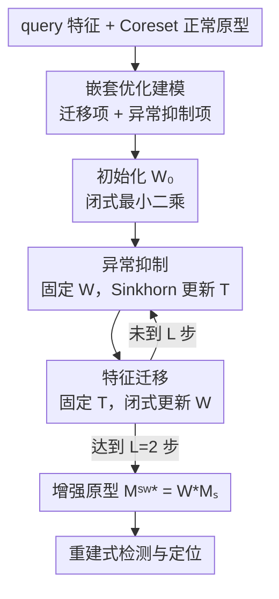

# FastRef: Fast Prototype Refinement for Few-shot Industrial Anomaly Detection

**会议**: CVPR 2026  
**论文**: [CVF Open Access](https://openaccess.thecvf.com/content/CVPR2026/html/Li_FastRef_Fast_Prototype_Refinement_for_Few-shot_Industrial_Anomaly_Detection_CVPR_2026_paper.html)  
**代码**: https://github.com/liyufei25/FastRef （论文承诺开源）  
**领域**: 目标检测 / 工业异常检测  
**关键词**: 工业异常检测, 少样本, 原型精炼, 最优传输, Sinkhorn  

## 一句话总结
FastRef 把"用 query 特征精炼正常原型"写成一个**特征迁移 + 异常抑制**的嵌套优化问题，在推理时用闭式更新的 transform matrix 把 query 信息搬进原型、再用 Sinkhorn 最优传输把混进来的异常抑制掉，作为即插即用模块挂到 PatchCore / WinCLIP / AnomalyDINO 上，在 1/2/4-shot 下一致提升检测与定位 AUROC，且满足实时要求。

## 研究背景与动机
**领域现状**：工业异常检测（IAD）要在产品表面自动找缺陷，主流是用海量正常图训练的无监督方法。但很多产品在冷启动阶段根本拿不到大量正常图，于是**少样本 IAD（FS-IAD）**成为现实需求——每个产品可能只有 1 张正常图。这个设定下表现最好的是 **prototype-oriented** 方法：用少量正常 support 图的统计量构造"正常原型"，测试时拿 query 特征和原型比距离算异常分。

**现有痛点**：绝大多数 prototype-oriented 方法（PatchCore、WinCLIP、AnomalyDINO）的原型在推理时是**固定**的，完全没用上当前 query 图自身的特征统计，原型代表性不足。少数想用 query 精炼原型的工作里，FastRecon 用的是 query 特征到原型的**逐点（point-to-point）重建**——作者指出这严重限制了"把 query 的特性迁移进原型"的能力，而且它假设增强后的原型服从各向同性高斯分布，对真实工业数据并不成立。

**核心矛盾**：在样本极少时，"用 query 精炼原型"是一把双刃剑——你想把 query 的正常特性搬进原型（**特征迁移**），但 query 图本身可能带异常，逐点重建会顺手把异常也搬进原型，导致缺陷区和正常区算出的异常分难以区分。FS-IAD 因为正常原型稀少、多样性差，这个"异常被重建进原型"的风险比常规 IAD 高得多。

**本文目标**：在推理阶段用 query 特征把原型精炼得更有代表性，同时**既要迁移正常特性、又要压住可能混入的异常**，还得快到能实时。

**核心 idea**：把原型精炼建模成一个**嵌套优化**——用一个 transform matrix $W$ 负责"组合式重建"query 特征（特征迁移），用一个传输概率矩阵 $T$ 通过最优传输负责把增强原型拉回正常原型分布（异常抑制），两者交替闭式求解，作为通用模块插到任意 prototype-oriented 方法里。

## 方法详解

### 整体框架
给定 $k$ 张正常 support 图和当前第 $t$ 张 query 图，先用冻结的预训练 backbone（ResNet-50 / WRN-50 / CLIP / DINOv2）抽特征，并用 Coreset 下采样把冗余的 support 特征压成正常原型 $\mathcal{M}_s \in \mathbb{R}^{n\times c}$（$n=\alpha\cdot k\cdot h\cdot w$，$\alpha$ 是采样率）。FastRef 的目标是在推理时为**每张 query** 现场算一组"增强原型" $\mathcal{M}_s^{w*}$，让它既吸收了 query 的正常特性、又没被 query 里的异常污染，最后拿增强原型和 query 特征做重建式比对得到异常分。

整个精炼写成嵌套优化目标（Eq.3）：

$$\boldsymbol{W}^*, \boldsymbol{T}^* = \arg\min_{\boldsymbol{W},\boldsymbol{T}}\ \mathrm{dis}(\boldsymbol{f}_t^{q}, \boldsymbol{W}\boldsymbol{\mathcal{M}}_s) + \lambda\,\mathrm{OT}(P,Q)$$

第一项让 $\boldsymbol{W}\boldsymbol{\mathcal{M}}_s$（即增强原型 $\mathcal{M}_s^w$）去重建 query 特征 $f_t^q$——这是**特征迁移**；第二项用最优传输 $\mathrm{OT}(P,Q)$ 把增强原型分布 $P$ 拉向原始正常原型分布 $Q$——这是**异常抑制**。$W$ 与 $T$ 的最优解相互依赖，于是交替迭代：固定 $W$ 用 Sinkhorn 更新 $T$，再固定 $T$ 用闭式解更新 $W$，跑 $L$ 步（实测 $L=2$ 就够）。

### 关键设计

**1. 嵌套优化建模：把"组合式重建"和"分布对齐"塞进一个目标**

FastRef 不沿用 FastRecon 那种沿特征维度逐点对齐的精炼，而是提出**组合精炼（composition refinement）**：增强原型 $\mathcal{M}_s^w = \boldsymbol{W}\boldsymbol{\mathcal{M}}_s$ 是从正常原型集里**挑选并线性组合**出来去重建 query 特征的，$W\in\mathbb{R}^{m\times n}$ 决定每个 query 位置用哪些正常原型、怎么配比。这一步只解释了"怎么把 query 的特性搬进来"，但搬运过程会顺带把异常也搬进来，所以目标里必须配一个第二项：用传输概率 $T\in\mathbb{R}^{m\times n}$ 衡量增强原型分布 $P$ 与正常原型分布 $Q$ 的最优传输距离并最小化它。作者给了个直觉论证：在 $\sum_j T_{i,j}=\tfrac1m$ 约束下，即便某轮 $T$ 关注到了异常特征，为了下一轮把 OT 项压小，$W$ 会通过调权重把这些异常特征的贡献"调没"，于是异常被自然压制；反过来若只用第一项的逐点距离，增强原型会被 query 里的异常带偏（因为带上异常反而能让重建距离更小）。这正是逐点重建（FastRecon）失败、而组合 + 分布对齐成功的根因。

**2. 特征迁移：transform matrix 的闭式更新，把 query 正常特性搬进原型**

固定 $T$ 后，当 $\mathrm{dis}(\cdot,\cdot)$ 取欧氏或余弦距离时，$W$ 的更新有**闭式解**（Eq.5）：

$$\boldsymbol{W}_{l+1}=\frac{(\boldsymbol{f}_t^q\boldsymbol{\mathcal{M}}_s^T+\lambda \boldsymbol{T}_l\boldsymbol{\mathcal{M}}_s\boldsymbol{\mathcal{M}}_s^T)(\boldsymbol{\mathcal{M}}_s\boldsymbol{\mathcal{M}}_s^T)^{-1}}{1+\lambda \boldsymbol{T}_l\cdot\mathbf{1}}$$

闭式解是 FastRef "Fast" 的关键——不用反向传播迭代收敛。其中 $(\mathcal{M}_s\mathcal{M}_s^T)^{-1}\in\mathbb{R}^{n\times n}$ 可以**预先算好反复复用**，再加上 Coreset 把 $n$ 压得很小，所以单步代价很低；作者也提到直接算伪逆在实验里数值稳定。初始化用 $\boldsymbol{W}_0=(f_t^q\mathcal{M}_s^T)(\mathcal{M}_s\mathcal{M}_s^T)^{-1}$（即不带 OT 项的最小二乘解），这个起点能取得最优的效率-性能折中。配合收敛性分析（目标关于 $W$ 凸，$\mathcal{L}(W_{l+1},T_{l+1})\le \mathcal{L}(W_l,T_l)-\tfrac{\mu}{2}\|W_{l+1}-W_l\|_F^2$），整体只需 $L=2$ 步外层迭代就收敛。

**3. 异常抑制：Sinkhorn 最优传输对齐增强原型与正常原型**

固定 $W$ 后更新 $T$，用熵正则化的最优传输（Eq.4）：

$$\mathrm{OT}_\epsilon(P,Q)=\sum_{i,j}^{m,n}\boldsymbol{C}_{i,j}\boldsymbol{T}_{i,j}+\epsilon\sum_{i,j}^{m,n}\boldsymbol{T}_{i,j}\ln \boldsymbol{T}_{i,j}$$

$C$ 是增强原型与正常原型间的代价矩阵（同样用欧氏/余弦距离），$\epsilon$ 是熵正则系数，约束 $\sum_j T_{i,j}=\tfrac1m,\ \sum_i T_{i,j}=\tfrac1n$。$T_{i,j}$ 表示第 $i$ 个增强原型与第 $j$ 个正常原型间的传输概率，是个有上界的正度量，**天然给每个增强原型在正常原型集中的重要性加权**。作者特意强调：用 OT 而非高斯假设来做异常抑制，使方法不依赖原型分布服从各向同性高斯，对真实 FS-IAD 更鲁棒。$T$ 的更新用 Sinkhorn 算法，配合 $W_0$ 的合理初始化，内层只需 $L_{OT}<10$ 次 Sinkhorn 循环，保证实时。

**4. 重建式检测 + 即插即用到三种 backbone**

拿到最优增强原型 $\mathcal{M}_s^{w*}$ 后，异常分按 query 特征和增强原型的逐位置距离算（Eq.6）：$\boldsymbol{s}_j=\mathrm{dis}(\boldsymbol{f}_{t,j}^q, \boldsymbol{\mathcal{M}}_{s,j}^{w*})$，图级取最大值、像素级双线性上采样 + 高斯平滑得到定位图。作者论证这种重建式检测相比 memory-based 的逐 patch 最近邻匹配更"结构感知"，且轻量 transform matrix 当"极简 decoder"既避免 UniAD/HVQTrans 那种重 decoder 的过拟合、又自带抗 shortcut 能力。FastRef 作为模块挂到三种代表方法上各成一个变体：**PatchCore+**（WRN-50 特征、欧氏距离）、**WinCLIP+**（CLIP ViT-B/16+ 特征、余弦距离，并把 FastRef 的 few-shot 分与 WinCLIP 的 zero-shot 分 $s_0$ 平均融合 $s^*=\tfrac12[s_0(f_t^q)+\max_j s_j]$）、**AnomalyDINO+**（DINOv2 特征、余弦距离，图级取异常图 top 1% 均值）。值得一提：作者证明 FastRecon 是 FastRef 的特例——令 $T=I$ 并把高斯均值 $\mu$ 代入异常抑制项，FastRef 就退化成 FastRecon 的 $\|W\mathcal{M}_s-\mu\|_2^2$。

### 损失函数 / 训练策略
FastRef **不引入训练**，全部发生在推理时：backbone 冻结，每张 query 现场跑 $L=2$ 步外层迭代（每步内含 $<10$ 次 Sinkhorn）求 $W^*,T^*$。关键超参：平衡系数 $\lambda$（PatchCore+ 用 0.3，WinCLIP+/AnomalyDINO+ 用 0.1），Coreset 采样率 $\alpha$（PatchCore+ 0.05；其余按数据集取 0.5/0.3/0.2/0.1）。测试 batch size = 1 以隔离方法本身的增益，单卡 GTX 3090。

## 实验关键数据

### 主实验
四个 benchmark（MVTec / MPDD / ViSA / RealIAD）× 1/2/4-shot，图级 + 像素级 AUROC。下表摘 2-shot 图级结果，"+"为挂上 FastRef 后的变体，$\Delta$ 为提升：

| 数据集 (2-shot, Image AUROC) | PatchCore | PatchCore+ | WinCLIP | WinCLIP+ | AnomalyDINO | AnomalyDINO+ |
|---|---|---|---|---|---|---|
| MVTec | 87.1 | 88.8 (+1.7) | 93.7 | 93.9 (+0.2) | 96.7 | 97.2 (+0.5) |
| MPDD | 71.4 | 78.2 (+6.8) | 72.5 | 76.0 (+3.5) | 75.2 | 78.4 (+3.2) |
| ViSA | 80.0 | 87.1 (+7.1) | 83.8 | 84.1 (+0.3) | 82.5 | 84.8 (+2.3) |
| RealIAD | 71.7 | 76.9 (+5.2) | 75.0 | 75.9 (+0.9) | 77.8 | 79.8 (+2.0) |

像素级（定位 AUROC）趋势一致，PatchCore+ 在 RealIAD 上像素级有 +5.2 这种大幅提升。核心结论：FastRef 对三种不同规模 backbone（CNN < CLIP < DINOv2）都能即插即涨，且**backbone 越弱、数据集越难，增益越大**——例如 MPDD（金属、有旋转变化，CLIP 预训练覆盖差）上 PatchCore+/WinCLIP+ 的提升明显高于"已经很强"的 MVTec。

### FastRef 内部设计对比（MPDD, 2-shot, Image AUROC）
验证组合精炼 + OT 抑制相对其他正则形式的优势：

| 方法 | 异常抑制正则项 | AUROC |
|---|---|---|
| **FastRef** | $\sum_{i,j}T_{i,j}\|W_{i,:}\mathcal{M}_s-\mathcal{M}_s(j,:)\|_2^2$（OT，原型无序） | **78.2** |
| Variant | $\|\tfrac1n\sum_i W_{i,:}\mathcal{M}_s-\tfrac1m\sum_j\mathcal{M}_s(j,:)\|$（均值对齐） | 76.9 |
| FastRecon | $\|W\mathcal{M}_s-\mu\|_2^2$（高斯均值、原型有序） | 76.4 |

说明 Coreset 的**无序原型** + OT 分布对齐确实比 FastRecon 的有序高斯假设更强。

### 消融实验（WinCLIP+, 2-shot, Image/Pixel AUROC）
| $W^*$ | $T^*$ | MVTec | VisA | MPDD |
|---|---|---|---|---|
| × | × | 93.7 / 93.8 | 83.8 / 95.1 | 72.5 / 96.5 |
| ✓ | × | 93.8 / 94.7 | 84.0 / 96.2 | 74.9 / 96.8 |
| ✓ | ✓ | **93.9 / 96.2** | **84.1 / 96.4** | **76.0 / 97.3** |

### 关键发现
- **两项缺一不可，且 $T^*$（异常抑制）作用常被低估**：MPDD 上单加 $W^*$ 涨 2.4%，再加 $T^*$ 又涨 1.1%——光做特征迁移会把异常带进来，必须配异常抑制才能稳。异常抑制平均带来 >0.4% Image / >0.7% Pixel 的提升。
- **超参呈"先升后降"**：$\alpha$（Coreset 率）和 $\lambda$ 都是越大不一定越好；$\lambda$ 的最优区间说明**特征迁移应主导**精炼、异常抑制是辅助，和设计意图吻合。
- **迭代步数 $L=2$ 最佳**：闭式解收敛极快，$L=2$ 已达最优，再加步数无益——这是"Fast"能成立的实证。

## 亮点与洞察
- **把"用 query 精炼原型"的双刃剑拆成两个可优化对象**：$W$ 管搬运、$T$ 管净化，且二者在同一目标里耦合互相纠偏（$T$ 标出异常 → $W$ 下一轮调权重把它压掉），比单纯逐点重建优雅得多。
- **闭式解 + 可复用矩阵求逆 + 小 Coreset + $L=2$**，四个工程点叠起来让"推理时现场优化"真的实时可用，而不是只在论文里 work。
- **把 FastRecon 数学上归约成自己的特例**（$T=I$ + 高斯均值），既讲清了和最接近的竞品的关系，也顺手论证了自己更一般——这种"前作是我特例"的写法很有说服力。
- **即插即用 + backbone 无关**：同一模块换距离函数（欧氏/余弦）就能挂到 CNN / CLIP / DINOv2 三类原型方法上，对任何想升级 FS-IAD pipeline 的人都是低成本增益，迁移性强。

## 局限与展望
- 增益**高度依赖 backbone 和数据集难度**：在已经很强的 MVTec + AnomalyDINO 上提升只有 +0.3~0.5，说明 query 精炼的红利在"强 backbone + 简单数据"上接近饱和，主要价值在弱 backbone / 难数据场景。
- 方法本质是**测试时按 query 逐图优化**，虽实时但每张 query 都要跑迭代 + Sinkhorn；大批量在线检测的吞吐、以及 batch>1 时的表现文中未展开（实验刻意用 batch=1 隔离增益）。⚠️ 收敛性、Eq.5 推导、效率数字均依赖附录，正文只给结论，细节以原文附录为准。
- $\lambda,\alpha,\epsilon,L$ 多个超参且呈"先升后降"，跨数据集需调（$\alpha$ 各数据集都不同），实际部署仍需针对产品线调参。
- 仅在 prototype-oriented 框架内验证，对非原型的重建/合成式 FS-IAD（如基于扩散）是否同样有效未知。

## 相关工作与启发
- **vs FastRecon（ICCV'23）**：两者都"用 query 特征增强原型"，但 FastRecon 是逐点重建 + 高斯假设 + 有序原型，限制了特性迁移、且对真实数据分布假设过强；FastRef 用组合式重建（无序 Coreset 原型）+ OT 分布对齐，数学上把 FastRecon 收成自己的特例（$T=I$、$\mu$ 代入），实验也全面更优。
- **vs PatchCore / WinCLIP / AnomalyDINO**：这三者推理时原型固定、不看 query；FastRef 不替换它们，而是作为外挂模块给它们现场精炼原型，各自变成 +版本一致涨点，等于给整条 prototype-oriented 路线打了个通用补丁。
- **vs UniAD / HVQTrans 等重 decoder 重建法**：它们靠复杂 decoder 抑制 shortcut 但参数多、易过拟合；FastRef 用轻量 transform matrix 当"极简 decoder"，靠 OT 抑制自带抗 shortcut，在少样本下更不容易过拟合。

## 评分
- 新颖性: ⭐⭐⭐⭐ 把原型精炼建成"迁移 + OT 抑制"嵌套优化并给闭式解，且把前作归约为特例，视角清晰。
- 实验充分度: ⭐⭐⭐⭐ 四数据集 × 三 backbone × 三 shot 全跑，消融与超参分析到位；batch=1、跨数据集调参留有余地。
- 写作质量: ⭐⭐⭐⭐ 动机、双项作用、与 FastRecon 关系都讲得透；不少关键推导与效率数字压在附录。
- 价值: ⭐⭐⭐⭐ 即插即用、实时、backbone 无关，对工业冷启动 FS-IAD 落地很实用。

<!-- RELATED:START -->

## 相关论文

- [\[CVPR 2026\] Defect Cue-Preserved Structural Feature Refinement for Few-Shot Anomaly Detection](defect_cue-preserved_structural_feature_refinement_for_few-shot_anomaly_detectio.md)
- [\[CVPR 2026\] Omni-AD: A Large-scale and Versatile Benchmark for Industrial Anomaly Detection](omni-ad_a_large-scale_and_versatile_benchmark_for_industrial_anomaly_detection.md)
- [\[CVPR 2026\] SubspaceAD: Training-Free Few-Shot Anomaly Detection via Subspace Modeling](subspacead_training-free_few-shot_anomaly_detection_via_subspace_modeling.md)
- [\[CVPR 2026\] GPFlow: Gaussian Prototype Probability Flow for Unsupervised Multi-Modal Anomaly Detection](gpflow_gaussian_prototype_probability_flow_for_unsupervised_multi-modal_anomaly_.md)
- [\[CVPR 2026\] Bidirectional Multimodal Prompt Learning with Scale-Aware Training for Few-Shot Multi-Class Anomaly Detection](bidirectional_multimodal_prompt_learning_with_scale-aware_training_for_few-shot_.md)

<!-- RELATED:END -->
