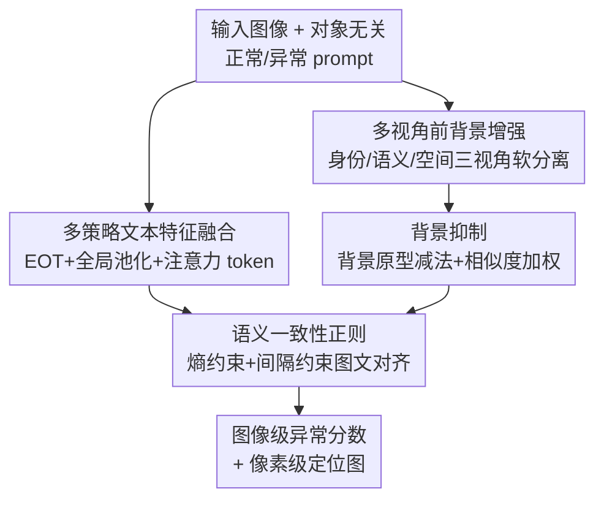

# FB-CLIP: Fine-Grained Zero-Shot Anomaly Detection with Foreground-Background Disentanglement

**会议**: CVPR 2026  
**论文**: [CVF Open Access](https://openaccess.thecvf.com/content/CVPR2026/html/Hu_FB-CLIP_Fine-Grained_Zero-Shot_Anomaly_Detection_with_Foreground-Background_Disentanglement_CVPR_2026_paper.html)  
**代码**: https://github.com/Xi-Mu-Yu/FB-CLIP  
**领域**: 零样本异常检测 / 多模态VLM  
**关键词**: 零样本异常检测, CLIP, 前景背景解耦, 文本特征融合, 跨模态对齐  

## 一句话总结
FB-CLIP 把 CLIP 用于细粒度零样本异常检测时的"前景-背景特征纠缠"问题拆成文本和视觉两条线一起治：文本侧融合 EOT/全局池化/注意力三种 token 特征做出更丰富的语义提示，视觉侧沿身份/语义/空间三个视角软分离前背景并做背景减法抑制残余干扰，再用语义一致性正则收紧图文对齐，在 16 个工业+医学数据集上把定位指标（AUPRO）刷到 SOTA。

## 研究背景与动机
**领域现状**：异常检测要在没有异常标注的情况下找出偏离正常模式的区域（工业质检的划痕、医学影像的病灶）。由于异常样本天然稀缺，零样本异常检测（ZSAD）成为主流方向，而 CLIP 这类视觉-语言预训练模型靠图文语义对齐，给 ZSAD 打开了不依赖训练样本的可能。代表工作 AnomalyCLIP 学习"对象无关"的可学习 prompt，编码通用的正常/异常语义。

**现有痛点**：作者从 AnomalyCLIP 的可视化里观察到一个关键现象——原始 CLIP 在**前景和背景区域会同时产生强响应**，模型分不清"和异常相关的前景语义"与"无关的背景上下文"，导致视觉表征里前景-背景特征严重纠缠。背景的大量响应会淹没细微的异常信号，让模型难以精确感知和定位细粒度异常。已有方法分两路缓解但都不彻底：文本侧只用可学习 prompt，但文本表征本身偏粗、语义多样性有限，对"区分前景异常线索 vs 复杂背景"指导不足；视觉侧只是增强 patch token，却**默认所有 token 同质、贡献相等**，忽略了不同区域语义不确定性的巨大差异（有的 token 含关键异常线索、有的只是背景噪声）。

**核心矛盾**：CLIP 的图文对齐建立在"整图级"语义上，而细粒度异常是局部、稀疏、微弱的——粗粒度的单一文本特征 + 同质化的视觉 token，无法在像素级把异常前景从背景里干净地切出来。

**本文目标**：在零样本设定下，让模型既能用更丰富的文本语义引导对齐，又能显式分离并增强前景异常、压制背景，最终得到更干净、可判别的异常表征。

**核心 idea**：**前背景解耦（Foreground-Background Disentanglement）**——文本侧"多策略融合"造出更有判别力的提示，视觉侧"多视角软分离 + 背景减法"把前景异常和背景拆开，再用一致性正则收紧图文匹配，三管齐下消除前背景纠缠。

## 方法详解

### 整体框架
FB-CLIP 基于冻结的 CLIP（ViT-L/14@336px）骨干，输入一张待检图像，输出图像级异常分数和像素级异常定位图，全程不见任何异常标注。它由四个模块串成一条流水线：**文本侧** MSTFF 把对象无关 prompt 编码后的 token 序列融合成更丰富的正常/异常文本原型；**视觉侧** MVFBE 先从多个异常线索生成软前景 mask，再沿身份/语义/空间三个视角分别增强前背景特征并跨层整合；其后 BS 用背景原型做减法，抹掉残余背景干扰；最后 SCR 把视觉特征同时对齐到正常/异常文本原型，用熵约束和间隔约束让对齐更自信、更可分。文本原型与背景抑制后的视觉特征做余弦相似度，即得异常图。

### 关键设计

**1. MSTFF（多策略文本特征融合）：单靠 EOT 句向量太粗，融合三种池化造出富语义文本原型**

沿用 AnomalyCLIP 的对象无关可学习 prompt——正常 prompt $g_n=[V_1]\dots[V_E][\text{object}]$、异常 prompt $g_a=[W_1]\dots[W_E][\text{damaged}][\text{object}]$，丢掉类别语义专注异常线索本身，以利跨对象/跨域泛化。痛点在于 CLIP 文本编码器只取 End-of-Text（EOT）token 当句向量，会漏掉上下文和异常相关语义。MSTFF 从 transformer 编码后的 token 序列 $X\in\mathbb{R}^{B\times L\times D}$ 抽三种互补特征：EOT 特征 $F_{eot}$ 保 CLIP 对齐兼容性；均值池化的全局特征 $F_{global}=\frac{1}{L}\sum_i X[:,i,:]W_{proj}$ 提供上下文稳定性；以及由两层 MLP 选择器 $S(\cdot)$ 引导的注意力特征 $F_{attn}=\sum_i \text{softmax}(S(X[:,i,:]))\,X[:,i,:]$ 突出任务相关 token。三者加权融合：

$$F_{text}=\lambda_1 F_{global}+\lambda_2 F_{attn}^{proj}+\lambda_3 F_{eot},\quad \lambda_1=1.0,\ \lambda_2=\lambda_3=0.5.$$

这样文本原型同时具备对齐兼容性、上下文稳定性和任务敏感性，给跨模态匹配提供更强的"什么算正常/异常"的引导。消融里它是单模块涨幅最大的一个（见下）。

**2. MVFBE（多视角前背景增强）：token 不同质，用三个视角显式拆开并增强前景异常与背景**

这是治视觉纠缠的核心。关键洞察是：含异常的前景 token 信息更丰富（偏离全局上下文、多样性高），背景 token 更稳定（与正常模式一致）。模块先用四个互补线索算异常分——局部显著性 $\tilde S_{local}$、中心距离 $\tilde D_{center}$、CLS 不一致性 $\tilde I_{cls}$、时序变化 $\tilde T_{temp}$：

$$A=\alpha_1\tilde S_{local}+\alpha_2\tilde D_{center}+\alpha_3\tilde I_{cls}+\alpha_4\tilde T_{temp},\quad \alpha_{1,2,3}=0.3,\ \alpha_4=0.1,$$

再二值化成**软前景 mask** $P_{fg}[i]=1.0\ (A[i]>0.5)$ 否则 $0.5$。用 $\{0.5,1.0\}$ 而非 $\{0,1\}$ 的硬 mask，是为了反传时保持梯度稳定，又能区分高置信前景（1.0）和待细化的不确定/背景 token（0.5）。随后跑三个互补视角：**身份视角（ID）** $X_{ID}=X$ 原样保留特征防过度变换退化；**语义视角（SEM）** 用外积构造前/背景交互权重 $W_{fg}=p_{fg}\otimes p_{fg}^T$、$W_{bg}=(1-p_{fg})\otimes(1-p_{fg})^T$，对前景按"信息丰富度"$r_{info}=1-\cos(X_{tokens},X_{cls})$ 加权、对背景按"稳定性"$s_{stable}=\cos(X_{tokens},X_{cls})$ 加权，分别聚合后残差融合（$\alpha=0.6$）；**空间视角（SPA）** 把 token 重排成 2D 网格、展开成 $5\times5$ 重叠 patch，用 unfold 后的 mask 区分前背景 patch 再邻域聚合，捕捉细粒度局部结构。三视角 $[X_{ID},X_{SEM},X_{SPA}]$ 在 $N$ 个 transformer 层上跨层整合，最后过 FB-Attention：用可学习门控 $G(\cdot)$ 把特征拆成前/背景两支 $x_{fg}=G(x)x$、$x_{bg}=(1-G(x))x$，各自多头自注意力后求和并 LayerNorm。连续门控（受 LSTM 启发）避免了硬过滤造成的信息丢失。

**3. BS（背景抑制）：增强后仍有残余背景噪声，用背景原型做减法显式扣掉**

MVFBE 分离了语义区域，但背景 token 仍可能残留噪声拖累精度。BS 从 $3N$ 个增强特征里各取前一半候选背景 token 拼成背景特征库 $X_{bg,bank}$，用均值+最大池化各半构造**原型背景向量** $b_{proto}=\frac12\text{Mean}(X_{bg,bank})+\frac12\text{Max}(X_{bg,bank})$（兼顾全局平均与显著背景特征）。对每个特征算与原型的余弦相似度 $s_{bg}^{(i)}=\cos(F_{enhanced}^{(i)},b_{proto})$，再做背景减法得异常信号 $a^{(i)}=F_{enhanced}^{(i)}-b_{proto}$，并用相似度加权增强：

$$a_{enh}^{(i)}=a^{(i)}\odot(1-s_{bg}^{(i)}),\qquad F_{final}^{(i)}=\alpha F_{enhanced}^{(i)}+(1-\alpha)a_{enh}^{(i)},\ \alpha=0.5.$$

越像背景的 token 权重越小，从而压住背景、突出异常。值得注意的是消融显示 BS **单独用反而掉点**（MVTec 图像级 AUROC 44.8%），它是个"减法滤波"，必须建立在 MSTFF/MVFBE 已经给出干净表征的基础上才有正向收益——单独减背景会误伤有用信号。

**4. SCR（语义一致性正则）：零样本下图文对齐不稳，用熵+间隔约束收紧对齐**

即便视觉解耦完成，零样本下图文对齐仍可能漂移。SCR 受 SVM 启发，在无额外监督下同时施加"自信"和"可判别"两个约束。取背景抑制后最后一层的视觉 token 做全局平均池化、L2 归一化得 $V$，文本特征 $T\in\mathbb{R}^{2\times D}$（正常/异常两个原型），算相似度 $s=\frac1\tau VT^\top\ (\tau=0.07)$ 后 softmax 得概率 $p_b$。**熵正则** $L_{entropy}=\mathbb{E}_b[-\sum_c p_b(c)\log p_b(c)]$ 鼓励自信预测；**间隔正则** $L_{margin}=\mathbb{E}_b[\max(0,\gamma-|s_b[1]-s_b[0]|)]\ (\gamma=1)$ 强制正常/异常相似度拉开间隔、防止模式坍缩。总损失 $L_{consistency}=\lambda(w_e L_{entropy}+w_m L_{margin})$，$\lambda=0.15,\ w_e=1.0,\ w_m=0.5$。它在"单文本空间对齐"内部增大语义间隙，把不确定匹配压下去。

### 损失函数 / 训练策略
CLIP 骨干（ViT-L/14@336px）全程冻结，只微调可学习 prompt 等少量参数。训练沿用前作的跨数据集协议：在 MVTec AD 上评测时用 VisA 的测试数据微调 AnomalyCLIP，在其他数据集评测时用 MVTec AD 测试数据微调。总目标为分割损失 + 分类损失 + SCR 一致性损失联合。PyTorch 2.0、单张 RTX 3090（24GB）、Adam、学习率 5e-5、batch size 4。

## 实验关键数据

### 主实验
在 16 个公开数据集（工业 7 个 + 医学 9 个）上评测，指标为检测 AUROC、分类 AP、定位 AUPRO。下表摘取代表性数据集，对比近期最强 CLIP 系方法 AF-CLIP（MM'25）与 FAPrompt（ICCV'25）。

| 数据集 | 指标 | FB-CLIP | AF-CLIP | FAPrompt |
|--------|------|---------|---------|----------|
| VisA（工业，像素级） | AUROC / AUPRO | **96.3 / 91.4** | 96.2 / 88.7 | 95.9 / 87.7 |
| VisA（工业，图像级） | AUROC / AP | **89.5 / 90.7** | 88.5 / 90.0 | 84.6 / 86.8 |
| Real-IAD（大规模，像素级） | AUROC / AUPRO | **95.9 / 88.2** | 95.5 / 81.6 | 95.0 / 82.1 |
| Real-IAD（图像级） | AUROC / AP | **80.6 / 78.4** | 79.2 / 77.0 | 77.3 / 74.8 |
| MPDD（像素级） | AUROC / AUPRO | **96.9 / 91.1** | — | 96.5 / 87.9 |
| ClinicDB（医学，像素级） | AUROC / AUPRO | **87.2 / 73.5** | 87.1 / 70.0 | 84.7 / 70.1 |

亮点是定位指标 AUPRO：Real-IAD 上较次优提升 **6%+**，VisA 提升约 2.7 个点。作者统计 FB-CLIP 在 18 个指标里有 14 个进前二，超过 FAPrompt 的 10 个。

### 消融实验
Table 2 在 MVTec / VisA 上逐模块叠加（图像级 AUROC/AP、像素级 AUROC/AUPRO，下表取 MVTec）：

| 配置 | 图像级 (AUROC, AP) | 像素级 (AUROC, AUPRO) | 说明 |
|------|--------------------|------------------------|------|
| Base | (67.1, 84.0) | (65.2, 32.9) | 裸 CLIP 基线 |
| +MSTFF | (82.0, 91.4) | (84.0, 68.0) | 文本融合，单模块涨幅最大 |
| +MVFBE | (92.2, 96.5) | (91.7, 84.5) | 视觉前背景分离，定位飙升 |
| +BS（单独） | (44.8, 72.7) | (70.7, 38.3) | 单独用反而掉点 |
| +SCR（单独） | (65.4, 81.3) | (75.7, 45.5) | 单独用增益有限 |
| Full（四件套） | (92.4, 96.6) | (91.9, 85.7) | 完整模型，整体最优 |

### 关键发现
- **MSTFF 是涨幅最大的单模块**：MVTec 图像级 AUROC 从 67.1% 直接拉到 82.0%、像素级 AUPRO 从 32.9% 到 68.0%，说明粗粒度单一 EOT 文本是 CLIP 做细粒度异常的最大瓶颈，丰富文本语义比堆视觉模块更关键。
- **MVFBE 主导定位精度**：叠加后 MVTec 像素级 AUPRO 升到 84.5%，前背景软分离对"把异常从背景里切出来"贡献最直接。
- **BS 必须配合使用**：单独加 BS 反而把图像级 AUROC 砸到 44.8%——它是减法滤波，只有在前面模块给出干净表征后才能正向放大异常、否则误伤信号，⚠️ 这点提醒它不是即插即用的独立增益。
- **越复杂背景越受益**：可视化显示 FB-Attention 对复杂纹理和小缺陷的抑噪/增强尤其明显，背景减法能让细小划痕、藏在复杂图案里的异常清晰浮现。

## 亮点与洞察
- **"双模态分头治理纠缠"的拆解很干净**：把同一个"前背景纠缠"病症拆成文本太粗（MSTFF 治）+ 视觉同质（MVFBE 治）+ 残余背景（BS 治）+ 对齐漂移（SCR 治）四个可独立验证的子问题，模块边界清楚、消融可读性强。
- **软 mask $\{0.5,1.0\}$ 的小巧思**：不用硬 0/1 而用 0.5/1.0，既保梯度稳定又给"不确定 token"留了后续细化的空间，是个可迁移到其他需要软分割引导的 trick。
- **背景原型用 Mean+Max 各半**：均值抓全局背景、最大抓显著背景特征，比单一池化更全面地刻画"什么是背景"，可借鉴到任何需要构造原型向量做减法/对比的场景。
- **SCR 把 SVM 的间隔思想搬进图文对齐**：无监督下用熵约束（要自信）+ 间隔约束（要可分）替代标注信号，是零样本下稳定跨模态对齐的轻量方案。

## 局限与展望
- **BS 不能独立工作**：消融已暴露其对前序表征质量的强依赖，意味着模块间耦合较紧，迁移到别的骨干/任务时四件套可能要整体调而非自由组合。
- **部分医学数据集未夺冠**：TN3K、Kvasir 等数据集上 FB-CLIP 并非最优（如 TN3K 图像级 79.0% 落后 FAPrompt 的 84.7%），⚠️ 说明前背景解耦在某些医学纹理/边界模糊场景的收益有限。
- **训练协议存在跨数据集泄漏依赖**：评测某数据集时用另一数据集测试集微调，虽是 ZSAD 惯例，但严格"零样本"程度受这一约定影响。
- **关键线索细节藏在附录**：四个异常指标（局部显著性/中心距离/CLS 不一致/时序变化）的具体计算放在 Appendix，正文只给融合权重，复现需查附录，⚠️ 以原文附录为准。

## 相关工作与启发
- **vs AnomalyCLIP**：都用对象无关可学习 prompt，但 AnomalyCLIP 仅靠单一 EOT 文本对齐、视觉侧不做前背景分离；FB-CLIP 在其基础上加 MSTFF 丰富文本 + MVFBE/BS 显式解耦视觉，定位指标全面占优（VisA 像素级 AUPRO 87.0%→91.4%）。
- **vs AF-CLIP（MM'25）**：AF-CLIP 用邻域聚合增强 token、但 token 同质处理；FB-CLIP 的 SPA 视角显式用 mask 区分前背景 patch 再按信息丰富度处理，是不同的空间建模范式，Real-IAD 定位提升 6%+。
- **vs WinCLIP / CLIP-AD**：它们靠滑窗或局部 patch-文本相似度做密集异常图，停在 token 级且不显式建模 token 内语义/结构差异；FB-CLIP 在视角分离 + 背景减法层面更进一步，对复杂背景鲁棒性更好。

## 评分
- 新颖性: ⭐⭐⭐⭐ 前背景解耦的视角是 ZSAD 里相对清晰的切口，四模块组合工程味偏重但拆解干净
- 实验充分度: ⭐⭐⭐⭐⭐ 16 个工业+医学数据集、3 类指标、逐模块消融 + 充分可视化
- 写作质量: ⭐⭐⭐⭐ 公式与流程交代完整，但核心异常指标细节下放附录略影响自洽
- 价值: ⭐⭐⭐⭐ 定位指标 SOTA、代码开源，对工业/医学零样本质检有直接实用价值

<!-- RELATED:START -->

## 相关论文

- [\[CVPR 2026\] MoECLIP: Patch-Specialized Experts for Zero-shot Anomaly Detection](moeclip_patch-specialized_experts_for_zero-shot_anomaly_detection.md)
- [\[CVPR 2026\] From Attraction to Equilibrium: Physics-Inspired Semantic Gravitons for Zero-Shot Anomaly Detection](from_attraction_to_equilibrium_physics-inspired_semantic_gravitons_for_zero-shot.md)
- [\[CVPR 2026\] GS-CLIP: Zero-shot 3D Anomaly Detection by Geometry-Aware Prompt and Synergistic View Representation Learning](gs-clip_zero-shot_3d_anomaly_detection_by_geometry-aware_prompt_and_synergistic_.md)
- [\[CVPR 2026\] CoPS: Conditional Prompt Synthesis for Zero-Shot Anomaly Detection](cops_conditional_prompt_synthesis_for_zero-shot_anomaly_detection.md)
- [\[CVPR 2025\] AA-CLIP: Enhancing Zero-Shot Anomaly Detection via Anomaly-Aware CLIP](../../CVPR2025/object_detection/aa-clip_enhancing_zero-shot_anomaly_detection_via_anomaly-aware_clip.md)

<!-- RELATED:END -->
