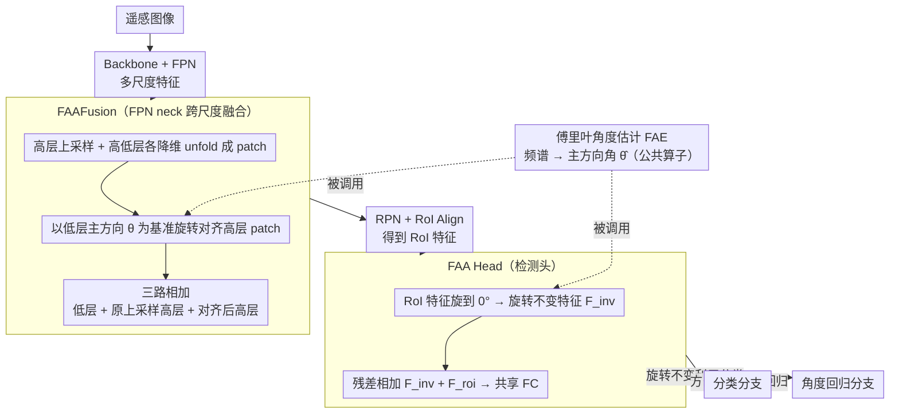

# Fourier Angle Alignment for Oriented Object Detection in Remote Sensing

**会议**: CVPR 2026  
**arXiv**: [2602.23790](https://arxiv.org/abs/2602.23790)  
**代码**: [https://github.com/gcy0423/Fourier-Angle-Alignment](https://github.com/gcy0423/Fourier-Angle-Alignment)  
**领域**: 目标检测  
**关键词**: 旋转目标检测, 傅里叶旋转等变性, 频域方向估计, 特征融合, 遥感

## 一句话总结

利用傅里叶旋转等变性在频域估计目标主方向并对齐特征，提出 FAAFusion 和 FAA Head 两个即插即用模块分别解决 FPN 跨尺度方向不一致和检测头分类-回归任务冲突，在 DOTA-v1.0/v1.5 和 HRSC2016 上取得新 SOTA。

## 研究背景与动机

**旋转目标检测的核心挑战**：遥感图像中船舶、飞机、车辆等目标方向任意，检测器需在标准 HBB $(x,y,w,h,c)$ 基础上额外预测旋转角 $\theta$。现有方法聚焦于旋转敏感卷积（ARC、GRA）、新 backbone（ReDet、LSKNet、PKINet、Strip R-CNN）或角度回归损失优化（GWD、KLD），但忽视了两个结构性瓶颈。

**瓶颈一：Neck 层方向不一致 (Directional Incoherence)**。FPN 中高层特征语义强但经过多次下采样后方向信号模糊（低频），只能粗略感知目标大致水平/垂直方向；低层特征保留了丰富的边缘和纹理，方向线索精确（高频）。传统 FPN 直接逐元素相加融合这两种方向不一致的特征，引入方向噪声，损害角度预测精度。

**瓶颈二：检测头任务冲突 (Task Conflict)**。同一 RoI 特征需同时服务分类和角度回归两个任务——分类需要旋转不变特征（飞机无论朝向都是飞机），回归需要旋转敏感特征（朝向不同角度预测应不同）。单一特征被迫折中，既非完全不变也非完全敏感，限制了两个任务的精度。

**核心洞察：傅里叶旋转等变性**。空间域信号旋转角度 $\phi$，其频谱也精确旋转 $\phi$（即 $\mathbf{F}_\phi(\boldsymbol{\omega}) = \mathcal{F}\{\mathbf{I}(\mathbf{R}_{-\phi}\mathbf{x})\}$）。同时，矩形目标的功率谱主方向垂直于其长轴（因 $a > b$ 时 $\operatorname{sinc}(2au)$ 主瓣更窄，高频能量沿 $v$ 轴集中）。这意味着可以从频域可靠估计目标主方向并执行显式对齐，这是对纯空间域方案的本质补充。

## 方法详解

### 整体框架

Fourier Angle Alignment (FAA) 想在不改 backbone、不加新损失的前提下，把「目标方向」这条信号显式地从频域抽出来、对齐好再用。它把两个即插即用模块塞进 Oriented R-CNN：**FAAFusion** 接在 FPN neck，替换跨尺度融合时的逐元素加法，专治高低层特征方向不一致；**FAA Head** 替换原始检测头，把 RoI 特征预先摆正以解开分类与回归的矛盾。两个模块的共同底座是同一个傅里叶角度估计（FAE）流程——先有了「从一块特征里读出主方向角」这个能力，FAAFusion 和 FAA Head 才分别拿它去做对齐。

### 关键设计

**1. 傅里叶角度估计 FAE：从频谱里读出特征图的主方向角**

后面两个模块都要回答「这块特征朝哪个方向」，FAE 就是这个公共算子。它利用了一个数学事实：矩形目标在频域的功率谱，主能量方向恰好垂直于其空间长轴——当长边 $a$ 大于短边 $b$ 时 $\operatorname{sinc}(2au)$ 的主瓣更窄，高频能量沿垂直方向集中，于是频谱形状直接编码了目标朝向。具体地，对方阵特征图 $\mathbf{X} \in \mathbb{R}^{H \times H}$ 做 2D DFT 得 $\mathbf{F} = \mathcal{F}(\mathbf{X})$，乘 $(-1)^{u+v}$ 把零频移到中心，再从笛卡尔坐标 $(u,v)$ 转到极坐标 $(\rho,\theta)$ 取能量谱并沿径向加权求和，压成一维角度能量分布：

$$E_\theta(\theta) = \sum_\rho \rho \cdot \big|\mathbf{F}_c\big(u(\rho,\theta), v(\rho,\theta)\big)\big|^2$$

峰值方向 $\hat{\theta} = \arg\max_\theta E_\theta(\theta)$（约束到 $[0,\pi)$）就是估计出的主方向。这里的径向权重 $\rho$ 是关键——它给远离中心的高频分量更大话语权，而方向信息恰恰藏在边缘对应的高频里，因此加权后估计对朝向更敏感、更稳。

**2. FAAFusion：在 FPN 里先把方向对齐再相加**

传统 FPN 把语义强但方向模糊（低频）的高层特征，和方向精确（高频边缘）的低层特征直接逐元素相加，等于把两套不一致的方向信号搅在一起，污染角度预测。FAAFusion 的做法是以低层方向为基准、把高层摆正后再融合：高层特征 $\mathbf{Y}^{l+1}$ 先上采样到低层分辨率，高低层各用 $1\times1$ 卷积降到 $C_{mid}$ 并 unfold 成局部 patch $\{\mathbf{p}_i^h\},\{\mathbf{p}_i^l\}$；每个位置 $i$ 用 FAE 读出低层 patch 的可靠主方向 $\theta_i^l$，再以它为目标角把对应高层 patch 旋转对齐 $\mathbf{p}_i^{rh} = \text{FAA}(\mathbf{p}_i^h; \theta_i^l)$；fold 重建出对齐后的高层特征 $\mathbf{Y}_{recon}^{l+1}$ 并用 $1\times1$ 卷积恢复通道。最终融合是三路相加 $\mathbf{Y}^l = \mathbf{X}^l + \mathbf{Y}_u^{l+1} + \mathbf{Y}_{recon}^{l+1}$：除了对齐后的高层，仍保留原始上采样高层 $\mathbf{Y}_u^{l+1}$，是为了不在对齐过程中丢掉高层的语义。之所以拿低层当基准而非反过来，正因为低层的高频边缘让它的方向估计更可信，用模糊的去对齐清晰的只会越对越偏。

**3. FAA Head：把 RoI 特征预先摆正，解开分类与回归的矛盾**

同一份 RoI 特征要同时喂给两个口味相反的任务——分类希望旋转不变（飞机不管朝哪都是飞机），回归希望旋转敏感（朝向不同角度就该不同），单一特征被迫折中，两边都不到位。FAA Head 用一步对齐 + 残差把两种需求同时供上：取 RoI 对齐特征 $\mathbf{F}_{roi}$，用 FAA 把主方向统一旋到 $0°$ 得到旋转不变特征 $\mathbf{F}_{inv} = \text{FAA}(\mathbf{F}_{roi}; 0°)$，再残差相加 $\mathbf{F}_{final} = \mathbf{F}_{inv} + \mathbf{F}_{roi}$，展平后过两层共享 FC（第一层输出维度 $1024 + 256 = 1280$）再分流到分类与回归分支。这样 $\mathbf{F}_{inv}$ 抹掉了朝向、对同类目标近似一致，天然利于分类；$\mathbf{F}_{roi}$ 原样保留方向敏感信息，天然利于角度回归；一个残差就完成了隐式解耦，比另起双分支架构要简洁得多。

### 损失函数 / 训练策略

采用 Oriented R-CNN 标准损失（RPN 分类+回归 + Head 分类+回归），无新增损失项。优化器 AdamW（weight decay 0.05），DOTA 初始学习率 0.0001 训练 16 epochs，HRSC2016 初始学习率 0.0004 训练 36 epochs，batch size 2，单卡 RTX 3090。FAAFusion 部署在 FPN 第三层与第二层之间的融合处。

## 实验关键数据

### 主实验 — DOTA-v1.0（单尺度训练测试）

| 方法 | Backbone | mAP |
|------|----------|-----|
| O-RCNN | ResNet50 | 75.87% |
| **O-RCNN + ours** | ResNet50 | **76.55%** (+0.68) |
| LSKNet | LSKNet-S | 77.49% |
| **LSKNet + ours** | LSKNet-S | **78.49%** (+1.00) |
| PKINet | PKINet-S | 78.39% |
| S-RCNN | StripNet-S | 78.09% |
| **S-RCNN + ours** | StripNet-S | **78.72%** (+0.63, 新 SOTA) |

### 主实验 — DOTA-v1.5（单尺度训练测试）

| 方法 | Backbone | mAP |
|------|----------|-----|
| O-RCNN | ResNet50 | 66.77% |
| **O-RCNN + ours** | ResNet50 | **67.14%** (+0.37) |
| S-RCNN | StripNet-S | 69.84% |
| **S-RCNN + ours** | StripNet-S | **71.57%** (+1.73) |
| PKINet | PKINet-S | 71.47% |
| LSKNet | LSKNet-S | 70.26% |
| **LSKNet + ours** | LSKNet-S | **72.28%** (+2.02, 新 SOTA) |

### 主实验 — HRSC2016

| 方法 | Params | FLOPs | AP50 (VOC07) | AP75 | mAP |
|------|--------|-------|--------------|------|-----|
| O-RCNN | 41.13M | 134.46G | 89.7 | 79.5 | 64.77 |
| **O-RCNN + ours** | 63.27M | 140.70G | **89.8** | **80.0** | **66.94** (+2.17) |
| LSKNet | 30.96M | 111.42G | 90.2 | 87.9 | 68.78 |
| **LSKNet + ours** | 48.34M | 114.89G | **90.6** | **89.8** | **70.74** (+1.96) |
| S-RCNN | 45.12M | 157.19G | 89.5 | 78.8 | 69.18 |
| **S-RCNN + ours** | 49.05M | 115.91G | **90.0** | 78.6 | **70.41** (+1.23) |

### 消融实验（DOTA-v1.0, LSKNet-S backbone）

| FAAFusion | FAA Head | Params | GFLOPs | mAP |
|-----------|----------|--------|--------|-----|
| ✘ | ✘ | 30.98M | 173.68G | 77.49% |
| ✘ | ✔ | 48.35M | 177.15G | 78.27% (+0.78) |
| ✔ | ✘ | 32.18M | 175.59G | 77.91% (+0.42) |
| ✔ | ✔ | 49.56M | 179.06G | **78.49%** (+1.00) |

### 检测头对比（DOTA-v1.0）

| Backbone | 检测头 | Params | GFLOPs | mAP |
|----------|--------|--------|--------|-----|
| ResNet50 | Original Head | 41.14M | 211.43G | 75.81% |
| ResNet50 | Strip Head | 55.82M | 258.35G | 76.11% |
| ResNet50 | **FAA Head** | 58.51M | 214.90G | **76.18%** |
| LSKNet-S | Original Head | 30.98M | 173.68G | 77.49% |
| LSKNet-S | Strip Head | 45.65M | 220.60G | 78.04% |
| LSKNet-S | **FAA Head** | 48.35M | 177.15G | **78.27%** |
| StripNet-S | Original Head | 30.46M | 171.79G | 77.03% |
| StripNet-S | Strip Head | 45.14M | 218.71G | 78.09% |
| StripNet-S | **FAA Head** | 47.83M | 175.26G | **78.52%** |

### 关键发现

- FAAFusion 和 FAA Head 互补：单独使用分别提升 +0.42% 和 +0.78%，组合提升 +1.00%
- 三个不同 backbone 上均一致有效，证明模块的即插即用通用性
- DOTA-v1.5 提升最显著（LSKNet +2.02%），该数据集包含大量 <10 像素的极小目标，方向对齐对小目标尤为重要
- HRSC2016 船舶检测提升大（O-RCNN +2.17%），高长宽比目标的频域方向估计优势明显
- FAA Head 与 Strip Head 参数量相近但 FLOPs 低 40G+，精度更高——频域对齐比空间域条状卷积更高效
- 高 IoU 阈值分析：在 IoU 0.70-0.90 范围内优势随阈值升高而扩大，表明方向对齐提升了精确定位能力

## 亮点与洞察

- **频域切入角度新颖**：首次将傅里叶旋转等变性系统应用于旋转目标检测，从频域估计方向角具有严格的数学推导支撑（矩形 sinc 主瓣分析），物理可解释性极强
- **问题诊断精准**：明确分离了两个独立问题（Neck 方向不一致 + Head 任务冲突），并分别用 FAAFusion 和 FAA Head 对症下药
- **FAAFusion 以低层为基准的对齐策略**直觉正确：低层特征边缘清晰、方向可靠，用它来校准高层的模糊方向
- **FAA Head 残差设计**简洁有效：$\mathbf{F}_{inv} + \mathbf{F}_{roi}$ 一步完成分类-回归的隐式解耦，无需复杂的双分支架构
- 高 IoU 下的持续优势证明方向对齐确实提升了精细定位

## 局限与展望

- **参数增量明显**：O-RCNN 从 41M 增至 63M（+54%），FAAFusion 的 unfold/fold 操作引入额外开销，可考虑更轻量的频域处理
- **矩形假设**：频域方向估计基于目标近似矩形的先验，对不规则形状目标（如圆形油罐）准确性可能下降
- **框架绑定**：仅在 Oriented R-CNN 两阶段框架验证，未测试单阶段检测器（S2A-Net 等）或 anchor-free 方法
- **FAAFusion 仅部署于一个层级**：仅替换了 P3-P2 融合处的加法，可探索全层级部署的收益与开销平衡
- 未在更大规模数据集（如 DIOR-R）或多尺度训练测试条件下验证

## 相关工作与启发

- **FreqFusion** 将特征分解为高低频组件分别处理，FAA 则直接利用旋转等变性做方向估计——两者都在频域操作但目标不同
- **ReDet** 用旋转等变 backbone（ReResNet）建模方向信息，FAA 以更轻量的即插即用方式在 neck 和 head 层级引入方向感知
- **Strip R-CNN** 用条状卷积建模高长宽比目标几何特征，FAA Head 以更低 FLOPs 达到更高精度，说明频域对齐可能比显式几何卷积更高效
- 频域方向估计方法有望扩展到实例分割、遥感变化检测、姿态估计等需要方向建模的任务

## 评分

- 新颖性: ⭐⭐⭐⭐⭐ 频域旋转等变性切入旋转目标检测，理论清晰、视角全新，FAAFusion 和 FAA Head 设计动机透彻
- 实验充分度: ⭐⭐⭐⭐ 三个数据集、三个 backbone、消融完整、检测头对比有力，缺多尺度和更多框架验证
- 写作质量: ⭐⭐⭐⭐ 理论推导详尽，Formulation 和 Motivation 节清晰，图文配合好
- 价值: ⭐⭐⭐⭐⭐ 即插即用 + 一致稳定提升 + 物理可解释 + 开源代码，实用性强

<!-- RELATED:START -->

## 相关论文

- [\[CVPR 2026\] Small Target Detection Based on Mask-Enhanced Attention Fusion of Visible and Infrared Remote Sensing Images](small_target_detection_based_on_mask-enhanced_attention_fusion_of_visible_and_in.md)
- [\[ECCV 2024\] MutDet: Mutually Optimizing Pre-training for Remote Sensing Object Detection](../../ECCV2024/object_detection/mutdet_mutually_optimizing_pre-training_for_remote_sensing_object_detection.md)
- [\[AAAI 2026\] SM3Det: A Unified Model for Multi-Modal Remote Sensing Object Detection](../../AAAI2026/object_detection/sm3det_a_unified_model_for_multi-modal_remote_sensing_object_detection.md)
- [\[ICLR 2026\] SPWOOD: Sparse Partial Weakly-Supervised Oriented Object Detection](../../ICLR2026/object_detection/spwood_sparse_partial_weakly-supervised_oriented_object_detection.md)
- [\[ICCV 2025\] OpenRSD: Towards Open-prompts for Object Detection in Remote Sensing Images](../../ICCV2025/object_detection/openrsd_towards_open-prompts_for_object_detection_in_remote_sensing_images.md)

<!-- RELATED:END -->
