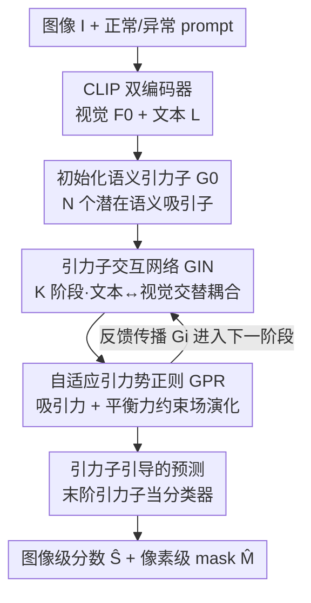

# From Attraction to Equilibrium: Physics-Inspired Semantic Gravitons for Zero-Shot Anomaly Detection

**会议**: CVPR 2026  
**论文**: [CVF Open Access](https://openaccess.thecvf.com/content/CVPR2026/html/Pan_From_Attraction_to_Equilibrium_Physics-Inspired_Semantic_Gravitons_for_Zero-Shot_Anomaly_CVPR_2026_paper.html)  
**代码**: 无  
**领域**: 多模态VLM / 零样本异常检测  
**关键词**: 零样本异常检测, CLIP, 物理启发, 势场对齐, 语义引力子  

## 一句话总结
SGNet 把 CLIP 视觉-文本的跨模态对齐重新建模成一个「能量势场达到平衡」的物理过程，引入一组可学习的「语义引力子」作为视觉与文本之间的动态中介，通过吸引力与平衡力把两个模态拉到稳定的局部语义平衡点，在 10 个工业/医疗基准上取得零样本异常检测的 SOTA。

## 研究背景与动机
**领域现状**：零样本异常检测（ZSAD）要求在没有任何缺陷样本监督的情况下识别并定位「偏离正常模式」的区域，对开放世界场景（工业质检、医学影像、自动驾驶）很关键。近两年主流做法是借 CLIP 这类视觉-语言模型，用「正常 / 异常」文本提示去和图像特征做匹配（AnomalyCLIP、WinCLIP、VCP-CLIP、FE-CLIP 等）。

**现有痛点**：这些方法本质上都是**后期粗糙融合（late-stage fusion）**——要么用全局 image-text 匹配，要么靠隐式注意力或启发式 prompt 拼接，把视觉和文本特征**松散地**耦合在一起。CLIP 预训练目标是「全局匹配」而非「空间推理」，所以这种弱结构化的跨模态交互在域偏移、复杂纹理下非常脆弱，表现为图像级判别不稳、像素级定位粗糙。

**核心矛盾**：异常检测最需要的是**细粒度、稳定**的视觉-文本对应关系，但现有融合缺乏结构性约束，没有任何机制去「组织」并「稳定」两个模态的交互——它只是把两堆特征拼起来，没有约束它们如何相互靠拢、如何避免某一方主导。

**切入角度**：作者从物理系统里「粒子如何在能量场中相互作用并稳定下来」这一现象得到启发，把多模态交互重新解释为**潜在势场（potential field）中的能量平衡过程**：视觉特征和文本特征像带电粒子一样彼此吸引、相互制衡，最终落入低能量的稳定态，就像物理系统会自发收敛到低能量稳态。

**核心 idea**：用一组可学习的「语义引力子（semantic graviton）」作为视觉-文本之间的动态中介，靠**吸引力 + 平衡力**两种能量约束，把跨模态对齐从「静态全局融合」变成「动态平衡交互」，从而获得稳定且细粒度的语义对应。

## 方法详解

### 整体框架
SGNet（Semantic Graviton Network）的输入是一张图像 $I$ 和一对文本提示（正常 prompt、异常 prompt），输出是图像级异常分数 $\hat{S}$ 和像素级异常 mask $\hat{M}$，一次前向同时给出两者。

整条 pipeline 分四步：(1) CLIP 的视觉编码器把图像编成多层特征 $F_0 \in \mathbb{R}^{C_v^0 \times H_0 \times W_0}$，文本编码器把两个 prompt 编成 $L=\{L_{nor}, L_{abn}\} \in \mathbb{R}^{2\times C_l}$；(2) 初始化 $N$ 个可学习语义引力子 $G_0 \in \mathbb{R}^{N\times C_l}$，作为桥接「正常/异常文本两极」与「视觉证据」的潜在语义吸引子；(3) 经过 $K$ 个阶段的**引力子交互网络（GIN）**，每个引力子交替吸收文本语义线索和视觉模式，逐级形成一个既能表达正常又能表达偏离的平衡语义势场，同时**自适应引力势正则（GPR）** 用吸引力与平衡力约束这个场的演化；(4) 最终阶段的引力子作为「自适应分类器」，配合层级解码后的融合特征 $X$，由**引力子引导的预测头**生成异常 mask 和异常分数。

整体上，学到的引力子场对视觉嵌入施加基于能量的调制，使「正常/异常语义」与「局部图像区域」之间形成稳定对齐。

### 关键设计

**1. 语义引力子：用可学习中介把松散融合改成结构化桥接**

这针对「视觉和文本只是松散拼在一起、没有结构约束」的痛点。作者不让视觉特征和文本特征直接全局耦合，而是引入 $N$ 个可学习 token $G \in \mathbb{R}^{N\times C_l}$，每个引力子被视为一个**势阱（potential well）**：它自适应地吸收某一类语言线索、并对齐到对应的视觉特征，从而形成一个个**局部语义平衡点（localized semantic equilibrium）**。直觉上，与其让两堆特征一锅乱炖，不如设一批「中介粒子」，每个粒子专门负责一种语义子空间（某种缺陷模式 / 某类正常纹理），把全局模糊的对齐拆成多个有结构、可解释的局部对齐。消融显示引力子数量 $N=20$ 最优，太少势场太粗、捕捉不了多样异常，太多则角色重叠、注意力被稀释。

**2. 引力子交互网络（GIN）：文本→引力子、视觉→引力子交替耦合逐级精修**

这是 SGNet 的核心组件，解决「跨模态对应要既稳定又细粒度」的问题。在第 $i$ 阶段，引力子先和文本交互获取语义先验（充当吸引子）：用 cross-attention 计算语言激活 $\text{Att}^L_i = \frac{\text{Proj}_g(G_i)\,[\text{Proj}_l(L)]^\top}{\sqrt{C_l}}$，再 $G^L_i = \text{Norm}\big(G_{i-1} + \text{Softmax}(\text{Att}^L_i)\,\text{Proj}_l(L)\big)$。为避免「语言偏置过强」，作者加了一个轻量的 **text-to-graviton 门控**：

$$G^{cross}_i = \text{Linear}\big(\gamma(G^L_i)\odot G^L_i + G_{i-1}\big)$$

其中 $\gamma(\cdot)$ 是带 ReLU+Tanh 的两层感知机，动态地重新缩放从文本注入的「语义能量」，只让最相关的语言线索进入势场。随后引力子再和**上一阶段的融合视觉特征 $F_{i-1}$** 做双向注意力（用 $F_{i-1}$ 而非原始 $F_0$，因为它已累积了前面各层的交互），算出视觉注意力 $\text{Att}^V_i = \frac{\text{Proj}_g(G^{cross}_i)\,\text{Flatten}(\text{Proj}_v(F_{i-1}))}{\sqrt{C_v^{i-1}}}$，据此同时更新引力子 $G^V_i$ 和视觉特征 $F_i$（视觉特征通过 $\text{Unflatten}$ 恢复空间结构后被引力子调制）。最后下一阶段引力子继承多模态知识 $G_i = \text{Norm}(G^{cross}_i + \text{Proj}(G^V_i))$。这种**反馈传播**让更高层在越来越稳定的语义平衡点上工作，每个引力子都演化成融合了文本-视觉对齐的「语义吸引子」。和旧方法的区别在于：对齐不再是一次性全局融合，而是被拆成 $K=4$ 个阶段的迭代精修，模态信息交替注入、互相校准。

**3. 自适应引力势正则（GPR）：吸引力 + 平衡力把势场约束成自组织的能量地形**

光有交互还不够，作者用一个物理启发的能量约束来稳定收敛、防止某一模态主导。每个引力子 $g_n$ 对两个模态的「责任」由 attention 派生的关联权重决定：$a_{v,n}=\frac{\exp(\text{sim}(f_v,g_n)/\tau)}{\sum_m \exp(\text{sim}(f_v,g_m)/\tau)}$，文本侧 $a_{t,n}$ 同理（$\text{sim}$ 为余弦相似度，$\tau$ 控制注意力锐度），保证只有语义对齐的引力子才会对相应特征施加吸引。

吸引力（Attraction Force）为每个引力子定义模态特定的能量分布 $p^{(n)}_v = \text{Softmax}(-\|f_v-g_n\|_2^2)$、$p^{(n)}_t = \text{Softmax}(-\|f_t-g_n\|_2^2)$，再用 **2-Wasserstein 距离**对齐两者：

$$L_{att} = \frac{1}{N}\sum_{n=1}^{N}(a_{v,n}+a_{t,n})\,W_2\big(p^{(n)}_v, p^{(n)}_t\big)$$

它鼓励视觉和文本在每个引力子周围形成**同构的势阱**——不只对齐位置，还对齐语义场的形状与曲率，让两模态对同一引力子的语义角色达成共识，在域偏移下也保持一致。平衡力（Equilibrium Force）则在拓扑对齐之外，再约束两模态的能量幅度别失衡，用自由能差衡量：

$$L_{equ} = \frac{1}{N}\sum_{n=1}^{N}(a_{v,n}+a_{t,n})\,\big|\|f_v-g_n\|_2^2 - \|f_t-g_n\|_2^2\big|$$

它防止某一模态（视觉主导 / 文本漂移）独占共享势空间，维持稳定的多模态平衡并保留引力子之间的语义多样性。两者合成最终正则 $L_{grav} = \lambda_{att}L_{att} + (1-\lambda_{att})L_{equ}$。通过自适应注意力 + 双层能量调节，每个引力子发展出自己的「语义影响区」，整体形成一个自组织、平衡的多模态势场。消融证实，去掉 GPR 会让激活散乱或夸张（要么高亮正常纹理、要么漏掉真异常），即势场塌缩为视觉主导或文本漂移。

**4. 引力子引导的预测：把末阶引力子当成一组互补的分类器**

层级视觉解码产出特征图 $X$ 后，作者**不**把引力子聚合成单一向量，而是让最终阶段每个引力子 $g_n$ 单独充当一个分类器：经 MLP 得到通道打分向量 $w_n = \text{MLP}(g_n)$，与解码特征做 $\hat{M}_n = w_n X^\top$ 得到该引力子的异常响应，最终 mask 取所有引力子响应的平均 $\hat{M} = \frac{1}{N}\sum_n \hat{M}_n$ 再过 sigmoid。这样不同引力子可以聚焦互补的语义线索，同时仍输出一张连贯 mask。图像级分数则由一个可学习 class token 通过注意力与引力子集合交互后，经线性层+sigmoid 得到 $\hat{S}$。

### 损失函数 / 训练策略
总损失 $L_{total} = L_{seg} + L_{cls} + \lambda_{grav}L_{grav}$。其中分类损失为二元交叉熵 $L_{cls} = -\big(S_{gt}\log\hat{S} + (1-S_{gt})\log(1-\hat{S})\big)$；分割损失 $L_{seg}$ 结合 focal + dice 强调边界精度；$L_{grav}$ 为上面的引力势正则。骨干用 CLIP（ViT-L/14-336），输入统一 518×518，GIN 阶段数 $K=4$、引力子数 $N=20$、$\lambda_{grav}=0.6$、$\lambda_{att}=0.6$；AdamW（weight decay 0.05），初始学习率 5e-5、多项式衰减（power 0.9），训 10 epoch、batch size 32。零样本评测采用**跨数据集微调协议**：在 MVTec-AD 的 test split 上微调、在其余数据集上评测；评 MVTec-AD 时则改在 VisA 的 test split 上微调，避免数据集重叠。

## 实验关键数据

### 主实验
在 10 个真实异常检测数据集（工业：MVTec-AD、VisA、MPDD、BTAD、DAGM、DTD-Synthetic；医疗：CVC-ClinicDB、Kvasir、BrainMRI、Br35H）上评测，指标为 AUROC。

图像级 AUROC（部分数据集）：

| 数据集 | CLIP | AnomalyCLIP | AdaCLIP | FE-CLIP | SGNet（本文） |
|--------|------|-------------|---------|---------|---------------|
| MVTec-AD | 74.1 | 91.5 | 89.2 | 91.9 | **93.5** |
| VisA | 66.4 | 82.1 | 85.8 | 84.6 | **85.9** |
| MPDD | 54.3 | 77.0 | 76.0 | 78.0 | **80.8** |
| DAGM | 79.6 | 97.5 | 99.1 | 97.5 | **99.2** |
| DTD-Synthetic | 71.6 | 93.5 | 95.5 | 98.3 | **98.7** |
| BrainMRI | 73.9 | 90.3 | 94.8 | 94.8 | **96.4** |

像素级 AUROC（部分数据集）：

| 数据集 | AnomalyCLIP | VCP-CLIP | AA-CLIP | FE-CLIP | SGNet（本文） |
|--------|-------------|----------|---------|---------|---------------|
| MPDD | 96.5 | 96.2 | 96.7 | 97.0 | **97.5** |
| BTAD | 94.2 | 94.1 | 97.0 | 95.6 | **97.2** |
| DAGM | 95.6 | 99.4 | 98.8 | 98.5 | **99.5** |
| DTD-Synthetic | 97.9 | 98.0 | 98.9 | 99.0 | **99.3** |
| Kvasir | 78.9 | - | 87.2 | 79.8 | **87.6** |

SGNet 在几乎所有数据集的图像级与像素级 AUROC 上都拿到最优，像素级优势尤其明显，说明引力子机制对细粒度异常定位帮助更大。

### 消融实验
在 MVTec-AD 与 VisA 上逐组件消融（指标为 image-level / pixel-level AUROC）：

| 配置 | MVTec 图像级 | MVTec 像素级 | VisA 图像级 | VisA 像素级 |
|------|------|------|------|------|
| 仅 baseline（无 GIN/GPR） | 91.1 | 91.8 | 84.2 | 95.1 |
| + 引力子交互 GIN | 91.8 | 92.1 | 85.1 | 95.4 |
| + GIN + 吸引力 | 92.2 | 92.6 | 85.2 | 95.8 |
| + GIN + 平衡力 | 92.7 | 92.5 | 85.7 | 95.6 |
| Full（GIN + 吸引力 + 平衡力） | **93.5** | **92.8** | **85.9** | **95.9** |

引力子数量 $N$ 的消融：$N=10/15/20/25/30$ 在 MVTec 图像级分别为 92.1/93.2/**93.5**/93.3/93.1，$N=20$ 最优，且整体对 $N$ 不敏感。

### 关键发现
- **GIN 把「全局静态融合」变成「动态平衡交互」是涨点主力**：单加 GIN 就让 MVTec 图像级从 91.1 → 91.8、VisA 从 84.2 → 85.1；去掉它则模态交互退回粗糙、全局纠缠，定位变弱。
- **吸引力与平衡力互补**：吸引力更利于像素级（同构势阱→形状对齐），平衡力更利于图像级（防模态主导→判别稳定）；两者叠加才同时拉满，Full 模型在四项指标全部最高。
- **超参自稳定**：$\lambda_{grav}$、$\lambda_{att}$ 在 0.3–0.8 大范围内 AUROC 波动很小（MVTec 维持在 92–93.5），作者认为这种物理式公式天然具有自稳定性、对调参不敏感。

## 亮点与洞察
- **「物理势场」这个隐喻被落到了实处**：吸引力用 2-Wasserstein 对齐两模态的能量分布（不只对位置、还对形状/曲率），平衡力用自由能差防止单模态主导——把「粒子在能量场里稳定」翻译成了具体可优化的两个 loss，而不是停在 PPT 级类比。
- **引力子当「中介粒子」拆解全局对齐**：与其让视觉/文本一锅乱炖，不如设 $N$ 个各管一类语义的可学习中介，把模糊的全局对齐拆成多个有结构、可解释的局部对齐——这种「引入一组瓶颈 token 做跨模态路由」的思路可迁移到其他需要细粒度对齐的 VLM 任务（指代分割、开放词汇检测）。
- **末阶引力子当「一组互补分类器」**：不聚合成单向量、而是每个引力子各出一张响应再平均，天然鼓励不同引力子聚焦互补语义线索，同时保持 mask 连贯，是个轻巧的多专家预测头设计。

## 局限性 / 可改进方向
- **依赖跨数据集微调协议**：所谓「零样本」其实仍在另一个数据集的 test split 上微调（评 MVTec 用 VisA 微调），并非完全无训练的纯零样本，跨域泛化的边界值得更严苛地考量。⚠️ 这是 ZSAD 领域的通行协议，但读者需注意它和「零监督」的差别。
- **物理隐喻的必要性未被充分证伪**：吸引力/平衡力本质是两个分布对齐/能量平衡正则，论文未对比「去掉物理叙事、直接用等价的对齐+平衡约束」能否达到同样效果，物理框架更多是动机包装还是真带来不可替代的归纳偏置，尚不清楚。
- **计算开销未报告**：$K=4$ 阶段、$N=20$ 引力子、每阶段双向 cross-attention 会带来额外计算，论文未给出推理速度/显存与 baseline 的对比。
- **改进思路**：可探索引力子数 $N$ 的自适应（按图像复杂度动态分配）、把势场正则扩展到 3 个以上模态，或在真·训练无关（training-free）设定下验证引力子的泛化。

## 相关工作与启发
- **vs AnomalyCLIP**: 它做全局 image-text 匹配，本文做分阶段的引力子中介对齐，区别在于本文用可学习中介把全局匹配拆成局部结构化对齐，因而像素级定位明显更准。
- **vs WinCLIP**: 它靠 patch 级区域相似度增强定位，本文靠引力子势场提供能量调制，区别在于本文有显式的吸引/平衡能量约束来稳定对应，对域偏移更鲁棒。
- **vs VCP-CLIP**: 它把视觉上下文注入文本空间来稳定对齐，本文则用第三方「引力子」同时桥接视觉与文本两极，区别在于不偏向任一模态、由平衡力强制双向均衡。
- **vs FE-CLIP**: 它在 CLIP 视觉编码器里加频率感知 adapter 增强表征，本文不改编码器、而是在交互层面引入结构化势场，两者思路正交，理论上可叠加。

## 评分
- 新颖性: ⭐⭐⭐⭐ 把跨模态对齐重构成「势场平衡」并用引力子中介 + 吸引/平衡双能量正则，视角新颖且落地具体。
- 实验充分度: ⭐⭐⭐⭐ 10 个工业/医疗基准、图像级+像素级双指标、组件/数量/超参消融齐全；缺计算开销与纯零样本设定的对比。
- 写作质量: ⭐⭐⭐⭐ 物理隐喻贯穿、公式完整，方法叙述清晰；个别能量项符号略密。
- 价值: ⭐⭐⭐⭐ ZSAD 工业落地价值高，引力子中介的结构化对齐思路可迁移到其他细粒度 VLM 任务。

<!-- RELATED:START -->

## 相关论文

- [\[CVPR 2026\] MoECLIP: Patch-Specialized Experts for Zero-shot Anomaly Detection](moeclip_patch-specialized_experts_for_zero-shot_anomaly_detection.md)
- [\[CVPR 2026\] FB-CLIP: Fine-Grained Zero-Shot Anomaly Detection with Foreground-Background Disentanglement](fb-clip_fine-grained_zero-shot_anomaly_detection_with_foreground-background_dise.md)
- [\[CVPR 2026\] CoPS: Conditional Prompt Synthesis for Zero-Shot Anomaly Detection](cops_conditional_prompt_synthesis_for_zero-shot_anomaly_detection.md)
- [\[CVPR 2026\] VisualAD: Language-Free Zero-Shot Anomaly Detection via Vision Transformer](visualad_language-free_zero-shot_anomaly_detection_via_vision_transformer.md)
- [\[CVPR 2026\] AnomalyVFM -- Transforming Vision Foundation Models into Zero-Shot Anomaly Detectors](anomalyvfm_--_transforming_vision_foundation_models_into_zero-shot_anomaly_detec.md)

<!-- RELATED:END -->
