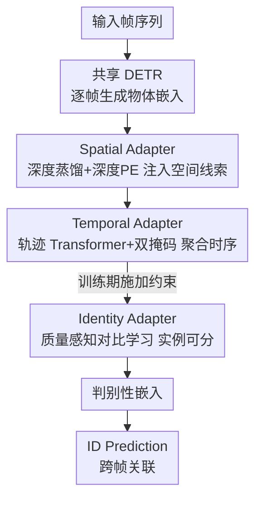

# From Detection to Association: Learning Discriminative Object Embeddings for Multi-Object Tracking

**会议**: CVPR 2026  
**论文**: [CVF Open Access](https://openaccess.thecvf.com/content/CVPR2026/html/Shao_From_Detection_to_Association_Learning_Discriminative_Object_Embeddings_for_Multi-Object_CVPR_2026_paper.html)  
**代码**: https://github.com/Spongebobbbbbbbb/FDTA  
**领域**: 目标检测 / 多目标跟踪  
**关键词**: 端到端多目标跟踪, DETR 物体嵌入, 深度蒸馏, 时序轨迹建模, 质量感知对比学习

## 一句话总结
FDTA 指出端到端 MOT 里 DETR 产生的物体嵌入"类间相似度过高"是关联精度差的根因，于是在共享 DETR 之外挂三个轻量 adapter——空间(深度)、时序(轨迹)、身份(对比学习)——分别从空间连续性、时序依赖、实例可分性三个角度显式精炼嵌入，在 DanceTrack/SportsMOT/BFT 上把 HOTA、IDF1、AssA 全面刷到 SOTA。

## 研究背景与动机
**领域现状**：多目标跟踪(MOT)要在视频里同时检测多个物体并跨帧保持同一身份。近年端到端方法(MOTR、MeMOTR、MOTRv2、MOTIP 等)用 DETR 一套架构同时做检测和关联，生成统一的物体嵌入(object embedding)，省掉了 tracking-by-detection 那种"先检测再匹配"的两阶段误差传播，在多个 benchmark 上效果亮眼。

**现有痛点**：这些端到端方法检测做得很好(DetA > 80%)，但关联精度却低得反常(AssA 只有 ~60%)。作者去翻 DETR 输出的物体嵌入，发现一个很尖锐的现象：同一帧里不同物体的嵌入相似度极高——DanceTrack 上超过 80% 的类间相似度得分大于 0.9(论文 Fig.1)。相似度这么高，不同物体在嵌入空间里几乎糊成一团，关联时自然分不清谁是谁。更说明问题的是，端到端方法物体嵌入的相似度分布，几乎和"只为检测预训练的原始 DETR"一模一样。

**核心矛盾**：检测和关联对嵌入的要求根本不同。检测只需要**类别级**区分(把所有人都识别成"person")、单帧瞬时定位、帧间相互独立；而关联需要**实例级**区分(person #1 vs person #2)、跨帧的连续空间理解、全局时序上下文。端到端方法只用检测+跟踪的联合损失**隐式**优化嵌入，缺乏面向"判别性"的显式约束，于是嵌入继承了检测的"类别级"特性，对关联来说判别力不足。

**核心 idea**：与其改架构或加更复杂的损失，不如**显式精炼物体嵌入的判别性**。作者先把检测/关联的需求差异拆成空间、时序、身份三个互补维度，再针对每个维度挂一个 adapter 去补足——这就是 FDTA(From Detection to Association)。

## 方法详解

### 整体框架
FDTA 建在标准端到端 MOT 架构之上：给定输入帧序列 $\{I_t\}_{t=1}^{T}$，共享 DETR 逐帧处理生成每个物体 $i$ 的嵌入 $e_i^t$，最后由 ID Prediction 模块预测身份完成跨帧关联。FDTA 不动这条主干，而是在 DETR 出来的嵌入上串接三个**显式精炼 adapter**：Spatial Adapter(SA)注入深度感知的 3D 几何线索补足空间连续性，Temporal Adapter(TA)沿整条历史轨迹聚合上下文补足时序依赖，Identity Adapter(IA)用质量感知对比学习把同一身份拉近、不同身份推远。三者从互补角度把"检测味"的嵌入改造成"判别性强、适合跟踪"的嵌入，再交给 ID Prediction 做关联。值得注意的是 IA 只在训练期生效、推理零开销，SA 也通过蒸馏在推理时甩掉大模型，所以整体只在 DETR 之上增加约 4% 的推理时间。

### 关键设计

**1. Spatial Adapter：用深度蒸馏给嵌入注入空间连续性**

针对"检测只要瞬时定位、关联却需要连续空间理解、遮挡时难分辨"这个痛点，SA 想到深度天然提供 3D 几何线索：物体被遮挡时，深度的连续性还能维持区分。具体做法是在 DETR 主干旁并行开一条卷积分支——两层卷积的 depth extractor 从 backbone 特征 $F^V$ 抽稠密特征 $F^{dense}$，再用单层卷积 depth head 通过 Linear-Increasing Discretization(LID)把每像素深度预测成离散 bin 上的概率 $d$，加权 bin 值得到深度图 $\hat{d}$。监督信号来自基础模型 Video Depth Anything 离线生成的**伪深度标签**(蒸馏)，且因为跟踪更关心前景，作者用一个加权深度损失给前景像素更大惩罚(前景权重设为 7)：

$$\mathcal{L}_{depth}=\frac{1}{N_{total}}\sum_{i,j} w_{i,j}\cdot \mathrm{FL}(d_{i,j},\bar{d}_{i,j})$$

其中 $\mathrm{FL}(\cdot)$ 是 Focal Loss，$w_{i,j}$ 区分前景/背景权重。拿到深度特征后还要"注入"嵌入：先用一个镜像 DETR encoder 的 depth encoder 精炼出 $F^D$，再把深度图 $\hat{d}$ 通过线性插值算成可学习的深度位置编码 $PE_d=(1-\delta)\cdot PE[\lfloor\hat{d}\rfloor]+\delta\cdot PE[\lceil\hat{d}\rceil],\ \delta=\hat{d}-\lfloor\hat{d}\rfloor$，最后在 DETR decoder 的视觉注意力层后额外加一层 **depth cross-attention**，让 object query 直接 attend 到 $F^D$。关键在于"蒸馏"——推理时大模型 Video Depth Anything 被丢弃，只留下学到的轻量分支(仅占 1.4% 推理时间)，这是端到端跟踪里第一次把深度增强嵌入做到几乎零成本。

**2. Temporal Adapter：用轨迹级 Transformer + 双掩码补足时序依赖**

SA 增强的还是帧内嵌入，缺乏跨序列的时序上下文。TA 直接在**轨迹层面**建模：在线跟踪到第 $t$ 帧时，把每个身份 $i$ 过去 $T$ 帧的历史聚成轨迹特征 $F_i^{traj}=\{e_i^{t-T},\dots,e_i^{t-1}\}$，用一个 $L=6$ 层的标准 Transformer encoder 处理。但标准注意力让所有 token 双向互看会带来两个问题：未来信息泄漏(看到了 $t$ 之后的帧)，以及和缺失物体的 `[empty]` token 发生不可靠交互。为此作者设计了一个专门的**双注意力掩码** $M\in\mathbb{B}^{T\times T}$，把"因果约束"和"缺失约束"合并到二值域：

$$M[j,k]=\begin{cases}1 & \text{if } k>j \text{ or not detected}\\ 0 & \text{otherwise}\end{cases}$$

即未来帧($k>j$)和未检测到的物体都被屏蔽，对角线保留以保证数值稳定。轨迹特征经掩码注意力 $\hat{F}_i^{traj}=\mathrm{TA}(F_i^{traj},M)$ 后就编码了可靠的时序依赖。消融显示，对缺失物体处理方式很关键：用零向量填充反而比不加 TA 还差(掉 1.3% HOTA)，而这个 missing mask 能涨 1.0% HOTA。

**3. Identity Adapter：质量感知对比学习直接对齐实例级关联目标**

前两个 adapter 在"跟踪目标"范围内增强嵌入，IA 则进一步引入和关联任务**直接对齐**的显式优化目标——实例级对比学习：把同一物体跨帧的嵌入拉近、不同物体的推远。先做对比对采样：聚合所有帧的嵌入成样本池，用匈牙利匹配给每个嵌入 $e_i^s$ 配 ground-truth box 得到身份标签，同身份组成正对集 $P$、不同身份组成负对集 $N$(类似 MoCo 的大负样本池思路)。但裸用嵌入做对比学习有两个坑，IA 对应两个模块化设计：(a) **IoU-Filter** 控质量——预测出来的样本可靠性参差不齐，只保留 $IoU_i^t\ge 0.5$ 的高质量嵌入，并给每个正对用两者 IoU 的调和平均 $w(e_i^s,e_j^k)=\frac{2\cdot IoU_i^s\cdot IoU_j^k}{IoU_i^s+IoU_j^k}$ 赋权；(b) **Consistent Feature Extractor(CFE)**——嵌入里含运动/姿态等帧变线索，直接对比会干扰时序信息，于是用一个 3 层 MLP $\phi$ 抽取身份一致特征再算对比损失：

$$\mathcal{L}_{IA}=\frac{1}{|P|}\sum_{(e_i^s,e_j^k)\in P} w(e_i^s,e_j^k)\cdot \mathcal{L}_{InfoNCE}(e_i^s,e_j^k)$$

其中 $\mathcal{L}_{InfoNCE}=-\log\frac{\exp(\phi(e_i^s)\cdot\phi(e_j^k)/\tau)}{\sum_{e\in E}\exp(\phi(e_i^s)\cdot\phi(e)/\tau)}$，温度 $\tau=0.1$。消融里这三件套缺一不可：裸 CL 反掉 1.0% HOTA，加 CFE 才把退化救回来(+1.5% HOTA)，再加 IoU-Filter 又稳涨 0.2%。IA 只在训练期工作，推理零开销。

### 损失函数 / 训练策略
端到端联合训练，总损失 $\mathcal{L}=\mathcal{L}_{det}+\lambda_{ID}\mathcal{L}_{ID}+\lambda_{depth}\mathcal{L}_{depth}+\lambda_{IA}\mathcal{L}_{IA}$，其中 $\mathcal{L}_{det}$ 是标准 DETR 损失、$\mathcal{L}_{ID}$ 是 ID 分类交叉熵，三个权重都设为 1.0。基于 Deformable DETR + ResNet-50(COCO 预训练)，每 batch 取 $T=30$ 帧视频序列，训 11 epoch，batch size 4，4×H200，AdamW(lr $1\times10^{-4}$)。

## 实验关键数据

### 主实验
三个外观相似、运动复杂的 benchmark 上全面 SOTA，关联类指标(HOTA/IDF1/AssA)提升尤其明显。

| 数据集 | 指标(HOTA/IDF1/AssA) | FDTA | 之前最好(端到端) | 提升 |
|--------|----------------------|------|------------------|------|
| DanceTrack | HOTA / IDF1 / AssA | 71.7 / 77.2 / 63.5 | MOTRv2 69.9 / 71.7 / 59.0 | +1.8 / +5.5 / +4.5 |
| DanceTrack(额外数据) | HOTA / IDF1 | 74.4 / 80.0 | MOTIP* 71.4 / 76.3 | +3.0 / +3.7 |
| SportsMOT | HOTA / IDF1 / AssA | 74.2 / 78.5 / 65.5 | MOTIP 71.9 / 75.0 / 62.0 | +2.3 / +3.5 / +3.5 |
| BFT(鸟群) | HOTA / IDF1 / AssA | 72.2 / 84.2 / 74.5 | MOTIP 70.5 / 82.1 / 71.8 | +1.7 / +2.1 / +2.7 |

DanceTrack 这种"穿同款衣服 + 同步舞蹈动作"导致极端类间相似的场景下涨点最有说服力；BFT 鸟群验证了非人类、超高密度场景下方法依然普适。

### 消融实验
三个 adapter 逐步叠加(DanceTrack test，HOTA/IDF1)：

| 配置 | HOTA | IDF1 | AssA | 说明 |
|------|------|------|------|------|
| baseline(无) | 69.4 | 74.5 | 60.2 | 仅 DETR 主干 |
| +SA | 70.2 | 74.8 | 61.2 | 单加空间 |
| +TA | 70.4 | 75.7 | 61.3 | 单加时序 |
| +IA | 70.1 | 74.8 | 60.7 | 单加身份 |
| +SA+TA | 70.8 | 76.8 | 61.9 | 两两组合 |
| +TA+IA | 71.0 | 76.5 | 62.2 | 两两组合 |
| Full(SA+TA+IA) | 71.7 | 77.2 | 63.5 | 完整模型 |

模块内部消融(均在 DanceTrack)：Depth PE 贡献 +0.4 HOTA；TA 的 missing mask 比零向量填充强 1.3 HOTA(零向量甚至比不加 TA 还差)；IA 里 CFE 是关键，把裸 CL 的 -1.0 HOTA 退化救回并净涨。

### 关键发现
- **类间相似度是关联差的真因**：定性分析(Fig.6/7)显示 baseline 的 ID 错误几乎都对应嵌入相似度矩阵里的高相似区域，FDTA 的 t-SNE 把同身份聚得紧、不同身份分得开，直接印证了核心假设。
- **三 adapter 互补**：单加任一个都涨，两两叠加再涨，三个齐全最好，说明空间/时序/身份确实是三个独立有效的维度。
- **几乎零成本**：1920×1080 下 SA 仅占 1.4% 推理时间、TA 占 2.7%、IA 训练期专用零推理开销；DETR 主干占 83.9%，整体 13.4 FPS，提点不掉速。

## 亮点与洞察
- **诊断先于方法**：先用嵌入相似度分布(Fig.1)把"端到端 MOT 关联差"量化成"类间相似度 >0.9 占 80%"，再对症下药，是很扎实的 problem-driven 思路——这个"检测嵌入≈关联嵌入"的观察本身就有启发性。
- **把"需求差异"拆成三维度做 adapter**：检测 vs 关联在空间/时序/身份上的需求错位被显式拆开，每个维度一个轻量旁路，比堆一个更复杂的统一损失更可解释、也更易增量验证。
- **蒸馏让深度"白嫖"**：用基础模型造伪深度标签训练、推理时丢掉大模型只留轻量分支，是把"foundation model 能力"低成本搬进实时跟踪的可复用 trick。
- **质量感知对比学习**：用 IoU 调和平均给正对赋权 + IoU-Filter 过滤噪声样本，把"预测样本不可靠"这个对比学习在跟踪场景的固有难点处理得很干净。

## 局限与展望
- **依赖伪深度标签质量**：SA 的深度蒸馏建立在 Video Depth Anything 的伪标签上，若该基础模型在特定场景(如鸟群、极端光照)失准，注入的空间线索可能反噪——论文未深入讨论伪标签错误的下游影响。⚠️
- **仍以 DETR 为主干**：83.9% 推理时间花在 DETR 上，方法的提点完全是"在不动主干前提下精炼嵌入"，对检测本身的瓶颈无能为力；DetA 相比部分 baseline 并非最高。
- **作者展望**：未来用视频生成、世界模型合成极端 corner case 来增强跟踪鲁棒性。

## 相关工作与启发
- **vs MOTRv2 / MOTIP(端到端)**：它们只用联合检测+跟踪损失隐式优化嵌入，缺判别性约束，导致类间相似度高；FDTA 显式精炼嵌入，在 DanceTrack 上 IDF1/AssA 大幅领先(+5.5/+4.5)。
- **vs tracking-by-detection(OC-SORT、DiffMOT、TrackTrack 等)**：两阶段方法解耦检测与关联、存在信息损失和误差传播；FDTA 保留端到端统一嵌入的优势，同时补上它们靠手工 Re-ID/运动模型才有的判别性。IA 是端到端跟踪框架里首次引入质量感知对比学习，区别于 QDTrack 等 tracking-by-detection 的对比学习。

## 评分
- 新颖性: ⭐⭐⭐⭐ 把"嵌入类间相似度过高"定位为端到端 MOT 关联瓶颈并用三维度 adapter 对症下药，诊断与方案都清晰，但每个 adapter 单看都是已有技术的组合。
- 实验充分度: ⭐⭐⭐⭐⭐ 三个差异化 benchmark + 逐模块/模块内消融 + 相似度矩阵/t-SNE/计算量分析，证据链完整。
- 写作质量: ⭐⭐⭐⭐⭐ 从现象观察到需求拆解再到方法，逻辑顺、图表到位。
- 价值: ⭐⭐⭐⭐ 关联指标全面 SOTA 且几乎零推理开销，对端到端 MOT 实用价值高。

<!-- RELATED:START -->

## 相关论文

- [\[CVPR 2026\] GMT: Effective Global Framework for Multi-Camera Multi-Target Tracking](gmt_effective_global_framework_for_multi-camera_multi-target_tracking.md)
- [\[AAAI 2026\] AerialMind: Towards Referring Multi-Object Tracking in UAV Scenarios](../../AAAI2026/object_detection/aerialmind_towards_referring_multi-object_tracking_in_uav_sc.md)
- [\[CVPR 2026\] Learning Multi-Modal Prototypes for Cross-Domain Few-Shot Object Detection](learning_multi-modal_prototypes_for_cross-domain_few-shot_object_detection.md)
- [\[CVPR 2026\] Multi-view Crowd Tracking Transformer with View-Ground Interactions Under Large Real-World Scenes](multi-view_crowd_tracking_transformer_with_view-ground_interactions_under_large_.md)
- [\[CVPR 2026\] Towards Persistence: Learning Topological Constraints for Event-based Small Object Detection](towards_persistence_learning_topological_constraints_for_event-based_small_objec.md)

<!-- RELATED:END -->
