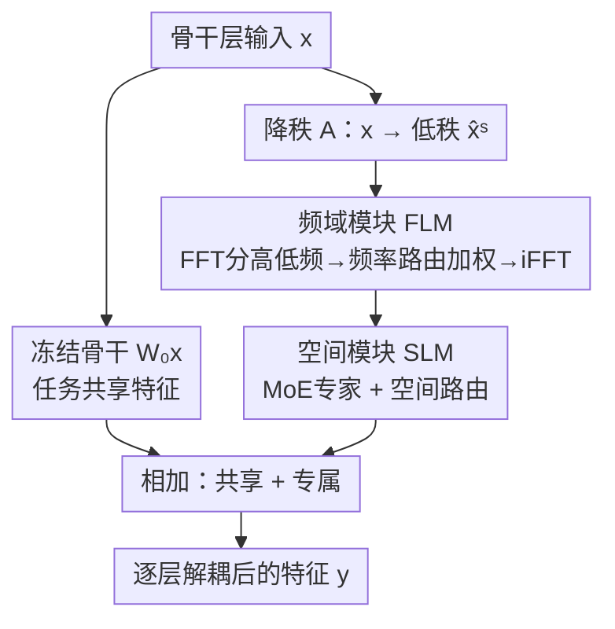

# FSLoRA: Harmonizing Detection and Re-Identification via Freq-Spatial Low-Rank Adapter for One-Stage Person Search

**会议**: CVPR 2026  
**论文**: [CVF Open Access](https://openaccess.thecvf.com/content/CVPR2026/html/Tian_FSLoRA_Harmonizing_Detection_and_Re-Identification_via_Freq-Spatial_Low-Rank_Adapter_for_CVPR_2026_paper.html)  
**代码**: https://github.com/personsearch/FSLoRA.git  
**领域**: 目标检测 / 行人搜索  
**关键词**: 行人搜索, 检测-ReID冲突, LoRA适配器, 混合专家, 频域解耦

## 一句话总结
FSLoRA 把 LoRA 当成"逐层特征解耦器"插进整个骨干网络，用空间域的 MoE 路由（SLM）和频域的高低频分解（FLM）在底层就把检测共享特征和 ReID 身份特征分开，以 <2% 额外参数即插即用地把多个一阶段行人搜索框架推上了新 SOTA。

## 研究背景与动机
**领域现状**：行人搜索（person search）要在一张未裁剪的全景图里同时完成"行人检测 + 跨图身份重识别（re-ID）"。一阶段方法把这两件事塞进一个端到端模型里共享骨干，效率高、是主流方向。

**现有痛点**：检测和 re-ID 在本质上互相打架——检测要的是"人和背景的共性"（所有人长得都像"一个人"才好框出来），re-ID 要的是"人和人之间的差异"（身份特异的细粒度纹理才能区分谁是谁）。同一个骨干同时优化这两个目标，特征会互相干扰。

**核心矛盾**：已有的两类解法都治标不治本。一类是损失重加权（loss re-weighting），只在训练时调梯度优先级，根本没动特征表示；另一类是特征解耦，但只在网络最后的 embedding 上拆，**底层特征依然纠缠**。可任务冲突恰恰是从早期特征纠缠开始累积的，只在末端或损失层面处理，注定有上限。

**本文目标**：把特征解耦从"末端 embedding"前移到"整个骨干的每一层"，在共享一套表示的同时，逐层、渐进地分离出检测专属和 ReID 专属特征。

**切入角度**：作者不想用笨重的多分支结构（每个任务一条独立支路，参数翻倍）。他们注意到 LoRA 这种低秩旁路本来是用来省参数做微调的，但它"低秩压缩→任务专属变换→升秩还原"的结构天然适合做轻量的特征分流。再加一个观察：检测靠**全局结构（低频）**、re-ID 靠**细粒度纹理（高频）**，这种差异在频域里能分得特别干净。

**核心 idea**：在骨干的每一层插一个"频-空双层低秩适配器"——空间上用 MoE 动态路由出任务相关特征，频域上用 FFT 把低频结构和高频细节按任务需求重新加权，从而在底层就完成检测/ReID 的特征解耦。

## 方法详解

### 整体框架
FSLoRA 的本质是把一个改造过的 LoRA 旁路插到骨干（这里用 VMamba）的每一个线性层上。原始骨干层权重 $W_0$ 冻结、负责抽取**任务共享特征**；旁路则负责抽取**任务专属特征**。一个完整的适配器从 LoRA → SLoRA → FSLoRA 逐步长出来：先用降秩矩阵 $A$ 把输入压到低秩，再经过频域模块 FLM 重整频率成分，最后由空间模块 SLM 用 MoE 路由升秩还原。检测和 re-ID 各配一套结构相同、但参数独立的适配器，于是整条骨干自上而下都在做"共享 + 专属"的双路特征分离。

前向可写成两项之和：

$$y = W_0 x + \mathbf{F}_{\text{SLM}} = W_0 x + \sum_{i=1}^{N} \omega_i^s E_i \mathbf{F}_{\text{FLM}}$$

第一项 $W_0 x$ 是冻结骨干给出的任务共享特征，第二项是 SLM 输出的任务专属特征，而 SLM 内部又吃的是 FLM 处理过的频域增强特征。注意一个工程细节：FLM 被放在 $A$ 和 $B$（即 SLM 的专家）**之间**而不是 $A$ 之前——因为 $A$ 已经把维度从 $d$ 降到 $r$，在低秩空间里做 FFT 能把这一步的参数/显存省下 $d/r$ 倍。

### 关键设计

**1. 把 LoRA 从"省参数微调"改用为"逐层特征解耦"**

这是全文的立意所在。原始 LoRA（$y = W_0 x + BAx$）的用途是冻结大模型、只训低秩旁路 $A,B$ 来省参数做迁移。FSLoRA 借用同一套"降秩 $A\in\mathbb{R}^{r\times d}$ → 升秩 $B\in\mathbb{R}^{d\times r}$、$r\ll d$"的结构，但目的完全不同：它不是为了省参数，而是把这个低秩旁路当成一个轻量的"任务专属分流器"，插在骨干每一层旁边，与冻结主干并联。冻结主干负责学共享表示，旁路负责学任务专属表示，于是"全骨干、逐层"的特征解耦就用极小的代价实现了——整套适配器只引入不到 2% 的额外参数，却避免了多分支结构动辄翻倍的开销。相比把解耦塞在末端 embedding 的做法，这一步直接在冲突最严重的底层共享骨干上动手。

**2. SLM：空间域的 MoE 路由，让不同专家各管一类任务相关特征**

SLM 解决的是"在共享骨干上怎么不靠多分支也能分出空间上的任务特异结构"。它把单一的升秩矩阵 $B$ 换成一组 LoRA 路径 $\{AB_1, \dots, AB_n\}$，每个 $B_i$ 当作一个专家 $E_i$，由一个空间级路由器动态决定各专家的贡献：

$$\mathbf{F}_{\text{SLM}} = \sum_{i=1}^{N} \omega_i^s E_i A x, \qquad \omega^s = \xi(W_g^\top x)$$

其中 $\xi(\cdot)$ 是 softmax，$W_g\in\mathbb{R}^{d\times n}$ 是路由变换矩阵。路由权重 $\omega^s = \{M_1,\dots,M_n\}$ 实际是一组空间特征掩码 $M\in\mathbb{R}^{H\times W}$，引导每个专家去关注不同的空间位置。可视化里能看到效果：检测专家的特征图覆盖整个人体区域（利于定位），re-ID 专家则聚焦头部、上衣这类身份判别区域。比起固定的单一变换，这种"专家 + 软路由"的设计让空间特征能按任务需求被动态激活和分离。论文实验发现专家数不是越多越好——固定参数预算下 $n=2,r=32$ 最优，专家太多反而妨碍骨干整合共享知识。

**3. FLM：频域分解 + 频率路由，按"检测吃低频、ReID 吃高频"重新加权**

FLM 是本文的第二个支点，专门利用一个观察：检测依赖全局低频结构，re-ID 依赖细粒度高频纹理，这种差异在频域里最好分。它先对降秩后的低秩特征 $\hat{x}^s = Ax$ 做 2D FFT 转到频域，再用理想低通/高通滤波器拆成高低频两支：

$$\hat{x}^f_{low} = \mathcal{F}_{low}(\hat{x}^f), \quad \hat{x}^f_{high} = \mathcal{F}_{high}(\hat{x}^f)$$

但直接硬切高低频会丢掉互补信息，所以 FLM 不做硬隔离，而是引入一个频率级路由器输出可学习权重 $w_{low}, w_{high}$ 来软性调和：

$$\hat{\mathbf{F}}^f = w_{low}\cdot \hat{x}^f_{low} + w_{high}\cdot \hat{x}^f_{high}$$

最后再 iFFT 转回空间域 $\mathbf{F}_{\text{FLM}} = \text{iFFT}(\hat{\mathbf{F}}^f)$ 喂给 SLM。论文实测学到的权重正好印证假设：检测分支给低频更高权重、re-ID 分支给高频更高权重，与振幅谱的变化一致。实现上低通截止频率取 30、高通取 40 最优，截止值偏了会要么抹掉 re-ID 需要的高频细节、要么削弱检测需要的结构线索。模块顺序也讲究：$A\to \text{FLM}\to \text{SLM}$ 既精度最高又参数最省（把 FLM 放在低秩空间里），换成 $\text{FLM}\to A$ 或 $A\to \text{SLM}\to \text{FLM}$ 都会掉点且多花约 96K 参数。

### 损失函数 / 训练策略
方法本身不改损失，沿用各 baseline（NAE / AlignPS / ROI-AlignPS）原有的检测损失与 re-ID 损失，FSLoRA 只作为骨干内的即插即用适配器替换/增强特征抽取。骨干用 ImageNet 预训练的 VMamba，被适配的 $W_0$ 对应 VMamba 前馈网络里的线性层以及 SS2D 块中的两个线性层；LoRA 配置 $r=32$、专家数 $n=2$。

## 实验关键数据

### 主实验
在 CUHK-SYSU、PRW、PoseTrack21 三个基准上对比 SOTA（M=VMamba 骨干，T=Transformer 骨干）：

| 数据集 | 指标 | FSLoRA(M) | 之前最好 | 说明 |
|--------|------|-----------|----------|------|
| PRW | mAP | **61.3** | 59.8 (SOLIDER) | 新 SOTA |
| PRW | Top-1 | **89.5** | 89.0 (SPNet-L) | 新 SOTA |
| CUHK-SYSU | mAP | **96.6** | 95.8 (ROI-AlignPS†) | 新 SOTA |
| CUHK-SYSU | Top-1 | **97.0** | 96.3 | 新 SOTA |
| PoseTrack21 | mAP | **70.25** | 65.12 (SeqNet) | +5.1pp |
| PoseTrack21 | Top-1 | **90.10** | 87.13 (PretrainPS) | 多人遮挡场景 |

即插即用泛化性（PRW 上把 FSLoRA 加到不同 baseline）：

| Baseline | mAP | +FSLoRA | Top-1 | +FSLoRA |
|----------|-----|---------|-------|---------|
| NAE | 56.03 | **59.11** (+3.08) | 87.36 | 88.99 (+1.63) |
| AlignPS | 53.13 | **55.33** (+2.20) | 85.53 | 87.11 (+1.58) |
| ROI-AlignPS | 59.30 | **61.32** (+2.02) | 87.65 | 89.53 (+2.08) |

即使在很强的 ROI-AlignPS 上也能再提 ~2pp，说明它是一个通用的"加成"模块。

### 消融实验
SLM / FLM 组件有效性（PRW，NAE 基线，mAP/Top-1 为 re-ID，AP/Recall 为检测）：

| SLM | FLM | mAP | Top-1 | AP | Recall | 说明 |
|-----|-----|-----|-------|-----|--------|------|
| | | 56.03 | 87.36 | 91.31 | 96.67 | 基线 |
| ✓ | | 58.28 | 88.54 | 92.11 | 96.60 | 单 SLM，+2.25pp mAP |
| | ✓ | 58.40 | 88.30 | 92.21 | 96.94 | 单 FLM，+2.37pp mAP |
| ✓ | ✓ | **59.11** | **88.99** | **92.55** | **97.07** | 完整模型 |

FLM 放置位置（PRW）：

| 模块顺序 | mAP | Top-1 | △参数 |
|----------|-----|-------|-------|
| A→FLM→SLM（采用） | **59.11** | **88.99** | — |
| FLM→A→SLM | 57.71 | 87.95 | +96.29K |
| A→SLM→FLM | 58.06 | 88.05 | +96.29K |

### 关键发现
- SLM 和 FLM 单独加都能涨 ~2.3pp mAP，且**两者互补**：SLM 主管空间任务结构、FLM 主管频率成分，合起来才到最佳，验证了"空间 + 频域"双层适配的设计动机。
- 增益来自结构设计而非堆参数：补充材料的等参数预算实验显示提升源于 bi-level adaptation，且全套适配器只增 <2% 参数。
- 专家数存在甜点：固定参数预算下 $n=2,r=32$ 最优；专家过多反而妨碍共享知识整合，过少又抓不住任务特异特征。
- FLM 频率权重的可视化是亮点级证据——学到的权重自发地"检测重低频、ReID 重高频"，与振幅谱变化吻合，把"用频域分任务"的假设坐实了。
- 大画廊鲁棒性：CUHK-SYSU 上随 gallery size 增大，FSLoRA 的 mAP 下降比其他方法更慢。

## 亮点与洞察
- **把 PEFT 工具反向用作"特征解耦器"**：LoRA 一直被当成省参数微调的手段，本文把它的低秩旁路结构重新诠释为"逐层任务分流器"，这种"老结构新用途"的视角迁移很巧妙，也是低成本实现全骨干解耦的关键。
- **频域是分离多任务特征的天然坐标系**：检测=低频结构、ReID=高频纹理这个直觉被频率路由器学到的权重直接验证，给"用频域解耦多任务冲突"提供了可迁移的范式，理论上能搬到任何"粗粒度 vs 细粒度"目标打架的多任务场景。
- **在低秩空间里做 FFT 省显存**：把 FLM 卡在 $A$（降秩）之后，等于在 $r$ 维而非 $d$ 维上做频域变换，省 $d/r$ 倍参数还顺带涨点，是个干净的工程取舍。
- 即插即用、对 anchor-based / anchor-free / 混合三类 baseline 都涨点，落地友好。

## 局限与展望
- 作者承认方法目前局限在行人搜索，展望里提到要扩展到更广的多任务学习场景，但论文未给出在其它多任务（如检测+分割）上的验证，泛化性仍是假设。
- ⚠️ FLM 用的是固定截止频率（30/40）的理想滤波器，需按数据集调，缺少自适应截止机制；不同分辨率/场景下最优截止可能漂移。
- 频域 FFT/iFFT 虽放在低秩空间，但每层都插适配器在推理时仍有额外算子开销，论文主要强调参数量 <2%，未细报推理延迟。
- 骨干绑定 VMamba（也试了 Transformer），但没有在纯 CNN（ResNet）骨干上验证适配器是否同样有效。

## 相关工作与启发
- **vs 损失重加权（如 GALW [30] 的梯度幅值分组）**：它们只在训练时调任务梯度优先级，不碰特征表示；FSLoRA 直接改特征抽取、在底层解耦，实测 PRW mAP 从 GALW 的 52.9 升到 61.3。
- **vs 末端特征解耦（如 NAE [3] 把角度/范数分给 re-ID/检测）**：NAE 只在最终 embedding 上拆，底层仍纠缠；FSLoRA 在整条骨干逐层拆，且把 FSLoRA 加到 NAE 上还能再涨 +3.08pp mAP，证明二者解决的是不同阶段的问题。
- **vs 其它 LoRA 变体（HydraLoRA、MTLoRA）**：这些变体仍以参数效率为目标做多任务适配；FSLoRA 的落点是"解决子任务冲突"，把空间+频域解耦直接嵌进骨干，目的和机制都不同。

## 评分
- 新颖性: ⭐⭐⭐⭐⭐ 把 LoRA 重新定义为逐层特征解耦器、并引入频域路由解多任务冲突，视角新且自洽
- 实验充分度: ⭐⭐⭐⭐⭐ 三数据集 SOTA + 三类 baseline 即插即用 + 完整的组件/位置/专家数/截止频率消融 + 频率权重可视化佐证假设
- 写作质量: ⭐⭐⭐⭐ 动机—方法—验证逻辑清晰，公式与图配合好；部分频域细节依赖补充材料
- 价值: ⭐⭐⭐⭐ 即插即用、参数 <2%、对一阶段行人搜索是实用的通用增益模块，思路可迁移到其它多任务冲突场景

<!-- RELATED:START -->

## 相关论文

- [\[CVPR 2026\] Object-Generalized Re-Identification: A Step Towards Universal Instance Perception](object-generalized_re-identification_a_step_towards_universal_instance_perceptio.md)
- [\[CVPR 2026\] AR²-4FV: Anchored Referring and Re-identification for Long-Term Grounding in Fixed-View Videos](ar2-4fv_anchored_referring_and_re-identification_for_long-term_grounding_in_fixe.md)
- [\[CVPR 2026\] EW-DETR: Evolving World Object Detection via Incremental Low-Rank DEtection TRansformer](ew-detr_evolving_world_object_detection_via_incremental_low-rank_detection_trans.md)
- [\[CVPR 2026\] RARE: Learn to RAnk and REtrieve for Monocular 3D Object Detection](rare_learn_to_rank_and_retrieve_for_monocular_3d_object_detection.md)
- [\[CVPR 2026\] Beyond Semantic Search: Towards Referential Anchoring in Composed Image Retrieval](beyond_semantic_search_towards_referential_anchoring_in_composed_image_retrieval.md)

<!-- RELATED:END -->
