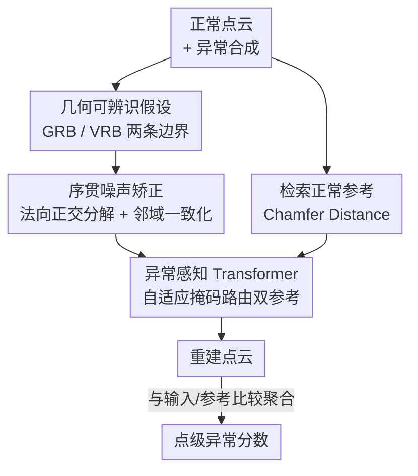

# Geometry-Aligned and Anomaly-Aware Reconstruction for 3D Anomaly Detection

**会议**: CVPR 2026  
**论文**: [CVF Open Access](https://openaccess.thecvf.com/content/CVPR2026/html/Wu_Geometry-Aligned_and_Anomaly-Aware_Reconstruction_for_3D_Anomaly_Detection_CVPR_2026_paper.html)  
**代码**: 无  
**领域**: 3D视觉  
**关键词**: 3D异常检测, 点云重建, 扩散模型, 几何对齐噪声, 异常感知注意力  

## 一句话总结
AARD 把扩散式点云异常检测的两处短板（随机噪声破坏几何、统一参考模糊细节）分别用"让噪声对齐顶点法向的几何矫正"和"给异常区配正常参考、给正常区配输入参考的异常感知 Transformer"解决，在 Real3D-AD（O-AUROC 0.82）和 Anomaly-ShapeNet（O-AUROC 0.93）上刷新 SOTA。

## 研究背景与动机

**领域现状**：点云异常检测（找出工件表面凸起、凹陷、裂纹、孔洞等缺陷）目前主流是"基于重建"的范式——先用只见过正常样本（外加合成异常）的扩散模型把输入点云重建一遍，再比较重建结果和输入的几何差异来定位异常。R3D-AD、MC3AD 等都属此类。

**现有痛点**：作者指出这类扩散重建有两个被忽视的系统性问题。其一是**几何破坏（Geometry Violation）**：扩散加噪时随机采样的高斯噪声向量方向各向同性，会偏离局部表面法向，导致相邻顶点的去噪轨迹"交叉打架"——例如碗沿上两个相邻异常点被推向相反方向（一个朝左下、一个朝左上），最终重建出来的轮廓模糊。其二是**参考引导不分区（Undistinguished Guidance）**：现有方法对正常区和异常区一视同仁地施加同一份粗粒度的输入形状嵌入，结果正常区拿不到足够细的结构引导、异常区又缺少正确的重建方向，既丢细节又修不干净缺陷。

**核心矛盾**：扩散过程的"随机性"和异常检测要求的"高几何保真度"天然冲突——加噪要够随机才能学到去噪能力，但纯随机噪声不尊重物体的法向/拓扑结构；而单一参考无法同时满足"正常区要保细节、异常区要被纠正"这对相反需求。

**本文目标**：在不牺牲扩散框架的前提下，(1) 让加噪过程"对齐几何"，使去噪轨迹被拉直；(2) 让重建引导"分区可辨"，正常区和异常区拿到各自该拿的参考。

**切入角度**：作者提出一个**几何可辨识假设**——点云在扩散中的状态可以从"完全不可辨识的纯噪声"连续过渡到"完全可辨识的几何"，中间存在两条可量化的边界。沿这个连续谱去约束噪声幅度与方向，就能在保留去噪灵活性的同时守住几何结构。

**核心 idea**：把噪声"正交分解后向法向对齐 + 邻域平均做一致化"来矫正加噪，再用一个异常感知 Transformer 把"正常参考"路由给异常区、"输入参考"路由给正常区，从而在同一个扩散重建框架内同时实现几何保真和异常纠正。

## 方法详解

### 整体框架
AARD 是一个扩散重建框架，整条 pipeline 分两段发力：**加噪侧**做"序贯噪声矫正"把交叉的去噪流拉直，**去噪侧**用"异常感知 Transformer"把不同参考精确投递到不同区域。训练时先对正常点云做异常合成得到带缺陷输入，并按 Chamfer Distance 检索最相似的正常参考；噪声经几何矫正与顶点矫正后注入，再由异常感知 Transformer 在自适应异常掩码引导下融合"输入参考"和"正常参考"特征预测噪声完成重建；测试时把重建点云分别与测试点云、正常参考比较，聚合成点级异常分数。

### 关键设计

**1. 几何可辨识假设：为"加多少噪、怎么加"立可量化的标尺**

针对"随机噪声破坏几何"的痛点，作者先在理论层面建立**几何可辨识假设（Geometry Recognizability Hypothesis）**：把一个顶点状态写成 $(p_s, p_r)$，$p_s\in\mathbb{R}^3$ 是空间位置、$p_r\in\mathbb{R}^3$ 是表面法向朝向。完全不可辨识的纯噪声态为 $p_r^{low}=g_d,\ p_s^{low}=p_s + g_s\cdot p_r^{low}$（$g_s,g_d$ 是幅度噪声和方向噪声），完全可辨识态则是 $p_s^{high}=p_s,\ p_r^{high}=p_r$。在这两个极端之间，作者切出两条边界：**几何可辨识边界（GRB）** 给出保住全局轮廓/拓扑所需的最小结构信息，**顶点可辨识边界（VRB）** 给出既保留局部邻域关系又留足重建灵活度的中间态。

GRB 被具体化为"3D 空间离散化"问题：把空间划成 $g\times g\times g$ 的均匀网格，$g=2$ 太粗（物体几乎占满所有格子，无法分辨子结构），$g=4$ 时物体被分解成可辨的子部件又保住全局组成——于是把每个顶点的各向同性噪声占据球半径约束在不越过相邻格子内，得到归一化噪声上界 $\sigma_{max}=(1-(-1))/g=0.5$。这条 $\sigma_{max}<0.5$ 成为后续噪声矫正的硬约束。这个假设的价值在于：它把"扩散加噪该克制到什么程度"从经验调参变成一个有几何含义的可量化目标。

**2. 序贯噪声矫正：让噪声向法向靠拢、再让邻域方向一致**

这是几何对齐的核心，分两步串行执行，目标是把"交叉打架的去噪轨迹"拉成"对齐结构的直线流"。

第一步 **正交几何矫正（Orthogonal Geometry Rectification）**：把每个采样的高斯噪声 $g$ 沿顶点法向 $n$ 正交分解为法向分量和切向分量

$$g_r = \frac{g\cdot n}{n\cdot n}\, n,\qquad g_t = g - g_r,$$

其中法向分量 $g_r$ 保几何保真、切向分量 $g_t$ 正是制造交叉去噪流的"坏分量"，要被抑制。在 GRB 约束下强化法向、压制切向，得到矫正后状态

$$p_r' = n\cdot\big(\alpha p_d + (1-\alpha)(\beta g_r + (1-\beta)g_t)\big),\qquad p_s' = \alpha p_s + (1-\alpha)p_r',$$

$\alpha\sim U(0,0.5)$ 是随机缩放，$\beta=\sqrt{\sigma_{max}^2-\alpha^2}$ 由 GRB 推出以维持几何一致。⚠️ 原文式 (5) 中两处噪声分量记号略有混用（$g_r$/$g_{\bar r}$），此处按"法向保留、切向抑制"的语义还原，以原文为准。

第二步 **顶点图矫正（Vertex-Graph Noise Rectification）**：几何矫正只保证了和全局结构对齐，但独立采样仍会让相邻顶点方向不一致。作者把顶点按 $k=16$ 聚成簇，算簇内平均噪声方向 $p_r^{avg}=\frac{1}{k}\sum_{i=1}^k p_r^i$，再把它和单点矫正方向融合：

$$p_r'' = \beta\, p_r + (1-\beta)\big(\gamma\, p_r^{avg} + (1-\gamma)\, p_r'\big),$$

$\gamma=0.5$ 平衡"群体一致"与"单点灵活"。两步合起来就实现了"全局对法向、局部不冲突"的去噪轨迹。和旧方法直接灌各向同性高斯噪声相比，这里的噪声被几何"驯化"过，因此重建轮廓更锐利。

**3. 异常感知 Transformer：给异常区配正常参考、给正常区配输入参考**

针对"参考不分区"的痛点，作者设计三路（noisy / 输入参考 / 正常参考）编码-解码 Transformer，关键是其中的**异常感知注意力（Anomaly-aWare attention, AW）**。正常参考由训练集里 Chamfer Distance 最小的样本检索得到——为对齐姿态，每个候选沿 x/y/z 轴以 $10^\circ$ 步长在 $[-90^\circ,+90^\circ]$ 内旋转，共 5832 个候选取 CD 最低者。

给定 noisy 查询 $Q$ 和正常/输入参考的键 $K_n,K_i$，先算两张注意力图 $S_n=\mathrm{Softmax}(QK_n^\top),\ S_i=\mathrm{Softmax}(QK_i^\top)$。由于二者共享查询、只换键，它们的差异天然高亮了异常区，于是自适应异常掩码同时利用几何偏差和注意力分歧：

$$M = \delta(\lVert P_i - P_n\rVert_2) + \delta(\lVert S_i - S_n\rVert_2),$$

$\delta(\cdot)$ 是把值归一化到 $[0,1]$ 的 min–max 缩放。再用 $M$ 做一次软精化 $\hat S_n,\hat S_i = \mathrm{Softmax}(\mathrm{MLP}([S_n\Vert S_i]))\odot[M\Vert 1{-}M]$，残差回注后融合双参考的 value：

$$F = \mathrm{Softmax}\!\Big(\tfrac{\tilde S_n}{\sqrt d}\Big)V_n + \mathrm{Softmax}\!\Big(\tfrac{\tilde S_i}{\sqrt d}\Big)V_i.$$

掩码 $M$ 把"正常参考"权重投给异常区（用正确结构纠缺陷）、把"输入参考"权重投给正常区（保真实细节），从而在一次注意力里同时满足那对相反需求。这正是相对统一粗参考的关键区别。

### 损失函数 / 训练策略
训练时合成异常 $P_i = P_n + d$，注入噪声先经矫正 $\epsilon'=r(\epsilon)$，总异常噪声 $\mu=\epsilon'+d$。重建目标预测异常噪声：

$$L_{rec}=\mathbb{E}\big[\lVert \mu_t - \mu_\theta(z_t, t, \tau_{\theta_0}(P_n), \tau_{\theta_1}(P_i))\rVert^2\big],$$

$z_t$ 为 $t$ 时刻噪声点云，$\tau_\theta(\cdot)$ 为编码后的正常参考/异常测试特征。检测阶段把重建点云 $P_r$ 与测试点云 $P$、正常参考 $P_n$ 联合比较再平均池化得点级分数：

$$S_p = \mathrm{AvgPool}\big(\mathrm{Norm}(\lVert P_r-P\rVert_2 + \lVert P_r-P_n\rVert_2)\big).$$

实现上输入 16,384 点，k-NN 取 $k=[16,16]$，编码器 16 个 Transformer block、解码器 6 个，hidden=1024，Adam（lr $1\times10^{-5}$）、batch 32，2×RTX 3090。

## 实验关键数据

### 主实验
两个工业点云异常检测基准：Real3D-AD（12 类、扫描真实物体）与 Anomaly-ShapeNet（40 类合成）。指标为物体级 O-AUROC 与点级 P-AUROC（越高越好）。

| 数据集 | 指标 | AARD(本文) | 之前最好 | 说明 |
|--------|------|-----------|----------|------|
| Real3D-AD | O-AUROC(avg) | **0.820** | 0.802 (PASDF, ICCV25) | Mean Rank 1.79，12 类多数第一 |
| Real3D-AD | P-AUROC(avg) | **0.860** | 0.837 (MC4AD) | Mean Rank 1.83 |
| Anomaly-ShapeNet | O-AUROC(avg) | **0.931** | 0.912 (MC4AD) | 15 类汇总，含 Simple3D(AAAI26) 0.860 |

在 Real3D-AD 上即便对手在个别类极强（如 PASDF 在 Fish/Seahorse 上 0.989/1.000），AARD 仍以更稳的整体表现（平均排名 1.79）夺得 avg 第一。

### 消融实验
在 Anomaly-ShapeNet 上逐个加组件：几何噪声矫正 GNR、顶点噪声矫正 VNR、正常参考 NR、输入参考 IR、异常掩码 AM。指标为重建 F-Score 与检测 O-AUROC。

| 配置 | GNR | VNR | NR | IR | AM | F-Score | O-AUROC |
|------|-----|-----|----|----|----|---------|---------|
| a 基线(纯Transformer+线性扩散) | × | × | × | × | × | 0.719 | 0.772 |
| b +GNR | ✓ | × | × | × | × | 0.815 | 0.802 |
| c +VNR | × | ✓ | × | × | × | 0.791 | 0.796 |
| d +GNR+VNR | ✓ | ✓ | × | × | × | 0.832 | 0.825 |
| e +NR+AM | ✓ | ✓ | ✓ | × | ✓ | 0.926 | 0.915 |
| f +IR+AM | ✓ | ✓ | × | ✓ | ✓ | 0.947 | 0.893 |
| g 完整 | ✓ | ✓ | ✓ | ✓ | ✓ | **0.953** | **0.931** |

超参敏感性（O-AUROC）：网格数 $g$ 在 4 时最佳（0.931，过小 0.857/过大 0.898 都掉）；簇大小 $k=16$ 最佳（0.931）；融合权重 $\gamma=0.5$ 最佳（0.931）。

### 关键发现
- **两步噪声矫正各自有效且互补**：单加 GNR/VNR 分别提升 O-AUROC 约 3% / 2.4%，合用到 0.825；它们主要保障"重建得像"，F-Score 从 0.719 提到 0.832。
- **异常感知参考是检测精度的主升力**：在矫正基础上 AM+NR 带来约 9% 提升、AM+IR 约 6.8%，说明"正常参考纠异常 + 输入参考保细节"对检测比对重建更关键；NR 偏向检测（O-AUROC 0.915）、IR 偏向重建保真（F-Score 0.947）。
- **几何边界不是越细越好**：$g=4$ 对应 $\sigma_{max}=0.5$ 是"够细分辨子结构、又够粗容忍噪声"的甜点，偏离两侧都降，印证了 GRB 假设的几何含义。

## 亮点与洞察
- **把扩散加噪从"灌随机噪声"改成"按法向正交分解后定向加噪"**：用 $g=g_r+g_t$ 把噪声拆成"保几何"和"坏轨迹"两份再分别强化/抑制，这个正交分解思路简单但直击交叉去噪流的根因，可迁移到其它对几何敏感的点云扩散任务。
- **用"同查询不同键"的注意力分歧当异常定位器**：$\lVert S_i-S_n\rVert_2$ 不需要额外标注就能高亮异常区，再和几何偏差相加成掩码，是个轻量又自洽的无监督定位信号。
- **双参考路由解决一对相反需求**：同一注意力层里让异常区吃正常参考、正常区吃输入参考，避免了"单参考必然顾此失彼"，这个"按区域分配引导源"的设计模式对图像修复/补全同样有借鉴价值。

## 局限与展望
- 正常参考检索要对 5832 个旋转候选逐一算 Chamfer Distance，开销不小；对类内形变大的物体，"最相似正常样本"未必真能代表该实例的正确结构。⚠️ 论文未报告检索/推理耗时，实际部署成本待评。
- 训练依赖异常合成 $P_i=P_n+d$，合成扰动 $d$ 的分布是否覆盖真实缺陷类型直接决定泛化；每类训练集仅 4 个正常样本，对参考库的代表性是潜在瓶颈。
- 几何可辨识假设里 GRB/VRB 的推导较启发式（如 $g=4$、$\sigma_{max}=0.5$ 来自网格直觉），原文部分公式记号有笔误，理论严谨性有提升空间。
- 改进方向：用可学习/特征空间检索替代暴力旋转匹配；把 VRB 也显式建模进损失而非只用 GRB 当硬约束。

## 相关工作与启发
- **vs R3D-AD (ECCV24)**：R3D-AD 用合成异常做噪声点云重建训练 + 形状嵌入提保真，但仍是统一参考、随机噪声；本文在它之上把噪声对齐几何、把参考分区路由，定性对比中 R3D-AD 轮廓模糊、误报多，AARD 边界清晰、定位准。
- **vs MC3AD / MC4AD**：MC 系把重建扩到特征级并用几何法向变化做异常早检；本文同样重视法向，但落点在"加噪阶段就矫正噪声方向"而非仅用法向引导检测，Anomaly-ShapeNet O-AUROC 0.931 vs 0.912。
- **vs 内存库类 (Reg3D-AD / Shape-guided)**：它们靠检索正常样本内存库比对特征；本文也检索正常参考，但把它作为扩散重建的"纠错参考"注入注意力，而非仅做最近邻比对，兼得重建与检测。

## 评分
- 新颖性: ⭐⭐⭐⭐ 把"几何对齐噪声"和"分区参考路由"两个角度同时引入扩散式 3D 异常检测，切口清晰
- 实验充分度: ⭐⭐⭐⭐ 两大基准 + 组件/超参双消融，但缺效率分析、部分类被对手反超
- 写作质量: ⭐⭐⭐ 思路清楚，但多处公式记号与拼写有笔误，理论部分偏启发式
- 价值: ⭐⭐⭐⭐ 工业点云缺陷检测刚需，双 SOTA 且设计可迁移

<!-- RELATED:START -->

## 相关论文

- [\[CVPR 2026\] GS-CLIP: Zero-shot 3D Anomaly Detection by Geometry-Aware Prompt and Synergistic View Representation Learning](gs-clip_zero-shot_3d_anomaly_detection_by_geometry-aware_prompt_and_synergistic_.md)
- [\[CVPR 2026\] InvAD: Inversion-based Reconstruction-Free Anomaly Detection with Diffusion Models](invad_inversion-based_reconstruction-free_anomaly_detection_with_diffusion_model.md)
- [\[CVPR 2026\] A Semantically Disentangled Unified Model for Multi-category 3D Anomaly Detection](a_semantically_disentangled_unified_model_for_multi-category_3d_anomaly_detectio.md)
- [\[CVPR 2026\] Target-Aware Invertible Encoder with Reconstruction Guidance for Infrared Small Target Detection](target-aware_invertible_encoder_with_reconstruction_guidance_for_infrared_small_.md)
- [\[CVPR 2026\] Multi-Prototype Compactness and Boundary-Aware Synthesis for Unsupervised Anomaly Detection](multi-prototype_compactness_and_boundary-aware_synthesis_for_unsupervised_anomal.md)

<!-- RELATED:END -->
