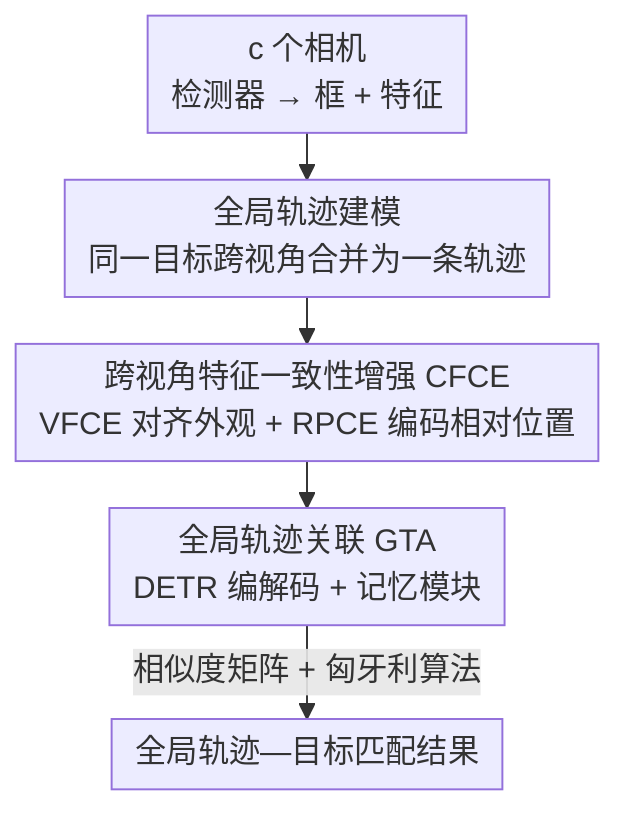

# GMT: Effective Global Framework for Multi-Camera Multi-Target Tracking

**会议**: CVPR 2026  
**论文**: [CVF Open Access](https://openaccess.thecvf.com/content/CVPR2026/html/Zhen_GMT_Effective_Global_Framework_for_Multi-Camera_Multi-Target_Tracking_CVPR_2026_paper.html)  
**代码**: https://github.com/FoxCanned/GMT  
**领域**: 目标检测与跟踪  
**关键词**: 多相机多目标跟踪, 全局轨迹关联, 跨视角特征一致性, DETR跟踪, MCMT数据集  

## 一句话总结
GMT 把传统「单相机跟踪 + 跨相机关联」两阶段流程重构成统一的「全局轨迹—目标」关联：先用 CFCE 模块把同一目标在不同视角下的外观与空间特征对齐到一致空间，再用 DETR 式的 GTA 模块让新检测目标直接与编码了多视角历史信息的全局轨迹做匹配，在自建的大规模 VisionTrack 等 6 个数据集上 IDF1 / CVIDF1 等指标全面领先。

## 研究背景与动机
**领域现状**：多相机多目标跟踪（MCMT）要在多个**视野重叠**的相机里定位并关联同一批目标。当前主流做法是两阶段范式：先用现成的单相机跟踪器（SCT，如 SORT 系）在每个视角内独立产出局部轨迹，再用一个跨相机关联模块（ICT）把不同视角的结果拼起来。

**现有痛点**：在这套范式里，最终跟踪结果**主要由 SCT 阶段决定**，而 SCT 只用到单视角的帧内信息。多视角信息只在第二阶段被动地"补救"那些 SCT 漏掉的匹配，对整体跟踪贡献很有限——这恰恰浪费了 MCMT 相比单视角跟踪最大的优势：多视角能为遮挡、外观剧变的目标提供更丰富、更具判别力的观测。此外，把跨视角关联当成一个独立阶段，当视角差异大或相机数量增多时，误差会被放大。

**核心矛盾**：多视角信息明明是 MCMT 的核心红利，却被两阶段结构挤到了"事后纠错"的边缘位置；同时跨视角的独立匹配阶段本身又是一个额外的、易错的环节。

**本文目标**：让多视角信息在跟踪的**主过程**中被直接利用，并顺手把"跨视角匹配"这个独立阶段消掉。

**切入角度**：与其为每个视角各自维护轨迹，不如把"同一个历史目标在所有视角下的观测"统一编码成一条**全局轨迹**。这样跟踪问题就变成"新检测目标属于哪条全局轨迹"的全局级关联。

**核心 idea**：用"全局轨迹—目标关联"替代"单相机跟踪 + 跨相机关联"，让全局轨迹天然携带跨视角、跨帧的多视角信息，跟踪时直接消费它。

## 方法详解

### 整体框架
GMT 在时刻 $t$ 接收来自 $c$ 个相机的图像，先用检测器（CenterNet + DLA-34 backbone）检出所有目标，得到边界框集合 $B_t=\{b_i\}_{i=1}^N$ 和对应特征 $F_t=\{f_i\}_{i=1}^N$。整条流水线分三步：

1. **CFCE 对齐**：把 $F_t$ 从"以视角为中心"的空间投影到"以轨迹为中心"的一致空间（VFCE），并额外编码目标间的相对空间关系（RPCE），二者拼接成关联特征 $F^{asso}_t$；
2. **GTA 关联**：把最近 $T$ 帧所有视角的目标特征拼成全局轨迹表示 $\Gamma=\{\tau_k\}_{k=1}^K$，用 DETR 式 encoder-decoder 让 $F^{asso}_t$ 与 $\Gamma$ 交互，产出增强后的 $\overline{F}^{asso}_t$；
3. **匈牙利匹配**：计算 $\overline{F}^{asso}_t$ 与 $\Gamma$ 的相似度矩阵，用匈牙利算法得到目标—轨迹的指派结果，并用记忆模块找回长时遮挡的轨迹。

关键在于：全局轨迹 $\Gamma$ 编码了"同一目标在所有视角、所有历史帧"的信息，所以在做关联那一刻，多视角线索就已经在参与判别，而不是等 SCT 之后再补。

### 关键设计

**1. 全局轨迹建模：把两阶段重构成统一的全局关联**

针对"多视角信息被挤到事后纠错"这一根本痛点，GMT 不再为每个视角独立指派轨迹，而是在跟踪开始前就把同一目标在不同视角下的局部轨迹**合并成一条全局轨迹**，并赋予跨视角一致的目标 ID。这一步把 MCMT 从"SCT + ICT"两阶段，直接改写成一个全局级的"轨迹—目标匹配"任务。好处有两点：其一，全局轨迹同时包含跨帧的时序上下文和来自所有视角的多样视觉表征，跟踪时可以**直接**消费多视角线索；其二，因为目标 ID 已经跨视角统一，后续就不再需要那个独立、易错的跨视角匹配阶段。这是全文的概念基石，后面 CFCE 和 GTA 都是为支撑"全局轨迹可用、可关联"而设计的。

**2. CFCE：跨视角特征一致性增强，让"同一目标在不同相机下长得像"**

把多视角特征塞进一条统一轨迹会遇到一个硬障碍：不同相机视角可视为不同的域，同一目标在不同相机下的特征常有明显差异。CFCE 由两个子模块协同解决这个问题。**VFCE（视觉特征一致性增强）** 用一个两层 MLP 投影头把 $F_t$ 从视角中心空间映射到轨迹中心空间 $F^\tau_t$，并用度量学习监督同 ID 特征的一致性：

$$L_{\text{VFCE}} = L_{\text{CE}} + L_{\text{Triplet}} + L_{\text{Center}}$$

每个预测框按与真值框最大 IoU 分配 ID。**RPCE（相对位置一致性增强）** 则利用"跨视角投影一致性"这一几何先验——同一场景不同视角的目标位置图可以通过仿射变换对齐。对第 $i$ 个目标，用它与邻居的相对位置构造空间关系向量：

$$G_i = [x_i, y_i, \Delta x_1, \Delta y_1, \dots, \Delta x_M, \Delta y_M]$$

其中 $x_i,y_i$ 是归一化中心坐标，$\Delta x_j,\Delta y_j$ 是第 $j$ 个邻居相对它的坐标差。为避免把"不在重叠视野里"的邻居引入噪声，作者提出一个基于距离的过滤策略：

$$r = \Big(2 + 2\cdot\mathrm{clip}\big(\tfrac{r_{\max}-\sqrt{s_i}}{r_{\max}-r_{\min}}, 0, 1\big)\Big)\sqrt{s_i}$$

$s_i$ 是目标的归一化框尺寸，$r_{\max},r_{\min}$ 是预设缩放边界。直觉是"相机离场景越近、物理上重叠区越小"，所以目标越大（$s_i$ 越大）阈值 $r$ 越收紧，只统计 $r$ 内的邻居，降低把重叠视野外的目标算进来的概率。$G_i$ 经两层 MLP 编码为 $F^p_t$，用三元组损失和中心损失监督 $L_{\text{RPCE}} = L_{\text{Triplet}} + L_{\text{Center}}$。最终 $F^\tau_t$ 与 $F^p_t$ 拼接成关联特征 $F^{asso}_t$，外观一致性 + 空间几何线索一起喂给下游。

**3. GTA：全局轨迹—目标关联，用 DETR 式交互直接消费多视角历史**

由于现有方法常用的 SORT 系跟踪器重度依赖空间一致性、无法处理多视角输入，GTA 改用 **DETR 式结构**。它把最近 $T$ 帧、所有视角检出的目标特征拼成全局轨迹表示 $\Gamma\in\mathbb{R}^{L\times d}$，给同一轨迹内的目标分配**共享 ID embedding**，再经一层 encoder 编码出富含时序上下文的轨迹特征。decoder 阶段，当前候选目标 $F^{asso}_t$ 先彼此交互编码上下文，再作为 query 去和 $\Gamma$ 交互、学习不同轨迹间的判别线索，得到 $\overline{F}^{asso}_t$。推理时计算目标—轨迹相似度矩阵 $M_s\in\mathbb{R}^{N\times L}$，**对一条轨迹的相似度取它所有关联目标相似度的平均**，得到 $M\in\mathbb{R}^{N\times K}$，再用匈牙利算法求解关联。一个**记忆模块**负责长时遮挡找回：过去 $T$ 帧消失、但在某时间阈值内曾出现的轨迹被存入记忆库，当前帧匹配不上 $\Gamma$ 的目标会再与记忆库二次匹配。训练时把 $T$ 帧的目标级相似度矩阵与真值对齐，对 $M_s$ 追加一个全零列表示"轨迹内目标无匹配"，softmax 成概率分布 $H$：

$$H_{ij} = \frac{e^{M_{ij}}}{e^{M_{i0}} + \sum_{q=1}^{N} \mathbb{1}(t_q=t_j \wedge c_q=c_j)\, e^{M_{iq}}}$$

最终关联损失 $L_{\text{asso}} = -\frac{1}{N+1}\sum_{i=1}^{N+1}\big(\sum_{j=1}^{L} X_{ij}\log H_{ij}\big)$，$X$ 为真值匹配矩阵。

### 损失函数 / 训练策略
因为 RPCE 和 GTA 都依赖准确的目标定位，训练分两阶段。第一阶段训检测器和 VFCE：$L_{\text{stage1}} = L_{\text{det}} + L_{\text{VFCE}}$，backbone 用 DLA-34、检测器用 CenterNet。第二阶段训完整模型、但去掉 VFCE 里的度量学习损失：$L_{\text{stage2}} = L_{\text{det}} + \lambda_1 L_{\text{asso}} + \lambda_2 L_{\text{RPCE}}$，其中 $\lambda_1=3$、$\lambda_2=0.5$。作者指出模型也能单阶段训练，仅有轻微性能下降。训练用 Adam（学习率 $5\times10^{-4}$），每阶段 14000 次迭代，batch size 8，检测置信度阈值 0.525。

此外作者还构建了 **VisionTrack** 数据集：用两架**移动 UAV**采集，覆盖 15 个真实场景、88 个序列、不同天气与时段，11.6 万帧、117.6 万框。相比 EPFL/CAMPUS/WILDTRACK/MvMHAT/DIVOTrack 等现有数据集（多为固定地面相机、场景单一），它在规模与多样性上都明显更大。

## 实验关键数据

### 主实验
在 6 个数据集上与 SOTA MCMT 跟踪器对比，评测指标含单视角的 MOTA/HOTA/IDF1/ASSA 与跨视角的 CVMA/CVIDF1（分别是 MOTA、IDF1 的跨视角版）。下表节选 VisionTrack 与 DIVOTrack 上的核心结果：

| 数据集 | 方法 | CVMA | CVIDF1 | MOTA | HOTA | IDF1 | ASSA |
|--------|------|------|--------|------|------|------|------|
| VisionTrack | MvMHAT++ | 68.8 | 70.0 | 77.6 | 59.6 | 72.3 | 57.2 |
| VisionTrack | CrossMOT | 64.5 | 64.4 | 75.6 | 54.5 | 65.5 | 49.3 |
| VisionTrack | **GMT** | **75.2** | **81.3** | **78.0** | **66.2** | **82.1** | **69.4** |
| DIVOTrack | MvMHAT++ | 69.4 | 68.6 | 78.9 | 64.8 | 74.1 | 56.3 |
| DIVOTrack | **GMT** | **74.5** | **73.2** | **80.5** | 64.5 | **76.7** | **62.1** |

在 VisionTrack 上，GMT 相比次优方法在 IDF1 提升 5.1%、ASSA 提升 12.2%、CVMA 提升 5.1%、CVIDF1 提升 11.3%——可见提升集中在**身份一致性与跨视角匹配**这两类最能体现 MCMT 价值的指标。在 WildTrack（视角数、目标数远多于其他数据集）上，多数现有方法跨视角匹配明显掉点，GMT 仍保持相对均衡，CVMA / CVIDF1 比次优分别高 21.3% / 17.2%。

### 消融实验
CFCE 模块的消融（VisionTrack）。注意 VFCE 还兼任调整特征维度，不能直接移除，故 "w/o VFCE" 指去掉 $L_{\text{VFCE}}$：

| 配置 | CVMA | CVIDF1 | MOTA | HOTA | IDF1 | 说明 |
|------|------|--------|------|------|------|------|
| w/o VFCE | 72.4 | 78.1 | 76.9 | 62.0 | 77.2 | 去掉视觉一致性监督，CVMA −2.8、IDF1 −4.9 |
| w/o RPCE | 74.0 | 79.8 | 77.2 | 64.7 | 68.9 | 去掉相对位置模块，跨视角掉点为主 |
| − w/o L_RPCE | 74.3 | 80.8 | 77.5 | 64.9 | 81.9 | 仅去 RPCE 损失 |
| − w/o thres | 72.3 | 78.2 | 76.4 | 61.5 | 76.3 | 去掉距离过滤，部分指标比完全去 RPCE 还低 |
| **GMT (Full)** | **75.2** | **81.3** | **78.0** | **66.2** | **82.1** | 完整模型 |

全局轨迹的消融：把 GMT 在每个视角独立评测再取均值（Local），并与同为 DETR 式的单视角跟踪器对比：

| 方法 | MOTA | MOTP | HOTA | IDF1 | ASSA |
|------|------|------|------|------|------|
| MOTR | 74.9 | 81.1 | 58.4 | 69.3 | 58.3 |
| MOTRv2 | 75.1 | 80.8 | 59.8 | 72.1 | 61.7 |
| GTR | 75.4 | 80.5 | 61.4 | 75.9 | 63.1 |
| Local（GMT 单视角） | 76.8 | 79.5 | 62.6 | 78.1 | 64.9 |
| **GMT（全局）** | **78.0** | 79.6 | **66.2** | **82.1** | **69.4** |

### 关键发现
- **全局轨迹是性能主来源**：从 Local 到全局，IDF1 提升 4.0%、ASSA 提升 4.5%；即便检测更差（MOTP 更低），GMT 仍比 MOTR/MOTRv2/GTR 高 4.8% HOTA、6.2% IDF1、6.3% ASSA，说明增益来自"直接用多视角信息关联"而非更强的检测。
- **VFCE 管单视角与整体一致性，RPCE 专攻跨视角**：去掉 VFCE 损失整体下滑（IDF1 −4.9），而 RPCE 主要影响 CVMA/CVIDF1，印证"视觉特征足以支撑单视角、相对位置为跨视角提供互补几何线索"。
- **距离过滤不是可有可无**：去掉距离阈值（w/o thres）后部分指标甚至**低于**完全去掉 RPCE，说明不加过滤会把重叠视野外的邻居当噪声引入，反而拖累匹配。⚠️ 表中 "w/o RPCE" 的 IDF1=68.9 明显低于其周边配置，疑为该列异常或评测口径差异，以原文为准。

## 亮点与洞察
- **问题重构比堆模块更值钱**：把"两阶段"改写成"全局轨迹—目标关联"，让多视角信息从"事后补救"变成"关联主过程"的一部分，这个 reframing 是涨点的根因，也顺手消掉了易错的独立跨视角匹配阶段。
- **几何先验落进特征里**：RPCE 把"不同视角的目标位置图可仿射对齐"这一投影一致性，转化成可学习的相对位置编码，并配上一个有物理直觉（相机越近重叠区越小）的尺寸自适应距离过滤，思路可迁移到任何"多视角/多传感器需要空间对齐"的关联任务。
- **共享 ID embedding + 平均相似度**：给同一轨迹内目标共享 ID embedding、对轨迹相似度取成员平均，是把"一条轨迹是多次观测的集合"这件事干净地编进 DETR 关联框架的简洁做法。
- **新数据集补位**：移动 UAV、双视角、多天气多时段的 VisionTrack 填补了现有 MCMT 数据集"固定地面相机、场景单一"的空白，对推动该方向有实际价值。

## 局限与展望
- VisionTrack 虽规模大，但视角数只有 2（移动 UAV），而真实城市监控常是多固定相机大重叠；GMT 在视角数最多的 WildTrack 上虽相对均衡，但绝对 CVMA 仅 61.7，说明视角剧增时仍有较大提升空间。
- 全局轨迹拼接最近 $T$ 帧所有视角特征，$\Gamma$ 长度随视角数、目标密度增长，DETR 交互的显存/算力可能成为瓶颈（论文也提到 MvMHAT++ 因显存无法在 WildTrack 训练，GMT 自身的可扩展性边界值得关注）。⚠️ 原文未给 GMT 在大视角数下的显存/速度曲线。
- 方法依赖检测器定位准确（RPCE、GTA 都建立在框之上），两阶段训练也是为此妥协；在密集小目标、检测本身困难的场景下，关联质量会被检测质量上限约束。
- 消融中 "w/o RPCE" 的 IDF1 异常，论文未解释，跨配置比较时需谨慎。

## 相关工作与启发
- **vs 两阶段 MCMT（ReST / CrossMOT / TRACTA 等）**：它们把 SCT 与 ICT 拆开，多视角信息只用于第二阶段纠错；GMT 把两阶段合一，让多视角信息进入关联主过程，并省掉独立跨视角匹配。表 2 中 GMT 在 IDF1/CVIDF1 等身份指标上全面领先。
- **vs 早期一阶段全局图方法（global graph / 最大团优化）**：早期方法也想做全局关联，但受限于当时表征能力，很快被两阶段超越；GMT 借助 DETR 式可学习交互 + CFCE 跨视角对齐，重新让"全局"范式跑赢两阶段。
- **vs DETR 式单视角跟踪器（MOTR / MOTRv2 / GTR）**：它们只在单视角内做时序关联，GMT 沿用 DETR 结构但把输入扩展为跨视角全局轨迹，在更弱检测下仍取得 +4.8% HOTA，差异正来自"是否把多视角编进轨迹"。

## 评分
- 新颖性: ⭐⭐⭐⭐⭐ 把两阶段 MCMT 重构为统一的全局轨迹—目标关联，是范式级而非增量改动
- 实验充分度: ⭐⭐⭐⭐⭐ 6 个数据集 + 多组消融 + 自建大规模数据集，覆盖全面
- 写作质量: ⭐⭐⭐⭐ 方法与动机清晰，个别消融数值（w/o RPCE 的 IDF1）未解释
- 价值: ⭐⭐⭐⭐⭐ 思路简洁可迁移，并附带开源代码与 VisionTrack 数据集

<!-- RELATED:START -->

## 相关论文

- [\[CVPR 2026\] From Detection to Association: Learning Discriminative Object Embeddings for Multi-Object Tracking](from_detection_to_association_learning_discriminative_object_embeddings_for_mult.md)
- [\[CVPR 2026\] Multi-view Crowd Tracking Transformer with View-Ground Interactions Under Large Real-World Scenes](multi-view_crowd_tracking_transformer_with_view-ground_interactions_under_large_.md)
- [\[AAAI 2026\] AerialMind: Towards Referring Multi-Object Tracking in UAV Scenarios](../../AAAI2026/object_detection/aerialmind_towards_referring_multi-object_tracking_in_uav_sc.md)
- [\[CVPR 2026\] Target-Aware Invertible Encoder with Reconstruction Guidance for Infrared Small Target Detection](target-aware_invertible_encoder_with_reconstruction_guidance_for_infrared_small_.md)
- [\[CVPR 2026\] UniMMAD: Unified Multi-Modal and Multi-Class Anomaly Detection via MoE-Driven Feature Decompression](unimmad_unified_multi-modal_and_multi-class_anomaly_detection_via_moe-driven_fea.md)

<!-- RELATED:END -->
