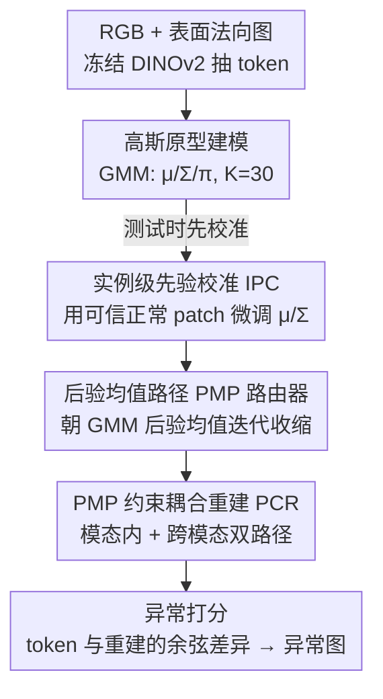

# GPFlow: Gaussian Prototype Probability Flow for Unsupervised Multi-Modal Anomaly Detection

**会议**: CVPR 2026  
**论文**: [CVF Open Access](https://openaccess.thecvf.com/content/CVPR2026/html/Li_GPFlow_Gaussian_Prototype_Probability_Flow_for_Unsupervised_Multi-Modal_Anomaly_Detection_CVPR_2026_paper.html)  
**代码**: 待确认  
**领域**: 多模态异常检测（工业质检）  
**关键词**: 多模态异常检测, 高斯原型, 后验均值流, 各向异性收缩, 少样本  

## 一句话总结
GPFlow 用一组可学习的高斯原型（均值+对角协方差+混合权重）建模"正常"的连续分布，再用一个有解析解的"后验均值路径（PMP）路由器"把输入特征朝高斯混合的后验均值迭代收缩——天然实现"协方差感知的信息瓶颈"，在仅 5/10/50 张正常样本的少样本工业多模态（RGB+3D）异常检测上显著超过 FIND 等 SOTA。

## 研究背景与动机
**领域现状**：多模态异常检测（MAD）联合 RGB 图像与 3D 点云/表面法向图来发现工业缺陷，主流是"重建式"——用正常样本训练一个重建网络，测试时把输入重建一遍，重建误差大的区域就是异常。3D-ADNAS、FIND 等都属此类。

**现有痛点**：重建式方法的老大难是 **identity shortcut（恒等捷径）**——网络能力太强时会把输入（包括异常模式）几乎原样复制出来，重建误差趋零，异常反而检不出来。为了堵住这个捷径，近期工作（HVQ-Trans、INP-Former、PIRN）引入**离散原型**（codebook/向量量化）做信息瓶颈：把每个特征量化到最近的离散码字，强行限制能表达的内容。

**核心矛盾**：离散原型用的是**硬量化 + 各向同性（Euclidean）距离**做分配，无法刻画正常分布**连续且各向异性**的形态。后果是两头都错：正常特征若沿"高方差方向"变化，会因为离码字远而被判大重建误差（误报）；异常特征若只在"低方差方向"偏一点，因为 Euclidean 位移小反而惩罚不够（漏报）。论文用一个 2D 三高斯的 toy 例子（Fig. 2）直观展示了这点。

**本文目标**：怎样既**紧凑地建模正常外观/几何的连续分布**，又施加一个**协方差感知的信息瓶颈**来稳健抑制异常？

**切入角度**：把"正常"建成一个高斯混合（GMM），每个高斯原型有可学的均值 $\mu_k$、对角协方差 $\Sigma_k$、混合权重 $\pi_k$；再借**概率流 / score matching** 的视角，把"重建"看成把含噪观测朝 GMM 的**后验均值**移动——这一步因为 GMM 先验恰好有闭式解，不用解 ODE。

**核心 idea**：用"GMM 后验均值的各向异性收缩"代替"离散原型的硬量化"，让信息瓶颈沿协方差结构自动调强弱——保留对齐协方差的正常变化、压制不一致的偏离。

## 方法详解

### 整体框架
GPFlow 接收 RGB（外观模态 $I_{rgb}$）和表面法向图（形状模态 $I_{shape}$）两路输入。因为正常样本极少，先用**冻结的 DINOv2 ViT-B/14** 抽多尺度特征，聚合成 patch token $T_{rgb}, T_{shape} \in \mathbb{R}^{B\times N\times D}$。每个模态的特征分布被建成一个 $K=30$ 个高斯原型的 GMM，先验 $p(x)=\sum_{k=1}^K \pi_k \mathcal{N}(x;\mu_k,\Sigma_k)$。

整条流水线分三段：(1) 特征提取；(2) **PMP 约束的耦合重建（PCR）**——核心，用 PMP 路由器把 token 朝高斯原型流形迭代收缩，同时走 intra-modal（模态内）和 cross-modal（跨模态）两条路径；测试时还会先做一次 **实例级先验校准（IPC）** 微调原型；(3) 异常打分——算原始 token 与原型约束重建之间的余弦差异，得到异常图。PMP 路由器在这里扮演"协方差感知信息瓶颈"，让异常无法被轻易重建。

### 关键设计

**1. 后验均值路径（PMP）路由器：用 GMM 后验均值实现各向异性的信息瓶颈**

这是 GPFlow 的心脏，专治"恒等捷径"。把一个特征看成含噪观测 $y=x+\epsilon$，其中 $x$ 来自正常分布 $p(x)$、$\epsilon\sim\mathcal{N}(0,\tau^2 I)$。最优 MMSE 估计就是后验均值 $E[x|y]$。由 Tweedie 公式，后验均值和 score 有精确联系：

$$E[x|y] = y + \tau^2 \nabla_y \log p_\tau(y)$$

而 score $\nabla_y\log p_\tau(y)$ 指向概率密度更高的方向，所以"把 $y$ 朝后验均值移动"等价于在平滑对数密度上做一步 **score ascent**——把异常特征沿概率梯度推回正常流形。关键在于选 GMM 先验后这一步有**闭式解**：平滑后密度仍是 GMM，$p_\tau(y)=\sum_k\pi_k\mathcal{N}(y;\mu_k,\Sigma_k+\tau^2 I)$，后验均值写成各分量后验均值的加权平均：

$$D_\tau(y)=E[x|y]=\sum_{k=1}^K \gamma_k(y)\,m_k(y)$$

它含两件事：**跨原型的软分配**（responsibility $\gamma_k(y)=\frac{\pi_k\mathcal{N}(y;\mu_k,\Sigma_k+\tau^2I)}{\sum_j\pi_j\mathcal{N}(y;\mu_j,\Sigma_j+\tau^2I)}$），以及**原型内的收缩**。后者是这套方法"各向异性"的来源：分量后验均值 $m_k(y)=A_k y+(I-A_k)\mu_k$，其中增益矩阵 $A_k=\Sigma_k(\Sigma_k+\tau^2 I)^{-1}$。因为协方差是对角的，$A_k$ 每一维的增益 $a_{k,c}=\frac{\sigma_{k,c}^2}{\sigma_{k,c}^2+\tau^2}\in(0,1)$：**高方差维 $a\to1$（保留正常变化），低方差维 $a\to0$（强压可疑偏离）**。把位移写成 $y-m_k(y)=(I-A_k)(y-\mu_k)$ 更直观——收缩量正比于偏离原型均值的程度，但被协方差逐维调制。这就是"协方差感知的信息瓶颈"：沿协方差结构对齐的变化几乎不动，不对齐的方向被软投影压掉。

路由是迭代的：$x^{(t+1)}=(1-\beta_t)x^{(t)}+\beta_t E[x|y=x^{(t)}]$，代入 Tweedie 后等价于固定噪声下的 score ascent 步 $x^{(t+1)}=x^{(t)}+\eta_t\nabla_x\log p_\tau(x^{(t)})$，$\eta_t=\beta_t\tau^2$。论文还从混合后验均值的雅可比 $J_{D_\tau}(y)=\tau^{-2}\mathrm{Cov}[x|y]$ 推出局部几何：单原型主导时是局部收缩，原型过渡区由 between-prototype ambiguity 项 $\sum_k\gamma_k\Delta_k\Delta_k^\top$（$\Delta_k=m_k-D_\tau$）共同决定路径。相比离散原型路由（按 Euclidean 距离换最近码字），PMP 让正常的高方差变化被保留、异常的低方差偏离被放大位移——toy 例子里把检测 AUC 从 0.835 抬到 0.996。

**2. PMP 约束的耦合重建（PCR）：模态内 + 跨模态共用同一个瓶颈，放大异常位移**

单靠一个模态自重建，无法利用 RGB 和 3D 形状的互补信息。PCR 把 PMP 路由记为 $R(T;P)$（输入 token $T$，用原型 $P$ 迭代路由），对每个模态同时走两条路径。以 RGB 分支为例：模态内重建 $\hat T_{rgb}^{intra}=R(T_{rgb};P_{rgb})$（用 RGB token 配 RGB 原型），跨模态重建 $\hat T_{shape\to rgb}^{cross}=R(T_{shape};P_{rgb})$（用 shape token 去对齐 RGB 原型），再经轻量 FFN 聚合 $T'_{rgb}=\mathrm{FFN}_{rgb}(\hat T^{intra}_{rgb})+\mathrm{FFN}_{rgb}(\hat T^{cross}_{shape\to rgb})$；shape 分支对称定义。

关键不同于 FIND 这类常规耦合重建：GPFlow 在**解码前**就用各向异性收缩**显式拉大正常/异常的位移差**。一个能被某高斯原型解释的正常 token，位移被 $(I-A_k)$ 控制得很小；而异常 token 在 intra 和 cross 两条路上都产生更大的路由位移，于是"异常更难被重建"是被结构性保证的，而不是寄希望于网络自己学会。

**3. 实例级先验校准（IPC）：测试时用可信正常 patch 临时把原型挪到当前样本上**

少样本训练数据覆盖不了测试样本的正常多样性，固定先验会把"没见过但正常"的模式误判成异常。IPC 在 PMP 路由前对**每个测试样本独立**做一次轻量校准（不跨样本累积，避免污染）。先用 Mutual Scoring Mechanism（MSM）挑出**置信正常的 patch**：取分数最低的 $\rho$ 比例（$\rho=0.6$）形成二值掩码 $M$，只让可靠的正常 token 参与，responsibility 被掩码成 $\gamma^M=\gamma\odot M$。每个原型算 responsibility 加权的证据 $U_k=\frac{\sum_n\gamma^M_{nk}t_n}{\sum_n\gamma^M_{nk}}$，再用 EMA 校准均值 $\mu'_k=(1-\eta_\mu)\mu_k+\eta_\mu U_k$，并在对数方差域更新协方差 $\log\Sigma'_k=(1-\eta_\Sigma)\log\Sigma_k+\eta_\Sigma\log(\hat v_k+\epsilon)$（$\hat v_k$ 是加权样本方差，保证正定与数值稳定）。校准后的 $(\mu'_k,\Sigma'_k)$ 只用于当前样本，用完即弃。这一步把先验"撑开"到未见的正常变化，同时实验证明对异常污染很稳健。

### 损失函数 / 训练策略
训练用编码器原始特征与耦合重建之间的**基于余弦相似度的 soft mining loss**（沿用 INP-Former）。推理时按余弦差异算每模态异常图，再融合 RGB+shape 得最终异常预测。实现细节：$K=30$ 原型/模态，$\mu$ 由 $\mathcal{N}(0,1)$ 初始化、$\log\Sigma$ 初始化为 $-2.0$；PMP 跑 8 步，固定噪声 $\tau^2=10^{-2}$，步长线性调度 $\beta\in[0.2,0.8]$；IPC 的 EMA 动量 0.1，保留最一致 60% patch；Adam，学习率 $1\times10^{-4}$，按类别训练；异常图融合后用 $5\times5$ 高斯核平滑，图像级分数取异常图最大值。

## 实验关键数据

### 主实验
在 MVTec-3D-AD 和 Eyecandies 上，每类随机采 5/10/50 张正常图（每设置重复 10 次取平均）。下表为图像级 AUROC（I-AUROC）。

| 数据集 | shot | M3DM | CFM | FIND | GPFlow |
|--------|------|------|------|------|--------|
| MVTec-3D-AD | 5 | 0.822 | 0.811 | 0.899 | **0.912** |
| MVTec-3D-AD | 10 | 0.845 | 0.845 | 0.921 | **0.935** |
| MVTec-3D-AD | 50 | 0.907 | 0.906 | 0.952 | **0.955** |
| MVTec-3D-AD | All | 0.945 | 0.954 | **0.978** | 0.970 |
| Eyecandies | 5 | 0.764 | 0.795 | 0.840 | **0.913** |
| Eyecandies | 10 | 0.824 | 0.838 | 0.868 | **0.923** |
| Eyecandies | 50 | 0.836 | 0.852 | 0.897 | **0.925** |

少样本越极端优势越大：Eyecandies 5-shot 上 GPFlow 0.913，比 FIND 0.840 高出一大截。唯一落后是 MVTec-3D-AD 全量（All）设置——FIND 0.978 略胜 GPFlow 0.970，作者坦言这是 trade-off：GPFlow 的强归纳偏置（高斯原型 + PMP 瓶颈）保证了少样本鲁棒，但数据充足时 FIND 的多阶段架构能捕捉更细粒度的变化。

### 消融实验
10-shot MVTec-3D-AD，I-AUROC 为主指标。

| 配置 | AUROC_I | 说明 |
|------|---------|------|
| GPFlow（Full） | **0.935** | 完整模型 |
| w/o PMP | 0.883 | 换成注意力原型路由（无协方差），掉 5.2 个点 |
| w/o PCR（仅 intra） | 0.915 | 去掉跨模态重建，掉 2.0 个点 |
| w/o IPC | 0.925 | 测试时冻结原型，掉 1.0 个点 |

原型与路由机制的对比（Tab. 3）：

| 方法 | AUROC_I | 说明 |
|------|---------|------|
| VQ-Codebook + OT | 0.751 | 离散码本 + 最优传输 |
| VQ-Codebook + SA | 0.885 | 离散码本 + 软分配 |
| DPDL: Gaussian + SB | 0.908 | 高斯原型 + Schrödinger Bridge 扩散 |
| **Ours: Gaussian + PMP** | **0.935** | 高斯原型 + 解析后验均值路由 |

### 关键发现
- **PMP 贡献最大**：去掉它（换成无协方差的注意力路由）从 0.935 暴跌到 0.883，证明"协方差感知"才是抑制异常重建的关键，而非单纯有原型。
- **高斯 > 离散**：连续高斯原型（0.885 软分配 VQ → 0.935 PMP）一路压过离散码本，验证了"建模连续正常变化"的必要性；且解析 PMP（0.935）优于 Schrödinger Bridge 扩散（0.908）。
- **跨模态必须配模态内**：Tab. 4 里只用跨模态重建只有 0.775 I-AUROC，远低于只用模态内的 0.915——没有模态内正常模式打底，单靠跨模态一致性不够；耦合两者才到 0.935。
- **IPC 对污染稳健**：$\rho=0.6$ 最优；oracle 压力测试里即便注入 50% 异常 patch，IPC 仍稳过无 IPC 基线，只有 100% 污染（完全没有正常 patch）才严重退化。

## 亮点与洞察
- **把"重建"重新解释成"score ascent / 概率流"**：用 Tweedie 公式把后验均值和 score 挂钩，再借 GMM 先验拿到闭式后验均值，省掉解 ODE/扩散采样——既有 Bayesian MMSE 的理论解释，又计算高效。这是把生成模型里的概率流思想干净地搬到判别式异常检测的一个范例。
- **信息瓶颈的强弱"长在协方差里"**：增益 $a_{k,c}=\sigma^2/(\sigma^2+\tau^2)$ 让瓶颈逐维自适应——高方差维放行、低方差维收紧，天然解决离散原型"各向同性距离"的两头错问题。这个"用协方差当 retention coefficient"的视角很可迁移。
- **测试时校准用完即弃**：IPC 每样本独立、不跨样本累积，既扩了正常覆盖又防异常污染累积，是少样本场景里一个低成本好用的 trick。

## 局限与展望
- 作者承认的局限：全量数据下不及 FIND（0.978 vs 0.970），强归纳偏置在数据充足时反而限制了细粒度建模能力。
- ⚠️（自己观察）协方差被限制为**对角**以求闭式解和效率，无法刻画特征维度间的相关性——真实正常分布若有强相关结构，对角假设可能损失表达力。
- ⚠️ PMP 步数、$\tau$、$\beta$ 调度都是固定超参（8 步、$\tau^2=10^{-2}$、$\beta\in[0.2,0.8]$），论文把其对瓶颈强度的影响放在附录，正文未给敏感性曲线；不同数据集是否需要重调尚不清楚。
- IPC 依赖 MSM 挑选正常 patch，若某类异常本身分布广（占比远超 $1-\rho$），可能在校准阶段被误纳入。
- 改进思路：把对角协方差放宽为低秩 + 对角，或让 PMP 步数/噪声随样本自适应。

## 相关工作与启发
- **vs 离散原型（HVQ-Trans / INP-Former / PIRN）**：它们用向量量化码本 + 硬量化 + Euclidean 分配做瓶颈；GPFlow 用连续高斯原型 + 协方差感知的软收缩，避免"高方差正常被误罚、低方差异常被漏罚"，且有 MMSE 解释。消融里离散软分配 0.885 vs GPFlow 0.935。
- **vs DPDL（监督开集，高斯原型 + Schrödinger Bridge）**：DPDL 也用可学高斯原型，但要训练扩散桥且**需要少量真实异常样本**；GPFlow 只需正常样本、且用解析后验均值代替学到的扩散过程，0.935 vs 0.908。
- **vs FIND（重建式 SOTA）**：FIND 用反向蒸馏 + 跨模态特征变换的多阶段架构，全量数据更强；GPFlow 靠显式信息瓶颈在少样本上更鲁棒，二者是"强归纳偏置 vs 大容量拟合"的取舍。

## 评分
- 新颖性: ⭐⭐⭐⭐⭐ 把 Tweedie/概率流的 MMSE 后验均值落成异常检测的解析信息瓶颈，理论与机制都很扎实
- 实验充分度: ⭐⭐⭐⭐ 两数据集多 shot + 多角度消融（原型类型/路由机制/耦合路径/IPC 污染），仅缺超参敏感性正文展示
- 写作质量: ⭐⭐⭐⭐⭐ 公式推导清晰、toy 例子直观、动机到机制一气呵成
- 价值: ⭐⭐⭐⭐ 少样本工业多模态质检的实用 SOTA，协方差感知瓶颈的思路可迁移

<!-- RELATED:START -->

## 相关论文

- [\[CVPR 2026\] Multi-Prototype Compactness and Boundary-Aware Synthesis for Unsupervised Anomaly Detection](multi-prototype_compactness_and_boundary-aware_synthesis_for_unsupervised_anomal.md)
- [\[CVPR 2026\] Dual-Prototype-Guided Multi-task Learning for Unsupervised Anomaly Detection and Classification](dual-prototype-guided_multi-task_learning_for_unsupervised_anomaly_detection_and.md)
- [\[CVPR 2026\] Complementary Prototype Mapping for Efficient Multimodal Anomaly Detection](complementary_prototype_mapping_for_efficient_multimodal_anomaly_detection.md)
- [\[CVPR 2026\] FastRef: Fast Prototype Refinement for Few-shot Industrial Anomaly Detection](fastref_fast_prototype_refinement_for_few-shot_industrial_anomaly_detection.md)
- [\[ICML 2026\] Mixture Prototype Flow Matching for Open-Set Supervised Anomaly Detection](../../ICML2026/object_detection/mixture_prototype_flow_matching_for_open-set_supervised_anomaly_detection.md)

<!-- RELATED:END -->
