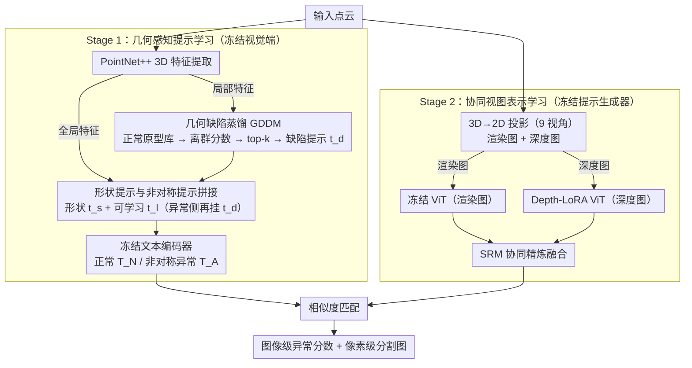

# GS-CLIP: Zero-shot 3D Anomaly Detection by Geometry-Aware Prompt and Synergistic View Representation Learning

**会议**: CVPR 2026  
**arXiv**: [2602.19206](https://arxiv.org/abs/2602.19206)  
**代码**: [GitHub](https://github.com/zhushengxinyue/GS-CLIP)  
**领域**:目标检测
**关键词**: 零样本3D异常检测, CLIP, 几何感知提示, 多视图融合, 点云

## 一句话总结

提出GS-CLIP两阶段框架，通过几何缺陷蒸馏模块将3D点云的全局形状和局部缺陷信息注入文本提示，并用LoRA双流架构协同融合渲染图和深度图，在四个大规模数据集上实现零样本3D异常检测SOTA。

## 研究背景与动机

**领域现状**：3D异常检测在工业制造中至关重要。传统无监督方法（3D-ST、Reg3D-AD）需要大量目标类别正常样本训练，而零样本3D异常检测（ZS3DAD）旨在用辅助数据训练通用模型，直接泛化到未见类别——解决数据隐私和样本稀缺问题。

**现有痛点**：
   - **3D几何信息丢失**：当前方法（PointAD、MVP-PCLIP）将3D点云投影为2D图像后用CLIP处理，投影过程压缩了立体结构为平面像素，模型学到的是几何异常的"2D视觉代理"而非真实物理形态。当几何异常在特定视角下视觉特征不明显时，检测会失效。
   - **视觉信息利用不充分**：现有方法仅依赖单一2D表示。渲染图富含纹理但受光照/渲染伪影干扰；深度图反映整体几何结构但无法捕捉深度变化微小的细节（如轻微凸起）。单一模态限制了检测的全面性和泛化能力。

**核心矛盾**：CLIP强大的零样本泛化能力在2D异常检测中已被验证，但将其扩展到3D域面临"投影信息损失"和"单模态视觉不足"两大鸿沟。

**本文切入点**：不只做2D端的适配，而是从文本端和视觉端双管齐下——文本端注入3D几何先验作为异常线索，视觉端融合渲染图和深度图的互补信息。

## 方法详解

### 整体框架

GS-CLIP 想解决的核心问题是：怎样在不见过目标类别的前提下，让 CLIP 真正"懂"3D 几何异常。它的做法是把工作拆成解耦的两阶段，避免文本端和视觉端联合训练时互相干扰。Stage 1 只动文本端：冻住所有视觉组件，专门训练一个几何感知的提示生成器，从输入点云里抽出全局形状上下文和局部缺陷信息，动态生成嵌入几何先验的文本提示。Stage 2 反过来冻住已经练好的提示生成器，转去训练视觉端的双流结构——渲染图走完全冻结的 ViT，深度图走 LoRA 微调的 ViT，两路特征再经协同精炼模块深度融合，最后和文本提示算相似度，输出图像级异常分数和像素级分割图。

### 关键设计

**1. 几何缺陷蒸馏模块 GDDM：让文本提示从 3D 几何里直接学会"该找什么异常"**

前面的痛点是：现有方法把点云拍成 2D 再交给 CLIP，文本提示只能描述"2D 视觉代理"，根本不知道真实的几何缺陷长什么样。GDDM 的破题点是抓住异常的本质——偏离正常模式。它维护一个可学习的正常原型记忆库 $\mathcal{P} = \{p_1, ..., p_l\} \in \mathbb{R}^{l \times d_{pn}}$，训练中隐式拟合正常局部几何特征的分布。对每个点的局部特征 $f_i$，用它和记忆库里最相似原型的余弦相似度来反算一个几何离群分数：

$$s_i = 1 - \max_{p_j \in \mathcal{P}} \frac{f_i \cdot p_j}{\|f_i\| \|p_j\|}$$

分数越高说明这个局部结构离"正常"越远、越像缺陷。挑出分数最高的 top-$k$ 个点特征，经自注意力聚合后投影成缺陷提示 $t_d \in \mathbb{R}^{k \times d}$。这样文本端拿到的不再是泛泛的"异常"二字，而是从 3D 几何里蒸出来的、带具体偏离信息的缺陷描述，让提示"知道该找什么样的异常"。

**2. 形状提示与非对称提示拼接：用提示结构本身制造正常/异常的语义鸿沟**

光有缺陷提示还不够，模型还需要知道这个物体整体长什么样才能判断什么算"正常"。这里用预训练 PointNet++ 抽点云全局特征 $F_e$，投影成形状提示 $t_s = \text{Proj}(F_e)$ 提供宏观几何上下文。关键的巧思在于正常提示和异常提示采用**非对称拼接**：

$$t_N = \text{Concat}(t_s, t_l), \quad t_A = \text{Concat}(t_s, t_l, t_d)$$

两者共享形状提示 $t_s$ 和可学习提示 $t_l$，但异常提示额外多挂一段缺陷描述 $t_d$。这种结构上的不对称让正常和异常提示天然拉开语义距离——异常提示比正常提示多一份"哪里坏了"的信息。两套提示过冻结文本编码器得到 $T_N, T_A$，再与视觉特征算相似度，就能同时完成图像级分类和像素级分割。

**3. 协同视图表示学习（Depth-LoRA + SRM）：让渲染图和深度图互补，而不是二选一**

针对"单一视觉模态不够用"的痛点——渲染图富纹理但易受光照/伪影干扰，深度图反映整体几何却抓不住微小起伏——这里走双流融合。两路视图的域属性不同，处理也不同：CLIP 本就适配真实图像，渲染图直接走完全冻结的 ViT；深度图和自然图像存在域差距，因此只对 ViT 的 MLP 层施加 LoRA 微调，既补上域差又保留预训练学到的空间关系建模能力：

$$x' = \text{GELU}(W_1 x + \gamma B_1 A_1 x)$$

两路特征的融合交给协同精炼模块 SRM。它接收两路的全局/局部特征，先用双向乘性注意力算出一个共享矩阵 $S = f_1(K_i^R) \times f_2(K_i^D)^T$ 来建立两个模态间的对应关系，再分别加权聚合两路的值向量后拼接融合：

$$G_i = \text{MLP}(\text{Concat}(E_i^R, E_i^D))$$

这样渲染图擅长的外观异常（纹理、划痕）和深度图擅长的几何异常（凹坑、凸起）被显式互补起来，检测覆盖面比任何单流方案都更全。

### 损失函数 / 训练策略

- **Stage 1**: $L_{stage1} = L_{cla} + L_{seg}$（二元交叉熵 + Dice/Focal分割损失）
- **Stage 2**: $L_{stage2} = L_{cla} + L_{seg} + \alpha L_{con}$，新增**跨视图一致性损失**：
  $$L_{con} = 1 - \frac{1}{v}\sum_{i=1}^v \langle G_i, \bar{G} \rangle$$
  鼓励模型学习视角无关的全局表示，增强泛化性
- Stage 1: 15 epochs, lr=0.002; Stage 2: 10 epochs, lr=0.0005
- 3D→2D投影取9个视角，CLIP用ViT-L/14@336px

## 实验关键数据

### 主实验

| 数据集 | 指标 | GS-CLIP | PointAD (前SOTA) | 提升 |
|--------|------|------|----------|------|
| MVTec3D-AD | O-AUROC / P-PRO | 83.6 / 86.4 | 82.0 / 84.4 | +1.6 / +2.0 |
| Eyecandies | O-AUROC / P-PRO | 71.5 / 73.8 | 69.1 / 71.3 | +2.4 / +2.5 |
| Real3D-AD | O-AUROC | 76.4 | 74.8 | +1.6 |
| Anomaly-ShapeNet | O-AUROC / P-AUROC | 84.1 / 75.2 | 82.6 / 74.1 | +1.5 / +1.1 |
| 跨数据集 (Eyecandies) | O-AUROC / P-AUROC | 70.3 / 92.9 | 69.5 / 91.8 | +0.8 / +1.1 |

### 消融实验

| 配置 | O-AUROC, O-AP | P-AUROC, P-PRO | 说明 |
|------|---------|------|------|
| 仅渲染图 + 可学习提示 | 80.9, 91.7 | 93.5, 83.1 | 基线 |
| + SRM融合双流 | 82.3, 93.9 | 94.6, 84.8 | 双流融合大幅提升 |
| + Shape Prompt | 82.5, 94.8 | 95.2, 85.1 | 宏观几何上下文助力分类 |
| + Defect Prompt | 82.9, 94.4 | 95.6, 85.6 | 缺陷提示显著提升定位精度 |
| + 两者结合 | 83.1, 96.2 | 96.0, 86.2 | 互补效果明显 |
| + $L_{con}$ | **83.6, 96.5** | **96.3, 86.4** | 跨视图一致性进一步提升 |

### 关键发现

- GDDM中离群点数 $k=12$ 最优，过大引入正常点噪声；原型数 $l=32$ 达到饱和
- 9个视角时性能趋于饱和，更多视角收益递减
- 多模态融合（加入RGB图像）后MVTec3D-AD上O-AUROC达88.2%，进一步验证框架扩展性
- 推理开销：0.51s/图，1.96 FPS，内存5872MB——略高于基线但精度显著领先
- 跨数据集设置下性能下降极小，证明强泛化能力

## 亮点与洞察

- **从3D到文本的信息桥梁**：不是简单把3D投影为2D让CLIP看，而是把3D几何信息注入文本端作为先验，让文本提示"知道该找什么样的异常"
- **非对称提示设计**：正常和异常提示共享形状上下文但异常提示额外携带缺陷描述，语义区分清晰
- **两阶段解耦**：先优化文本端让提示学会描述几何异常，再优化视觉端对齐，避免联合训练的不稳定性
- **即插即用的多模态扩展**：框架天然支持加入RGB等额外模态

## 局限与展望

- PointNet++作为3D特征提取器可能限制对复杂几何的表达能力，可探索更强的3D backbone（如Point Transformer v3）
- 当前9视角的多视图投影策略较为固定，可探索自适应视角选择
- 推理速度约2 FPS，对实时工业检测可能不够，可探索特征缓存或模型压缩
- 未探索更直接的3D原生表示（如直接在点云上做异常检测而非投影到2D）

## 相关工作与启发

- **PointAD (NeurIPS'24)**：用渲染图构建3D表示，从点和像素两个角度理解异常，是最直接的前序工作
- **MVP-PCLIP**：用深度图+视觉/文本提示微调CLIP，但仅用单一视觉模态
- **AnomalyCLIP / AA-CLIP**：2D零样本异常检测中的提示学习方法，本文将其思路扩展到3D域并注入几何先验
- **启发**：将领域先验知识注入基础模型的文本端（而非仅适配视觉端）是一个有效的范式

## 评分

- 新颖性: ⭐⭐⭐⭐ 几何缺陷蒸馏+非对称提示+双流融合的组合设计新颖，从文本端注入3D先验是独特视角
- 实验充分度: ⭐⭐⭐⭐ 四个数据集、两种设置、详细消融、多模态扩展、参数敏感性分析
- 写作质量: ⭐⭐⭐⭐ 动机阐述清晰，渲染图vs深度图的互补性用直观图例说明
- 价值: ⭐⭐⭐⭐ ZS3DAD是新兴且实用的方向，提升显著且跨数据集泛化性好

<!-- RELATED:START -->

## 相关论文

- [\[CVPR 2026\] Geometry-Aligned and Anomaly-Aware Reconstruction for 3D Anomaly Detection](geometry-aligned_and_anomaly-aware_reconstruction_for_3d_anomaly_detection.md)
- [\[CVPR 2026\] Bidirectional Multimodal Prompt Learning with Scale-Aware Training for Few-Shot Multi-Class Anomaly Detection](bidirectional_multimodal_prompt_learning_with_scale-aware_training_for_few-shot_.md)
- [\[CVPR 2026\] FB-CLIP: Fine-Grained Zero-Shot Anomaly Detection with Foreground-Background Disentanglement](fb-clip_fine-grained_zero-shot_anomaly_detection_with_foreground-background_dise.md)
- [\[CVPR 2026\] CoPS: Conditional Prompt Synthesis for Zero-Shot Anomaly Detection](cops_conditional_prompt_synthesis_for_zero-shot_anomaly_detection.md)
- [\[CVPR 2026\] MoECLIP: Patch-Specialized Experts for Zero-shot Anomaly Detection](moeclip_patch-specialized_experts_for_zero-shot_anomaly_detection.md)

<!-- RELATED:END -->
