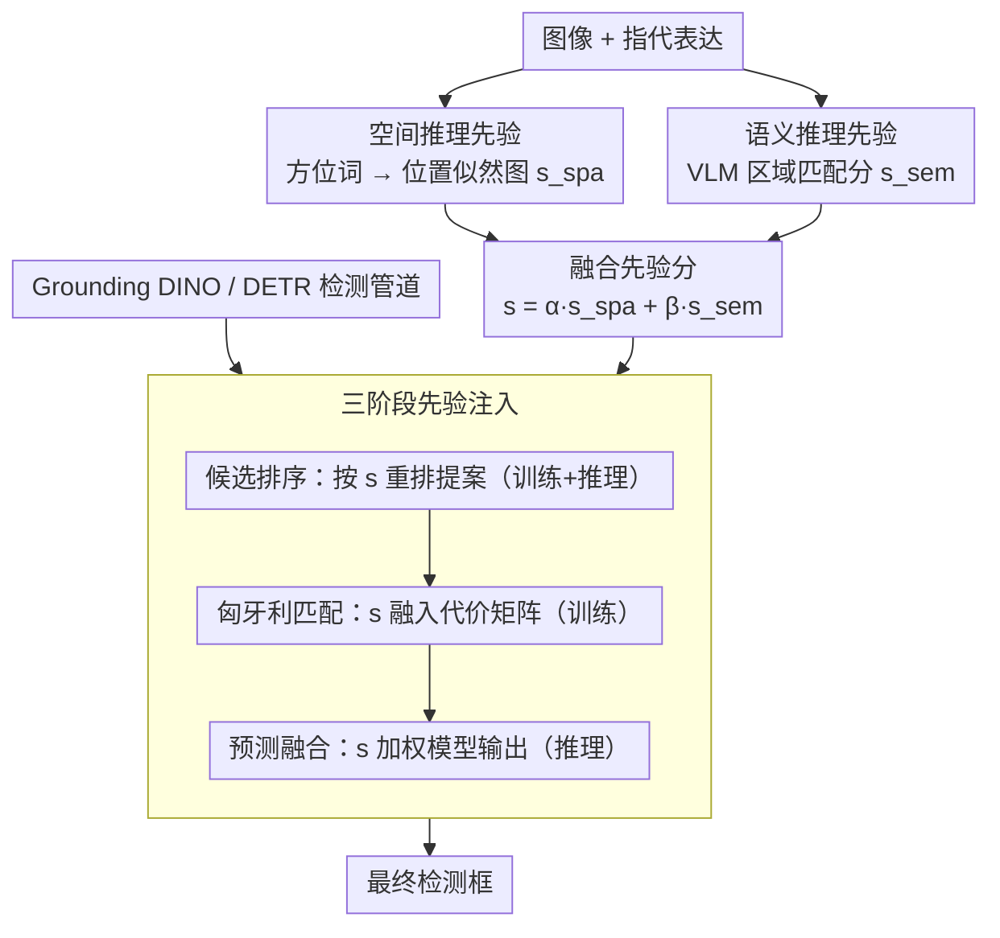

# HeROD: Heuristic-inspired Reasoning Priors Facilitate Data-Efficient Referring Object Detection

**会议**: CVPR 2026  
**arXiv**: [2603.24166](https://arxiv.org/abs/2603.24166)  
**代码**: [https://github.com/xuzhang1199/HeROD](https://github.com/xuzhang1199/HeROD)  
**领域**: 目标检测  
**关键词**: 指代目标检测, 数据高效学习, 推理先验, DETR, 少样本检测

## 一句话总结

HeROD 提出了一种轻量级、模型无关的框架，通过将启发式空间和语义推理先验注入 DETR 风格检测管道的三个阶段（候选排序、预测融合、匈牙利匹配），在标注稀缺条件下显著提升指代目标检测(ROD)的数据效率和收敛性能。

## 研究背景与动机

1. **领域现状**：指代目标检测(ROD)通过自然语言描述定位特定对象。现代基础检测器（如GLIP、Grounding DINO）在数据丰富场景下表现优异，但严重依赖大规模标注。
2. **现有痛点**：许多实际部署场景（机器人、AR、医疗影像）面临严重的标注稀缺。端到端基础检测器需要从零学习空间关系和视觉-语义关联，在数据稀缺时样本效率低、易过拟合。
3. **核心矛盾**：大规模预训练提供了广泛的视觉-语言对齐，但细粒度空间线索和复杂属性组合在预训练中代表不足——有限标注下模型需要"重新发现"这些基本概念。
4. **本文目标**：让模型在数据稀缺时聚焦于"精化"而非"重新发现"基本的空间和语义关系。
5. **切入角度**：类比 A* 启发式搜索——用启发式代价引导搜索向有希望的候选集中，避免盲目探索。
6. **核心 idea**：将显式的、可解释的空间和语义推理先验注入检测管道的候选排序、匹配和预测阶段，偏置训练和推理向合理候选倾斜。

## 方法详解

### 整体框架

HeROD 要解决的问题是：DETR 风格的指代检测器（如 Grounding DINO）在标注稀缺时，必须从零"重新发现"空间关系和视觉-语义关联，导致收敛慢、易过拟合。HeROD 的做法是把人能一眼看出的常识——"左边"该往左找、"红帽子"该匹配红色区域——做成显式、可解释、零学习的先验分数，再把这些分数注入检测管道的几个决策点，让模型从"重新发现"退化成"精化"。

整条管道这样转：给定一张图和一句指代表达（如"左边穿红帽子的人"），空间推理先验从表达里抽出方位词、在图像平面上画出一张位置似然图 $s_{\text{spa}}$（左侧像素分高、右侧分低）；语义推理先验把整句话喂给预训练 VLM，对图像各区域算出文本-视觉匹配分 $s_{\text{sem}}$（红帽子区域分高）。两张先验图融合成统一分 $s=\alpha\,s_{\text{spa}}+\beta\,s_{\text{sem}}$ 后，在 DETR 风格检测管道的三个决策点介入——候选排序、匈牙利匹配、预测融合——把骨干网络原本均匀的注意力偏向"既在左边又像红帽子"的候选。先验本身不带任何可训练参数，是叠加在现有检测器之上的轻量附加模块，可即插即用接到 Grounding DINO 等基础检测器。

### 关键设计

**1. 空间推理先验：把方位词变成图像平面上的位置似然图**

指代表达里"左边/上方/中间"这类方位词，是消歧同类多目标的关键线索，但端到端检测器在数据稀缺时学不好这种朴素的空间常识。HeROD 不让模型学，而是用一套固定规则把方位关键词映射成基本方向（左/右/上/下）及其简单组合，对图像中每个空间位置 $p$ 直接赋一个先验似然分 $s_{\text{spa}}(p)$——比如"左边"就让图像左半部分得分高、右半部分得分低。整个过程零学习、完全可解释，相当于把"该往哪看"这一常识硬编码进来，省掉了模型用宝贵标注去重新拟合空间分布的开销。

**2. 语义推理先验：借 VLM 的零样本对齐给区域打语义分**

空间先验只管"在哪"，不管"是不是"；细粒度的属性组合（红帽子、穿西装）则交给语义先验。HeROD 直接调用预训练视觉-语言模型（如 CLIP），计算指代表达与图像各区域的匹配分 $s_{\text{sem}}(r)$，反映区域 $r$ 与描述在语义上有多契合。VLM 的大规模预训练本就覆盖了广泛的视觉-语言对齐，这部分知识在小标注集上几乎免费，用它做粗粒度语义指导能进一步压缩模型要从标注中"重新发现"的部分。

**3. 三阶段先验注入：在训练和推理的关键节点同时偏置**

有了 $s_{\text{spa}}$ 和 $s_{\text{sem}}$，关键在于注入到哪里才能既加速收敛又改善最终精度。HeROD 选了管道里三个决策点，融合分记为 $s = \alpha\, s_{\text{spa}} + \beta\, s_{\text{sem}}$：候选排序阶段用 $s$ 对检测提案重排序，让模型优先处理最可能的候选，缩小有效搜索空间；匈牙利匹配阶段把 $s$ 融进代价矩阵，使训练时 GT 与预测的二分匹配偏向"先验一致"的那一支，等于给监督信号加了一个合理性导向；预测融合阶段再把 $s$ 与模型输出加权合并成最终结果，让先验在推理时补一刀。前两点作用于训练（加速收敛、稳住梯度），第三点作用于推理（直接修正输出）——三点协同正是这套先验既能在 10% 数据下大幅提升、又在全数据下仍有互补增益的原因。

这套设计直接呼应了作者的 A* 类比：A* 用启发式代价把搜索从盲目探索导向有希望的方向，HeROD 用推理先验把学习从"重新发现基本概念"导向"在已知合理区域里精化"，两者都靠一个廉价、可解释的引导项换取效率。

### 损失函数 / 训练策略

训练沿用标准 DETR 损失（分类 + L1 + GIoU），唯一改动是匈牙利匹配代价里叠加了先验项 $s$，让 GT 分配偏向先验一致的预测。为系统评估数据效率，作者提出 De-ROD（Data-efficient ROD）基准协议，覆盖低数据与少样本设置，并保持整套先验模块对 Grounding DINO 等基础检测器即插即用。

## 实验关键数据

### 主实验

| 数据集 | 设置 | HeROD | 基线(Grounding DINO) | 提升 |
|--------|------|-------|---------------------|------|
| RefCOCO | 低数据(10%) | 显著提升 | 急剧下降 | 大幅改善 |
| RefCOCO+ | 低数据(10%) | 显著提升 | 急剧下降 | 大幅改善 |
| RefCOCOg | 低数据(10%) | 显著提升 | 急剧下降 | 大幅改善 |
| RefCOCO | 少样本(few-shot) | 持续提升 | 基线 | 一致改善 |
| RefCOCO | 全数据(100%) | 有竞争力 | 基线 | 仍有轻微提升 |

### 消融实验

| 配置 | 关键指标 | 说明 |
|------|---------|------|
| 无先验 | 基线 | 标准Grounding DINO |
| + 空间先验仅 | 提升 | 方位信息有效引导 |
| + 语义先验仅 | 提升 | 语义匹配减少搜索空间 |
| + 候选排序注入 | 改善 | 优先高质量候选 |
| + 匈牙利匹配注入 | 进一步改善 | 训练引导更有效 |
| + 预测融合注入 | 最优 | 推理时引导补充 |
| Full HeROD | 最佳 | 三阶段+双先验协同 |

### 关键发现

- 在10%训练数据下HeROD收敛速度和最终性能显著优于无先验基线
- 空间先验对包含方位描述的样本改善最大（如"左边的..."、"上面的..."）
- 在全数据设置下HeROD仍保持竞争力，说明先验有互补价值而非仅在数据不足时有用
- De-ROD 基准首次揭示了现有基础检测器在低数据场景下的脆弱性

## 亮点与洞察

- **De-ROD 任务定义**填补了ROD领域低数据评估的空白，许多实际部署确实面临标注稀缺
- **A*搜索类比**直观说明了推理先验的作用：启发式代价→搜索效率，推理先验→学习效率
- **模型无关+轻量级**设计使其可直接增强现有基础检测器，降低部署门槛
- 先验是可解释的（空间方位映射+VLM语义分数），而非黑盒

## 局限与展望

- 空间先验基于简单方位关键词映射，无法处理复杂关系描述（如"书架上第二层"）
- 语义先验依赖预训练VLM的质量，VLM本身的偏差可能传递
- 仅在RefCOCO系列数据集上验证
- 先验权重的平衡需要验证集调优

## 相关工作与启发

- **vs Grounding DINO**: 强大的基础检测器但低数据下性能急剧下降；HeROD通过先验注入显著改善数据效率
- **vs MDETR**: 端到端多模态检测需要大量微调数据；HeROD减少了数据需求
- **vs 少样本检测(FSCE等)**: 关注通用检测的类别迁移，HeROD关注ROD特有的视觉-语义对齐和空间推理

## 评分

- 新颖性: ⭐⭐⭐⭐ De-ROD任务定义+三阶段先验注入设计新颖
- 实验充分度: ⭐⭐⭐⭐ 多数据集+低数据/少样本/全数据多设置验证
- 写作质量: ⭐⭐⭐⭐ A*类比生动，动机推导清晰
- 价值: ⭐⭐⭐⭐ 填补了数据高效ROD的研究空白，有实际意义

<!-- RELATED:START -->

## 相关论文

- [\[CVPR 2026\] Parameter-Efficient Semantic Augmentation for Enhancing Open-Vocabulary Object Detection](parameter-efficient_semantic_augmentation_for_enhancing_open-vocabulary_object_d.md)
- [\[CVPR 2026\] Foundation Model Priors Enhance Object Focus in Feature Space for Source-Free Object Detection](foundation_model_priors_enhance_object_focus_in_feature_space_for_source-free_ob.md)
- [\[AAAI 2026\] AerialMind: Towards Referring Multi-Object Tracking in UAV Scenarios](../../AAAI2026/object_detection/aerialmind_towards_referring_multi-object_tracking_in_uav_sc.md)
- [\[CVPR 2026\] Reasoning-Driven Anomaly Detection and Localization with Image-Level Supervision](reasoning-driven_anomaly_detection_and_localization_with_image-level_supervision.md)
- [\[CVPR 2026\] AR²-4FV: Anchored Referring and Re-identification for Long-Term Grounding in Fixed-View Videos](ar2-4fv_anchored_referring_and_re-identification_for_long-term_grounding_in_fixe.md)

<!-- RELATED:END -->
