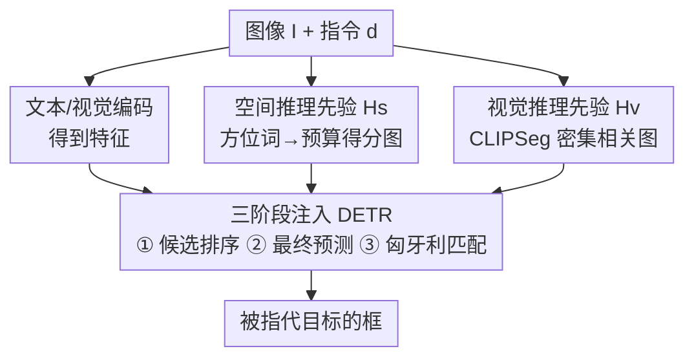

# Heuristic-inspired Reasoning Priors Facilitate Data-Efficient Referring Object Detection

**会议**: CVPR 2026  
**论文**: [CVF Open Access](https://openaccess.thecvf.com/content/CVPR2026/html/Zhang_Heuristic-inspired_Reasoning_Priors_Facilitate_Data-Efficient_Referring_Object_Detection_CVPR_2026_paper.html)  
**代码**: https://github.com/xuzhang1199/HeROD  
**领域**: 目标检测 / 多模态VLM  
**关键词**: 指代目标检测, 数据高效, 推理先验, Grounding 检测, DETR  

## 一句话总结
针对"标注稀缺时指代目标检测（ROD）模型性能骤降"的问题，本文先定义了低数据/少样本的 De-ROD 评测协议，再提出 HeROD：把从指代短语直接派生出的、可解释的**空间方位先验**和**视觉语义先验**像 A\* 的启发式代价一样，注入到 DETR 检测流水线的三个阶段（候选排序、最终预测、匈牙利匹配），在 RefCOCO/+/g 的极低数据（0.1%~5%）和少样本设置下相比 Grounding DINO / UNINEXT 普遍涨 3~16 个点。

## 研究背景与动机

**领域现状**：指代目标检测（Referring Object Detection, ROD）要在图像里定位一句自然语言描述所指的那个目标（如"左边那只鸟"）。现代主流做法是端到端的 grounding 检测器——GLIP、Grounding DINO、UNINEXT 等，靠海量图文对预训练把短语接地（grounding）和目标检测统一起来，在数据充足时是 SOTA。

**现有痛点**：这些模型是为"数据富足"设计的。但机器人、AR、医学等真实部署场景往往**严重缺标注**。在标注稀缺时，端到端检测器只能从极少样本里**从零重新发现**那些本该是常识的基础概念——相对方位（"在左边"）、物体属性（"蓝衬衫的人"）、物体间关系。原文指出，即便是 Grounding DINO 这样强的基础检测器，没有大规模任务内微调时在 ROD 上也会**急剧退化**。

**核心矛盾**：现有方法把"空间/语义推理能力"完全交给隐式的端到端学习去习得，而大规模预训练对细粒度空间线索和复杂属性组合的覆盖本就不足。于是在低数据下，模型既收敛慢、又容易过拟合——本该靠先验"一眼看出"的事，它非要拿宝贵的样本去"重新学一遍"。

**本文目标**：(1) 给"数据高效 ROD"这件事建一个标准评测协议；(2) 设计一个轻量、模型无关的框架，让检测器在稀缺监督下专注于**精修**这些基础关系，而不是从头重新发现它们。

**切入角度**：类比 A\* 等启发式搜索——靠一个启发式代价函数把探索引向有希望的候选，就能大幅提升搜索效率。作者把这个思路搬到检测：从指代短语和图像里直接抽出**可解释的空间/语义线索**作为"推理先验"，在训练和推理时都把候选偏置（bias）向那些"看起来合理"的区域。

**核心 idea**："reasoning before learning"——用显式、可解释的启发式先验给检测器提供归纳偏置，注入 DETR 流水线的多个阶段，替代纯隐式学习去重新发现空间/语义关系。

## 方法详解

### 整体框架

HeROD 是一个**模型无关的插件式框架**，套在现成的 DETR 式 grounding 检测器（Grounding DINO 或 UNINEXT）外面。输入是一对 $(I_i, d_i)$——图像和自然语言描述，输出是被指代目标的框。

核心机制：现代检测器给每个候选 $o_j$ 算一个学到的匹配概率 $P(o_j|I_i, d_i)$，这个分数完全来自网络参数、不带任何空间/语义的显式归纳偏置。HeROD 额外引入一个启发式信号 $H(o_j, I_i, d_i)$ 去引导候选选择，把选择过程改写成类似 A\* 的形式：

$$\overline{o}_i = \arg\max_{o_j \in O_i} \; H(o_j, I_i, d_i) \oplus P(o_j|I_i, d_i)$$

其中 $H$ 由两个互补分量聚合而成：空间启发式 $H_s$ 和视觉启发式 $H_v$，即 $H(o_j, I_i, d_i) = H_s(o_j, d_i) \oplus H_v(o_j, d_i, I_i)$。关键的算子 $\oplus$ **在不同流水线阶段取不同形式**：候选生成阶段是简单相加（图效率），最终预测阶段是一个可学习加权模块，匹配损失阶段则改写匈牙利匹配代价。整条流水线如下图：

注意：空间先验 $H_s$ 和视觉先验 $H_v$ 是**纯前向、无需额外标注**地从短语+图像派生出来的，再分头喂进同一个"三阶段注入"模块——这正是 HeROD 把可解释先验变成可执行偏置的方式。

### 关键设计

**1. 空间推理先验 $H_s$：把方位词变成图像平面上的得分图**

针对的痛点：方位短语（"在左边""在顶部"）是指代表达里最常见、最可解释的线索，但 grounding 检测器通常得从大量带标签数据里"重新发现"这种概念，低数据下学不动。

做法：作者预定义一个空间描述词表 $\mathcal{T}$（left/right/top/bottom 以及 top-left 等复合词）。给定描述 $d_i$，用切分操作抽出其中的空间词 $t_i = \text{Split}(d_i) \cap \mathcal{T}$（如 $d_i$="person on the left" → $t_i$="left"）。每个 $t_i$ 关联一张**预先算好**的、与图像平面对齐的得分图 $M_s(t_i)$：值越高代表越可能含目标，比如"left"图就让靠近左边界的像素得分更高（沿横坐标做线性或高斯衰减），复合词通过基础图的平均/加权融合得到。对候选区域 $o_j$，取其中心位置去索引这张图：

$$H_s(o_j, d_i) = M_s(t_i)[\text{loc}(o_j)]$$

其中 $\text{loc}(o_j)$ 是候选框中心。为什么有效：它给了一个**零标注成本的显式归纳偏置**——基础的相对位置推理不用从头学，直接把候选偏向空间上合理的区域。

**2. 视觉语义推理先验 $H_v$：用 CLIPSeg 一次产出密集相关图，按框取均值**

针对的痛点：指代表达还常带视觉属性/物体语义（"戴帽子的人""自行车旁的狗"），这对区分多个相邻候选很关键，但同样被检测器隐式地从数据里学，低数据下低效。

做法：$H_v$ 显式编码每个候选 $o_j$ 与短语 $d_i$ 的视觉-语义对齐度：$H_v(o_j, d_i, I_i) = \text{Align}(I_i, d_i; o_j)$。最直接的实现是用 CLIP 把每个候选区域裁出来再算与 $d_i$ 的相似度，但检测里候选很多、要反复前向、不扩展。作者改用 **CLIPSeg**：整张图+整句文本只跑一次，产出**文本条件下的密集相关图**，然后对每个候选框内的 CLIPSeg 分数取均值即得 $H_v$。这样既可解释又能随候选数高效扩展。一个实现细节：CLIPSeg 对空间词不敏感，所以这里**直接用原始短语**（不剔空间词）去 prompt 它，与 $H_s$ 分工互补。

作者特别强调 ⚠️：HeROD **不是**简单把 CLIPSeg 当 ensemble 加上去——原始 CLIPSeg 图很粗糙，单独融合只有边际收益；真正起作用的是把 $H_v$ 注入候选排序、匹配、预测融合三处，让信号**同时塑造训练和推理**。

**3. 三阶段注入 DETR 流水线：候选排序用加法、最终预测用自适应 MLP、匈牙利匹配改代价**

针对的痛点：先验有了，但 DETR 流水线三个阶段性质不同（top-N 采样 vs. top-1 argmax vs. 集合匹配），用同一个静态融合规则塞不进去，所以 $\oplus$ 要**逐阶段定制**。

① **候选生成（Object Reference Generation）**：这一步从初始候选里采 top-N（而非 top-1）传给后续解码层，对收敛很关键。作者发现这阶段难设计显式监督，于是 $\oplus$ 直接取加法——把空间、视觉先验分数直接加到检测器置信度上再选 top-N：

$$\overline{O}_i' = \text{TopN}_{o_j \in O_i'}\big[\,P(o_j|I_i, d_i) + H_s(o_j, d_i) + H_v(o_j, d_i, I_i)\,\big]$$

零额外计算开销，又能在最早期就把候选偏向合理区域。

② **最终预测（Final Prediction）**：这一步是带 GT 监督的单次 top-1 决策，值得用更有表达力的融合。$\oplus$ 实现为一个轻量可学习模块：把 $H_s$、$H_v$、检测器置信度 $P$ 拼接后送进一个小 MLP，让模型**自适应地学习**先验和网络预测各占多少权重，再 argmax 选框：

$$z_j = \text{MLP}\!\left(\text{Cat}\big[H_s(o_j, d_i),\, H_v(o_j, d_i, I_i),\, P(o_j|I_i, d_i)\big]\right), \quad \overline{o}_i = \arg\max_{o_j \in \overline{O}_i'} z_j$$

③ **匈牙利匹配（训练目标）**：标准 DETR 的匹配代价 = 分类 + 框回归 + GIoU，但训练初期（尤其低数据）分类 logits 嘈杂、框不准，匹配不稳、拖慢收敛。HeROD 把先验**减进**代价里，让匹配偏好与空间/语义一致的候选：

$$\text{Cost}_h = \text{Cost}_{cls} + \text{Cost}_{bbox} + \text{Cost}_{giou} - H(o_j, d_i, I_i)$$

（减号 = 先验对齐越好、代价越低、越被优先匹配。）匹配定下后，损失再加一项 $L_{conf}$——预测置信度与先验分数之间的 MSE（把先验当软标签）：$L_h = L_{cls} + L_{bbox} + L_{conf}$，鼓励模型不仅预测对框、还让置信度对齐"先验认为合理"的程度。

> 三处注入互补：早期（候选排序）做粗筛偏置、后期（最终预测）做自适应平衡、损失端做稳定的监督引导，缺一不可（见消融 Tab.3/4）。

## 实验关键数据

评测在 RefCOCO / RefCOCO+ / RefCOCOg 上，指标为 top-1 accuracy（最高分预测是否命中指代目标）。两个 baseline：HeROD-G（套 Grounding DINO，Swin-T + BERT + DINO）和 HeROD-U（套 UNINEXT，ResNet-50 + Deformable DETR），图像编码器冻结。

### 主实验：低数据 ROD（节选 RefCOCO，单位 top-1 acc %）

| 设置 | baseline | val | testA | testB |
|------|----------|-----|-------|-------|
| 0.1% 数据 | Grounding DINO | 57.93 | 65.64 | 50.26 |
| 0.1% 数据 | **HeROD-G** | **70.82** (+12.89) | **76.95** (+11.31) | **64.67** (+14.41) |
| 1% 数据 | Grounding DINO | 63.66 | 72.41 | 56.70 |
| 1% 数据 | **HeROD-G** | **77.91** (+14.25) | **82.91** (+10.50) | **72.33** (+15.63) |
| 0.1% 数据 | UNINEXT | 17.75 | 22.03 | 14.27 |
| 0.1% 数据 | **HeROD-U** | **25.60** (+7.85) | **33.20** (+11.17) | **18.47** (+4.20) |
| 1% 数据 | UNINEXT | 31.04 | 34.35 | 27.77 |
| 1% 数据 | **HeROD-U** | **47.89** (+16.85) | **53.51** (+19.16) | **40.12** (+12.35) |

跨 RefCOCO/+/g、跨 6 档数据比例（0.1%~5%）增益稳定。值得注意的是 **RefCOCO+ 上 HeROD-G 提升明显偏小**（多数 +0.2~2 点）——因为 RefCOCO+ 设计上**剔除了绝对空间线索**，$H_s$ 没了用武之地，剩下的视觉描述又较通用、强预训练的 Grounding DINO 本就能抓住，留给先验的空间不大。这反过来印证了"空间先验确实在靠方位词起作用"。

### 少样本 ROD（RefCOCO，support=人类类、novel=非人类类）

| Support | baseline | 2k 微调 val | testA | testB |
|---------|----------|-------------|-------|-------|
| 2k | Grounding DINO | 61.18 | 70.66 | 52.23 |
| 2k | **HeROD-G** | **78.17** (+10.94) | **80.50** (+8.20) | **75.62** (+11.77) |
| 1k | Grounding DINO | 59.28 | 68.62 | 50.52 |
| 1k | **HeROD-G** | **76.81** (+12.07) | **79.51** (+9.60) | **75.39** (+14.37) |

关键现象：baseline 微调 novel 类（testB）时会**牺牲 support 类（testA）**——典型的过拟合/灾难性遗忘；HeROD 则在两边都涨，用可解释先验"正则化"了适应过程。

### 消融实验

**Tab.3（RefCOCO 1% 数据，逐阶段注入）**

| Reference Gen | Final Prediction | Learning Proc | top-1 acc |
|---------------|------------------|---------------|-----------|
| w/o H | Original | w/o H | 63.66 |
| w/o H | Heuristic (static 加法) | w/ H | 64.78 |
| w/o H | Heuristic (adaptive MLP) | w/ H | 71.33 |
| **w/ H** | **Heuristic (adaptive)** | **w/ H** | **77.91** |

**Tab.4（先验种类 × 注入阶段）**

| Reference Gen $H_s$ | Reference Gen $H_v$ | Final $H_s$ | Final $H_v$ | top-1 acc |
|:---:|:---:|:---:|:---:|---|
| ✓ | ✓ | ✓ | | 76.36 |
| ✓ | ✓ | | ✓ | 74.93 |
| ✓ | | ✓ | ✓ | 76.02 |
| | ✓ | ✓ | ✓ | 72.43 |
| ✓ | ✓ | ✓ | ✓ | **77.91** |

### 关键发现
- **最终预测的自适应 MLP 融合是大头**：从 static 加法（64.78）换成 adaptive MLP（71.33）一下涨 6.5 点，说明"可学习地平衡先验 vs 检测器分数"远胜简单相加。
- **候选生成阶段注入也很关键**：在 adaptive 基础上再给 reference gen 加先验，71.33 → 77.91，再涨 6.6 点——早期偏置候选质量与后期自适应平衡互补。
- **空间/视觉先验都不可少**：Tab.4 里去掉任一处的某个先验都掉点，去掉 reference gen 的 $H_s$ 掉到 72.43 最惨，全开 77.91 最佳；空间先验在有方位词时有用、视觉先验管属性匹配。
- **场景依赖性**：有显式方位词（RefCOCO/g）增益最大；RefCOCO+ 因无绝对空间标注，增益小但仍正向。

## 亮点与洞察
- **"reasoning before learning"的范式很巧**：把 A\* 启发式代价的思想类比到检测——先验不替代学习，而是把搜索空间偏向合理候选、让模型省下样本去精修而非重学。这个类比为"显式先验注入"提供了清晰的直觉框架。
- **CLIPSeg 而非 CLIP 做视觉先验是工程上的关键取舍**：一次前向产出密集相关图、按框取均值，避开了 per-proposal 裁剪+反复 CLIP 前向的扩展性灾难——这个 trick 可迁移到任何需要"密集文本-区域对齐打分"的检测/分割任务。
- **逐阶段定制 $\oplus$（加法 / MLP / 减进匹配代价）**是真正落地的细节：作者识别出三阶段性质不同（top-N 软筛、top-1 硬选、集合匹配），用不同融合规则而非一招通吃，消融证明这是涨点主因。
- **少样本下抗遗忘**是个意外的好性质：可解释先验把适应"锚"在稳定信号上，避免微调 novel 类时崩掉 support 类，这对持续部署很有价值。

## 局限与展望
- 作者承认：RefCOCO+ 这类**无绝对空间线索**的数据上，空间先验几乎失效，增益小；未来想扩展更丰富的**关系型先验**（物体间关系，如"X 旁边的 Y"）。
- 空间先验词表 $\mathcal{T}$ 是**人工预定义的有限方位词**，得分图也靠手工设计（线性/高斯衰减）——⚠️ 对复杂、隐式或组合空间表达（"夹在两人中间"）覆盖能力存疑，可能需要更可学习的空间先验生成器。
- 视觉先验完全依赖 CLIPSeg 的质量；原文也说原始 CLIPSeg 图"很粗糙"，在 CLIPSeg 本身弱的领域（医学、遥感等真实低数据场景）先验是否仍可靠，论文未在 RefCOCO 域外验证。
- 全量数据下增益缩到 +0.7~1.0 点——先验主要在稀缺监督时有价值，数据充足时边际收益有限（这与方法定位一致，但也限定了适用面）。

## 相关工作与启发
- **vs Grounding DINO / UNINEXT（端到端 grounding 检测器）**：它们靠隐式端到端学习习得空间/语义关系，数据充足时强但低数据下骤降；HeROD 不改其架构、以插件形式注入显式先验，把它们在 0.1%~5% 数据下普遍拉高十几个点。
- **vs FSOD 系（FSRW / Meta-RCNN / DETReg 等）**：少样本检测主攻"基类→新类知识迁移 / 无监督区域先验"，但都是通用检测，不处理跨模态文本理解；HeROD 专为 ROD 的视觉-语义对齐+空间推理设计，且首次给"数据高效 ROD"立了 De-ROD 基准。
- **vs 显式推理的 REC 方法（MattNet 位置/关系分支、TAS、IterPrimE）**：这些要么把先验做成学习模块、要么只在零样本下用、要么把先验当**后处理**；HeROD 的区别是把空间+视觉先验**直接注入检测器的训练与推理三阶段**，让先验塑造学习动态而非事后修补。

## 评分
- 新颖性: ⭐⭐⭐⭐ 首次系统定义数据高效 ROD（De-ROD）基准，并把启发式搜索式的可解释先验注入 DETR 三阶段，角度清晰
- 实验充分度: ⭐⭐⭐⭐ RefCOCO/+/g × 6 档低数据 + 少样本 + 两个 baseline，消融拆到逐阶段逐先验；但仅限 RefCOCO 域内、未验证真实低数据领域（医学/机器人）
- 写作质量: ⭐⭐⭐⭐ 动机（A\* 类比）和方法分阶段讲得清楚，公式完整；部分先验图构造细节放在补充材料
- 价值: ⭐⭐⭐⭐ 模型无关、即插即用、低数据增益大，对机器人/AR 等标注稀缺部署有实用价值

<!-- RELATED:START -->

## 相关论文

- [\[CVPR 2026\] HeROD: Heuristic-inspired Reasoning Priors Facilitate Data-Efficient Referring Object Detection](herod_heuristic_inspired_reasoning_data_efficient_rod.md)
- [\[CVPR 2026\] PaQ-DETR: Learning Pattern and Quality-Aware Dynamic Queries for Object Detection](paq-detr_learning_pattern_and_quality-aware_dynamic_queries_for_object_detection.md)
- [\[CVPR 2026\] Beyond Duality: A Hybrid Framework of Leveraging Shared and Private Features for RGB-Event Object Detection](beyond_duality_a_hybrid_framework_of_leveraging_shared_and_private_features_for_.md)
- [\[CVPR 2026\] Balanced Hierarchical Contrastive Learning with Decoupled Queries for Fine-grained Object Detection in Remote Sensing Images](balanced_hierarchical_contrastive_learning_with_decoupled_queries_for_fine-grain.md)
- [\[CVPR 2026\] BDNet: Bio-Inspired Dual-Backbone Small Object Detection Network](bdnetbio-inspired_dual-backbone_small_object_detection_network.md)

<!-- RELATED:END -->
