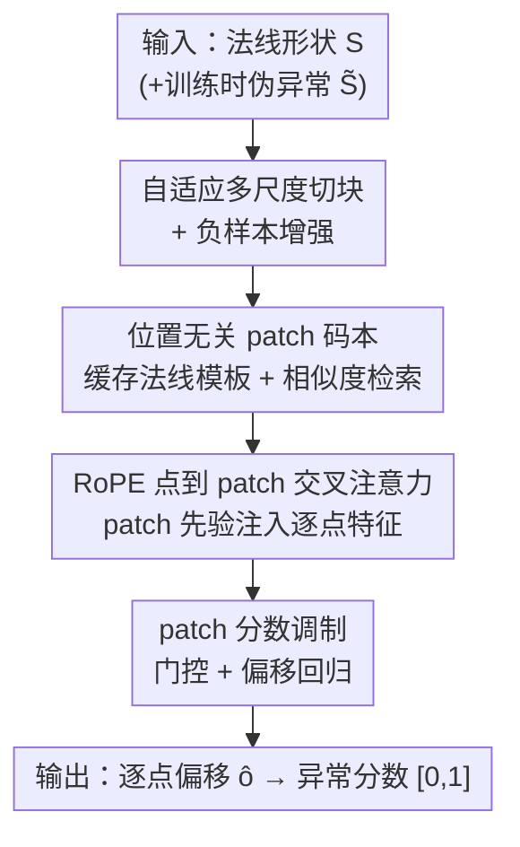

# Hierarchical Point-Patch Fusion with Adaptive Patch Codebook for 3D Shape Anomaly Detection

**会议**: CVPR 2026  
**论文**: [CVF Open Access](https://openaccess.thecvf.com/content/CVPR2026/html/Kang_Hierarchical_Point-Patch_Fusion_with_Adaptive_Patch_Codebook_for_3D_Shape_CVPR_2026_paper.html)  
**代码**: https://github.com/Shape-AnomalyCodebook （论文给出 github.com/Shape-AnomalyCodebook.git，⚠️ 完整仓库路径以原文为准）  
**领域**: 3D视觉 / 异常检测  
**关键词**: 3D形状异常检测, 多尺度patch, 特征码本, 点-patch融合, 偏移回归

## 一句话总结
本文提出一个分层「点-patch」融合网络，用自适应多尺度切块构建位置无关的法线 patch 特征码本，再通过 RoPE 交叉注意力把 patch 级先验注入逐点特征并回归异常偏移，在公开基准与自建工业数据集上对大尺度结构缺陷（平面位移、角度错位）的检测显著优于以往逐点方法。

## 研究背景与动机

**领域现状**：3D 形状异常检测要在制造业 3D 工件上定位结构或几何缺陷。主流做法把一批法线（正常）形状编码进隐空间作参考，再用分布外（OOD）检测或重建误差判定异常；近期出现双记忆分支、师生架构、RGB+点云多模态融合，以及对齐多视图投影的零/少样本方案。

**现有痛点**：现有方法基本只依赖**局部点表示**，对工业场景常见的**大尺度结构异常**（平面整体位移、齿轮角度错位）力不从心。重建类方法（DRAEM-A、R3D-AD）对噪声敏感、在平面/凹陷区域不稳定、严重依赖负样本增强；逐点/关键点类方法（PO3AD、3DKeyAD）擅长小局部缺陷，但对大结构位移、部件错位无能为力，而这类异常在公开基准里又恰恰被低估了。

**核心矛盾**：异常的尺度跨度极大——从几个点的细微凹陷到整块平面的几何错位。只在单一（局部点）粒度上建模，必然在另一端失效；缺乏对「不同尺度参考」的显式建模，是泛化差的根源。

**本文目标**：(1) 同时刻画区域部件特征与局部点特征，做尺度感知的鲁棒异常推理；(2) 补齐公开基准缺失的大结构缺陷评测，发布一个含平面位移、齿轮角度错位的真实工业测试集。

**切入角度**：把法线形状拆成**多尺度 patch**，将其特征缓存进一个轻量、位置无关的 patch 码本作为「正常几何字典」；测试时同样切块并与码本比对，用 patch 级差异引导逐点检测。多尺度参考让模型对不同大小的异常都有可对照的「正常长什么样」。

**核心 idea**：用「多尺度法线 patch 码本 + patch 引导的逐点偏移回归」替代单纯逐点 OOD/重建，使大结构异常与细局部缺陷在同一框架内都能被对照出来。

## 方法详解

### 整体框架
方法处理一个法线形状 $S\in\mathbb{R}^{N\times3}$：先做切块与负样本增强生成伪异常 $\tilde S$，对每个 patch 用预训练 3D U-Net 提特征；法线 patch 特征灌进多尺度码本，伪异常/测试 patch 以余弦相似度去码本检索最匹配的法线模板；随后用 RoPE 交叉注意力把检索到的 patch 先验融进逐点特征，再经 patch 分数调制门控，最终回归逐点异常偏移 $\hat o_i$ 并归一化成 $[0,1]$ 的异常分数。推理时只输入测试形状，patch 特征从预缓存码本检索。

### 关键设计

**1. 自适应多尺度切块与负样本增强：给不同尺度异常都备好可对照的参考**

逐点方法看不到「整块平面挪了位」，根因是没有区域级参考。本文对每个法线形状用 FPS 在三个尺度（如 patch 数 32/64/192、对应 patch 尺寸 64/32/8）切块，$p_1<p_2<p_3$ 分别对应精/中/粗分辨率，让网络同时建模局部细结构与更大范围的上下文。训练侧的负样本增强专门为「大结构缺陷」设计：随机选锚点，用沿法线方向的高斯核位移制造凹陷/下沉型异常，再用正弦波调制法线方向产生交替符号的凸起形变，并用立方/圆柱掩码做随机挖洞与平面切除来模拟缺失或位移表面。这样生成的伪异常更贴近真实工业缺陷，而非只有细小划痕。针对工业测试集，作者还反转 patch 尺度（patch 数 8/32/64、尺寸 192/64/32）以**强调大结构变化**。

**2. 位置无关 patch 特征码本：把「正常几何」压成可复用、抗平移的字典**

patch 特征 $p^{(l)}_j=f\!\big(\frac{1}{|N^{(l)}_j|}\sum_{i}(x^{(l)}_{j,i}-c^{(l)}_j)\big)$ 用 patch 内点相对质心的分布计算，天然**平移不变**；码本以 patch 位置的空间哈希为 key、特征为 value，按到物体质心的距离排序。当形状存在对称（如四个相同角块）时，同一 patch 特征只存一次、按位置哈希复用，显著省内存。码本更新走阈值合并：新特征与已有项算余弦相似度 $s_i$，若 $s_i\ge\tau=0.85$ 则按计数加权合并 $c_i\leftarrow\frac{n_i c_i+s_i t_j}{n_i+s_i}$ 抑制冗余，否则新建条目保留几何多样性。推理时测试 patch 作 query 在三个尺度各检索，尺度相似度 $\alpha^{(l)}=\sum_j p^{(l)}_j\!\cdot t^{(l)}_j$ 取对角和，再 $\arg\max_l\alpha^{(l)}$ 选最佳尺度引导后续调制——这让局部与全局对应都被纳入，对几何尺度变化更鲁棒。

**3. RoPE 点到 patch 交叉注意力：把 patch 级先验对齐进逐点特征**

光有 patch 检索还不够，得让每个点「知道自己应当长成哪块法线 patch」。逐点特征 $z_i$ 映射成 query，检索到的码本 patch 特征 $t_k$ 作 key/value，做多头交叉注意力。为编码点与其 patch 中心的**相对空间关系**，引入旋转位置编码 $\text{RoPE}(x_i,\bar x_i)=R^d_{\Theta,i}(x_i-\bar x_i)$，按角度偏移旋转特征嵌入；注意力用非负特征映射 $\phi(x)=\varphi(x)=\text{elu}(x)+1$ 的线性注意力形式聚合（见公式 5）。这样每个点都向其最近法线 patch 几何对齐，既能放大细局部缺陷，又能感知大结构错位。

**4. patch 分数调制与偏移回归：用「正常-异常 patch 差异」门控逐点预测**

匹配的法线 patch $t_k$ 与异常 patch $p_j$ 的差异 $\Delta f_{kj}=(1-t_k\cdot p_j)$ 度量「这块有多不正常」。门控 $\rho_i=\sigma_i(\text{MLP}_{gate}(\Delta f_{kj}))\in[0,1]$ 估计异常似然，调制网络预测缩放/平移 $(\gamma_i,\beta_i)$，得到 $z'_i=\rho_i\odot(\gamma_i\odot\hat z_i+\beta_i)$，自适应地按 patch 差异加权每个点的贡献。最后 $z'_i$ 与注意力特征 $\hat z_i$ 拼接送 MLP 残差预测偏移 $\hat o_i=\text{MLP}(\text{Concat}[z'_i,\hat z_i])+\hat z_i$，把异常点「指回」其应在的法线位置。

### 损失函数 / 训练策略
总损失 $L_{anomaly}=L_{dist}+\lambda_{sim}L_{sim}+\lambda_{BCE}L_{BCE}$（$\lambda_{sim}=\lambda_{BCE}=0.5$）。$L_{dist}=\frac1N\sum\|\hat o_i-o^{gt}_i\|_1$ 约束偏移幅度；$L_{sim}$ 是余弦方向损失，鼓励预测偏移方向对齐真值；$L_{BCE}$ 监督异常符号掩码 $\hat m_i$（凹/凸方向）。三项联合约束幅度、方向与符号一致性。推理时偏移幅度按 PO3AD 的 L1 归一化策略得到 $\hat\delta_i\in[0,1]$，仅对掩码判定为有效的点计分。骨干为在大规模 3D 数据上预训练的 Minkowski 3D U-Net；输入归一化到正则空间并体素化到 $256^3$；各类训练 1500 epoch，Adam，学习率 $1\times10^{-3}$。

## 实验关键数据

### 主实验
三个数据集：Anomaly-ShapeNet（40 类、1600 样本）、Real3D-AD（12 类，每类 4 个法线模板 + 100 测试）、自建工业集（8 法线 + 8 异常，含角度错位与平面位移）。指标为 AUC-ROC 与 AUC-PR。

| 数据集 | 指标 | 本文相对最优基线的提升 | 说明 |
|--------|------|------|------|
| Anomaly-ShapeNet（40 类） | object-level AUC-ROC | 取得 SOTA 平均；仅个别类（bottle0/eraser0/helmet0）低 PO3AD 约 3%–5% | 整体仍领先 |
| Real3D-AD（12 类） | object-level AUC-ROC | 平均较次优方法高约 **7.5%** | 个别类（Chicken/Diamond/Fish）次优更好 |
| 自建工业集 | point-level AUC-ROC | 超 PO3AD **50%+**，R3D-AD 在多数样本失效 | 大角度错位/平面位移最能拉开差距 |

> 摘要口径：工业新异常类型上 point-level 提升 **40%+**，Real3D-AD 平均 **+7%**、Anomaly-ShapeNet 平均 **+4%**。⚠️ 缓存正文给出 Real3D-AD「7.5% margin over 2nd best」、工业集「50%+」，与摘要的 7%/40% 口径略有出入（对比基线/指标不同所致），以原文表格为准。

### 消融实验
| 配置 | 关键趋势 | 说明 |
|------|---------|------|
| Full model | 最优 | 多尺度切块 + 码本 + RoPE 融合 + 调制 |
| w/o 负样本增强 | 显著下降 | 失去伪异常监督，判别能力大幅退化 |
| 多尺度球切块 vs 语义部件/3D网格/FPS体素 | 多尺度球切块最佳 | 语义部件粒度太粗，缺乏细几何匹配能力 |

推理开销分解（RTX 3090，batch=1）：3D U-Net 骨干占 **51.7%**、RoPE 交叉注意力解码 **29.4%**、FPS 切块 **14.4%**、MLP 头 **4.5%**；整体推理 178 ms（PO3AD 172 ms、R3D-AD 183 ms），显存 2125 MB（PO3AD 2013 MB、R3D-AD 2318 MB）。

### 关键发现
- **负样本增强是命门**：去掉后掉点最猛，说明伪异常的多样性（凹/凸/挖洞/平面切除）直接决定判别力。
- **切块粒度有甜区**：体素分辨率 ≥$128^3$、patch 数 ≥128 后收益饱和；patch 尺寸在 64 达峰，过大（128/256）会模糊细异常边界。
- **大结构异常是最大增量来源**：工业集上的 50%+ 优势远超公开基准的个位数提升，印证「多尺度参考」专治逐点方法的盲区。

## 亮点与洞察
- **把异常检测重述成「逐点偏移回归」+「patch 级门控」**：偏移既给定位也给方向，比单纯输出异常分数信息量更大，且门控让 patch 差异显式调控每个点的权重——是可迁移到 2D/多模态异常检测的范式。
- **位置无关码本 + 对称复用**：用相对质心分布换平移不变性，再靠空间哈希让对称区域只存一次，是把「记忆库」做轻量的实用 trick。
- **多尺度检索用 $\arg\max_l\alpha^{(l)}$ 自适应选尺度**：不固定一个粒度，而是让数据自己挑最匹配的尺度参与调制，对尺度多变的工业缺陷很对症。
- **补基准短板**：作者点出公开基准低估大结构缺陷并自建工业集，这种「先指出评测盲区、再造数据」的做法本身有方法论价值。

## 局限与展望
- **依赖负样本增强的真实性**：伪异常虽精心设计，但若真实缺陷类型超出高斯位移/正弦凸起/掩码挖洞的覆盖，仍可能漏检；增强策略的几何先验是隐含假设。
- **工业集规模很小**（8+8）：每类仅一个实例导致 object-level 指标不可用、只能用 point-level，结论的统计稳健性有限。
- **多尺度切块带来超参负担**：尺度数/patch 数/尺寸需按数据集调（公开集与工业集甚至反转尺度），缺乏自动选尺度机制。
- **骨干占了一半算力**：3D U-Net 占 51.7% 推理时间，端侧部署需考虑更轻量骨干。

## 相关工作与启发
- **vs PO3AD**：两者都做逐点偏移回归，但 PO3AD 只用局部几何、缺多尺度区域参考，在大结构位移与未见类上泛化差；本文用码本提供多尺度法线对照，工业集 point-level AUC-ROC 高 50%+。
- **vs R3D-AD / DRAEM-A（重建类）**：靠重建误差判异常，对噪声敏感、平面/凹陷不稳定；本文不重建整形，而是检索 patch 模板 + 回归偏移，对平面位移更稳。
- **vs Reg3D-AD / 记忆库类**：传统记忆库存局部点特征做 OOD 投影，本文把记忆做成**多尺度、位置无关、对称复用**的 patch 码本，并用 RoPE 交叉注意力把先验注入逐点，而非只比距离。

## 评分
- 新颖性: ⭐⭐⭐⭐ 多尺度位置无关码本 + patch 引导逐点偏移回归的组合在 3D 异常检测里较新，但各组件（FPS 切块、记忆库、RoPE、偏移回归）多为已有零件重组
- 实验充分度: ⭐⭐⭐⭐ 三数据集 + 时间/显存/超参/切块策略消融较全；自建工业集规模偏小、object-level 指标缺失
- 写作质量: ⭐⭐⭐⭐ pipeline 与公式交代清晰，但摘要与正文提升口径（7% vs 7.5%、40% vs 50%）不完全一致
- 价值: ⭐⭐⭐⭐ 直击工业大结构缺陷这一被低估场景，并补了评测数据，落地价值明确

<!-- RELATED:START -->

## 相关论文

- [\[CVPR 2026\] MoECLIP: Patch-Specialized Experts for Zero-shot Anomaly Detection](moeclip_patch-specialized_experts_for_zero-shot_anomaly_detection.md)
- [\[CVPR 2026\] Back to Point: Exploring Point-Language Models for Zero-Shot 3D Anomaly Detection](back_to_point_exploring_point-language_models_for_zero-shot_3d_anomaly_detection.md)
- [\[ICLR 2026\] PAANO: Patch-Based Representation Learning for Time-Series Anomaly Detection](../../ICLR2026/object_detection/paano_patch-based_representation_learning_for_time-series_anomaly_detection.md)
- [\[CVPR 2026\] Geometry-Aligned and Anomaly-Aware Reconstruction for 3D Anomaly Detection](geometry-aligned_and_anomaly-aware_reconstruction_for_3d_anomaly_detection.md)
- [\[CVPR 2026\] CHAL: Causal-guided Hierarchical Anomaly-aware Learning for Moving Infrared Small Target Detection](chal_causal-guided_hierarchical_anomaly-aware_learning_for_moving_infrared_small.md)

<!-- RELATED:END -->
