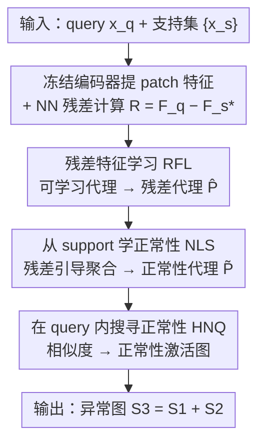

# Hunting Normality from Query Sample via Residual Learning for Generalist Anomaly Detection

**会议**: CVPR 2026  
**论文**: [CVF Open Access](https://openaccess.thecvf.com/content/CVPR2026/html/Wang_Hunting_Normality_from_Query_Sample_via_Residual_Learning_for_Generalist_CVPR_2026_paper.html)  
**代码**: 论文提及 "Code is available at HNQ-GAD"（⚠️ 完整仓库链接以原文/项目页为准）  
**领域**: 异常检测 / 少样本学习  
**关键词**: 通用异常检测, 残差特征, 跨域泛化, 注意力代理, 正常性建模

## 一句话总结
针对通用异常检测（GAD）中「直接建模残差分布」会因残差与实例特征不一致而误判的问题，本文不再直接对残差分类，而是把残差当成**向导**：用可学习代理从残差里抽取模式（RFL），再借这些残差代理从支持集聚合查询相关的「正常性代理」（NLS），最后用正常性代理去查询特征里**搜寻正常区域**（HNQ）来定位异常，在工业→工业、工业→医学的跨域基准上取得有竞争力的少样本性能。

## 研究背景与动机

**领域现状**：传统异常检测（AD）一类一模型、单域训练测试，换到未见类就得重训/微调，迁移性差。通用异常检测（GAD，如 InCTRL、ResAD）想在源域训一个统一模型，泛化到目标域的未见类。一个有前景的思路是**残差特征**：把 query 特征减去支持集中最近的法线特征，抹掉类相关信息、得到更**类不变**的空间。

**现有痛点**：ResAD 等直接**建模残差分布**，假设法线残差聚成一簇、异常残差落在簇外。但残差只是异常的**间接信号**：细微缺陷可能只产生**小残差**而被误判为正常（漏检 / false negative）；两个正常特征因「正常性本身多样」也可能算出**大残差**而被误判为异常（误检 / false positive）。

**核心矛盾**：残差与实例特征之间存在**不一致性**——「query 与 support 差异大」不等于「异常」。直接对残差分布画边界，等于把一个不可靠的代理信号当成判据，风险不可控。

**本文目标**：既要吃下残差的跨域可迁移性，又要绕开「直接建模残差分布」的风险，做到在未见目标域上仍精准定位异常。

**切入角度**：异常残差模式复杂、易与正常残差重叠，与其费力刻画「异常长什么样」，不如反过来**聚焦 query 里的正常性**。残差天生可迁移，那就先用它学到丰富残差模式，再把这些模式**转移**到正常实例空间去学「正常实例长什么样」，最后拿动态生成的正常原型去 query 里找正常、剩下的就是异常。

**核心 idea**：把残差从「被分类的对象」改造成「引导信号」——学一个「残差模式 ↔ 实例级正常性」的可迁移关系，用残差去**hunt normality**，而不是直接对残差建分布。

## 方法详解

### 整体框架
给定 query 样本 $x^q$ 和 $K$ 个法线支持样本 $\{x^s_k\}$，先用冻结编码器（ViT）提 patch 级特征 $F^q,\{F^s_k\}$；对每个 query patch 在支持集做最近邻搜索并相减，得残差 patch 特征 $R$。残差虽类不变但仍有实例间不一致，于是 RFL 用一组可学习代理 $P$ 通过交叉注意力抽取残差模式、输出残差代理 $\hat P$；NLS 再用 $\hat P$ 作向导、以残差引导注意力从支持特征里聚合出 query 相关的正常性代理 $\tilde P$；最后 HNQ 计算正常性代理与 query patch 特征的相似度得到正常性激活图，反过来给出异常图。推理时同样的 RFL/NLS 为目标样本**动态**生成新的正常性代理，无需在目标域重训。

### 关键设计

**1. 残差当向导而非分类对象：从「建模残差分布」转向「用残差学正常性」**

这是全文的范式翻转，针对的正是残差与实例特征的不一致。残差 $r=f^q-f^s_*$（$f^s_*$ 是 query 在支持集里的最近邻）虽抹掉了类信息、利于跨域，但「差异大」既可能是异常也可能只是正常性多样，直接对 $R$ 分类会同时产生漏检与误检。本文因此不去给残差画决策边界，而是学一个「残差模式 → 实例级正常性」的可迁移映射：残差只负责**指路**，真正用来判异常的是从支持集学到的正常原型。由于异常残差易与正常残差重叠、模式复杂，作者刻意**只刻画正常性**、让异常作为「正常性的补」自然浮现，从根上回避了对不可靠异常残差的建模。

**2. RFL（残差特征学习）：用可学习代理把整个残差空间压成一组残差原型**

直接逐 patch 用残差会把噪声和不一致也带进来。RFL 初始化 $M$ 个可学习代理 $P\in\mathbb{R}^{M\times C}$ 作 query，残差 $R$ 作 key/value 做交叉注意力，再过一层自注意力得残差代理 $\hat P=\text{SA}_1(\text{Softmax}(Q_1K_1^\top/\sqrt d)V_1)$（$Q_1=W^Q_1P,\ K_1=W^K_1R,\ V_1=W^V_1R$）。因为 key、value 都来自 $R$，$\hat P$ 含整个残差空间的信息，可视为**残差原型**——把零散、含噪的逐 patch 残差汇聚成少量、稳定、可迁移的模式表示。

**3. NLS（从支持集学正常性）：用残差代理把模式「翻译」回正常实例空间**

残差代理还在残差空间，不能直接判正常。NLS 的核心是**残差引导注意力（RG-Attention）**：$Q_2=W^Q_2\hat P,\ K_2=W^K_2R,\ V_2=W^V_2\bar F^s$，其中 $\bar F^s=\frac1K\sum_k F^s_k$ 是支持特征均值。注意力权重由「残差代理 $\hat P$ 与残差嵌入 $R$ 的相关」隐式算出，再拿去聚合**支持特征** $V_2$，从而把残差里学到的模式对应到支持集的正常实例模式上，输出位于**实例特征空间**的正常性代理 $\tilde P=\text{SA}_2(\text{Softmax}(Q_2K_2^\top/\sqrt d)V_2)$。关键在于 value 换成了支持特征而非残差——这一步完成了「残差模式 ↔ 实例级正常性」的转移，且 $\tilde P$ 是按当前 query/support 对**动态生成**的，而非一套静态分布。

**4. HNQ（在 query 内搜寻正常性）：用正常性代理找正常、其补即异常**

有了 query 相关的正常性代理 $\tilde P$，就在 query patch 特征上算相似度得正常性激活图：$S_0^l=\frac1M\sum_m \frac{f^q_l\cdot\tilde P_m}{\|f^q_l\|\|\tilde P_m\|}$，初始异常图 $S_1=1-S_0$。再叠加一张基于 query 与支持特征 NN 距离的异常图 $S_2$，最终预测 $S_3=S_1+S_2$。即「越像正常原型 → 越正常」，剩下对不上的区域即异常。结合两路（学到的正常性 + 原始 NN 距离）让定位更稳，避免只靠单一线索。

### 损失函数 / 训练策略
框架以 episodic（每个 episode 一个 query + $K$ 个同类法线 support）方式训练。定位损失 $L_{local}=\text{Focal}(S_3,y^q)+\text{Dice}(S_3,y^q)$ 监督像素级异常图与 GT 掩码对齐；图像级损失 $L_{global}=\text{BCE}(S_3^*,y^q)$（$S_3^*$ 为 $S_3$ 的最大值）监督样本级标签。总目标 $L=L_{global}+L_{local}$。编码器全程冻结，只训 RFL/NLS 等可学习模块；推理时在目标域同样跑一遍 RFL→NLS 动态生成正常性代理，无需重训。

## 实验关键数据

### 主实验
三基准：MVTec AD、VisA（工业）、BraTS（医学）。三个迁移设置：VisA→MVTec、MVTec→VisA、MVTec→BraTS（工业→医学）。报告图像级（AUROC/AP/F1-max）与像素级（AUROC/PRO/F1-max），评估 1/2/4-shot。

| 设置 | 指标 | 本文 | 强基线对比 |
|------|------|------|-----------|
| 1-shot 测 MVTecAD（VisA 训） | 图像 AUROC | **96.0** | PromptAD 94.6 / WinCLIP 93.1 / ResAD\* 84.8 |
| 1-shot 测 MVTecAD | 像素 AUROC / PRO | **96.4 / 92.5** | PromptAD 95.9 / 87.9 |
| 1-shot 测 VisA（MVTec 训） | 图像 AUROC | **87.3** | PromptAD 86.9 / WinCLIP 83.8 / ResAD\* 80.9 |
| 1-shot 测 VisA | 像素 AUROC / PRO | **97.6 / 91.4** | PromptAD 96.7 / 85.1 |

注：ResAD\* 为作者复现。本文在像素级 PRO 上提升尤其明显（MVTec 1-shot 92.5 vs PromptAD 87.9，VisA 1-shot 91.4 vs 85.1），印证「学正常性」对**定位**更友好。

### 消融实验（随 shot 数变化）
| 配置 / shot | 图像 AUROC（MVTec） | 图像 AUROC（VisA） | 说明 |
|------|------|------|------|
| 1-shot 本文 | 96.0 | 87.3 | 单张法线参考即超 PromptAD |
| 2-shot 本文 | 97.2 | 88.0 | 支持样本增多稳定提升 |
| 2-shot ResAD\* | 87.2 | 86.6 | 直接建残差分布，明显落后 |
| 4-shot（趋势） | 继续上升 | 继续上升 | 与 WinCLIP/PatchCore 同向但更高 |

> ⚠️ 缓存中 4-shot 本文具体数值未完整给出（表格被截断），此处仅列可读到的趋势；精确数字以原文 Tab.1 为准。

### 关键发现
- **PRO 提升最大**：相比图像级 AUROC 的个位数领先，像素级 PRO 的优势（+4~6 个点）更突出，说明「正常性激活图」对异常**区域重叠度**特别有利。
- **直接建残差分布吃亏**：ResAD（直接对残差建分布）在各 shot 下都明显落后本文，验证了「残差-实例不一致」确实带来不可控风险这一动机。
- **跨域到医学仍可用**：MVTec→BraTS 设置说明从工业训练的「残差→正常性」关系能迁移到医学影像，支撑 GAD 的通用性主张。

## 亮点与洞察
- **「hunt normality」的视角转换很妙**：异常多样难穷举、正常相对集中可建模，专注 query 内的正常性、把异常当补集，是对「类别开放」难题的务实解法，可迁移到开集分割/OOD 检测。
- **残差从判据降级为向导**：保留残差的跨域能力，又用两段注意力（RFL→NLS）把它「翻译」回实例空间，回避了直接分类残差的脆弱性——这种「用不可靠信号引导、而非直接决策」的设计模式值得复用。
- **动态正常性代理**：$\tilde P$ 随每个 query/support 对实时生成，而非一套静态原型/记忆库，天然适配未见类，无需目标域重训。
- **双图融合 $S_3=S_1+S_2$**：把学到的正常性与朴素 NN 距离互补，低成本提升定位鲁棒性。

## 局限与展望
- **依赖支持集质量与最近邻**：残差来自 NN 搜索，若支持法线样本与 query 类差异大或 NN 选错，残差与后续代理都会被带偏。
- **代理数 $M$ 是隐超参**：可学习代理数量需权衡表达力与过拟合，论文未充分展开其敏感性。
- **冻结 ViT 的表征上限**：编码器全程冻结，目标域若与预训练分布相差太远，patch 特征本身可能不够判别。
- **像素级 F1-max 并非全面领先**：部分设置下本文 F1-max 略低于 WinCLIP/PromptAD，说明在阈值化的硬判定上仍有提升空间。

## 相关工作与启发
- **vs ResAD**：同用残差，但 ResAD 直接学残差分布、假设异常残差落簇外；本文指出残差-实例不一致会带来漏检/误检，改为用残差**引导**学正常性，2-shot 图像 AUROC 在 MVTec 上 97.2 vs 87.2。
- **vs InCTRL**：InCTRL 首提 GAD、用残差距离判异常，仍是「拿残差直接打分」；本文把残差当向导、动态生成正常原型，泛化与定位都更稳。
- **vs WinCLIP / PromptAD（CLIP 系少样本）**：靠文本提示对齐做零/少样本 AD；本文不依赖语言先验，纯靠残差引导的正常性建模，在像素级 PRO 上反超它们，路线互补。

## 评分
- 新颖性: ⭐⭐⭐⭐ 「残差当向导、专注 query 正常性」的视角翻转有新意，但 RFL/NLS 仍是交叉/自注意力代理的标准积木
- 实验充分度: ⭐⭐⭐⭐ 三基准 + 工业→医学跨域 + 1/2/4-shot 较全；部分 4-shot 数值与更细消融在正文略有缺口
- 写作质量: ⭐⭐⭐⭐ 动机（残差不一致）论证清晰、图示充分，公式记号偶有繁复
- 价值: ⭐⭐⭐⭐ 给「残差类 GAD」指出真问题并给出务实解法，对未见类异常定位有实用价值

<!-- RELATED:START -->

## 相关论文

- [\[CVPR 2026\] Anomaly-Related Residual Fields for Cross-domain Anomaly Detection](anomaly-related_residual_fields_for_cross-domain_anomaly_detection.md)
- [\[NeurIPS 2025\] Normal-Abnormal Guided Generalist Anomaly Detection](../../NeurIPS2025/object_detection/normal-abnormal_guided_generalist_anomaly_detection.md)
- [\[CVPR 2026\] Dual-Prototype-Guided Multi-task Learning for Unsupervised Anomaly Detection and Classification](dual-prototype-guided_multi-task_learning_for_unsupervised_anomaly_detection_and.md)
- [\[CVPR 2026\] CHAL: Causal-guided Hierarchical Anomaly-aware Learning for Moving Infrared Small Target Detection](chal_causal-guided_hierarchical_anomaly-aware_learning_for_moving_infrared_small.md)
- [\[CVPR 2026\] Bidirectional Multimodal Prompt Learning with Scale-Aware Training for Few-Shot Multi-Class Anomaly Detection](bidirectional_multimodal_prompt_learning_with_scale-aware_training_for_few-shot_.md)

<!-- RELATED:END -->
